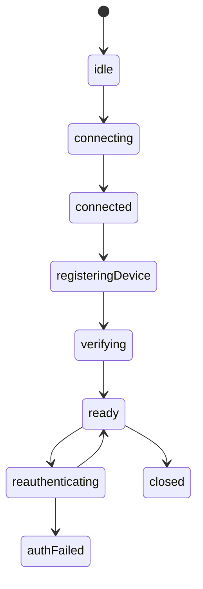
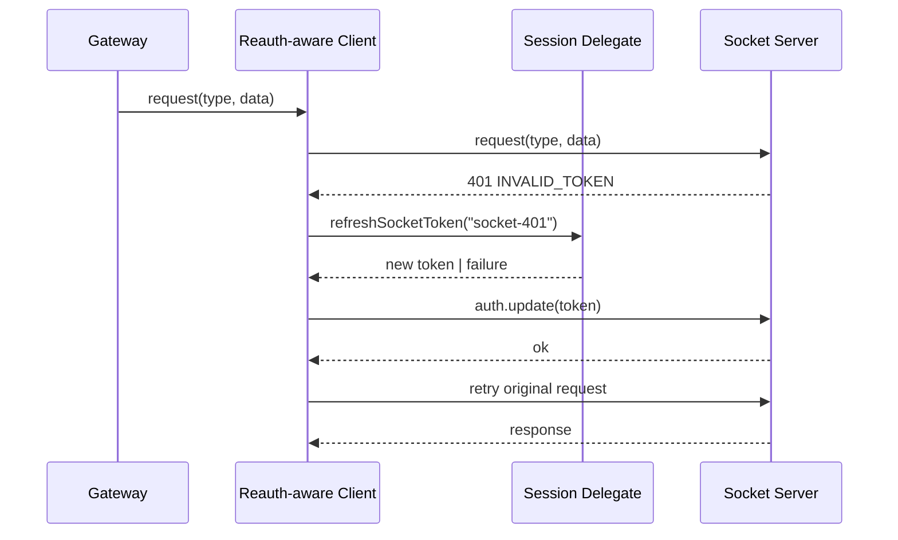

# Socket Domain Spec

Date: 2026-06-18

## 1. 목적

`socket` 도메인은 WebSocket 연결, 인증 검증 상태, device registration, 재인증 시퀀스를 책임진다.

## 2. 핵심 결정

- gateway는 유지한다.
- gateway는 `ClientSocketV2`의 `request()` 또는 `send()`를 사용하는 thin facade로 본다.
- `401` 인터셉트는 gateway 내부가 아니라 client wrapper의 `request()` 경계에서 수행한다.
- refresh 정책은 상위 세션 레이어가 제공한다.
- `socket` 도메인은 `401 -> refresh -> auth.update -> 원요청 재시도`를 수행한다.
- `send()` 기반 호출은 verification state 또는 별도 auth failure signal로 보호한다.

## 3. 내부 구성

### `SocketManager`

- raw client 생성/교체
- connection state 관리
- scope/config 변경 반영
- ack 기반 verified/deviceRegistered 상태 반영

### `Reauth-aware Client`

- 공통 `request()` interception
- 공통 `send()` 진입 제어
- 인증 만료 에러 식별
- single-flight 재인증 제어
- `auth.update` 수행
- 원요청 재시도

### `SocketSessionState`

- `idle`
- `connecting`
- `connected`
- `registeringDevice`
- `verifying`
- `ready`
- `reauthenticating`
- `authFailed`
- `closed`

## 4. 상태 모델



## 5. 재인증 시퀀스



## 6. 인터셉트 위치 결정

인터셉트 위치는 `ClientSocketV2`를 감싼 wrapper 계층이다.

이유:

- gateway들이 공통으로 client 경계를 사용한다.
- request 기반 호출은 하나의 interception 포인트에서 재인증을 공통 처리할 수 있다.
- gateway별로 중복 처리하지 않아도 된다.
- repository나 datasource가 reauth를 몰라도 된다.
- `auth.update`와 일반 도메인 요청을 같은 정책으로 다룰 수 있다.

세부 규칙:

- `request()` 기반 호출은 `401` 응답을 가로채 재인증 후 재시도한다.
- `send()` 기반 호출은 응답을 직접 받을 수 없으므로 동일한 retry 모델을 사용하지 않는다.
- `send()`는 현재 socket verification 상태를 선행 조건으로 사용하거나, server auth failure event를 별도로 감지한다.

## 7. 실패 규칙

- `auth.update` 요청 자체는 무한 재시도하지 않는다.
- 한 번의 refresh 주기 동안 동시 `401` 요청은 하나의 single-flight로 합친다.
- refresh 실패 시 상태를 `authFailed` 또는 `unverified`로 전이한다.
- `send()` 기반 호출은 verified 상태가 아니면 차단하거나 no-op/error 규칙을 명시한다.
- 복구 불가 상태 후속 처리는 상위 세션 레이어에 위임한다.

## 8. 도메인 API 계약

```ts
export interface SocketSessionDelegate {
    getSocketToken(): Promise<string | null>;
    refreshSocketToken(reason: 'bootstrap' | 'socket-401' | 'reconnect'): Promise<string | null>;
    onRefreshFailed?(error: unknown): Promise<void> | void;
}
```

```ts
export interface ReauthAwareSocketClient {
    request<T>(type: string, data?: unknown, options?: { timeoutMs?: number }): Promise<T>;
    send<T>(message: { type: string; data?: T }): void;
    onType<T>(type: string, listener: (message: T) => void): () => void;
}
```

## 9. 구현 기준

- `SocketClientAdapter`는 단순 rebinding facade 역할만 남기거나 reauth wrapper 하위로 이동한다.
- `SocketAuthCoordinator`의 토큰 조회/refresh 책임은 제거한다.
- `useCloudTokenRefresh()`에 있는 socket 재인증 시퀀스는 제거하고 상위 실행 컨텍스트 레이어 또는 별도 세션 계층으로 이동한다.
- `SocketManager`는 상태 수집 및 lifecycle 관리에 집중한다.
- `device.sync` 같은 `send()` 기반 API의 인증 보호 규칙을 별도 정의한다.
