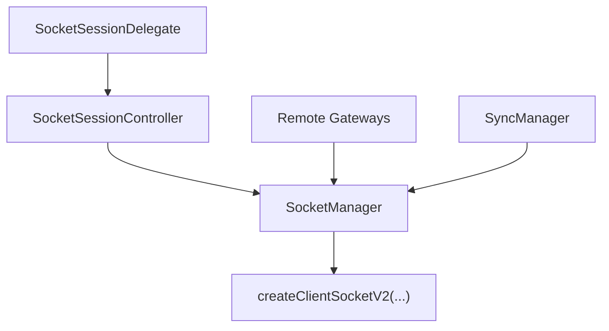

# Socket Domain Spec

Date: 2026-06-24
Status: Target Architecture

## 목적

`socket` 도메인은 `@lemoncloud/chatic-sockets-lib` v2 기반 transport를 앱이 안정적으로 사용하도록 감싸는 레이어다.

이 문서의 핵심은 두 가지다.

1. socket client 생성은 `SocketManager`가 소유한다.
2. 인증/세션 제어는 `SocketSessionController`가 소유한다.

## 핵심 구조



## 컴포넌트 책임

### `SocketManager`

책임:

- `ClientSocketV2` 생성, 교체, destroy
- 현재 client 상태 보관
- stable `request/send/onType/onMessage/onState`
- socket 교체 시 listener 재바인딩
- observable `SocketState` 제공

비책임:

- token refresh 정책
- bootstrap orchestration
- sync runtime 생성

핵심 판단:

- `ManagedSocketClientProxy`는 별도 레이어로 유지하지 않는다.
- 그 역할은 `SocketManager`에 흡수한다.

### `SocketSessionController`

책임:

- `bootstrap(config)`
- `device.save` acknowledgement 관찰
- `auth.update`
- 1분 주기 auth refresh
- single-flight 401 recovery

비책임:

- client 생성/교체
- sync target 관리

## 상태 모델

`SocketState`는 최소한 아래 정보를 가진다.

- `state`
- `isConnected`
- `isVerified`
- `connectionId`

주의:

- `device` 등록 여부는 runtime 내부 세부 구현으로 내려가므로 socket public state에 다시 드러내지 않는다.
- `isVerified`는 `auth.update` 성공 여부를 의미한다.

## 생성 규칙

### `createClientSocketV2`

- `SocketManager` 내부에서만 호출한다.
- config가 같으면 기존 client를 재사용할 수 있다.
- config가 바뀌면 기존 client를 파기하고 새 client를 생성한다.

## 인증 규칙

### bootstrap

순서:

1. `SocketManager.ensure(config)`
2. `SocketManager.connect()`
3. `device.save:*` 응답 관찰
4. `auth.update`
5. `isVerified = true`

### periodic refresh

- 연결 중일 때만 수행한다.
- `delegate.getSocketToken()` 결과가 있을 때만 `auth.update`를 보낸다.

### 401 recovery

- single-flight로 동작한다.
- `delegate.refreshSocketToken('socket-401')` 호출 후 `auth.update` 재실행
- 성공 시 원요청 재시도
- 실패 시 `isVerified = false`

## site 전환 규칙

- site 전환은 항상 새 socket 생성과 동치가 아니다.
- `url/deviceId/wssType`가 같더라도 auth 문맥은 바뀔 수 있다.
- 따라서 site 또는 identity token 변경 시 `SocketAuthBinder`가 `SocketSessionController.updateAuth('session-switch')`를 호출해야 한다.

이 규칙이 빠지면:

- data context는 새 `sid`를 보지만
- 서버는 이전 site 세션 기준으로 현재 socket을 해석할 수 있다.

## 외부 계약

### `SocketSessionDelegate`

```ts
export interface SocketSessionDelegate {
    getSocketToken(): Promise<string | null>;
    refreshSocketToken(reason: 'bootstrap' | 'socket-401' | 'reconnect'): Promise<string | null>;
    onRefreshFailed?(error: unknown): Promise<void> | void;
}
```

### gateway 사용 규칙

- gateway는 raw client를 직접 참조하지 않는다.
- gateway는 `SocketManager`의 stable API만 사용한다.
- request 재시도와 listener 유지 책임은 socket 계층이 가진다.

## 구현 메모

정렬 완료 (2026-06-24): `ManagedSocketClientProxy`는 제거되었고 request facade(request/send/onType rebind + 401 재시도)는 `SocketManager`에 흡수되었다.

도달한 상태:

- gateway 참조점은 `SocketManager` 하나
- 세션 참조점은 `SocketSessionController` 하나
- 401 재시도 메커니즘은 `SocketManager.request`, 복구 정책은 주입된 핸들러(controller)
