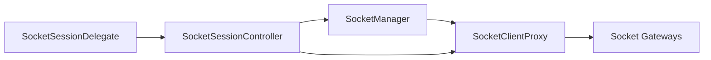
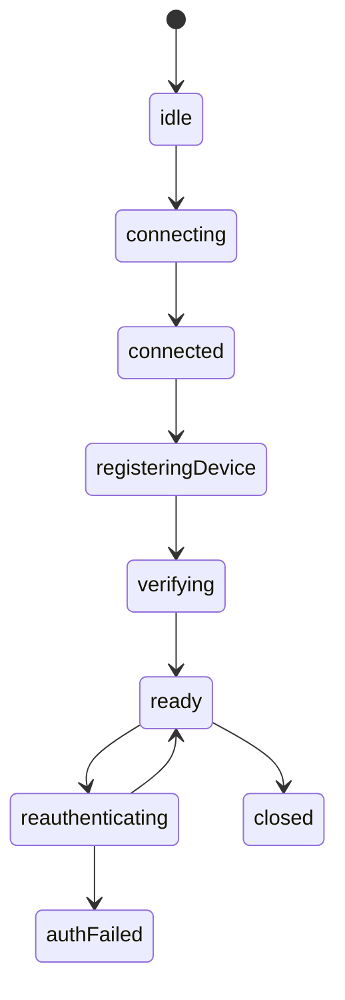

# Socket Domain Spec

Date: 2026-06-18

## 1. 목적

`socket` 도메인은 WebSocket 연결, stable client proxy, 인증 검증 상태, device registration, 재인증 시퀀스를 책임진다.

## 2. 현재 구현 관찰

### `SocketManager`

- raw `ClientSocketV2` 생성/교체
- connection state 관리
- scope/config 변경 반영
- `device.save:ok`, `device.read:ok`, `auth.update:ok` ack 기반 상태 반영

### `SocketClientProxy`

- socket instance 교체 시 listener 재바인딩
- gateway와 dispatcher에 stable client 표면 제공
- `ISocketClient`의 공식 구현체로 사용
- 현재는 reauth-aware wrapper가 아니라 transport-stable proxy 역할만 수행

### `SocketAuthCoordinator` (교체 대상 레거시)

- 현재 `web-core` 토큰 소스에 직접 의존
- `auth.update`와 cloud token refresh 일부 수행
- 위치는 `runtime` 아래지만 책임상 `socket` 성격이 강함
- **이 계층과 `connection/WebSocketV2Connection`은 목표 구조가 아니라 제거·교체 대상이다.** 새 와이어링은 `SocketSessionController`(이름 잠정) + delegate 주입으로 재구성하며, 앱 측 마운트 방식(훅/컴포넌트)은 [runtime/runtime.md](../runtime/runtime.md) §13을 따른다.

## 2-1. 5개 책임 분해

`socket` 도메인의 책임은 아래 5개로 나뉜다. 이는 **별도 클래스 신설이 아니라 현 구조 위의 책임 라벨**이다.
1·4·5의 상태는 모두 **`SocketManager`의 관측 가능한 상태 store**(`isConnected`/`isVerified`/`isDeviceRegistered`/`connectionId`)에 반영된다 — 별도 상태 모듈을 두지 않는다.
2·3·4·5의 순서/재시도는 bootstrap·reauth 오케스트레이션 계층(`SocketSessionController` 또는 동등 계층)이 소유한다.

| #   | 책임                    | 트리거                                   | 상태 반영                                                                 | 실패 정책                                                                                                                 |
| --- | ----------------------- | ---------------------------------------- | ------------------------------------------------------------------------- | ------------------------------------------------------------------------------------------------------------------------- |
| 1   | 소켓 관리 모듈          | scope/config 변경                        | `state`/`isConnected`/`connectionId`                                      | scope 1:1 재생성 (config·scope 변경 시 teardown 후 신규 생성)                                                             |
| 2   | 주기 리프레시           | 타이머 (web-core ② 리프레시 루프와 연동) | `auth.update:ok` → `isVerified` 유지                                      | `sid` 없으면 skip, 다음 주기 재시도                                                                                       |
| 3   | 401 리프레시 + 리트라이 | `request()` 응답 errorCode `401`         | reauth 후 `auth.update:ok` → `isVerified`                                 | single-flight. **#2와 달리 `siteId`를 포함한 cloud 세션 refresh(`refreshCloudSession`)까지 수행** 후 `auth:update` 재시도 |
| 4   | device 등록             | bootstrap의 `device.save` 요청           | `device.save:ok`/`device.read:ok` → `isDeviceRegistered`(+`connectionId`) | 실패 시 retry                                                                                                             |
| 5   | auth 업데이트           | bootstrap/reconnect의 `auth:update` 요청 | `auth.update:ok` → `isVerified`, `auth.update:error` → 해제               | 실패 시 #3과 유사한 reauth 시퀀스로 복구                                                                                  |

핵심 구분점: **#2(주기)와 #3(401 복구)의 refresh는 다르다.** #2는 cloud token 기반 `auth:update`만 수행하지만, #3은 `siteId`를 포함한 cloud 세션 refresh를 동반한 뒤 `auth:update`를 재시도한다 (§8 ⑧/⑨ 참조).

## 3. 목표 책임

- raw socket lifecycle 관리
- stable client 경계 제공
- bootstrap 시퀀스 수행
- `401` 이후 재인증 시퀀스 수행
- verified/deviceRegistered 상태 관리

## 4. 목표 구조



## 5. 인터셉트 위치 결정

인터셉트 위치는 `SocketClientProxy` 위 또는 그와 동등한 stable client wrapper 계층이다.

이유:

- gateway들이 공통으로 stable client 경계를 사용한다.
- request 기반 호출은 하나의 interception 포인트에서 재인증을 공통 처리할 수 있다.
- gateway별로 중복 처리하지 않아도 된다.
- dispatcher와 remote datasource가 socket 교체를 몰라도 된다.

세부 규칙:

- `request()` 기반 호출은 `401` 응답을 가로채 재인증 후 재시도한다.
- `send()` 기반 호출은 응답을 직접 받을 수 없으므로 동일한 retry 모델을 사용하지 않는다.
- `send()`는 현재 socket verification 상태를 선행 조건으로 사용하거나, server auth failure event를 별도로 감지한다.

## 6. 상태 모델



## 7. 실패 규칙

- `auth.update` 요청 자체는 무한 재시도하지 않는다.
- 한 번의 refresh 주기 동안 동시 `401` 요청은 하나의 single-flight로 합친다.
- refresh 실패 시 상태를 `authFailed` 또는 `unverified`로 전이한다.
- `send()` 기반 호출은 verified 상태가 아니면 차단하거나 no-op/error 규칙을 명시한다.
- 복구 불가 상태 후속 처리는 상위 세션 레이어에 위임한다.

## 8. 도메인 API 계약

```ts
export interface SocketSessionDelegate {
    getSocketToken(): Promise<string | null>;
    refreshSocketToken(reason: 'bootstrap' | 'socket-401' | 'reconnect'): Promise<string | null>;
    onRefreshFailed?(error: unknown): Promise<void> | void;
}
```

```ts
export interface ISocketClient {
    request<T>(type: string, data?: unknown, options?: { timeoutMs?: number }): Promise<T>;
    send<T>(message: { type: string; data?: T }): void;
    onType<T>(type: string, listener: (message: T) => void): () => void;
}
```

### web-core 토큰 공급 (주입)

`socket` 도메인은 `@chatic/web-core`를 직접 import하지 않는다. 토큰/refresh는 **delegate를 통해 주입**받는다. delegate 구현은 앱(또는 connection host) 레이어에서 web-core hook으로 채워 넣는다. (⑧/⑨는 §2-1 책임 표의 #2/#3에 각각 대응한다.)

소켓 리프레시 (⑧ = #2 주기 리프레시):

- 소켓 리프레시는 authGateway의 `update` 요청(`auth:update`)으로 동작한다.
- 페이로드로 cloud token이 요구된다. 이 토큰은 `cloudCore`의 토큰 정보에서 web-core hook을 통해 얻는다 → `delegate.getSocketToken()`이 반환.
- **`sid`가 없으면 소켓 리프레시를 수행하지 않는다** (cloud 전환 후 사이트 미전환 상태 등).

소켓 401 복구 (⑨ = #3 401 리프레시 + 리트라이):

- `401`은 페이로드로 주입한 토큰의 유효기간 만료 또는 불일치 시 발생한다.
- 복구는 **cloud 리프레시**를 수행한다 → `delegate.refreshSocketToken('socket-401')`이 web-core의 cloud refresh hook(`refreshCloudSession`/`useRefreshCloudToken` 계열)을 호출.
- **#2 주기 리프레시와의 차이**: #2는 cloud token 기반 `auth:update`만 보내지만, #3은 `siteId`를 포함한 cloud 세션 refresh까지 동반한 뒤 `auth:update`를 재시도한다.
- refresh 완료 후, web-core의 토큰 조회 hook으로 최신 토큰을 받아 `auth:update`를 재시도한다.
- refresh의 single-flight·재시도 한도는 §7 실패 규칙을 따른다. (web-core 측 `refreshCloudSession`도 서비스 레벨 single-flight를 가지므로, 주기 리프레시 루프와 경합하지 않는다.)

## 9. 구현 기준

- `SocketClientProxy`는 `ISocketClient` 공식 구현체로 승격한다.
- 기존 `SocketClientAdapter`는 deprecated/제거 대상으로 본다.
- 필요하면 `SocketClientProxy` 위에 reauth-aware wrapper를 추가한다.
- `SocketAuthCoordinator`의 `web-core` 직접 의존은 제거한다.
- `SocketSessionController` 또는 동등한 bootstrap controller를 socket 도메인 안에 명시한다.
- `SocketManager`는 상태 수집 및 lifecycle 관리에 집중한다.
- `device.sync` 같은 `send()` 기반 API의 인증 보호 규칙을 별도 정의한다.
