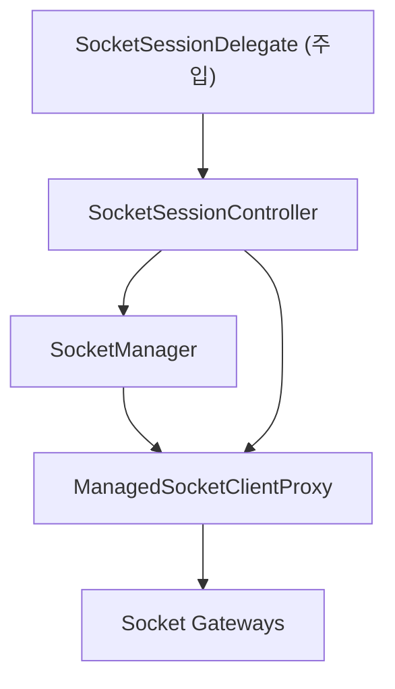
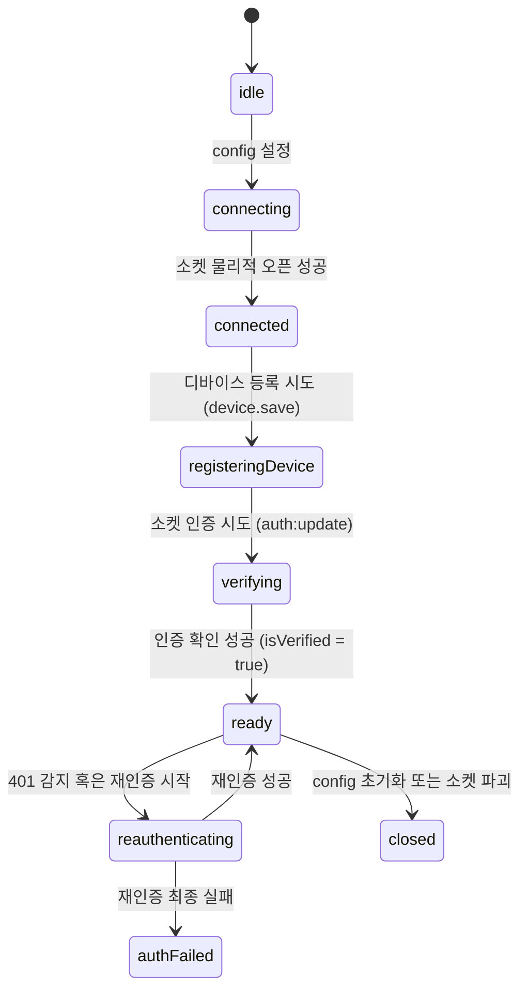

# Socket Domain Spec

Date: 2026-06-19

## 1. 목적

`socket` 도메인은 WebSocket 연결 관리, 안정적인 API 프록시 제공, 연결 및 인증 상태 관리, 디바이스 등록, 그리고 토큰 401 만료 시 자동 재인증/재시도 시퀀스를 책임진다.

이 문서에서 말하는 소켓 모듈은 `@lemoncloud/chatic-sockets-lib`의 **v2 클라이언트 모듈** 기준이다. 즉 `ClientSocketV2`, `domain.action` / `:ok` / `:error` 메시지 계약, v2 gateway 조립을 전제로 한다.

---

## 2. 핵심 컴포넌트 구조



### 1) `SocketManager`

- 로우 레벨 `ClientSocketV2` 커넥션의 라이프사이클(생성, 파괴, 재생성)을 통제한다.
- 소켓 설정(`SocketBindingConfig`)을 수용하고 이를 동기화(ensure)한다.
- `isConnected`, `isVerified`, `isDeviceRegistered`, `connectionId` 등 관측 가능한 소켓의 물리적/논리적 상태를 보존하는 단일 상태 스토어 역할을 담당한다.

### 2) `ManagedSocketClientProxy`

- 게이트웨이 및 디스패처 계층에 소켓 연결 인스턴스가 바뀌어도 동일하게 유지되는 안정적인 인터페이스(`ISocketClient`)를 제공한다.
- `request()` 호출 시 발생하는 `401 Unauthorized` 에러를 인터셉트하여 `SocketSessionController`에 복구 요청을 보낸다.
- 복구(토큰 재인증)가 진행되는 동안 유입된 API 요청들을 큐(Queue)에 일시적으로 적재하며, 복구 성공 후 순차적으로 재시도(Retry)를 수행한다.

### 3) `SocketSessionController`

- 중계 및 클라우드 소켓 연결의 실제 부트스트랩(Bootstrap) 단계(연결 → 디바이스 등록 → `auth:update` 요청)를 지휘한다.
- **주기적 리프레시**: 1분 주기 타이머를 통해 `delegate.getSocketToken()`으로 토큰을 갱신해 `auth:update`를 유지한다.
- **401 복구 시퀀스**: 프록시가 401 감지 시 `delegate.refreshSocketToken('socket-401')`을 호출하여 세션 토큰을 리프레시하고, single-flight(동시 호출에 대한 단일 처리) 패턴으로 안전하게 인증을 복구한 뒤 소켓 커넥션에 새 인증 토큰을 갱신한다.

---

## 3. 소켓 5대 책임 모델

소켓 관리 상태와 라이프사이클 복구 정책은 다음과 같은 5대 책임 모델로 구성된다.

| #     | 책임                   | 트리거                             | 상태 반영 영향                        | 실패 정책                                                                      |
| ----- | ---------------------- | ---------------------------------- | ------------------------------------- | ------------------------------------------------------------------------------ |
| **1** | **소켓 커넥션 관리**   | Config 변경                        | `isConnected`, `connectionId` 갱신    | 물리적 연결 실패 시 백오프 재시도                                              |
| **2** | **주기적 리프레시**    | 1분 주기 타이머                    | `auth.update:ok` -> `isVerified` 유지 | 토큰 갱신 불가 시 무시하고 다음 주기에 재시도                                  |
| **3** | **401 복구 및 재시도** | API `request()` 중 `401` 에러 수신 | 복구 및 재인증 -> `isVerified` 복구   | single-flight로 토큰 갱신 시도. 실패 시 `isVerified = false` 및 상위 에러 전파 |
| **4** | **디바이스 등록**      | 부트스트랩 내 `device.save`        | `isDeviceRegistered` 갱신             | 실패 시 재시도 (부트스트랩 필수 조건)                                          |
| **5** | **소켓 인증 갱신**     | 부트스트랩/재연결 시 `auth:update` | `isVerified = true`로 전환            | 실패 시 401 복구 시퀀스와 동일한 재인증 시도                                   |

---

## 4. 소켓 세션 위임 계약 (SocketSessionDelegate)

소켓 도메인은 `@chatic/web-core`를 포함한 외부 라이브러리에 직접적으로 결합되지 않는다. 인증 토큰 획득 및 갱신에 관한 비즈니스 정책은 다음의 Delegate 인터페이스를 통해 외부(앱/컨텍스트 레이어)에서 주입받는다.

```typescript
export interface SocketSessionDelegate {
    /** 현재 캐싱된 유효한 소켓 토큰을 획득합니다. */
    getSocketToken(): Promise<string | null>;

    /** 401 감지 또는 재연결 시 강제로 세션 토큰을 갱신(Refresh)합니다. */
    refreshSocketToken(reason: 'bootstrap' | 'socket-401' | 'reconnect'): Promise<string | null>;

    /** 리프레시가 최종적으로 실패했을 때의 후속 처리를 정의합니다. */
    onRefreshFailed?(error: unknown): Promise<void> | void;
}
```

### 소켓 리프레시 (주기적) vs 401 복구 (재시도)의 차이점

1. **주기적 리프레시(②)**: 단순히 로컬에 보존된 유효한 토큰(`delegate.getSocketToken()`)을 획득하여 소켓 연결을 갱신(`auth:update`)한다. 만약 유효한 세션(토큰)이 존재하지 않는다면 수행하지 않는다.
2. **401 복구(③)**: 소켓 통신 중에 토큰 만료 등의 사유로 401 에러를 받으면 강제로 `delegate.refreshSocketToken('socket-401')`을 호출하여 **클라우드 세션 자체를 갱신(refreshCloudSession)**하는 무거운 복구 흐름을 동반한 뒤 `auth:update`를 재전송한다.

---

## 5. 소켓 연결 상태 모델

소켓의 라이프사이클은 `SocketManager` 내에서 다음 상태 전이 규칙에 따라 안전하게 관리된다.



---

## 6. 실패 처리 및 복구 규칙

1. **인터셉트 단일화 (Single-Flight)**
    - 다수의 비동기 요청이 401 에러를 수신해도, 복구(토큰 리프레시)는 동시에 단 1회만(`single-flight`) 트리거된다.
    - 복구 처리가 완료될 때까지 신규 API 요청 및 401을 겪은 요청들은 대기 큐(`retryQueue`)에 정렬되며 복구 완료와 동시에 일괄 재시도한다.
2. **재시도 한계 정책**
    - 401 복구 프로세스가 최종적으로 실패한 경우(`onRefreshFailed` 발생 등), 소켓 검증 상태를 `isVerified = false`로 바꾸고 큐의 대기 중인 모든 요청들에 에러를 반환하며 후속 처리는 상위 컨텍스트 레이어로 전파한다.
