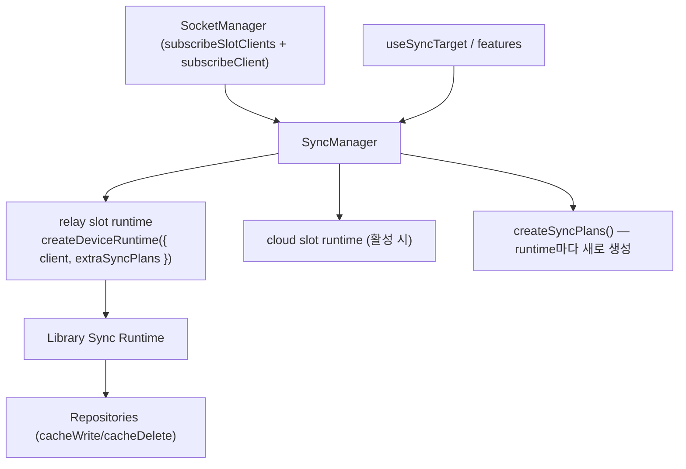

# Sync Domain Spec

## 목적

`libs/app-runtime`에서 sync를 어떤 계층이 소유하고, `createDeviceRuntime`을 어디서 생성하며, 외부가 어떤 API로 sync target을 등록하는지 정의한다.

핵심:

1. sync runtime 생성 책임은 `SyncManager`가 가진다.
2. `createDeviceRuntime`은 `SyncManager` 내부에서만 호출한다(외부 import 금지).
3. 외부는 raw runtime 대신 `SyncManager.register(...)`(또는 `useSyncTarget` 계열 훅)로 target을 등록한다.

## 핵심 구조



## 왜 `SyncManager`가 필요한가

`createDeviceRuntime`는 엔진, `SyncManager`는 앱 계층 오케스트레이터다. manager가 흡수한 정책(모두 **구현됨**):

- **슬롯별 runtime 소유** — `subscribeSlotClients`로 relay/cloud 각 슬롯의 client를 구독, 슬롯이 바인드되면 runtime 생성 + `start()`, 슬롯이 내려가면 detach. runtime은 그 슬롯의 connect-driven `device.save`와 keepAlive/reconnect/rotation을 소유하므로 **슬롯 수명**을 따라야 한다 — active 여부가 아니라. (과거 active-전용 runtime은 클라우드 활성 시 relay runtime을 stop시켜, relay 재연결이 `device.save` 없이 뜨고 relay-핀 요청이 `400 no device linked`로 깨졌다. auth 게이트도 `device.save:ok`에 걸려 있어 relay 재인증까지 함께 죽는 문제였다.)
- **sync target은 ACTIVE 슬롯만** — `subscribeClient`(active 추적)로 target을 active runtime으로만 이동: 이전 active runtime은 `stopAllSync()`(runtime 자체는 유지), 새 active runtime에 replay.
- **ref-count target registry** — `buildTargetKey`(`${type}:${id}`) 기준. 첫 ref가 active 슬롯의 `boundCid`를 태깅하고 `startTarget`, 마지막 dispose가 `stopTarget`.
- **replay + cross-cloud 가드** — active 교체 시 registry를 replay하되, 각 target은 자신의 `cid`가 새 client의 `boundCid`와 일치할 때만(`isCidActive`) 시작.
- **plan은 runtime마다 생성** — relay/cloud 두 스케줄러가 동시에 살아 있으므로 plan 인스턴스를 공유하지 않는다.

## 책임 분리

### `SyncManager`

책임:

- `manager.subscribeSlotClients` 구독 → 슬롯별 client가 생기면 `createDeviceRuntime({ client, extraSyncPlans: plans })`, 슬롯이 내려가면 detach. `manager.subscribeClient`(active) 구독 → target을 active runtime으로 이동.
- runtime `start()`/`stop()`, target `startTarget`/`stopTarget`(**private**).
- ref-count registry + replay(위).
- `updateLocalSnapshot(...args)` — runtime으로의 **도메인 무지** pass-through(runtime 없으면 no-op).

비책임:

- token refresh, socket bootstrap, repository merge 정책, **chat prime**.

### `createSyncPlans()` (`plans.ts`)

- 앱 도메인 `DomainSyncPlan[]` 생성: `Channel` / `Place` / `Profile` / `Chat` / `Join`. 각 callback을 repository `cacheWrite`/`cacheDelete`/`cacheWriteMany`에 연결.
- **`DeviceSyncPlan`은 여기서 만들지 않는다** — `createDeviceRuntime`가 자체 주입한다(app plan은 `extraSyncPlans`로 합류).
- 모든 callback은 `dropForeignFrame()` 가드로 감싸 socket `boundCid` ≠ data context cid인 cross-cloud frame을 버린다(flicker 방지).

### `repositories`

- plan callback 결과(`onUpdate`/`onRemove`/`onApply`)를 로컬 캐시에 반영, merge/remove 정책 유지.

## 공개 API

`getSyncManager()`(또는 훅)로 접근한다. 주요 메서드:

- `register(target): () => void` — 등록 + ref 증가, 반환값은 1회성 dispose(ref 감소).
- 타입드 슈가: `registerDevice` · `registerChannel` · `registerChat` · `registerPlace` · `registerProfile` · `registerJoin`.
- `updateLocalSnapshot(...)` — snapshot baseline pass-through.
- `listTargets()` · `destroy()`.

> **public `startSync`/`stopSync`는 없다.** target 시작/정지는 `register`/dispose의 ref-count로만 일어나며 `startTarget`/`stopTarget`은 private다.

feature/UI 레이어는 보통 [`useSyncTarget`](../../../src/socket/sync/hooks/useSyncTarget.ts) 계열 훅으로 등록한다(마운트/언마운트에 dispose 연동). **chat prime(콜드 fetch + 기준선 정렬)은 `SyncManager`가 아니라 `usePrimeChat`/`useChatSync` 훅이 소유한다** — chat 전용 정책 + repository 의존이라 도메인 무지 경계를 지키기 위함. 분업은 [chat-sync.md](chat-sync.md).

## lifecycle 규칙

- **슬롯 바인드/재빌드** — 슬롯 알림(`subscribeSlotClients`)으로 그 슬롯의 기존 runtime `stop`(`detachRuntime`) → 새 runtime 생성 + `start()`. 다른 슬롯의 runtime은 건드리지 않는다.
- **active 교체 (예: cloud 진입/이탈)** — 이전 active runtime은 `stopAllSync()`로 target만 내리고 **runtime은 계속 돈다**(백그라운드 슬롯의 device.save/keepAlive 유지). 새 active runtime에 registry replay(cid 일치분만). SocketManager는 같은 변경에 대해 슬롯 알림을 active 알림보다 먼저 보내므로 replay가 닿을 runtime은 항상 존재한다.
- **connected / reconnect** — runtime 내부 scheduler가 처리. 같은 client lifecycle 안의 catch-up은 라이브러리 plan을 신뢰.
- **destroy** — 모든 슬롯 runtime `stop` + 참조 정리.

## 모듈 구조

```text
libs/app-runtime/src/socket/sync/
  SyncManager.ts
  plans.ts
  types.ts
  hooks/
    useSyncTarget.ts
```

## 관련 문서

- [usage.md](usage.md) — 앱 사용 패턴 (register / 수동 콜 / chat prime)
- [screen-registration-map.md](screen-registration-map.md) — 화면별 sync 등록 지도
- [library-internals.md](library-internals.md) — 라이브러리 내부 동작(plan 패밀리·트리거·함정)
- [gateway-reference.md](gateway-reference.md) — 게이트웨이 요청/응답 레퍼런스
- [../architecture.md](../../architecture.md) — 전체 아키텍처·소유 규칙
