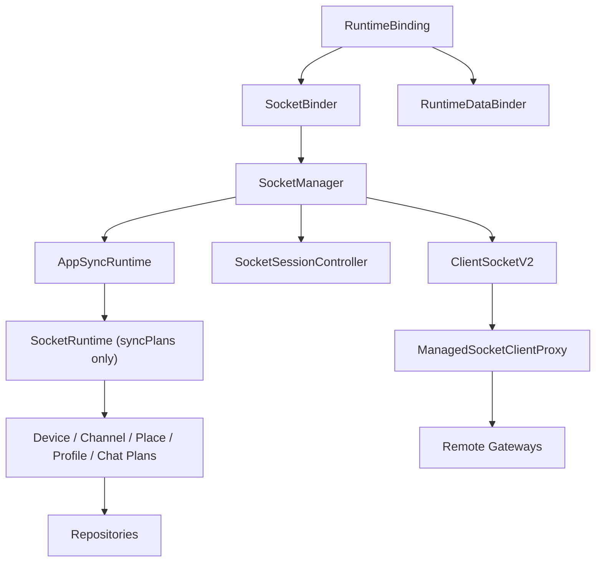

# Sync Domain Spec

Date: 2026-06-23

## 1. 목적

이 문서는 `libs/app-runtime` 내부에서 **소켓 라이프사이클을 따라 동작하는 sync plan 런타임**의 소유 경계와 결합 방식을 정의한다.

이번 방향의 핵심은 두 가지다.

1. sync는 `context` 변경 자체를 따라 강제 종료/재생성하지 않는다.
2. sync는 `SocketManager`가 소유하는 **실제 socket lifecycle**을 따라 시작/정지된다.

참조 기준:

- [clientsocket-sync-guide.md](./clientsocket-sync-guide.md)
- [clientsocket-usage.md](./clientsocket-usage.md)

위 문서 기준으로 `DomainSyncScheduler`는 연결 상태에 반응한다.

- `connected` 시 plan이 시작/재시작된다.
- `closing/closed` 시 타이머가 정지된다.
- reconnect 이후 `onConnected()`를 통해 snapshot reset / catch-up이 수행된다.

따라서 `app-runtime`은 별도 React binder나 app-level polling loop보다, **socket lifecycle에 밀착된 sync runtime 서비스**를 두는 편이 더 단순하고 정확하다.

---

## 2. 결정 사항

### 채택

- sync orchestration은 `app-runtime`이 소유한다.
- runtime 엔진은 `@lemoncloud/chatic-sockets-lib`의 [socket-runtime.d.ts](file:///Users/raine/Project/lemon/chatic-front/node_modules/@lemoncloud/chatic-sockets-lib/dist/client-socket-v2/socket-runtime.d.ts) 표면을 활용한다.
- `RuntimeSyncBinder`는 두지 않는다.
- `SocketManager`를 단일 lifecycle source로 사용한다.
- `SocketSessionController`는 계속 bootstrap/auth/device 책임을 가진다.
- sync runtime은 socket 교체/종료에 맞춰 attach/detach된다.

### 비채택

- `context` 변경 시 sync runtime 전체 `stop/reset`
- 별도 `RuntimeSyncBinder`를 통한 React lifecycle 기반 sync 제어
- 소켓 라이브러리와 별개로 app-runtime 내부에 polling scheduler를 새로 구현하는 방식

---

## 3. 왜 `app-runtime` 에 두는가

sync 타이밍은 데이터 해석 문제가 아니라 런타임 문제다.

`libs/app-runtime`이 소유해야 하는 판단:

1. 어떤 socket client에 plan을 붙일지
2. 소켓 재연결/교체 시 기존 watch set을 어떻게 이어갈지
3. 소켓이 닫힐 때 언제 scheduler를 멈출지
4. 어떤 서버 plan을 현재 앱 runtime에 주입할지

반대로 `libs/data`가 계속 소유해야 하는 것:

1. remote 응답을 local cache에 어떻게 반영할지
2. 도메인별 merge/remove 정책
3. observe stream 제공

정리:

- `data` = result interpreter / cache owner
- `app-runtime` = socket-bound sync runtime owner

---

## 4. 현재 구조에서의 문제점

기존 문서 기준 설계는 아래 문제를 가진다.

1. sync lifecycle 판단 지점이 너무 많다.
    - `SocketBinder`
    - `RuntimeSyncBinder`
    - 별도 `RuntimeSyncController`
2. `context` 변경과 socket lifecycle이 섞여 있다.
3. 라이브러리의 `SocketRuntime` / `DomainSyncScheduler`가 이미 있는 상황에서 app-level scheduler를 다시 만들게 된다.
4. 최신 참조 문서와 달리 installed dist 표면과 문서가 일부 어긋난다.

특히 설치된 패키지 기준 plan 표면은 아래 파일들을 기준으로 확인해야 한다.

- [device-sync-plan.d.ts](file:///Users/raine/Project/lemon/chatic-front/node_modules/@lemoncloud/chatic-sockets-lib/dist/client-socket-v2/plans/device-sync-plan.d.ts)
- [channel-sync-plan.d.ts](file:///Users/raine/Project/lemon/chatic-front/node_modules/@lemoncloud/chatic-sockets-lib/dist/client-socket-v2/plans/channel-sync-plan.d.ts)
- [place-sync-plan.d.ts](file:///Users/raine/Project/lemon/chatic-front/node_modules/@lemoncloud/chatic-sockets-lib/dist/client-socket-v2/plans/place-sync-plan.d.ts)
- [profile-sync-plan.d.ts](file:///Users/raine/Project/lemon/chatic-front/node_modules/@lemoncloud/chatic-sockets-lib/dist/client-socket-v2/plans/profile-sync-plan.d.ts)
- [chat-sync-plan.d.ts](file:///Users/raine/Project/lemon/chatic-front/node_modules/@lemoncloud/chatic-sockets-lib/dist/client-socket-v2/plans/chat-sync-plan.d.ts)

---

## 5. 권장 아키텍처



핵심 포인트:

- `SocketManager`가 active client의 source of truth다.
- `AppSyncRuntime`은 `SocketManager`의 client replacement를 따라 새 `SocketRuntime`을 붙인다.
- `ManagedSocketClientProxy`는 gateway 안정 참조 용도로 유지할 수 있지만, sync lifecycle의 기준점은 아니다.
- `RuntimeBinding.context`는 data scope를 바꾸지만 sync runtime 전체를 직접 stop시키지 않는다.

---

## 6. 소유 경계

### `SocketManager`

- raw `ClientSocketV2` 생성/교체
- socket state 방송
- active client replacement 이벤트 제공

### `SocketSessionController`

- `connect`
- `device.save`
- `auth.update`
- 401 복구
- 주기적 auth refresh

### `AppSyncRuntime`

- 현재 active client에 맞는 `SocketRuntime` 조립
- plan 주입
- 기존 watch target 재등록
- target registry 소유
- socket 종료 시 sync runtime detach

### `libs/data`

- repository refresh / cache update
- `onUpdate` / `onRemove` 결과 반영
- observe stream 제공

---

## 7. 권장 모듈 배치

```text
libs/app-runtime/src/
  socket/
    SocketManager.ts
    SocketSessionController.ts
    ManagedSocketClientProxy.ts
    runtime.ts
    sync/
      AppSyncRuntime.ts         # socket lifecycle을 따라가는 sync 서비스
      plans.ts                  # plan 인스턴스 조립
      types.ts
  connection/
    RuntimeConnectionHost.tsx
    SocketBinder.tsx
    RuntimeDataBinder.tsx
```

배치 원칙:

1. sync는 `connection/`이 아니라 `socket/` 하위 서비스다.
2. 이유는 sync의 시작/종료 조건이 React mount/unmount가 아니라 socket lifecycle이기 때문이다.
3. `RuntimeSyncBinder.tsx`는 새 설계에서 필요 없다.

---

## 8. lifecycle 규칙

### 1) socket config 변경

- `SocketBinder`가 `SocketManager.ensure(config)` 호출
- 기존 client는 정리되고 새 client가 생성된다
- `AppSyncRuntime`은 replacement 이벤트를 받아 새 client 기준 `SocketRuntime`을 다시 조립한다

### 2) socket connected

- `SocketSessionController`가 bootstrap/auth를 수행한다
- plan scheduler는 `connected` 이벤트를 받아 `onConnected()` 및 첫 실행을 시작한다

### 3) socket closing/closed

- scheduler timer는 자동 정지된다
- 별도 `context` 기반 stop 호출은 하지 않는다

### 4) reconnect

- 같은 socket lifecycle 안의 reconnect는 plan 자체 동작에 맡긴다
- `onConnected()`를 통해 snapshot reset / catch-up 수행

### 5) context 변경

- `RuntimeDataBinder`가 data context를 변경한다
- sync runtime 전체를 강제 stop하지 않는다
- 남아 있는 watch target의 의미는 각 화면/feature 레이어와 repository scope가 함께 정리한다

---

## 9. plan 주입 정책

현재 설치된 dist 기준 우선 주입 대상:

- `DeviceSyncPlan`
- `ChannelSyncPlan`
- `PlaceSyncPlan`
- `ProfileSyncPlan`

주의:

- `ChatSyncPlan` 표면은 패키지 버전에 따라 다를 수 있으므로 실제 설치본 기준으로 확인한다.

권장 조립 방향:

1. `SocketRuntime`을 직접 사용한다.
2. `createDeviceRuntime()`는 현 구조와 책임이 겹칠 수 있으므로 기본 선택지로 두지 않는다.
3. 이유는 `SocketSessionController`가 이미 `device.save`와 auth/bootstrap 책임을 가지고 있기 때문이다.
4. chat 동기화는 `DomainSyncPlan<'chat'>` 요구사항을 만족하는 방식으로 주입한다.

### Chat Plan 명세

chat은 channel/profile/place와 달리 polling plan이 아니다.

- `target.type = 'chat'`
- `run()` = no-op
- 실제 동작은 `onConnected()`와 `onTrigger()` 중심

핵심 규칙:

1. `chat.sync` push가 오면 payload `chatNo`를 기준으로 append 또는 gap-fill 판단
2. `chatNo === lastNo + 1` 이면 서버 재조회 없이 local cache에 바로 append
3. `chatNo > lastNo + 1` 이면 gap으로 판단하고 `chat.feed`로 누락 구간을 보충
4. reconnect 후에는 `channel.get`의 최신 `chatNo`를 기준으로 catch-up
5. `chatNo <= lastNo` 는 중복으로 보고 무시

### chat snapshot 명세

`ChatSyncPlan`은 per-channel snapshot을 가진다.

```ts
interface ChatSyncSnapshot {
    id: string;
    lastNo: number;
    minNo: number;
    loaded: number;
}
```

설명:

- `lastNo`: 현재 runtime이 알고 있는 최신 chatNo
- `minNo`: 현재 local cache에 남아 있는 최소 chatNo
- `loaded`: 현재 baseline 기준 반영한 메시지 수

이 snapshot은 전체 이력의 source of truth가 아니라 **catch-up 기준선**이다.

### chat 연결/트리거 동작

`onConnected()`:

1. `channel.get({ id: channelId })` 호출
2. 서버 최신 `chatNo` 확인
3. snapshot `lastNo`와 비교
4. 차이가 없으면 no-op
5. 차이가 있으면 `chat.feed()`로 필요한 구간만 보충

`onTrigger()`:

1. payload `channelId !== target.id` 면 무시
2. `chatNo <= lastNo` 면 무시
3. `chatNo === lastNo + 1` 이면 바로 append
4. `chatNo > lastNo + 1` 이면 gap-fill 수행

### chat cache 반영 원칙

chat plan은 아래 계층과 역할을 나눠 가진다.

- `ChatRepositoryV2`: 메시지 본문 / 순서 / 중복 제거
- `JoinRepositoryV2`: 현재 사용자 read-state 보정
- channel cache: 가능하면 최소 patch만 허용

원칙:

- 메시지 본문 소유권은 `ChatRepositoryV2`
- 읽음 상태 소유권은 `JoinRepositoryV2`
- 채널 메타(`chatNo`, preview, unread)는 기존 channel merge 정책과 충돌하지 않도록 최소 범위만 갱신

---

## 10. watch target 전략

watch target은 아래 원칙으로 관리한다.

1. target registry는 runtime 서비스가 가진다.
2. socket이 교체되면 registry를 새 runtime에 재등록한다.
3. `context` 변경만으로 target을 전부 제거하지 않는다.
4. 화면 이탈이나 feature cleanup이 실제 target 해제의 주된 계기다.
5. `chat` target은 channel 화면 lifecycle과 함께 움직이는 것을 기본값으로 한다.

### `plan`과 `target`의 차이

- `plan` = 특정 domain을 **어떻게** sync할지 정의한 전략
- `target` = 그 전략을 적용할 **실제 대상**

예:

- `ChannelSyncPlan` = `channel` 타입을 어떻게 polling / trigger 처리할지
- `{ type: 'channel', id: 'ch-1' }` = 실제로 sync할 채널 한 개

즉:

- runtime은 부팅 시 `plan`들을 조립한다.
- feature는 필요 시점에 `target`을 등록한다.

### target은 유동적으로 등록한다

권장 방식은 lazy registration이다.

- `plan`은 고정
- `target`은 유동

예:

- 채널 화면 진입 시 `channel:ch-1` 등록
- 채널 화면 진입 시 `chat:ch-1`도 함께 등록
- 프로필 화면 진입 시 `profile:user-1` 등록
- 화면 이탈 시 해당 target 해제

초기 부팅 시 모든 target을 미리 등록할 필요는 없다.

### register 시점 규칙

`register(target)`은 호출 시점부터 그 대상을 watch 목록에 넣는 의미다.

- socket/runtime이 준비돼 있으면 즉시 `startSync(target)` 한다.
- 아직 연결 전이면 registry에만 저장되고, socket이 준비되는 즉시 시작한다.

따라서 호출자 관점에서는 아래처럼 생각하면 된다.

- `register(target)` = 지금부터 sync 켜기
- 내부 구현은 “가능한 가장 이른 시점”에 실행

즉 설계/사용 관점에서는 **register하면 바로 된다**고 봐도 된다.

### unregister 규칙

끄는 동작은 두 층으로 나뉜다.

1. **runtime 내부 stop**
    - socket `closed`
    - runtime destroy
    - plan failure policy에 의한 stop
2. **feature 관심 해제**
    - 화면 이탈
    - 더 이상 해당 target을 보지 않음

첫 번째는 내부 서비스 책임이고, 두 번째는 호출자 책임이다.

따라서 외부 API는 `unregister(target)`보다 아래 패턴을 권장한다.

```ts
const dispose = registerSyncTarget({ type: 'channel', id: channelId });

// cleanup
dispose();
```

이 패턴이면 register한 쪽이 cleanup 책임도 함께 가진다.

### registry 권장 형태

registry는 전역 singleton 서비스로 두되, 외부에는 좁은 API만 노출한다.

```ts
interface SyncWatchRegistry {
    register(target: SyncTargetDescriptor): () => void;
    list(): SyncTargetDescriptor[];
}
```

내부 구현은 `Map<key, entry>` + ref-count를 권장한다.

이유:

- 같은 target을 여러 feature가 동시에 등록할 수 있다.
- 첫 등록 때만 실제 `startSync`
- 마지막 해제 때만 실제 `stopSync`

즉 registry는 “현재 어떤 대상에 관심이 살아 있는가”를 기억하고, runtime은 그 상태를 현재 socket 인스턴스에 재적용한다.

즉:

- runtime stop = socket lifecycle 결과
- target remove = feature lifecycle 결과

둘을 분리해야 한다.

---

## 11. 구현 전 검증 포인트

1. `context`만 바뀌고 socket이 유지될 때 repository scope mismatch가 없는지
2. channel/place/profile plan의 `onRemove`를 앱에서 어떻게 표준 처리할지
3. watch registry를 누가 소유할지
    - 전역 서비스
    - 화면별 registration helper
4. chat plan 부재를 패키지 업그레이드로 해결할지, 로컬 구현으로 메울지
5. chat plan이 `ChatRepositoryV2` / `JoinRepositoryV2` / channel preview와 어떻게 역할을 나눌지

---

## 12. 구현 단계 제안

1. 문서 정렬
2. `AppSyncRuntime` 인터페이스 정의
3. `SocketManager.subscribeClient(...)` 기반 runtime attach/detach 구현
4. `SocketRuntime(syncPlans only)` 조립
5. `device/channel/place/profile` plan 주입
6. chat 동기화 plan 주입
7. repository callback 연결
8. reconnect / replacement / no-socket / chat gap-fill 테스트

---

## 13. 요약

이번 설계에서 가장 중요한 규칙은 아래 한 줄이다.

> sync plan runtime은 `context` 변경이 아니라 **socket lifecycle**을 따라간다.

즉 `RuntimeSyncBinder`를 추가하지 않고, `SocketManager` 하위 서비스로 sync를 붙이는 것이 현재 목표와 참조 문서에 가장 잘 맞는다.
