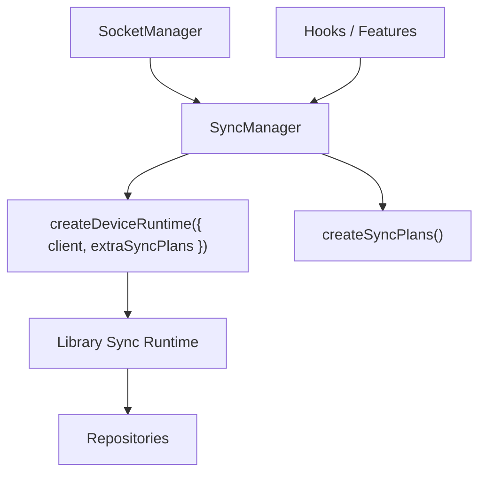

# Sync Domain Spec

Date: 2026-06-24
Status: Target Architecture

## 목적

이 문서는 `libs/app-runtime`에서 sync를 어떤 계층이 소유하고, `createDeviceRuntime`을 어디서 생성하며, 외부가 어떤 API로 sync를 조작해야 하는지 정의한다.

핵심 결정:

1. sync runtime 생성 책임은 `SyncManager`가 가진다.
2. `createDeviceRuntime`은 `SyncManager` 내부에서만 호출한다.
3. 외부는 raw runtime 대신 `SyncManager`를 통해 `register/startSync/stopSync`를 호출한다.

## 핵심 구조



## 왜 `SyncManager`가 필요한가

`createDeviceRuntime`만 직접 쓰면 부족한 이유:

- 현재 client가 바뀌면 runtime도 다시 만들어야 함
- 등록된 sync target을 새 runtime에 replay해야 함
- sync 조작 진입점을 한곳에 모아야 함
- 이후 ref count, chat prime, dedupe 같은 앱 정책을 붙일 자리가 필요함

즉 `createDeviceRuntime`은 엔진이고, `SyncManager`는 앱 계층 오케스트레이터다.

## 책임 분리

### `SyncManager`

책임:

- 현재 socket client를 구독
- client가 생기면 `createDeviceRuntime({ client, extraSyncPlans })`
- runtime `start()` / `stop()`
- `startSync(target)` / `stopSync(target)`
- 필요 시 target registry 유지 및 replay

비책임:

- token refresh
- socket 연결 bootstrap
- repository merge 정책

### `createSyncPlans()`

책임:

- 앱 도메인용 `DomainSyncPlan[]` 생성
- plan callback을 repository/cache 계층에 연결

비책임:

- runtime lifecycle
- target registry

### `repositories`

책임:

- `onUpdate`, `onRemove`, `onApply` 결과를 로컬 캐시에 반영
- merge/remove 정책 유지

## 생성 규칙

### `createDeviceRuntime`

- `SyncManager` 내부에서만 호출한다.
- 인자로 현재 `ClientSocketV2`와 `extraSyncPlans`를 받는다.
- 외부 호출부에서는 이 함수를 직접 import하지 않는다.

## 외부 API 원칙

외부는 아래 두 단계 중 하나만 사용한다.

### 최소 API

- `register(target): () => void`
- `listTargets(): SyncTargetDescriptor[]`

### 확장 API

- `startSync(target): void`
- `stopSync(target): void`

권장:

- feature/UI 레이어에는 `register()`만 노출하는 편이 안전하다.
- reconnect/replay/dedupe를 `SyncManager` 내부 정책으로 숨길 수 있기 때문이다.

## lifecycle 규칙

### socket client 생성/교체

- `SocketManager`가 client를 교체하면 `SyncManager`가 이를 감지한다.
- 기존 runtime이 있으면 정지한다.
- 새 runtime을 생성하고 `start()` 한다.
- registry가 있으면 기존 target을 replay한다.

### socket connected / reconnect

- runtime 내부 scheduler가 연결 이벤트를 받아 동작한다.
- 같은 client lifecycle 안의 reconnect catch-up은 라이브러리 plan 동작을 우선 신뢰한다.

### socket destroy

- `SyncManager`는 runtime을 `stop()`하고 참조를 비운다.
- registry 보존 여부는 정책 선택이다.

## 권장 정책

초기 단계:

- `SyncManager`는 얇게 시작한다.
- 최소한 runtime 생성/교체와 sync 조작 API만 가진다.

후속 단계:

- target registry
- replay
- ref count
- snapshot baseline 보정 — `SyncManager`는 도메인 무지한 `updateLocalSnapshot` pass-through만 제공한다.

위 정책은 `SyncManager`에 점진적으로 흡수한다. 단 **chat prime(콜드 fetch + 기준선 정렬)은
`SyncManager`가 아니라 `useChatSync` 훅이 소유한다** — chat 전용 정책 + repository 의존이라
도메인 무지 경계를 깨지 않기 위해서다. 분업은 [chat-sync.md](chat-sync.md).

## 계획된 모듈 구조

```text
libs/app-runtime/src/socket/sync/
  SyncManager.ts
  plans.ts
  types.ts
  hooks/
    useSyncTarget.ts
```

## 현재 코드와의 차이

정렬 완료 (2026-06-24): `AppSyncRuntime`은 `SyncManager`로 재편되었다. 자세한 정렬 상태는 [../architecture.md](../architecture.md#현재-코드와의-차이) 참조.

## 구현 체크리스트

1. `SyncManager` 인터페이스 정의
2. current client 구독 기반 runtime attach/detach 구현
3. `createSyncPlans()` 주입
4. `register()` 또는 `startSync()` public API 정리
5. hook 호출부를 새 진입점으로 교체
6. replay/ref count 정책 추가 여부 결정

## 관련 문서

- [usage.md](usage.md) — 앱 사용 패턴 (register / 수동 콜 / chat prime)
- [screen-registration-map.md](screen-registration-map.md) — 화면별(전역/홈/채팅방) sync 등록 지도
- [library-internals.md](library-internals.md) — 라이브러리 내부 동작 (plan 패밀리·트리거 시점·함정)
- [gateway-reference.md](gateway-reference.md) — 게이트웨이 요청/응답 레퍼런스
- [../architecture.md](../architecture.md) — 전체 아키텍처·3축 소유 규칙
