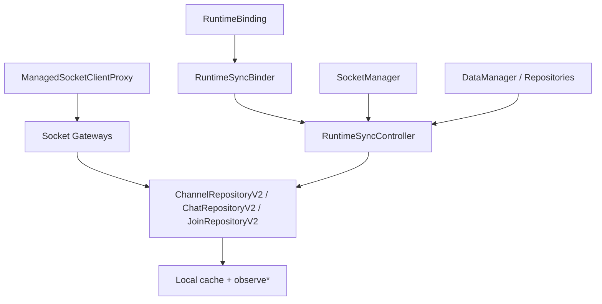
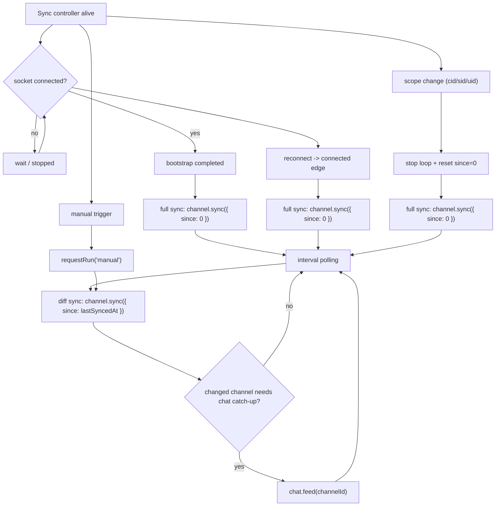
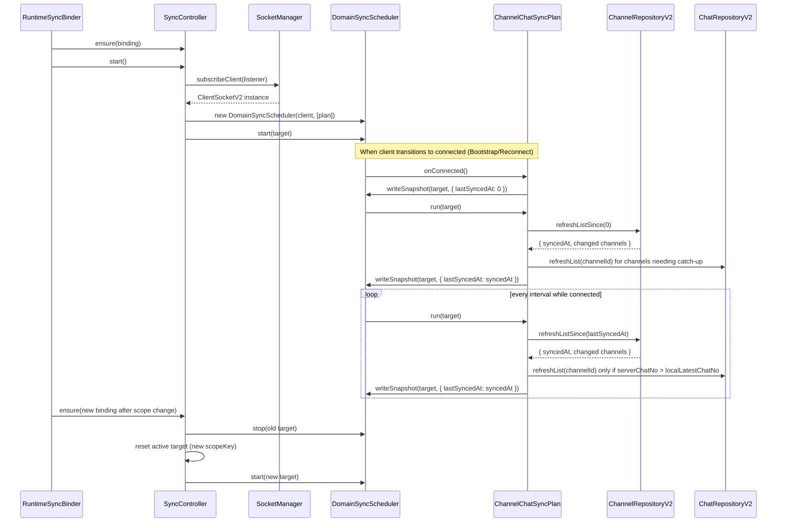

# Sync Domain Spec

Date: 2026-06-22

## 1. 목적

이 문서는 `libs/app-runtime` 내부에 둘 **채널/채팅 동기화 모듈**의 소유 경계, 배치 위치, 실행 방식, 구현 단계를 정의한다.

이 sync 모듈은 `@lemoncloud/chatic-sockets-lib`의 **v2 클라이언트 모듈** 위에서 동작한다. 즉 `ClientSocketV2`, v2 domain gateway, `channel.sync` / `chat.feed` / `chat.read` 계약을 기준으로 한다.

핵심 목표는 하나다.

- `libs/data`는 **응답을 local cache에 어떻게 반영할지**만 책임진다.
- `libs/app-runtime`은 **언제 어떤 순서로 sync를 돌릴지**를 책임진다.

즉 이 문서는 `channel.sync({ since })`, `chat.feed`, `chat.read`를 언제 호출할지 결정하는 app-level orchestrator를 정의한다.

---

## 2. 왜 `app-runtime` 에 두는가

채널/채팅 sync의 실행 시점은 데이터 해석 문제가 아니라 런타임 문제다.

다음 판단은 `libs/data`보다 `libs/app-runtime`이 소유해야 한다.

1. connect 직후 full sync를 할지
2. reconnect 후 다시 돌릴지
3. foreground / background에서 멈출지
4. polling 주기와 debounce를 어떻게 둘지
5. cloud / site / user scope 전환 시 `since`를 리셋할지
6. in-flight sync가 있는 동안 중복 실행을 막을지

이 정보는 `RuntimeBinding`, `SocketManager` 상태, bootstrap lifecycle에 묶여 있다.

반대로 `libs/data`가 계속 소유해야 하는 것은 아래다.

1. `channel.sync` 응답을 local cache에 쓰는 법
2. `channel.sync.ids` 기반 stale remove
3. `chat.feed` merge 정책
4. `chat.read` 이후 join/channel snapshot 반영

정리하면:

- `data` = data interpreter
- `app-runtime` = sync scheduler / orchestrator

---

## 3. 소유 경계

### `libs/data` 책임

- `ChannelRepositoryV2.refreshListSince(since)`
- `ChatRepositoryV2.refreshList(query)`
- `JoinRepositoryV2.readChat(payload)`
- local cache write / merge / stale remove
- observe stream 제공

### `libs/app-runtime` 책임

- sync lifecycle 시작 / 중단
- `since` 저장과 리셋
- reconnect 후 full sync 정책
- polling loop
- 어떤 channel이 chat catch-up 대상인지 계산
- socket state 변화에 따른 자동 재실행

### 비책임

이 모듈은 아래를 하지 않는다.

- WebSocket 자체 연결/재인증 복구
- remote 응답 필드 단위 merge
- local DB 직접 조작
- UI 렌더 상태 관리

---

## 4. 권장 모듈 배치

새 sync 도메인은 `app-runtime` 내부에 독립 폴더로 둔다.

```text
libs/app-runtime/src/
  sync/
    ChannelChatSyncPlan.ts         # DomainSyncPlan 구현체 (채널 & 채팅)
    SiteSyncPlan.ts                # DomainSyncPlan 구현체 (사이트)
    ProfileSyncPlan.ts             # DomainSyncPlan 구현체 (프로필)
    UserSyncPlan.ts                # DomainSyncPlan 구현체 (유저)
    RuntimeSyncController.ts       # DomainSyncScheduler 관리 및 디버그 상태 노출
    runtime.ts                     # 싱글톤 조립
    types.ts                       # 공개/내부 타입
    hooks/
      useSyncState.ts              # 선택: 디버그/상태 관측용
  connection/
    RuntimeSyncBinder.tsx          # binding 변화에 맞춰 controller lifecycle 제어
```

### 배치 원칙

1. **Plan & Controller는 `src/sync/`**
    - `ChannelChatSyncPlan`, `SiteSyncPlan`, `ProfileSyncPlan`, `UserSyncPlan`: 동기화 시점의 실제 데이터 읽기/쓰기 동작(Repository 호출)을 담당
    - `RuntimeSyncController`: 소켓 인스턴스 생명주기에 따라 `DomainSyncScheduler`를 초기화하고 라이프사이클 관리
2. **binder는 `src/connection/`**
    - React lifecycle에 붙는 render-null 컴포넌트
3. **singleton 조립은 `src/sync/runtime.ts`**
    - `socket/runtime.ts`, `data/runtime.ts`와 같은 패턴 유지

---

## 5. 아키텍처 연결점



핵심 포인트:

- sync controller는 repository를 호출한다.
- repository는 remote/local 해석을 수행한다.
- socket lifecycle 상태는 `SocketManager`에서 읽는다.
- binder는 `RuntimeBinding` 변화에 따라 sync controller를 재설정한다.

---

## 6. 권장 상태 모델

### scope key

sync는 현재 data scope에 종속되므로, 최소한 아래 key로 구분한다.

```ts
type SyncScopeKey = string; // `${cid}:${sid || ''}:${uid || ''}`
```

### controller 내부 상태

```ts
interface ChannelChatSyncState {
    scopeKey: SyncScopeKey | null;
    lastSyncedAtByScope: Map<SyncScopeKey, number>;
    inFlight: boolean;
    started: boolean;
    scheduler: DomainSyncScheduler | null;
    syncPlan: ChannelChatSyncPlan;
    timerScheduler: SharedTimerScheduler;
    activeTarget: ChannelChatSyncTarget | null;
    lastRunAt: number | null;
}
```

### 관찰 가능한 디버그 상태

```ts
interface SyncDebugState {
    scopeKey: string | null;
    started: boolean;
    inFlight: boolean;
    lastSyncedAt: number;
    lastRunAt: number | null;
    lastFullSyncAt: number | null;
    pendingReason: 'bootstrap' | 'reconnect' | 'interval' | 'manual' | null;
}
```

디버그 상태는 선택 사항이지만, 실제 운영 이슈를 추적하려면 두는 편이 낫다.

---

## 7. 핵심 인터페이스 초안

```ts
export interface RuntimeSyncController {
    ensure(binding: RuntimeBinding): void;
    start(): Promise<void>;
    stop(): void;
    destroy(): void;

    requestRun(reason: 'bootstrap' | 'reconnect' | 'interval' | 'manual'): Promise<void>;
    getDebugState(): SyncDebugState;
    subscribe?(listener: (state: SyncDebugState) => void): () => void;
}
```

### 의존성

```ts
export interface ChannelChatSyncDeps {
    socketManager: ISocketManager;
    getRepositories(): DataRepositories;
    now?: () => number;
    intervalMs?: number;
}
```

---

## 8. canonical sync 흐름

기준 원칙:

1. `channel.sync({ since: 0 })` = full sync
2. `channel.sync({ since: N })` = diff sync
3. chat latest sync 판단 = `channel.chatNo`
4. chat pagination 판단 = `chat.feed.cursorNo`

### 1) full sync

full sync는 아래 시점에 수행한다.

- 최초 bootstrap 직후
- reconnect 이후
- scope(`cid`, `sid`, `uid`) 변경 직후
- 명시적 manual reset 시

흐름:

```ts
const channelResult = await channelRepository.refreshListSince(0);
saveSince(scopeKey, channelResult.syncedAt);

for (const channel of getChannelsNeedingCatchup()) {
    await chatRepository.refreshList({ channelId: channel.id, limit: 50 });
}
```

### 2) diff sync

정기 실행은 아래만 수행한다.

```ts
const since = loadSince(scopeKey);
const channelResult = await channelRepository.refreshListSince(since);
saveSince(scopeKey, channelResult.syncedAt);

for (const channel of changedChannelsNeedingCatchup(channelResult)) {
    await chatRepository.refreshList({ channelId: channel.id, limit: 50 });
}
```

### 3) chat catch-up 판정

controller는 changed channel snapshot을 보고 catch-up 대상을 고른다.

기준:

```ts
serverChatNo > localLatestChatNo;
```

여기서:

- `serverChatNo` = `channel.sync` 응답의 `chatNo`
- `localLatestChatNo` = local cache 기준 현재 채널의 최신 chatNo

`cursorNo`는 여기 쓰지 않는다.

### 4) read cursor

`chat.read`는 sync loop가 아니라 사용자 액션 흐름으로 유지한다.

- 사용자가 채팅을 읽음 -> `JoinRepositoryV2.readChat()`
- 이후 다음 `channel.sync` 또는 `join:update`가 unread 계산을 수렴시킴

즉 read 자체를 polling loop에 넣지 않는다.

---

## 9. 실행 트리거

### 트리거 타이밍 다이어그램



### 시퀀스 다이어그램



### bootstrap

`SocketSessionController.bootstrap()` 완료 후, sync controller가 첫 full sync를 수행한다.

권장 순서:

1. socket bootstrap 완료
2. `SocketManager.state === connected`
3. `RuntimeSyncBinder`가 `controller.ensure(binding)` 호출
4. `controller.start()`
5. 내부적으로 `requestRun('bootstrap')`

### reconnect

socket state가 `connected`로 다시 전이되면 full sync를 다시 수행한다.

이유:

- 이전 `since`가 유효하더라도 놓친 변경분을 안전하게 수렴시키는 편이 낫다.
- 초기 버전에서는 정확성을 우선하고 비용 최적화는 후순위로 둔다.

### interval

connected 상태에서만 interval loop를 돈다.

권장 기본값:

- `intervalMs = 5000`

초기 정책:

- in-flight면 skip
- skip 카운트는 디버그 상태에 남길 수 있음

### scope 변경

`cid`, `sid`, `uid`가 바뀌면:

1. 이전 scope loop 중단
2. 새 scopeKey 계산
3. `since`를 0으로 reset
4. 새 scope full sync 수행

---

## 10. binder 동작 규칙

새 binder는 `SocketBinder`와 같은 render-null 컴포넌트로 둔다.

```tsx
export const RuntimeSyncBinder = ({ binding }: { binding: RuntimeBinding }) => {
    const syncRuntime = getSyncRuntime();

    useEffect(() => {
        syncRuntime.controller.ensure(binding);

        if (!binding.socket) {
            syncRuntime.controller.stop();
            return;
        }

        void syncRuntime.controller.start();

        return () => {
            syncRuntime.controller.stop();
        };
    }, [binding]);

    return null;
};
```

### `RuntimeConnectionHost` 반영 위치

권장 트리:

```tsx
<TransportBootstrap>
    <SessionBackgroundRunner />
    <RuntimeDataBinder binding={binding} />
    <SocketBinder binding={binding} />
    <RuntimeSyncBinder binding={binding} />
    {children}
</TransportBootstrap>
```

`RuntimeDataBinder`와 `SocketBinder` 뒤에 두는 이유:

- sync는 data context가 먼저 맞아야 한다.
- socket bootstrap이 먼저 끝나야 한다.

---

## 11. `since` 저장 정책

초기 버전은 **메모리 저장**으로 충분하다.

```ts
Map<SyncScopeKey, number>;
```

이유:

- scope 전환 시 reset이 자연스럽다.
- reconnect 후 full sync 정책이면 내구 저장 필요가 약하다.
- 세션 간 이어받기보다 correctness가 우선이다.

후속 확장:

- persisted sync checkpoint
- foreground resume optimization

초기 버전에서는 비권장이다.

---

## 12. failure / retry 정책

### 원칙

1. repository 호출 실패가 곧 socket 복구 책임을 뜻하지 않는다.
2. socket/auth 복구는 기존 `ManagedSocketClientProxy` / `SocketSessionController`에 맡긴다.
3. sync controller는 실패를 로깅하고 다음 interval에서 재시도한다.

### 정책

- 한 번의 run에서 일부 channel chat catch-up 실패:
    - 다른 channel은 계속 진행 가능
- `channel.sync` 자체 실패:
    - 현재 run 실패로 종료
    - `since`는 갱신하지 않음
- 401:
    - proxy가 처리
    - controller는 일반 request 실패처럼 취급

---

## 13. 구현 단계

### Phase 1. 문서 기준 최소 구현

1. `src/sync/types.ts`
2. `src/sync/RuntimeSyncController.ts`
3. `src/sync/runtime.ts`
4. `src/connection/RuntimeSyncBinder.tsx`
5. `RuntimeConnectionHost.tsx`에 binder 추가

### Phase 2. repository 연동

controller가 아래 repository를 사용하도록 연결한다.

- `channel.refreshListSince(0 | since)`
- `channel.cacheReadList({})` 또는 equivalent read
- `chat.refreshList({ channelId, limit })`

필요하면 `@chatic/data` 쪽에 아래 보조 read API를 추가한다.

- 현재 채널 목록 snapshot 조회
- 특정 채널의 local latest chatNo 조회

### Phase 3. 디버그 표면

선택적으로:

- `useSyncState()`
- `getSyncRuntime()`
- debug logger / metrics

---

## 14. 권장 테스트

### 단위 테스트

1. `binding` 변경 시 `scopeKey` reset
2. `connected` 전에는 loop 미실행
3. bootstrap 시 full sync 1회
4. reconnect 시 full sync 재실행
5. in-flight 중 interval skip
6. `serverChatNo > localLatestChatNo`일 때만 `chat.refreshList()` 호출
7. `channel.sync` 실패 시 `since` 미갱신

### 통합 테스트

1. socket bootstrap 완료
2. sync binder mount
3. `channel.sync({ since: 0 })` 수행
4. changed channel에 대해 `chat.feed` 수행
5. reconnect 후 full sync 재실행
6. cloud/site 전환 시 이전 scope 중단 + 새 scope full sync

---

## 15. public surface 정책

초기 버전에서는 sync 모듈을 **공개 표면으로 바로 export하지 않는다**.

이유:

- 아직 내부 정책이 자주 바뀔 수 있다.
- 앱은 우선 binder 기반 lifecycle만 사용하면 된다.

초기 공개 범위:

- `<RuntimeSyncBinder>` 또는 `<RuntimeConnectionHost>` 내부 자동 조립

후속 공개 가능 범위:

- `getSyncRuntime()`
- `useSyncState()`

---

## 16. 결정 요약

1. 채널/채팅 sync의 "언제 돌릴지"는 `libs/app-runtime` 소유다.
2. 새 모듈은 `src/sync/` 아래에 둔다.
3. lifecycle 연결은 `src/connection/RuntimeSyncBinder.tsx`가 담당한다.
4. canonical full sync는 `channel.sync({ since: 0 })` 다.
5. repository는 응답 해석과 local cache 반영만 책임진다.
6. 초기 버전은 메모리 `since` + reconnect full sync 정책으로 시작한다.

---

## 관련 문서

- [../architecture.md](../architecture.md) — 전체 런타임 구조
- [../runtime/runtime.md](../runtime/runtime.md) — `RuntimeBinding`과 binder 원칙
- [../socket/socket.md](../socket/socket.md) — socket lifecycle 및 bootstrap
- [../data/data.md](../data/data.md) — repository/runtime 조립 경계
