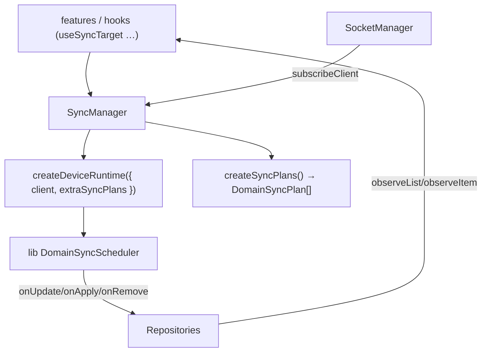

# Sync Domain Spec

Date: 2026-06-25
Status: **As-Built (현재 구현 기준)**

## 목적

이 문서는 `libs/app-runtime`에서 sync를 **어떤 계층이 소유하고**, `createDeviceRuntime`을 어디서 생성하며, 외부가 어떤 API로 sync를 조작하는지 정의한다.

핵심 결정:

1. sync runtime 생성 책임은 `SyncManager`가 가진다.
2. `createDeviceRuntime`은 `SyncManager` 내부에서만 호출한다(외부 비노출).
3. 외부는 raw runtime 대신 `SyncManager`(또는 `useSyncTarget` 훅)로 `register/startSync/stopSync`를 호출한다.
4. SyncPlan(도메인 전략)은 `createSyncPlans()`가 부팅 1회 생성하고 콜백을 data repository에 연결한다.

> 라이브러리(`@lemoncloud/chatic-sockets-lib`) plan/scheduler 메커니즘 자체의 레퍼런스는
> [clientsocket-sync-guide.md](clientsocket-sync-guide.md) / [clientsocket-usage.md](clientsocket-usage.md),
> 도메인별 register/SyncPlan 매핑은 [domain-sync-and-plans.md](domain-sync-and-plans.md) 참조.

---

## 1. 핵심 구조



`createDeviceRuntime`은 **엔진**, `SyncManager`는 그 위의 **앱 계층 오케스트레이터**다. 엔진만 직접 쓰면 부족한 이유:

- client가 바뀌면 runtime도 다시 만들어야 함.
- 등록된 sync target을 새 runtime에 replay해야 함.
- sync 조작 진입점을 한곳에 모아야 함(ref-count, chat prime, dedupe 등 앱 정책 자리).

---

## 2. 책임 분리

### `SyncManager` (`src/socket/sync/SyncManager.ts`)

- `SocketManager.subscribeClient`로 현재 client 구독 → client 생기면 `createDeviceRuntime({ client, extraSyncPlans, ...runtimeOptions })` + `runtime.start()`.
- `register(target)` / `registerChannel|Chat|Place|Profile|Join|Device(id?, intervalMs?)` — `type+id` target on/off.
    - ref-count + dispose 반환(중복 register 안전, 마지막 dispose 시 `stopSync`).
    - `buildTargetKey`로 `type:id` 단위 dedupe.
- client 교체 시: 기존 runtime `stopAllSync` + `stop` → 새 runtime 생성·start → 등록 target **자동 replay**.
- `listTargets()` / `destroy()`.

비책임: token refresh, socket 연결 bootstrap, repository merge 정책.

### `createSyncPlans()` (`src/socket/sync/plans.ts`)

- 앱 도메인용 `DomainSyncPlan[]`을 부팅 1회 생성.
- 각 plan 콜백(`onUpdate`/`onApply`/`onRemove`)을 data repository cache에 연결.
- `DeviceSyncPlan`은 만들지 않는다 — `createDeviceRuntime`이 자체 주입(연결 시 `device.save` 소유).

### repositories (data 레이어)

- 콜백 결과를 로컬 캐시에 반영(merge/remove 정책 소유). 갱신은 `observeList`/`observeItem`으로 UI에 흐른다 — **UI는 네트워크 콜을 직접 하지 않는다.**

---

## 3. 외부 API

### 권장: 훅 (`src/socket/sync/hooks/useSyncTarget.ts`)

```ts
useChatSync(channelId); // { type:'chat', id }
useChannelSync(channelId); // { type:'channel', id }
usePlaceSync(placeId); // { type:'place', id }
useProfileSync(profileId); // { type:'profile', id }
useJoinSync(channelId); // 내 join을 캐시에서 resolve 후 registerJoin
```

- 컴포넌트 lifetime 동안 target을 register하고 cleanup에서 unregister(`register`가 반환하는 dispose에 그대로 매핑).
- target key(type/id/interval)가 바뀔 때만 재등록.
- `useJoinSync`만 예외 — caller는 channelId만 알고 joinId는 캐시에서 비동기 resolve(`${channelId}@${uid}` 폴백)해야 하므로 `useSyncTarget`에 위임하지 않는다.

### 저수준: 직접 진입점

```ts
import { getSyncManager } from '@chatic/app-runtime';
const off = getSyncManager().registerChat('CH001');
// ...
off(); // ref-count 0이면 stopSync
```

---

## 4. lifecycle 규칙

### socket client 생성/교체

- `SocketManager`가 client를 교체하면 `SyncManager`가 감지 → 기존 runtime 정지 → 새 runtime 생성·start → registry replay.

### socket connected / reconnect

- runtime 내부 scheduler가 연결 이벤트를 받아 동작(연결 전 무동작, `connected` 시 자동 시작).
- 같은 client lifecycle 안의 reconnect catch-up은 라이브러리 plan 동작(`onConnected`)을 신뢰.

### socket destroy

- `SyncManager`가 runtime을 `stopAllSync` + `stop` 후 참조를 비운다. target registry는 보존(다음 client에 replay).

---

## 5. chat prime — chat target의 초기 로딩

chat plan은 `run`이 no-op이라 **세션 중 register만으로는 아무것도 안 불러온다.** `SyncManager.startTarget`이 chat target에 한해 `primeChatTarget`을 수행한다:

- chat 캐시는 **영구 보존 + `chatNo` 정렬** → 캐시의 max chatNo가 곧 동기화 커서(별도 meta 커서 없음 — drift 방지).
- `updateLocalSnapshot({ type:'chat', id }, { lastNo: 캐시 max chatNo, minNo:0, messages:[] })`로 plan 기준선을 맞춘다.
- 캐시가 비었을 때만(`lastNo === 0`) 첫 페이지를 `chat.refreshList`로 fetch.
- 더 깊은 gap은 다음 (재)연결 시 `ChatSyncPlan.onConnected` catch-up이 메운다.

> `updateLocalSnapshot`을 빼면 다음 `onConnected`/`run`이 `0` 기준으로 중복 catch-up하므로 chat prime의 필수 단계다.

---

## 6. 도메인별 SyncPlan / register 요약

| plan / target | 버전 축     | 자동 동작                                  | app register 진입점   |
| ------------- | ----------- | ------------------------------------------ | --------------------- |
| channel       | `updatedAt` | `channel.get` 폴링 + `channel.sync` push   | `useChannelSync`      |
| place         | `updatedAt` | `place.get` 폴링 + `place.sync` push       | `usePlaceSync`        |
| profile       | `updatedAt` | `profile.get` 폴링 + `profile.sync` push   | `useProfileSync`      |
| join          | `updatedAt` | `join.get` 폴링(read-state)                | `useJoinSync`         |
| chat          | `chatNo`    | `run` no-op, push append / 재연결 catch-up | `useChatSync`(+prime) |
| device        | `tick`      | `createDeviceRuntime`이 소유               | `registerDevice`      |

도메인별 콜백 매핑·자동 stop·gateway 수동 콜 등 상세는 [domain-sync-and-plans.md](domain-sync-and-plans.md).
</content>
