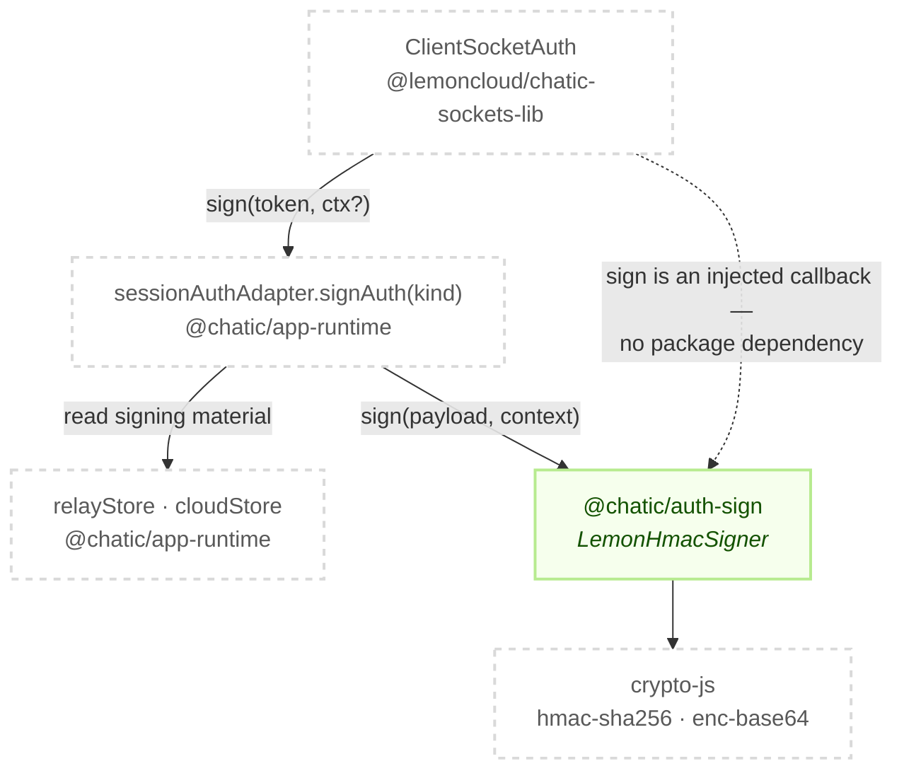
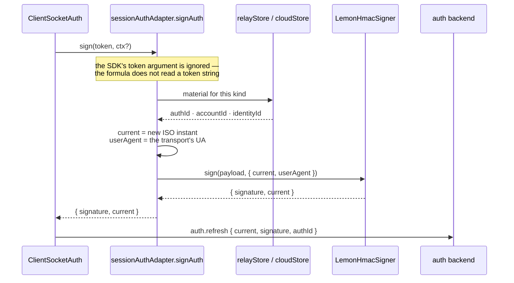

# @chatic/auth-sign

**The lemon HMAC auth signature, and nothing else.** A platform-neutral leaf that turns signing
material into a signature string: `hmac(hmac(hmac(data, authId), accountId), identityId)` over
`data = [current, accountId, identityId, '', userAgent].join('&')`, each `hmac` being a base64
HMAC-SHA256. It exports one contract (`IAuthSigner`), one implementation (`LemonHmacSigner`) and the
three types they pass between them.

## Purpose

This signature is what the socket server verifies on `auth.register` / `auth.refresh` /
`auth.update` / `auth.switch`. Getting it wrong is not a degraded experience — the server recomputes
the HMAC with its own copy of the material and rejects the socket outright, so the formula needs one
owner rather than a copy per call site.

The barrel is the only surface. Nobody reaches past it:

```bash
grep -rn "@chatic/auth-sign/" --include='*.ts' --include='*.tsx' apps libs | grep -v node_modules
```

**This lib does not decide what to sign with.** Which `authId` a socket kind uses, where the
`accountId` and `identityId` come from, when a refresh is due, and what happens to the refreshed
token afterwards are all `libs/app-runtime`'s — see
[`session/auth`](../app-runtime/docs/auth/signing.md). This lib receives material as
arguments and returns a string.

### Why it is a separate lib

It exists to keep a cycle from forming (ADR-0070). The formula's natural home looks like
`@chatic/http`, since the other signature in the repo — AWS SigV4 — lives there. But the consumer of
this one is the socket auth path, so putting it in `@chatic/http` makes wiring a socket's sign
callback drag the HTTP lib, and the `@lemoncloud/lemon-web-core` adapter behind it, into socket
authentication. If the signer is ever extracted into the sockets SDK, that becomes
`chatic-sockets-lib → @chatic/http → lemon-web-core`: a socket library depending on an HTTP stack.

A leaf that holds only the formula is harmless from either side.

## Design principles

1. **No globals.** `current` and `userAgent` are required arguments with no defaults. The version
   this lib replaced defaulted them to `new Date().toISOString()` and `navigator.userAgent`, which
   made it a browser-only function — it threw under Node and had no meaning under React Native.
   Convenience defaults belong to whoever assembles the call.
2. **No network, no storage, no endpoint knowledge.** This lib does not know the refresh endpoint
   exists. It never calls one, never reads a store and never persists a credential.
3. **No `@chatic/*` or `@lemoncloud/*` runtime dependency.** The whole dependency list is
   `crypto-js/hmac-sha256` and `crypto-js/enc-base64`. `purity.spec.ts` enforces both this and rule
   1 by grepping the non-spec sources, so a violation fails the build rather than a review.
4. **The contract is an interface, the implementation is a class.** `IAuthSigner` is owned here
   because the lib is shared: a consumer that wants to swap the algorithm implements the interface
   rather than editing this lib.
5. **The 4th `data` slot is always `''`.** This is a property of the formula, not a caller
   convention — `lemon-web-core`'s own `calcSignature` hardcodes it too. `SignaturePayload` still
   carries an `identityToken` field for call-site compatibility, and the signer never reads it.
6. **The injected `userAgent` must be the one the transport actually sends.** The server verifies
   against the UA it received, so an arbitrary constant fails verification. On the web that means
   `navigator.userAgent`, because the browser sets the same string on the WebSocket handshake and on
   HTTP; on another platform it is that stack's UA.

## Scope

**In** — the lemon HMAC formula, the `IAuthSigner` contract, and the three payload/context/result
types.

**Out** —

- **Choosing the `authId`, and reading the store it comes from** — `libs/app-runtime`
  (`session/auth/sessionAuthAdapter.ts`).
- **Refresh cadence, retry and single-flight** — `ClientSocketAuth` in
  `@lemoncloud/chatic-sockets-lib`. This lib does not know when signing happens.
- **Writing a refreshed token back** — `libs/app-runtime` (`commitRefreshedToken`).
- **AWS SigV4 request signing** — `@chatic/http`. The two signatures share nothing but the word.

## Structure



Every arrow into this lib carries its material as an argument. There is no arrow back out: the
signer cannot reach the store, the clock or the network even if a future consumer wants it to.

### Signing a socket handshake



`current` is echoed back rather than generated here, and that is the point: the value inside the
HMAC and the value on the packet have to be the same instant, so the result type carries it to the
packet instead of letting the caller build a second one.

### Directories

```text
libs/auth-sign/src/
├── index.ts              public barrel — two `export *` lines
├── contracts.ts          SignaturePayload · SignatureContext · AuthSignResult · IAuthSigner
├── purity.spec.ts        the dependency and global-access gates (rules 1 and 3)
└── hmac/
    ├── LemonHmacSigner.ts       the formula
    └── LemonHmacSigner.spec.ts  fixtures, lemon-web-core equivalence
```

There is no `types.ts` and no factory. `contracts.ts` holds all four exported types, and consumers
construct `LemonHmacSigner` with `new`.

## Usage

```ts
import { LemonHmacSigner } from '@chatic/auth-sign';

const signer = new LemonHmacSigner();

const { signature, current } = signer.sign(
    { authId, accountId, identityId, identityToken: '' },
    { current: new Date().toISOString(), userAgent: navigator.userAgent }
);
```

One instance serves every call. The signer holds no state — it is a stateless algorithm object, so
the result depends only on the arguments.

### Wiring

One file in the repo imports this barrel, and one test mocks the specifier
(`sessionAuthAdapter.test.ts`'s `jest.mock('@chatic/auth-sign')`) — so a rename of an export
has two places to land, not one:

```text
sessionAuthAdapter.signAuth(kind)                 libs/app-runtime/src/session/auth/sessionAuthAdapter.ts
└── calcSignature(payload, current, userAgent)    libs/app-runtime/src/session/auth/utils/calcSignature.ts
    └── LemonHmacSigner#sign                      @chatic/auth-sign
```

`calcSignature` is a three-argument wrapper that returns the signature string alone. It exists to
hold the single shared `LemonHmacSigner` instance and to keep the app-runtime call sites reading the
way they did before this lib existed.

## Scenarios

### 1. relay socket sign callback

The SDK calls the injected `sign` callback before `auth.refresh` / `auth.update` / `auth.switch`.
For a relay socket the wiring reads `$auth.id` as the `authId`, plus `accountId` and `identityId`,
and passes them here.

`$auth.id` and not `Token.authId`: the relay server looks the auth model up by `$auth.id` and keys
the HMAC with it, so the other id produces a signature the server cannot reproduce and the socket
fails permanently with `no auth model`. That contract is
[`signing.md` §1](../app-runtime/docs/auth/signing.md); this lib only sees the id that choice
produced, which is why the fixtures below pin both kinds separately.

### 2. cloud socket sign callback

Identical formula, different source: the cloud token's `Token.authId`, with `accountId` and
`identityId` from the same token. Cloud tokens are issued by exchange and keyed by that id.

### 3. A site switch

`ctx.target`, the site-switch selector, does not change the signature. The SDK carries it in the
`auth.switch` packet only. Nothing about a switch reaches this lib.

### 4. The token string changes and the signature does not

Because the 4th `data` slot is fixed at `''`, re-signing with a new identity token produces the same
signature for the same `current`. A consumer that expects the signature to track the token is
misreading the formula, and `LemonHmacSigner.spec.ts` asserts the invariant directly.

## Naming history

_2026-09._ The formula used to live in web-core as `calcSignature` in `awsSigning.ts`, alongside the
SigV4 request signer it has nothing to do with. That name survives in
`libs/app-runtime/src/session/auth/utils/calcSignature.ts` and throughout
[`signing.md`](../app-runtime/docs/auth/signing.md), so a review comment about
"calcSignature" is about this formula.

## How to verify

```bash
npx tsc -b libs/auth-sign/tsconfig.json --force   # lib and specs — both projects are referenced
npx jest --config libs/auth-sign/jest.config.js   # 12 tests across 2 spec files
```

The suite has three parts, and they prove different things.

- **Fixtures** pin the exact signature string for a relay material set and a cloud one, as literals
  rather than snapshots. The literals were computed independently with Node's own `crypto` module —
  neither this implementation nor `lemon-web-core` was used as the reference — so a change to the
  formula turns them red instead of quietly re-baselining.
- **The `lemon-web-core` equivalence test** asserts the same inputs give the same output as that
  package's exported `calcSignature`. It is a canary: if a lemon upgrade moves the formula, the
  server contract moved with it. It is also the one intentional `@lemoncloud/*` import in this lib,
  which is why `purity.spec.ts` scans non-spec files only.
- **`purity.spec.ts`** greps the sources for `@chatic/*` / `@lemoncloud/*` imports and for
  `navigator` / `new Date(`. It strips comments before matching, because the rules are documented in
  prose right next to the fields they protect and would otherwise flag themselves.

Traps:

- **Do not assert the absence of a global as evidence.** `LemonHmacSigner.spec.ts` used to open with
  `expect(typeof navigator).toBe('undefined')`, which checks the runtime rather than the code — Node
  21 and later ship a global `navigator`, so it began failing while the property it meant to protect
  still held. It now signs with an explicit `userAgent` that differs from any global and asserts the
  fixed relay signature, which holds either way. `purity.spec.ts` proves the wider "reads no global"
  property by source inspection. All 12 pass, and this project is in the CI test gate.
- **`jest.config.js` uses `testEnvironment: 'node'` deliberately.** Running the suite green without
  jsdom is itself part of the "no globals" evidence. Do not switch it to jsdom.
- Type checking must be `tsc -b`. Inside a lib, `tsc --noEmit` checks zero files and succeeds.
- Jest does not type check — the base sets `isolatedModules`, so ts-jest transpiles. A broken
  fixture surfaces as `… is not a function` at runtime unless the spec project is checked, which is
  what the `tsconfig.spec.json` reference in `tsconfig.json` is for.
- A stale `dist` / `out-tsc` produces phantom errors after a file moves. `rm -rf` and look again.
- **Downstream**: the only project that imports this barrel is `@chatic/app-runtime`, and
  `verify.yml` covers its typecheck and its tests. The apps behind it do not all get that — `web`,
  `desktop-web` and `@chatic/mobile` are excluded from the typecheck gate, so a change to an
  exported type needs those three run by hand.
