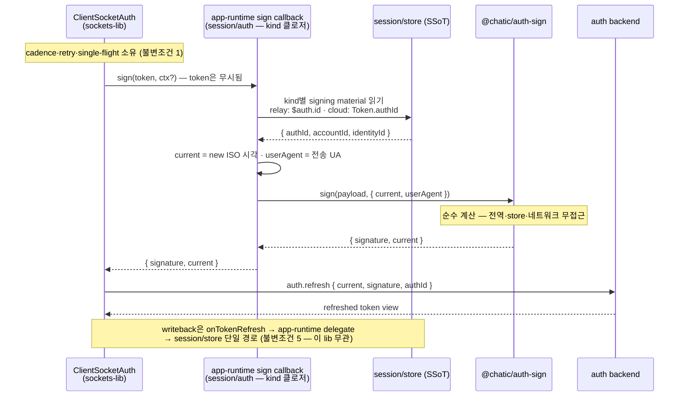
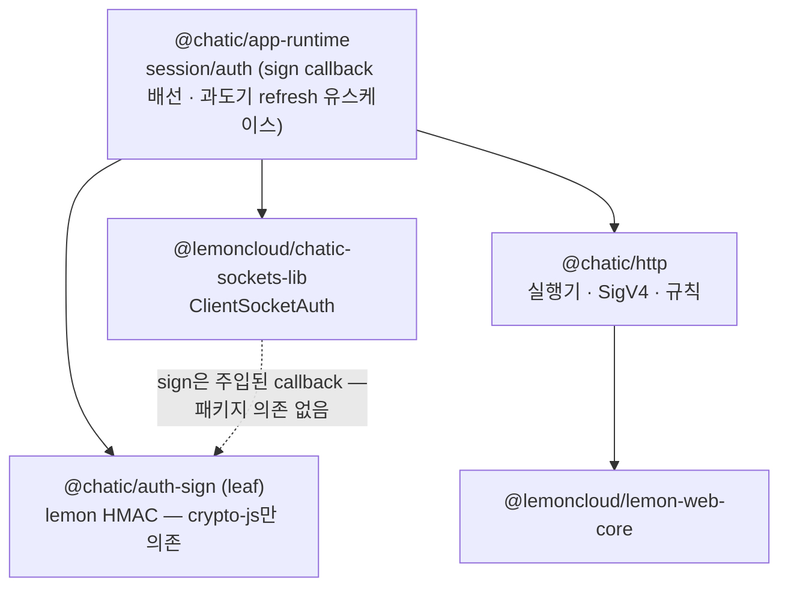

# @chatic/auth-sign — auth refresh/socket signature 계산

> 상태: Live · 최종 갱신: 2026-09-01 · 관련 ADR: [ADR-0070](../../../docs/adr/0070-app-runtime-session-hub.md) (결정 2)

## 구현 후 실측 — 설계와 달라진 점

- **fixture 리터럴은 node `crypto` 모듈로 독립 재계산해 확정했다** — relay
  `lfOFYzXFM4hYKhCfPuDb/0INNosD42VRotuv4VvcTBs=`, cloud `t5omyhdwmHFMsBfEhZLGcJkFUl2bABmTe8IYCjHhNL0=`.
  구현 중 1회 계산해 리터럴로 박는다는 원 계획대로이나, 이 lib과 lemon-web-core 양쪽 모두를
  신뢰 기준으로 쓰지 않기 위해 제3의 독립 구현(node 표준 `crypto`)으로 검증했다.
- **crypto-js 서브모듈 default import가 이 리포에서 처음으로 실제 실행됐다** — 기존
  `web-core/awsSigning.ts`의 동일 import는 `services.test.ts`가 `calcSignature`를 통째로
  mock해 한 번도 실제 실행되지 않았다(잠재 버그, 이번에 처음 노출). `esModuleInterop`이
  `tsconfig.base.json`에 없어 ts-jest의 CJS 변환 경로에서 `encBase64`/`hmacSHA256`가
  `.default` 접근으로 무너진다. `libs/auth-sign/tsconfig.spec.json`에 `esModuleInterop: true`를
  스코프 한정으로 추가해 해결 — 소스는 원래의 `import x from 'crypto-js/...'` 형태 그대로다.
  이 인터롭 문제는 ESM 전용 패키지인 `@lemoncloud/lemon-web-core`를 ts-jest가 재변환할 때도
  똑같이 터지므로, 동등성 테스트가 살아나려면 같은 플래그가 필요했다.
- **lib은 `project.json` 없이 `package.json`만으로 스캐폴딩했으나, `@nx/js/typescript` 플러그인의
  `build` 타깃 추론이 package.json의 명시적 `main`/`exports`/`targets` 필드가 있으면 건너뛴다** —
  `@chatic/db`처럼 non-buildable 소비자(app-runtime)만 물릴 때는 무해하지만, `web-core`(buildable)가
  이 lib을 직접 import하면서 `@nx/enforce-module-boundaries`의 "Buildable libraries cannot
  import from non-buildable" 위반이 났다. `package.json`을 `@chatic/http`와 동일한 최소 형태
  (`name`/`version`/`dependencies`/`private`)로 낮추고 `project.json`을 추가해 `build` 타깃을
  살렸다 — 향후 buildable lib이 소비할 신설 leaf lib은 이 최소 package.json 패턴을 따라야 한다.
- **web-core shim은 "재수출"이 아니라 기본값을 제거한 명시적 래퍼다.** `calcSignature`의 외부
  시그니처를 `(payload, current, userAgent)` 필수 3-인자로 좁혔다 — lib의 "전역 읽기 금지"
  원칙을 호출부까지 관철하기 위해서다. 소비 3곳 중 `signServerAuth`(relay/cloud)와
  `refreshCloudToken` 2곳을 `navigator.userAgent` 명시 주입으로 전환했다.
- **`refreshAuthToken`(대응표 #4)의 lemon `getTokenSignature()` 치환은 이번 범위에서 하지
  않았다** — §리스크가 지목한 대로 재료 출처가 lemon 자체 저장소 → `session/store`로 바뀌는
  변경이라, `session/store`가 아직 app-runtime으로 옮겨지지 않은 지금 단독으로 하면 불일치
  구간 리스크를 검증할 수 없다. 3단계 스토어 통합 커밋과 함께 처리한다(원 계획대로 보류).
- **`purity.spec.ts`가 "의존 0"과 "전역 무접근" 게이트를 grep 기반 테스트로 구현한다** —
  `@chatic/http`의 `refreshAbsence.spec.ts` 패턴을 그대로 따른 것으로, 리포에 실제로 존재하는
  per-lib ESLint `no-restricted-imports` 선례가 없어 원 계획의 "ESLint 게이트" 대신 채택했다.
  주석 안의 "navigator"/"new Date(" 언급(설계 원칙 서술)까지 오탐하지 않도록 주석을 벗겨내고
  검사한다.

## 목적

lemon HMAC auth 서명 — `hmac(hmac(hmac(data, authId), accountId), identityId)`,
`data = [current, accountId, identityId, '', userAgent].join('&')` — 계산의 **단일 소유자**가 되는
플랫폼 비종속 leaf. 이 서명은 두 곳에서 쓰인다: `ClientSocketAuth`의 `auth.refresh`/`auth.update`/
`auth.switch` 패킷, 그리고 HTTP refresh(`POST /oauth/{authId}/refresh`)의 요청 body.

지금 이 계산식의 구현이 **둘 공존한다** (실측, 식은 바이트 단위로 동일):

1. `web-core` 복사본 — awsSigning.ts:25의
   `calcSignature`. 소켓 sign callback(services.ts:615·629)과
   cloud HTTP refresh(api/auth.ts:90)가 소비한다.
2. `@lemoncloud/lemon-web-core` 자체 구현 — dist가 export하는 `calcSignature`(내부 심볼 `j`).
   `webTransport.getTokenSignature()`가 **lemon 자체 저장소**(`@<project>.*`)의 캐시 토큰으로 이
   식을 돌리고, relay HTTP refresh(api/auth.ts:223
   `refreshAuthToken`)가 그 결과를 소비한다. lemon의 봉인된 자동 refresh 경로
   (`init`/`isAuthenticated`/`refreshCachedToken`/`changeUserSite`)도 내부에서 같은 식을 쓴다.

같은 식이 두 저장소·두 구현에 걸쳐 있는 것이 ADR-0070이 지목한 서명 재료 경합의 한 축이다.
3단계에서 이 lib이 유일한 구현이 되고, 소비자는 재료를 들고 와서 계산만 시킨다.

**이 lib의 존재 이유는 순환 회피다** (ADR 결정 4 마지막 문단). lemon HMAC을 `@chatic/http`에
두면, `ClientSocketAuth`의 sign callback 배선이 HTTP lib을 소켓 인증 경로로 끌어들이고, 훗날
sockets-lib이 서명 모듈을 직접 물게 될 때 `chatic-sockets-lib → @chatic/http`(lemon-web-core
adapter까지 통째로) 의존이 생긴다. 서명만 든 leaf면 어느 쪽이 물어도 무해하다.

## 설계 원칙

- **네트워크 호출·토큰 저장 금지** (ADR-0070 결정 2 불변조건 4의 lib 판). 이 lib은 refresh
  endpoint를 모르고, 호출하지 않고, credential을 저장하지 않는다. 입력 재료 → 출력 문자열의
  순수 계산이 전부다.
- **전역 읽기 금지.** 현재 코드는 `current = new Date().toISOString()`,
  `userAgent = navigator.userAgent`를 **기본 인자로 전역에서 읽는다**
  (awsSigning.ts:27-28) — 플랫폼 비종속 leaf에
  부적합하다(RN에는 `navigator.userAgent`가 없거나 다르고, node 테스트 환경에는 없다). lib에서는
  둘 다 **필수 주입 인자**로 승격하고 기본값을 제거한다. 편의 기본값이 필요하면 조립 지점
  (app-runtime의 sign callback 배선)이 소유한다.
- **endpoint·store·refresh 실행 무지.** `session/store`를 읽는 것은 이 lib이 아니라 **소비자**
  (app-runtime의 sign callback / 과도기 refresh 유스케이스)다. ADR §결정 2의 시퀀스 다이어그램은
  `auth-sign → session/store` 읽기 화살표를 그리지만, 이는 결정 6 표의 "endpoint·store·refresh
  실행 무지" 및 불변조건 4와 충돌한다 — **이 문서는 후자를 따른다**: store 읽기는 배선 계층
  소관이고 lib은 재료를 인자로 받는다 (§다이어그램에서 정정).
- **계약은 인터페이스, 구현은 클래스** (ADR 결정 0). `IAuthSigner` 인터페이스와
  `LemonHmacSigner` 구현 클래스. 공유 leaf이므로 계약은 이 lib이 소유한다 —
  `@chatic/http`가 `ports.ts`를 자기 소유로 두는 것과 같은 정당화다.
- **의존 최소.** 런타임 의존은 `crypto-js/hmac-sha256` + `crypto-js/enc-base64` 둘뿐
  (awsSigning.ts:4-5에서 그대로 온다).
  `@chatic/*`·`@lemoncloud/*` 의존 0.

## 범위

**포함 (3단계)**

- awsSigning.ts:25 `calcSignature`의 이관 —
  단, 전역 기본 인자를 제거한 시그니처로.
- 계약 타입: `SignaturePayload` · `SignatureContext` · `IAuthSigner`.
- relay·cloud 각각의 signature fixture 테스트 (ADR §감수하는 것이 지정한 3단계 최우선 테스트).

**제외**

- **refresh 실행·cadence·retry·single-flight** — `ClientSocketAuth`(`AuthController`) 소관
  (불변조건 1). 이 lib은 언제 서명하는지 모른다.
- **AWS SigV4 wire 서명** — `@chatic/http/sign` 소관.
  awsSigning.ts의 나머지 절반(`signAwsRequest`)은
  1단계에 이미 그쪽으로 배정됐다([@chatic/http 설계 문서](../../http/docs/architecture.md) §상세 구현).
- **sign callback 배선과 kind 판정** — app-runtime 소관. relay는 `$auth.id`, cloud는
  `Token.authId`라는 authId 선택은 [signing.md §1](../../app-runtime/docs/socket/auth/signing.md)의
  계약이고, 그 분기는 `session/store`를 읽어야 하므로 lib 밖(현
  services.ts:602 `signServerAuth`의 3단계 이관본)에 산다.
- **store 접근·writeback** — 불변조건 5의 단일 경로(`onTokenRefresh` → app-runtime delegate →
  `session/store`)는 이 lib과 무관하다.

## 시나리오

**소비 경로는 이제 둘이다** (소켓 relay·cloud). 원래 넷이었고 나머지 둘은 HTTP refresh 서명이었는데,
refresh 엔드포인트를 치는 코드가 리포에서 사라지면서 함께 없어졌다 — 3·4번 항목은 그 기록이다.
서명 계산 자체는 전부 동일하고, 다른 것은 **재료의 출처**뿐이다.

1. **relay 소켓 sign callback.** SDK `AuthController`가 refresh/update/switch 전에 주입된
   `sign(token, ctx?)`을 호출한다. 배선(현
   [sessionDelegate.ts:22](../../app-runtime/src/socket/auth/sessionDelegate.ts) →
   services.ts:619-630)이 relay store에서
   `$auth.id`(authId) + `Token.{accountId, identityId}`를 모아 auth-sign에 넘긴다. SDK가 주입한
   `token` 인자는 무시된다 — 서명식은 토큰 문자열에 의존하지 않는다(4번째 슬롯 `''` 고정).
   `ctx.target`(사이트 전환 선택자)도 서명을 바꾸지 않는다 — SDK가 `auth.switch` 패킷에만 싣는다.
2. **cloud 소켓 sign callback.** 같은 흐름, 재료만 cloud store의 `Token.authId` +
   `Token.{accountId, identityId}` (services.ts:606-616).
3. ~~**cloud HTTP refresh 서명 (과도기).**~~ **삭제됨.** `refreshCloudToken`
   (api/auth.ts:73-99)이 `calcSignature`로 body의
   `{current, signature}`를 만들어 `POST {backend}/oauth/{Token.authId}/refresh`를 친다.
   불변조건 1·2에 따라 대체될 운명이었고, 실제로는 대체가 아니라 **제거**로 끝났다 — 유일한
   호출 사슬이 testbed의 흔적기관 한 줄에 매달려 있었다.
4. ~~**relay HTTP refresh 서명 (과도기).**~~ **삭제됨.** `refreshAuthToken`
   (api/auth.ts:222-255)은 서명을 직접 계산하지 않고
   `webTransport.getTokenSignature()` — **lemon-web-core가 자기 저장소의 캐시 토큰
   (`Token.authId` 기준)으로 자체 계산한 서명** — 을 받아 쓴다. 3단계에서 이 경로가 auth-sign +
   `session/store` 재료로 치환됐고(대응표 #4 완료 → lemon 서명 계산 소비 0), 그 뒤 경로 자체가
   사라졌다 — 로그인 수화가 refresh를 부르던 이유가 갱신이 아니라 **버려진 응답 필드 회수**였고,
   교환 응답을 버리지 않게 고치자 필요가 없어졌다.

주의: **서명은 HTTP wire가 아니라 body 재료다.** `{current, signature}`는 요청 body에 실린다
— 헤더를 서명하는 SigV4와 달리, 실행기(`@chatic/http` client)는 이 서명의 존재를 알 필요가
없다. 이 사실이 "HTTP 계층의 소비자가 누구인가"의 답을 결정한다(§상세 구현의 소비자 판정).

## 다이어그램

### refresh 서명 시퀀스 (ADR §결정 2 다이어그램의 auth-sign 관점 구체화)

ADR의 다이어그램과 두 곳이 다르다 — 실측 기준으로 정정한 것이다.
① store를 읽는 주체는 auth-sign이 아니라 app-runtime의 sign callback이다(설계 원칙 참조).
② SDK callback의 실제 시그니처는 `sign(token, ctx?) → Promise<{signature, current}>`
([auth-controller.d.ts:6-11](../../../node_modules/@lemoncloud/chatic-sockets-lib/dist/client-socket-v2/auth-controller.d.ts)
실측, v0.4.13) — `current`는 SDK가 주는 것이 아니라 **앱이 만들어 반환**하고, SDK는 그것을
`auth.refresh` 패킷에 그대로 싣는다.



### 의존 그래프 — 순환 회피가 존재 이유



반례(이 lib이 없을 때): lemon HMAC이 `@chatic/http`에 살면 sign callback 배선이 소켓 인증
경로에 HTTP lib을 끌어들이고, 서명 모듈을 SDK로 추출하는 날
`chatic-sockets-lib → @chatic/http → lemon-web-core` 의존이 생긴다 — 소켓 lib이 HTTP 스택을
무는 순환/역층위다. leaf면 `sockets-lib → @chatic/auth-sign`(외부 추출 후
`@lemoncloud/chatic-auth-sign-lib` 류)이 되어도 무해하다(ADR 열린 질문 5).

## 상세 구현

### 서명식 (실측 확정)

두 기존 구현의 식은 동일하다:

- web-core 복사본 (awsSigning.ts:25-32):
  `data = [current, accountId, identityId, '', userAgent].join('&')` →
  `base64(hmacSHA256(...))`을 `authId → accountId → identityId` 순서로 3중 중첩.
- lemon-web-core dist의 `calcSignature`(심볼 `j`, `node_modules/@lemoncloud/lemon-web-core/dist/index.js`
  실측): 같은 식, **identityToken 슬롯이 `c=""`로 하드코딩** — payload에 identityToken이 있어도
  식은 읽지 않는다. (identityToken을 실제로 넣는 변형은 별도 export `calcTestSignature`뿐이며
  refresh 경로에서 미사용.)

즉 4번째 슬롯 `''`는 호출 관례가 아니라 **식 자체의 불변**이다. 호출부 3곳
(api/auth.ts:90,
services.ts:615·629)이 전부 `identityToken: ''`를
넘기는 것은 그 반영이고, [signing.md §1](../../app-runtime/docs/socket/auth/signing.md)이
"서명식은 token 문자열에 의존하지 않는다"로 문서화한 사실과 일치한다.

### 폴더 구조와 계약

```
libs/auth-sign/src/
├── index.ts
├── contracts.ts           SignaturePayload · SignatureContext · AuthSignResult · IAuthSigner
└── hmac/
    ├── LemonHmacSigner.ts IAuthSigner 구현 클래스 (내부에 순수 계산 함수)
    └── LemonHmacSigner.spec.ts  fixture 테스트 (§검증 방법)
```

```ts
// contracts.ts
export interface SignaturePayload {
    /** HMAC 1차 키. relay 소켓은 `$auth.id`, cloud 소켓·HTTP refresh는 `Token.authId` — 선택은 소비자 소관 (signing.md §1). */
    authId: string;
    accountId: string;
    identityId: string;
    /** 계약 호환용 잔재 — 서명식은 이 값을 절대 읽지 않는다 (data 4번째 슬롯은 '' 고정). */
    identityToken: string;
}

export interface SignatureContext {
    /** ISO 8601. 호출자가 생성 — 서명에 들어간 값과 패킷/body의 `current`가 같아야 서버 검증이 통과한다. */
    current: string;
    /** 전송 계층이 실제로 보내는 User-Agent. 전역(navigator) 읽기 금지 — 반드시 주입. */
    userAgent: string;
}

export interface AuthSignResult {
    signature: string;
    /** 입력 context.current의 에코 — SDK sign callback 반환형 {signature, current}에 맞춘 편의. */
    current: string;
}

export interface IAuthSigner {
    sign(payload: SignaturePayload, context: SignatureContext): AuthSignResult;
}
```

`identityToken` 필드는 기존 `SignaturePayload`(awsSigning.ts:10-15)
와의 호출부 호환을 위해 유지하되, 식이 읽지 않는다는 사실을 주석으로 계약화한다. (제거하는
축소안은 이관 diff를 키우므로 3단계에서는 하지 않는다 — 후속 정리 후보.)

기존 시그니처와의 차이는 하나다: `current`·`userAgent`의 **기본값 제거**. 현재 호출부는 전부
`current`를 명시하고 `userAgent`는 전부 기본값(navigator)에 의존한다(전수 grep — userAgent를
명시하는 호출은 리포에 없다). 따라서 이관 시 각 호출부에 UA 주입 한 줄이 추가된다.

### 현재 서명 코드 위치 전수 → 이관 대응표

| #   | 현재 위치                                                                                | 무엇                                                                                | 3단계 후                                                                                                                    |
| --- | ---------------------------------------------------------------------------------------- | ----------------------------------------------------------------------------------- | --------------------------------------------------------------------------------------------------------------------------- |
| 1   | awsSigning.ts:25 `calcSignature`                                                         | 식의 web-core 복사본                                                                | **완료** — `@chatic/auth-sign`(`LemonHmacSigner`)으로 이동. web-core shim은 재수출이 아니라 필수 3-인자 래퍼(§구현 후 실측) |
| 2   | services.ts:602-631 `signServerAuth`                                                     | 소켓 sign callback 본문 — kind별 재료 수집 + #1 호출                                | `app-runtime/session/auth`로 이관(결정 1), auth-sign 소비. kind 분기·store 읽기는 여기 남는다                               |
| 3   | ~~`refreshCloudToken`~~ **삭제됨**                                                       | cloud HTTP refresh body 서명 — #1 호출                                              | **과도기**: `session/auth`로 이관하며 auth-sign 소비. 정상 상태에서는 `ClientSocketAuth`로 대체·폐지 (불변조건 1·2)         |
| 4   | ~~`refreshAuthToken`~~ **삭제됨**                                                        | relay HTTP refresh — lemon `getTokenSignature()` 소비 (lemon 자체 계산·자체 저장소) | **과도기**: auth-sign + `session/store` 재료로 치환 — lemon 서명 계산 소비 0화. 정상 상태에서는 폐지                        |
| 5   | lemon-web-core 내부 `j` (`init`/`isAuthenticated`/`refreshCachedToken`/`changeUserSite`) | SDK 자체 refresh의 서명                                                             | **봉인 유지** — 불변조건 3이 호출 자체를 금지. 이관 대상 아님                                                               |
| 6   | libs/socket `useInitWebSocket.ts:64` `getTokenSignature`                                 | 죽은 lib의 잔존 소비                                                                | **선행 삭제** (ADR 결정 6 — `libs/socket`은 1단계부터 지울 수 있는 죽은 lib)                                                |

### 소비자 판정 — "HTTP 계층의 소비자"는 실측으로 이렇게 남는다

과업 정의였던 "실제로 남는 HTTP 쪽 소비자가 있는가"의 실측 판정:

- **`@chatic/http` 자체는 auth-sign의 소비자가 아니다.** lemon HMAC은 요청 body 재료이지 wire
  서명이 아니므로(§시나리오), 실행기·정책 스택은 이 서명을 모른다. ADR 결정 3 스케치의
  `HttpRuntimePorts.sign(payload)` 주석("@chatic/auth-sign 또는 HTTP wire signer")은 이 점에서
  실측과 어긋난다 — 1단계 설계 문서도 같은 이유로 `sign` 포트를 두지 않았고
  ([@chatic/http §포트 계약](../../http/docs/architecture.md)), auth-sign이 생겨도 그 판단은
  유지된다. **auth-sign을 HttpRuntimePorts에 꽂지 않는다.**
- **정상 상태(steady state)의 소비자는 sign callback 배선 하나다.** 불변조건 1·2가 완성돼
  refresh endpoint 실행은 relay·cloud 모두 `ClientSocketAuth`뿐이고,
  [requestRelaySessionRefresh](../../app-runtime/src/socket/auth/requestRelaySessionRefresh.ts)의
  HTTP fallback도 예고대로 사라졌다. 그 트리거는 relay 전용으로 좁혀졌다 — cloud 자격증명의 복구는
  refresh가 아니라 재발급(`renewCloudSession`)이다.
- **과도기 소비자는 refresh 유스케이스 2개다** (대응표 #3·#4). 이들이 사라지지 못하는 이유가
  ADR 열린 질문 2다 — 실측으로 소켓 없는/불능 구간의 refresh endpoint 호출자가 살아 있다:
    - 로그인 hydration: OAuth 코드 교환 직후 `refreshRelaySession({syncProfile: true})` — apps 3곳
      (web `useOAuthLogin.ts:55` · desktop-web `useSocialLogin.ts:54` ·
      admin-v2 `OAuthResponsePage.tsx:36`). **소켓이 아직 없는 시점**이라 `ClientSocketAuth`가
      실행할 수 없다 — 불변조건 1과 정면 충돌하는 현존 경로이며, 해소는 열린 질문 2 소관.
    - relay 사이트 전환 services.ts:482와 cloud refresh
      실패 복구 services.ts:512-535, 그리고 `requestSessionRefresh`의 소켓 불능 fallback.
      (셋 다 이후 제거됐다 — 이 목록은 과도기 기록이다.)

    과도기 규칙: 이 유스케이스들은 3단계에서 `session/auth`로 이관되면서 서명 공급원을
    auth-sign으로 **일원화**한다(#4의 lemon `getTokenSignature` 치환 포함). refresh "실행"의
    소유권 이전(폐지)은 열린 질문 2의 결론을 기다리지만, refresh "서명"의 소유권 이전은 3단계에
    끝난다 — 서명 구현이 하나면 열린 질문 2가 어느 쪽으로 결론 나든 계산 코드는 움직이지 않는다.

### kind별 서명 재료 차이 (실측 확정)

ADR §결과가 3단계 최우선 테스트 대상으로 지정한 "kind별 authId·current·credential field
어긋남"의 실측 확정판. **식은 kind와 무관하게 동일하고, 다른 것은 authId의 출처뿐이다.**

| 재료                     | relay 소켓                       | cloud 소켓                       | relay HTTP refresh (과도기)                                   | cloud HTTP refresh (과도기)     |
| ------------------------ | -------------------------------- | -------------------------------- | ------------------------------------------------------------- | ------------------------------- |
| `authId`                 | **`$auth.id`** (services.ts:622) | `Token.authId` (services.ts:608) | lemon 저장소의 `Token.authId` (dist `getTokenSignature` 실측) | `Token.authId` (api/auth.ts:84) |
| `accountId`·`identityId` | `Token.*`                        | `Token.*`                        | lemon 저장소 `Token.*`                                        | `Token.*`                       |
| `current`                | 호출 시각 새 ISO                 | 동일                             | 동일                                                          | 동일                            |
| identityToken 슬롯       | `''` (식 불변)                   | `''`                             | `''` (lemon `j`도 하드코딩)                                   | `''`                            |
| `userAgent`              | `navigator.userAgent` (기본값)   | 동일                             | 동일 (lemon도 navigator)                                      | 동일                            |

relay 소켓에서 `Token.authId`를 쓰면 서버가 다른 키로 HMAC을 재계산해 `no auth model`로 영구
실패한다 — [signing.md §1](../../app-runtime/docs/socket/auth/signing.md)에 커밋 a535055a 이력과
함께 고정된 계약이다. 이 authId 선택은 **auth-sign 밖**(kind를 아는 배선)의 책임이고, lib은
받은 authId로 계산만 한다 — fixture 테스트가 두 kind의 재료 조합을 각각 고정하는 이유다.

### 남은 일 (다음 단계로 이월)

대응표 #4 — `refreshAuthToken`의 lemon `getTokenSignature()`를 auth-sign + `session/store` 재료로
치환하는 것은 이번 범위에서 하지 않았다. 재료 출처가 lemon 자체 저장소(`@<project>.*`의 캐시
토큰)에서 `session/store`(relayStore)로 바뀌는 변경이라, 두 저장소가 이중 보관 중인 지금
(writeback 직후 등 **불일치 구간**에서 서명 재료가 달라질 수 있다) 단독으로 치환하면 그 불일치를
검증할 방법이 없다. 또한 `refreshAuthToken`은 `getTokenSignature()`의 `originToken`에서
`identityPoolId`를 승계하므로(api/auth.ts:245), 치환 시 이
승계도 store 기준으로 재구성해야 한다. **3단계 `session/store` 통합과 같은 커밋으로 옮기는 것이
안전하다** — 그때까지 lemon의 서명 계산 소비는 이 경로 하나만 남는다.

### userAgent 주입의 제약

서명 data에 userAgent가 들어가므로, **서명에 넣은 UA와 서버가 검증에 쓰는 UA가 같아야 한다.**
서버 검증 코드는 이 리포 밖이라 실측하지 못했다(미검증) — 현재 웹에서 동작한다는 사실로부터
"서버가 요청의 UA를 쓴다면 브라우저 전송 UA = `navigator.userAgent`라서 일치한다"까지만 추정할
수 있다. 따라서 주입 규칙은: **조립 지점은 전송 계층이 실제로 보내는 UA를 주입한다** — 웹은
`navigator.userAgent`(WS 핸드셰이크·HTTP 모두 브라우저가 설정), RN 등 다른 플랫폼은 해당 전송
스택의 UA. 임의 상수 주입은 서버 검증 실패를 낳을 수 있으므로 금지. 이 제약은 lib 주석과
조립 지점 코드 양쪽에 남긴다.

## 검증 방법

ADR §감수하는 것: "relay·cloud 각각의 signature fixture … 를 3단계의 최우선 테스트로 둔다."

- **fixture 테스트** (`LemonHmacSigner.spec.ts`) — 고정 시각·고정 userAgent·고정 재료로 서명
  문자열을 핀 고정한다:
    - relay fixture: `authId = 'auth-relay-id'`($auth.id 역할) + 고정 accountId/identityId,
      `current = '2026-08-27T00:00:00.000Z'`, `userAgent = 'fixture-ua/1.0'` → 기대 서명 문자열
      (구현 시 1회 계산해 스냅샷이 아닌 **리터럴로** 박는다 — 식이 바뀌면 반드시 빨간불).
    - cloud fixture: 다른 재료 세트로 동일하게.
    - **identityToken 불변성**: `identityToken: ''`와 `identityToken: 'any-token'`의 서명이
      동일함을 단언 — 4번째 슬롯 `''` 고정이 식의 계약임을 테스트로 못 박는다.
    - `current`·`userAgent` 각 1문자 변경 시 서명이 달라짐을 단언 (재료가 실제로 식에 들어가는지).
- **lemon-web-core 동등성 테스트**: 같은 입력에 대해 `@lemoncloud/lemon-web-core`가 export하는
  `calcSignature`와 결과가 일치함을 단언. 이관이 "식 보존"이라는 주장의 직접 증명이자, lemon
  업그레이드로 서버 계약이 움직이면 감지하는 카나리아다. (lemon 판은 기본 인자가 navigator를
  읽으므로 테스트에서 반드시 인자를 명시 — node 환경에서 기본값 경로는 throw한다.)
- **전역 무접근 게이트**: jest `testEnvironment: 'node'`(jsdom 아님)로 돌린다 — `navigator`가
  없는 환경에서 전 테스트 green인 것 자체가 전역 읽기 부재의 증명. `purity.spec.ts`가 소스(spec
  제외)에서 `navigator`·`new Date(` 부재를 grep으로 단언한다(주석은 제외하고 검사).
- **의존 0 게이트**: `purity.spec.ts`가 소스(spec 제외)에서 `@chatic/*`·`@lemoncloud/*` import
  부재를 grep으로 단언한다 — `@chatic/http`의 `refreshAbsence.spec.ts`와 같은 패턴(리포에
  per-lib ESLint `no-restricted-imports` 선례가 없어 채택). 동등성 테스트의 lemon import는
  spec 파일이라 이 게이트 대상이 아니다.
- **소비자 계약 테스트는 소비자 몫**: `signServerAuth` 이관본의 kind별 재료 선택
  ($auth.id vs Token.authId)은 app-runtime의 세션 테스트
  (services.test.ts의 3단계 이관본 — 현재
  `calcSignature`를 목으로 대체하는 82행 패턴 유지)가 검증한다. auth-sign fixture는 "재료 →
  서명"만, 소비자 테스트는 "store → 재료"만 — 겹치지 않는다.
- **타입체크는 `tsc -b tsconfig.lib.json`** — libs에서 `tsc --noEmit`은 0건 검사 no-op이다
  (리포 기존 함정). 신설 lib 추가 후 다운스트림 유령 에러 시 `dist/`·`out-tsc/` 강제 삭제
  (ADR §감수하는 것의 stale dist 함정).

```bash
npx nx run-many -t test -p @chatic/auth-sign,@chatic/app-runtime,@chatic/web-core
```
