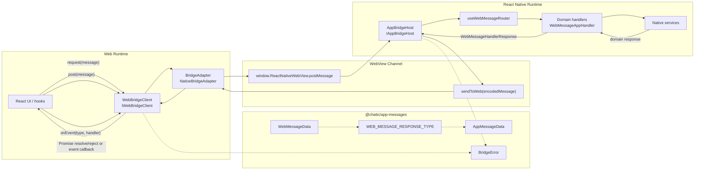
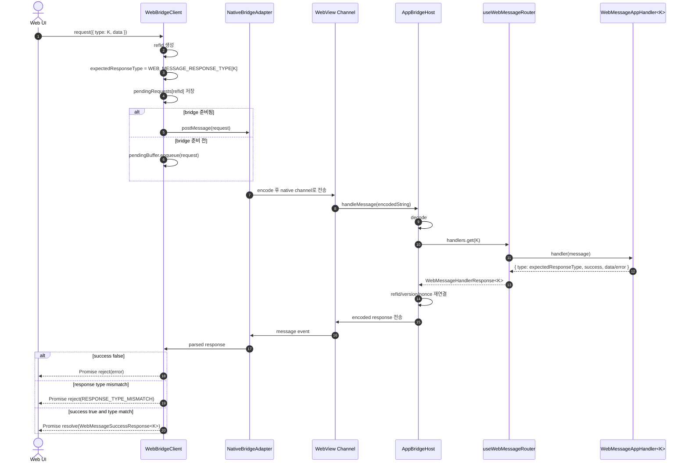
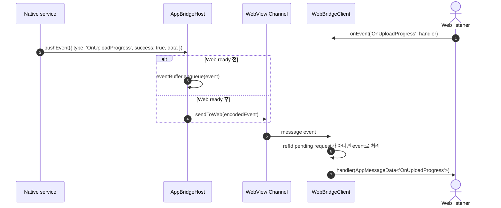
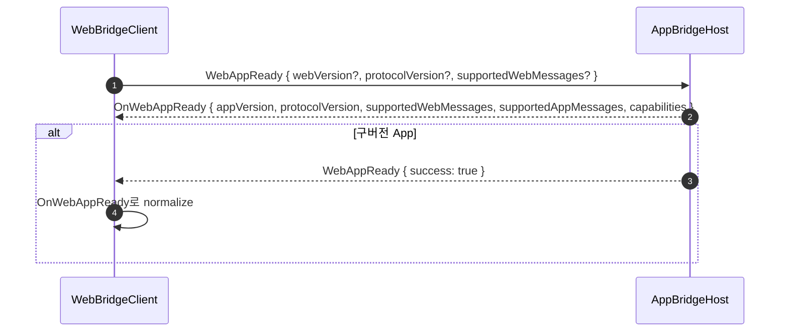

# Chatic Bridge Architecture (`libs/bridges`)

`libs/bridges`는 WebView 안의 Web 앱과 React Native App 사이에서 메시지를 주고받는 bridge 런타임입니다.
메시지 payload 타입은 `@chatic/app-messages`가 소유하고, `libs/bridges`는 전송, 요청-응답 매칭, 이벤트 구독, 호환성 처리, 에러 추적을 담당합니다.

핵심 설계는 다음 한 줄로 요약됩니다.

> `WebMessage` 요청 타입 하나는 `WEB_MESSAGE_RESPONSE_TYPE`에 정의된 정확한 `AppMessage` 응답 타입 하나로 resolve되어야 한다.

---

## 1. 전체 구조



### 책임 분리

| 영역           | 주요 파일                                | 책임                                                                                                |
| -------------- | ---------------------------------------- | --------------------------------------------------------------------------------------------------- |
| 메시지 계약    | `libs/app-messages/src/types/*`          | Web/App 메시지 타입, payload, 요청별 기대 응답 타입, bridge error shape 정의                        |
| Web client     | `src/web/WebBridgeClient.ts`             | request/post/onEvent API, `refId` 기반 pending request 관리, timeout, 응답 타입 runtime guard       |
| Web adapter    | `src/web/adapters/*`                     | 실제 WebView channel과 Web client 사이의 물리 전송 추상화                                           |
| App host       | `src/app/AppBridgeHost.ts`               | WebView에서 들어온 raw message decode, handler routing, response metadata 주입, error response 생성 |
| Native router  | `apps/mobile/.../useWebMessageRouter.ts` | WebMessage type별 native handler 연결                                                               |
| Domain handler | `apps/mobile/.../hooks/use*Handler.ts`   | Native service 호출과 도메인 응답 생성                                                              |

---

## 2. 타입 계약

요청과 응답의 1:1 관계는 `@chatic/app-messages`의 `WEB_MESSAGE_RESPONSE_TYPE`이 단일 출처입니다.

```ts
export const WEB_MESSAGE_RESPONSE_TYPE = {
    RequestFileUpload: 'OnRequestFileUpload',
    ListRecoverableUploads: 'OnListRecoverableUploads',
    WebAppReady: 'OnWebAppReady',
    Ping: 'Pong',
    // ...
} as const satisfies Record<WebMessageType, AppMessageType>;
```

이 맵에서 다음 타입이 파생됩니다.

```ts
type WebMessageResponseType<K extends WebMessageType> = (typeof WEB_MESSAGE_RESPONSE_TYPE)[K];

type WebMessageSuccessResponse<K extends WebMessageType> = AppSuccessMessage<WebMessageResponseType<K>>;

type WebMessageAppHandler<K extends WebMessageType> = (
    message: WebMessageData<K>
) => Promise<AppResponseMessage<WebMessageResponseType<K>>>;
```

### 왜 bridge가 이 맵을 공유하는가

- Web request caller는 `request({ type: 'FetchFcmToken', data: {} })` 호출만으로 `Promise<OnFetchFcmToken>`을 받습니다.
- Native handler는 `WebMessageAppHandler<'FetchFcmToken'>`를 선언하면 `OnFetchFcmToken` 외의 응답 타입을 반환할 수 없습니다.
- `WebBridgeClient`는 runtime에서도 실제 응답 type이 기대 응답 type과 다른지 검사합니다.
- Web과 App 배포 싱크가 어긋난 경우 `RESPONSE_TYPE_MISMATCH`로 빠르게 드러납니다.

---

## 3. Request-Response 흐름



### Request API

권장 API는 message object 형태입니다.

```ts
const response = await bridge.request({
    type: 'RequestFileUpload',
    data: {
        uploadId,
        fileUri,
        fileName,
        fileSize,
        mimeType,
        uploadUrl,
    },
});

// response.type: 'OnRequestFileUpload'
// response.data: { uploadId: string; success: boolean }
```

기존 `request(type, params, timeoutMs)`와 `post(type, params)` overload는 호환을 위해 남아 있지만 deprecated입니다.

---

## 4. App Event Push 흐름

App에서 Web 요청 없이 상태 변화를 밀어보낼 때는 `pushEvent`와 `onEvent`를 사용합니다.



이벤트는 요청-응답 pending map과 독립적으로 처리됩니다. `refId`가 있더라도 pending request에 매칭되지 않으면 event listener 경로로 들어갑니다.

---

## 5. WebAppReady와 호환성

`WebAppReady`는 단순 ready 신호가 아니라 Web/App 사이의 bridge capability handshake입니다.



### `OnWebAppReady` payload

- `appVersion`: App bridge/runtime version
- `protocolVersion`: 현재 대화에서 사용할 protocol version
- `supportedWebMessages`: App이 처리할 수 있는 WebMessage 목록
- `supportedAppMessages`: App이 보낼 수 있는 AppMessage 목록
- `capabilities`: `typedResponses`, `legacyWebAppReady` 같은 기능 플래그

### 호환성 원칙

- Web과 App은 동시에 배포되지 않을 수 있으므로, bridge는 가능한 한 wire format 차이를 흡수합니다.
- 구버전 App이 `WebAppReady` 요청에 `WebAppReady` type으로 응답하면 Web client가 `OnWebAppReady`로 normalize합니다.
- 신규 요청/응답을 추가할 때는 `WEB_MESSAGE_RESPONSE_TYPE`에 매핑을 추가하고, unsupported App에서는 추적 가능한 `ERROR` 응답을 받는 쪽으로 설계합니다.

---

## 6. Error 모델

Bridge 경계의 실패 응답은 `type: 'ERROR'`와 `BridgeError`를 사용합니다.

```ts
type BridgeError = {
    code: string;
    message: string;
    reason?: string;
    traceId?: string;
    requestType?: string;
    expectedResponseType?: string;
    actualResponseType?: string;
    protocolVersion?: string;
    appVersion?: string;
    webVersion?: string;
    platform?: string;
    recoverable?: boolean;
    details?: unknown;
};
```

### 주요 error code

| code                     | 발생 위치             | 의미                                                        |
| ------------------------ | --------------------- | ----------------------------------------------------------- |
| `NOT_FOUND`              | `AppBridgeHost`       | App에 해당 WebMessage handler가 등록되어 있지 않음          |
| `INTERNAL_ERROR`         | `AppBridgeHost`       | 등록된 native handler가 uncaught exception을 던짐           |
| `TIMEOUT`                | `WebBridgeClient`     | 요청이 지정된 시간 안에 응답을 받지 못함                    |
| `NATIVE_NOT_SUPPORTED`   | `MockWebBridgeClient` | 일반 브라우저 등 native bridge가 없는 환경에서 request 호출 |
| `RESPONSE_TYPE_MISMATCH` | `WebBridgeClient`     | 요청 타입이 기대한 AppMessage type과 실제 응답 type이 다름  |

`error.message`는 사용자/로그에서 바로 읽을 수 있는 설명이고, `reason`, `traceId`, `requestType`, `expectedResponseType`, version 필드는 원인 추적과 배포 싱크 문제 파악을 위한 메타데이터입니다.

---

## 7. Native Handler 작성 규칙

Native handler는 `WebMessageAppHandler<K>`를 사용해 요청 payload와 응답 type을 동시에 고정합니다.

```ts
const handleRequestFileUpload: WebMessageAppHandler<'RequestFileUpload'> = async message => {
    const { uploadId } = message.data;

    try {
        await startUpload(message.data);
        return {
            type: 'OnRequestFileUpload',
            success: true,
            data: { uploadId, success: true },
        };
    } catch (error: any) {
        return {
            type: 'OnRequestFileUpload',
            success: false,
            error: {
                code: 'UPLOAD_INIT_FAILED',
                message: error.message,
            },
        };
    }
};
```

라우터에서는 `WebMessageHandlerMap`을 사용해 모든 등록 핸들러가 요청별 응답 타입 계약을 만족하는지 검사합니다.

```ts
const handlerMap = {
    RequestFileUpload: message => handlersRef.current.handleRequestFileUpload(message),
    ListRecoverableUploads: message => handlersRef.current.handleListRecoverableUploads(message),
} satisfies WebMessageHandlerMap;
```

---

## 8. 새 메시지 추가 체크리스트

1. `libs/app-messages/src/types/web-message.ts`에 Web 요청 payload를 추가합니다.
2. `libs/app-messages/src/types/app-message.ts`에 App 응답 payload를 추가합니다.
3. `libs/app-messages/src/types/web-message-response.ts`의 `WEB_MESSAGE_RESPONSE_TYPE`에 요청 -> 응답 매핑을 추가합니다.
4. App handler를 `WebMessageAppHandler<'NewRequest'>`로 작성합니다.
5. `useWebMessageRouter`의 `handlerMap`에 등록합니다.
6. Web caller는 `request({ type: 'NewRequest', data })`를 사용합니다.
7. 응답 타입 mismatch, legacy 호환, error metadata가 필요한 경우 bridge spec을 추가합니다.

---

## 9. Bridge Version 관리

Bridge runtime/protocol version은 `libs/bridges/src/version.ts`에서 관리합니다.

```ts
export const BRIDGE_VERSION = '2.1.0' as const;
export const BRIDGE_PROTOCOL_VERSION = BRIDGE_VERSION;
```

이 값은 `WebBridgeClient`, `AppBridgeHost`, provider, debug WebView test page의 기본 `version`으로 사용됩니다.

버전 bump 기준:

- 요청/응답 wire contract 또는 `WEB_MESSAGE_RESPONSE_TYPE`이 바뀌면 bump합니다.
- `WebAppReady` capability surface가 바뀌면 bump합니다.
- 단순 내부 구현 변경이고 wire contract가 그대로라면 bump하지 않아도 됩니다.
- `package.json`의 `version`은 배포 메타데이터입니다. 현재는 가독성을 위해 bridge runtime version과 맞추지만, App release version과는 별개입니다.

외부에서는 다음처럼 읽을 수 있습니다.

```ts
import { BRIDGE_PROTOCOL_VERSION, BRIDGE_VERSION_INFO } from '@chatic/bridges';
```

---

## 10. 검증

Bridge 계약 변경 후 최소 검증 범위입니다.

```sh
npx tsc -p libs/app-messages/tsconfig.lib.json --noEmit
npx tsc -p libs/bridges/tsconfig.lib.json --noEmit
npx jest -c libs/bridges/jest.config.js --watchman=false
```

모바일 전체 타입 체크는 app workspace의 project reference 상태에 영향을 받습니다.

```sh
npx tsc -p apps/mobile/tsconfig.app.json --noEmit
```
