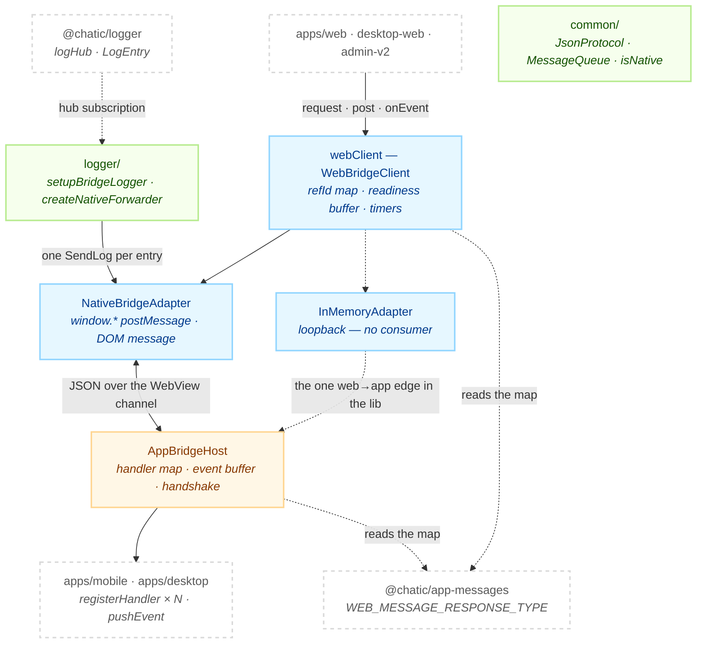

# @chatic/bridges

**The transport that carries a message across the WebView boundary, and the bookkeeping that gets
the reply back to whoever asked.** It holds the web-side client, the native-side host, the two
channel adapters under the client, the JSON framing between them, and the listener that relays web
log entries into the native runtime.

[`@chatic/app-messages`](../app-messages/README.md) is the other half of the boundary. **That package
declares what a message is; this one decides what happens to it.** Every cross-boundary type —
including `BridgeError`, which this lib constructs on both sides but does not declare — lives over
there, because the installed native shell has to be able to build one and it compiles against the
vocabulary alone. Everything here is behaviour: matching a reply to its caller, buffering until the
channel exists, giving up on a timeout, answering a message nobody handles.

## Purpose

Consumers see the `@chatic/bridges` barrel and nothing else. `tsconfig.base.json` maps
`@chatic/bridges` alone — there is no `@chatic/bridges/*` entry, so a deep import does not resolve:

```bash
grep -rn "@chatic/bridges/" --include='*.ts' --include='*.tsx' apps libs | grep -v node_modules
```

The lib imports exactly two workspace packages, and the command that shows it is the whole
dependency statement:

```bash
grep -rhoE "from '@[a-z-]+/[a-z-]+'" --include='*.ts' libs/bridges/src | sort | uniq -c
#   8 from '@chatic/app-messages'
#  15 from '@chatic/logger'
```

260 files import this barrel, and **the single most imported name through it is `logger`** — 162 of
the named imports, none of which this package owns. `src/logger/index.ts` re-exports the whole of
`@chatic/logger` so that consumers written before the split keep compiling. Of the imports that do
resolve to symbols declared here, `isNative` (69) and `webClient` (28) are almost all of them.

What this lib does **not** own: message names, payload shapes and the request→reply map
([`@chatic/app-messages`](../app-messages/README.md)); the log entry contract, the hub, masking and
the upload queue ([`@chatic/logger`](../logger/README.md)); the handlers that answer messages
(`apps/mobile/src/app/webview/hooks/useWebMessageRouter.ts`,
`apps/desktop/src/main/index.ts`); and the injection that puts a channel on `window` in the first
place — each shell does that for itself.

## Design principles

1. **The vocabulary is read, never extended.** `WEB_MESSAGE_RESPONSE_TYPE` is consulted twice —
   `WebBridgeClient` to learn which reply to wait for, `AppBridgeHost` to build the handshake's
   supported-message lists — and this lib adds nothing to it. A new message is an
   `@chatic/app-messages` change plus a handler in a shell; it is never a change here.
2. **One client per web runtime, constructed at module scope.** `webClient` in `provider.ts` is the
   entry point, and it is a singleton because two clients would both bind the DOM `message` listener
   and both try to match the same `refId` — the second one resolves nothing and leaks every promise
   it holds.
3. **Readiness is polled, not announced.** The shells put their channel on `window` during WebView
   load and fire no event, so the client checks at construction and then every 50ms until a deadline
   (`bridgeReadyTimeoutMs`, 10s). Waiting on a handshake instead would deadlock: the handshake is
   itself a bridge message.
4. **A request's timeout starts when it is dispatched, not when it is called.** A request issued
   before the channel exists sits in the readiness buffer with no timer; `dispatchRequest` arms it as
   it goes out. Starting the clock at the call would spend a 15-second budget waiting for a channel
   that has its own 10-second deadline, and every cold-start request would time out instead of
   answering.
5. **The reply type is re-checked at runtime.** `@chatic/app-messages` makes the pairing a compile
   error, but the two sides are different release trains — a web build and an installed shell are not
   necessarily the same generation of that map. A successful reply whose `type` is not the expected
   one is rejected as `RESPONSE_TYPE_MISMATCH` rather than handed to a caller that would read the
   wrong payload.
6. **The outbound path must not use `logger`.** `NativeBridgeAdapter.postMessage` diagnoses with
   `console`, because in a hybrid run `createNativeForwarder` calls that method once per log entry —
   a `logger` call there recurses through log → forwarder → postMessage → failure → log. The inbound
   path has no such loop and uses `logger` deliberately, so a throwing receiver still leaves a
   breadcrumb.
7. **A handler that returns nothing sends nothing.** A reply costs a main-thread hop
   (`evaluateJavascript` on Android, `evaluateJavaScript` on iOS) on the same thread the cache path
   contends for, and a reply to a fire-and-forget message has no pending caller to match — it falls
   through to the event path and is discarded by a listener set that is empty.
8. **No listener in this lib holds an entry.** `createNativeForwarder` keeps a repeat-counter table,
   not a buffer: a suppressed entry is dropped, not deferred. Scheduling machinery inside a log
   listener is the thing that design keeps out.

## Scope

**In** — `WebBridgeClient` and its readiness/pending/event bookkeeping; the two `BridgeAdapter`
implementations; `AppBridgeHost` with handler routing, the `WebAppReady` handshake and the event
buffer; `JsonProtocol` and `MessageQueue`; `isNative()`; the protocol version constants; and the
web→native log relay (`setupBridgeLogger`, `createNativeForwarder`, `appLogInfoCodec`).

**Out** — the message vocabulary and every cross-boundary type
([`@chatic/app-messages`](../app-messages/README.md)); the logging core this package re-exports
([`@chatic/logger`](../logger/README.md)); the handlers (`apps/mobile`, `apps/desktop`); the channel
injection (each shell's preload or injected script); and the console listener, which moved to
`apps/web` because choosing which sinks run is an app decision, not a bridging one.

## Structure



The web half and the app half do not import each other — with one exception, drawn dashed:
`InMemoryAdapter` imports `IAppBridgeHost` so a loopback can drive a host with no WebView. **Nothing
in the repo constructs an `InMemoryAdapter`, including this lib's own specs**, which use a
hand-rolled `jest.Mocked<BridgeAdapter>` instead. The same is true of `configureEnvironment`,
`setAdapter` and `destroy()`: exercised by the specs, called by nobody else.

```bash
grep -rn "InMemoryAdapter\|configureEnvironment\|setAdapter(" --include='*.ts' --include='*.tsx' apps libs | grep -v node_modules | grep -v '^libs/bridges'
```

### A request that outruns its channel

The cold-start path is the one worth drawing, because three mechanisms meet on it — readiness
polling, the pending buffer, and a timer that must not start early.

```mermaid
sequenceDiagram
    participant C as caller
    participant W as WebBridgeClient
    participant A as NativeBridgeAdapter
    participant H as AppBridgeHost
    participant N as handler

    C->>W: request({ type: 'FetchBadgeCount', data: {} })
    W->>W: refId = generateRefId(); pendingRequests.set(refId, …)
    Note over W: not ready — buffer the message, arm NO timer
    W->>W: poll every 50ms for window.ChaticMessageHandler / webkit / ReactNativeWebView

    alt the channel appears before bridgeReadyTimeoutMs
        W->>W: flushBuffer() → dispatchRequest() → timeoutMs starts HERE
        W->>A: postMessage(JSON)
        A->>H: handleMessage(string)
        Note over H: first non-SendLog message marks the web ready<br/>and flushes the host's own event buffer
        H->>N: handler(message)
        N-->>H: { type: 'OnFetchBadgeCount', success: true, data }
        H->>A: re-attach the request's refId and version, encode, sendToWeb
        A-->>W: DOM 'message' event → decode
        W->>W: refId hits pendingRequests; type must equal the expected reply
        W-->>C: resolve(AppSuccessMessage&lt;'OnFetchBadgeCount'&gt;)
    else the deadline passes first
        W->>W: clear the buffer, set availabilityFailed
        W-->>C: reject(BridgeError 'NATIVE_NOT_SUPPORTED')
    end
```

Once `availabilityFailed` is set it is never cleared. Every later `request` rejects immediately, and
every later `post` is dropped with one `debug` line — `debug` and not `warn` because outside a native
shell having no channel is the normal state, and a warning per `post` would dominate the upload
batch in a plain browser.

### The two ends

|                | `WebBridgeClient` (web)                                                   | `AppBridgeHost` (native)                                   |
| -------------- | ------------------------------------------------------------------------- | ---------------------------------------------------------- |
| Outbound       | `post` (no reply) · `request` (awaits the mapped reply)                   | `pushEvent` (unsolicited) · replies returned from handlers |
| Inbound        | `refId` in the pending map → reply; anything else → `onEvent` listeners   | `handleMessage` → the handler map                          |
| Buffers until  | the channel is detected                                                   | the first non-`SendLog` message from the web               |
| Gives up after | `timeoutMs` per request, `bridgeReadyTimeoutMs` for the channel           | never — it has no timers at all                            |
| Teardown       | `destroy()` clears timers, unsubscribes, rejects pending with `DESTROYED` | none; the shell drops the instance                         |

The asymmetry in the "buffers until" row is the subtle one. The host has no readiness signal to wait
for, so it treats **any** inbound message as proof the web is listening — except `SendLog`, because
the web logger relays from the earliest module-evaluation phase, long before the page can receive
events. Counting a log relay as readiness would flush buffered events (a cold-start `OnNavigate`, for
instance) into a page with no listeners, where they vanish.

### The channel

Three runtimes, and `isNative()` is the one predicate that separates them. It lives in
`common/utils.ts` rather than beside the client so a caller can branch on it without pulling the
client in — 69 files do.

| Shell                                | web → app                                                                                                                    | app → web                                                                                     |
| ------------------------------------ | ---------------------------------------------------------------------------------------------------------------------------- | --------------------------------------------------------------------------------------------- |
| `apps/mobile` (React Native WebView) | injected script defines `window.ChaticMessageHandler` (and the WebKit alias) as a shim over `ReactNativeWebView.postMessage` | `webViewRef.postMessage` → DOM `message` event                                                |
| `apps/desktop` (Electron)            | preload exposes `ChaticMessageHandler` through `contextBridge` → `ipcRenderer.send`                                          | main sends over IPC; preload re-dispatches a `MessageEvent` with `webFrame.executeJavaScript` |
| plain browser / SSR                  | nothing is injected                                                                                                          | nothing                                                                                       |

`NativeBridgeAdapter.postMessage` tries `ChaticMessageHandler`, then
`webkit.messageHandlers.ChaticMessageHandler`, then `ReactNativeWebView`, in that order. On mobile
the first branch normally answers, because the injected shim claims that name; the
`ReactNativeWebView` branch is what catches a message sent before the injection has run.

The adapter listens for `message` on **both** `window` and `document`, because the WebView containers
do not agree on which target the event fires at. Listeners are attached on the first `onMessage`
subscription and torn down when the last one leaves, so a client that never subscribes leaves nothing
bound to the page.

### Directories

```text
libs/bridges/src/
├── index.ts       barrel — common · web · app · provider · logger · version
├── provider.ts    webClient: the one WebBridgeClient, timeoutMs 15000
├── version.ts     BRIDGE_VERSION · BRIDGE_PROTOCOL_VERSION · BRIDGE_VERSION_INFO
├── common/        JsonProtocol, MessageQueue, isNative, the message/adapter types
├── web/           WebBridgeClient + adapters/ (NativeBridgeAdapter, InMemoryAdapter)
├── app/           AppBridgeHost + IAppBridgeHost
└── logger/        the web→native relay, and the @chatic/logger re-export
```

22 production files, 6 spec files, 3,146 lines. The barrel exports 15 runtime values of its own — 5
classes and 10 constants — plus 11 interfaces, 5 type aliases, and everything `@chatic/logger`
exports.

Names you would not find by guessing at a filename:

- **`isNative()` is duplicated.** The exported one is in `common/utils.ts`; `WebBridgeClient` carries
  its own private `checkNativeBridgeAvailable` with the same three checks, used as the default for
  the injectable `isBridgeAvailable` config option. They are separate declarations and can drift.
- **`PendingRequest` and `WebBridgeClientConfig` are in `web/types.ts`**, not beside the class.
  `IWebBridgeClient` is there too.
- `BridgeAdapter` and the `Window` global augmentation for the three injected channels are in
  `web/adapters/types.ts`.
- `EnvironmentConfig` and `BridgeFailureConfig` — the simulation knobs — are in `common/types.ts`.
- `AppBridgeHostConfig` is in `AppBridgeHost.ts`; `IAppBridgeHost` has its own file.
- `toAppLogInfo` and `toLogEntry` are both in `logger/appLogInfoCodec.ts`, deliberately neighbours so
  the context tuple cannot be listed differently per direction. `AppLogInfoLogContext` is in the same
  file and is an assertion, not a type anyone uses: `Pick<AppLogInfo, keyof LogContext>` fails to
  compile the moment the two drift, which is the only place that can be caught.
- **There is no `errors.ts`.** Every error this lib produces is a `BridgeError` literal built inline —
  `createNativeNotSupportedError` and `createResponseTypeMismatchError` in `WebBridgeClient`,
  `createErrorResponse` in `AppBridgeHost`.

### Failure vocabulary

| Code                        | Built by          | When                                                                                                                                                  |
| --------------------------- | ----------------- | ----------------------------------------------------------------------------------------------------------------------------------------------------- |
| `NATIVE_NOT_SUPPORTED`      | `WebBridgeClient` | no channel appeared before `bridgeReadyTimeoutMs`, or `window` did not exist at construction (SSR). `request` rejects; `post` logs `debug` and drops. |
| `TIMEOUT`                   | `WebBridgeClient` | no reply within `timeoutMs` — 15s through `webClient`, 10s for a bare `WebBridgeClient`. Counted from dispatch.                                       |
| `RESPONSE_TYPE_MISMATCH`    | `WebBridgeClient` | a `success: true` reply arrived whose `type` is not the one the map names.                                                                            |
| `DESTROYED`                 | `WebBridgeClient` | `destroy()` ran while the request was pending. `recoverable: false`.                                                                                  |
| `BRIDGE_SIMULATION_FAILURE` | `WebBridgeClient` | `configureEnvironment({ forceFailure })` — test seam only.                                                                                            |
| `NOT_FOUND`                 | `AppBridgeHost`   | no handler is registered for the request type.                                                                                                        |
| `INTERNAL_ERROR`            | `AppBridgeHost`   | a handler threw. A thrown `error.code` is passed through instead of this.                                                                             |

Two things about that table are worth knowing before you write a `catch`.

`BridgeErrorCode` (declared in `@chatic/app-messages`) lists six literals and then `| string`, which
is why `DESTROYED` and `BRIDGE_SIMULATION_FAILURE` type-check without appearing in it. The reverse
also holds: **`MALFORMED_RESPONSE` is in that union and nothing in the repo produces it.** The
`malformedResponse` simulation knob injects a `type: 'ERROR'` reply that comes back as a
`RESPONSE_TYPE_MISMATCH` instead.

And **every rejection is a plain object, not an `Error`.** `pending.reject({ code, message, … })` is
what the client does, and a host failure rejects with the `BridgeError` off the wire. There is no
stack, and `err instanceof Error` is `false` — read `err.code`.

## Usage

The web entry point is the singleton. Callers name the message type and nothing else; both payload
types come from the map.

```ts
import { isNative, webClient } from '@chatic/bridges';

// Awaits the mapped reply. Rejects with a BridgeError — a plain object, not an Error.
const { data } = await webClient.request({ type: 'FetchBadgeCount', data: {} });

// Fire and forget. Buffered if the channel is not up yet, dropped once it has timed out.
webClient.post({ type: 'SetBadgeCount', data: { count: 0 } });

// Unsolicited pushes. Returns its own unsubscribe.
const off = webClient.onEvent('OnReceiveNotification', message => show(message.data.notification));
```

A reply to a `post()`ed message is **not** silently thrown away: with no pending `refId` to match, it
is routed to `onEvent` listeners of the reply type. That is what makes `post` + `onEvent` a working
pair for messages whose answer arrives late or more than once.

The native side constructs a host and registers handlers against the same map:

```ts
import { AppBridgeHost } from '@chatic/bridges';

const host = new AppBridgeHost({
    sendToWeb: message => win.webContents.send(TO_WEB_CHANNEL, message),
});

host.registerHandler('FetchBadgeCount', async () => ({
    type: 'OnFetchBadgeCount', // any other string does not compile
    success: true,
    data: { count: await getBadgeCount() },
}));

host.pushEvent({ type: 'OnReceiveNotification', success: true, data: { notification } });
```

### Wiring

```text
web runtime                             apps/web · apps/desktop-web · apps/admin-v2
  └─ webClient                          libs/bridges/src/provider.ts — module singleton
       ├─ new NativeBridgeAdapter()     binds window+document 'message' on first subscribe
       ├─ version  BRIDGE_PROTOCOL_VERSION ('2.2.0')
       ├─ timeoutMs 15000               overrides the class default of 10000
       └─ pendingBuffer new MessageQueue()
  └─ setupBridgeLogger()                apps/web/src/main.tsx — no-op unless isNative()
       └─ logHub.subscribe(createNativeForwarder())

native runtime
  apps/mobile   useAppBridgeHost()      new AppBridgeHost({ sendToWeb, onAppReady,
                                          cacheSchemaVersion, supportedCacheTypes,
                                          resolveCacheDomainVersions })
                useWebMessageRouter()     registerHandler per domain hook
  apps/desktop  createWindow()          new AppBridgeHost({ sendToWeb: IPC })
                registerHandlers(host, win) · startUpdater(host, …)
```

`AppBridgeHost` registers one handler in its own constructor — `WebAppReady` — because that message
is not a readiness ping but a capability handshake, and the answer has to come from the host's
config rather than from a shell that might forget to wire it. The mobile host passes three
cache-capability fields into it; the desktop host passes none, has no local cache DB, and is read by
the web as legacy. The negotiation those fields feed is
[`app-runtime`'s](../app-runtime/docs/data/README.md).

## Scenarios

### 1. Cold start, web ahead of the channel

Every `post` and `request` issued before the shell injects goes into `pendingBuffer`. When the 50ms
poll sees a channel, `flushBuffer` walks the queue and splits it: a message whose `refId` is in
`pendingRequests` goes through `dispatchRequest` (which arms its timer), everything else straight to
`adapter.postMessage`. Nothing is reordered.

### 2. The handshake

`apps/web` calls `request({ type: 'WebAppReady', data: {} })` — a request, not a post, so the
capability report resolves to the caller. The host answers with its protocol version and the full
`supportedWebMessages` / `supportedAppMessages` lists taken from the keys and values of
`WEB_MESSAGE_RESPONSE_TYPE`, plus whichever cache-capability fields it declares. This is also the
message that most often flips the host's readiness flag and flushes its event buffer.

### 3. An event that arrives before anyone is listening

`pushEvent` before the web has sent anything goes into the host's `eventBuffer`. A cold-start
deep link (`OnNavigate`) is the case this exists for: the shell knows the target URL before the
bundle has finished evaluating. The buffer drains on the first non-`SendLog` inbound message, in
order.

### 4. A message this shell does not implement

`AppBridgeHost` answers `NOT_FOUND` with a `traceId`, the `requestType` and the
`expectedResponseType` it looked up, so the failure can be followed across two log systems. The web
deploys ahead of the app, so this is an ordinary outcome and not an incident — `@chatic/db` turns
three specific `NOT_FOUND`s into learned fallbacks, and `apps/desktop-web` swallows others to degrade
gracefully.

### 5. A plain browser

`isNative()` is false, nothing is ever injected, and after 10 seconds every request rejects
`NATIVE_NOT_SUPPORTED`. Callers are expected to branch on `isNative()` first rather than pay the
deadline; `useDesktopNotifications` in `apps/desktop-web` does exactly that, and skips the round trip
entirely.

### 6. A web log crossing to the native console

`setupBridgeLogger()` subscribes `createNativeForwarder` to the hub, but only when `isNative()` — on
plain web it attaches nothing, and the console listener that used to live here belongs to `apps/web`
now. The forwarder maps each entry through `toAppLogInfo` and sends one `SendLog` per entry, carrying
the entry `id` and the occurrence-time context so the server upserts rather than storing the same log
twice.

Two gates sit in front of that send. `debug` crosses only when the shell injected
`CHATIC_APP_CONSOLE_ENABLED` — both of the app's durable sinks drop `debug`, so in a release build
the hop would buy nothing and cost the most, `debug` being the highest-volume level. And identical
lines (same level, tag and message) are folded past 5 within a 1s window, with the swallowed count
reported on the next occurrence; a stalled network otherwise produces one `postMessage` per timing-out
request on the very thread the cache path needs.

## How to verify

```bash
npx tsc -b libs/bridges/tsconfig.json --force   # lib + specs, via the two project references
npx jest --config libs/bridges/jest.config.js   # 6 suites, 68 cases
```

- Type checking must be `tsc -b`. Inside the lib, `tsc --noEmit` checks zero files and succeeds, so
  passing it proves nothing. `nx typecheck @chatic/bridges` runs `tsc --build --emitDeclarationOnly`
  in the lib directory, which builds the same `tsconfig.json`.
- **`tsconfig.json` references both sub-projects on purpose.** Jest does not type check — the base
  sets `isolatedModules` and ts-jest transpiles — so without the spec reference a mock that has
  drifted from the interface it imitates surfaces only as `… is not a function` at runtime, if at
  all. Both sub-projects also reference `../app-messages/tsconfig.lib.json` and
  `../logger/tsconfig.lib.json`; a new workspace dependency needs `nx sync` or the build fails
  downstream, not here.
- `tsconfig.spec.json` emits to `libs/bridges/out-tsc/jest`, which is **not** where
  `tsconfig.lib.json` emits (`dist/out-tsc`). A stale copy of either produces phantom errors after a
  file moves or is deleted, because `tsc -b` does not clean orphaned `.d.ts` files. `rm -rf` both and
  look again.
- The specs run under `jsdom` and reach into `window` directly, deleting `ReactNativeWebView`,
  `ChaticMessageHandler` and `webkit` in `beforeEach` and `afterEach`. A spec that adds a channel and
  forgets to remove it changes which branch a later one takes, and `WebBridgeClient` polls on a
  timer, so fake timers are load-bearing rather than an optimisation.
- `setupBridgeLogger` keeps module state — a `handle` that makes it idempotent. A spec that does not
  call `teardown()` leaves the forwarder subscribed to the hub for the next one.
- Downstream: 260 files across `apps/web`, `libs/app-runtime`, `apps/desktop-web`, `apps/mobile`,
  `libs/db`, `libs/data`, `apps/admin-v2`, `apps/desktop`, `libs/shared` and `libs/theme` import this
  barrel. `.github/workflows/verify.yml` type checks all of those except `@chatic/mobile` and
  `desktop-web`, and excludes `web` from the test run — those are the ones to check by hand.
  `desktop-web` carries a long-standing 21-error baseline, so compare against it rather than
  expecting zero.

```bash
npx nx run-many -t typecheck --exclude=desktop-web,block-kit-builder,@chatic/landing,@chatic/mobile,chatic-deferred-link-cleanup
```

## Versioning

`BRIDGE_VERSION` in `version.ts` is `2.2.0` and `package.json` says `2.1.0`. They are different
numbers on purpose: the package version is npm's, and `BRIDGE_VERSION` is the runtime protocol the
WebView contract speaks. `BRIDGE_PROTOCOL_VERSION` is an alias of it today, kept separate so a future
compatibility layer can run a newer bridge that still speaks an older protocol.

Bump `BRIDGE_VERSION` when the wire contract or the capability surface changes. A desktop-only
feature routed around the message map — `electronAPI.customUi`, `electronAPI.loginItem` — is
deliberately not a reason to: that contract is shared with mobile, and bumping it there would make
every shell look newer than it is. The value reaches the wire through the handshake, through the
`version` field this lib stamps on every outgoing message, and through `protocolVersion` on the
errors it builds — `DESTROYED` being the one exception, since a client that has been torn down is not
reporting a protocol problem.
