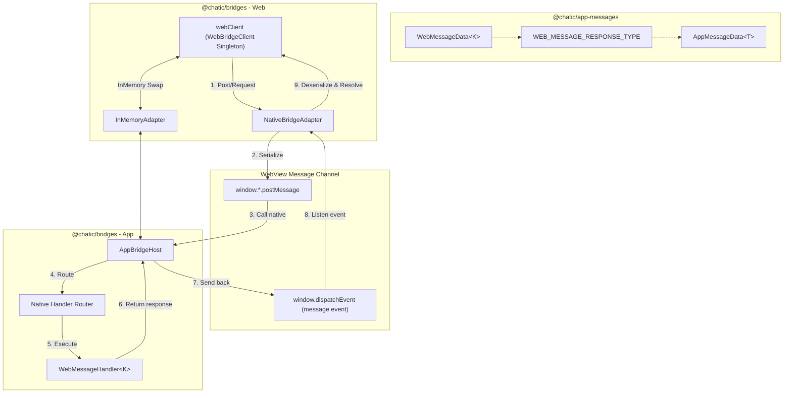
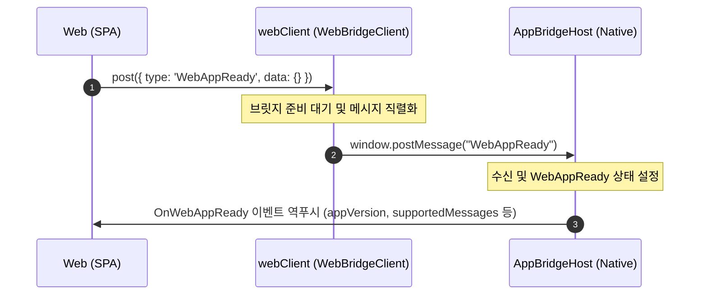
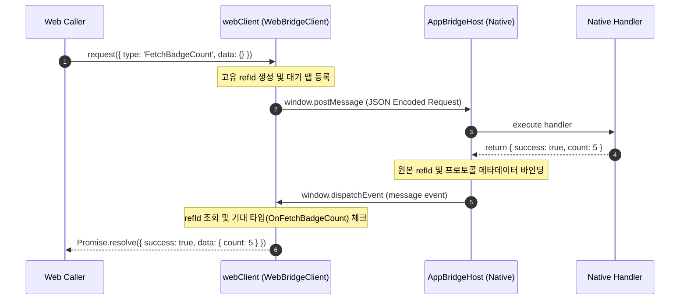
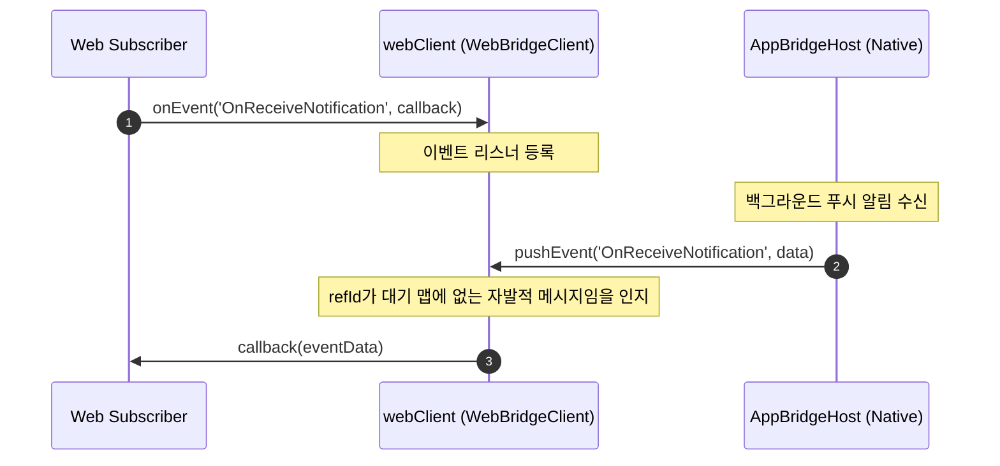
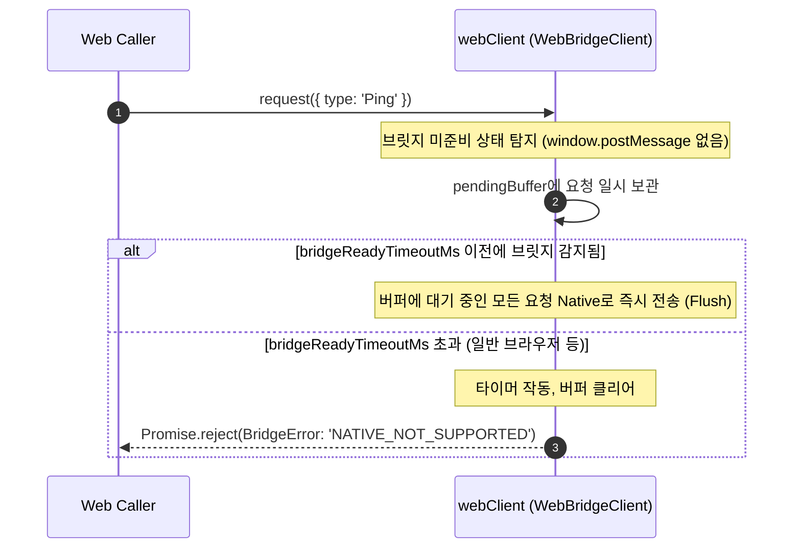
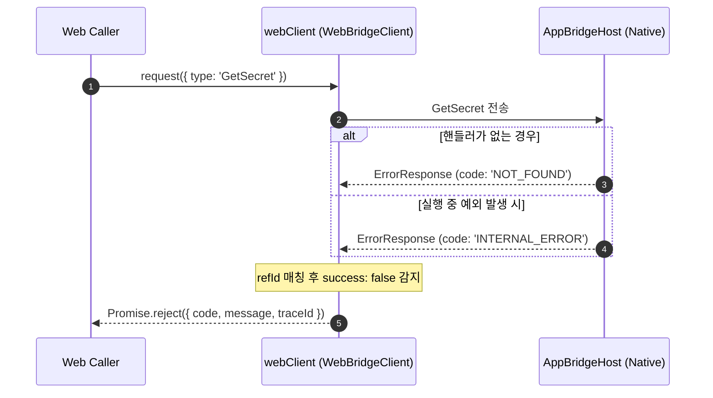

# Chatic Bridges Specification & Architecture

`libs/bridges`는 WebView 내의 Web 앱과 모바일 Native(Android, iOS WebKit, React Native) 앱 사이의 메시지 통신을 담당하는 하이브리드 브릿지 라이브러리입니다.

메시지 규격 및 요청/응답 타입 매핑 계약은 `@chatic/app-messages`가 전담하며, 이 라이브러리는 **메시지 전송, 요청-응답 매칭, 이벤트 구독, 브릿지 주입 탐지, 실패/시뮬레이션 정책, 그리고 메모리 누수 방지**를 구현합니다.

---

## 1. Public Surface

### `@chatic/bridges` Entrypoint

웹 및 네이티브 런타임에서 가져오는 공개 API 구조입니다.

```ts
import { webClient, isNative } from '@chatic/bridges';
import type { IWebBridgeClient, IAppBridgeHost } from '@chatic/bridges';
```

#### 주요 Exports

| Name                  | Type               | 설명                                                                                                                                                            |
| :-------------------- | :----------------- | :-------------------------------------------------------------------------------------------------------------------------------------------------------------- |
| `webClient`           | `IWebBridgeClient` | **공통 싱글톤 클라이언트**. 실제 디바이스 통신용 `NativeBridgeAdapter`가 기본 바인딩되어 있으며, 서버 사이드 렌더링(SSR) 환경에서도 안전하게 동작합니다.        |
| `isNative()`          | `() => boolean`    | 현재 실행 환경이 네이티브 WebView 안인지 판별합니다. (`common/utils.ts`에 정의되어 있어 무거운 브릿지 클라이언트 로드 없이 단독으로 빠르게 실행할 수 있습니다.) |
| `WebBridgeClient`     | `Class`            | 웹 환경의 요청(`request`), 전송(`post`), 이벤트 수신(`onEvent`), 타임아웃, 대기열 버퍼 처리를 구현하는 핵심 클래스입니다.                                       |
| `NativeBridgeAdapter` | `Class`            | 웹뷰 컨테이너가 제공하는 물리 인터페이스(`window.ReactNativeWebView`, `window.webkit` 등)를 통해 메시지를 전송하고 이벤트를 수신하는 실체 채널 어댑터입니다.    |
| `InMemoryAdapter`     | `Class`            | 웹과 앱 사이를 인메모리 루프백으로 이어주는 테스트 및 시뮬레이션용 어댑터입니다.                                                                                |
| `AppBridgeHost`       | `Class`            | 네이티브 앱 환경에서 웹의 요청을 수신하여 등록된 핸들러로 라우팅하고 응답 데이터를 가공/전송하는 역할을 담당합니다.                                             |

---

## 2. Architecture Diagram



### Module Responsibilities

- **[WebBridgeClient.ts](./src/web/WebBridgeClient.ts)**: 비동기 핑퐁 매칭(`refId` 맵 관리), 기본/개별 타임아웃 타이머 관리, 브릿지 준비 전까지 요청 버퍼링, 기대 응답 타입 유효성 검사, 클라이언트 소멸(`destroy()`) 처리.
- **[NativeBridgeAdapter.ts](./src/web/adapters/NativeBridgeAdapter.ts)**: 전역 `window` 객체 유무 파악 및 `postMessage` 전송, DOM 브라우저 `message` 이벤트 리스너 바인딩 및 역직렬화.
- **[common/utils.ts](./src/common/utils.ts)**: 네이티브 브릿지 환경 탐지 (`isNative()`).
- **[AppBridgeHost.ts](./src/app/AppBridgeHost.ts)**: 앱 내부 핸들러 매핑, 요청 객체의 `refId` 및 메타데이터를 유지하여 역전송, 에러 발생 시 표준 프로토콜 에러 응답(`BridgeErrorResponse`) 작성.

---

## 3. Message Type Contract

브릿지 타입은 `@chatic/app-messages`에서 정의한 맵을 전적으로 만족해야 합니다.

```ts
// 예시 계약 정의
export const WEB_MESSAGE_RESPONSE_TYPE = {
    WebAppReady: 'OnWebAppReady',
    FetchBadgeCount: 'OnFetchBadgeCount',
    SetBadgeCount: 'OnSetBadgeCount',
    Ping: 'Pong',
} as const satisfies Record<WebMessageType, AppMessageType>;
```

웹 클라이언트에서 요청 시, `request()` 함수는 이 매핑에 명시된 기대 응답 메시지 타입(`expectedResponseType`)을 수신할 때에만 비동기 `Promise`를 `resolve`시킵니다.

---

## 4. Interaction Scenarios (시나리오 흐름 명세)

### 시나리오 1. 웹앱 초기화 및 핸드셰이크 (`WebAppReady`)

웹 애플리케이션 로드 후 네이티브와의 상호 기능 명세(Capabilities) 및 프로토콜 버전을 확인하는 과정입니다.



### 시나리오 2. Web -> App 요청-응답 (`request`)

웹에서 네이티브의 특정 기능 호출 후 결과를 비동기적으로 대기하여 취득합니다.



### 시나리오 3. App -> Web 단방향 이벤트 푸시 (`onEvent` / `pushEvent`)

네이티브에서 웹의 요청과 무관하게 자발적인 이벤트를 웹으로 직접 밀어주는 방식입니다.



### 시나리오 4. 브릿지 준비 지연 및 미지원 대응

일반 브라우저 환경이나 하이브리드 브릿지가 아직 컨테이너에 의해 주입되지 않은 시점의 방어 코드 시나리오입니다.



### 시나리오 5. 예외 에러 전송 및 처리

네이티브 핸들러가 미등록 상태이거나, 실행 도중 에러가 난 상황에 대응합니다.



### 시나리오 6. 런타임 통신 채널 동적 변경 (Adapter Swapping)

테스트 환경 및 CLI 모킹 시나리오에서 기본 채널(`NativeBridgeAdapter`)을 인메모리 루프백(`InMemoryAdapter`)으로 교체합니다.

```ts
import { webClient, InMemoryAdapter } from '@chatic/bridges';

// 1. InMemory 채널로 교체
const mockAdapter = new InMemoryAdapter();
webClient.setAdapter(mockAdapter);

// 2. 인메모리 환경에서 지연 시간 및 시뮬레이션 지시
webClient.configureEnvironment({ rttDelayMs: 20 });
```

### 시나리오 7. 메모리 누수 방지 리소스 해제 (`destroy`)

웹 SPA(Single Page Application) 컴포넌트 마운트/언마운트 사이클에서 타이머와 리스너 릭(Leak)을 방지합니다.

```ts
// 사용을 마치고 클라이언트를 해제할 때 호출
webClient.destroy();
```

- **수행 결과**: 폴링 타이머 중단, 전역 `window` 이벤트 리스너 해제, 대기 중이던 모든 미결(Pending) `Promise`에 `'DESTROYED'` 코드를 전달해 즉시 reject 처리.

---

## 5. Error Code Map

웹 클라이언트에서 반환 또는 전달받는 표준 오류 코드 표입니다.

| Error Code                    | Source            | 발생 조건 / 설명                                                                                      |
| :---------------------------- | :---------------- | :---------------------------------------------------------------------------------------------------- |
| `'TIMEOUT'`                   | `WebBridgeClient` | 요청 보낸 후 제한 시간(`timeoutMs`) 내에 네이티브로부터 응답을 수신하지 못한 경우.                    |
| `'NATIVE_NOT_SUPPORTED'`      | `WebBridgeClient` | 브라우저/서버 사이드 환경에서 네이티브 연동을 아예 탐지할 수 없거나 초기 감지 타임아웃을 초과한 경우. |
| `'DESTROYED'`                 | `WebBridgeClient` | 응답이 오기 전 `webClient.destroy()`가 호출되어 강제 파기된 경우.                                     |
| `'RESPONSE_TYPE_MISMATCH'`    | `WebBridgeClient` | 응답을 받았으나 성공 응답 형식이 계약 맵에 정의된 규격과 다른 경우.                                   |
| `'BRIDGE_SIMULATION_FAILURE'` | `WebBridgeClient` | 시뮬레이터 환경에서 강제 실패(`forceFailure`) 규칙이 주입된 경우.                                     |
| `'NOT_FOUND'`                 | `AppBridgeHost`   | 네이티브 앱에 해당 메시지 타입을 수집할 수 있는 핸들러가 등록되어 있지 않은 경우.                     |
| `'INTERNAL_ERROR'`            | `AppBridgeHost`   | 네이티브 측 핸들러 실행 내부 로직에서 uncaught exception 예외가 터진 경우.                            |

---

## 6. Verification and Compiling

브릿지 코드를 수정한 뒤 빌드 오류나 회귀 버그(Regression)가 없는지 검증하기 위한 절차입니다.

```sh
# 1. 타입 확인
npx tsc -p libs/bridges/tsconfig.lib.json --noEmit

# 2. 유닛 테스트 (총 28개 스펙 통과 확인)
npx jest --config libs/bridges/jest.config.js --runInBand --watchman=false
```
