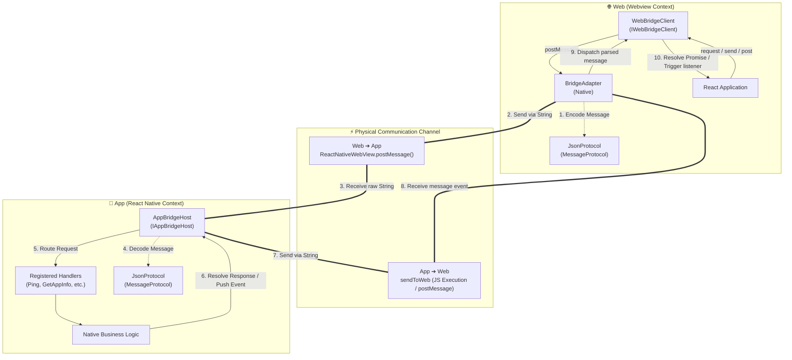
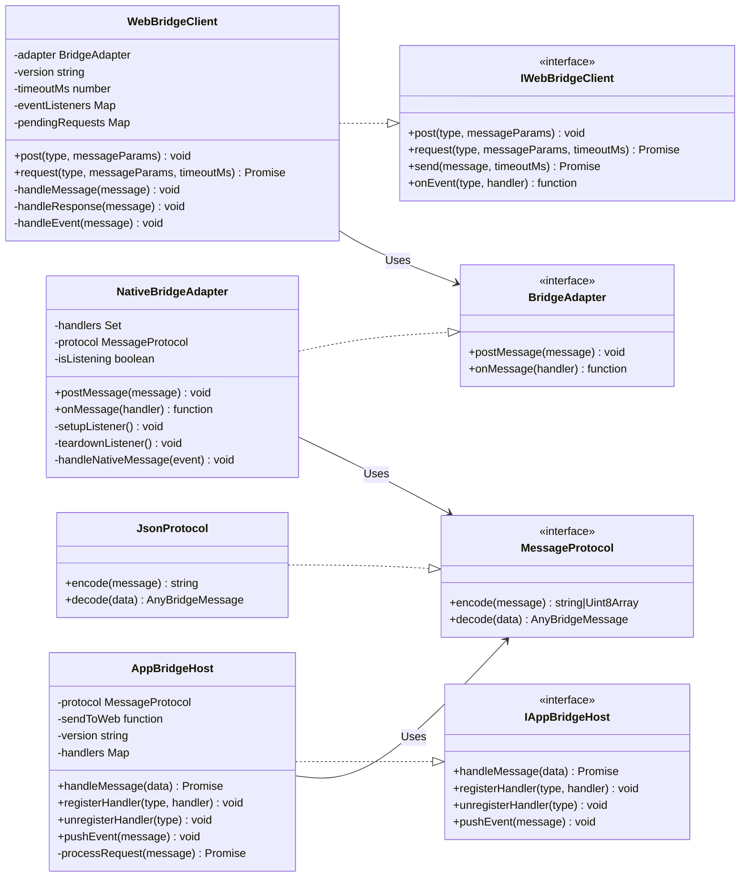
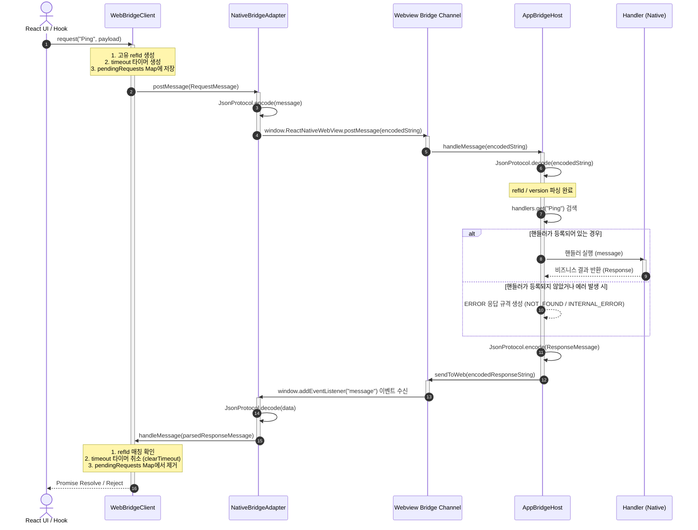
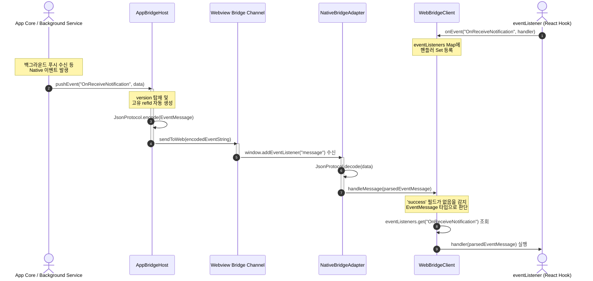

# Chatic Bridge Architecture (`libs/bridges`)

이 문서는 Web(React/Next.js)과 App(React Native) 간의 비동기 양방향 통신을 담당하는 **Chatic Bridge 라이브러리(`libs/bridges`)**의 전체 아키텍처를 상세히 정의합니다. 본 라이브러리는 엄격한 타입 안정성(Type Safety), 비동기 요청-응답 패턴(Request-Response), 그리고 단방향 이벤트 푸시(Event Push)를 지원하도록 설계되었습니다.

---

## 1. Conceptual Block & Layer Diagram (개념적 레이어 구조)

브릿지 통신 계층은 크게 **Web 영역**, **물리적 통신 채널**, 그리고 **Native App 영역**으로 나누어지며, 각각의 역할에 맞게 인터페이스가 추상화되어 있습니다.

---

## 2. Class & Interface Structure (클래스 및 인터페이스 구조)

각 컴포넌트는 추상화된 인터페이스를 따르며, 구체적인 어댑터 및 구현체를 의존성 주입(DI) 받아 유연하게 동작합니다.

---

## 3. Sequence / Message Flow Diagrams (시퀀스 흐름도)

### 3.1. Web ➔ App 비동기 요청-응답 흐름 (Request-Response Pattern)

가장 보편적인 흐름으로, Web에서 App의 고유 기능(예: 파일 시스템 조회, 생체 인증, 카메라 촬영 등)을 호출한 후 비동기 응답(Promise)을 반환받는 흐름입니다.

### 3.2. App ➔ Web 단방향 이벤트 푸시 흐름 (Event Push Pattern)

App(Native) 레이어에서 자발적으로 발생한 상태 변화(예: 백그라운드 작업 완료, 네트워크 상태 변경, 푸시 알림 수신 등)를 Web에 알리는 1방향(Fire-and-Forget) 푸시 흐름입니다.

---

## 4. 핵심 구성 요소 및 설계 철학

### 4.1. 완전한 타입 안정성 (`@chatic/app-messages` 와의 결합)

- Web과 App 양측 모두 `@chatic/app-messages` 패키지의 타입 구조를 강력히 공유합니다.
- `WebMessageType`, `WebMessageData` 등의 강타입 제네릭을 통하여, 전송 시 인자(Payload) 누락 방지 및 반환 데이터 타입에 대한 오토컴플리트(Auto-complete)가 보장됩니다.
- 1:1 매핑 무결성을 위해 `refId`를 통한 펜딩 해제와 안전한 에러 스키마를 상호 탑재하였습니다.

### 4.2. 물리 전송 레이어의 격리 (`BridgeAdapter` 패턴)

- 통신 로직(`WebBridgeClient`)은 환경에 구속되지 않는 순수 비즈니스 로직으로 설계되었으며, 기기 및 웹 환경에 맞춰 작동할 수 있도록 추상화되어 있습니다.
- `NativeBridgeAdapter`는 iOS (`webkit.messageHandlers`), Android (`ChaticMessageHandler`), 그리고 WebView 기본 스키마(`ReactNativeWebView`)를 모두 완벽히 커버합니다.
