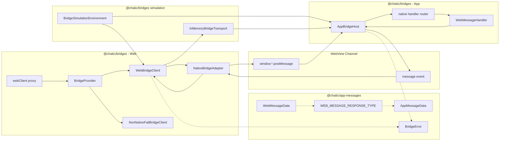
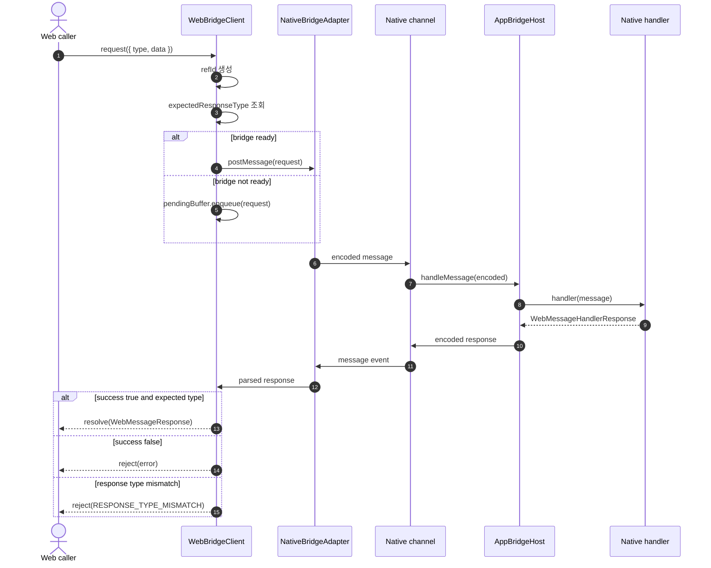
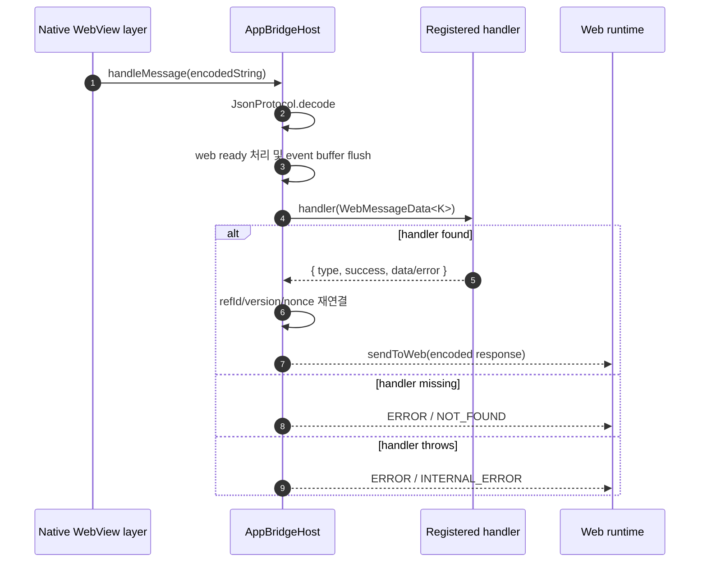

# Chatic Bridges Specification

`libs/bridges`는 WebView 안의 Web 앱과 React Native 앱 사이의 메시지 통신을 담당하는 bridge 런타임입니다.
메시지 payload와 요청/응답 타입 계약은 `@chatic/app-messages`가 소유하고, 이 패키지는 전송, 요청-응답 매칭, 이벤트 구독, bridge readiness, 실패 정책, 테스트 시뮬레이션을 담당합니다.

핵심 규칙은 하나입니다.

> 모든 `WebMessage` 요청은 `WEB_MESSAGE_RESPONSE_TYPE`에 정의된 정확한 `AppMessage` 성공 응답 타입으로 resolve되어야 한다. 실패는 `BridgeError`로 reject된다.

---

## 1. Public Surface

### `@chatic/bridges`

실제 런타임에서 사용하는 production entrypoint입니다.

```ts
import { bridgeProvider, isNative, webClient } from '@chatic/bridges';
import type { IWebBridgeClient, IAppBridgeHost } from '@chatic/bridges';
```

주요 export:

| Export                                  | 설명                                                                                |
| --------------------------------------- | ----------------------------------------------------------------------------------- |
| `webClient`                             | lazy singleton proxy. 호출 시점에 `BridgeProvider.getWebClient()`로 위임합니다.     |
| `bridgeProvider` / `BridgeProvider`     | Web client와 App host 생성/주입을 관리하는 DI provider입니다.                       |
| `isNative()`                            | 현재 window에 native bridge channel이 있는지 확인합니다.                            |
| `WebBridgeClient`                       | Web runtime용 request/post/onEvent 구현체입니다.                                    |
| `NativeBridgeAdapter`                   | WebView native channel로 메시지를 전달하는 adapter입니다.                           |
| `NonNativeFailBridgeClient`             | native bridge를 사용할 수 없는 환경의 명시적 실패 구현체입니다.                     |
| `AppBridgeHost`                         | App runtime에서 Web 요청을 decode하고 handler 응답을 encode하는 host입니다.         |
| `JsonProtocol`, `MessageQueue`          | bridge 내부 공통 protocol/queue primitive입니다.                                    |
| `logger`                                | native bridge 사용 가능 여부에 따라 native/console adapter를 선택하는 logger입니다. |
| `createBridgeSimulationEnvironment()`   | Web client, App host, in-memory transport를 한 번에 구성합니다.                     |
| `activateBridgeSimulationEnvironment()` | bridge simulation을 생성하고 shared `bridgeProvider`에 즉시 연결합니다.             |
| `InMemoryBridgeTransport`               | Web/App 왕복을 메모리에서 시뮬레이션하는 `BridgeAdapter` 구현체입니다.              |
| `BridgeSimulationEnvironmentConfig`     | RTT delay, 강제 실패, timeout, drop, malformed response 등 시뮬레이션 설정입니다.   |

---

## 2. Architecture



### Responsibility

| Module               | 파일                                            | 책임                                                                               |
| -------------------- | ----------------------------------------------- | ---------------------------------------------------------------------------------- |
| Web client           | `src/web/WebBridgeClient.ts`                    | `request`, `post`, `onEvent`, `refId` pending map, timeout, response type guard    |
| Web adapter          | `src/web/adapters/NativeBridgeAdapter.ts`       | WebView native channel encode/decode 및 DOM message listener 관리                  |
| Non-native fallback  | `src/web/NonNativeFailBridgeClient.ts`          | native bridge가 없는 환경에서 request를 `NATIVE_NOT_SUPPORTED`로 reject            |
| App host             | `src/app/AppBridgeHost.ts`                      | App runtime에서 요청 decode, handler routing, metadata 재연결, error response 생성 |
| Provider             | `src/provider.ts`                               | singleton lifecycle, factory DI, runtime default client/host 생성                  |
| Simulation transport | `src/simulation/InMemoryBridgeTransport.ts`     | runtime bridge simulation, delay/failure/drop/mismatch simulation                  |
| Simulation env       | `src/simulation/BridgeSimulationEnvironment.ts` | Web client + App host + transport 조립 및 provider 활성화                          |

---

## 3. Message Contract

Bridge의 타입 단일 출처는 `@chatic/app-messages`입니다.

```ts
export const WEB_MESSAGE_RESPONSE_TYPE = {
    WebAppReady: 'OnWebAppReady',
    FetchBadgeCount: 'OnFetchBadgeCount',
    SetBadgeCount: 'OnSetBadgeCount',
    RequestFileUpload: 'OnRequestFileUpload',
    Ping: 'Pong',
    // ...
} as const satisfies Record<WebMessageType, AppMessageType>;
```

이 맵에서 다음 계약이 파생됩니다.

```ts
type WebMessageResponse<K extends WebMessageType> = AppSuccessMessage<WebMessageResponseType<K>>;

type WebMessageHandler<K extends WebMessageType> = (
    message: WebMessageData<K>
) => WebMessageHandlerResponse<K> | Promise<WebMessageHandlerResponse<K>>;
```

### Caller Contract

`IWebBridgeClient`는 object-style message만 받습니다.

```ts
webClient.post({
    type: 'SetBadgeCount',
    data: { count: 12 },
});

const response = await webClient.request({
    type: 'FetchBadgeCount',
    data: {},
});

response.type; // 'OnFetchBadgeCount'
response.success; // true
response.data.count;
```

`request()`는 성공 응답만 resolve합니다. Bridge-level 실패와 App handler 실패는 reject됩니다.

```ts
try {
    const response = await webClient.request({ type: 'FetchFcmToken', data: {} });
    console.log(response.data.token);
} catch (error) {
    // BridgeError
}
```

### Metadata

`refId`, `version`, `nonce`는 message object의 top-level metadata입니다.

```ts
webClient.post({
    type: 'FetchAppLogBuffer',
    nonce: 'debug-log',
    data: { count: 100 },
});
```

---

## 4. Web Runtime Flow



### Readiness

`WebBridgeClient`는 생성 시 native channel을 polling합니다.

- bridge가 이미 있으면 즉시 ready입니다.
- bridge가 아직 없으면 request/post를 buffer에 쌓습니다.
- bridge가 주입되면 buffer를 flush합니다.
- `bridgeReadyTimeoutMs` 안에 bridge가 주입되지 않으면 buffered request를 `NATIVE_NOT_SUPPORTED`로 reject합니다.

기본 provider는 브라우저 DOM 환경이면 `WebBridgeClient + NativeBridgeAdapter`를 생성합니다. DOM이 없는 환경에서는 `NonNativeFailBridgeClient`를 생성합니다.

---

## 5. App Runtime Flow



### Handler Rule

Handler는 request metadata를 직접 붙이지 않습니다. 도메인 응답만 반환하고, `AppBridgeHost`가 `refId`, `version`, `nonce`를 원 요청에서 다시 연결합니다.

```ts
appHost.registerHandler('Ping', async message => ({
    type: 'Pong',
    success: true,
    data: { payload: message.data.payload },
}));
```

---

## 6. App Event Push

App이 Web 요청 없이 이벤트를 밀어보낼 때는 `pushEvent`와 `onEvent`를 사용합니다.

```ts
const unsubscribe = webClient.onEvent('OnUploadProgress', message => {
    console.log(message.data.progress);
});
```

```ts
appHost.pushEvent({
    type: 'OnUploadProgress',
    success: true,
    data: {
        uploadId,
        progress,
        uploadedBytes,
        totalBytes,
        status: 'uploading',
    },
});
```

Event 처리 규칙:

- `WebBridgeClient`는 `refId`가 pending request에 매칭되면 response로 처리합니다.
- pending request에 매칭되지 않으면 event listener로 dispatch합니다.
- `AppBridgeHost`는 Web ready 전의 event를 buffer에 쌓고, 첫 Web message 수신 후 flush합니다.

---

## 7. WebAppReady

`WebAppReady`는 Web/App capability handshake입니다.

```ts
webClient.post({
    type: 'WebAppReady',
    data: {},
});
```

`AppBridgeHost`의 기본 handler는 `OnWebAppReady`를 반환합니다.

```ts
{
    type: 'OnWebAppReady',
    success: true,
    data: {
        appVersion,
        protocolVersion,
        supportedWebMessages,
        supportedAppMessages,
        capabilities: {
            typedResponses: true,
        },
    },
}
```

`WebAppReady` 요청의 기대 응답 type은 `OnWebAppReady`입니다. App이 `WebAppReady` type으로 응답하면 `WebBridgeClient`는 `RESPONSE_TYPE_MISMATCH`로 reject합니다.

---

## 8. Error Model

Bridge 실패는 `BridgeError` shape로 reject됩니다.

```ts
type BridgeError = {
    code: string;
    message: string;
    reason?: string;
    traceId?: string;
    requestType?: string;
    expectedResponseType?: string;
    actualResponseType?: string;
    protocolVersion?: string;
    appVersion?: string;
    webVersion?: string;
    platform?: string;
    recoverable?: boolean;
    details?: unknown;
};
```

| Code                        | 발생 위치                                      | 의미                                                                 |
| --------------------------- | ---------------------------------------------- | -------------------------------------------------------------------- |
| `NOT_FOUND`                 | `AppBridgeHost`                                | 등록된 handler가 없는 요청입니다.                                    |
| `INTERNAL_ERROR`            | `AppBridgeHost`                                | handler가 uncaught exception을 던졌습니다.                           |
| `TIMEOUT`                   | `WebBridgeClient`                              | native로 dispatch된 request가 제한 시간 안에 응답을 받지 못했습니다. |
| `NATIVE_NOT_SUPPORTED`      | `WebBridgeClient`, `NonNativeFailBridgeClient` | native bridge가 없는 환경에서 native 기능을 호출했습니다.            |
| `RESPONSE_TYPE_MISMATCH`    | `WebBridgeClient`                              | 실제 응답 type이 `WEB_MESSAGE_RESPONSE_TYPE`의 기대 type과 다릅니다. |
| `BRIDGE_SIMULATION_FAILURE` | `InMemoryBridgeTransport`                      | bridge simulation이 강제 실패로 설정되었습니다.                      |

---

## 9. Provider DI

`BridgeProvider`는 stable `webClient` proxy와 runtime bridge replacement를 제공합니다. 앱 코드가 이미 import한 `webClient`는 그대로 두고, provider의 active client만 교체할 수 있습니다.

```ts
import { webClient } from '@chatic/bridges';
import { activateBridgeSimulationEnvironment } from '@chatic/bridges';

const env = activateBridgeSimulationEnvironment({
    rttDelayMs: 200,
    handlers: {
        Ping: async message => ({
            type: 'Pong',
            success: true,
            data: { payload: message.data.payload },
        }),
    },
});

await webClient.request({ type: 'Ping', data: { payload: 'debug' } });

env.restore();
```

Lifecycle:

| Method                      | 설명                                                                            |
| --------------------------- | ------------------------------------------------------------------------------- |
| `getWebClient()`            | active client로 위임하는 stable proxy를 반환합니다.                             |
| `getActiveWebClient()`      | 현재 proxy가 위임 중인 concrete Web client를 반환합니다.                        |
| `getAppHost(sendToWeb)`     | cached App host를 반환하거나 factory로 생성합니다.                              |
| `useBridgeEnvironment(env)` | 실행 중 bridge 환경을 즉시 교체하고 restore 함수를 반환합니다.                  |
| `reset()`                   | active client/App host cache를 비웁니다. factory 설정은 유지합니다.             |
| `configure(config)`         | factory를 교체합니다. 기존 proxy event subscription은 새 client에 재연결됩니다. |
| `restoreDefaults()`         | production default factory로 되돌립니다.                                        |

---

## 10. Bridge Simulation

Bridge simulation은 앱 실행 중 실제 bridge 대신 연결할 수 있는 런타임 검증용 bridge 환경입니다. 별도 testing entrypoint가 아니라 `@chatic/bridges` public API에 포함됩니다.

```ts
import { activateBridgeSimulationEnvironment, createBridgeSimulationEnvironment } from '@chatic/bridges';

const env = createBridgeSimulationEnvironment({
    rttDelayMs: 100,
    handlers: {
        Ping: async message => ({
            type: 'Pong',
            success: true,
            data: { payload: message.data.payload },
        }),
    },
});

const response = await env.webClient.request({
    type: 'Ping',
    data: { payload: 'hello' },
});
```

앱 실행 도중 shared provider를 bridge simulation으로 바꾸려면 `activateBridgeSimulationEnvironment()`를 사용합니다.

```ts
const activeEnv = activateBridgeSimulationEnvironment({
    forceFailure: {
        code: 'FORCED',
        message: 'forced failure',
    },
});

// 기존 앱 코드가 import한 @chatic/bridges의 webClient 호출도 simulation bridge로 전달됩니다.

activeEnv.restore();
```

### Configuration

| Option                 | Type                                       | 설명                                              |
| ---------------------- | ------------------------------------------ | ------------------------------------------------- |
| `version`              | `string`                                   | Web client/App host protocol version override     |
| `timeoutMs`            | `number`                                   | Web client request timeout                        |
| `handlers`             | `WebMessageHandlerMap`                     | simulation App host에 등록할 request handler map  |
| `rttDelayMs`           | `number`                                   | Web -> App -> Web 왕복 delay                      |
| `forceFailure`         | `boolean \| BridgeSimulationFailureConfig` | App host에 도달하기 전에 모든 request를 실패 처리 |
| `timeoutMode`          | `boolean`                                  | request를 App host로 보내지 않아 timeout을 유도   |
| `dropRate`             | `number`                                   | 0~1 사이 message drop 확률                        |
| `responseTypeMismatch` | `boolean \| AppMessageType`                | 성공 응답 type mismatch 유도                      |
| `malformedResponse`    | `boolean`                                  | 잘못된 response shape 유도                        |
| `random`               | `() => number`                             | deterministic drop 테스트용 random provider       |
| `logger`               | `Pick<Console, 'debug' \| 'warn'>`         | simulation transport 로그 adapter                 |

### Failure Example

```ts
const env = createBridgeSimulationEnvironment({
    forceFailure: {
        code: 'FORCED',
        message: 'forced failure',
    },
});

await expect(env.webClient.request({ type: 'Ping', data: { payload: 'x' } })).rejects.toMatchObject({
    code: 'FORCED',
});
```

---

## 11. Adding A New Message

새 bridge message를 추가할 때는 `@chatic/app-messages`와 native handler를 같이 갱신합니다.

1. `libs/app-messages/src/types/web-message.ts`에 Web request payload를 추가합니다.
2. `libs/app-messages/src/types/app-message.ts`에 App response/event payload를 추가합니다.
3. `libs/app-messages/src/types/web-message-response.ts`의 `WEB_MESSAGE_RESPONSE_TYPE`에 request -> response mapping을 추가합니다.
4. App side handler를 `WebMessageHandler<'NewMessage'>` 계약에 맞게 등록합니다.
5. Web caller는 `webClient.request({ type: 'NewMessage', data })` 또는 `webClient.post({ type: 'NewMessage', data })`만 사용합니다.
6. 필요한 경우 `libs/bridges/src/web/WebBridgeClient.spec.ts` 또는 `src/simulation/BridgeSimulationEnvironment.spec.ts`에 runtime guard/simulation spec을 추가합니다.

---

## 12. Versioning

Bridge runtime/protocol version은 `src/version.ts`에서 관리합니다.

```ts
export const BRIDGE_VERSION = '2.1.0' as const;
export const BRIDGE_PROTOCOL_VERSION = BRIDGE_VERSION;
```

Version bump 기준:

- wire contract가 바뀌는 경우
- `WEB_MESSAGE_RESPONSE_TYPE` mapping이 바뀌는 경우
- `WebAppReady` capability surface가 바뀌는 경우
- App/Web 양쪽 배포 호환성 판단에 version signal이 필요한 경우

단순 내부 구현 변경이고 wire contract가 같다면 bump하지 않습니다.

---

## 13. Validation

Bridge 계약 변경 후 최소 검증 범위입니다.

```sh
npx tsc -p libs/app-messages/tsconfig.lib.json --noEmit
npx tsc -p libs/bridges/tsconfig.lib.json --noEmit
npx jest --config libs/bridges/jest.config.js --runInBand --watchman=false
```

관련 caller가 있는 패키지를 수정했다면 해당 패키지 타입 체크도 같이 실행합니다.

```sh
npx tsc -p libs/theme/tsconfig.lib.json --noEmit
npx tsc -p libs/web-core/tsconfig.lib.json --noEmit
```

`libs/bridges/dist`는 git ignored build output입니다. 소스 명세는 `src/**`와 `README.md`를 기준으로 합니다.
