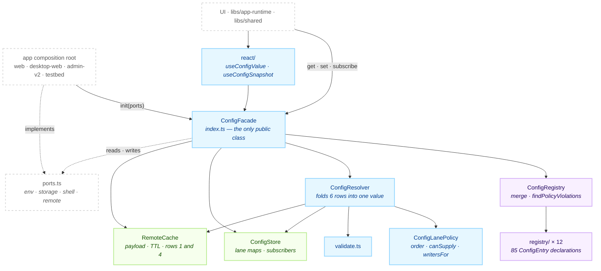
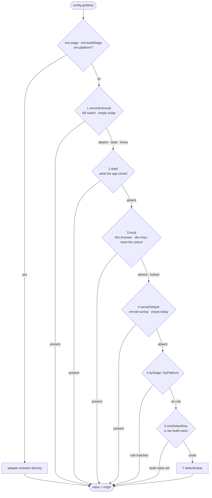

# @chatic/config

**One answer per setting, and one place that decides it.** This lib declares every runtime setting
the apps have — 85 keys across 12 domain modules — folds four override lanes and three registry rows
into a single value, and exports that as one `config` facade. It stores nothing itself and reaches
nothing itself: storage, the native shell and the network all arrive as adapters the app plugs in.

This document covers the **overview and structure** only. The per-layer detail is canonical under
[`docs/`](#documents).

## Purpose

There are exactly **two** entry points: `@chatic/config` for the facade and `@chatic/config/react`
for the two hooks. `tsconfig.base.json` maps `@chatic/config/*` to `libs/config/src/*`, so any
internal path would resolve — nothing but `/react` is imported, and that is the invariant worth
checking rather than a count that moves.

```bash
grep -rn "@chatic/config/" --include='*.ts' --include='*.tsx' apps libs \
  | grep -v node_modules | grep -v '@chatic/config/react'
```

This lib **does not fetch anything, log anything or store anything.** There is no fetcher behind the
two server lanes, no logger import behind `onDuplicateKey`, and no `localStorage` behind
`persist: 'local'`. Each of those is a port the app fills — see [docs/ports/](./docs/ports/README.md).
The one consequence people trip over: `config.get()` before `config.init()` answers `undefined`, and
`config.set()` answers `{ ok: false, reason: 'notWired' }`. Neither throws.

It also does not own **where a control appears**. `surface` says which screen would draw a key's
control, but no screen is generated from it — `apps/web`'s debug `ConfigScreen` renders the `dev`
keys, and a `user` key gets a hand-built row in Settings or no row at all.

## Design principles

1. **This lib imports nothing.** Zero `@chatic` dependencies, zero `import.meta`, zero network, and React only inside `src/react/`. `tsconfig.lib.json` lists no project references at all, and `package.json` declares no dependencies — those two empty lists are the check. Breaking this is what would stop React Native from sharing the core and start import cycles in consumer libs.
2. **Only the value is mutable at runtime.** Type, writers, persistence and surface are authored in the registry and frozen. No lane can change them, or an override could grant itself permission.
3. **The kill switch is read alone and first.** `serverEnforced` looks at the cached payload, the key's own `writableBy` and the TTL — never at the store, the shell or a stage rule. A kill is used when everything else is broken, so it must not travel the road it is closing.
4. **A developer's mistake must not stop a user's boot.** 67 of 85 keys are developer-facing. A duplicate key or an impossible combination fails a test and, at runtime, drops that one key. `ConfigRegistry.merge` never throws.
5. **A refusal is a return value.** `set`/`clear` answer `{ ok: false, reason }`. A debug panel should say why a control did nothing, not crash.
6. **Observers hear only when the resolved value moved.** `set`, `clear` and `applyRemotePayload` all snapshot before and after and notify on the difference. A change under a row that is already losing tells a watcher nothing true.
7. **An absent port means "not wired", never "broken".** No `shell` leaves the shell lane empty; no `remote` leaves both server lanes empty. Only `env` is required, because a stage and a platform are what the registry's rules are judged against.
8. **A new key is one entry in one file.** If adding a key needs a second file, the design has failed. The only exception is the count in `allModules.spec.ts`, which exists to make the addition deliberate.

## Scope

**In** — the key registry and its 12 domain modules, the `ConfigEntry` declaration contract and its
policy invariants, the four-lane precedence table, value validation, the lane store and its
subscribers, the last-known-good remote payload cache, JSON encoding at the storage boundary, the
port interfaces, the shared Vite env adapter, and the two React hooks.

**Out** — every adapter implementation (each app's `src/app/config/adapters.ts`), the shell's side of
the KV bridge (`apps/mobile`'s `ConfigKvService` and `useConfigKvHandler`), the remote fetcher (does
not exist), the screens that draw controls (`apps/web`), the device state log
(`libs/app-runtime`'s `attachConfigStateLog`), and product entitlements such as place and channel
counts, which the server's product catalogue owns.

## Structure



**Only `ConfigFacade` is exported as a class.** `ConfigResolver`, `ConfigStore`, `ConfigRegistry` and
`RemoteCache` stay off the barrel, because a consumer holding the resolver could read a lane the
policy would have refused.

### Resolving one key



Every row is filtered through `isValidValue` before it is used, so a corrupted store or a stale
payload is **demoted to the next row** rather than reaching a screen. Rows 1 to 4 are lanes and set
`isOverridden`; rows 5 to 7 are the registry's own declarations and do not. Full detail in
[docs/resolve/](./docs/resolve/README.md).

### Directories

```text
libs/config/src/
├── index.ts            the ConfigFacade class, the `config` instance, the public barrel
├── types.ts            ConfigEntry · ConfigSnapshot · Lane · Surface · Persist · Stage · Platform
├── ports.ts            ConfigRuntimePorts and the four adapter interfaces
├── registry/           index.ts (merge + findPolicyViolations), modules.ts, 12 domain files
├── resolve/            ConfigResolver · ConfigLanePolicy · validate.ts
├── store/              ConfigStore — one map per lane, plus the subscriber set
├── lanes/              RemoteCache — the payload behind rows 1 and 4, and IRemoteConfigAdapter
├── adapters/           createWebEnvAdapter — the one adapter shared by all four Vite apps
├── utils/              serialize.ts — encodeValue · decodeValue · storageKeyFor
├── testing/            fixtures.ts — entry() · envAdapter() · memoryStorage() · ports()
└── react/              useConfigValue · useConfigSnapshot
```

Three things you cannot guess from a filename. `RemotePayload` and `IRemoteConfigAdapter` live in
`lanes/RemoteCache.ts`, not in `ports.ts`, even though `ports.ts` re-exports the type through the
barrel. `UNLOCK_KEY` is declared in `resolve/ConfigResolver.ts` and leaves the barrel twice — as
`UNLOCK_KEY` and as `CONFIG_UNLOCK_KEY`, and only the alias has a reader. And there is no
`ServerEnforcedLane.ts` or `LocalLane.ts` to open: the four lanes are four cases in
`ConfigResolver.readLane` plus one `RemoteCache`.

## Usage

```ts
// Reading, outside React. Synchronous, and always an answer — defaultValue is the floor.
const ttl = config.get<number>('cache.ttl.metaMs') ?? 300_000;

// Reading, in React.
const theme = useConfigValue<string>('ui.theme');

// Writing. `lane` is which row you are filling, not which key you are writing.
const result = config.set('ui.pushMuted', true, { lane: 'local' });
if (!result.ok) showWhy(result.reason); // unknownKey · laneNotAllowed · locked · invalidValue · notWired

// Removing an override so a lower row shows through again. NOT the same as set(defaultValue).
config.clear('net.relay.backend', { lane: 'local' });

// Watching. The listener is handed the keys IT asked about.
const stop = config.subscribe(['ui.theme'], changed => redraw(changed));
```

Three rules hold.

1. **`config.get<T>()` returns `T | undefined`, always.** It is `undefined` before `init`, and for an unknown key. Consumers compare against the value they want (`!== false`, `?? fallback`) rather than trusting the type parameter.
2. **Read at the point of use, never at module scope.** ES modules evaluate an import's body before the importing file's, so a module-scope `config.get()` runs before `main.tsx` reaches `config.init()` and silently takes the fallback branch. `apps/desktop-web`'s `oauth.ts` records the one time this shipped.
3. **`lane: 'local'` is this browser, `lane: 'shell'` is the native app.** Writing the shell lane round-trips over the bridge and waits for a confirmation; writing the local lane does not.

### Wiring

One file per app assembles the ports, and `main.tsx` calls `init` once.

```text
main.tsx
  ├─ migrateLegacy*()            one-time carry-over into storageKeyFor(<new key>)  ── must be first
  ├─ config.init(webConfigPorts) hydrateShell() then hydrateStorage()
  └─ runtime.boot.initAppRuntime()
        └─ attachConfigStateLog()      libs/app-runtime — logs overridden keys, then each change
```

Four apps do this: `apps/web`, `apps/desktop-web`, `apps/admin-v2` and `apps/testbed`. `apps/mobile`
does **not** — it implements the other side of the shell port instead. Among libs, only
`libs/app-runtime` and `libs/shared` import this one.

Legacy migrations run **before** `init`, because `init`'s `hydrateStorage()` is what reads their
output into the local lane. A migration that runs after it writes values nobody will read until the
next boot.

## Scenarios

### 1. Boot

`config.init(ports)` merges the 12 registry modules, builds the resolver, reads the shell's boot
envelope into the `shell` lane wholesale, then walks every key and reads its persisted override into
the `local` lane. The envelope is a `window` global the shell injected, read synchronously — there is
no bridge round trip to wait for, which is what lets `init` be a plain synchronous call.

### 2. A user toggles something in Settings

`useDevicePushMute` calls `config.set('ui.pushMuted', value, { lane: 'local' })`. `ui.pushMuted` is
`surface: 'user'`, so the override unlock does not apply to it — the lock guards QA levers, not a
person's own routine action. The value lands in the local lane, is JSON-encoded into
`@chatic/config.ui.pushMuted` in `localStorage`, and every `useConfigValue('ui.pushMuted')` re-renders.

### 3. QA changes an endpoint on a PROD build

The debug panel's `ConfigScreen` writes the **local** lane for any key it shows. On a PROD build
`system.overridesUnlocked` resolves `false` through its `byStage`, so every `surface: 'dev'` key
answers `{ ok: false, reason: 'locked' }` and `canWrite` omits `'local'`, which is what renders the
control disabled instead of dead. Ten taps on the app-version row plus the entry code writes the
unlock key, and the same write then passes.

### 4. The theme, in the native shell and in a plain browser

`ui.theme` is `persist: 'shell'`, so a write goes over the bridge and waits for the shell to confirm
it — once, then one retry, then `onShellWriteFailed`. It is **also** mirrored into the same
`localStorage` a `persist: 'local'` key would use, because a plain browser tab has no shell to be the
source of truth and would otherwise lose the value on reload. On a device the shell lane outranks
that mirror, so the mirror is invisible; in a browser it is the only copy.

### 5. An old app build does not know the message

`SaveConfigValue` is answered with `NOT_FOUND` by an app that predates it. The web ships before the
app, so this is routine rather than exceptional. `apps/web`'s shell adapter learns the answer once
per session and downgrades to the legacy `SavePreference` bridge — but only for the four keys that
have a legacy equivalent. A key with nothing to fall back to reaches `onShellWriteFailed`, which is
the honest outcome.

### 6. The remote lanes, which ship empty

Rows 1 and 4 are in the precedence table with nothing behind them. They are registered now precisely
because adding a lane later would quietly change what every key resolves to on devices already in
people's hands. When a fetcher arrives, the app passes `remote` to `init` and turns
`system.remote.enabled` on — two separate switches on purpose — and neither the policy nor the
resolver changes by a line. `killLane.spec.ts` drives that path with a fake adapter today, which is
the only thing keeping it from rotting.

## Documents

| Folder                                      | What it covers                                                                                                          |
| ------------------------------------------- | ----------------------------------------------------------------------------------------------------------------------- |
| [docs/registry/](./docs/registry/README.md) | Declaring a key. The `ConfigEntry` contract, the 12 domains, the four surfaces, the enforced invariants, how to add one |
| [docs/resolve/](./docs/resolve/README.md)   | Turning declarations into a value. The seven rows, the unlock gate, validation, stage vs build stage, the remote cache  |
| [docs/ports/](./docs/ports/README.md)       | The outside world. The four adapters, what each app wires, the shell KV round trip and its legacy fallback              |

## How to verify

```bash
npx tsc -b libs/config/tsconfig.lib.json     # the lib
npx tsc -b libs/config/tsconfig.spec.json    # the 8 spec files
npx tsc -b libs/config/tsconfig.json         # both, through the references — what nx typecheck runs
npx jest --config libs/config/jest.config.js
```

- Type checking must be `tsc -b`. Inside a lib, `tsc --noEmit` checks zero files and succeeds, so passing it proves nothing.
- **The two projects emit to different directories on purpose.** `tsconfig.lib.json` writes to `dist/out-tsc` and the spec project to `dist/out-tsc/config-spec`, because two composite programs writing the same `.d.ts` paths overwrite each other's output.
- Jest does not type check — the base sets `isolatedModules`, so ts-jest transpiles. A fixture missing a required member runs green under jest whenever the omitted member happens not to be called, which is why the spec project has to be in the reference list.
- `registry/allModules.spec.ts` is the invariant test: it asserts the key count, that no two domains declare the same key, that `findPolicyViolations` is empty, that no `title`/`description` is blank, and the surface distribution. Adding a key means updating the count there.
- A stale `dist`/`out-tsc` produces phantom errors after a directory moves. `rm -rf` and look again.
- Downstream: a changed barrel identifier reaches six projects — `libs/app-runtime`, `libs/shared`, `apps/web`, `apps/admin-v2`, `apps/testbed` and `apps/desktop-web`. `.github/workflows/verify.yml` type checks the first five. `apps/desktop-web` is excluded there against a long-standing baseline, so it is the one to run by hand, from inside its own directory: `npx tsc --noEmit -p tsconfig.app.json`.
