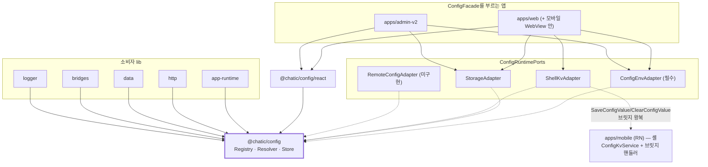

# `@chatic/config`

> 상태: **Approved** · 최종 갱신: 2026-09-09
> 관련 ADR: [ADR-0079](../../../docs/adr/0079-config-registry-and-lane-resolver.md) ·
> [ADR-0080](../../../docs/adr/0080-debug-panel-shared-model-and-stage-visibility.md) ·
> 키 목록: [레지스트리 키 제안](../../../docs/spec/config-registry-keys.md) ·
> 표면별 화면 배치: [surfaces.md](./surfaces.md)

## 목적

설정값 하나를 정하는 방법을 한곳으로 모은다.

지금은 네 군데에 흩어져 있다.

| 어디                                | 얼마나                |
| ----------------------------------- | --------------------- |
| `import.meta.env` 직독              | 31파일                |
| 앱이 넣어주는 `window.CHATIC_APP_*` | 20종 · 22파일         |
| local/sessionStorage 플래그         | 로그 3키 + 딥링크 2키 |
| `PREFERENCES` + 스토어              | 12키 + 448줄          |

웹과 모바일이 같은 개념을 따로 만들어 서로 모른다. 킬 스위치는 없다. 내구성 있는 토글 하나를 추가하려면
세 파일을 고치고 앱 심사를 기다려야 하는데, **웹은 앱보다 먼저 배포된다.**

## 설계 원칙

한 번의 결정이 아니라 **이 영역을 앞으로 만질 때마다 지키는 기준**이다.

1. **config는 아무것도 임포트하지 않는다.** `@chatic` 의존 0 · `import.meta` 0 · React 0 · 네트워크 0.
   바깥은 앱이 꽂는 어댑터로만 닿는다. 이 원칙이 깨지면 모바일이 같은 코드를 못 쓰고, 소비자 lib에서
   순환이 생긴다.
2. **값만 런타임 가변이다.** 누가 쓸 수 있는지·어떤 형식인지·어디 저장하는지는 코드에 박는다. 어느
   레인도 못 바꾼다. 아니면 오버라이드가 자기에게 권한을 줄 수 있다.
3. **킬 스위치는 혼자 산다.** 1행은 다른 레인보다 먼저, 혼자서 본다. 킬은 다른 게 다 망가졌을 때 쓰는
   것이라 같은 길을 지나가면 그때 같이 죽는다.
4. **개발자 실수가 사용자를 죽이지 않는다.** 키의 80%가 개발자용이다. 그중 하나의 실수로 모든 사용자의
   앱이 안 켜지면 안 된다. 검사는 테스트가 하고, 실행 중에는 그 키만 버린다.
5. **이름은 실측된 관례에서만 가져온다.** 새 어휘를 발명하지 않는다. 접미사를 정할 때는 리포에서 실제로
   몇 개 쓰이는지 세어보고 고른다(ADR-0079 결정 12).
6. **새 키는 한 행이다.** 키를 늘리는 데 두 곳 이상을 만져야 하면 설계가 실패한 것이다.

## 범위

**포함**

- `libs/config` 신설 — 레지스트리 · 리졸버 · 스토어 · 포트 · React 어댑터
- 84키 전부 선언 (12도메인) + `title`/`description` 작성
- `libs/web-config` 삭제, 소비자 8파일 이관
- 모듈 로드 부수효과 4단계 해체
- 원격 레인 2행을 **빈 채로** 등재 + 가짜 어댑터 계약 테스트
- 노출면 셋(`dev` · `user` · `labs`)의 키 선언
- 기기 상태 로그 (부팅 1회 + 변경 시)
- `apps/desktop-web` 이관 — `import.meta.env` 7파일 · `CHATIC_APP_*` 2파일 ·
  `useNotificationPrefsStore` 1파일 (2026-09-09 지시로 범위 편입, 5단계에서 스토어 이름 정정,
  6단계에서 앞의 두 카운트 정정 — 실제 이관 대상은 `import.meta.env` 1파일이고 `CHATIC_APP_*`는
  0파일이다. §6 "스펙과 달라진 점")

**제외**

- 원격 어댑터 구현 · fetcher · 폴링 (ADR-0079 결정 10)
- 디버그 패널 이관 자체 (ADR-0080 — 다음 라운드, `apps/web/docs/architecture/`에 별도 문서).
  **ADR-0080은 Accepted지만 구현이 0이다** — 결정 11(앱 화면 15개의 버튼을 웹으로)과 결정 12(앱
  디버그 UI를 0으로)가 둘 다 미착수이고, `apps/mobile/src/app/features/debug`는 **32파일 7,237줄**
  (그중 화면 15개 5,917줄) 그대로 남아 있다. `FloatingMenu.tsx`(202줄)와 `App.tsx`의 마운트 조건도
  그대로다. 이 문서의 1~7단계가 그 이관의 **기반**(범용 KV 셸 레인 · 84키 레지스트리 ·
  `snapshotAll()`)을 만들었을 뿐이라는 뜻이다. 두 ADR이 모두 Accepted라 문서만 읽으면 앱 UI가 이미
  지워진 것처럼 보일 수 있으니, 숫자를 여기 적어 둔다.
- A/B 배정 · 점진 배포 · 타겟팅 (자리도 만들지 않는다)
- 제품 한도 · 기기 식별자 · 시각 토큰 통일

## 시나리오

각 사례 끝의 숫자는 **어느 행이 이겼는지**다. 전체 8건은
[레지스트리 키 제안 §시나리오](../../../docs/spec/config-registry-keys.md)가 소유한다.

### 부팅

1. 앱 엔트리가 `config.init(ports)`로 어댑터를 꽂는다. `env`는 필수, 나머지는 없으면 그 레인이 빈다.
2. 레지스트리 12파일을 병합한다. 키 이름이 겹치면 먼저 선언된 것을 남기고 로그를 남긴다. **앱은 켜진다.**
3. 셸이 있으면 주입 봉투를 읽어 셸 레인을 채운다. 없으면 그 레인은 비어 있다.
4. 저장소에서 로컬 오버라이드를 읽는다.
5. 기본값과 다른 키를 한 줄로 로그에 남긴다. 대부분 기기에서 이 줄은 비어 있다.

### 값 읽기

`config.get('cache.ttl.metaMs')` → 1행(서버 강제, 지금은 빔) → 2행(앱) → 3행(웹, 잠금 확인) →
4행(서버 기본값, 지금은 빔) → 5행(환경 규칙) → 6행(기본값). **→ 5 또는 6.**

### 값 쓰기

디버그 화면이 `config.set('log.upload.hold', true, { lane: 'local' })`를 부른다. 리졸버가 정책을
확인한다 — 이 키에 `local`이 있는지, 잠금이 풀렸는지, 형식이 맞는지. 통과하면 스토어에 넣고 **resolve
결과가 바뀐 키만** 옵저버에 알린다. 거부되면 이유를 돌려준다(던지지 않는다). **→ 3.**

`persist: 'shell'`인 키는 앱에도 보낸다. **답을 받고, 실패하면 한 번 다시 보내고, 그래도 안 되면 화면에
"저장 못 함"을 알린다**(ADR-0080 결정 10).

### QA가 딥링크로 백엔드를 바꾼다

`?_backend=...`가 로컬 레인 쓰기로 일반화된다. PROD에서는 `system.overridesUnlocked`가 `false`라
**거부된다.** 10탭 + 입장 코드로 풀면 통과한다. **→ 3 (잠기면 5·6).**

### 원격 어댑터가 나중에 온다

`config.init`에 `remote`를 넘기고 `system.remote.enabled`를 켠다. **리졸버·정책·레지스트리는 손대지
않는다.** 1·4행이 이미 배열에 있고 비어 있었을 뿐이다.

## 다이어그램

### 의존 방향



### 값을 정하는 순서


### 모듈


## 상세 구현

### 새로 만드는 파일

| 파일                              | 역할                                                                           |
| --------------------------------- | ------------------------------------------------------------------------------ |
| `src/index.ts`                    | `config` 파사드 인스턴스 하나만 내보낸다. 내부 클래스는 노출하지 않는다        |
| `src/ports.ts`                    | `ConfigRuntimePorts` + `I*Adapter`. 없는 멤버 = 배선 안 됨                     |
| `src/types.ts`                    | `ConfigEntry` · `ConfigSnapshot` · `Lane` · `Stage` · `Platform` · `SetResult` |
| `src/registry/index.ts`           | 도메인 병합. 중복은 먼저 것을 남기고 `logger.error`                            |
| `src/registry/<도메인>.ts` ×12    | `system env net ui log debug feature limit bridge auth sync cache`             |
| `src/resolve/ConfigLanePolicy.ts` | 레인 순서 배열 + 자격 판정 + `meta` 면제                                       |
| `src/resolve/ConfigResolver.ts`   | 레인 fold + 스냅샷 조립                                                        |
| `src/resolve/validate.ts`         | `type`/`values` 검증. 순수 함수                                                |
| `src/store/ConfigStore.ts`        | 레인별 값 보관 + 옵저버. resolve 결과가 바뀐 키만 통지                         |
| `src/lanes/RemoteCache.ts`        | 원격 페이로드 보관 + 1·4행 읽기. TTL 만료 시 킬만 버린다                       |
| `src/utils/serialize.ts`          | 저장 경계의 JSON 인·디코드. 못 읽는 값은 없는 것으로 본다                      |
| `src/testing/fixtures.ts`         | 테스트용 엔트리·어댑터·메모리 저장소                                           |
| `src/utils/*`                     | 순수 헬퍼만 (키 파싱 · 봉투 직렬화)                                            |
| `src/react/index.ts`              | `useConfigValue` — `useSyncExternalStore`                                      |

> **스펙과 달라진 점 (2026-09-09, 1단계).** 초안은 레인 클래스 4개(`ServerEnforcedLane`·`ShellLane`·
> `LocalLane`·`ServerDefaultLane`)를 두기로 했다. 실제로는 각각이 맵 읽기 한 줄을 감싸는 껍데기가 되어
> `ConfigResolver.readLane`의 `switch` 4갈래와 `RemoteCache` 하나로 합쳤다. **불변조건은 그대로다** —
> 순서는 여전히 `ConfigLanePolicy.order` 한 곳에만 있고, 레인을 늘리는 비용도 두 곳
> (`order` 배열 한 행 + `switch` 한 case)으로 같다. 클래스 4개를 만들면 같은 비용에 파일만 늘었다.

골격 파일은 [`libs/logger`](../../logger) 형태를 그대로 따른다 — `package.json`(`@chatic/config`,
private) · `project.json` · `tsconfig.json` · `tsconfig.lib.json` · `tsconfig.spec.json` ·
`jest.config.js`.

### 앱 어댑터 (앱 쪽에 만든다)

`@chatic/config`의 `ConfigFacade`를 실제로 부르는(= `ConfigRuntimePorts`를 조립하는) 앱만 이
표에 있다. `apps/mobile`은 여기 없다 — ADR-0080의 "웹이 리모컨, 앱은 기기" 모델대로 `ConfigFacade`
자체는 웹 번들(모바일 WebView 안에서 도는 것도 포함해) 안에서만 산다. 모바일 네이티브 코드는
`ConfigRuntimePorts`를 조립하는 쪽이 아니라 **셸 포트가 원격으로 부르는 반대쪽** — 범용 KV 저장소와
브릿지 핸들러 — 를 구현한다 (아래 "셸의 두 반쪽" 참고).

| 앱                 | 파일                                                      | 읽는 것                                                                                         |
| ------------------ | --------------------------------------------------------- | ----------------------------------------------------------------------------------------------- |
| `apps/web`         | `src/app/config/adapters.ts` + `shellKvAdapter.ts`(4단계) | `import.meta.env` + `window.CHATIC_APP_*` + 네이티브 브릿지(`shell`, 네이티브 셸 안에서만)      |
| `apps/desktop-web` | `src/app/config/adapters.ts`                              | `import.meta.env` + `window.CHATIC_APP_*` — `shell` 포트는 없다(6단계에서 결정, §6 달라진 점)   |
| `apps/admin-v2`    | `src/app/config/adapters.ts`                              | `import.meta.env`만 — 셸이 없어 `shell` 포트 자체가 없다(3단계에서 편입 완료, ADR-0079 §미결 5) |

`storage` 포트는 새 타입을 만들지 않고 [`StorageAdapter`](../../shared/src/utils/storage.ts)의
모양(`getItem`/`setItem`/`removeItem`)을 구조적 타입으로 받는다. `@chatic/shared`를 임포트하지 않으므로
원칙 1이 유지된다.

### 셸의 두 반쪽 (4단계)

`IShellKvAdapter`는 한 인터페이스지만 두 프로세스에 걸쳐 구현된다 — 웹 쪽(포트를 만족시키는 쪽)과
모바일 쪽(그 포트가 브릿지 너머로 실제로 말을 거는 대상)이다.

| 반쪽   | 파일                                                      | 역할                                                                                                                                                                                           |
| ------ | --------------------------------------------------------- | ---------------------------------------------------------------------------------------------------------------------------------------------------------------------------------------------- |
| 웹     | `apps/web/src/app/config/shellKvAdapter.ts`               | `IShellKvAdapter` 구현. `readBag()`은 주입 전역 동기 읽기, `write`/`clear`는 `SaveConfigValue`/`ClearConfigValue` 왕복 + `NOT_FOUND` 학습 시 legacy `SavePreference`/`DeletePreference`로 강등 |
| 웹     | `apps/web/src/app/bridge/appBridge.ts`                    | `saveConfigValueConfirmed`/`clearConfigValueConfirmed`/`deletePreferenceConfirmed` 세 메서드 추가                                                                                              |
| 모바일 | `apps/mobile/src/app/services/config/ConfigKvService.ts`  | `config:` 접두사로 네임스페이스한 MMKV 위 범용 KV — 키 의미를 검사하지 않는다                                                                                                                  |
| 모바일 | `apps/mobile/src/app/webview/hooks/useConfigKvHandler.ts` | `SaveConfigValue`/`ClearConfigValue` 브릿지 핸들러. `usePreferenceCacheHandler`와 달리 쓰기 허용 목록이 없다                                                                                   |
| 모바일 | `apps/mobile/src/app/webview/utils/injectionScripts.ts`   | `getConfigBagScript` — `ConfigKvService.getAll()`을 `window.CHATIC_APP_CONFIG_BAG`로 부팅 스크립트에 싣는다                                                                                    |
| 둘 다  | `libs/app-messages/src/types/model/config.ts`             | `SaveConfigValuePayload`/`ClearConfigValuePayload`(+`On*`) — 값은 항상 `@chatic/config`가 이미 JSON 인코딩한 문자열                                                                            |

### 지우는 것

`libs/web-config` 전체. 실제 임포트는 **8파일이고 전부 `libs/app-runtime` 안**이다 —
`boot.ts` · `http/HttpManager.ts` · `http/transport.ts` · `report/reportIssue.ts` ·
`session/auth/relaySession.ts` · `session/hooks/auth/useInviteInfo.ts` · `session/store/configure.ts`.
`apps/desktop-web/src/main.tsx` · `libs/shared/.../useVersionCheck.ts` · `libs/http/.../lemonTransport.ts`의
언급은 **주석뿐이므로 코드 변경이 없다.**

`declare global`의 window 전역 9개(`ENV` · `PROJECT` · `REGION` · `HOST` · `DOU_ENDPOINT` 등)는
**쓰는 곳이 0이므로 되살리지 않고 지운다.**

### 부수효과 4단계 해체

| 현행 (`web-config/src/env.ts`, 임포트만으로 실행) | 이관 후                                       |
| ------------------------------------------------- | --------------------------------------------- |
| `initEnvFromQueryParams()`                        | 딥링크 → 로컬 레인 쓰기. 정책을 통과해야 한다 |
| `setStorageAdapter(localStorage)`                 | 앱이 `config.init({ storage })`로 주입        |
| `clearTokensOnLogout()`                           | **config 밖으로** — `app-runtime` 부트로 갔다 |
| `WEB_*` 상수                                      | 레지스트리 키 + `config.get()`                |

`clearTokensOnLogout()`은 세션 위생이지 설정이 아니라서 config 밖으로 보냈고, 실제로 착지한 곳은
`libs/app-runtime/src/session/auth/logoutStorageSweep.ts`다 — `initAppRuntime()`이 가장 먼저 부른다.
이 sweep은 `@` 접두 키를 지우므로 **`@chatic/config.` 접두는 예외로 둔다**(설정은 로그아웃에 살아남는다).

`?_backend`의 초대링크 예외(현행 `isInviteLink` 분기)는 의미를 유지한다 — 초대링크의 `_backend`는 릴레이
주소가 아니라 클라우드 주소이므로 로컬 레인에 쓰지 않는다.

### 스테이지 정규화

`Stage = 'LOCAL' | 'DEV' | 'PROD'`. `STAGING`은 이 리포에 없다.

어휘가 두 벌이라 어댑터가 정규화한다 — `VITE_ENV`(대문자 3값)는 그대로, `CHATIC_APP_STAGE`
(`'local'|'stage'|'prod'`)는 셸 어댑터가 매핑한다(`'stage'` → `'DEV'`).
[`Env`](../../app-messages/src/types/model/device.ts) 타입은 브릿지 계약이라 건드리지 않는다.

`env.stage`(주입 우선)와 `env.buildStage`(`import.meta.env.VITE_ENV`만)를 나눈다. 보안 성질을 갖는
`byStage`는 `buildStage`로 판정한다.

## 검증 방법

### 유닛 테스트 (`libs/config`)

```bash
npx nx test config                                    # 66개 통과
npx tsc -b libs/config/tsconfig.lib.json              # 진짜 타입체크
npx eslint libs/config --ext .ts
```

| 테스트 파일                        | 무엇을 고정하나                                                                                                                                                   |
| ---------------------------------- | ----------------------------------------------------------------------------------------------------------------------------------------------------------------- |
| `resolve/ConfigLanePolicy.spec.ts` | 레인 순서 · `meta` 키의 잠금 면제 · 잠기면 웹만 막힘 · `canWrite`가 배선과 잠금을 반영                                                                            |
| `resolve/ConfigResolver.spec.ts`   | 형식 틀리면 다음 행으로 · `defaultValue`가 언제나 답 · 보안 키는 빌드 환경으로 판정 · 잠금을 정할 때 무한 반복 없음                                               |
| `resolve/killLane.spec.ts`         | **가짜 어댑터** — 킬이 웹을 이김 · 서버 기본값은 웹에 짐 · TTL 만료 시 킬만 버림 · 모르는 스키마는 통째 무시 · 서버가 못 쓰는 키는 무시 · 1행 고장 시 다음 행으로 |
| `registry/merge.spec.ts`           | 중복 키는 먼저 것이 남고 **던지지 않는다** · 조합 검증 5종                                                                                                        |
| `store/ConfigStore.spec.ts`        | 물어본 키만 듣는다 · 구독 해제 · 레인 통째 갈아치우기                                                                                                             |
| `index.spec.ts`                    | 거부 이유 6종 · resolve 결과가 안 바뀌면 통지 안 함 · 저장·복원·막힌 저장소 · **앱 쓰기 확인 응답 + 1회 재시도 + 실패 알림** · 스냅샷 재료                        |

`killLane.spec.ts`가 이번 라운드의 핵심이다. **원격 어댑터가 없어도 그 경로가 살아 있다는 유일한 증거다.**

`naming.spec.ts`(config의 `Platform` = `app-messages`의 것)와 `drift.spec.ts`(선언만 된 키 · 선언 안 된
키)는 양쪽을 임포트해도 되는 **앱 쪽**에 둔다. config 자신은 계속 아무것도 임포트하지 않는다.

### 수동 확인

1. 웹을 게스트로 부팅해 Self Chat까지 들어간다 — 부팅 순서가 안 깨졌는지.
2. 디버그 화면에서 `log.upload.hold`를 켠다 → 큐가 쌓이고 안 나가는지.
3. `?_backend=...`를 PROD 빌드로 연다 → **무시되는지.**
4. 10탭 + 코드로 풀고 다시 → **적용되는지.**
5. 부팅 로그에 기본값과 다른 키 줄이 있는지 (없으면 비어 있어야 정상).

### 타입체크

`libs/*`에서 `tsc --noEmit`은 0건 검사 후 성공한다. **진짜는 `tsc -b tsconfig.lib.json`**이다 — 앱은
`dist/*.d.ts`를 본다. lib을 옮긴 뒤 다운스트림이 옛 심볼로 유령 에러를 내면 `dist`/`out-tsc`를 강제
삭제해 진단한다.

---

## 구현 체크리스트

각 단계가 끝나면 그 자리에서 검증 가능해야 한다.

### 1. 골격과 코어 (앱은 아직 안 만진다) — **완료 2026-09-09**

- [x] `libs/config` 골격 — `logger` 형태 그대로. `tsconfig.base.json`에 `@chatic/config`와
      `@chatic/config/*` 경로 추가
- [x] `jest.config.js` — `moduleNameMapper`의 `^@chatic/(.*)$`는 `$1`을 `config/react`로 잡아
      `libs/config/react/src/index.ts`(없는 경로)로 보낸다. **서브패스 규칙을 앞에 먼저 둔다**
- [x] `types.ts` · `ports.ts` — `ConfigEntry`(title·description·defaultValue·byStage·byPlatform·
      surface·writableBy·persist·appliesAt·meta) · `ConfigSnapshot` · `Stage`/`Platform` 자체 선언
- [x] `ConfigRegistry` — 병합 + 중복 시 먼저 것 유지 + 로그
- [x] `ConfigLanePolicy` · `ConfigResolver` · `validate.ts`
- [x] `ConfigStore` — 옵저버는 resolve 결과 변화만
- [x] 원격 2행은 `RemoteCache` 하나로(§스펙과 달라진 점). 어댑터 없으면 항상 빈 값
- [x] `index.ts` 파사드 · `react/index.ts`
- [x] 테스트 6파일 66개. **`killLane.spec.ts` 포함**

**검증 결과**: `nx test config` 66개 통과 · `tsc -b` 통과 · `eslint` 0건. `tsconfig.spec.json`의 TS5095는
`libs/logger`도 같으므로 선재 패턴이고 ts-jest가 덮는다.

### 2. 키 선언 84개 — **완료 2026-09-09**

- [x] `registry/` 12파일 작성. `title`/`description`을 **전부** 채운다
- [x] `appliesAt`을 **소비 형태를 확인하고** 적는다 — 호출마다 읽으면 `live`, 생성자 캡처면 `restart`,
      연결 시 전달이면 `reconnect`. **확인 전 기본값은 `restart`**
- [x] `registry/allModules.spec.ts`로 조합 검증 · 노출면 분포 검증

**검증 결과**: 84키 선언 · 빈 `title`/`description` 0건 · 조합 검증(policy) 0건 · 노출면 분포
`user 4 · labs 0 · dev 67 · internal 13`가 [ADR-0079 §노출면 분포](../../../docs/adr/0079-config-registry-and-lane-resolver.md)와
정확히 일치. `nx test config` 71개 통과 · `tsc -b` 통과 · `eslint` 0건.

> **스펙에 없던 결정 — `writableBy` 판단 기준.** 튜너블 표(`docs/spec/config-registry-keys.md`)는 22개
> 키에 `writableBy` 열을 명시하지 않았다(1차 스윕은 명시, 2차 스윕/튜너블은 산문으로만 일부 언급). 규칙을
> 세워 적용했다: **명시적으로 `server` 제외를 말한 것만 제외**(`auth.sdk.*` 3개 — 갱신 폭주 위험),
> 나머지는 `['local', 'server']`. `'shell'`은 새 튜너블에 넣지 않았다 — ADR-0080 결정 11·12 이후
> 앱에는 자체 디버그 UI가 없으므로 앱이 값을 "쓸" 경로가 없고, 셸이 하는 일은 부팅 주입뿐이다.
> `persist`는 튜너블 전부 `'session'`(QA 오버라이드는 탭이 닫히면 사라진다)로 통일했다. 이 판단은
> 검증 가능한 형태(드리프트 게이트 · 리뷰)로 재확인이 필요하다.

### 3. env 레인 이관 + `web-config` 삭제 — **완료 2026-09-09**

체크리스트를 쓸 때는 "웹·모바일 어댑터"로 좁게 잡았다. 실제로 시작해 보니 `app-runtime`을
부팅하는 앱이 **넷**이었다 — `runtime.boot.initAppRuntime()`을 호출하는 곳은 web ·
desktop-web · admin-v2 · testbed였고, 이 넷 전부가 `web-config`를 삭제하면 즉시 깨진다.
mobile은 app-runtime을 아예 안 쓴다(0참조 — RN 앱 자체는 별개 세션 코드를 가진다). 범위를
그 자리에서 바로잡았다.

- [x] **어댑터 넷 + 공용 팩토리.** 웹·데스크톱웹·admin-v2·testbed 각각에
      `src/app/config/adapters.ts` — `import.meta.env`/`window.CHATIC_APP_*`를 읽는
      `read()` 함수 하나만 앱마다 다르고, 해석 로직은 `createWebEnvAdapter`(1단계에서 추가) 하나로
      공유한다
- [x] `main.tsx` 넷에 `config.init(webConfigPorts)` — **로그 배선 뒤, 런타임 부팅 앞**
- [x] **`setStorageAdapter`도 명시 호출로.** web·desktop-web은 `isNative() ? localStorage :
sessionStorage`를 부팅에 추가했다 — `usePersistentWebStorage`가 정확히 이 판정이었고,
      `@chatic/bridges`의 `isNative()`가 이미 같은 window 핸들을 본다. admin-v2·testbed는
      네이티브/데스크톱 셸 안에서 돈 적이 없어(`isNative()`가 항상 false) 안 붙였다
- [x] `app-runtime` 7파일 이관(`boot.ts` 재수출 제거 포함 8번째) + 목 9개를 `@chatic/config` 형태로
- [x] `libs/web-config` 삭제 + `tsconfig.base.json` 경로 제거 + `app-runtime/tsconfig.lib.json`의
      프로젝트 참조를 `../config`로 교체 + 전역 jest 스텁(`webConfigMock.js`) 삭제

**스펙에 없던 발견 셋 — 코드를 읽으며 나온 것**

1. **`envDefaultKey`가 코어에 빠져 있었다.** `net.oauth.endpoint` 같은 엔드포인트 키의 기본값은
   `VITE_OAUTH_ENDPOINT`처럼 앱마다 다른 빌드값이어야 하는데, `defaultValue`는 레지스트리 선언
   시점의 리터럴이라 담을 수 없었다. 코어에 필드와 리졸버 경로를 추가했다(§상세 구현 참조).
2. **`i18n/index.ts`가 모듈 로드 시점에 `runtime.boot.PROJECT`/`ENV`를 읽는다.** ES 모듈은 임포트를
   그 파일의 본문보다 먼저 평가하므로, `app.tsx`(→`i18n`)가 `main.tsx`의 `config.init()` 호출보다
   먼저 실행된다. 이 값은 로컬스토리지 키 네임스페이스일 뿐 설정이 아니므로, config를 거치지 않고
   `import.meta.env`를 직접 읽도록 고쳤다 — 순서 문제 자체가 사라진다.
3. **`usePersistentWebStorage`가 갈 곳이 없었다.** 설정이 아니라 "네이티브/데스크톱 셸 안인가"라는
   구조적 판별이라 레지스트리에 넣지 않았다. `@chatic/bridges`의 `isNative()`가 이미 같은 판별을
   하고 있어(더 넓게 — webkit 메시지 핸들러까지 본다) 새로 만들 필요가 없었다.

**검증 결과**

```bash
npx jest --config libs/app-runtime/jest.config.js --rootDir libs/app-runtime   # 585 통과
npx jest --config apps/web/jest.config.js --rootDir apps/web                   # 2424 통과
npx tsc -b libs/app-runtime/tsconfig.lib.json                                  # 통과
npx tsc --noEmit -p apps/web/tsconfig.app.json                                 # 통과
npx tsc --noEmit -p apps/desktop-web/tsconfig.app.json                         # 19건 — 기존 부채와 동일
npx tsc --noEmit -p apps/admin-v2/tsconfig.app.json                            # 통과
npx tsc --noEmit -p apps/testbed/tsconfig.app.json                             # 통과
```

desktop-web·admin-v2·testbed는 jest 설정 자체가 없다(빌드 워크플로만 있고 테스트 워크플로가
없다는 사실과 일치) — 타입체크가 유일한 자동 검증이었다. desktop-web의 19건은 내가 만진
파일(`main.tsx`·`oauth.ts`·`adapters.ts`)과 무관한 기존 부채임을 확인했다(`libs/theme` dist
staleness 2건 포함, 빌드 후 재확인).

**죽은 window 전역 9개는 `env.ts` 삭제로 함께 사라졌다** — 되살리지 않았다. **죽은 env 10종
(`.env.example`)은 이번에 손대지 않았다** — `.github` 주입 여부 확인이 먼저 필요하고, 이번
단계의 필수 경로가 아니었다.

### 4. 셸 레인 + 범용 KV 브릿지 — **완료 2026-09-09**

- [x] `libs/app-messages`에 `SaveConfigValue`/`ClearConfigValue` (+ `OnSaveConfigValue`/`OnClearConfigValue`)
- [x] 구 셸 폴백 — `NOT_FOUND` 학습 후 기존 `SavePreference`/`DeletePreference` 경로로 강등
- [x] **쓰기는 확인 응답 + 1회 재시도 + 실패 표시.** 보내고 끝내지 않는다
- [x] 모바일에 범용 KV 저장 + 부팅 주입 봉투
- [x] 주입 전역 20종 중 6종을 키로, 14종은 `deviceInfoStore`에 그대로 — 3단계에서 이미 충족됨을 확인

**스펙과 달라진 점 (2026-09-09, 4단계)**

1. **`FetchConfigBag`를 만들지 않았다.** `IShellKvAdapter.readBag()`은 1단계부터 계약상 동기다 —
   셸이 `init()` 이전에 주입한 봉투를 읽을 뿐, 브릿지 왕복을 기다리지 않는다. 봉투 자체를
   `getConfigBagScript`(`apps/mobile/.../injectionScripts.ts`)로 부팅 스크립트에 실어 보내면
   `readBag()`은 그걸 동기로 읽는 것만으로 끝난다 — `CHATIC_APP_THEME`이 프리페인트 테마를 넘기는
   것과 같은 방식이다. `FetchConfigBag`은 이 봉투가 없을 때(구버전 셸, 캐시 삭제 직후)를 위한 비동기
   폴백으로 구상했었지만(`PreferenceLoader`가 `theme`에 쓰는 패턴), 실제로 그 폴백을 부를 소비자가
   없다 — `persist: 'shell'` 9키(`ui.*` 4개·`debug.*` 4개·`system.remote.enabled`) 중 어떤 것도
   아직 `config.get()`으로 실제 기능에 연결되지 않았고(`ui.*`의 실제 소비 전환은 5단계가 할 일,
   `debug.*`를 만지는 화면은 디버그 패널 자체가 이번 라운드 범위 밖이라 존재하지 않는다). `env.*`/
   `net.*` 키는 3단계에서 이미 소비되고 있지만 그건 전부 `local`/`stageRule`/`defaultValue` 레인이지
   `shell` 레인이 아니다 — 셸 레인이 비어 있어도 그 키들의 동작은 달라지지 않는다. 부를 곳 없는
   메시지 타입과 네이티브 핸들러를 미리 만드는 대신, 필요해지는 시점(5단계 또는 다음 라운드의
   디버그 패널)에 추가하기로 미뤘다.
2. **구 셸 폴백은 4키에만 적용된다.** `persist: 'shell'` 9키 중 `ui.theme`·`ui.language`·
   `ui.blurLastMessage`·`ui.onboardingCompleted`만 레거시 `PreferenceKey`(`theme`·`language`·
   `blurLastMessage`·`isFirstRun`)와 대응한다 — `ui.ts`의 주석이 이미 "PREFERENCES에서 흡수"라고
   적어 둔 그 넷이다. `ui.onboardingCompleted`는 `isFirstRun`의 반대값이라 강등 시 불리언을
   반전한다. 나머지 5키(`system.remote.enabled`, `debug.mockService.mode`/`baseUrl`,
   `debug.overlay.backdropOpacity`/`contentOpacity`)는 레거시 대응이 없는 신규 키라 `NOT_FOUND`를
   그대로 던지고, `ConfigFacade`의 1회 재시도 → `onShellWriteFailed`가 처리한다 — 폴백은 "옮겨갈
   자리가 있을 때만" 성립하는 것이지 모든 실패의 만능 우회로가 아니다.
3. **`admin-v2 편입 여부`(ADR-0079 §미결 5)가 이 단계로 자동 해소됐다.** admin-v2는 셸이 없으므로
   `webConfigPorts`에 `shell`을 아예 선언하지 않는다(3단계와 동일 — env만 배선). 이 단계에서 새로
   결정할 것이 없었다: "셸이 없으면 그 레인은 빈다"는 코어의 기존 규칙이 admin-v2에도 그대로
   적용될 뿐이다.
4. **`onDuplicateKey`/`onShellWriteFailed`를 이번에 처음 배선했다.** 1단계 코어는 두 콜백을 이미
   받고 있었지만 3단계의 `webConfigPorts`는 아직 아무것도 넘기지 않아 조용히 버려지고 있었다.
   `logger.error`로 연결해 로그 파이프라인에서는 보이게 했다 — 다만 "실패 표시"를 화면 토스트로
   보여주는 것은 디버그 패널 자체가 이번 범위 밖이라 다음 라운드의 일이다(§범위 "제외" 참조).
5. **`apps/desktop-web`은 셸을 배선하지 않는다.** Electron 셸(6단계)은 아직 손대지 않았고, 이
   단계는 체크리스트가 명시한 대로 모바일 전용이다.

### 셸의 범용 KV에 실제 키 쓰기가 안전한 이유

`ConfigKvService`(`apps/mobile/src/app/services/config`)는 키의 의미를 검사하지 않는다 — 어떤
문자열이든 어떤 키로든 그대로 저장한다(ADR-0079 결정 9). 이게 안전한 이유는 이 저장소가 새로
생겨서가 아니라, **위험했던 그 하나의 능력이 먼저 없어졌기 때문**이다: 기존
`usePreferenceCacheHandler`가 `debugSettings`를 화이트리스트 밖에 두었던 것은 그 값이 들고 있는
`webviewBaseUrlOverride`가 다음 실행의 WebView 로드 주소를 결정했기 때문이었다(조작되면 영구
MITM). ADR-0080 결정 13이 그 기능 자체(`env.webviewBaseUrl`/`environmentSettings` 키)를
화이트리스트 대신 통째로 삭제했으므로, 지금 레지스트리에 남은 건 표시·동작 설정뿐이다 — 잘못된
값은 그게 제어하는 화면을 망가뜨릴 뿐, 이 WebView가 무엇을 로드·실행할지는 건드리지 못한다.

**검증 결과**

```bash
npx jest --config apps/mobile/jest.config.js --rootDir apps/mobile   # 417 통과 (신규 17건 포함)
npx jest --config apps/web/jest.config.js --rootDir apps/web         # 2438 통과 (신규 14건 포함)
npx jest --config libs/config/jest.config.js --rootDir libs/config   # 91 통과 (불변)
npx jest --config libs/app-runtime/jest.config.js --rootDir libs/app-runtime  # 585 통과 (불변)
npx jest --config libs/bridges/jest.config.js --rootDir libs/bridges # 68 통과 (불변)
npx jest --config libs/db/jest.config.js --rootDir libs/db           # 111 통과 (불변)
npx tsc -b libs/app-messages/tsconfig.lib.json libs/config/tsconfig.lib.json  # 통과
npx tsc --noEmit -p apps/web/tsconfig.app.json                       # 통과
npx tsc --noEmit -p apps/admin-v2/tsconfig.app.json                  # 통과 (0건)
npx tsc --noEmit -p apps/testbed/tsconfig.app.json                   # 통과 (0건)
npx tsc --noEmit -p apps/desktop-web/tsconfig.app.json               # 17건 — 내가 만진 파일 0개, 기존 부채
```

`apps/mobile`의 앱 레벨 `tsc --noEmit -p tsconfig.app.json`은 이 워크트리의 `node_modules`에
`@nx/react-native`(및 그 그늘의 다른 패키지들)가 아예 설치돼 있지 않아 실행할 수 없었다 —
`tsconfig.app.json`의 `files` 항목이 요구하는 앰비언트 타입 선언 하나가 없어서 프로그램 시작조차
못 한다(§리스크와 미지수의 "워크트리 `node_modules` 부재" 항목과 같은 종류). `tsc -b`가 필요했던
게 아니라 이번엔 `tsc --noEmit` 자체가 이 워크트리에서 막혀 있었던 것이라 `yarn install` 없이는
못 고친다. 대신 ts-jest(전체 프로그램이 아니라 파일 단위 진단이지만 타입 검사는 수행한다)로 417개
테스트를 통과시켰고, 테스트가 직접 임포트하지 않는 유일한 변경 파일(`AppWebView.tsx`)은 코드
리뷰로 타입을 직접 대조했다. `apps/mobile`은 브라우저 프리뷰로 확인할 수 있는 대상이 아니다(RN
네이티브 브릿지·MMKV·WebView 주입 스크립트) — 실제 기기/시뮬레이터 수동 확인은 아직 하지 않았다.

수동 확인(구 셸 폴백·확인 응답 실패 표시)은 실제 기기 두 빌드(구버전 앱 + 신버전 웹, 신버전 앱)가
있어야 재현 가능해 이번 세션에서는 하지 못했다 — 대신 `shellKvAdapter.test.ts`의 `NOT_FOUND` 강등
테스트와 `ConfigKvService.test.ts`의 던지기 테스트로 그 두 경로를 각각 고정했다.

### 5. 옵션 흡수 — **완료 2026-09-09**

- [x] `PREFERENCES` 이관 — 실제 store-managed 10키 중 9키(`canceledInvites`는 이관 대상이 아님, 아래
      참고) + `logUploadSwitch` 3키
- [x] **레거시 저장값 승계** — `chatic-onboarding-completed`·`chatic-blur-last-message`·
      `chatic-push-muted`·`chatic-channel-sort`·`chatic-pinned-channels`·
      `chatic-dismissed-update-version`·`chatic-cloud-promo-dismissed-at`·`chatic-recent-searches`·
      `dou.relayInvite.locallyCanceled.v1`. 일회성, 부팅 1회. `vite-ui-theme`는 별도 취급(아래 참고)
- [x] `usePreferenceStore` 해체 → 셀렉터 훅. 실제 소비자 26파일(추정 20파일과 다름 — 아래 참고)
- [ ] 모바일 `debugSettingsStore` 통합 — **보류.** 4단계와 같은 이유: `mockServiceMode` 등 4필드는
      쓰는 곳이 없는 필드다(디버그 패널 자체가 아직 없다). `logUploadHold`/`debugModeEnabled`는 이
      스토어와 무관한 기존 전용 브릿지 메시지로 이미 동작하므로 손대지 않았다

**검증**: web 2433개 통과(신규 75건 포함, 폐기된 `usePreferenceStore.test.ts`의 중복 커버리지를
빼면 순감소가 아니다) · config 99개 통과(핵심 변경 2건, 아래 참고) · app-runtime 585 · admin-v2·
testbed·desktop-web 타입체크 불변(desktop-web 17건, 3단계와 동일 원인)

**핵심 발견 세 가지 — 실제 소비자를 처음 연결하며 코어의 결함이 드러났다**

1. **잠금 게이트가 "사용자 자신의 조작"까지 막고 있었다.** `ui.pushMuted`·`ui.channelSort`·
   `ui.pinnedChannels`·`ui.recentSearches`·`ui.cloudPromoDismissedAt`·`ui.dismissedUpdateVersion`
   6키는 `writableBy: ['local']`뿐이다. 기존 `ConfigLanePolicy.canSupply`/`ConfigFacade.set`/
   `clear`의 잠금 검사는 `meta` 키만 면제하고 나머지 모든 `local` 레인 쓰기를 PROD 기본 잠금
   상태에서 거부했다 — **1~4단계는 `env.*`/`net.*`/`log.*`(전부 `persist:'none'`, 즉 오버라이드가
   없는 값)만 다뤄서 이 결함이 드러날 기회가 없었다.** 이번에 처음으로 실제 사용자 기능(채널
   고정·정렬·최근검색·푸시음소거·업데이트dismiss)에 로컬 오버라이드를 연결하자마자, PROD에서
   이 여섯 기능이 **영구히 먹통**이 되는 게 드러났다 — 대체 writer가 없기 때문이다.
   **고침**: `ConfigLanePolicy.canSupply`/`writersFor`, `ConfigFacade.set`/`clear`의 잠금 조건에
   `entry.surface === 'dev'`를 추가했다 — 잠금은 QA가 개발자용 기본값을 몰래 뒤집는 것을
   막으려는 장치이지, 사용자가 자기 화면에서 하는 평범한 조작을 막으려는 게 아니다. `surface`가
   이미 그 구분(`dev` = QA/개발 레버, `user`/`internal`/`labs` = 평범한 제품 상태)을 갖고 있었다.
   `ui.theme`/`ui.blurLastMessage`/`ui.onboardingCompleted`(모두 surface `user`/`internal`)는
   `shell` 레인으로 쓰므로 원래도 이 게이트를 안 탔다 — 영향은 없다. 기존 91개 테스트의
   `entry()` 픽스처가 전부 `surface:'dev'` 기본값이라 회귀 없이 통과했고, 신규 테스트 8건을
   `ConfigLanePolicy.spec.ts`/`index.spec.ts`에 추가했다.
2. **`persist: 'shell'`에 브라우저용 대비책이 없었다.** 셸이 없는 평범한 브라우저에서
   `ui.theme`/`ui.blurLastMessage`/`ui.onboardingCompleted`를 저장하면 `persist()`가
   `writeShellConfirmed()`만 부르고 끝났다 — `ports.shell`이 없으니 브릿지도 로컬스토리지도
   아무것도 안 남고, 다음 새로고침에 값이 사라진다. 기존 `usePreferenceStore`는 정확히 이 세
   키에 `'native+local'` 전략(항상 로컬에 쓰고, 네이티브면 추가로 브릿지에도)을 썼는데 그
   이유가 이거였다. **고침**: `storageFor('shell')`이 `local` 스토리지로도 해석되게 해서,
   `persist:'shell'` 키가 (a) 네이티브 브릿지로 동기화하고 **동시에** (b) 같은 `local` 스토리지에
   거울 사본을 남기도록 했다. `hydrateStorage()`가 이 거울을 `local` 레인으로 읽어들이므로,
   셸이 있으면 `shell` 레인이 항상 이기고(우선순위 불변) 셸이 없는 브라우저는 이 거울로
   대체한다. 신규 테스트 4건(`index.spec.ts`).
3. **`SaveConfigValue`만으로는 네이티브 자신의 UI가 갱신되지 않는다.** `ui.theme`을
   `config.set(..., {lane:'shell'})`로만 쓰면 `ConfigKvService`(범용 KV)는 갱신되지만, 네이티브의
   상태바·루트 배경과 `window.CHATIC_APP_THEME` 사전 주입이 실제로 보는 건 `usePreferenceCacheHandler`가
   갱신하는 **별개의** 옛 `themeStore`다 — `SaveConfigValue` 메시지는 `useConfigKvHandler`로만
   가고 `themeStore`를 전혀 건드리지 않는다. 그대로 뒀다면 웹에서 테마를 바꿔도 네이티브 UI가
   구버전에 멈춰 있었을 것이다. **고침**: `hooks/useTheme.ts`의 `setTheme`이 `config.set()`과
   별개로 `appBridge.savePreferenceConfirmed({key:'theme', ...})`(확인 응답 + 1회 재시도)를
   **항상**(NOT_FOUND 폴백이 아니라 무조건) 함께 보낸다 — 옛 `usePreferenceStore.setTheme`이
   원래 하던 일 그대로다. `blurLastMessage`/`onboardingCompleted`(나머지 두 `persist:'shell'`
   키)는 네이티브 쪽에 저장만 될 뿐 반응하는 UI/전역이 없어 이 이중 쓰기가 필요 없다 — 확인 후
   해당 없음. 신규 테스트 4건(`useTheme.test.tsx`).

**`ui.theme`는 승계가 아니라 영구 미러링이다.** `vite-ui-theme`는 `apps/web`만의 키가 아니었다 —
`index.html` 프리페인트 스크립트 5개(web·desktop-web·admin-v2·testbed·block-kit-builder)와
`@chatic/theme`의 `ThemeProvider`(admin-v2·desktop-web·landing)가 전부 이 정확한 문자열 키를
직접 읽고 쓴다("공유 기기에서 한 가지 설정을 유지"하려는 명시적 설계). 다른 8키처럼 옛 키를 새
키로 옮기고 지우면 이 5곳이 전부 깨진다. 그래서 `syncThemeFromSharedKey()`는 일회성이 아니라
**매 부팅** `vite-ui-theme`를 읽어 `ui.theme`의 네임스페이스 저장소로 동기화하고, `vite-ui-theme`
자체는 절대 지우지 않는다. `useTheme.ts`의 `setTheme`도 `config.set()`과 별개로 `vite-ui-theme`에
직접 쓴다 — 같은 기기의 다른 앱이 계속 정상 작동해야 하기 때문이다.

**20파일이 아니라 26파일이었다 — 그리고 desktop-web은 0파일이었다.** 실측(Explore 서브에이전트):
제품 코드 14 + 정적 import 테스트 5(자기 자신의 spec 포함) + `jest.mock` 경로 문자열만 쓰는
테스트 7 = 26. `apps/desktop-web`은 **0파일**이다 — 4·5단계 문서가 지목한
`features/settings/hooks/useDevicePushMute.ts`는 주석에서만 "usePreferenceStore"를 언급할 뿐,
실제로는 desktop-web 자신의 독립된 `useNotificationPrefsStore`를 쓴다. 문서의 근거는 identifier
grep이 주석과 실제 import를 구분하지 않은 것으로 보인다 — **grep 결과를 그대로 카운트로 쓰지
않고 각 hit이 import인지 주석인지 확인할 것**(반복 교훈 다섯 번째와 같은 종류).

**`canceledInvites`는 config 키가 되지 않는다.** `usePreferenceStore`의 12개 필드 선언 중 실제로
zustand 상태였던 건 10개뿐이었다 — `language`/`debugSettings`는 "참고용으로만 등록"되어 있었을
뿐 store가 관리한 적이 없다(아래 참고). 10개 중 9개는 `ui.*`로 이관했고, `canceledInvites`
(ADR-0043 시절의 레거시 취소 스탬프)는 그 자체가 **드레이닝 중인 일회성 마이그레이션 소스**다 —
`useInviteDismissMigration`이 invite 캐시의 `dismissedAt`으로 옮기고 나면 영영 안 쓴다. 새
레지스트리 키로 만들 이유가 없어, `useInviteDismissMigration.ts`를 `usePreferenceStore`에서
완전히 떼어내 레거시 키(`dou.relayInvite.locallyCanceled.v1`)를 직접 읽고 지우게 고쳤다 — 기존
마이그레이션 완료 플래그(`chatic-invite-dismiss-migrated`) 방식은 그대로다.

**`language`/`debugSettings`는 애초에 죽은 선언이었다.** `PREFERENCES.language`(localKey
`chatic-language`)와 `PREFERENCES.debugSettings`(sessionKey `chatic_debug_mode`)는 리포 전체에서
자기 자신의 선언 말고는 읽거나 쓰는 곳이 **0곳**이었다(Explore 서브에이전트가 전수 확인). 언어는
i18next의 `LanguageDetector`가 완전히 별도 키(`@${PROJECT}_${ENV}.i18nextLng`)로 자체 관리하고,
`debugSettings`는 ADR-0080 결정 13이 지운 URL 전환 기능의 잔재다. `ui.language` 레지스트리
키(2단계에서 이미 선언됨)는 **여전히 소비자가 없다** — i18next를 config로 갈아끼우는 건 훨씬 더
큰 별개 작업이라 이번 단계에 넣지 않았다.

**`logUploadSwitch`의 빌드 플래그는 레지스트리 기본값으로 옮기지 못했다.** `registry/log.ts`의
원래 주석은 "빌드 플래그가 `log.upload.enabled`의 기본값이 되고 강제가 그 로컬 오버라이드가
된다"고 적어 뒀지만, `envDefaultKey`는 raw 빌드값을 **그대로**(반전 없이, 문자열
그대로) 기본값으로 쓰는 메커니즘이라 "빌드 플래그의 반대"를 표현할 수 없다. 새 필드(예:
`envDefaultTransform`)를 코어에 추가하는 대신, 빌드 플래그는 **레지스트리 밖에서 별도 입력으로
유지**했다 — `createLogUploadSwitch(disabledByBuild)`가 여전히 인자로 받고,
`config.snapshot('log.upload.enabled').isOverridden`으로 "누가 명시적으로 강제했는가"만 config에
묻는다. 오버라이드가 있으면 그 값이 빌드 설정을 이기고(강제), 없으면 빌드 플래그가 정한다 —
동작은 원래와 동일하고, 레지스트리 쪽의 `defaultValue: true`는 이 특정 키에서는 (오버라이드가
없을 때) 실제로 안 쓰인다는 게 지금은 명시적이다. `log.upload.hold`의 앱 주입 전역
(`CHATIC_APP_LOG_UPLOAD_HOLD`)도 이 스토어와 무관한 기존 채널 그대로 남겨뒀다 — 위 "모바일
debugSettingsStore 통합 보류"와 같은 이유다.

**새로 만든 파일 — 소스 6개** (+ 대응 테스트 6개, 그리고 기존 `PreferenceLoader.tsx`의 신규 테스트
`PreferenceLoader.test.tsx` — 신규 파일 총 13개)

| 파일                                                   | 역할                                                                                                                                               |
| ------------------------------------------------------ | -------------------------------------------------------------------------------------------------------------------------------------------------- |
| `apps/web/src/app/stores/preferenceParsers.ts`         | `usePreferenceStore`에서 뽑아낸 방어적 파서/정규화 함수 — `channelSort`/`pinnedChannels`/`recentSearches`/`cloudPromoDismissedAt`/레거시 테마 봉투 |
| `apps/web/src/app/config/legacyPreferenceMigration.ts` | 옛 키 → `storageKeyFor(newKey)` 일회성 이관 + `vite-ui-theme` 영구 동기화                                                                          |
| `apps/web/src/app/hooks/useOnboarding.ts`              | `ui.onboardingCompleted` 셀렉터 훅 (`isFirstRun`/`completeOnboarding`/`resetOnboarding`)                                                           |
| `apps/web/src/app/hooks/useBlurLastMessage.ts`         | `ui.blurLastMessage` 셀렉터 훅                                                                                                                     |
| `apps/web/src/app/hooks/useChannelSort.ts`             | `ui.channelSort` 셀렉터 훅 (병합 쓰기)                                                                                                             |
| `apps/web/src/app/hooks/usePinnedChannels.ts`          | `ui.pinnedChannels` 셀렉터 훅 (핀/언핀)                                                                                                            |

기존 파일 중 `useTheme.ts`·`useRecentSearches.ts`·`useCloudPromo.ts`·`useAppUpdatePrompt.ts`·
`useDevicePushMute.ts`(web)는 이미 전용 래퍼 훅이 있어 내부만 갈아끼웠다(외부 API 불변) —
새 파일로 세지 않았다.

### 6. desktop-web 이관

**마지막에 붙인다.** 되돌릴 수단이 없기 때문이다 — push로만 배포되고 수동 배포·원복 경로가 없으며,
리포 CI에 테스트 워크플로 자체가 없다(빌드 워크플로만 둘).

- [x] `apps/desktop-web/src/app/config/adapters.ts` — `import.meta.env` 배선은 3단계에서 이미 끝났다.
      **Electron preload `shell` 포트는 배선하지 않는다** (아래 달라진 점 4)
- [x] `import.meta.env` 직독 이관 — **7파일이 아니라 1파일**(`features/auth/utils/oauth.ts`,
      `VITE_ENV` · `VITE_DESKTOP_PROTOCOL` · `VITE_SOCIAL_OAUTH_ENDPOINT` 3종)
- [x] `CHATIC_APP_*` 직독 — **이관하지 않는다**(아래 달라진 점 2). 2파일 모두 손대지 않았다
- [x] `useNotificationPrefsStore` 1파일 이관 (`features/settings/hooks/useDevicePushMute.ts`) — 5단계에서
      정정: desktop-web은 `usePreferenceStore`를 쓴 적이 없다(주석의 착오였다), 이건 desktop-web
      자신의 별개 알림 설정 스토어다. `pushMuted`만 `ui.pushMuted`로 옮기고 죽은 필드·액션은 삭제
- [x] `main.tsx`의 web-config 주석 — **정정할 것이 없었다**(아래 달라진 점 3). 코드·주석 모두 무변경
- [x] **계획에 없던 항목**: `pushMuted` 레거시 저장값 승계 —
      `config/legacyNotificationPrefsMigration.ts` 신설 + 테스트 9건(아래 달라진 점 7)

**검증**: `apps/desktop-web` 안에서 `npx tsc --noEmit -p tsconfig.app.json` **17건 → 17건**(선재
부채, 기준선 불변 — 3단계 19건에서 자연 감소한 값이 4·5단계 내내 유지됐다. 이관 직후 18건이던
신규 1건은 달라진 점 6에서 해소) · `npx vitest run` **32파일 218테스트 전부 통과**(신규 14건 =
`useDevicePushMute.spec.tsx` 5 + `legacyNotificationPrefsMigration.spec.ts` 9. 전수 실행이
`useNotificationPrefsStore` 필드 삭제와 `OAUTH_DEEPLINK_PREFIX` export 제거의 소비자 부재를
확인해 준다) · `libs/config` 99/99 · `tsc -b tsconfig.lib.json` 클린 · 변경·신규 전 파일 eslint 클린.
**vitest는 반드시 `apps/desktop-web` 디렉토리 안에서 돌린다** — 워크스페이스 루트에서 돌리면 jsdom
environment가 안 잡혀 `window is not defined`로 전부 실패한다.

자동 테스트가 커버하지 못하는 수동 확인은 여전히 남아 있다: 부팅 · 로그인 · 채널 진입 · 설정 화면의
푸시 음소거 토글 · 딥링크 한 번.

**스펙과 달라진 점 (2026-09-09, 6단계)**

1. **`import.meta.env` "7파일"은 실제 이관 대상 1파일이었다.** 나머지 6파일
   (`routes.tsx` · `PlaceRail.tsx` · `HomePage.tsx` · `InviteLoginPage.tsx` · `WelcomePage.tsx` ·
   `DebugPanel.tsx`)이 읽는 것은 `import.meta.env.DEV` 하나뿐이다 — Vite가 빌드 시점에 상수로
   인라인하는 **빌드 모드 플래그**이고, 런타임 env 변수가 아니라 레지스트리에 대응하는 키 자체가
   없다. `apps/web`도 이관 완료 후 `import.meta.env.DEV`를 그대로 직독한다
   (`utils/webVitals.ts` · `main.tsx`의 `attachConsoleListener`/`keepDebug`) — 이미 확립된
   선례였다. 원래 카운트는 identifier grep 히트 수를 그대로 옮겨 적은 것이다.
2. **`CHATIC_APP_PLATFORM`/`STAGE`/`INSTALLATION_ID`는 이관하지 않는다** —
   `shared/hooks/useDeviceTokenRegistration.ts`는 3필드 전부 그대로 두고 파일을 손대지 않았고,
   `useDevicePushMute.ts`도 `isSupported`의 `window.CHATIC_APP_PLATFORM` 직독을 남겼다. 세 가지
   근거가 같은 방향을 가리킨다:
    - **선례.** 5단계에서 이관을 끝낸 `apps/web` 자신의 `useDevicePushMute.ts`와
      `bridge/useDeviceTokenRegistration.ts`도 `window.CHATIC_APP_PLATFORM`을 직독한다 —
      "브릿지 신원·기기 식별 값은 레지스트리가 아니다"가 이미 서 있었다.
    - **이관하면 값이 실제로 틀려진다.** `createWebEnvAdapter`의 `stage()`는 주입값을
      `'local'|'stage'|'prod'` 세 토큰만 인식해 대문자로 정규화하는데, Electron preload
      (`apps/desktop/src/main/index.ts`)는 `--chatic-stage=dev|prod`를 주입한다 — `'dev'`는 어느
      토큰에도 안 걸려 `buildStage()`로 조용히 폴백한다. 그 어휘 결함을 고쳐도
      `useDeviceTokenRegistration.ts`가 푸시 브로커에 넘기는 값은 브로커가 기대하는 **소문자**
      (`'dev'`/`'prod'`)여야 하는데 `env.stage`는 대문자만 낸다. 범위 문제가 아니라 외부 계약
      어휘가 깨지는 **안전성** 문제다.
    - **`Platform` union에 `'desktop'`이 없다** — 그런데 이건 이 lib의 사본이 어긋난 게 아니다.
      `libs/config`의 `types.ts`(`'ios'|'android'|'windows'|'macos'|'web'`)는 원본인
      `@chatic/app-messages`의 `types/model/common.ts`와 **글자까지 같다** — 즉 gap은 공유 브릿지
      계약 자체에 있고, preload가 주입하는 `CHATIC_APP_PLATFORM:'desktop'`이 그 계약 밖의 값이다
      (`Env`도 마찬가지로 `'local'|'stage'|'prod'`가 원본과 같다 — 위 STAGE 결함의 뿌리).
      PLATFORM 필드는 변환 없는 순수 통과라 이관해도 값이 깨지진 않지만, 이관 자체를 안 하기로
      하면서 이 gap도 건드리지 않았다 — **발견만 기록.** 함께 계획했던 `env.installationId`
      신설(`env.deviceModel` 패턴 재사용)도 철회했다.
      곁가지 발견 하나 더: `types.ts`의 독블록은 사본을 정당화하며 "앱 쪽 테스트가 두 집합이 같은지
      단정한다"고 적었는데 **그런 테스트는 리포에 없다**(6단계에서 전수 검색). 지금은 두 집합이 실제로
      같으니 무해하지만, 독블록이 근거로 든 방어선은 존재하지 않는다.
3. **`main.tsx`의 web-config 주석은 stale이 아니었다.** 5단계 인계 메모가 "2곳 정정 필요"로
   적어 뒀지만 직접 읽어 보니 두 주석 모두 "무엇을 대체했는지" 설명하는 정확한 역사적 코멘트이고,
   다른 파일들의 확립된 서술 관례와 같다. **편집하지 않았다.**
4. **Electron preload `shell` 포트는 배선하지 않는다.** desktop-web에 `persist:'shell'` 키
   소비자가 **0개**다 — 이 앱의 config 소비는 `ui.pushMuted`(`persist:'local'`)와 `net.*`/`feature.*`
   (`persist:'none'`) 뿐이다. 4단계가 `FetchConfigBag`을 만들지 않은 것과 같은 기준 —
   **부를 곳 없는 메시지 타입과 핸들러를 미리 만들지 않는다** — 이고, 상대편이 원복 수단 없는
   `apps/desktop`이라 근거 없이 손댈 곳이 아니다. 결과적으로 desktop-web의 `adapters.ts`는
   `admin-v2`·`testbed`와 **모양이 같다**(env + storage만). 5단계가 `storageFor('shell')`을 `local`
   거울에도 쓰도록 고쳐 뒀으므로, 훗날 `persist:'shell'` 키가 desktop-web에 붙어도 조용히
   사라지는 게 아니라 로컬에 남는다.
5. **`net.deeplink.desktopProtocol`에 `envDefaultKey`가 빠져 있었다.** 스펙 표(§키 목록)는 처음부터
   `VITE_DESKTOP_PROTOCOL`을 적어 뒀는데 2단계 선언에 그 줄이 없었다 — `oauth.ts` 이관의 전제조건이라
   이번에 추가했다. 이 키의 소비자는 `oauth.ts` 하나뿐이고 어느 `.env*` 파일도 이 변수를 정의하지
   않으므로(배포 환경에서만 주입) 다른 앱에 파급이 없다.
6. **`oauth.ts`는 모듈 스코프가 아니라 호출 시점에 읽는다.** 이관 직후에는 옛 `import.meta.env`
   코드 모양을 그대로 따라 모듈 최상단 상수로 뒀는데, `config.get()`은 `config.init()` 전에는
   `undefined`를 답한다(`resolver`가 아직 없다). 그 상태에서 `?? 'chatic'` 폴백이 걸리면 dev 빌드가
   **PROD 채널 앱으로 딥링크를 넘기는** — 이 스킴이 존재하는 이유와 정확히 반대인 — 조용한 오작동이
   된다. 지금은 `apps/web`의 `logUploadSwitch.ts`가 문서화한 "매 호출마다 새로 읽는다" 관례를 그대로
   따른다. 소비자가 없던 `OAUTH_DEEPLINK_PREFIX` export는 함께 없앴다(리포 전체 grep 0건).
   같은 정리로 `isSocialLoginEnabled`의 반환 타입 오류(`boolean | undefined`)도 `logUploadSwitch`의
   비교 관례(`!== false`)로 맞췄다 — `config.get<T>()`의 계약은 `T | undefined`다.
7. **`pushMuted`의 레거시 저장값 승계를 새로 만들었다 — 계획에 없던 항목.** 아래 리스크 표는 "레거시
   저장값 승계 실패"를 5단계에서 해소로 넘겼지만, 그건 `apps/web`의 `usePreferenceStore` 플랫 키
   8개에 대한 것이었다. desktop-web의 옛 값은 **다른 스토어의 다른 저장 형태**에 있다 —
   `useNotificationPrefsStore`의 zustand-persist 봉투(`chatic-notification-prefs`) **안쪽 필드**다.
   그대로 두면 음소거해 둔 사용자가 배포 후 해제 상태로 보이고, `useDevicePushMute`에는 조회
   엔드포인트가 없어(자기 쓰기의 echo로만 동기화) 스위치를 두 번 눌러야 서버와 다시 맞는다.
   `apps/web`의 `legacyPreferenceMigration.ts`와 달리 **키를 지우는 게 아니라 필드만 떼어낸다** —
   같은 봉투에 이 앱이 계속 쓰는 설정 5개(`desktopEnabled`·`mutedChannels`·`channelNotify`·
   `snoozeUntil`·`quietHours`)가 살아 있다. 떼어내는 것이 재실행 종료 조건이면서 **부활 방지**이기도
   하다: zustand persist는 하이드레이션 때 모르는 필드도 스토어에 병합하므로, 남겨 두면 스토어의
   다음 쓰기에 다시 저장돼 필드보다 오래 살아남는다.

**How to apply(반복 교훈, 일곱 번째)**: 리스크 표의 "해소"는 **그 항목을 해소한 앱에 대해서만**
해소다. 5단계가 "레거시 저장값 승계"를 닫은 건 `apps/web`의 저장 형태였고, 같은 이름의 리스크가
desktop-web에서는 다른 스토어·다른 봉투 모양으로 그대로 열려 있었다. 새 앱을 같은 트랙에 편입할
때 리스크 표를 앱별로 다시 읽을 것.

### 7. 기기 상태 로그

- [x] 부팅 직후 오버라이드된 키를 한 줄로 (`config.overriddenSnapshots()`)
- [x] `config.subscribe`로 변경 시 그 키만, 이긴 행(`origin`)과 함께
- [x] `debug.entryCode` 제외
- [x] **계획에 없던 항목**: 리스너에 움직인 키를 넘기는 코어 변경 + `applyRemotePayload`의 통지 계약
      위반 수정 (아래 달라진 점 1·2)

구현: [`libs/app-runtime/src/config/configStateLog.ts`](../../app-runtime/src/config/configStateLog.ts)
(`attachConfigStateLog`), `initAppRuntime`의 마지막 배선.

**검증**: `libs/config` 104/104(신규 5) · `libs/app-runtime` 594/594(신규 9) · apps/web 2433 ·
desktop-web 218 · 타입체크 전부 기준선 불변. **실제 레지스트리 84키로 임시 테스트를 만들어 4가지를
직접 확인**(확인 후 삭제, 커밋 안 함): 깨끗한 기기는 LOCAL·DEV·PROD **모두 부팅 줄이 빈다** ·
로컬 오버라이드 1개면 그 키 하나만 실린다 · 셸 쓰기는 `origin:'shell'`로 나온다 · `clear()`는
`origin:'default'`로 되돌아간 값을 남긴다(오버라이드 해제도 사건으로 보인다) · 거부된 쓰기
(`laneNotAllowed`)는 아무 줄도 남기지 않는다.

**스펙과 달라진 점 (2026-09-09, 7단계)**

1. **리스너가 어느 키가 움직였는지 몰랐다 — 코어를 고쳐야 실현 가능했다.** `ConfigStore`는
   `notify(changedKeys)`로 목록을 받아 통지 대상을 고르는데, 리스너에게는 `() => void`로 알려서 그
   목록을 **버리고** 있었다. 그대로면 상태 로그가 "무엇이 바뀌었나"를 알 방법이 없어 관측자가 84키의
   값 사본을 들고 매 통지마다 대조해야 한다 — 코어가 이미 답을 갖고 있는데 소비자가 다시 계산하는
   구조다. `ConfigChangeListener = (changedKeys: readonly string[]) => void`를 도입했고, 키를 지정한
   리스너는 **자기가 물어본 키만** 건네받는다(남의 변경까지 받으면 다시 걸러내야 한다). React
   어댑터는 값만 다시 읽으므로 인자를 무시한다 — 기존 99개 테스트 전부 불변.
2. **`applyRemotePayload`가 구독 계약을 어기고 있었다.** `set`/`clear`는 `before !== after`로 resolve
   결과가 움직였는지 확인하고 통지하는데, 이 경로만 payload의 키를 **전부** 통지했다. 로컬이 이기고
   있는 키에 서버 기본값이 내려오면 화면 값은 그대로인데 "바뀌었다"고 알리는 셈 — 상태 로그로 보면
   앱에 도달한 적 없는 변경이 이력에 남는다. 원격 어댑터가 아직 없어 잠복해 있던 결함이고, 이 단계가
   그 경로의 첫 실제 소비자였다. 같은 방식으로 diff하도록 고치고 테스트 2건(서버 기본값은 조용,
   kill은 통지)을 추가했다.
3. **"기본값과 다른 키"는 `defaultValue`와의 비교가 아니라 `isOverridden`이다.** 문자 그대로 읽으면
   `byStage`/`byPlatform`이 정한 값도 `defaultValue`와 다르므로 포함되는데, 그러면 PROD의 모든 기기가
   선언만으로 여러 줄을 싣는다(`feature.auth.socialLogin`은 PROD에서 항상 off다) — "대부분의 기기에서
   이 줄은 비어 있다"는 결정 16의 전제가 깨지고, 실제로 누가 뭘 바꾼 그 한 대가 묻힌다. 그래서
   `overriddenSnapshots()`(= 레인이 공급한 키)를 쓴다. `envDefaultKey`로 들어온 빌드 값도 `origin`이
   `'default'`라 자연히 빠진다.
4. **`libs/app-runtime`에 뒀다.** `libs/config`는 아무것도 임포트하지 않으므로(결정 1) 로거에 닿을 수
   없고, config 레지스트리를 부팅하는 앱은 전부 `initAppRuntime`도 부른다 — 둘 다 의존하는 유일한
   자리다. 앱마다 두면 같은 열두 줄이 네 벌이 된다. 포트 콜백(`onConfigChanged` 같은)으로 앱에 넘기는
   안도 있었지만, 그러면 앱 4곳이 각자 로깅 코드를 쓰게 되어 같은 중복으로 돌아온다.
5. **레벨은 `info`다 — `debug`면 수집이 안 된다.** `debug`는 브릿지를 건너지 않고 업로드 큐도
   `level !== 'debug'`로 걸러내므로(ADR-0066·링버퍼 폐지), 수집기가 이력을 이어 붙인다는 결정 16의
   전제가 성립하지 않는다. 태그는 이미 쓰이던 `'CONFIG'`.
6. **값을 가리지 않는다.** 레지스트리에는 기기 식별자·개인 정보가 애초에 없다(ADR-0079 §카브아웃)
   — `redactSensitive`를 거칠 이유가 없고, 엔드포인트가 QA 서버를 가리키고 있다는 사실이야말로 이
   로그의 존재 이유다. 유일한 예외가 `debug.entryCode`(자격증명)이고 그것만 뺀다.
7. **`snapshotAll()`로 보는 화면 쪽은 이 단계에서 만들지 않았다.** 결정 16의 절반이지만 그 화면이
   디버그 패널이고, 패널 자체는 ADR-0080의 다음 라운드다(4·5단계와 같은 이유로 범위 밖). 코어의
   `snapshotAll()`은 1단계부터 있으므로 패널이 붙을 때 추가 작업이 없다.

## 리스크와 미지수

| 리스크                                                | 크기 | 대응                                                                                                                                                                                     |
| ----------------------------------------------------- | ---- | ---------------------------------------------------------------------------------------------------------------------------------------------------------------------------------------- |
| ~~레거시 저장값 승계 실패~~                           | 해소 | 5단계에서 `apps/web` 9키 일회성 이관 + `vite-ui-theme` 영구 미러링 구현·테스트 완료(가짜 스토리지 재현). desktop-web은 저장 형태가 달라 6단계에서 별도로 닫았다(§6 달라진 점 7)          |
| `appliesAt` 84개가 실제 소비와 어긋남                 | 큼   | 기본값 `restart`. `live`는 구독 소비자를 지목해 증명                                                                                                                                     |
| 부팅 순서 깨짐 (`main.tsx` 계약)                      | 큼   | 3단계에서 순서를 명시 호출로 만들고 게스트 부팅 수동 확인. 6단계에서 두 번째 형태를 발견 — **소비자의 모듈 스코프 `config.get()`**도 같은 위험이다(§6 달라진 점 6). 소비 지점에서 읽어라 |
| ~~구 셸 폴백이 5키뿐이라 내구성 키가 조용히 안 남음~~ | 해소 | 4단계에서 목록화 완료 — 폴백 대상은 `ui.*` 4키뿐이고 나머지 5키(`system.remote.enabled`·`debug.mockService.*`·`debug.overlay.*`)는 이번에 신설된 키라 잃을 기존 값 자체가 없다           |
| `tsc -b` / `dist` 유령 에러                           | 중   | lib 이동 후 `dist`·`out-tsc` 강제 삭제로 진단                                                                                                                                            |
| 워크트리 `node_modules` 부재·심링크 함정              | 중   | `rm node_modules/node_modules` 먼저, 그다음 `rm -rf node_modules`. `apps/mobile`은 4단계 기준 `@nx/react-native` 자체가 없어 앱 레벨 `tsc`가 막힘 — 아직 미해결                          |
| ~~`admin-v2` 편입 여부 미정~~                         | 해소 | ADR-0079 §미결 5 참조 — 4단계에서 자동 해소                                                                                                                                              |

**미지수**

- 실험실에 넣을 키가 아직 0개다. 화면과 규칙만 나간다.
- `lifetime`/`expiresOn`(수명·만료) 두 칸을 넣을지 미정 — 넣으면 출시 토글이 안 지워지는 문제를 막는다.
- 커스텀 zip(`customZipLocalRoot`·`customZipServerUrl`)의 처분 — 주소 바꾸기를 없앴으므로 성격이 같다.
- `.github` 워크플로가 죽은 env 10종을 주입하는지 확인 전이다.
