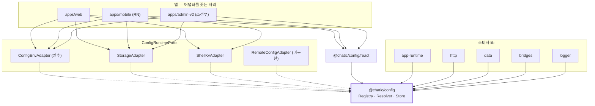
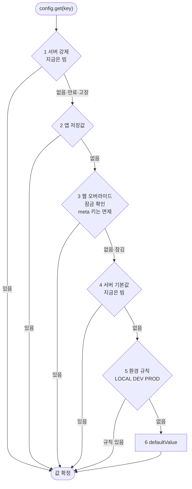
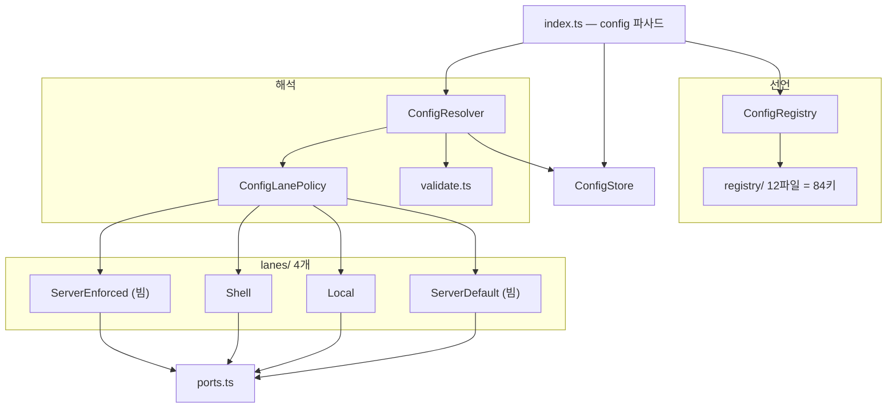

# `@chatic/config`

> 상태: **Approved** · 최종 갱신: 2026-09-09
> 관련 ADR: [ADR-0079](../../../docs/adr/0079-config-registry-and-lane-resolver.md) ·
> [ADR-0080](../../../docs/adr/0080-debug-panel-shared-model-and-stage-visibility.md) ·
> 키 목록: [레지스트리 키 제안](../../../docs/spec/config-registry-keys.md)

## 목적

설정값 하나를 정하는 방법을 한곳으로 모은다.

지금은 네 군데에 흩어져 있다.

| 어디                                | 얼마나                |
| ----------------------------------- | --------------------- |
| `import.meta.env` 직독              | 31파일                |
| 앱이 넣어주는 `window.CHATIC_APP_*` | 20종 · 22파일         |
| local/sessionStorage 플래그         | 로그 3키 + 딥링크 2키 |
| `PREFERENCES` + 스토어              | 12키 + 448줄          |

웹과 모바일이 같은 개념을 따로 만들어 서로 모른다. 킬 스위치는 없다. 내구성 있는 토글 하나를 추가하려면
세 파일을 고치고 앱 심사를 기다려야 하는데, **웹은 앱보다 먼저 배포된다.**

## 설계 원칙

한 번의 결정이 아니라 **이 영역을 앞으로 만질 때마다 지키는 기준**이다.

1. **config는 아무것도 임포트하지 않는다.** `@chatic` 의존 0 · `import.meta` 0 · React 0 · 네트워크 0.
   바깥은 앱이 꽂는 어댑터로만 닿는다. 이 원칙이 깨지면 모바일이 같은 코드를 못 쓰고, 소비자 lib에서
   순환이 생긴다.
2. **값만 런타임 가변이다.** 누가 쓸 수 있는지·어떤 형식인지·어디 저장하는지는 코드에 박는다. 어느
   레인도 못 바꾼다. 아니면 오버라이드가 자기에게 권한을 줄 수 있다.
3. **킬 스위치는 혼자 산다.** 1행은 다른 레인보다 먼저, 혼자서 본다. 킬은 다른 게 다 망가졌을 때 쓰는
   것이라 같은 길을 지나가면 그때 같이 죽는다.
4. **개발자 실수가 사용자를 죽이지 않는다.** 키의 80%가 개발자용이다. 그중 하나의 실수로 모든 사용자의
   앱이 안 켜지면 안 된다. 검사는 테스트가 하고, 실행 중에는 그 키만 버린다.
5. **이름은 실측된 관례에서만 가져온다.** 새 어휘를 발명하지 않는다. 접미사를 정할 때는 리포에서 실제로
   몇 개 쓰이는지 세어보고 고른다(ADR-0079 결정 12).
6. **새 키는 한 행이다.** 키를 늘리는 데 두 곳 이상을 만져야 하면 설계가 실패한 것이다.

## 범위

**포함**

- `libs/config` 신설 — 레지스트리 · 리졸버 · 스토어 · 포트 · React 어댑터
- 84키 전부 선언 (12도메인) + `title`/`description` 작성
- `libs/web-config` 삭제, 소비자 8파일 이관
- 모듈 로드 부수효과 4단계 해체
- 원격 레인 2행을 **빈 채로** 등재 + 가짜 어댑터 계약 테스트
- 노출면 셋(`dev` · `user` · `labs`)의 키 선언
- 기기 상태 로그 (부팅 1회 + 변경 시)
- `apps/desktop-web` 이관 — `import.meta.env` 7파일 · `CHATIC_APP_*` 2파일 ·
  `usePreferenceStore` 1파일 (2026-09-09 지시로 범위 편입)

**제외**

- 원격 어댑터 구현 · fetcher · 폴링 (ADR-0079 결정 10)
- 디버그 패널 이관 자체 (ADR-0080 — 다음 라운드, `apps/web/docs/architecture/`에 별도 문서)
- A/B 배정 · 점진 배포 · 타겟팅 (자리도 만들지 않는다)
- 제품 한도 · 기기 식별자 · 시각 토큰 통일

## 시나리오

각 사례 끝의 숫자는 **어느 행이 이겼는지**다. 전체 8건은
[레지스트리 키 제안 §시나리오](../../../docs/spec/config-registry-keys.md)가 소유한다.

### 부팅

1. 앱 엔트리가 `config.init(ports)`로 어댑터를 꽂는다. `env`는 필수, 나머지는 없으면 그 레인이 빈다.
2. 레지스트리 12파일을 병합한다. 키 이름이 겹치면 먼저 선언된 것을 남기고 로그를 남긴다. **앱은 켜진다.**
3. 셸이 있으면 주입 봉투를 읽어 셸 레인을 채운다. 없으면 그 레인은 비어 있다.
4. 저장소에서 로컬 오버라이드를 읽는다.
5. 기본값과 다른 키를 한 줄로 로그에 남긴다. 대부분 기기에서 이 줄은 비어 있다.

### 값 읽기

`config.get('cache.ttl.metaMs')` → 1행(서버 강제, 지금은 빔) → 2행(앱) → 3행(웹, 잠금 확인) →
4행(서버 기본값, 지금은 빔) → 5행(환경 규칙) → 6행(기본값). **→ 5 또는 6.**

### 값 쓰기

디버그 화면이 `config.set('log.upload.hold', true, { lane: 'local' })`를 부른다. 리졸버가 정책을
확인한다 — 이 키에 `local`이 있는지, 잠금이 풀렸는지, 형식이 맞는지. 통과하면 스토어에 넣고 **resolve
결과가 바뀐 키만** 옵저버에 알린다. 거부되면 이유를 돌려준다(던지지 않는다). **→ 3.**

`persist: 'shell'`인 키는 앱에도 보낸다. **답을 받고, 실패하면 한 번 다시 보내고, 그래도 안 되면 화면에
"저장 못 함"을 알린다**(ADR-0080 결정 10).

### QA가 딥링크로 백엔드를 바꾼다

`?_backend=...`가 로컬 레인 쓰기로 일반화된다. PROD에서는 `system.overridesUnlocked`가 `false`라
**거부된다.** 10탭 + 입장 코드로 풀면 통과한다. **→ 3 (잠기면 5·6).**

### 원격 어댑터가 나중에 온다

`config.init`에 `remote`를 넘기고 `system.remote.enabled`를 켠다. **리졸버·정책·레지스트리는 손대지
않는다.** 1·4행이 이미 배열에 있고 비어 있었을 뿐이다.

## 다이어그램

### 의존 방향



### 값을 정하는 순서



### 모듈



## 상세 구현

### 새로 만드는 파일

| 파일                              | 역할                                                                           |
| --------------------------------- | ------------------------------------------------------------------------------ |
| `src/index.ts`                    | `config` 파사드 인스턴스 하나만 내보낸다. 내부 클래스는 노출하지 않는다        |
| `src/ports.ts`                    | `ConfigRuntimePorts` + `I*Adapter`. 없는 멤버 = 배선 안 됨                     |
| `src/types.ts`                    | `ConfigEntry` · `ConfigSnapshot` · `Lane` · `Stage` · `Platform` · `SetResult` |
| `src/registry/index.ts`           | 도메인 병합. 중복은 먼저 것을 남기고 `logger.error`                            |
| `src/registry/<도메인>.ts` ×12    | `system env net ui log debug feature limit bridge auth sync cache`             |
| `src/resolve/ConfigLanePolicy.ts` | 레인 순서 배열 + 자격 판정 + `meta` 면제                                       |
| `src/resolve/ConfigResolver.ts`   | 레인 fold + 스냅샷 조립                                                        |
| `src/resolve/validate.ts`         | `type`/`values` 검증. 순수 함수                                                |
| `src/store/ConfigStore.ts`        | 레인별 값 보관 + 옵저버. resolve 결과가 바뀐 키만 통지                         |
| `src/lanes/RemoteCache.ts`        | 원격 페이로드 보관 + 1·4행 읽기. TTL 만료 시 킬만 버린다                       |
| `src/utils/serialize.ts`          | 저장 경계의 JSON 인·디코드. 못 읽는 값은 없는 것으로 본다                      |
| `src/testing/fixtures.ts`         | 테스트용 엔트리·어댑터·메모리 저장소                                           |
| `src/utils/*`                     | 순수 헬퍼만 (키 파싱 · 봉투 직렬화)                                            |
| `src/react/index.ts`              | `useConfigValue` — `useSyncExternalStore`                                      |

> **스펙과 달라진 점 (2026-09-09, 1단계).** 초안은 레인 클래스 4개(`ServerEnforcedLane`·`ShellLane`·
> `LocalLane`·`ServerDefaultLane`)를 두기로 했다. 실제로는 각각이 맵 읽기 한 줄을 감싸는 껍데기가 되어
> `ConfigResolver.readLane`의 `switch` 4갈래와 `RemoteCache` 하나로 합쳤다. **불변조건은 그대로다** —
> 순서는 여전히 `ConfigLanePolicy.order` 한 곳에만 있고, 레인을 늘리는 비용도 두 곳
> (`order` 배열 한 행 + `switch` 한 case)으로 같다. 클래스 4개를 만들면 같은 비용에 파일만 늘었다.

골격 파일은 [`libs/logger`](../../logger) 형태를 그대로 따른다 — `package.json`(`@chatic/config`,
private) · `project.json` · `tsconfig.json` · `tsconfig.lib.json` · `tsconfig.spec.json` ·
`jest.config.js`.

### 앱 어댑터 (앱 쪽에 만든다)

| 앱                 | 파일                         | 읽는 것                                   |
| ------------------ | ---------------------------- | ----------------------------------------- |
| `apps/web`         | `src/app/config/adapters.ts` | `import.meta.env` + `window.CHATIC_APP_*` |
| `apps/mobile`      | `src/app/config/adapters.ts` | `react-native-config` + MMKV              |
| `apps/desktop-web` | `src/app/config/adapters.ts` | `import.meta.env` + Electron preload 주입 |
| `apps/admin-v2`    | (조건부 — 미결)              | `import.meta.env`만                       |

`storage` 포트는 새 타입을 만들지 않고 [`StorageAdapter`](../../shared/src/utils/storage.ts)의
모양(`getItem`/`setItem`/`removeItem`)을 구조적 타입으로 받는다. `@chatic/shared`를 임포트하지 않으므로
원칙 1이 유지된다.

### 지우는 것

`libs/web-config` 전체. 실제 임포트는 **8파일이고 전부 `libs/app-runtime` 안**이다 —
`boot.ts` · `http/HttpManager.ts` · `http/transport.ts` · `report/reportIssue.ts` ·
`session/auth/relaySession.ts` · `session/hooks/auth/useInviteInfo.ts` · `session/store/configure.ts`.
`apps/desktop-web/src/main.tsx` · `libs/shared/.../useVersionCheck.ts` · `libs/http/.../lemonTransport.ts`의
언급은 **주석뿐이므로 코드 변경이 없다.**

`declare global`의 window 전역 9개(`ENV` · `PROJECT` · `REGION` · `HOST` · `DOU_ENDPOINT` 등)는
**쓰는 곳이 0이므로 되살리지 않고 지운다.**

### 부수효과 4단계 해체

| 현행 (`web-config/src/env.ts`, 임포트만으로 실행) | 이관 후                                         |
| ------------------------------------------------- | ----------------------------------------------- |
| `initEnvFromQueryParams()`                        | 딥링크 → 로컬 레인 쓰기. 정책을 통과해야 한다   |
| `setStorageAdapter(localStorage)`                 | 앱이 `config.init({ storage })`로 주입          |
| `clearTokensOnLogout()`                           | **config 밖으로** — 세션 위생이지 설정이 아니다 |
| `WEB_*` 상수                                      | 레지스트리 키 + `config.get()`                  |

`?_backend`의 초대링크 예외(현행 `isInviteLink` 분기)는 의미를 유지한다 — 초대링크의 `_backend`는 릴레이
주소가 아니라 클라우드 주소이므로 로컬 레인에 쓰지 않는다.

### 스테이지 정규화

`Stage = 'LOCAL' | 'DEV' | 'PROD'`. `STAGING`은 이 리포에 없다.

어휘가 두 벌이라 어댑터가 정규화한다 — `VITE_ENV`(대문자 3값)는 그대로, `CHATIC_APP_STAGE`
(`'local'|'stage'|'prod'`)는 셸 어댑터가 매핑한다(`'stage'` → `'DEV'`).
[`Env`](../../app-messages/src/types/model/device.ts) 타입은 브릿지 계약이라 건드리지 않는다.

`env.stage`(주입 우선)와 `env.buildStage`(`import.meta.env.VITE_ENV`만)를 나눈다. 보안 성질을 갖는
`byStage`는 `buildStage`로 판정한다.

## 검증 방법

### 유닛 테스트 (`libs/config`)

```bash
npx nx test config                                    # 66개 통과
npx tsc -b libs/config/tsconfig.lib.json              # 진짜 타입체크
npx eslint libs/config --ext .ts
```

| 테스트 파일                        | 무엇을 고정하나                                                                                                                                                   |
| ---------------------------------- | ----------------------------------------------------------------------------------------------------------------------------------------------------------------- |
| `resolve/ConfigLanePolicy.spec.ts` | 레인 순서 · `meta` 키의 잠금 면제 · 잠기면 웹만 막힘 · `canWrite`가 배선과 잠금을 반영                                                                            |
| `resolve/ConfigResolver.spec.ts`   | 형식 틀리면 다음 행으로 · `defaultValue`가 언제나 답 · 보안 키는 빌드 환경으로 판정 · 잠금을 정할 때 무한 반복 없음                                               |
| `resolve/killLane.spec.ts`         | **가짜 어댑터** — 킬이 웹을 이김 · 서버 기본값은 웹에 짐 · TTL 만료 시 킬만 버림 · 모르는 스키마는 통째 무시 · 서버가 못 쓰는 키는 무시 · 1행 고장 시 다음 행으로 |
| `registry/merge.spec.ts`           | 중복 키는 먼저 것이 남고 **던지지 않는다** · 조합 검증 5종                                                                                                        |
| `store/ConfigStore.spec.ts`        | 물어본 키만 듣는다 · 구독 해제 · 레인 통째 갈아치우기                                                                                                             |
| `index.spec.ts`                    | 거부 이유 6종 · resolve 결과가 안 바뀌면 통지 안 함 · 저장·복원·막힌 저장소 · **앱 쓰기 확인 응답 + 1회 재시도 + 실패 알림** · 스냅샷 재료                        |

`killLane.spec.ts`가 이번 라운드의 핵심이다. **원격 어댑터가 없어도 그 경로가 살아 있다는 유일한 증거다.**

`naming.spec.ts`(config의 `Platform` = `app-messages`의 것)와 `drift.spec.ts`(선언만 된 키 · 선언 안 된
키)는 양쪽을 임포트해도 되는 **앱 쪽**에 둔다. config 자신은 계속 아무것도 임포트하지 않는다.

### 수동 확인

1. 웹을 게스트로 부팅해 Self Chat까지 들어간다 — 부팅 순서가 안 깨졌는지.
2. 디버그 화면에서 `log.upload.hold`를 켠다 → 큐가 쌓이고 안 나가는지.
3. `?_backend=...`를 PROD 빌드로 연다 → **무시되는지.**
4. 10탭 + 코드로 풀고 다시 → **적용되는지.**
5. 부팅 로그에 기본값과 다른 키 줄이 있는지 (없으면 비어 있어야 정상).

### 타입체크

`libs/*`에서 `tsc --noEmit`은 0건 검사 후 성공한다. **진짜는 `tsc -b tsconfig.lib.json`**이다 — 앱은
`dist/*.d.ts`를 본다. lib을 옮긴 뒤 다운스트림이 옛 심볼로 유령 에러를 내면 `dist`/`out-tsc`를 강제
삭제해 진단한다.

---

## 구현 체크리스트

각 단계가 끝나면 그 자리에서 검증 가능해야 한다.

### 1. 골격과 코어 (앱은 아직 안 만진다) — **완료 2026-09-09**

- [x] `libs/config` 골격 — `logger` 형태 그대로. `tsconfig.base.json`에 `@chatic/config`와
      `@chatic/config/*` 경로 추가
- [x] `jest.config.js` — `moduleNameMapper`의 `^@chatic/(.*)$`는 `$1`을 `config/react`로 잡아
      `libs/config/react/src/index.ts`(없는 경로)로 보낸다. **서브패스 규칙을 앞에 먼저 둔다**
- [x] `types.ts` · `ports.ts` — `ConfigEntry`(title·description·defaultValue·byStage·byPlatform·
      surface·writableBy·persist·appliesAt·meta) · `ConfigSnapshot` · `Stage`/`Platform` 자체 선언
- [x] `ConfigRegistry` — 병합 + 중복 시 먼저 것 유지 + 로그
- [x] `ConfigLanePolicy` · `ConfigResolver` · `validate.ts`
- [x] `ConfigStore` — 옵저버는 resolve 결과 변화만
- [x] 원격 2행은 `RemoteCache` 하나로(§스펙과 달라진 점). 어댑터 없으면 항상 빈 값
- [x] `index.ts` 파사드 · `react/index.ts`
- [x] 테스트 6파일 66개. **`killLane.spec.ts` 포함**

**검증 결과**: `nx test config` 66개 통과 · `tsc -b` 통과 · `eslint` 0건. `tsconfig.spec.json`의 TS5095는
`libs/logger`도 같으므로 선재 패턴이고 ts-jest가 덮는다.

### 2. 키 선언 84개 — **완료 2026-09-09**

- [x] `registry/` 12파일 작성. `title`/`description`을 **전부** 채운다
- [x] `appliesAt`을 **소비 형태를 확인하고** 적는다 — 호출마다 읽으면 `live`, 생성자 캡처면 `restart`,
      연결 시 전달이면 `reconnect`. **확인 전 기본값은 `restart`**
- [x] `registry/allModules.spec.ts`로 조합 검증 · 노출면 분포 검증

**검증 결과**: 84키 선언 · 빈 `title`/`description` 0건 · 조합 검증(policy) 0건 · 노출면 분포
`user 4 · labs 0 · dev 67 · internal 13`가 [ADR-0079 §노출면 분포](../../../docs/adr/0079-config-registry-and-lane-resolver.md)와
정확히 일치. `nx test config` 71개 통과 · `tsc -b` 통과 · `eslint` 0건.

> **스펙에 없던 결정 — `writableBy` 판단 기준.** 튜너블 표(`docs/spec/config-registry-keys.md`)는 22개
> 키에 `writableBy` 열을 명시하지 않았다(1차 스윕은 명시, 2차 스윕/튜너블은 산문으로만 일부 언급). 규칙을
> 세워 적용했다: **명시적으로 `server` 제외를 말한 것만 제외**(`auth.sdk.*` 3개 — 갱신 폭주 위험),
> 나머지는 `['local', 'server']`. `'shell'`은 새 튜너블에 넣지 않았다 — ADR-0080 결정 11·12 이후
> 앱에는 자체 디버그 UI가 없으므로 앱이 값을 "쓸" 경로가 없고, 셸이 하는 일은 부팅 주입뿐이다.
> `persist`는 튜너블 전부 `'session'`(QA 오버라이드는 탭이 닫히면 사라진다)로 통일했다. 이 판단은
> 검증 가능한 형태(드리프트 게이트 · 리뷰)로 재확인이 필요하다.

### 3. env 레인 이관 + `web-config` 삭제

- [ ] `apps/web`·`apps/mobile` 어댑터 작성
- [ ] `main.tsx`에 `config.init()` — **로그 배선 뒤, 런타임 부팅 앞**. 부수효과 4단계를 명시 호출로
- [ ] `clearTokensOnLogout`을 앱 부트로 이동
- [ ] `app-runtime` 8파일 이관
- [ ] `libs/web-config` 삭제 + `tsconfig.base.json`에서 경로 제거 + 소비자 테스트의 모듈 목 제거
- [ ] 죽은 window 전역 9개 · 죽은 env 10종 제거 (`.github` 주입 여부 먼저 확인)

**검증**: `import.meta.env` 직독이 앱 어댑터로만 남는지 · web 테스트 통과 · 게스트 부팅 수동 확인

### 4. 셸 레인 + 범용 KV 브릿지

- [ ] `libs/app-messages`에 `FetchConfigBag`/`SaveConfigValue`/`ClearConfigValue`
- [ ] 구 셸 폴백 — `NOT_FOUND` 학습 후 기존 `SavePreference` 5키 경로로 강등
- [ ] **쓰기는 확인 응답 + 1회 재시도 + 실패 표시.** 보내고 끝내지 않는다
- [ ] 모바일에 범용 KV 저장 + 부팅 주입 봉투
- [ ] 주입 전역 20종 중 6종을 키로, 14종은 `deviceInfoStore`에 그대로

**검증**: mobile 테스트 통과 · 구 셸에서 폴백 동작 · 확인 응답 실패 시 화면 표시

### 5. 옵션 흡수

- [ ] `PREFERENCES` 12키 + `logUploadSwitch` 3키 이관
- [ ] **레거시 저장값 승계** — `vite-ui-theme` · `chatic-onboarding-completed` ·
      `dou.relayInvite.locallyCanceled.v1` 등. 일회성, 부팅 1회
- [ ] `usePreferenceStore` 해체 → 셀렉터 훅. 소비 20파일 전부 (desktop-web 1파일 포함)
- [ ] 모바일 `debugSettingsStore` 통합

**검증**: 기존 사용자의 테마·온보딩 상태가 유지되는지 (가짜 스토리지로 재현) · web 2600여 테스트 통과

### 6. desktop-web 이관

**마지막에 붙인다.** 되돌릴 수단이 없기 때문이다 — push로만 배포되고 수동 배포·원복 경로가 없으며,
리포 CI에 테스트 워크플로 자체가 없다(빌드 워크플로만 둘).

- [ ] `apps/desktop-web/src/app/config/adapters.ts` — `import.meta.env` + Electron preload 주입
- [ ] `import.meta.env` 직독 7파일 이관 (`VITE_ENV` · `VITE_DESKTOP_PROTOCOL`)
- [ ] `CHATIC_APP_*` 직독 2파일 이관
- [ ] `usePreferenceStore` 1파일 이관 (`features/settings/hooks/useDevicePushMute.ts`)
- [ ] `main.tsx`의 web-config 주석 정정 (코드 변경 없음)

**검증**: `tsc -b`로 desktop-web 타입체크 — **선재 부채 19건이 있으므로 기준선을 먼저 기록하고 늘지
않았는지만 본다.** 자동 테스트가 없으므로 수동 확인이 유일한 방어선이다: 부팅 · 로그인 · 채널 진입 ·
설정 화면의 푸시 음소거 토글 · 딥링크 한 번.

### 7. 기기 상태 로그

- [ ] 부팅 직후 기본값과 다른 키를 한 줄로
- [ ] `config.subscribe`로 변경 시 그 키만
- [ ] `debug.entryCode` 제외

**검증**: 오버라이드 없는 기기에서 부팅 줄이 비는지 · 값 하나 바꾸면 한 줄 나오는지

## 리스크와 미지수

| 리스크                                            | 크기 | 대응                                                              |
| ------------------------------------------------- | ---- | ----------------------------------------------------------------- |
| **레거시 저장값 승계 실패**                       | 최대 | 5단계를 마지막에. 가짜 스토리지로 기존 사용자 재현 테스트         |
| `appliesAt` 84개가 실제 소비와 어긋남             | 큼   | 기본값 `restart`. `live`는 구독 소비자를 지목해 증명              |
| 부팅 순서 깨짐 (`main.tsx` 계약)                  | 큼   | 3단계에서 순서를 명시 호출로 만들고 게스트 부팅 수동 확인         |
| 구 셸 폴백이 5키뿐이라 내구성 키가 조용히 안 남음 | 중   | `persist: 'shell'`인데 폴백 화이트리스트에 없는 키를 목록화       |
| `tsc -b` / `dist` 유령 에러                       | 중   | lib 이동 후 `dist`·`out-tsc` 강제 삭제로 진단                     |
| 워크트리 `node_modules` 부재·심링크 함정          | 중   | `rm node_modules/node_modules` 먼저, 그다음 `rm -rf node_modules` |
| `admin-v2` 편입 여부 미정                         | 작음 | 1~3단계는 무관. 4단계 전에 결정                                   |

**미지수**

- 실험실에 넣을 키가 아직 0개다. 화면과 규칙만 나간다.
- `lifetime`/`expiresOn`(수명·만료) 두 칸을 넣을지 미정 — 넣으면 출시 토글이 안 지워지는 문제를 막는다.
- 커스텀 zip(`customZipLocalRoot`·`customZipServerUrl`)의 처분 — 주소 바꾸기를 없앴으므로 성격이 같다.
- `.github` 워크플로가 죽은 env 10종을 주입하는지 확인 전이다.
