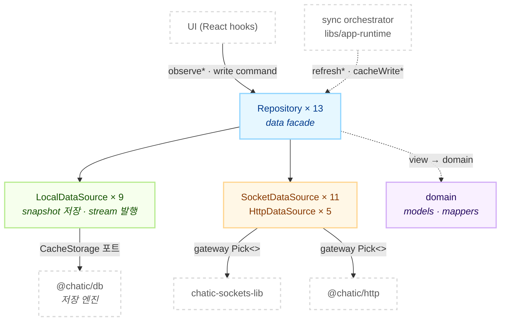
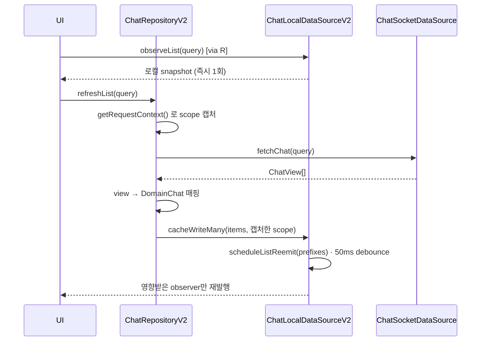

# @chatic/data

**headless data layer.** 앱이 쓸 데이터 표면 전부를 조립해 하나의 배럴로 내보낸다 — 도메인 모델과
매퍼, 로컬 캐시의 저장·stream 발행, 서버로 나가는 outbound 호출, 그리고 이 셋을 묶는 repository
facade.

이 문서는 **개요와 구조**만 다룬다. 레이어별 상세는 [`docs/`](#문서) 아래 폴더가 정본이다.

## 목적

앱은 `@chatic/data` 배럴만 본다. 소비 파일 211개 중 내부 경로를 직접 import하는 것은 하나도 없다.

이 lib은 **소켓 연결의 생애주기를 소유하지 않는다.** 연결·재인증·sync 타이밍은 `libs/app-runtime`의
sync orchestrator 소관이다. orchestrator가 repository의 `refresh*` / `cacheWrite*`를 부르면
repository가 그 결과를 로컬에 반영하고 stream으로 재방출한다. repository 입장에서 그 호출이 UI에서
왔는지 orchestrator에서 왔는지는 구분하지 않는다.

## 설계 원칙

1. **읽기는 항상 local stream.** UI는 `observe*`만 구독한다. remote 응답을 직접 렌더하는 경로는 계약 위반이다.
2. **remote는 side-effect command.** write와 refresh는 명시적 메서드 호출이다. 자동 dispatcher나 event bus는 없다.
3. **UI는 네트워크를 직접 호출하지 않는다.** 모든 데이터 콜은 repository를 지난다 (ADR-0036).
4. **remote는 축이고, 그 아래는 전송 수단이다.** `remote/`가 local의 반대편이고 그 안에서 `socket-`과 `http-`로 갈린다.
5. **요청 시점 문맥을 캡처한다.** 늦게 도착한 응답이 전환된 스코프를 오염시키면 안 된다. scope 캡처는 repository의 책임이고, local은 `contextOverride`로 그것을 받는다.
6. **서버 payload · 서버 view · 로컬 domain model은 같은 형태라고 가정하지 않는다.** 책임 경계가 다르면 별도 타입으로 둔다.
7. **캐시 어댑터를 고르지 않는다.** 어느 도메인이 IndexedDB를 쓰고 어느 것이 네이티브 SQLite를 쓰는지는 `libs/app-runtime`의 `resolveCacheBackend`가 판정한다.

## 범위

**포함** — 도메인 모델·매퍼, 로컬 data source와 stream 엔진, `CacheStorage` 포트, 소켓·HTTP
gateway 타입(`Pick<>`)과 data source, repository facade 13종, `DataContext` 계약.

**제외** — 소켓 전송 런타임(`@lemoncloud/chatic-sockets-lib`), 저장 엔진 구현(`@chatic/db`의
`IndexedDBAdapter`·`NativeDBAdapter`·`ChatQueryExecutor`), HTTP 클라이언트(`@chatic/http`),
sync 타이밍·연결 생애주기·캐시 라우팅(`libs/app-runtime`), 서버 소켓 spec.

## 구조



`local`은 `remote`를 부르지 않는다. 둘을 잇는 것은 repository 하나다.

### 읽기와 쓰기



### 디렉토리

```text
libs/data/src/
├── index.ts          공개 배럴 (export * 8줄)
├── domain/           도메인 모델 + 매퍼
├── local/
│   ├── data-sources-v2/ 도메인별 LocalDataSource 9종 + stream 엔진 BaseLocalDataSourceV2
│   ├── ports/        CacheStorage · indexeddb · metrics · policy · search 포트
│   └── stableHash.ts scope key 해시
├── remote/
│   ├── gateways/     socket.ts · http.ts — 도메인이 쓸 capability만 Pick<>
│   ├── socket-data-sources/  11종 + 팩토리
│   └── http-data-sources/    5종 + 팩토리
└── repositories-v2/     facade 13종 + BaseRepositoryV2 + DataContext + scopeGuards
```

## 시나리오

### 1. 방을 열어 메시지를 읽는다

`useChats`가 `chat.observeList({ channelId, limit })`를 구독한다. 구독 즉시 로컬 snapshot이 1회
발행된다 — 네트워크를 기다리지 않는다. 같은 훅이 `chat.refreshList`를 불러 `chat.feed`를 요청하고,
응답은 로컬에 **merge**된다(overwrite가 아니다). merge가 끝나면 **그 채널의** list observer가
재발행된다 — 재발행 프리픽스는 채널 단위라 같은 채널의 cursor·limit·sort·keyword 변형이 함께
깨어나고, 홈 프리뷰가 쓰는 `chats-last` catch-all도 함께 깨어난다. 반환된 cursor 메타는 다음 페이지 요청의 입력으로만 쓰고 렌더 source로 쓰지 않는다.

### 2. 메시지를 보낸다

`chat.sendChat`이 낙관적 pending 행을 로컬에 먼저 쓴다. 그 행은 서버 번호를 받기 전이라 `chatNo: 0`
이다. remote 호출이 실패하면 `isFailed`로 마킹하고, 성공하면 서버 스냅샷으로 대체한다.

### 3. orchestrator가 채널 변경분을 밀어넣는다

`syncChannels(since)`가 `channel.sync({ since })`를 부른다. `since: 0`은 full sync, `since > 0`은
delta다. 응답의 `list`는 변경된 채널이고 `ids`는 지금 내가 속한 전체 채널 id다. repository는 `list`를
쓰고 `ids`에 없는 채널을 stale remove한다. 다음 `since`는 `syncMeta`가 보관한다.

채널 sync는 채널 **목록**만 갱신한다. 메시지는 가져오지 않는다. 서버가 채널마다 `lastChat$`를 실어
보내지만 매퍼는 그것을 **의도적으로 읽지 않는다** — 마지막 메시지와 그 시각은 chat 캐시 소관이다
(ADR-0057, `domain/mappers.ts`).

### 4. 클라우드를 전환한다

`DataContextHolder`가 새 `cid`를 받는다. repository는 문맥을 보관하지 않고 매 호출마다
`DataContextProvider`로 최신 값을 읽으므로 재생성이 필요 없다. observer는 `cid`/`sid`/`uid` 튜플의
`stableHash`로 격리되어 있어서, scope가 바뀌면 다른 observer 집합이 활성화된다.

### 5. 방을 나갔다 다시 들어온다

퇴장해도 그 방의 메시지 행은 캐시에 남는다 — chat sync plan에 `onRemove`가 없고, 이력은
lazy-load와 오프라인을 위해 유지된다. 그런데 화면은 서버 응답이 아니라 캐시를 렌더한다. 그래서 두
장치가 함께 걸린다 (ADR-0067).

- **표시 게이트** `isInJoinWindow(chat, joinedNo)` — 서버와 같은 규칙(`chatNo > joinedNo`)을 캐시를 읽는 자리에 건다. `joinedNo`가 없으면 아무것도 숨기지 않고, `chatNo`가 falsy면 통과시킨다(낙관적 전송 행이 사라지지 않게).
- **purge** — 본인 나가기 성공과 내 join 행 제거, 두 명시 신호에만 건다. 추론 기반 정리에는 붙이지 않는다. chat 삭제는 되돌릴 수 없다.

### 6. HTTP 전용 도메인을 읽는다

구독 가능한 로컬 캐시가 없는 도메인이 셋 있다 — `report`, `subscription`, 그리고 `cloud`의 카탈로그
조회. 이들은 로컬에 쓰지 않는다. 캐시 의미는 소비자 쪽 react-query 어댑터가 소유한다.

## 문서

| 폴더 | 다루는 것 |
| ---- | --------- |
| [docs/local/](./docs/local/README.md) | 저장·조회·stream 발행. stream 모델, 스코프와 캐시 슬롯, chat cursor, cache clear |
| [docs/remote/](./docs/remote/README.md) | outbound 서버 호출. gateway 매핑, SocketDataSource별 호출, HTTP 축, **이름 규약** |
| [docs/repositories/](./docs/repositories/README.md) | data facade. 3가지 계약, context와 scope, 배선, cache clear 원칙, 퇴장과 재입장 |
| [docs/repositories/domains.md](./docs/repositories/domains.md) | 도메인 13종 메서드 카탈로그 (찾는 문서) |

## 검증 방법

```bash
npx tsc -b libs/data/tsconfig.lib.json
npx jest --config libs/data/jest.config.js
```

- 타입체크는 `tsc -b tsconfig.lib.json`이어야 한다. `libs/data`에서 `tsc --noEmit`은 0건을 검사하고 성공한다.
- data source 25종은 전부 대응 테스트가 있고, repository는 13종 중 12종이다 — `SyncMetaRepositoryV2`만 없다. 수치는 위 명령이 답한다.
- 다운스트림 확인: `apps/web`·`apps/desktop-web`·`libs/app-runtime`의 타입체크. 배럴 식별자가 바뀌면 여기서 잡힌다.
- 낡은 `dist`/`out-tsc`가 유령 에러를 만든다. 디렉토리를 물리 이동한 뒤에는 `rm -rf libs/data/dist libs/data/out-tsc`로 강제 삭제하고 다시 본다.
