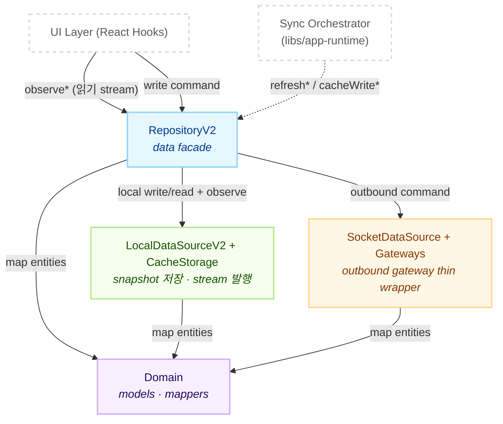
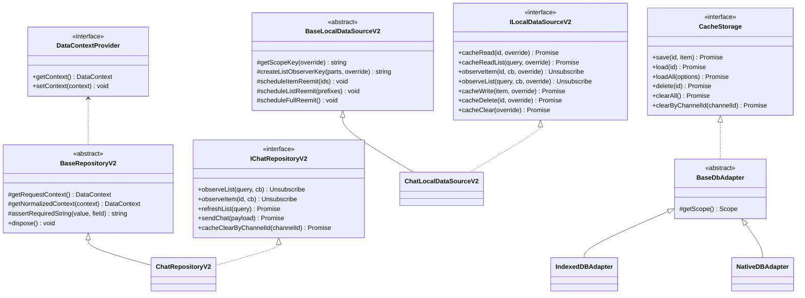
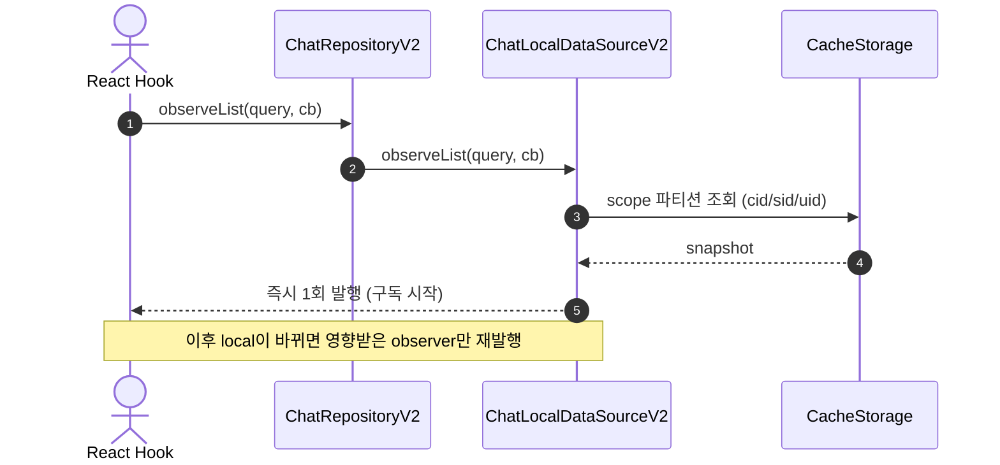
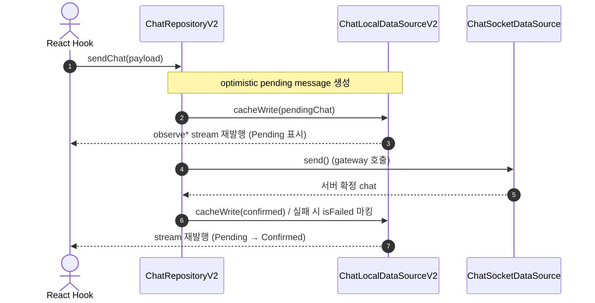
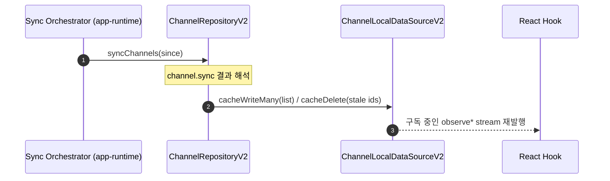

# @chatic/data

`@chatic/data`는 remote data source · local data source · repository를 조립해 앱이 사용할 **headless data layer**를 제공한다.

핵심 원칙은 하나다.

- **읽기는 항상 local stream** — UI는 `observe*` 만 구독한다.
- **remote는 side-effect command** — write/refresh는 명시적 메서드 호출이다.
- **UI는 네트워크를 직접 호출하지 않는다.**

socket 연결의 생애주기(연결/재인증/sync 타이밍)는 이 라이브러리가 소유하지 않는다. 외부 sync orchestrator(`libs/app-runtime`)가 repository의 `refresh*` / `cacheWrite*`를 호출하면, repository가 그 결과를 local cache에 반영하고 stream으로 재방출한다.

> 상세 문서는 [`docs/`](./docs/README.md) 트리를 참조한다. 이 README는 전체 그림과 진입점만 다룬다.

---

## 1. 디렉토리 구조

핵심 로직은 `libs/data/src/data` 아래 레이어별로 분리되어 있다.

```text
libs/data/src/
├── data/
│   ├── domain/            # 도메인 모델 + 매퍼 (서버 view → local read-model)
│   ├── local/             # 로컬 인프라 (storages 어댑터, databases, data-sources-v2)
│   ├── remote/            # 원격 통신 (gateways, data-sources, sockets 최소 계약)
│   ├── repositories-v2/   # data facade (현행 repository)
│   ├── repositories/      # 공유 계약만 보관 (DataContext / DataContextProvider)
│   └── events/            # 도메인 이벤트 타입 + EventBus (V2 미사용, 아래 주의 참조)
└── index.ts               # Public API 진입점
```

> **V1은 제거됐다.** 도메인 repository / local data source는 모두 `repositories-v2` · `local/data-sources-v2`에 있다. `repositories/`는 이제 `DataContext` 계약만 re-export하고, `events/`의 EventBus는 V2 경로에서 쓰지 않는다.

---

## 2. 레이어 의존성

repository가 local·remote 인프라를 지휘한다. V2 계약에서 repository는 socket event를 직접 구독하지 않는다 — 외부 sync orchestrator가 repository 메서드를 호출한다.



---

## 3. 핵심 클래스 / 인터페이스



---

## 4. 데이터 흐름

### 4.1 읽기 (local-first stream)



### 4.2 쓰기 (optimistic command)



### 4.3 서버 변경분 반영 (sync orchestrator)



> 서버→클라이언트 push 신호(`domain.sync` 등) 자체는 repository가 구독하지 않는다. orchestrator가 신호를 해석해 위 `refresh*` / `sync*` 경로로 변환한다.

---

## 5. 핵심 메커니즘

### 5.1 DataContext & dynamic scoping

repository 인스턴스는 한 번 생성되면 유지된다. cloud(`cid`)·계정(`uid`)·place(`sid`)가 바뀌어도 재생성하지 않는다.

- `DataContextProvider`(`DataContextHolder`)를 통해 repository는 매 호출마다 **최신 context**를 읽는다.
- repository는 remote 응답 적재 전 `getRequestContext()`로 요청 시점 scope를 **캡처**한다. cloud 전환 중 늦게 온 응답이 현재 scope를 오염시키지 않도록 격리한다.
- local 캐시 저장은 scope 파티션을 타며, observer는 `cid`/`sid`/`uid` 튜플 해시로 격리된다.

### 5.2 stream 재발행 (BaseLocalDataSourceV2)

UI는 항상 `observe*`만 본다. mutation 후 전체 재발행이 아니라 영향 범위만 다시 계산한다 — item id별(`scheduleItemReemit`), list prefix별(`scheduleListReemit`), 전체(`scheduleFullReemit`). 재발행은 50ms로 debounce된다.

### 5.3 events / EventBus (V2 미사용)

`events/`의 `DomainEventMap` · `EventBusEngine`은 제거된 V1 `BaseRepository`가 쓰던 경로다. **V2는 EventBus 기반 자동 반영을 쓰지 않는다.** V2의 local 반영은 repository의 명시적 메서드(`cacheWrite*` / `cacheDelete*`) 호출로만 이뤄진다.

---

## 6. Public API

진입점은 [`src/index.ts`](./src/index.ts)다. domain · local(data-sources-v2 / storages / databases) · remote(gateways / sockets / data-sources) · repositories(계약) · repositories-v2를 re-export한다.

---

## 7. 더 읽기

| 문서                                                | 내용                                                   |
| --------------------------------------------------- | ------------------------------------------------------ |
| [docs/README.md](./docs/README.md)                  | 전체 개요 · 데이터 흐름 · domain·events                |
| [docs/remote/](./docs/remote/README.md)             | gateway 매핑 · DataSource 호출 · 요청 제한             |
| [docs/repositories/](./docs/repositories/README.md) | V2 facade 계약 · 도메인별 메서드 · sync 해석           |
| [docs/local/](./docs/local/README.md)               | stream 모델 · scope · storages/databases · chat cursor |
