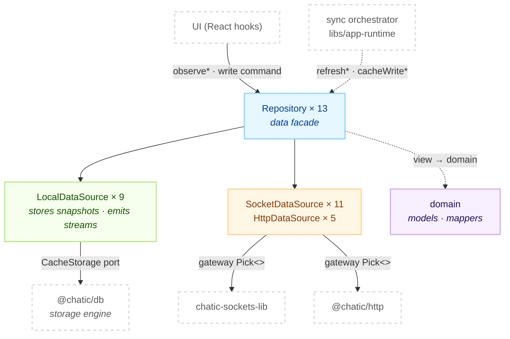
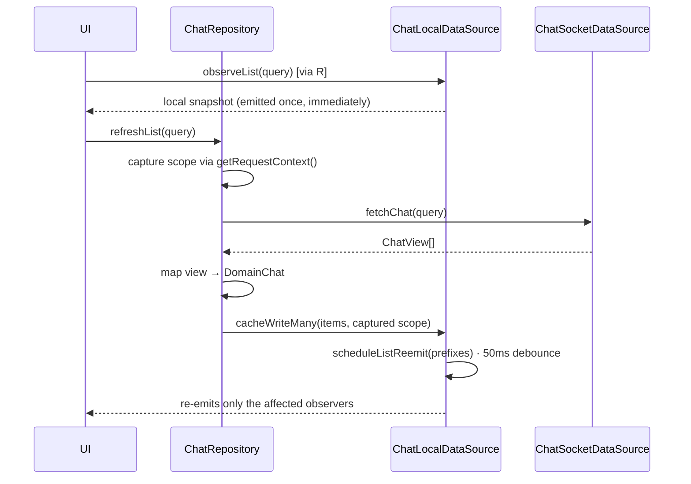

# @chatic/data

**Headless data layer.** It assembles every data surface an app needs and exports it through a single
barrel — domain models and mappers, local cache storage and stream emission, outbound calls to the
server, and the repository facade that ties the three together.

This document covers the **overview and structure** only. The per-layer detail is canonical under
[`docs/`](#documents).

## Purpose

Apps see the `@chatic/data` barrel and nothing else. Imports that reach past it into internal paths
number **zero**, which is why this lib can be rearranged with no blast radius outside it. The consumer
count keeps moving, so it is not written down here — only the invariant is checked.

```bash
grep -rn "@chatic/data/" --include='*.ts' --include='*.tsx' apps libs | grep -v node_modules
```

This lib **does not own the socket connection's lifecycle.** Connecting, re-authenticating and sync
timing belong to the sync orchestrator in `libs/app-runtime`. When the orchestrator calls a
repository's `refresh*` / `cacheWrite*`, the repository writes the result to local and re-emits it on
the stream. From the repository's side, whether that call came from the UI or from the orchestrator
makes no difference.

## Design principles

1. **Reads always come from a local stream.** The UI subscribes to `observe*` only. Rendering a remote response directly is a contract violation.
2. **Remote is a side-effect command.** Writes and refreshes are explicit method calls. There is no automatic dispatcher and no event bus.
3. **The UI never calls the network directly.** Every data call goes through a repository (ADR-0036).
4. **Remote is the axis; what sits under it is the transport.** `remote/` is the opposite side of local, and inside it the split is `socket-` and `http-`.
5. **Capture the context at request time.** A late response must not poison a scope that has since switched. Capturing the scope is the repository's job, and local receives it through `contextOverride`.
6. **Server payload, server view and local domain model are not assumed to share a shape.** Where the responsibility boundary differs, the type is separate.
7. **This lib does not choose a cache adapter.** Which domain uses IndexedDB and which uses native SQLite is decided by `resolveCacheBackend` in `libs/app-runtime`.

## Scope

**In** — domain models and mappers, local data sources and the stream engine, the `CacheStorage` port,
socket and HTTP gateway types (`Pick<>`) and their data sources, 13 repository facades, the
`DataContext` contract.

**Out** — the socket transport runtime (`@lemoncloud/chatic-sockets-lib`), storage engine
implementations (`@chatic/db`'s `IndexedDBAdapter`, `NativeDBAdapter`, `ChatQueryExecutor`), the HTTP
client (`@chatic/http`), sync timing, connection lifecycle and cache routing (`libs/app-runtime`), and
the server-side socket spec.

## Structure



`local` never calls `remote`. The one thing that joins them is a repository.

### Reads and writes



### Directories

```text
libs/data/src/
├── index.ts          public barrel (8 lines of export *)
├── domain/           domain models + mappers
├── local/
│   ├── data-sources/ 9 per-domain LocalDataSources + the BaseLocalDataSource stream engine
│   ├── ports/        CacheStorage · indexeddb · metrics · policy · search ports
│   └── stableHash.ts scope key hash
├── remote/
│   ├── gateways/     socket.ts · http.ts — Pick<> only the capabilities a domain uses
│   ├── socket-data-sources/  11 sources + factory
│   └── http-data-sources/    5 sources + factory
└── repositories/     13 facades + BaseRepository + DataContext + scopeGuards
```

Two file names hide what they hold: `BaseRepository` and `DataContext` live in
`repositories/types.ts`, and `BaseLocalDataSource` lives in `local/data-sources/types.ts`.
There is no `BaseRepository.ts` to open.

## Usage

There is **one entry point: a repository.** Neither data sources nor gateways are a surface the app
calls — every data call goes through a repository (ADR-0036).

```ts
// UI — obtained through a hook
const { place } = runtime.data.useRuntimeRepositories();

useEffect(() => {
    // Subscribing emits the local snapshot once, immediately. It does not wait for the network.
    return place.observeList(undefined, result => setPlaces(result?.list ?? []), { cid, uid });
}, [place, cid, uid]);

// Writes are explicit commands
await place.updatePlace(placeId, body);

// Outside React — the same repositories, fetched synchronously
await getRepositories().report.uploadLogBatch(body);
```

Three rules hold.

1. **The only things to import from `@chatic/data` are types** (`DomainChat`, `DataContext`, …). The runtime surface is the repository, and paths inside the barrel stay closed.
2. **Read through `observe*` and nothing else.** Rendering what `refresh*` returns breaks principle 1.
3. **`refresh*` and `cache*` belong to the sync orchestrator.** A UI calling them directly can collide with sync timing. Where it is necessary, call them only from a user-event path.

The third argument, `contextOverride`, is for a caller that wants to pin an observer's scope. It binds
the subscription to the target cloud regardless of the provider's commit lag right after a switch.

### Wiring

This lib assembles nothing. Gateway instances, storage engines and sync timing are all decided by
`DataManager` in `libs/app-runtime`.

```text
DataManager
  ├─ createSocketDataSources()   socketFactory      builds gateways
  ├─ createLocalDataSources()    localFactory       storage routing
  ├─ createHttpDataSources()     httpFactory        builds gateways
  └─ createRepositories()        repositoryFactory → createRepositories (this lib)
                                                     ↳ getRepositories() / useRuntimeRepositories()
```

The method catalogue for all 13 domains is in [domains.md](./docs/repositories/domains.md); the
procedure for adding a new server call is in
[docs/remote/](./docs/remote/README.md#adding-a-server-call).

## Scenarios

### 1. Opening a room and reading messages

`useChats` subscribes to `chat.observeList({ channelId, limit })`. Subscribing emits the local snapshot
once — it does not wait for the network. The same hook calls `chat.refreshList`, which requests
`chat.feed`, and the response is **merged** into local (not overwritten). Once the merge lands, the
list observers **for that channel** re-emit — the re-emit prefix is per channel, so cursor, limit, sort
and keyword variants of the same channel all wake together, as does the `chats-last` catch-all the home
preview uses. The cursor metadata that comes back is input for the next page request only, never a
render source.

### 2. Sending a message

`chat.sendChat` writes an optimistic pending row to local first. That row has not been given a server
number yet, so its `chatNo` is `0`. If the remote call fails it is marked `isFailed`; if it succeeds it
is replaced by the server snapshot.

### 3. The orchestrator pushes channel deltas

`syncChannels(since)` calls `channel.sync({ since })`. `since: 0` is a full sync, `since > 0` is a
delta. The response's `list` holds the channels that changed and `ids` holds every channel id I
currently belong to. The repository writes `list` and stale-removes any channel missing from `ids`. The
next `since` is kept by `syncMeta`.

Channel sync refreshes the channel **list** only. It does not fetch messages. The server ships a
`lastChat$` on each channel, but the mapper **deliberately does not read it** — the last message and its
timestamp belong to the chat cache (ADR-0057, `domain/mappers.ts`).

### 4. Switching clouds

`DataContextHolder` receives a new `cid`. Repositories do not hold the context; they read the current
value through `DataContextProvider` on every call, so nothing has to be rebuilt. Observers are isolated
by the `stableHash` of the `cid`/`uid` pair, so a changed scope activates a different set of
observers. A place switch does NOT change that scope — see
[docs/local/README.md](./docs/local/README.md#scope-and-cache-slots).

### 5. Leaving a room and coming back

Leaving does not remove that room's message rows from the cache — the chat sync plan has no `onRemove`,
and the history is kept for lazy-load and offline. But the screen renders the cache, not the server
response. So two mechanisms are needed together (ADR-0067).

- **Display gate** `isInJoinWindow(chat, joinedNo)` — applies the server's own rule (`chatNo > joinedNo`) at the place the cache is read. When `joinedNo` is absent it hides nothing, and when `chatNo` is falsy it lets the row through (so an optimistic send does not disappear).
- **Purge** — fires on two explicit signals only: a successful self-leave, and the removal of my own join row. It is never attached to inference-based cleanup. Deleting chat cannot be undone.

### 6. Reading an HTTP-only domain

Three domains have no subscribable local cache — `report`, `subscription`, and the catalogue read on
`cloud`. They do not write to local. The cache semantics belong to a react-query adapter on the
consumer side.

## Documents

| Folder                                                         | What it covers                                                                                                    |
| -------------------------------------------------------------- | ----------------------------------------------------------------------------------------------------------------- |
| [docs/local/](./docs/local/README.md)                          | Storing, reading and emitting streams. The stream model, scope and cache slots, chat cursors, cache clear         |
| [docs/remote/](./docs/remote/README.md)                        | The contract both outbound axes share. Axis symmetry, how to call and wire, how to add a call, **naming history** |
| [docs/remote/socket.md](./docs/remote/socket.md)               | The socket axis. 11 gateway mappings, where absence is the contract, routing, client-side request limits          |
| [docs/remote/http.md](./docs/remote/http.md)                   | The HTTP axis. 5 gateway Picks, why it holds no cache, the admin console surface, the report lane                 |
| [docs/repositories/](./docs/repositories/README.md)            | The data facade. Three contracts, context and scope, wiring, cache clear rules, leaving and rejoining             |
| [docs/repositories/domains.md](./docs/repositories/domains.md) | The 13-domain method catalogue (a document you look things up in)                                                 |

## How to verify

```bash
npx tsc -b libs/data/tsconfig.lib.json     # the lib
npx tsc -b libs/data/tsconfig.spec.json    # tests and __mocks__
npx jest --config libs/data/jest.config.js
```

- Type checking must be `tsc -b tsconfig.lib.json`. Inside `libs/data`, `tsc --noEmit` checks zero files and succeeds.
- **The two type checks are separate on purpose.** `tsconfig.lib.json` excludes `*.test.ts` and `__mocks__/**`, and jest does not type check at all — the base sets `isolatedModules`, so ts-jest transpiles. Without the second command a broken test fixture (a mock missing an action, say) surfaces only as `… is not a function` at runtime. `nx typecheck @chatic/data` runs both, but it also runs every dependency's own typecheck, which is not green today.
- All 25 data sources have a matching test, and 12 of the 13 repositories do — `SyncMetaRepository` is the one without. The commands above are what answer this, not this sentence.
- Downstream check: a changed barrel identifier reaches eight projects — `apps/web`, `apps/desktop-web`,
  `libs/app-runtime`, `apps/testbed`, `libs/db`, `libs/block-kit`, `apps/admin-v2` and `@chatic/mobile`.
  `.github/workflows/verify.yml` type checks every one of them except `apps/web`, `apps/desktop-web` and
  `@chatic/mobile`, so those three are the ones to run by hand.
- A stale `dist`/`out-tsc` produces phantom errors. After physically moving a directory, force-delete them with `rm -rf libs/data/dist libs/data/out-tsc` and look again.
