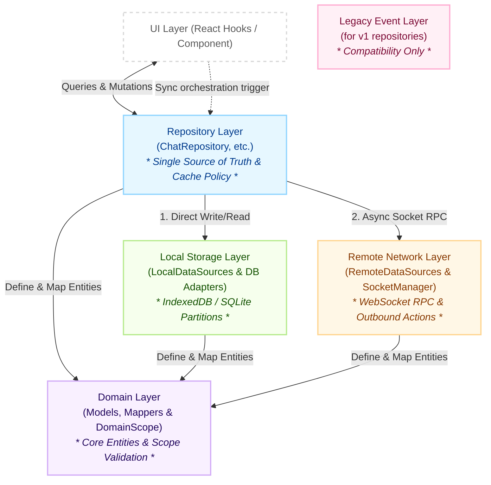
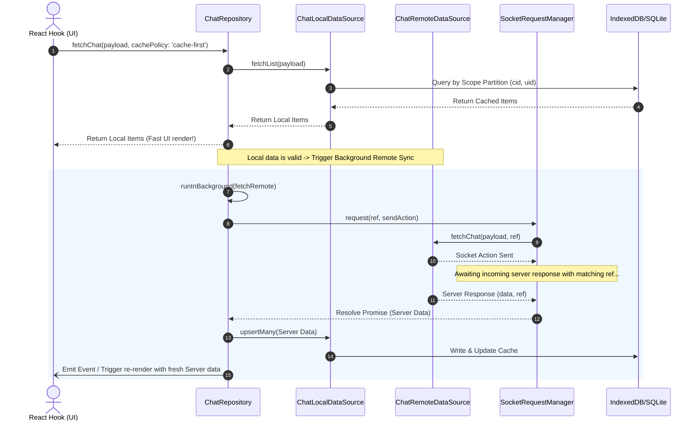
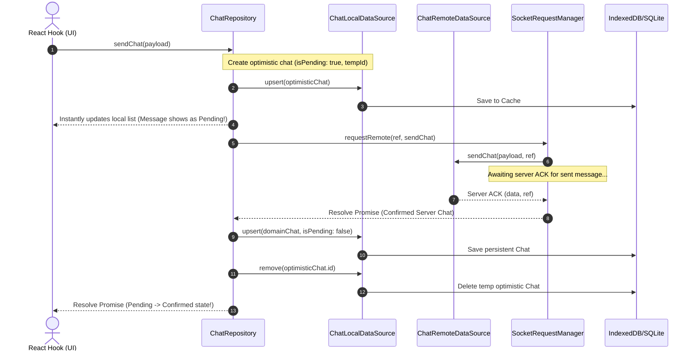
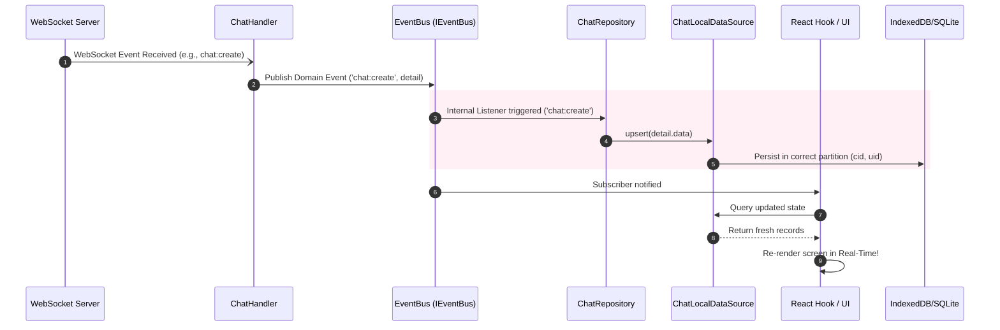

# @chatic/data (데이터 싱크 & 아키텍처 가이드)

`@chatic/data`는 WebSocket 기반 gateway 호출, IndexedDB/Native SQLite 로컬 파티션 캐싱, 그리고 sync orchestrator가 호출하는 repository 계약을 제공하는 데이터 레이어입니다. UI 계층은 repository만 사용하고, socket lifecycle과 sync 정책은 상위 런타임이 담당합니다.

---

## 1. 디렉토리 구조 (Directory Structure)

실제 데이터 관련 핵심 인프라 및 비즈니스 핵심 로직은 `libs/data/src/data` 아래의 **Clean Architecture** 원칙에 따라 레이어별로 철저하게 분리되어 있습니다.

```text
libs/data/src/
├── data/
│   ├── domain/           # 도메인 모델 정의 및 데이터 매핑 (Raw View -> Domain Entity)
│   ├── local/            # 로컬 데이터 인프라 (Adapters, Databases, LocalDataSources)
│   ├── remote/           # 원격 데이터 통신 (Socket proxy, Gateways, RemoteDataSources)
│   ├── repositories/     # 단일 진실 공급원 (Single Source of Truth - 캐시 정책 및 비즈니스 중재)
│   └── events/           # 레거시 repository/event bus 지원용 Type 및 Engine
└── index.ts              # Public API 진입점
```

---

## 2. 모듈 의존성 및 구조 (Layered Architecture Map)

각 레이어는 엄격하게 단방향 의존성을 유지하며, 최상위 `Repository` 계층이 `Local`과 `Remote` 데이터 인프라를 지휘합니다. V2 계약에서는 sync orchestrator가 repository 메서드를 직접 호출하며, repository 자체는 socket event를 구독하지 않습니다.



---

## 3. 상세 클래스 상속 및 인터페이스 구조 (Class Inheritance & Interface Relationships)

`@chatic/data` 내부는 다형성과 확장성을 보장하기 위해 추상 클래스(Abstract Class)와 명확한 인터페이스 계약(Interface Contract)을 바탕으로 구현되어 있습니다.

```mermaid
classDiagram
    %% -----------------------------------------
    %% 1. Repository Layer Classes
    %% -----------------------------------------
    class DataContextProvider {
        <<interface>>
        +getContext() DataContext
        +setContext(context DataContext) void
    }

    class BaseRepository {
        <<abstract>>
        #requestManager: ISocketRequestManager
        #context: DataContextProvider
        #domainEventBus: IEventBus
        #requestRemote(sendAction, options) Promise
        #getRepositoryContext() DataContext
        #getDomainScope() DomainScope
        #runInBackground(task, label) void
        #resolveCachePolicy(options) RepositoryCachePolicy
        #fetchWithCachePolicy(params) Promise
        #onDomainEvent(event, callback) function
    }

    class ILocalCacheMutationRepository {
        <<interface>>
        +cacheCreate(item) Promise
        +cacheUpdate(id, patch) Promise
        +cacheDelete(id) Promise
        +cacheBulkCreate(items) Promise
        +cacheBulkUpdate(items) Promise
    }

    class IChatRepository {
        <<interface>>
        +sendChat(payload, options) Promise
        +fetchChat(payload, options) Promise
        +clearAll() Promise
        +clearByChannelId(channelId) Promise
        +onChatCreated(callback) function
        +onChatUpdated(callback) function
        +onChatDeleted(callback) function
        +subscribeList(channelId, callback) function
        +subscribeItem(id, callback) function
    }

    class ChatRepository {
        -chatRemoteDataSource: IChatRemoteDataSource
        -chatLocalDataSource: IChatLocalDataSource
        +sendChat(payload, options) Promise
        +fetchChat(payload, options) Promise
        +clearAll() Promise
        +clearByChannelId(channelId) Promise
    }

    BaseRepository <|-- ChatRepository
    ILocalCacheMutationRepository <|-- IChatRepository
    IChatRepository <|.. ChatRepository

    %% -----------------------------------------
    %% 2. Local Data Source Layer Classes
    %% -----------------------------------------
    class BaseLocalDataSource {
        <<abstract>>
        #contextProvider: DataContextProvider
        #getContext(override) DataContext
        #getUid(override) string
        #getCid(override) string
        #getSid(override) string
        #subscribeQueryStream(query, callback) function
        #debouncedEmitAllStreams() void
    }

    class ICrudLocalDataSource {
        <<interface>>
        +getById(id, override) Promise
    }

    class IListLocalDataSource {
        <<interface>>
        +fetchList(query, override) Promise
    }

    class IStreamLocalDataSource {
        <<interface>>
        +subscribeItem(id, callback, override) function
        +subscribeList(query, callback, override) function
    }

    class IChatLocalDataSource {
        <<interface>>
        +clearByChannelId(channelId, override) Promise
    }

    class ChatLocalDataSource {
        #cacheStorage: CacheStorage
        +getById(id) Promise
        +upsert(chat) Promise
        +fetchList(payload) Promise
        +subscribeList(channelId, callback) function
    }

    ICrudLocalDataSource <|-- IChatLocalDataSource
    IListLocalDataSource <|-- IChatLocalDataSource
    IStreamLocalDataSource <|-- IChatLocalDataSource
    BaseLocalDataSource <|-- ChatLocalDataSource
    IChatLocalDataSource <|.. ChatLocalDataSource

    %% -----------------------------------------
    %% 3. DB Adapter & Storages Layer Classes
    %% -----------------------------------------
    class CacheStorage {
        <<interface>>
        +save(id, item) Promise
        +saveAll(items) Promise
        +load(id) Promise
        +loadAll(options) Promise
        +delete(id) Promise
        +deleteAll(ids) Promise
        +clearAll() Promise
        +clearByChannelId(channelId) Promise
    }

    class BaseDbAdapter {
        <<abstract>>
        #type: CacheType
        #contextProvider: DataContextProvider
        #getScope() Scope
        +save(id, item)* Promise
        +saveAll(items)* Promise
        +load(id)* Promise
        +loadAll(options)* Promise
        +delete(id)* Promise
        +deleteAll(ids)* Promise
        +clearAll()* Promise
        +clearByChannelId(channelId) Promise
    }

    class IndexedDBAdapter {
        -db: IIndexedDB
        -executor: IndexedDbQueryExecutor
        +save(id, item) Promise
        +load(id) Promise
        +loadAll(options) Promise
    }

    class NativeDBAdapter {
        -bridge: IWebBridgeClient
        +save(id, item) Promise
        +load(id) Promise
        +loadAll(options) Promise
    }

    CacheStorage <|.. BaseDbAdapter
    BaseDbAdapter <|-- IndexedDBAdapter
    BaseDbAdapter <|-- NativeDBAdapter
```



---

## 4. 핵심 아키텍처 데이터 흐름 (Core Data Flow)

`@chatic/data` 라이브러리가 복잡한 비동기 비즈니스 시나리오를 어떻게 처리하는지 세 가지 주요 흐름을 통해 확인하실 수 있습니다.



<!-- slide -->



<!-- slide -->



---

## 5. 아키텍처 핵심 메커니즘 (Key Architectural Mechanisms)

### 5.1 DataContext & Dynamic Scoping

리포지토리 인스턴스는 한 번 생성되면 메모리에 영구 유지되지만, 사용자가 **Cloud(cid)** 를 바꾸거나 **계정(uid)** 을 로그아웃/로그인하더라도 재생성할 필요가 없습니다.

- `DataContextProvider` 인터페이스를 통해 Repository가 비동기 런타임에 항상 **최신 컨텍스트**(`cid`, `uid`, `sid`)를 조회하도록 설계되었습니다.
- 모든 로컬 캐시 쿼리 및 DB 저장은 컨텍스트 파티션 포맷(`type:cid:uid:id`)을 타며, Cloud 전환 중 이전 네트워크의 응답이 늦게 오더라도 현재 활성화된 `cid`와 비교 검증하여 **Cross-Cloud 데이터 오염을 완벽히 격리**합니다.

### 5.2 SocketRequestManager (WebSocket 기반 RPC)

HTTP 연결을 맺지 않고 WebSocket 하나만을 사용하여 단방향 푸시뿐만 아니라 **요청-응답 패러다임**을 구현합니다.

- `requestRemote` 호출 시 유니크한 `ref`(Correlation ID)를 발급하여 발신 액션을 소켓에 싣습니다.
- `SocketRequestManager`는 내부 맵에 `Promise`의 `resolve/reject` 핸들러를 `ref` 키에 매핑하여 등록하고 대기합니다.
- 인바운드 소켓 핸들러에 동일한 `ref`를 포함하는 메시지가 수신되면, 해당하는 `Promise`를 깨워 비동기 처리를 완료합니다.

### 5.3 EventBus & Loosely Coupled UI Reactivity

`@chatic/data` 내부와 외부 UI 계층은 직접적인 콜백 참조 대신 `IEventBus<AppEventMap>`를 통한 **이벤트 브로커 패턴**으로 엮입니다.

- 인바운드 소켓 이벤트(`chat:create`, `channel:delete` 등)는 핸들러를 거쳐 EventBus로 퍼블리시됩니다.
- 리포지토리들은 내부 리스너를 통해 이벤트를 잡아내어 즉시 로컬 캐시를 갱신(Self-Healing Local DB)합니다.
- React Hook 계층은 해당 이벤트를 감지해 리액티브하게 상태를 업데이트하므로 데이터 무결성과 초고속 실시간 화면 갱신이 동시에 보장됩니다.
