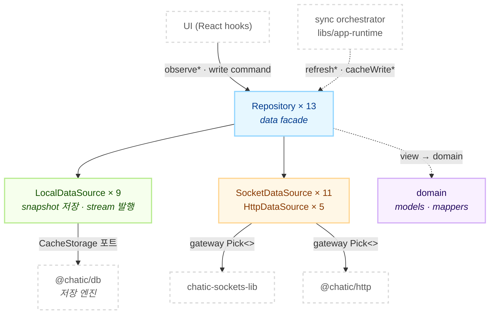
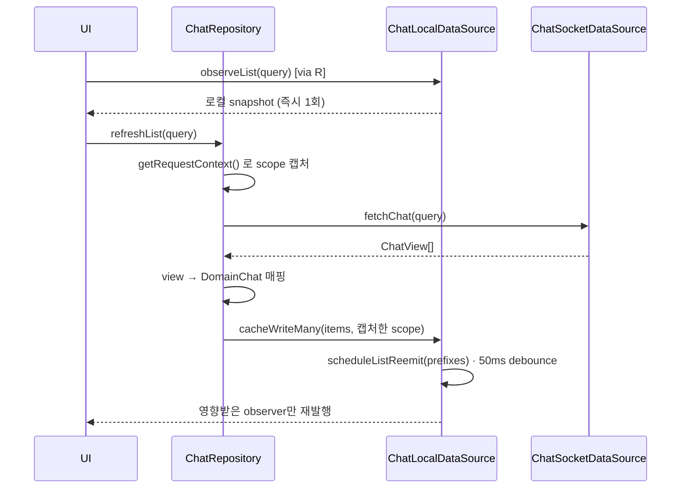

# @chatic/data — headless data layer

> 상태: Approved · 최종 갱신: 2026-09-09 · 관련 ADR: [ADR-0081](../../../docs/adr/0081-libs-data-doc-canon-and-layer-flattening.md) (이 문서의 트랙), [ADR-0036](../../../docs/adr/0036-data-surface-unification-app-runtime-cleanup.md) (데이터 접근 표면 단일화)

## 목적

앱이 쓸 데이터 표면 전부를 조립해 하나의 배럴로 내보낸다 — 도메인 모델과 매퍼, 로컬 캐시의 저장·
stream 발행, 서버로 나가는 outbound 호출, 그리고 이 셋을 묶는 repository facade.

앱은 `@chatic/data` 배럴만 본다. 소비 파일 213개 중 내부 경로를 직접 import하는 것은 하나도 없다.

이 lib은 **소켓 연결의 생애주기를 소유하지 않는다.** 연결·재인증·sync 타이밍은 `libs/app-runtime`의
sync orchestrator 소관이다. orchestrator가 repository의 `refresh*` / `cacheWrite*`를 부르면
repository가 그 결과를 로컬에 반영하고 stream으로 재방출한다. repository 입장에서 그 호출이 UI에서
왔는지 orchestrator에서 왔는지는 구분하지 않는다.

## 설계 원칙

1. **읽기는 항상 local stream.** UI는 `observe*`만 구독한다. remote 응답을 직접 렌더하는 경로는 계약 위반이다.
2. **remote는 side-effect command.** write와 refresh는 명시적 메서드 호출이다. 자동 dispatcher나 event bus는 없다.
3. **UI는 네트워크를 직접 호출하지 않는다.** 모든 데이터 콜은 repository를 지난다 (ADR-0036).
4. **remote는 축이고, 그 아래는 전송 수단이다.** `remote/`가 local의 반대편이고 그 안에서 `socket-`과 `http-`로 갈린다.
5. **요청 시점 문맥을 캡처한다.** 늦게 도착한 응답이 전환된 스코프를 오염시키면 안 된다. scope 캡처는 repository의 책임이고, local은 `contextOverride`로 그것을 받는다.
6. **서버 payload · 서버 view · 로컬 domain model은 같은 형태라고 가정하지 않는다.** 책임 경계가 다르면 별도 타입으로 둔다.
7. **캐시 어댑터를 고르지 않는다.** 어느 도메인이 IndexedDB를 쓰고 어느 것이 네이티브 SQLite를 쓰는지는 `libs/app-runtime`의 `resolveCacheBackend`가 판정한다.

## 범위

**포함** — 도메인 모델·매퍼, 로컬 data source와 stream 엔진, `CacheStorage` 포트, 소켓·HTTP
gateway 타입(`Pick<>`)과 data source, repository facade 13종, `DataContext` 계약.

**제외** — 소켓 전송 런타임(`@lemoncloud/chatic-sockets-lib`), 저장 엔진 구현(`@chatic/db`의
`IndexedDBAdapter`·`NativeDBAdapter`·`ChatQueryExecutor`), HTTP 클라이언트(`@chatic/http`),
sync 타이밍·연결 생애주기·캐시 라우팅(`libs/app-runtime`), 서버 소켓 spec.

## 시나리오

### 1. 방을 열어 메시지를 읽는다

`useChats`가 `chat.observeList({ channelId, limit })`를 구독한다. 구독 즉시 로컬 snapshot이 1회
발행된다 — 네트워크를 기다리지 않는다. 같은 훅이 `chat.refreshList`를 불러 `chat.feed`를 요청하고,
응답은 로컬에 **merge**된다(overwrite가 아니다). merge가 끝나면 그 query의 list observer만 재발행되고
화면이 갱신된다. 반환된 cursor 메타는 다음 페이지 요청의 입력으로만 쓰고 렌더 source로 쓰지 않는다.

### 2. 메시지를 보낸다

`chat.sendChat`이 낙관적 pending 행을 로컬에 먼저 쓴다. 그 행은 서버 번호를 받기 전이라 `chatNo: 0`
이다. remote 호출이 실패하면 `isFailed`로 마킹하고, 성공하면 서버 스냅샷으로 대체한다.

### 3. orchestrator가 채널 변경분을 밀어넣는다

`syncChannels(since)`가 `channel.sync({ since })`를 부른다. `since: 0`은 full sync, `since > 0`은
delta다. 응답의 `list`는 변경된 채널이고 `ids`는 지금 내가 속한 전체 채널 id다. repository는 `list`를
쓰고 `ids`에 없는 채널을 stale remove한다. 다음 `since`는 `syncMeta`가 보관한다.

채널 sync는 채널 **목록**만 갱신한다. 메시지는 가져오지 않는다. 서버가 채널마다 `lastChat$`를 실어
보내지만 매퍼는 그것을 **의도적으로 읽지 않는다** — 마지막 메시지와 그 시각은 chat 캐시 소관이다
(ADR-0057, `domain/mappers.ts:79`).

### 4. 클라우드를 전환한다

`DataContextHolder`가 새 `cid`를 받는다. repository는 문맥을 보관하지 않고 매 호출마다
`DataContextProvider`로 최신 값을 읽으므로 재생성이 필요 없다. observer는 `cid`/`sid`/`uid` 튜플의
`stableHash`로 격리되어 있어서, scope가 바뀌면 다른 observer 집합이 활성화된다.

### 5. 방을 나갔다 다시 들어온다

퇴장해도 그 방의 메시지 행은 캐시에 남는다 — chat sync plan에 `onRemove`가 없고, 이력은
lazy-load와 오프라인을 위해 유지된다. 그런데 화면은 서버 응답이 아니라 캐시를 렌더한다. 그래서 두
장치가 함께 걸린다 (ADR-0067).

- **표시 게이트** `isInJoinWindow(chat, joinedNo)` — 서버와 같은 규칙(`chatNo > joinedNo`)을 캐시를 읽는 자리에 건다. `joinedNo`가 없으면 아무것도 숨기지 않고, `chatNo`가 falsy면 통과시킨다(낙관적 전송 행이 사라지지 않게).
- **purge** — 본인 나가기 성공과 내 join 행 제거, 두 명시 신호에만 건다. 추론 기반 정리에는 붙이지 않는다. chat 삭제는 되돌릴 수 없다.

### 6. HTTP 전용 도메인을 읽는다

구독 가능한 로컬 캐시가 없는 도메인이 셋 있다 — `report`, `subscription`, 그리고 `cloud`의 카탈로그
조회. 이들은 로컬에 쓰지 않는다. 캐시 의미는 소비자 쪽 react-query 어댑터가 소유한다.

## 다이어그램

### 레이어 의존



`local`은 `remote`를 부르지 않는다. 둘을 잇는 것은 repository 하나다.

### 읽기와 쓰기



## 상세 구현

### 디렉토리

```text
libs/data/src/
├── index.ts          공개 배럴 (export * 8줄)
├── domain/           도메인 모델 + 매퍼
├── local/
│   ├── data-sources/ 도메인별 LocalDataSource 9종 + stream 엔진 BaseLocalDataSource
│   ├── ports/        CacheStorage · indexeddb · metrics · policy · search 포트
│   └── stableHash.ts scope key 해시
├── remote/
│   ├── gateways/     socket.ts · http.ts — 도메인이 쓸 capability만 Pick<>
│   ├── socket-data-sources/  11종 + 팩토리
│   └── http-data-sources/    5종 + 팩토리
└── repositories/     facade 13종 + BaseRepository + DataContext + scopeGuards
```

레이어 상세는 각 문서가 정본이다.

| 문서                                 | 다루는 것                                                              |
| ------------------------------------ | ---------------------------------------------------------------------- |
| [local.md](./local.md)               | stream 모델, scope와 캐시 슬롯, chat cursor, 채널 한정 삭제의 세 경로  |
| [remote.md](./remote.md)             | gateway 매핑 표, DataSource별 호출, 이름 규약, 클라이언트 측 요청 제한 |
| [repositories.md](./repositories.md) | 도메인별 메서드와 sync 결과 해석, cache clear 원칙, 퇴장과 재입장      |

### repository 배선

`repositories/index.ts`의 `createRepositories`가 조립 지점 하나다. local이 없는 것과 socket이 없는
것이 섞여 있다.

| repository     | socket | local                     | http           |
| -------------- | ------ | ------------------------- | -------------- |
| `auth`         | ✓      | —                         | `auth`         |
| `channel`      | ✓      | `channel` + `chat`        | —              |
| `chat`         | ✓      | `chat`                    | —              |
| `cloud`        | ✓      | `cloud`                   | `cloud`        |
| `device`       | ✓      | —                         | `user`         |
| `invite`       | ✓      | `invite`                  | —              |
| `join`         | ✓      | `join`                    | —              |
| `place`        | ✓      | `place`                   | —              |
| `profile`      | ✓      | `profile`                 | —              |
| `report`       | —      | —                         | `report`       |
| `subscription` | —      | —                         | `subscription` |
| `user`         | ✓      | `user` + `join` + `place` | `user`         |
| `syncMeta`     | —      | `syncMeta`                | —              |

- `auth`·`device`는 캐시할 것이 없는 remote-only 표면이다 (세션 신원 명령, 조회 신호).
- `report`·`subscription`은 remote-only이자 HTTP-only다 — 소켓 data source조차 없다.
- `channel`이 `chat` 로컬까지 받는 이유는 퇴장 시 채널 행만이 아니라 그 방의 메시지까지 비워야 하기 때문이다 (ADR-0067).
- `user`가 `join`·`place` 로컬을 받는 이유는 초대 후보 조립이 세 캐시를 함께 읽기 때문이다.

### `BaseRepository`가 주는 것

`getRequestContext()`(호출 시점 `cid`/`sid`/`uid` 스냅샷), `getNormalizedContext()`(`cid` 없으면
`'default'`), `assertRequiredString`, `dispose()`. event bus와 cachePolicy는 없다.

### `DataContext`

`cid`(연결된 cloud) · `sid`(선택된 place) · `uid`(현재 사용자). repository는 문맥을 보관하지 않고
`DataContextProvider`(구현체 `DataContextHolder`)로 매 호출마다 읽는다. 정본은
`repositories/types.ts`다. `withContext(snapshot)`으로 특정 문맥에 고정된 사본을 만들 수 있다.

### HTTP 주입은 선택적이다

`createRepositories`의 `httpDataSources`가 선택 인자다(`httpDataSources?`). 미주입 상태에서 해당
메서드를 부르면 명시 에러를 던진다. ADR-0036 트랙 문서는 "4단계 완료 후 필수로 승격"을 예고했지만
승격은 일어나지 않았다. 지금 상태는 선택적이다.

## 검증 방법

```bash
npx tsc -b libs/data/tsconfig.lib.json
npx jest --config libs/data/jest.config.js
```

- 타입체크는 `tsc -b tsconfig.lib.json`이어야 한다. `libs/data`에서 `tsc --noEmit`은 0건을 검사하고 성공한다.
- 테스트는 45파일 · 360케이스다. data source·repository 각각에 대응 테스트가 있다.
- 다운스트림 확인: `apps/web`·`apps/desktop-web`·`libs/app-runtime`의 타입체크. 배럴 식별자가 바뀌면 여기서 잡힌다.
- 낡은 `dist`/`out-tsc`가 유령 에러를 만든다. 디렉토리를 물리 이동한 뒤에는 `rm -rf libs/data/dist libs/data/out-tsc`로 강제 삭제하고 다시 본다.

---

## 구현 체크리스트

> 임시 섹션 — Live 전환 시 삭제한다.

### 1단계 — `src/data` 평탄화 (외부 파급 0)

`libs/data/src/data/*`를 `libs/data/src/*`로 올린다. 같은 커밋에서 디렉토리 이름의 `-v2`도 뗀다
(`repositories-v2` → `repositories`, `local/data-sources-v2` → `local/data-sources`). 식별자는
건드리지 않는다 — 이 단계는 경로만이다.

- `git mv`로 4개 디렉토리 이동
- 내부 상대 경로 수정 (109파일 범위, 대부분 `../../` 깊이 한 단계 감소)
- `src/index.ts`의 8줄 경로 수정
- `rm -rf libs/data/dist libs/data/out-tsc` 후 타입체크 + 테스트
- 커밋

### 2단계 — `V2` 식별자 제거 (리포 전체)

| 지금                                               | 이후                                           |
| -------------------------------------------------- | ---------------------------------------------- |
| `XxxRepositoryV2` · `IXxxRepositoryV2`             | `XxxRepository` · `IXxxRepository`             |
| `BaseRepositoryV2`                                 | `BaseRepository`                               |
| `createRepositoriesV2`                             | `createRepositories`                           |
| `DataRepositoriesV2` · `DataRepositoriesV2Options` | `DataRepositories` · `DataRepositoriesOptions` |
| `XxxLocalDataSourceV2` · `IXxxLocalDataSourceV2`   | `XxxLocalDataSource` · `IXxxLocalDataSource`   |
| `LocalDataSourcesV2` · `createLocalDataSourcesV2`  | `LocalDataSources` · `createLocalDataSources`  |
| `BaseLocalDataSourceV2` · `ILocalDataSourceV2`     | `BaseLocalDataSource` · `ILocalDataSource`     |

- 도메인 이름을 명시한 치환만 쓴다. `Invite`가 `I` 접두와 겹쳐서(`IInviteRepositoryV2` vs `InviteRepositoryV2`) 정규식 `I` 접두 치환은 금지다.
- 데이터 레이어와 무관한 `V2`는 건드리지 않는다 — `apps/admin-v2` 경로, `useRegisterUserV2`, `registerUserV2`(와이어 액션), `useChatOutbox`·`useCloudCatalog`의 지역 식별자.
- `app-runtime/src/data/factories/repositoryFactory.ts` 삭제 → `DataManager`가 `@chatic/data`의 `createRepositories`를 직접 부른다. 인자 키가 `contextProvider` → `context`로 바뀐다.
- `app-runtime/src/data/factories/localFactory.ts:5`의 import 별칭 제거.
- 타입체크: `libs/data` → `libs/app-runtime` → `apps/web` → `apps/desktop-web` 순.
- 커밋

### 3단계 — 문서 재작성

8개 → 4개 + 진입점.

| 만들 것                | 재료                                                                |
| ---------------------- | ------------------------------------------------------------------- |
| `docs/architecture.md` | 이 문서. 임시 섹션 2개 삭제하고 상태를 Live로.                      |
| `docs/local.md`        | `docs/local/README.md` + `docs/local/architecture.md` 병합          |
| `docs/remote.md`       | `docs/remote/README.md` + `docs/remote/architecture.md` 병합        |
| `docs/repositories.md` | `docs/repositories/README.md` + `docs/repositories/domains.md` 병합 |
| `README.md`            | 20줄 진입점으로 축소 (242줄 → 20줄)                                 |

삭제: `docs/README.md`, `docs/http-data-path.md`, `docs/local/`, `docs/remote/`, `docs/repositories/`.

`http-data-path.md`에서 `docs/remote.md`로 흡수할 것 넷.

1. HTTP gateway `Pick<>` 구성 — 도메인 5종(`auth`·`user`·`cloud`·`subscription`·`report`)
2. HttpDataSource별 도메인 매핑과 "로컬에 쓰지 않는다"는 캐시 의미
3. `ReportHttpDataSource`가 매핑할 도메인도 캐시 슬롯도 없이 이 층을 지나는 이유
4. REST 훅 소비처 실측 수치 — [ADR-0070:108](../../../docs/adr/0070-app-runtime-session-hub.md)이 이 수치를 링크로 인용한다. 지우면 그 링크가 끊긴다.

나머지(단계 예고, 검증 절차, 문서에서 벗어난 지점, 스케치 코드)는 버린다.

**고칠 낡은 사실 10건** — 아래 전부 이번 재작성에서 사라진다.

| 위치                          | 낡은 주장                          | 실제                                                 |
| ----------------------------- | ---------------------------------- | ---------------------------------------------------- |
| `docs/README.md`              | `src/data/events` 섹션 전체        | 디렉토리 없음                                        |
| `docs/README.md`              | 트리에 `repositories/`             | 없음                                                 |
| `docs/README.md`              | `src/data/repositories/types.ts`   | `repositories-v2/types.ts`                           |
| `README.md`                   | 트리에 `repositories/` + `events/` | 둘 다 없음                                           |
| `docs/local/README.md`        | 트리에 `databases/`                | 없음 — `@chatic/db`로 이동                           |
| `docs/local/README.md`        | 트리에 `storages/`                 | 없음 — `@chatic/db`로 이동                           |
| `docs/local/README.md`        | local 도메인 8개                   | 9개 (`invite` 누락, ADR-0052)                        |
| `docs/local/architecture.md`  | 캐시 슬롯 8개                      | 9개 (`invite` 누락)                                  |
| `docs/local/architecture.md`  | `storages/index.ts` 링크           | 깨짐                                                 |
| `docs/repositories/README.md` | 도메인 8개                         | 13개 (`auth·device·invite·report·subscription` 누락) |

추가로 `docs/http-data-path.md`의 `apps/admin`은 지금 `apps/admin-v2`뿐이고, `docs/repositories/domains.md`가
`lastChat$`를 채널 sync 내용물로 서술하는데 매퍼는 그것을 의도적으로 읽지 않는다(ADR-0057).

**링크 스윕 — 외부 15개 파일, 17줄.**

| 고칠 것                                   | 개수   | 지금 → 이후                                                                      |
| ----------------------------------------- | ------ | -------------------------------------------------------------------------------- |
| ADR "이름 안내" 각주                      | **11** | `docs/remote/README.md#이름-규약-2026-09-01-리네임` → `docs/remote.md#이름-규약` |
| `libs/http/docs/architecture.md`          | 3      | `../../data/docs/http-data-path.md` → `../../data/docs/remote.md`                |
| `docs/adr/0006`                           | 1      | `libs/data/docs/local/` → `libs/data/docs/local.md`                              |
| `docs/adr/0070:108`                       | 1      | `http-data-path.md` → `docs/remote.md` (위 흡수 항목 4)                          |
| `docs/specs/cache/local-cache-layer.md:9` | 1      | `libs/data/docs/README.md` → `libs/data/docs/architecture.md`                    |

`apps/web/docs/README.md:72`는 디렉토리(`libs/data/docs`)를 가리켜 그대로 유효하다.
`docs/audit/2026-09-dead-code-sweep.md:235`는 과거 편집을 서술하는 산문이라 경로를 고치지 않는다 —
그 시점의 기록이다.

**앵커를 반드시 보존한다.** ADR 11개가 2026-09-01 이름 규약 대응표 하나를 가리킨다. 옛 이름으로 쓰인
ADR을 읽는 사람이 전부 그 앵커로 온다. `docs/remote.md`에서 그 표의 제목을 `## 이름 규약`으로 두고,
ADR-0081의 `V2` 제거 행을 같은 표에 덧붙인다. 제목을 바꾸면 11개 링크가 동시에 끊긴다.

- 커밋

## 리스크와 미지수

> 임시 섹션 — Live 전환 시 삭제한다.

**검증 환경.** 이 워크트리에 `node_modules`가 없다. 메인 체크아웃에서 심링크를 붙여 검증하고 끝나면
제거한다. 심링크를 남기면 다른 세션의 nx 캐시를 오염시킨다.

**동시 세션.** 이 워크트리의 git 인덱스를 다른 세션과 공유한다. 커밋마다 경로를 명시해 스테이징하고
직전에 `git diff --cached --name-only`로 남의 것이 섞이지 않았는지 확인한다.

**리베이스 의미 충돌.** 2단계는 순수 리네임이라 텍스트 충돌 없이 머지돼도 의미가 깨질 수 있다.
`develop` 리베이스 후에는 반드시 타입체크를 다시 돌린다.

**desktop-web.** push로만 배포되고 되돌릴 수단이 없다. 이 트랙이 건드리는 `desktop-web` 파일은
리네임에 한정한다 — 로직에 손대지 않는다.

**`libs/data`가 다운스트림 타입체크를 막는다.** `apps/web` 타입체크가 `libs/data`의 빌드 산출물을
본다. 1단계 후 `dist`를 지우지 않으면 옛 심볼 기준 유령 에러가 난다.

**미지수 — HTTP 주입 선택성.** `httpDataSources?`가 선택적으로 남아 있고 승격이 예고만 됐다.
`app-runtime`이 항상 주입하는지 확인이 필요하다. 항상 주입한다면 선택성은 죽은 유연성이지만, 그
정리는 이 트랙 범위가 아니다 — 별도 판단으로 넘긴다.

**이름 규약 대응표가 단일 실패점이다.** ADR 11개가 그 앵커 하나에 의존한다. 3단계에서 표를 옮길 때
제목과 앵커를 그대로 유지하고, 커밋 전 11개 링크를 실제로 눌러 확인한다.
