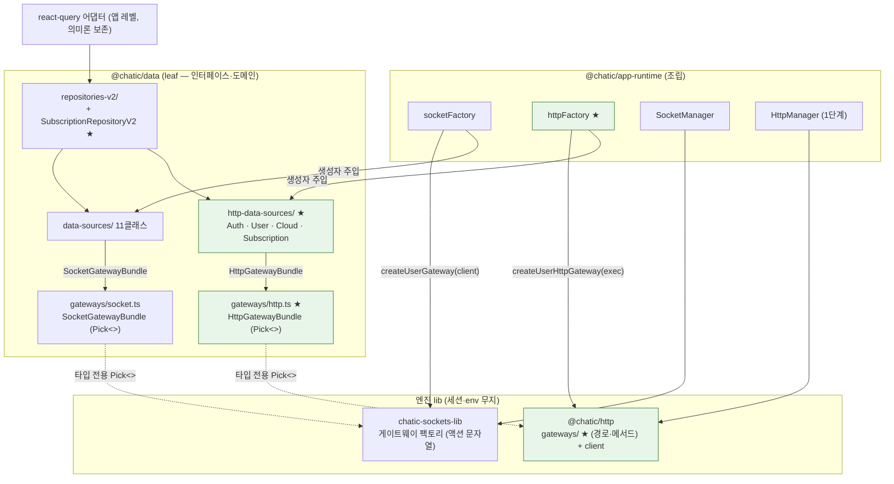
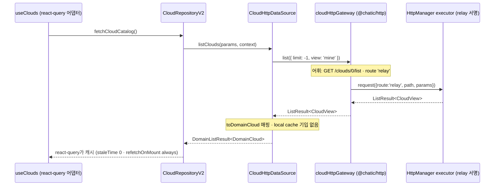

# HTTP 데이터 경로 — gateways · http-data-sources · httpFactory

> 상태: Live · 최종 갱신: 2026-09-02 (§7 리포트 lane 추가) · 관련 ADR: [ADR-0070](../../../docs/adr/0070-app-runtime-session-hub.md) (결정 3·4·5·6) · [ADR-0036](../../../docs/adr/0036-data-surface-unification-app-runtime-cleanup.md) · 선행: [libs/http architecture](../../http/docs/architecture.md)

## 목적

ADR-0070 §맥락의 "HTTP에는 소켓의 분업이 없다"를 닫는 두 번째 절반이다. 1단계
([libs/http architecture](../../http/docs/architecture.md))가 실행기·규칙(`ports.ts`·`client.ts`·
실행기 2종·policy·error·log)을 lib으로 내렸다면, 이 문서(2단계 후반)는 그 위에 **데이터 경로**를
세운다:

- `@chatic/http/gateways/` — 와이어 어휘(경로·메서드·요청 형태)의 주인. 소켓의
  `createUserGateway`와 같은 층.
- `data/remote/http-data-sources/` — 도메인 매핑·캐시 의미의 주인. 소켓
  `data/remote/socket-data-sources/`와 같은 층.
- `data/remote/gateways/`의 `HttpGatewayBundle` — 소비자 소유 `Pick<>` 계약. 소켓
  `SocketGatewayBundle`([gateways/socket.ts](../src/data/remote/gateways/socket.ts))과 같은 패턴.
- `app-runtime`의 `httpFactory` — 조립.
  [socketFactory](../../app-runtime/src/data/factories/socketFactory.ts)와 대칭.

이관 원본은 `web-core/src/api`의 REST 도메인 3파일
(auth.ts · users.ts ·
subscriptions.ts)이다. ADR-0036이 "모든 데이터 콜은
repository를 거친다"의 유일한 미해결 위반으로 지목한 REST 훅들의 우회가, 이 경로가 완성되면
repository 뒤로 들어갈 자리를 얻는다(실제 소비처 이동은 4단계).

### 실측 — REST 훅 소비처 (ADR 수치는 과다 계상)

ADR-0070 §맥락은 훅 6개의 소비를 18·22·8·6·4·2로 적었으나, 전수 grep 실측(정의·배럴 재수출·
`dist/`·테스트 목 제외)은 다음과 같다[^adr-count]:

| 훅                               | 실측 소비                                           | 이관 판정                              |
| -------------------------------- | --------------------------------------------------- | -------------------------------------- |
| `useClouds` (web-core 판)        | **5곳** — 전부 apps/web                             | **완료** — 앱 레이어로 (아래)          |
| `useCloudSessionCatalog`         | **15곳** — web 10 · desktop-web 3 · testbed 1 외    | **완료** — 앱별 사본 3개 (아래)        |
| `useRegisterDeviceTokenMutation` | **5곳** — web·desktop-web·web-core·app-runtime/push | **런타임 잔류** — 런타임이 직접 부른다 |
| `useVerifyEmail`                 | **1곳** — apps/web `useVerifyEmailCode`             | **완료** — 그 호출부 안으로            |
| `useUsers`                       | **2곳** — apps/admin (`@chatic/users` 재수출 경유)  | **완료** — admin-v2로 흡수             |
| `useVerifyNativeAppToken`        | **0곳** — 재수출 체인만 있고 호출부 없음            | **이관 대상 아님 — 삭제 후보**         |

[^adr-count]:
    ADR §맥락의 수치(`useClouds` 18곳 등)는 과다 계상이다. desktop-web에는
    `useCloudSessionCatalog`를 감싼 **동명의 자체 `useClouds`**(`apps/desktop-web/src/app/shared/hooks/useClouds.ts`)가
    있어 합산된 것으로 보인다. 이 문서의 수치가 2026-08-27 기준 실측이다.

추가 실측 두 건 — 이관 원본 함수 자체에도 죽은 코드가 있다:

- **`fetchProfile` 소비 0** (auth.ts:128). `refreshAuthToken`이
  refresh 응답에서 프로필을 파생하도록 바뀌면서(auth.ts:242 주석
  "no separate `/users/0/profile` GET") 호출부가 사라졌다. `tryFetchProfile`(admin-v2
  `ProtectedRoute` 1곳)과 별개다. **삭제 후보.**
- **`generateToken` 소비 0** (auth.ts:117). 이 함수를 넘겨받는
  `TokenGeneratorModal`의 `onGenerateToken` prop을 채우는 곳이 리포에 없고, 유일한 렌더러인
  `apps/admin`(이미 깨진 앱 — ADR §곁가지)은 그 prop을 넘기지 않는다. **삭제 후보.**

그리고 ADR의 "훅 6개" 목록 **밖에도** repository를 우회하는 REST 훅이 있다:
`web-core/src/hooks/subscription/index.ts`의 12개(`useMembershipInfo` · `useDeleteCloud` ·
`useMakeCloud` · `useActiveSubscriptions` · `useValidate*` …)와 `hooks/auth`의 5개
(`useRegisterUser` · `useFindAlias` …). 게이트웨이·data-source 설계는 이들까지 포함한다 —
단 `hooks/auth`는 세션·인증 훅으로 3단계 이관 소속이다(ADR 결정 1).

## 설계 원칙

1. **와이어 어휘는 lib, 도메인 의미는 data, 결합은 팩토리** (ADR 결정 5의 세 축 문장).
   `data`는 소켓 액션 문자열을 모르듯 HTTP 경로도 모른다 — `POST /oauth/login-user` 같은
   경로·메서드는 `@chatic/http/gateways`가 소유하고, `data`는 게이트웨이 타입의 `Pick<>`만 본다.
2. **게이트웨이는 executor만 주입받는다.** 어느 host로, 어느 크레덴셜로 나가는지 모른다 — 소켓의
   `createUserGateway(client)`가 client만 받는 것과 동일. host·크레덴셜·서명은 `HttpManager`의
   포트([1단계 문서 §포트 계약](../../http/docs/architecture.md))가 결정한다.
3. **`Pick<>`의 부재가 강제다 — 단, 토큰 생성 액션은 예외가 됐다.** 소켓 번들이 `@deprecated`
   패킷을 Pick에서 빼는 것으로 호출을 봉쇄하는 수법은 유효하다
   ([gateways/socket.ts:20-24](../src/data/remote/gateways/socket.ts)).

    `AuthHttpDomainGateway`만 방향이 바뀌었다. 원래는 토큰·크레덴셜을 낳는 액션을 아예 싣지
    않았고 `session/auth`가 게이트웨이를 직접 구동했는데, 그 근거가 유지되지 않았다 —
    `AuthRepositoryV2.confirmPhoneCode`가 **이미** `$token`(새 세션)을 반환하면서 "repository는
    호출을 수행할 뿐 토큰을 해석·설치하지 않는다"는 규칙으로 처리하고 있었다. HTTP 레인만 다른
    규칙을 쓸 이유가 없어서 같은 규칙으로 통일했고, `session/auth`는 이제 게이트웨이가 아니라
    `AuthRepositoryV2`를 부른다.

    **지켜지는 불변식은 부재가 아니라 규칙이다:** `data/` 아래 어디도 `Token`을 읽거나 스토어를
    쓰거나 인증 상태를 뒤집지 않는다. 응답은 raw로 통과하고 해석은 `session/auth`가 한다.

4. **refresh 어휘는 게이트웨이에 존재하지 않는다.** ADR 결정 2 불변조건 1·2 — refresh 실행은
   `ClientSocketAuth`만 — 를 lib 표면 수준에서 강제하는 방법은 "금지"가 아니라 **부재**다.
   [`libs/http`의 gateways 부재 게이트](../../http/src/gateways/refreshAbsence.spec.ts)가
   게이트웨이 디렉토리에 `/refresh` 경로 문자열이 없음을 검사한다.

    **소멸은 완료됐다** — 리포 전체에 refresh 엔드포인트를 치는 코드가 없다. app-runtime 쪽에도
    같은 부재 게이트가 있다(`app-runtime/src/http/refreshAbsence.test.ts`).

5. **계약은 `I*` 인터페이스, 구현은 클래스 + 생성자 주입** (ADR 결정 0). data-source 클래스는
   게이트웨이 `Pick<>` 타입을 생성자로 받고, repository는 `I*HttpDataSource`만 받는다.
6. **읽기 의미론은 보존한다(ADR 기본 ①).** REST 훅의 react-query 캐시(staleTime · invalidate ·
   refetch-on-mount)는 4단계 이후에도 앱 레벨 어댑터로 유지되고, repository는 데이터 소스
   역할만 한다. HTTP 카탈로그 읽기는 **local cache에 자동 기입하지 않는다** — 캐시 주인이 둘이
   되는 것을 막는다(아래 §리스크의 `cloudType` 오염 참고).

## 범위

**포함 (2단계 후반)**

- `@chatic/http/gateways/` 신설 — oauth·users·clouds·subscriptions 4팩토리, web-core/api 3파일의
  와이어 어휘 이관
- `data/remote/gateways/http.ts` — `HttpGatewayBundle` + 도메인별 `Pick<>` 타입 (data 소유)
- `data/remote/http-data-sources/` 신설 — Auth·User·Cloud·Subscription 4클래스
- repository 확장 — Auth·User·Cloud·Device 4개 확장 + `SubscriptionRepositoryV2` 신설
- `app-runtime/src/data/factories/httpFactory.ts` 신설 — 번들 생성 → data-source 생성자 주입
- 앱 변경 **없음** — 기존 REST 훅·web-core 배럴은 그대로 두고 병행 경로를 완성한다
  (ADR 결정 5: "먼저 완성해두고 나중에 옮길 수 있다")

**제외**

- 저장 엔진 분리(`@chatic/db`) — 같은 2단계지만 별 문서(libs/db 문서) 소관
- 훅 소비처 이동(REST 훅을 repository 뒤로 실제로 옮기는 일) — **4단계 migration 문서 소관**.
  이 문서는 repository 인터페이스까지만 설계한다
- ~~세션 유스케이스의 게이트웨이 소비 배선~~ — **이 문서 소관이 됐다.** login·exchange-code·
  delegate-cloud·register-device·verify-native-token·exchange-token이 `AuthHttpDomainGateway` →
  `AuthHttpDataSource` → `AuthRepositoryV2`를 지나고, `session/auth`는 repository만 부른다
  (설계 원칙 3 참고)
- ~~refresh 2종~~ — **소멸 완료.** 리포에 refresh 엔드포인트 호출부가 없다
- ~~`api/common.ts`(리포트 전송)·`logBatch.ts`~~ — **이 경로 소관이 됐다**(2026-09-02, 아래 §7).
  ADR 결정 6이 정한 것은 리포트가 **어느 lib에 사는가**(app-runtime — payload가 세션 사실이므로)이고,
  **어느 경로로 나가는가**는 아니었다. 두 호출은 리포에서 마지막까지 자기 서명 요청을 만들던
  데이터 콜이었고, 이제 `ReportHttpDomainGateway` → `ReportHttpDataSource` → `ReportRepositoryV2`를
  지난다. payload 조립은 그대로 app-runtime(`report/`)에 남는다
- `web-core/src/hooks/auth` 훅 5개의 이동 — 3단계 세션 훅 이관 소속

## 시나리오

### 1. 클라우드 카탈로그 조회 — `useClouds`가 repository 뒤로 들어간 후의 읽기

지금: useClouds.ts가 `fetchClouds`
(`GET /clouds/0/list?view=mine`, users.ts:30)를 react-query
`queryFn`으로 직접 호출한다 — repository 우회.

이 설계 이후(4단계 완료 시): 훅의 `queryFn`이 `repos.cloud.fetchCloudCatalog()`로 바뀐다.
repository → `CloudHttpDataSource.listClouds()` → `cloudHttpGateway.list()` →
`HttpManager` executor(relay 서명). data-source가 `CloudView[]`를 `DomainCloud[]`로 매핑해
반환하고, **local cache에는 쓰지 않는다** — react-query가 캐시 주인
(`staleTime: 0` · `refetchOnMount: 'always'` 의미론 보존, useClouds.ts:19-20).

### 2. 디바이스 토큰 등록 — mutation 경로

지금: `useRegisterDeviceTokenMutation` → `registerDeviceToken`(`POST /users/0/reg-dev`,
users.ts:51). 소비자 중 하나는 이미 `app-runtime/push`다.

이후: `repos.device.registerPushDevice(body, { force })` → `UserHttpDataSource`(reg-dev는
`/users/0/*` 리소스 어휘) → `userHttpGateway.registerDevice()`. `force` 쿼리 파라미터는
게이트웨이 계약에 명시 옵션으로 올라온다. mutation이므로 캐시 의미 없음 — 결과
(`RegisterDeviceResult`)는 도메인 통과.

### 3. cloud 토큰 발급 — 게이트웨이의 baseURL override (세션 소비, 3단계 예고)

`issueCloudToken`(`POST {대상 backend}/oauth/exchange-token`,
auth.ts:65)은 **아직 선택되지 않은** 대상 클라우드의 backend로
나간다 — 호출부(`session/services.ts:371`)가 delegation 토큰이 알려준 주소를 요청 단위로 넘긴다.
게이트웨이 계약에서 이것은 다음으로 표현된다:

```ts
// @chatic/http/gateways/oauth.ts — 어휘는 게이트웨이가, host는 호출자가
exchangeToken(input: { baseURL: string; body: CloudExchangeTokenBody }): Promise<UserTokenView>;
// 내부: exec.request({ route: 'relay', baseURL: `${input.baseURL}/oauth/exchange-token`, method: 'POST', body })
```

1단계 문서의 override 규칙 계승: `route`는 **서명 재료 선택**(relay 서명)이고 `baseURL`은
endpoint override다 — `resolveEndpoint(route)`는 override가 없을 때의 기본값. 경로 접미사
(`/oauth/exchange-token`)는 어휘이므로 게이트웨이가 소유하고, host만 인자로 받는다.
이 액션의 소비자는 `session/auth`이고, `AuthRepositoryV2.exchangeToken`을 지난다 —
게이트웨이를 직접 구동하지 않는다(설계 원칙 3).

### 4. 멤버십 검증·IAP — 신설 repository의 remote-only 경로

`useValidateGoogle` 등 subscription 훅 12개는 subscriptions.ts를
직접 부른다. 이후: `SubscriptionRepositoryV2`(신설, local data-source 없음 — auth/device처럼
remote-only 표면) → `SubscriptionHttpDataSource` → `subscriptionHttpGateway`. IAP 검증은
`route: 'iap'`(IAP endpoint + relay 서명), plans·membership은 `route: 'relay'`.

## 다이어그램

소켓 축과 HTTP 축의 대칭 — 완성 시점(2단계 후반)의 구조. 초록이 이 문서의 신설물이다.



읽기 한 건의 흐름 (시나리오 1, 4단계 이후):



## 상세 구현

### 1. `@chatic/http/gateways/` — 와이어 어휘 이관

```
libs/http/src/gateways/
├── index.ts
├── types.ts             HttpGatewayExecutor — client.ts의 요청 표면 Pick (게이트웨이가 소비하는 최소 계약)
├── oauth.ts             createOAuthHttpGateway(exec)        — 토큰·계정·초대 발급 어휘
├── users.ts             createUserHttpGateway(exec)         — /users/* · /hello/user/* 어휘
├── clouds.ts            createCloudHttpGateway(exec)        — /clouds/* 어휘
└── subscriptions.ts     createSubscriptionHttpGateway(exec) — /products·/memberships·IAP /validate 어휘
```

게이트웨이 팩토리는 소켓과 같은 형태다 — 함수 팩토리가 액션별 메서드를 가진 객체를 반환하고,
주입받는 것은 executor 하나뿐이다:

```ts
// libs/http/src/gateways/clouds.ts (스케치)
export interface CloudHttpGateway {
    list(params?: CloudListParams): Promise<ListResult<CloudView>>; // GET  {relay}/clouds/0/list?view=mine
    update(cloudId: string, body: CloudBody): Promise<CloudView>; // PUT  {relay}/clouds/{cloudId}
    make(body: CloudBody, params?: Params): Promise<CloudView>; // POST {relay}/clouds/0/make?auto=1
    release(cloudId: string, params?: Params): Promise<CloudView>; // POST {relay}/clouds/{cloudId}/release (allowRecordError)
    verifyEmail(body: CloudVerifyEmailBody, params?: { dryRun?: boolean }): Promise<CloudVerifyEmailView>; // POST {relay}/clouds/0/verify-email
}
export const createCloudHttpGateway = (exec: HttpGatewayExecutor): CloudHttpGateway => ({
    /* … */
});
```

`view: 'mine'` 고정, `auto: 1` 기본, `release`의
`allowRecordError`(subscriptions.ts:100-118 주석의
근거 그대로) 같은 **요청 형태의 세부가 전부 게이트웨이 소유**다 — 호출부가 재량으로 바꿀 수 있는
것이 아니라 어휘의 일부이기 때문이다.

#### 함수별 이관 목적지 대응표 (이관 당시)

> `@chatic/web-core`는 5단계에서 삭제됐다. 아래 표와 그 위 실측 항목들은 **무엇이 어디서
> 왔는지**의 기록이고, 링크가 가리키는 파일은 더 이상 존재하지 않는다. 지금 어디 있는지는
> §설계 원칙과 위 시나리오를 본다. refresh 2종은 "이관 금지"를 넘어 **아예 사라졌다.**

web-core 파일 경계(auth/users/subscriptions)는 도메인 경계가 아니다 — users.ts에 clouds 액션이,
subscriptions.ts에 clouds CRUD가 섞여 있다. 이관하면서 **리소스 어휘 기준**으로 재배치한다.

**api/auth.ts** (280줄 → 게이트웨이 + 소멸 + 삭제 후보):

| 함수 (line)                             | 와이어                                             | 목적지 게이트웨이 | 액션 소비자 (완성형)                              |
| --------------------------------------- | -------------------------------------------------- | ----------------- | ------------------------------------------------- |
| `registerDevice` (31)                   | POST {relay}/oauth/register-device                 | oauth             | `session/auth` (3단계)                            |
| `registerUser` (39)                     | POST {relay}/oauth/register-user                   | oauth             | `AuthHttpDataSource`                              |
| `registerUserV2` (47)                   | POST {relay}/oauth/register-user-v2?email          | oauth             | `AuthHttpDataSource`                              |
| `login` (56)                            | POST {relay}/oauth/login-user?token=1              | oauth             | `session/auth` (3단계)                            |
| `issueCloudToken` (65)                  | POST **{override}**/oauth/exchange-token           | oauth             | `session/auth` (3단계, 시나리오 3)                |
| `refreshCloudToken` (73)                | POST {override}/oauth/{authId}/refresh             | **이관 금지**     | 3단계에 `ClientSocketAuth`로 소멸                 |
| `findAlias` (101) · `verifyAlias` (109) | POST {relay}/oauth/{find,verify}-alias             | oauth             | `AuthHttpDataSource`                              |
| `generateToken` (117)                   | POST {oauth}/auth/0/generate-token                 | **이관 안 함**    | 소비 0 — 삭제 후보 (§실측)                        |
| `fetchProfile` (128)                    | GET {oauth}/users/0/profile                        | **이관 안 함**    | 소비 0 — 삭제 후보 (§실측)                        |
| `tryFetchProfile` (149)                 | GET {oauth}/users/0/profile (무재시도 프로브)      | users             | `UserHttpDataSource`                              |
| `updateProfile` (166)                   | PUT {relay·동적}/users/{uid}                       | users             | `UserHttpDataSource` (§리스크 이중 경로)          |
| `registerUserWithInviteCode` (199)      | POST {override 또는 relay·동적}/oauth/login-invite | oauth             | `AuthHttpDataSource` + `session/auth` 초대 플로우 |
| `refreshAuthToken` (222)                | POST {oauth}/oauth/{authId}/refresh                | **이관 금지**     | 3단계에 `ClientSocketAuth`로 소멸                 |
| `fetchInviteInfoWithCode` (257)         | GET {override}/hello/invite-code?code              | oauth             | `AuthHttpDataSource`                              |

**api/users.ts**:

| 함수 (line)                      | 와이어                                    | 목적지 게이트웨이      | 액션 소비자 (완성형)                             |
| -------------------------------- | ----------------------------------------- | ---------------------- | ------------------------------------------------ |
| `fetchUsers` (22)                | GET {relay}/hello/user/list               | users                  | `UserHttpDataSource` (admin 전용 소비 — §미지수) |
| `fetchClouds` (30)               | GET {relay}/clouds/0/list?view=mine       | clouds                 | `CloudHttpDataSource` (시나리오 1)               |
| `issueCloudDelegationToken` (38) | POST {relay}/users/0/delegate-cloud       | oauth (토큰 발급 어휘) | `session/auth` (3단계)                           |
| `registerDeviceToken` (51)       | POST {relay}/users/0/reg-dev?force        | users                  | `UserHttpDataSource` (시나리오 2)                |
| `verifyNativeAppToken` (63)      | POST {relay}/users/0/verify-native-token  | **이관 안 함**         | 소비 0 — 삭제 후보 (§실측)                       |
| `verifyEmail` (72)               | POST {relay}/clouds/0/verify-email?dryRun | clouds                 | `CloudHttpDataSource`                            |
| `updateCloud` (87)               | PUT {relay}/clouds/{cloudId}              | clouds                 | `CloudHttpDataSource` (§리스크 이중 경로)        |

`isAwsAccountNo` 가드(users.ts:20)는 delegate-cloud 어휘의
입력 검증이므로 oauth 게이트웨이가 함께 가져간다.

**api/subscriptions.ts**:

| 함수 (line)                                  | 와이어                             | 목적지 게이트웨이 | 액션 소비자 (완성형)         |
| -------------------------------------------- | ---------------------------------- | ----------------- | ---------------------------- |
| `fetchPlans` (19)                            | GET {relay}/products/plans         | subscriptions     | `SubscriptionHttpDataSource` |
| `validateGoogle` (27) · `validateApple` (36) | POST {iap}/validate/{google,apple} | subscriptions     | `SubscriptionHttpDataSource` |
| `fetchActiveSubscriptions` (45)              | GET {iap}/validate?active=1        | subscriptions     | `SubscriptionHttpDataSource` |
| `fetchReceiptDetail` (53)                    | GET {iap}/validate/{receiptId}     | subscriptions     | `SubscriptionHttpDataSource` |
| `fetchMembershipInfo` (64)                   | GET {relay}/memberships/0/mine     | subscriptions     | `SubscriptionHttpDataSource` |
| `validateMembership` (71)                    | POST {relay}/memberships/0         | subscriptions     | `SubscriptionHttpDataSource` |
| `makeCloud` (91)                             | POST {relay}/clouds/0/make?auto=1  | clouds            | `CloudHttpDataSource`        |
| `deleteCloud` (109)                          | POST {relay}/clouds/{id}/release   | clouds            | `CloudHttpDataSource`        |

`route` 대응은 1단계의 `HttpRoute`를 그대로 쓴다: `{relay}` = `DOU_ENDPOINT`
(현재 request.ts:44의 `getCoreEndpoint`; 딥링크
오버라이드는 resolver 몫), `{oauth}` = `OAUTH_ENDPOINT`(서명 재료는 relay와 동일),
`{iap}` = `WEB_IAP_ENDPOINT`, `{override}` = 요청 단위 명시 baseURL. 서명 여부(비서명 relay /
서명 relay)는 액션별로 게이트웨이가 선언한다 — 현재 코드의
`executeRelayRequest`/`executeSignedRelayRequest` 선택이 그대로 어휘의 속성이 된다.

### 2. `data/remote/gateways/http.ts` — `HttpGatewayBundle` (소비자 소유 Pick<>)

소켓 번들과 같은 파일 계층에, 같은 패턴으로 추가한다. `@chatic/http`에서 **타입만** 가져온다 —
ADR 결정 그래프의 `data -. 게이트웨이 타입 Pick<> (타입 전용) .-> http` 간선이 이 파일이다.

```ts
// libs/data/src/data/remote/gateways/http.ts (신설, 스케치)
import type { OAuthHttpGateway, UserHttpGateway, CloudHttpGateway, SubscriptionHttpGateway } from '@chatic/http';

/**
 * 토큰·크레덴셜을 낳는 액션(login · exchangeToken · delegateCloud · registerDevice)은 이 Pick에
 * 의도적으로 없다 — 세션 재료는 data의 소관이 아니고(leaf 유지), 그 어휘의 소비자는 3단계의
 * session/auth다. refresh 계열은 lib 게이트웨이 표면 자체에 존재하지 않는다(ADR-0070 결정 2).
 * 소켓 번들이 @deprecated 패킷을 Pick 부재로 봉쇄하는 것과 같은 패턴이다.
 */
export type AuthHttpDomainGateway = Pick<
    OAuthHttpGateway,
    'registerUser' | 'registerUserV2' | 'findAlias' | 'verifyAlias' | 'loginInvite' | 'inviteInfo'
>;
export type UserHttpDomainGateway = Pick<UserHttpGateway, 'list' | 'tryProfile' | 'updateProfile' | 'registerDevice'>;
export type CloudHttpDomainGateway = Pick<CloudHttpGateway, 'list' | 'update' | 'make' | 'release' | 'verifyEmail'>;
export type SubscriptionHttpDomainGateway = Pick<
    SubscriptionHttpGateway,
    'plans' | 'validateGoogle' | 'validateApple' | 'receipts' | 'receiptDetail' | 'membership' | 'validateMembership'
>;

export interface HttpGatewayBundle {
    auth: AuthHttpDomainGateway;
    user: UserHttpDomainGateway;
    cloud: CloudHttpDomainGateway;
    subscription: SubscriptionHttpDomainGateway;
}
```

### 3. `data/remote/http-data-sources/` — 도메인 매핑·캐시 의미

소켓 data-source의 형태([CloudSocketDataSource.ts:22-23](../src/data/remote/socket-data-sources/CloudSocketDataSource.ts):
`implements I*` + 게이트웨이 생성자 주입 + view→domain 단일 경계)를 그대로 따른다.

```
libs/data/src/data/remote/http-data-sources/
├── index.ts                      HttpDataSources 타입 + createHttpDataSources({ gateways })
├── AuthHttpDataSource.ts         가입·별칭·초대 명령 — UserView → DomainUser
├── UserHttpDataSource.ts         relay 사용자 목록 · 프로필 프로브/수정 · 디바이스 푸시 등록
├── CloudHttpDataSource.ts        카탈로그 목록 · update/make/release · verify-email
└── SubscriptionHttpDataSource.ts plans · IAP validate · receipts · membership
```

```ts
// CloudHttpDataSource.ts (스케치)
export interface ICloudHttpDataSource {
    listClouds(params: CloudCatalogParams, context: DataContext): Promise<DomainListResult<DomainCloud>>;
    updateCloud(cloudId: string, body: CloudBody, context: DataContext): Promise<DomainCloud>;
    makeCloud(body: CloudBody, context: DataContext): Promise<DomainCloud>;
    releaseCloud(cloudId: string, context: DataContext): Promise<DomainCloud>;
    verifyEmail(body: CloudVerifyEmailBody, opts?: { dryRun?: boolean }): Promise<CloudVerifyEmailView>;
}

export class CloudHttpDataSource implements ICloudHttpDataSource {
    constructor(private readonly gateway: CloudHttpDomainGateway) {}
    // view → domain 매핑은 여기서 끝난다. local cache 기입은 하지 않는다 — 카탈로그의 캐시
    // 주인은 react-query 어댑터다 (ADR 기본 ①, §리스크 cloudType 참고).
}
```

`UserHttpDataSource`는 인터페이스 분리를 하나 더 갖는다 — 디바이스 등록의 소비자는 device
repository이므로, `IDeviceRegistrationHttpSource`(registerDevice 하나)를 별도 선언하고
`UserHttpDataSource`가 두 인터페이스를 모두 구현한다. repository 생성자는 항상 자기가 쓸
인터페이스만 받는다(ADR 결정 5 규율 2).

`context: DataContext`([repositories-v2/types.ts](../src/data/repositories-v2/types.ts))는 소켓
data-source와 같은 이유로 받는다 — 늦게 도착한 응답이 전환된 스코프를 오염시키지 않도록 요청
시점 문맥을 고정한다. HTTP 카탈로그는 캐시를 안 쓰므로 당장은 매핑 부가정보용이지만, 시그니처
대칭을 지켜 두면 캐시 의미가 생겨도 인터페이스가 안 바뀐다.

### 4. repository 확장

| repository                   | 추가 주입                                             | 추가 표면 (스케치)                                                                                      |
| ---------------------------- | ----------------------------------------------------- | ------------------------------------------------------------------------------------------------------- |
| `CloudRepositoryV2`          | `ICloudHttpDataSource` (**선택적**)                   | `fetchCloudCatalog(params?)` · `verifyCloudEmail(body, opts?)` · `makeCloud(body)` · `releaseCloud(id)` |
| `UserRepositoryV2`           | `IUserHttpDataSource` (선택적)                        | `listRelayUsers(params)` · `tryFetchProfile()` · `updateProfileHttp(uid, body)`                         |
| `AuthRepositoryV2`           | `IAuthHttpDataSource` (선택적)                        | `registerUser(V2)` · `findAlias` · `verifyAlias` · `loginWithInviteCode` · `fetchInviteInfo`            |
| `DeviceRepositoryV2`         | `IDeviceRegistrationHttpSource` (선택적)              | `registerPushDevice(body, opts?)`                                                                       |
| `SubscriptionRepositoryV2` ★ | `ISubscriptionHttpDataSource` (**신설**, remote-only) | plans · IAP validate · receipts · membership 표면 일체                                                  |

- 주입은 2단계 동안 **선택적**(생성자 마지막 인자, 미주입 시 해당 메서드는 명시 에러 throw)로
  둔다 — `createRepositoriesV2`([repositories-v2/index.ts:83](../src/data/repositories-v2/index.ts))의
  기존 호출부·테스트가 무변경으로 green을 유지해야 2단계의 "앱 변경 없음(팩토리만)"이 성립한다.
  4단계 완료 후 필수로 승격한다.
- `SubscriptionRepositoryV2`는 auth/device처럼 local data-source가 없는 remote-only 표면이다
  ([repositories-v2/index.ts:58-61](../src/data/repositories-v2/index.ts) 주석의 기존 분류 그대로).
- HTTP 계열 메서드는 소켓 계열과 달리 **local cache에 쓰지 않는다** — `getCloud`(소켓)의
  `persistCloud` 같은 미러링을 하지 않는다. 캐시 의미는 react-query 어댑터가 소유한다(원칙 6).

### 5. `httpFactory` — socketFactory와 대칭

실제 구현. 스케치와 다른 지점은 아래 §검증 방법의 "구현 중 벗어난 지점"에 정리했다 —
`getHttpRuntime().httpManager.getExecutor()`가 아니라 `HttpManager`가 직접
`webTransport`(web-core 공개 배럴)로 만들어지고, 모듈 스코프에 캐싱된다:

```ts
// libs/app-runtime/src/data/factories/httpFactory.ts
import {
    createCloudHttpGateway,
    createOAuthHttpGateway,
    createSubscriptionHttpGateway,
    createUserHttpGateway,
    type HttpClient,
} from '@chatic/http';
import { createHttpDataSources, type HttpDataSources, type HttpGatewayBundle } from '@chatic/data';
import { webTransport } from '@chatic/web-core';
import { createHttpManager } from '../../http/HttpManager';

let httpManager: HttpClient | null = null;
const getHttpManager = (): HttpClient => (httpManager ??= createHttpManager(webTransport));

export const createHttpDataSources = (): { httpDataSources: HttpDataSources } => {
    const exec = getHttpManager();

    const gateways: HttpGatewayBundle = {
        // 번들 Pick에 없는 토큰 발급 액션(login·exchangeToken·…)은 구조적으로 새지 않는다.
        auth: createOAuthHttpGateway(exec),
        user: createUserHttpGateway(exec),
        cloud: createCloudHttpGateway(exec),
        subscription: createSubscriptionHttpGateway(exec),
    };

    // socketFactory와 같은 규칙: 게이트웨이는 반환하지 않는다 — 모든 호출은 repository를
    // 거치므로(ADR-0036), 번들은 data-source를 만드는 동안만 존재한다.
    return { httpDataSources: createHttpDataSources({ gateways }) };
};
```

- [socketFactory.ts:100-102](../../app-runtime/src/data/factories/socketFactory.ts)의 "게이트웨이는
  반환하지 않는다" 규칙을 그대로 계승한다.
- `repositoryFactory`·`createRepositoriesV2`의 인자에 `httpDataSources?`가 추가됐고,
  `DataManager`(조립 호출부)가 `createHttpDataSources()` 결과를 함께 넘긴다 — 생성자에서
  매번, `localFactory`의 공유 `IndexedDBDatabase`와 같은 자리에서.
- 3단계의 `session/auth`는 이 팩토리를 쓰지 않는다 — 부팅이 건네준 서명된 executor로
  `createOAuthHttpGateway(exec)`를 직접(또는 부팅이 만들어 준 게이트웨이로) 구동한다(ADR 결정 1).
  같은 어휘 소스를 공유하되 번들 Pick 밖의 액션을 쓰는, 의도된 두 번째 소비자다.

### 6. 읽기 의미론 — react-query 어댑터 유지 (ADR 기본 ①)

이 문서는 **repository 인터페이스까지만** 설계한다. 훅 소비처 이동(어느 파일이 어느 순서로
`queryFn`을 교체하는가)은 4단계 migration 문서 소관이다. 인터페이스가 보존해야 하는 현재 의미론:

| 훅            | 보존해야 하는 의미론 (실측)                                                                                                                                        |
| ------------- | ------------------------------------------------------------------------------------------------------------------------------------------------------------------ |
| `useClouds`   | `staleTime: 0` · `refetchOnMount: 'always'` · `refetchOnWindowFocus: false` · `enabled: isAuthenticated` (useClouds.ts:12-21)                                      |
| `useUsers`    | `refetchOnWindowFocus: false` (useUsers.ts)                                                                                                                        |
| mutation 계열 | `useCustomMutation`(@chatic/shared) 래핑 — 에러 메시지 string 계약                                                                                                 |
| 쿼리 키       | `cloudsKeys` · `usersKeys` · `subscriptionKeys` · `productPlansKeys` (web-core `api/types/*`) — invalidate 지점(예: apps/web `CloudManagePage`)이 키 정체성에 의존 |

repository 메서드는 도메인 타입(`DomainListResult<DomainCloud>` 등)을 반환하므로, 훅이
repository로 옮겨 타는 순간 소비처의 `CloudView` 필드 직접 접근은 도메인 필드 접근으로 바뀐다 —
이 diff는 4단계 문서가 소비처별로 계획한다. `useVerifyEmail`의 `import.meta` 기반 dryRun
분기(useVerifyEmail.ts:5)는 훅 이동 시 결정 1의
env 주입 규칙을 따라야 한다는 것만 여기 기록해 둔다.

### 7. 리포트 lane — `/hello/report` · `/hello/report-bulk` (2026-09-02 추가)

2단계 설계에서 제외됐던 두 호출이 같은 경로로 들어왔다. 진단(diagnostics)은 도메인 데이터가
아니지만 데이터 콜이긴 하므로, ADR-0036의 "모든 데이터 콜은 repository를 거친다"에 남은 마지막
예외를 없애는 쪽을 택했다.

| 계층                                                             | 추가                                                                |
| ---------------------------------------------------------------- | ------------------------------------------------------------------- |
| `@chatic/http/gateways/report.ts`                                | `ReportHttpGateway` — `reportIssue` · `uploadLogBatch`, 와이어 어휘 |
| `data/remote/gateways/http.ts`                                   | `ReportHttpDomainGateway` (Pick, 전량) + 번들 필드 `report`         |
| `data/remote/http-data-sources/ReportHttpDataSource.ts`          | 통과 계층 — 매핑 없음·캐시 없음·로깅 없음                           |
| `data/repositories-v2/ReportRepositoryV2.ts`                     | remote-only·HTTP-only (`SubscriptionRepositoryV2`와 같은 형태)      |
| `app-runtime/http/gateways.ts` · `data/factories/httpFactory.ts` | 공유 인스턴스 + 번들 조립                                           |
| `app-runtime/report/` (← `http/report/`)                         | payload 조립 + 업로드 결과 분류. 전송은 repository                  |

이관에서 성질이 바뀐 것 넷:

1. **로깅 예외가 관례에서 계약으로.** "로그 업로드는 `withNetworkLog`를 안 타는 진입점을 골라
   쓴다"는 주석 규율이었던 것이 게이트웨이의 `bypass: ['networkLog']`가 됐다. 호출부가 전송을
   조립하지 않으므로 규율을 어길 여지가 사라진다.
2. **`allowRecordError`가 report-bulk에 붙는다.** 200 본문의 `dropped`는 서버가 개별 엔트리에
   내린 판정이지 실패한 호출이 아니다 — `throwIfApiError`로 승격되면 업로더가 이미 수락된 배치를
   재전송한다.
3. **endpoint가 정적 env에서 동적 relay로.** 예전 두 상수는 `WEB_DOU_ENDPOINT`(빌드 값)를 읽었고,
   게이트웨이는 `resolveEndpoint('relay')`(= `getDynamicRelayBackend()`)를 읽는다. 값은 같은
   `DOU_ENDPOINT`이고, 달라지는 것은 딥링크 `?_backend` 오버라이드가 이제 리포트에도 적용된다는
   점이다 — 다른 모든 relay 호출과 같아진다.
4. **자격증명 회복 1회가 붙는다.** `HttpClient.run`은 서명 만료로 실패한 요청을 재발급 후 한 번
   재전송한다. 오래 백그라운드에 있던 뒤의 flush가 실제로 나가게 되는 경로이므로 유지했다 —
   대신 그 회복 경로는 로깅을 하므로, 업로드 실패가 로그를 낳지 않는다는 성질은 "요청 자체"에
   한정된다(회복 시도당 최대 1건, 재귀 없음).

분류(`retry`/`discard`/`ok`)는 `app-runtime/report/logBatch.ts`에 남긴다 — 큐의 어휘
(`UploadOutcome`)는 로거 파이프라인 소유이고, data가 그것을 알 이유가 없다. 그래서 데이터소스·
repository는 **에러를 감싸지 않고 그대로 던진다**(상태 코드가 분류의 입력이다).

## 검증 방법

전부 실행 완료(2026-08-27). 이관 전후로 라인이 하나도 사라지지 않고 순증했다 — 신설 5패키지
영역(http/gateways·data/http-data-sources·data/repositories-v2 확장·app-runtime/httpFactory)
전부 green.

- **게이트웨이 유닛 테스트 — 26 tests** (`libs/http/src/gateways/*.spec.ts`): 대응표의 액션마다
  와이어 스냅샷(method·경로·params·`allowRecordError`)을 고정. `exchangeToken`은 baseURL
  override가 `resolveEndpoint`를 대체하는 것까지 검증.
- **refresh 부재 게이트** (`refreshAbsence.spec.ts`): `libs/http/src/gateways` 전체에 `/refresh`
  경로 문자열이 없음을 파일 시스템 grep으로 테스트 자체가 강제.
- **http-data-source 테스트 — 15 tests**: 게이트웨이 목 → 도메인 매핑 검증, cloud/user는
  local cache 무기입까지 확인.
- **repository 확장 테스트**: Auth/Cloud/User/Device 4개 + 신설 Subscription — 미주입 시
  `rejects.toThrow('not injected')`, 주입 시 위임 검증.
- **httpFactory 테스트 — 4 tests**: 4개 게이트웨이가 전부 같은 executor에 바인드되는지,
  `httpDataSources`만 반환하고 게이트웨이는 반환하지 않는지(ADR-0036), `HttpManager`가 모듈
  스코프에서 1회만 만들어지는지.
- **기존 테스트 전부 무변경 green**: `@chatic/http` 64 · `@chatic/data` 325 · `@chatic/db` 103 ·
  `@chatic/app-runtime` 254 · `@chatic/web-core` 189, apps/web 2195(jest 보유 앱 중 유일)
  — 전부 이 단계 착수 전과 같은 값이거나(무관 lib) 신설분만큼만 늘었다.
- **타입체크는 `tsc -b libs/app-runtime/tsconfig.lib.json`** 하나로 http→data→db→web-core→
  app-runtime 전체가 project reference로 빌드된다. `data`의 `@chatic/http` 의존은 실측
  `import type`뿐(런타임 값 import 0건, grep 확인) — ESLint 규칙 자체는 아직 추가하지 않음(후속).

```bash
rm -rf dist/out-tsc libs/*/dist
npx tsc -b libs/app-runtime/tsconfig.lib.json
for lib in http data db app-runtime web-core; do (cd libs/$lib && npx jest); done
(cd apps/web && npx jest)
```

### 구현 중 문서에서 벗어난 지점 (실제 구현 기준)

1. **`HttpGatewayExecutor`는 route 기반 `request()`가 아니라 `HttpClient` 그 자체다.** 이 문서가
   원래 상정한 `exec.request({route, baseURL, method, body})`(§상세 구현 1) 대신, 1단계가 이미
   만든 `HttpClient`(`executeRelayRequest`/`executeSignedRelayRequest` + 신설 `resolveEndpoint`)를
   그대로 게이트웨이 executor로 쓴다. signed/unsigned 선택은
   와이어 어휘에 이미 내장된 사실이라(구코드의 `executeRelayRequest`/`executeSignedRelayRequest`
   분리 그대로), route로 다시 분기시키는 계층은 같은 사실을 두 번 말하는 것이었다. `resolveEndpoint`
   를 `HttpClient`에 추가한 것이 유일한 1단계 확장이다 — 이게 §리스크의
   "HttpManager.getExecutor() 표면 미합의"를 해소한 실제 방법이다.
2. **`HttpManager`의 `iap` 리졸버가 실제로 채워졌다.** 1단계에서는 "1단계 소비자가 없다"며 throw
   하는 자리표시자였다 — subscription 게이트웨이가 실제 소비자가 되면서 `getIapEndpoint()`
   (web-core 공개 배럴)로 채웠다.
3. **`UserView` 타입 충돌 — `toDomainUserFromHttp` 브리지 신설.** `toDomainUser`(domain/mappers.ts)
   는 `@lemoncloud/chatic-socials-api`의 `UserView`(소켓 축)로 타입이 고정돼 있다.
   `@lemoncloud/chatic-backend-api`의 `UserView`(HTTP/OAuth 축, 이 문서가 게이트웨이에 쓴 타입)는
   `stereo` 유니온이 더 넓어(`'#alias'`·`'session'`·`'#code'`) 구조적으로 대입되지 않는다 —
   문서 작성 시점에 발견되지 않은 실측이다. `AuthHttpDataSource`/`UserHttpDataSource`가
   `httpUserMapping.ts`의 명시적 브리지(`view as unknown as SocialsUserView`, 사유 주석 포함)를
   거쳐 `toDomainUser`를 재사용한다 — 새 매퍼를 만들지 않고 기존 것을 다리로 잇는 선택.
4. **`SubscriptionRepositoryV2`는 전체가 선택적 주입이다.** 문서는 "remote-only, HTTP만"이라고만
   적었는데, 실제로는 `createRepositoriesV2`가 `httpDataSources` 없이도 항상 이 repository를
   만들어야 한다(2단계는 병행 경로라 앱 무변경) — 그래서 `ISubscriptionHttpDataSource`도
   Auth/Cloud/User/Device와 똑같이 옵셔널이고, 모든 메서드가 미주입 시 "not wired yet"을 던진다.
5. **동기 throw → 비동기 reject 버그, 두 곳에서 실제로 잡혔다.** 게이트웨이의 `delegateCloud`와
   5개 repository의 `requireHttp()` 호출부가 전부 화살표 함수 바디에서 곧장 `throw`했다 —
   `async` 키워드 없이는 그 throw가 반환하는 Promise 밖에서 동기적으로 터진다.
   `rejects.toThrow()` 테스트가 이 클래스의 버그를 그대로 잡아냈고, 관련 메서드 전부(게이트웨이
   1개 + repository 메서드 14개)를 `async`로 고쳤다.
6. **`DataManager`에 `httpFactory`를 실제로 연결했더니 기존 테스트 2개가 깨졌다가 고쳐졌다.**
   `DataManager.ts` → `httpFactory.ts` → `@chatic/web-core`(`webTransport`)의 새 정적 import
   체인이, `@chatic/web-core`를 한 번도 목킹한 적 없던 `SyncManager.test.ts`·`plans.test.ts`를
   `import.meta` ts-jest 파싱 에러로 깨뜨렸다(기존에도 있던 함정이지만 이 두 파일은 이 단계
   전까지 그 경로에 걸리지 않았다). 리포 관례대로 `jest.mock('@chatic/web-core', () => new
Proxy({}, ...))`를 두 파일에 추가해 해소 — 프로덕션 코드는 무변경이다.

### 실측이 문서 예측과 정확히 일치한 것

- REST 훅 소비처 수치(§실측)는 그대로 유지 — 재검증에서 어긋난 곳 없음.
- `libs/data/src`에 엔진/게이트웨이 구현체 런타임 import는 0건(§경계 게이트).
- 게이트웨이 소비자는 전부 `httpFactory.ts` 하나뿐 — `data`·앱 어디도 `@chatic/http`의
  게이트웨이 팩토리 함수를 직접 부르지 않는다.
