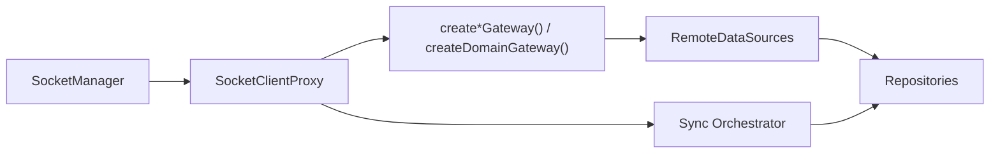

# Network Layer

Date: 2026-06-18

## 목적

`libs/data`의 네트워크 레이어는 **gateway 호출**과 **repository 캐시 반영**을 분리한다.

- outbound: `@lemoncloud/chatic-sockets-lib` gateway만 사용
- inbound sync: 앱 레벨 sync orchestrator가 `domain.sync` 신호를 해석한 뒤 repository의 `refresh*` / `cacheWrite*`를 직접 호출

즉, `RemoteDataSource`는 socket action string이나 model-event 라우팅을 알지 않는다. `RepositoryV2` 역시 socket listener를 직접 붙이지 않고, 외부 orchestrator가 넘긴 결과만 로컬 캐시에 반영한다.

## 구성



## 경계

### 1. `libs/data`

- `RemoteDataSource`는 gateway 타입만 주입받는다.
- `RepositoryV2`는 `refresh*`, `cacheWrite*`, `cacheDelete*` 계약만 제공한다.
- repository는 gateway나 socket lifecycle을 모른다.

### 2. `libs/app-runtime`

- `SocketManager`가 현재 `ClientSocketV2` 인스턴스를 소유한다.
- `SocketClientProxy`가 socket 교체를 흡수한다.
- factory가 concrete gateway와 repository를 조립한다.

## Gateway 매핑

`libs/data/src/data/remote/gateways/index.ts`에서 sockets-lib 타입을 그대로 사용하거나 `Pick<>`으로 필요한 capability만 조합한다.

`RemoteGatewayBundle`의 기존 `site` 항목은 제거되고 `place: PlaceDomainGateway`(= `PlaceGateway & Pick<UserGateway, 'mySite'>`)로 통합됐다. Site 도메인은 Place로 일원화됐으며, 물리 캐시 슬롯은 기존 `'site'`를 재사용한다(같은 엔티티).

| DataSource                | Injected gateway type                                                                                                | 실제 호출                                                                                                                                                        |
| ------------------------- | -------------------------------------------------------------------------------------------------------------------- | ---------------------------------------------------------------------------------------------------------------------------------------------------------------- |
| `AuthRemoteDataSource`    | `AuthGateway`                                                                                                        | `update()`                                                                                                                                                       |
| `ChannelRemoteDataSource` | `ChannelGateway`                                                                                                     | `mine()`, `sync()`, `update()`, `delete()`, `create()`, `invite()`, `leave()`, `getSelf()`, `unreads()`                                                          |
| `ChatRemoteDataSource`    | `ChatGateway`                                                                                                        | `send()`, `feed()`                                                                                                                                               |
| `JoinRemoteDataSource`    | `JoinGateway`(`get`/`update`) + `Pick<ChatGateway, 'read'> & Pick<ChannelGateway, 'updateJoin' \| 'join'>` (v0.3.4~) | `getJoin()`(`join.get`), `updateJoin()`(`join.update`), `updateChannelJoin()`(`channel.update-join`), `readChat()`(`chat.read`), `joinChannel()`(`channel.join`) |
| `PlaceRemoteDataSource`   | `PlaceGateway & Pick<UserGateway, 'mySite'>`                                                                         | `create()`, `get()`, `update()`, `delete()`, `mySite()` (목록)                                                                                                   |
| `UserRemoteDataSource`    | `Pick<ChannelGateway, 'listUser' \| 'syncUsers'> & Pick<UserGateway, 'update' \| 'invite' \| 'inviteBatch'>`         | `listUser()`, `syncUsers()`, `update()`, `invite()`, `inviteBatch()` — profile 관련 메서드는 ProfileGateway로 분리됨                                             |
| `DeviceRemoteDataSource`  | `DeviceGateway`                                                                                                      | `save()`, `read()`, `sync()`                                                                                                                                     |
| `CloudRemoteDataSource`   | `CloudGateway`                                                                                                       | `update()`                                                                                                                                                       |
| `ProfileRemoteDataSource` | `ProfileGateway` (sockets-lib 전용)                                                                                  | `get()`, `getMine()`, `set()`, `sync()` (= `profile.get`/`get-mine`/`set`/`sync`)                                                                                |
| `SocketsRemoteDataSource` | `Pick<DomainGateway, 'request'>`                                                                                     | `request('find-connection', payload)`                                                                                                                            |

## Deprecated gateway 이전

다음 sockets-lib 메서드는 deprecated 처리됐으며, 신규 전용 게이트웨이를 사용해야 한다.

| 기존 (deprecated)              | 이전 대상                              |
| ------------------------------ | -------------------------------------- |
| `UserGateway.makeSite()`       | `PlaceGateway.create()`                |
| `UserGateway.updateSite()`     | `PlaceGateway.update()`                |
| `UserGateway.getSiteProfile()` | `ProfileGateway.getMine()` / `get()`   |
| `UserGateway.setSiteProfile()` | `ProfileGateway.set()`                 |
| `ChannelGateway.syncProfile()` | `ProfileGateway.sync()`                |
| `ChannelGateway.updateJoin()`  | `JoinGateway.update()` (`join.update`) |

위 이전은 **완료됐다**: `SiteGateway`는 제거되고 `PlaceDomainGateway`(`PlaceGateway & Pick<UserGateway,'mySite'>`)로 통합됐으며, `ProfileGateway`는 sockets-lib 전용 타입(`get`/`getMine`/`set`/`sync`)으로 교체됐다. `UserDomainGateway`는 `Pick<ChannelGateway,'listUser'|'syncUsers'> & Pick<UserGateway,'update'|'invite'|'inviteBatch'>`로 profile/site 관련 항목이 빠졌다.

`ChannelGateway.updateJoin()` → `JoinGateway.update()` 이전은 v0.3.4 `JoinGateway`(`createJoinGateway`) 도입으로 **게이트웨이/데이터소스 레이어에서는 와이어링 완료**다(`JoinRemoteDataSource.updateJoin` = `join.update`, `updateChannelJoin` = 기존 `channel.update-join`). 다만 `JoinRepositoryV2.updateJoin` / 앱 호출부는 입력이 `{channelId, userId, notify}` 형태라 아직 `updateChannelJoin`(channel.update-join) 경로를 사용하며, 단건 id 기반 `join.update`로의 repo/앱 전환은 **작업 예정**이다. join 단건 조회(`join.get`)는 신규 도메인이고, 읽음(`chat.read`)·참여(`channel.join`)는 보조 command로 남는다.

## Factory 조립

조립 위치:

- `libs/app-runtime/src/data/factories/remoteFactory.ts`

조립 순서:

1. `SocketManager` 기반 `SocketClientProxy` 생성
2. `createAuthGateway`, `createChannelGateway`, `createChatGateway`, `createCloudGateway`, `createDeviceGateway`, `createPlaceGateway`, `createProfileGateway`, `createUserGateway`, `createJoinGateway`(v0.3.4~) 호출
3. `createDomainGateway('sockets', ...)`로 sockets domain gateway 생성
4. gateway bundle을 `createRemoteDataSources()`에 전달
5. sync runtime/orchestrator가 같은 proxy를 사용해 `domain.sync`를 구독하고 repository를 호출

## 계약 정리

- `dispatcher` 모듈은 제거됐다.
- `RemoteDataSource`는 gateway thin wrapper다.
- `RepositoryV2`의 반영 경로는 명시적 메서드 호출 하나만 사용한다.
- `chat:create` / `join:update` 같은 구형 `DomainEventBus` 자동 반영 경로는 V2 계약에서 제외됐다.

## `ClientSocketV2` 요청 제한

`RemoteDataSource` 호출자는 `ClientSocketV2`의 클라이언트 측 backpressure를 인지해야 한다.

| 항목                  | 기본값 | 비고                                              |
| --------------------- | ------ | ------------------------------------------------- |
| `maxInflightRequests` | 32     | 동시 in-flight 허용 수                            |
| `maxPendingRequests`  | 512    | in-flight 포화 시 대기 허용 수                    |
| request timeout       | 30s    | 서버 무응답 시 클라이언트 측 timeout              |
| 429 (client-side)     | —      | pending 초과 시 서버 무관하게 클라이언트가 reject |

클라이언트 측 429는 서버 HTTP 429와 다르다. `RemoteDataSource` 레벨에서 에러 타입을 구분해 sync controller에 올바른 정보를 전달해야 한다.

## 생애주기 정리

`client.destroy()`는 listener leak을 막는 teardown entry point다.

```ts
await runtime.stop();
client.destroy(); // listener 전체 해제
```

SPA unmount 또는 cloud 전환 시 반드시 호출해야 한다. `SocketClientProxy`가 socket 교체를 흡수하므로, 교체 전 이전 인스턴스에 대해서도 동일하게 적용된다.

## 검증 상태

- `libs/data` jest: 통과
- `libs/data` 타입체크: 이번 변경과 무관한 기존 오류 1건 존재
    - `libs/data/src/data/local/storages/utils.ts`
    - `CacheType`에 `profile` 키 누락
