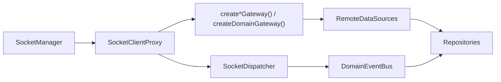

# Network Layer

Date: 2026-06-18

## 목적

`libs/data`의 네트워크 레이어는 outbound 요청과 inbound socket 이벤트를 분리한다.

- outbound: `@lemoncloud/chatic-sockets-lib`가 제공하는 gateway 타입 사용
- inbound: `ISocketClient`를 통한 `SocketDispatcher` 구독 유지

즉, `RemoteDataSource`는 더 이상 socket action string을 직접 만들지 않고 gateway 메서드만 호출한다. 반면 `SocketDispatcher`는 `model.create|update|delete` 이벤트를 계속 socket client에서 받아 domain event로 변환한다.

## 구성

## 경계

### 1. `libs/data`

- `RemoteDataSource`는 gateway 타입만 주입받는다.
- `SocketDispatcher`만 `ISocketClient`를 사용한다.
- repository는 gateway나 socket lifecycle을 모른다.

### 2. `libs/app-runtime`

- `SocketManager`가 현재 `ClientSocketV2` 인스턴스를 소유한다.
- `SocketClientProxy`가 socket 교체를 흡수한다.
- factory가 concrete gateway와 dispatcher를 조립한다.

## Gateway 매핑

`libs/data/src/data/remote/gateways/index.ts`에서 sockets-lib 타입을 그대로 사용하거나 `Pick<>`으로 필요한 capability만 조합한다.

| DataSource                | Injected gateway type                                                                                                                | 실제 호출                                                                                               |
| ------------------------- | ------------------------------------------------------------------------------------------------------------------------------------ | ------------------------------------------------------------------------------------------------------- |
| `AuthRemoteDataSource`    | `AuthGateway`                                                                                                                        | `update()`                                                                                              |
| `ChannelRemoteDataSource` | `ChannelGateway`                                                                                                                     | `mine()`, `sync()`, `update()`, `delete()`, `create()`, `invite()`, `leave()`, `getSelf()`, `unreads()` |
| `ChatRemoteDataSource`    | `ChatGateway`                                                                                                                        | `send()`, `feed()`                                                                                      |
| `JoinRemoteDataSource`    | `Pick<ChatGateway, 'read'> & Pick<ChannelGateway, 'updateJoin' \| 'join'>`                                                           | `read()`, `updateJoin()`, `join()`                                                                      |
| `SiteRemoteDataSource`    | `Pick<UserGateway, 'mySite' \| 'makeSite' \| 'updateSite'>`                                                                          | `mySite()`, `makeSite()`, `updateSite()`                                                                |
| `UserRemoteDataSource`    | `Pick<ChannelGateway, 'listUser' \| 'syncUsers' \| 'syncProfile'> & Pick<UserGateway, 'updateProfile' \| 'invite' \| 'inviteBatch'>` | `listUser()`, `syncUsers()`, `syncProfile()`, `updateProfile()`, `invite()`, `inviteBatch()`            |
| `DeviceRemoteDataSource`  | `DeviceGateway`                                                                                                                      | `save()`, `read()`, `sync()`                                                                            |
| `CloudRemoteDataSource`   | `CloudGateway`                                                                                                                       | `update()`                                                                                              |
| `ProfileRemoteDataSource` | `Pick<UserGateway, 'getSiteProfile' \| 'setSiteProfile'>`                                                                            | `getSiteProfile()`, `setSiteProfile()`                                                                  |
| `SocketsRemoteDataSource` | `Pick<DomainGateway, 'request'>`                                                                                                     | `request('find-connection', payload)`                                                                   |

## Factory 조립

조립 위치:

- `libs/app-runtime/src/data/factories/remoteFactory.ts`

조립 순서:

1. `SocketManager` 기반 `SocketClientProxy` 생성
2. `createAuthGateway`, `createChannelGateway`, `createChatGateway`, `createCloudGateway`, `createDeviceGateway`, `createUserGateway` 호출
3. `createDomainGateway('sockets', ...)`로 sockets domain gateway 생성
4. gateway bundle을 `createRemoteDataSources()`에 전달
5. 같은 proxy로 `SocketDispatcher` 생성

## Dispatcher 유지 이유

`ISocketClient`는 제거되지 않는다.

이유:

- `SocketDispatcher`가 `onType('model.create' | 'model.update' | 'model.delete')` 구독을 유지해야 한다.
- inbound 이벤트 라우팅은 gateway가 아니라 socket event source 성격이다.
- 따라서 outbound는 gateway로 치환하고, inbound는 `ISocketClient`를 유지하는 이중 경계가 현재 구조에 가장 맞다.

## 검증 상태

- `libs/data` jest: 통과
- `libs/data` 타입체크: 이번 변경과 무관한 기존 오류 1건 존재
    - `libs/data/src/data/local/storages/utils.ts`
    - `CacheType`에 `profile` 키 누락
