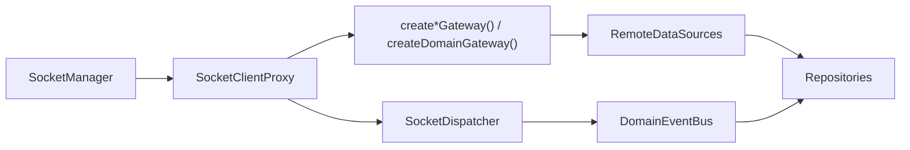

# Network Layer

Date: 2026-06-18

## 목적

`libs/data`의 네트워크 레이어는 outbound 요청과 inbound socket 이벤트를 분리한다.

- outbound: `@lemoncloud/chatic-sockets-lib`가 제공하는 gateway 타입 사용
- inbound: `ISocketClient`를 통한 `SocketDispatcher` 구독 유지

즉, `RemoteDataSource`는 더 이상 socket action string을 직접 만들지 않고 gateway 메서드만 호출한다. 반면 `SocketDispatcher`는 `model.create|update|delete` 이벤트를 계속 socket client에서 받아 domain event로 변환한다.

## 구성



## 경계

### 1. `libs/data`

- `RemoteDataSource`는 gateway 타입만 주입받는다.
- `SocketDispatcher`만 `ISocketClient`를 사용한다.
- repository는 gateway나 socket lifecycle을 모른다.

### 2. `libs/app-runtime`

- `SocketManager`가 현재 `ClientSocketV2` 인스턴스를 소유한다.
- `SocketClientProxy`가 socket 교체를 흡수한다.
- factory가 concrete gateway와 dispatcher를 조립한다.

## Gateway 매핑

`libs/data/src/data/remote/gateways/index.ts`에서 sockets-lib 타입을 그대로 사용하거나 `Pick<>`으로 필요한 capability만 조합한다.

`RemoteGatewayBundle`의 기존 `site` 항목은 제거되고 `place: PlaceDomainGateway`(= `PlaceGateway & Pick<UserGateway, 'mySite'>`)로 통합됐다. Site 도메인은 Place로 일원화됐으며, 물리 캐시 슬롯은 기존 `'site'`를 재사용한다(같은 엔티티).

| DataSource                | Injected gateway type                                                                                        | 실제 호출                                                                                                            |
| ------------------------- | ------------------------------------------------------------------------------------------------------------ | -------------------------------------------------------------------------------------------------------------------- |
| `AuthRemoteDataSource`    | `AuthGateway`                                                                                                | `update()`                                                                                                           |
| `ChannelRemoteDataSource` | `ChannelGateway`                                                                                             | `mine()`, `sync()`, `update()`, `delete()`, `create()`, `invite()`, `leave()`, `getSelf()`, `unreads()`              |
| `ChatRemoteDataSource`    | `ChatGateway`                                                                                                | `send()`, `feed()`                                                                                                   |
| `JoinRemoteDataSource`    | `Pick<ChatGateway, 'read'> & Pick<ChannelGateway, 'updateJoin' \| 'join'>`                                   | `read()`, `updateJoin()`, `join()`                                                                                   |
| `PlaceRemoteDataSource`   | `PlaceGateway & Pick<UserGateway, 'mySite'>`                                                                 | `create()`, `get()`, `update()`, `delete()`, `mySite()` (목록)                                                       |
| `UserRemoteDataSource`    | `Pick<ChannelGateway, 'listUser' \| 'syncUsers'> & Pick<UserGateway, 'update' \| 'invite' \| 'inviteBatch'>` | `listUser()`, `syncUsers()`, `update()`, `invite()`, `inviteBatch()` — profile 관련 메서드는 ProfileGateway로 분리됨 |
| `DeviceRemoteDataSource`  | `DeviceGateway`                                                                                              | `save()`, `read()`, `sync()`                                                                                         |
| `CloudRemoteDataSource`   | `CloudGateway`                                                                                               | `create()`, `get()`, `update()`, `delete()`                                                                          |
| `ProfileRemoteDataSource` | `ProfileGateway` (sockets-lib 전용)                                                                          | `get()`, `getMine()`, `set()`, `sync()` (= `profile.get`/`get-mine`/`set`/`sync`)                                    |
| `SocketsRemoteDataSource` | `Pick<DomainGateway, 'request'>`                                                                             | `request('find-connection', payload)`                                                                                |

## Deprecated gateway 이전

다음 sockets-lib 메서드는 deprecated 처리됐으며, 신규 전용 게이트웨이를 사용해야 한다.

| 기존 (deprecated)              | 이전 대상                            |
| ------------------------------ | ------------------------------------ |
| `UserGateway.makeSite()`       | `PlaceGateway.create()`              |
| `UserGateway.updateSite()`     | `PlaceGateway.update()`              |
| `UserGateway.getSiteProfile()` | `ProfileGateway.getMine()` / `get()` |
| `UserGateway.setSiteProfile()` | `ProfileGateway.set()`               |
| `ChannelGateway.syncProfile()` | `ProfileGateway.sync()`              |

위 이전은 **완료됐다**: `SiteGateway`는 제거되고 `PlaceDomainGateway`(`PlaceGateway & Pick<UserGateway,'mySite'>`)로 통합됐으며, `ProfileGateway`는 sockets-lib 전용 타입(`get`/`getMine`/`set`/`sync`)으로 교체됐다. `UserDomainGateway`는 `Pick<ChannelGateway,'listUser'|'syncUsers'> & Pick<UserGateway,'update'|'invite'|'inviteBatch'>`로 profile/site 관련 항목이 빠졌다.

## Factory 조립

조립 위치:

- `libs/app-runtime/src/data/factories/remoteFactory.ts`

조립 순서:

1. `SocketManager` 기반 `SocketClientProxy` 생성
2. `createAuthGateway`, `createChannelGateway`, `createChatGateway`, `createCloudGateway`, `createDeviceGateway`, `createPlaceGateway`, `createProfileGateway`, `createUserGateway` 호출
3. `createDomainGateway('sockets', ...)`로 sockets domain gateway 생성
4. gateway bundle을 `createRemoteDataSources()`에 전달
5. 같은 proxy로 `SocketDispatcher` 생성

## Dispatcher 유지 이유

`ISocketClient`는 제거되지 않는다.

이유:

- `SocketDispatcher`가 `onType('model.create' | 'model.update' | 'model.delete')` 구독을 유지해야 한다.
- inbound 이벤트 라우팅은 gateway가 아니라 socket event source 성격이다.
- 따라서 outbound는 gateway로 치환하고, inbound는 `ISocketClient`를 유지하는 이중 경계가 현재 구조에 가장 맞다.

## `ClientSocketV2` 요청 제한

`RemoteDataSource` 호출자는 `ClientSocketV2`의 클라이언트 측 backpressure를 인지해야 한다.

| 항목                  | 기본값 | 비고                                              |
| --------------------- | ------ | ------------------------------------------------- |
| `maxInflightRequests` | 32     | 동시 in-flight 허용 수                            |
| `maxPendingRequests`  | 512    | in-flight 포화 시 대기 허용 수                    |
| request timeout       | 30s    | 서버 무응답 시 클라이언트 측 timeout              |
| 429 (client-side)     | —      | pending 초과 시 서버 무관하게 클라이언트가 reject |

클라이언트 측 429는 서버 HTTP 429와 다르다. `RemoteDataSource` 레벨에서 에러 타입을 구분해 sync controller에 올바른 정보를 전달해야 한다.

## 생애주기 정리

`client.destroy()`는 listener leak을 막는 teardown entry point다.

```ts
await runtime.stop();
client.destroy(); // listener 전체 해제
```

SPA unmount 또는 cloud 전환 시 반드시 호출해야 한다. `SocketClientProxy`가 socket 교체를 흡수하므로, 교체 전 이전 인스턴스에 대해서도 동일하게 적용된다.

## 검증 상태

- `libs/data` jest: 통과
- `libs/data` 타입체크: 이번 변경과 무관한 기존 오류 1건 존재
    - `libs/data/src/data/local/storages/utils.ts`
    - `CacheType`에 `profile` 키 누락
