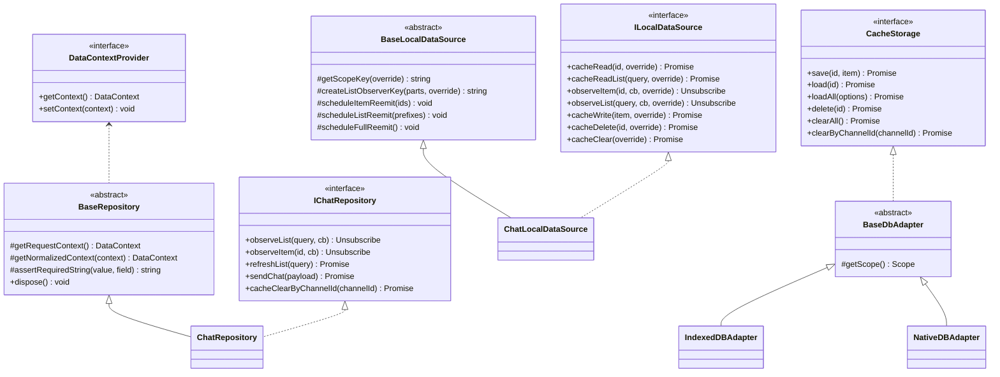

# repositories — the data facade

> Status: Live · Last updated: 2026-09-14 · Overview in the [lib README](../../README.md) · Canonical code: [repositories/index.ts](../../src/repositories/index.ts) · [repositories/types.ts](../../src/repositories/types.ts)

A repository bundles a remote data source and a local data source and exposes them to the app as a
**data facade**. It is also the layer that interprets server-side changes into a local read-model.

There is one core goal.

- Reads always come from local
- Remote is a side-effect command
- Hooks see only streams

`BaseRepository` and `DataContext` both live in `types.ts`; there is no `BaseRepository.ts`.

## Three contracts

The UI layer sees only two of them.

1. **Read streams** — subscribing via `observeList` / `observeItem`
2. **Write commands** — `sendChat`, `createPlace`, `updateProfile` and the like, reflecting user intent

The third, `refresh*` / `cache*`, is not a UI contract; it is the sync path.

| API group                                    | Called by                      | Examples                                         |
| -------------------------------------------- | ------------------------------ | ------------------------------------------------ |
| `observe*`                                   | UI hook                        | `observeList(query, cb)`                         |
| write command                                | UI action                      | `sendChat()`, `createPlace()`, `updateProfile()` |
| `refresh*` / `syncChannels` / `syncProfiles` | the external sync orchestrator | `refreshList()`, `syncChannels(since)`           |
| `cache*`                                     | sync orchestrator / tests      | `cacheWrite(item)`, `cacheClear()`               |

A UI calling `refresh*` directly can collide with sync timing. Where it is necessary, keep it to a
user-event path.

## What `BaseRepository` provides

`BaseRepository` uses no event bus and no cachePolicy. It provides only what is commonly needed.

- `getRequestContext()` — captures a snapshot of the context at call time. **Because the request-time and response-time contexts can differ, the context has to be captured before a remote response is written.**
- `getNormalizedContext()` — normalizes a missing `cid` to `'default'`.
- `assertRequiredString` — validates a required identifier.
- `dispose()` — the factory routes every repository's cleanup here. There is nothing to release at the base level today; it is the seat for a subclass that holds a resource.

## Context and scope

`DataContext` is `cid` (the connected cloud) and `uid` (the current user) — the cache scope. A
repository does not hold the context; it reads the current value through a `DataContextProvider` on
every call (`DataContextHolder`). So a cloud switch requires no rebuild, and `withContext(snapshot)`
can produce a copy pinned to a specific context.

`sid` is **not** ambient (ADR-0085). The field exists on `DataContext`, but nothing seeds it: a
repository that needs a place takes it as an argument (`setMyProfile(body, siteId)`,
`syncProfiles(since, siteId)`, `createChannel(payload, siteId)`, `getSelfChannel(payload, siteId)`,
`refreshList({ sid })`) and puts it on the context it hands down. It has to travel that way because
`profile.sync`, `channel.mine` and `channel.get-self` return rows carrying no place of their own —
the caller's value is the only thing that can tag them.

## The core contract

Only `CacheStorage` belongs to this lib — it is an interface `ports/` declares. The three adapters below
it are owned by `@chatic/db`, and which domain gets which adapter is decided by `libs/app-runtime`.

## Repository wiring

`createRepositories` in `repositories/index.ts` is the single assembly point. Some repositories
have no local source and some have no socket source.

| Repository     | socket | local                     | http           |
| -------------- | ------ | ------------------------- | -------------- |
| `auth`         | ✓      | —                         | `auth`         |
| `channel`      | ✓      | `channel` + `chat`        | —              |
| `chat`         | ✓      | `chat`                    | —              |
| `cloud`        | ✓      | `cloud`                   | `cloud`        |
| `device`       | ✓      | —                         | `user`         |
| `invite`       | ✓      | `invite`                  | —              |
| `join`         | ✓      | `join`                    | —              |
| `place`        | ✓      | `place`                   | —              |
| `profile`      | ✓      | `profile`                 | —              |
| `report`       | —      | —                         | `report`       |
| `subscription` | —      | —                         | `subscription` |
| `user`         | ✓      | `user` + `join` + `place` | `user`         |
| `syncMeta`     | —      | `syncMeta`                | —              |

- `auth` and `device` are remote-only surfaces with nothing to cache (session identity commands, lookup signals).
- `report` and `subscription` are remote-only **and** HTTP-only — they do not even have a socket data source.
- `channel` also takes the `chat` local source because leaving has to empty that room's messages, not just the channel row (ADR-0067).
- `user` takes the `join` and `place` local sources because assembling invite candidates reads all three caches together.

## HTTP injection is optional

`httpDataSources` is an optional argument to `createRepositories` (`httpDataSources?`). Calling one of
those methods without it throws an explicit error. The ADR-0036 track document announced "promote to
required after stage 4", but that promotion never happened. As it stands it is optional.

## The 13 domains

The per-domain method catalogue is split out into [domains.md](./domains.md) — 13 domains over 132 lines
made both harder to read when wedged between the shared rules.

## Chat cursors

Chat is cursor-based, so two responsibilities are kept apart.

- **Detecting the newest message** goes by `channel`'s `chatNo` — comparing the `chatNo` that channel sync provided against the local max `chatNo`.
- **Paginating to earlier pages** goes by `chat.feed`'s `cursorNo`.

They are not the same value. `cursorNo` is a query discriminator for fetching an older page, not a
baseline for the latest sync.

## Cache clear rules

- `cacheClear()` clears within the current repository scope (it is not a global clear).
- `ChatRepository` additionally provides `cacheClearByChannelId(channelId)`.
- Logout, cloud switch and test setup each have to decide their clear scope explicitly.
- **Deleting chat cannot be undone.** Other domains can be refilled by the server if wrongly cleared, but the message feed is windowed by `join.joinedNo`, and the server will not hand back anything before it. So chat deletion is attached to explicit signals only, never to inference → below.

How storage carries that request out is in
[the three paths for a channel-scoped delete](../local/README.md#three-paths-for-a-channel-scoped-delete).

## Leaving and rejoining

Rejoining should look like joining for the first time. The server resets the join cursor on rejoin and
windows the feed by `chatNo > joinedNo`, but **the client renders the local chat cache, not the server
response.** Leaving does not remove that room's message rows (the chat sync plan has no `onRemove` — the
history is kept for lazy-load and offline), so two mechanisms are needed together. The reasoning is in
ADR-0067.

**① The display gate — `isInJoinWindow(chat, joinedNo)`** (`src/domain/joinWindow.ts`)

It applies the server's own rule (`chatNo > joinedNo`) at the place the cache is read. Two exceptions
carry meaning:

- When `joinedNo` is absent, nothing is hidden. Rows were written before the server shipped this field, and guessing at a missing value would erase perfectly good history.
- When `chatNo` is falsy, the row passes. An optimistic send has `chatNo: 0` until the server numbers it, and without this exception **the message you just sent would disappear.**

Three consumers use it in apps/web: the room feed, the home preview, and global search. This gate is not
a duplicate of ② — it is the retroactive line of defence covering what ② cannot reach (installs that
already built up a cache, being kicked, leaving from another device).

In the room feed it is applied **where `useChats` receives the cache, not just before render.** Gating
only the display list would give the same hook's `rawChats` (reaction folding, thread assembly, "has row
1 loaded?") a different boundary, and then a row 1 left in the cache from before leaving makes the
**"start of conversation" block appear only to someone who rejoined midway** — and not to the person
invited from the beginning. The paging cursor must not grab a `chatNo` from before the join for the same
reason.

**② Purge — on explicit signals only**

| Signal                     | Where                                         |
| -------------------------- | --------------------------------------------- |
| A successful self-leave    | `ChannelRepository.leaveChannel`              |
| Removal of my own join row | the join sync plan's `onRemove` (app-runtime) |

It is **not** attached to `ChannelSyncPlan.onRemove` or to `syncChannels`' stale prune. One misjudgement
by inference-based cleanup becomes unrecoverable history loss.

Purging is not optimistic — it happens after the server confirms, and a failure still lets the leave
succeed. Reporting a departure that already happened as a failure is the bigger lie, and ① hides
whatever rows remain.

## Notes for implementers and tests

- Capture the request-time context before writing a remote response (`getRequestContext`). A response arriving late during a cloud switch must not poison the current scope.
- Never fall back to the context for a `sid` a caller did not give. That fallback is what tagged writes for the wrong place during a site switch (ADR-0085); ask the caller instead.
- For `chat.feed`, merging matters more than overwriting.
- If a path remains where a hook renders a remote return list directly, it breaks this lib's goal.
- HTTP injection (`httpDataSources`) is optional. Calling an HTTP method without it throws an explicit error.

## Further reading

- [socket sync usage](../../../app-runtime/docs/sync/README.md) — the path by which a join row's removal becomes a purge signal (owned by app-runtime).
