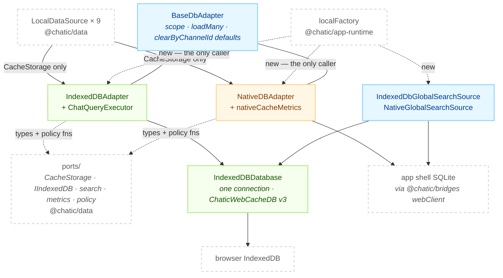
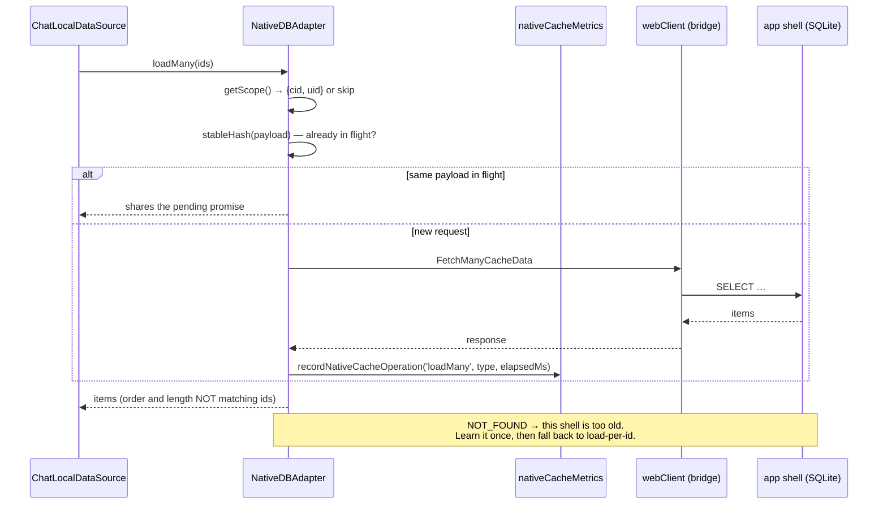

# @chatic/db

**The storage engine behind the cache.** It holds the two `CacheStorage` implementations an app can
be given — browser IndexedDB and the native shell's SQLite over a WebView bridge — plus the physical
IndexedDB connection, the chat paging executor, the two cross-cloud search sources and the native
call instrumentation.

Every interface in that list is declared by `@chatic/data`, not here. This lib is the half that knows
how bytes actually land.

## Purpose

`@chatic/data` says what a cache is; this lib says where it lives. It implements five ports that
`libs/data/src/local/ports/` owns — `CacheStorage<TType>`, `IIndexedDB`, `IndexedDbQueryExecutor`,
`IGlobalCacheSearchSource` and `ICacheMetricsSource` — and exports nothing else of consequence.

The reach is one file. Exactly one place outside this lib imports `@chatic/db` at all, and nothing
imports past the barrel:

```bash
grep -rn "@chatic/db" --include='*.ts' --include='*.tsx' apps libs | grep -v node_modules
```

That single importer is `localFactory` in `libs/app-runtime`. Screens, repositories and data sources
see a `CacheStorage` and never learn which engine answered.

This lib **does not decide which engine a domain gets.** That is `resolveCacheBackend` in
`libs/app-runtime/src/data/cacheStorageRouting.ts` — an app policy about the installed shell, not a
storage concern. An engine that knew the conditions of its own selection would be the wrong shape.

It also does not own the TTL and scope policy it calls. `resolveScopedContext`, `createTtlMeta`,
`withCacheMeta` and `stableHash` stay in `@chatic/data` because they are domain rules, and the engine
imports them as runtime functions.

## Design principles

1. **The port belongs to the consumer; the implementation belongs here.** All five interfaces live in
   `@chatic/data`. Plugging a different engine in — React Native, a memory store for a test — is an
   `@chatic/db` change and nothing else.
2. **An engine class is constructed in one place.** `localFactory` calls `new` on everything here;
   every other consumer holds an interface. A screen or a repository that imports a class from this
   barrel has broken the rule, and the grep above is how you see it.
3. **The dependency runs one way.** `db → data` and `db → bridges`. `@chatic/data` does not know this
   package exists, so there is no cycle. The arrow into `data` is types **plus pure policy
   functions**, not type-only — the engine calls domain policy rather than reimplementing it.
4. **Scope is read at call time, from the provider the adapter was handed.** Every operation asks
   its `DataContextProvider` for `(cid, uid)`; the adapter never caches the answer. Which scope
   that provider reports is the assembler's choice, not the adapter's: `@chatic/data` hands each
   adapter a provider fixed to one partition and keeps one adapter per partition, so an operation
   captured for cloud A reaches A's adapter even after the session has switched (ADR-0112).
5. **No session means no scope, and no scope means no operation.** `getScope()` returns `null` when
   there is no `uid`; reads answer empty and writes do nothing. It never substitutes a placeholder —
   a `'default'` uid once sent every read and write to a ghost partition that nobody read back. The
   skip is logged once per adapter, because silently writing elsewhere and silently writing nothing
   are equally hard to debug.
6. **On native, one call is one bridge round trip.** Which method a caller picks _is_ the
   performance. `loadMany` exists for exactly this reason.
7. **The web deploys before the app shell.** A bridge message the installed shell does not implement
   comes back `NOT_FOUND`. The adapter learns that once, at module scope, and takes the fallback from
   then on — it does not wait for a handshake capability report, which arrives after the adapters are
   already built.

## Scope

**In** — scope resolution and the shared default implementations (`BaseDbAdapter`); the physical
IndexedDB connection and schema (`IndexedDBDatabase`); the web `CacheStorage` with its per-channel cap
and quota recovery (`IndexedDBAdapter`); chat paging (`ChatQueryExecutor`); the bridge `CacheStorage`
with in-flight read sharing, batch reads and three learned fallbacks (`NativeDBAdapter`); native call
instrumentation (`nativeCacheMetrics`); two `IGlobalCacheSearchSource` implementations.

**Out** — the port interfaces and the TTL/scope policy (`@chatic/data`, `local/ports/`); stream
emission, observer keys and merge semantics on top of a storage (`@chatic/data`, `local/data-sources/`);
which backend a type is routed to (`@chatic/app-runtime`, `resolveCacheBackend`); the SQLite
implementation on the far side of the bridge (`apps/mobile`); the bridge transport itself
(`@chatic/bridges`).

## Structure



Nothing in this lib calls back into a repository or a data source. The arrow into `@chatic/data`
carries types and four pure functions, and that is the whole of it.

### A native read

The path worth drawing is the bridge one, because three separate mechanisms meet on it — request
sharing, instrumentation and the version fallback.



### Directories

```text
libs/db/src/
├── index.ts          public barrel — 17 values, 3 types
├── base/             BaseDbAdapter: scope resolution + the defaults both adapters inherit
├── indexeddb/        the web store — IndexedDBDatabase, IndexedDBAdapter, ChatQueryExecutor
├── native/           the bridge store — NativeDBAdapter, nativeCacheMetrics
└── search/           IGlobalCacheSearchSource × 2, plus the contract test that pins them together
```

Nine production files, eight spec files. Several names are not where the filename suggests:

- `isQuotaExceededError` sits in `IndexedDBAdapter.ts`, its only consumer — a `DOMException` predicate
  kept out of `@chatic/data` so that lib does not take a DOM dependency.
- `TYPE_CID_UID_INDEX`, `CHAT_PAGINATION_INDEX` and `UNSENT_CHAT_NO` are in `IndexedDBDatabase.ts`.
- `NativeCacheMetricsSource`, the `ICacheMetricsSource` implementation, is in `nativeCacheMetrics.ts`.
- The three `resetNative*Support` test seams sit beside the module flags they clear, in
  `NativeDBAdapter.ts`.
- **There is no `types.ts`.** Every type this lib implements against comes from `@chatic/data`.

The barrel is wider than its use: of its 20 exports, `localFactory` imports 7 — `ChatQueryExecutor`,
`IndexedDBAdapter`, `IndexedDBDatabase`, `IndexedDbGlobalSearchSource`, `NativeCacheMetricsSource`,
`NativeDBAdapter`, `NativeGlobalSearchSource`. The other 13 have no consumer outside this lib. One
asymmetry to know before you reach for it: `resetNativeBatchReadSupport` and
`resetNativeLastChatsSupport` are on the barrel, `resetNativeClearByChannelSupport` is not, and the
specs reach all three by relative import anyway.

## The web store

One database, one object store, one connection for the whole app.

| Thing                         | Value                                                                               |
| ----------------------------- | ----------------------------------------------------------------------------------- |
| Database                      | `ChaticWebCacheDB`, version 3                                                       |
| Object store                  | `cache_store`, `keyPath: 'key'`                                                     |
| Primary key                   | `` `${type}:${cid}:${uid}:${id}` ``                                                 |
| Index `type_cid_uid`          | `['type', 'cid', 'uid']` — every ordinary read and `clearAll`                       |
| Index `chat_pagination_index` | `['type', 'cid', 'uid', 'channel_id', 'chat_no']` — paging, eviction, channel clear |

`channel_id` and `chat_no` are written on chat rows only, so the pagination index holds chat and
nothing else. That is why `IndexedDBAdapter.clearByChannelId` — which deletes by a range on that
index — is effectively chat-only. Chat is also the only domain that calls it.

`IndexedDBDatabase` reopens itself on `close` (the browser forced it shut) and on `versionchange`
(another tab is upgrading). Both log, because silently they looked like an unrelated burst of cache
errors.

**Chat paging** is delegated to `ChatQueryExecutor`, the one `IndexedDbQueryExecutor` that exists. A
page is a reverse cursor walk (`direction: 'prev'`) over the pagination index, bounded above by
`cursorNo`. Unsent rows carry `chat_no: 0` (`UNSENT_CHAT_NO`) and therefore sort **lowest**, so in a
channel with more than a page of committed messages they fall off the end and never render — no
"failed to send" marker, no retry button. `includeUnsent` opts into a second read of the `[0, 1)`
range to pull them back. The two reads are issued **in parallel**, not sequentially: whether the page
truncated the unsent rows cannot be known before the page arrives, and the test for it cannot tell
"truncated" from "none exist", so the second read would go out on most calls anyway. Fired together,
its latency hides behind the first. Only `apps/desktop-web`'s `useChats` opts in today.

**The channel cap** (`maxChatsPerChannel`) is per-adapter and off by default. Over the cap, the oldest
rows in a channel are evicted down to it. The boundary is computed as an **absolute index key** —
`findNewestKeyBeyond` skips the newest N and returns the key after them — rather than by counting and
then re-reading, because a concurrent delete between those two steps would shift a count-derived
boundary upward and take still-visible messages with it. Unsent rows are excluded from the evictable
range entirely.

`QuotaExceededError` is recovered once, and only when there is something to evict: the adapter
enforces the caps and retries the write. With no cap configured there is no room to make, so the error
is logged and rethrown — the write is lost. Today only `apps/desktop-web` sets a cap (1000), which
means the plain-browser and native-WebView paths have no safety net here.

## The native store

`NativeDBAdapter` sends ten message types, listed in `OPERATION_BY_MESSAGE`: `SaveCacheData`,
`SaveAllCacheData`, `FetchCacheData`, `FetchManyCacheData`, `FetchAllCacheData`, `FetchLastChatsData`,
`DeleteCacheData`, `DeleteAllCacheData`, `ClearCacheData`, `ClearCacheDataByChannel`.

Every one of them goes through a single `send()`, which is where the elapsed time is recorded — add a
new operation and the instrumentation follows for free, call `bridge.request` directly and it does
not. The timing is taken in a `finally`, so failures count too: a timeout is the slowest call there
is, and dropping it makes the distribution look better than it is.

**Reads share flight.** `sendRead` keys the pending promise by `stableHash(message)`, so two callers
issuing a byte-identical payload at the same moment get one round trip. This is not a cache — the
entry is deleted the moment the promise settles, and failures are shared too. It is needed
independently of observer grouping because different logical keys often produce the same physical
query: the `cacheReadList` of `user`, `channel`, `profile` and `place` reads the whole table with a
bare `loadAll()` and filters in JS, so two subscribers with different observer keys emit byte-identical
requests. Writes are never shared; folding two writes would tell the second caller its write
landed when it did not.

**Read many with `loadMany`.** The base implementation calls `load` per id, which on the bridge is N
round trips — merging a 50-message page once cost 51. `loadMany` folds it into one
`FetchManyCacheData`. **It guarantees neither the length nor the order of its result**; missing ids are
simply absent. Re-index by id (`BaseLocalDataSource.indexById`). Pairing by position shifts every item
after the first cache miss onto a stranger's row.

**Three learned fallbacks**, each a module-scoped boolean set by one `NOT_FOUND`:

| Message                   | Flag                        | What happens instead                                            |
| ------------------------- | --------------------------- | --------------------------------------------------------------- |
| `FetchManyCacheData`      | `batchReadUnsupported`      | `super.loadMany` — one read per id                              |
| `FetchLastChatsData`      | `lastChatsUnsupported`      | returns `null`; the caller does a per-channel windowed read     |
| `ClearCacheDataByChannel` | `clearByChannelUnsupported` | `super.clearByChannelId` — read the channel's rows, delete them |

Module scope is deliberate: one app is installed, so there is nothing to learn per domain, and
adapters are built per type and per partition — an instance-scoped flag would learn the same fact
once for every adapter. Only
`NOT_FOUND` triggers a fallback; a timeout or a storage error is rethrown, because hiding those behind
a fallback doubles the round trips and buries the cause.

Delete is treated differently from read throughout. A read that cannot run returns empty and the
caller moves on; a delete that cannot run has to actually happen, so `clearByChannelId` descends into
the base path and finishes the job. The base path narrows its read by `channelId` for the two domains
whose query declares it (`chat`, `join`), so clearing one room does not drag the whole table across
the bridge.

**Instrumentation.** `nativeCacheMetrics` keeps per-`(operation, type)` count, total and max, plus a
running op count. A single call over 50ms logs a warning, throttled to one line per key per 3s — the
throttle is not cosmetic: native logs travel over the same bridge, so under congestion every call
crosses the threshold and the instrumentation would amplify the stall it is measuring. A cumulative
summary lands every 100 operations, so frequency is visible even when nothing is slow. Cumulative
totals live in module state, which means `NativeCacheMetricsSource` instances all read the same
numbers and any `reset()` is global.

## Global cache search

Both implementations satisfy `IGlobalCacheSearchSource` with two methods. `search` is cross-cloud;
`resolveContext` fills in the channel, site, join and last-chat rows a result needs around it.

- `IndexedDbGlobalSearchSource` scans `type_cid_uid` with only `type` bound, leaving `cid` open, so
  one pass covers every cached cloud partition. `resolveContext` is addressed instead — exact
  `[type, cid, uid]` hits per cloud, plus one reverse cursor per channel for the newest message.
- `NativeGlobalSearchSource` delegates to the shell: `SearchGlobalCacheData` for search (SQLite
  `LIKE`), `FetchAllCacheData` with an explicit `cid` for context. It costs `3 × clouds + channelRefs`
  round trips, issued in parallel. A failed sub-request contributes an empty list rather than
  rejecting — a missing channel name should degrade one row, not blank the results the user is
  already reading.

Two rules hold in both implementations, and each is checked twice on purpose. A preview never shows an unsent row
(`chat_no`/`chatNo` of 0 is filtered out), because the server has not accepted that message. And a
join row is matched on `userId`, not on the row's `uid`: `uid` is the _cache owner_, and other members'
join rows are cached in my partition too for read receipts — keyed by `channelId` alone the map would
end up holding whichever member was written last, and unread counts would be computed against a
stranger's read cursor.

`globalCacheSearch.contract.test.ts` runs one fixture set and one expectation table against both
implementations. A semantic change made to one and not the other fails there.

## Usage

**Do not import this lib.** The entry point is a `CacheStorage` handed to you by `@chatic/app-runtime`;
the classes here are constructor arguments for one factory, not an API.

```ts
// libs/app-runtime/src/data/factories/localFactory.ts — the only importer in the repo
import { ChatQueryExecutor, IndexedDBAdapter, IndexedDBDatabase, NativeDBAdapter } from '@chatic/db';

export const getCacheStorage = <TType extends CacheType>(
    type: TType,
    contextProvider: DataContextProvider,
    cache?: CacheAssemblyOptions
): CacheStorage<TType> =>
    resolveCacheBackend(type) === 'web'
        ? createIndexedDBAdapter(type, contextProvider, cache?.maxChatsPerChannel)
        : new NativeDBAdapter(webClient, type, contextProvider);
```

The `contextProvider` is required, not optional: it is what makes principle 4 work. In production the
provider an adapter receives is a snapshot of one scope — `createCacheStorages` in `@chatic/data`
builds one adapter per partition on first use — so "frozen to one cloud" is the intent, not a hazard:
the partition an operation touches is the one it was captured for, not whichever is current.

### Wiring

```text
DataManager                                  @chatic/app-runtime
  └─ createLocalDataSources()                data/factories/localFactory.ts
       ├─ resolveCacheBackend(type)          'web' | 'native' — the routing decision, made elsewhere
       ├─ getCacheStorage(type, provider)    new IndexedDBAdapter(sharedDb, …) | new NativeDBAdapter(webClient, …)
       │    └─ getSharedDatabase()           one IndexedDBDatabase, shared by every web-backed adapter
       ├─ getGlobalCacheSearchSource()       IndexedDbGlobalSearchSource | NativeGlobalSearchSource
       └─ getCacheMetricsSource()            NativeCacheMetricsSource
```

The shared `IndexedDBDatabase` is module state in the **factory**, not in this lib. Moving it here
would break the rule that instance binding happens in one place, and two connections to the same
database is a real failure, not a style question.

Nine domains get a storage: `channel`, `chat`, `invitecloud`, `invite`, `join`, `profile`, `site`,
`user`, `meta`. The chat cap rides along on every call and is ignored by every non-chat type.

## Scenarios

### 1. Reading a page of messages on the web

`ChatLocalDataSource` calls `loadAll({ channelId, limit, cursorNo })`. `IndexedDBAdapter` resolves the
scope, sees an executor configured, and hands off to `ChatQueryExecutor`, which walks
`chat_pagination_index` backwards from `cursorNo`. With `includeUnsent` it also reads `[0, 1)` in
parallel and merges by key. Rows come back as `row.data` — the meta wrapper never leaves the adapter.

### 2. Merging fifty messages on native

The data source reads the existing rows before merging. On native that is one `FetchManyCacheData`,
not fifty `FetchCacheData` — and if two subscribers ask for the same payload at once, one round trip
serves both. Missing ids are absent from the result, so the caller re-indexes by id before pairing.

### 3. The browser refuses a write

`save`/`saveAll` throws `QuotaExceededError`. If this adapter has a channel cap and the write touched
cappable rows, it evicts down to the cap and retries once, logging whether the retry worked — the user
sees nothing, but old messages are gone. With no cap the error is logged and rethrown and the write is
lost, which is the state of every build except `apps/desktop-web`.

### 4. Leaving a room

`ChatLocalDataSource.clearByChannelId` is the one production caller. On native it is a single
`ClearCacheDataByChannel` — one round trip, empty payload. On a shell too old to know that message the
adapter learns it once and falls back to reading the channel's rows and deleting them by id. On web it
is a range delete on the pagination index.

### 5. Searching across clouds

`useGlobalCacheSearch` holds an `IGlobalCacheSearchSource` and never learns which one. On native the
search goes to SQLite, because there the shell is the source of truth and the WebView's IndexedDB
holds only the pinned exceptions. The contract test is what keeps the two answers the same.

### 6. Switching clouds, or logging out

Nothing here is rebuilt. `@chatic/data` asks its slot for the new scope's adapter, which is built on
first use with a provider fixed to that scope; an operation captured for the old scope keeps the old
adapter, so its late answer still lands where it was asked from. On logout `uid` goes empty, that
scope's adapter has no scope, `getScope()` returns `null`, and every operation is skipped with one
warning per adapter — reads answer empty, writes do nothing, and no ghost partition is created.
`invitecloud` is the exception: it is pinned to a fixed `global`/`global` scope, because an invite link
can be opened before there is a session at all.

## Notes

**TTL metadata is written and never enforced here.** `withCacheMeta` stamps `lastSyncedAt`,
`expiresAt` and `lastAccessedAt` onto every cached item, and `IndexedDBAdapter` additionally stores a
`meta` column on the row. **No adapter checks expiry and none evicts on it.** The only reader of
expiry anywhere is `SyncMetaLocalDataSource`, and it ignores the stored `expiresAt` in favour of
recomputing from `lastSyncedAt` against the current policy. So `expiresAt` today is a record, not a
behaviour — anything that needs TTL enforcement has to build the judgement point first.

**`saveAll` silently drops items with no `id`.** It logs the count, because otherwise the caller is
told the batch saved and one row simply is not there. The items themselves are not logged; they are
domain content.

## How to verify

```bash
npx tsc -b libs/db/tsconfig.json --force      # the lib and the tests, via project references
npx jest --config libs/db/jest.config.js      # every spec in the lib
```

- Type checking must be `tsc -b`. Inside `libs/db`, `tsc --noEmit` checks zero files and succeeds, so
  passing it proves nothing.
- **`tsconfig.json` references both sub-projects on purpose.** Jest does not type check — the base
  sets `isolatedModules` and ts-jest transpiles — so without the spec reference a mock that has
  drifted from the class it imitates surfaces only as `… is not a function` at runtime, if at all.
  `nx typecheck @chatic/db` builds `./tsconfig.json` with no argument, which is how CI picks the
  specs up.
- `tsconfig.spec.json` must not set `module: "commonjs"`. The base sets `moduleResolution: bundler`,
  which rejects it with TS5095 and makes the config uncompilable. Its `references` must mirror
  `tsconfig.lib.json` exactly, or composite dependencies arrive as unlisted files (TS6307).
- The IndexedDB specs run on `fake-indexeddb/auto` under jsdom, and each of them polyfills
  `structuredClone`, which jsdom does not provide. A failure in only the native half of
  `globalCacheSearch.contract.test.ts` usually means a bridge payload shape changed, not that the
  search logic broke.
- **This lib keeps module state, and a spec that does not clear it leaks into the next one.** The
  metrics totals need `resetNativeCacheMetrics()`, and each learned fallback flag needs its own seam
  (`resetNativeBatchReadSupport`, `resetNativeLastChatsSupport`, `resetNativeClearByChannelSupport`)
  — one `NOT_FOUND` in an earlier test otherwise silently changes which path a later one exercises.
- A stale `dist`/`out-tsc` produces phantom errors after a directory moves. Force-delete both
  (`rm -rf libs/db/dist libs/db/out-tsc`) and look again.
- Downstream: `@chatic/app-runtime` is the only direct dependent; through it a changed barrel
  identifier reaches `web`, `desktop-web`, `admin-v2` and `testbed`. `.github/workflows/verify.yml`
  type checks `@chatic/app-runtime`, `admin-v2` and `testbed`, and excludes `web` and `desktop-web` —
  those two are the ones to run by hand. `desktop-web` carries a long-standing 21-error baseline, so
  compare against it rather than expecting zero.
