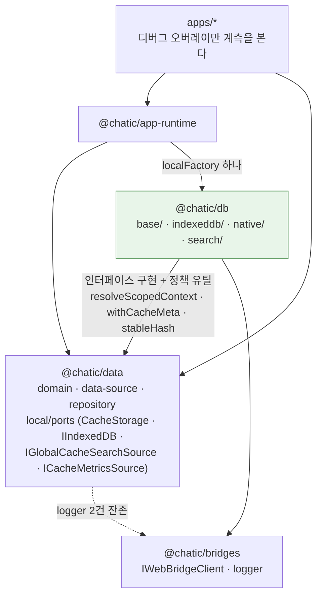
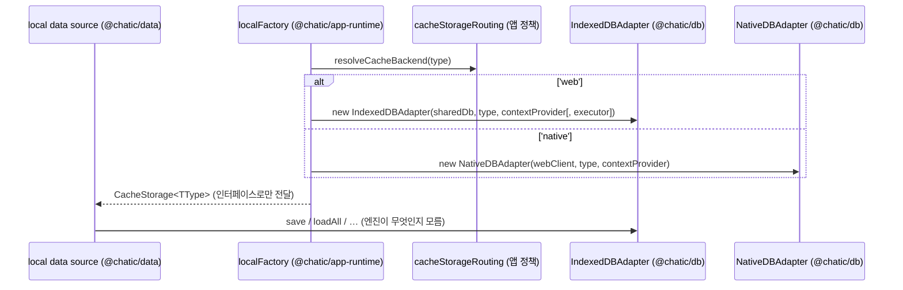

# @chatic/db — 저장 엔진 lib

> 상태: Live · 최종 갱신: 2026-09-09 · 관련 ADR: [ADR-0070](../../../docs/adr/0070-app-runtime-session-hub.md) (결정 5 — 이 lib의 분리), [ADR-0057](../../../docs/adr/0057-home-last-chat-preview-single-query.md) (`loadLastPerChannel`), [ADR-0067](../../../docs/adr/0067-rejoin-hides-prior-messages.md) (채널 한정 삭제)

## 목적

저장 엔진의 전부를 소유한다 — IndexedDB 물리 계층(`IndexedDBDatabase`), 웹 캐시 어댑터
(`IndexedDBAdapter` + `ChatQueryExecutor`), 네이티브 SQLite 브릿지 어댑터(`NativeDBAdapter`),
전역 캐시 검색 구현 2종, 네이티브 캐시 계측(`nativeCacheMetrics`).

소켓 축의 `@lemoncloud/chatic-sockets-lib`, HTTP 축의
[`@chatic/http`](../../http/docs/architecture.md)와 같은 자리다. **실제 IO는 엔진 lib이 알고,
`@chatic/data`는 자기가 소유한 인터페이스로만 저장을 안다.**

## 설계 원칙

1. **인터페이스는 소비자가, 구현은 이 lib이 소유한다.** `CacheStorage` · `IIndexedDB` ·
   `IGlobalCacheSearchSource` · `ICacheMetricsSource`는 모두 `@chatic/data`의 `local/ports`에
   있고, 이 lib은 그 구현일 뿐이다. 다른 엔진을 꽂아도 `data`는 바뀌지 않는다.
2. **엔진 클래스는 팩토리 밖으로 나가지 않는다.** 리포 전체에서 `from '@chatic/db'`를 쓰는 파일은
   [localFactory.ts](../../app-runtime/src/data/factories/localFactory.ts) **하나**다. 앱 ·
   `data` · repository는 이 패키지를 import하지 않는다.
3. **어느 어댑터를 쓸지 이 lib은 모른다.** 도메인별 저장소 선택은 `app-runtime`의
   `resolveCacheBackend`가 판정한다
   ([cache-storage-routing.md](../../app-runtime/docs/data/cache-storage-routing.md)). 엔진이 자기
   선택 조건을 알면 그 경계가 무너진다.
4. **의존은 하향 단방향이고, 타입 전용이 아니다.** `db → data` + `db → bridges`. `data`는
   `@chatic/db`를 모르므로 순환은 없다. 다만 화살표의 순도는 "타입 전용"이 아니다 — 아래
   [의존의 실제 모양](#의존의-실제-모양)을 보라.
5. **재수출 shim을 두지 않는다.** 엔진 심볼은 `@chatic/data` 공개 표면에 없다. shim을 두면
   모듈 상태(공유 DB 커넥션 · 계측 누적치)가 두 패키지에 이중 인스턴스로 살아난다.

## 범위

**포함** — `CacheStorage` 구현 2종과 그 공통 기반, IndexedDB 물리 계층과 chat 전용 쿼리 실행기,
`IGlobalCacheSearchSource` 구현 2종, 네이티브 계측의 기록·읽기·리셋.

**제외** — 저장 계약 자체(`@chatic/data`의 `local/ports`), 어댑터 선택 정책(`app-runtime`의
`resolveCacheBackend`), 캐시 의미론과 도메인 정책(TTL·스코프 함수는 `data`의 `ports/policy.ts`
소유), 네이티브 SQLite 스키마와 핸들러(`apps/mobile`), 소켓·HTTP 축.

## 시나리오

### 1. 웹 IndexedDB 경로

repository → local data source(주입된 `CacheStorage`만 호출) → `IndexedDBAdapter` → 공유
`IndexedDBDatabase`. 커넥션은 단일이고 DB 이름은 `ChaticWebCacheDB` v3다.

`chat` 타입만 `ChatQueryExecutor`를 옵션으로 받아 커서 역순 페이징을 한다. 미전송 레인지
(`UNSENT_CHAT_NO`)까지 함께 읽는 2단 조회는 **옵트인이다** — `options.includeUnsent`가 없으면 한
번만 읽고, `cursorNo` 페이지에서는 그 범위가 이미 0까지 내려가므로 건너뛴다. 옵트인한 경우 두 읽기를
**동시에** 보낸다. 페이지를 받아 보기 전에는 미전송 행이 잘렸는지 알 수 없고, 받아 본 뒤 순차로
쏘면 그 왕복이 목록 지연에 그대로 더해진다.

공유 커넥션은 `localFactory`의 유일한 모듈 상태이고 팩토리에 남는다. 엔진 lib으로 옮기면
"인스턴스 결합은 전부 팩토리"라는 경계가 깨진다.

### 2. 네이티브 브릿지 경로

같은 data source가 이번엔 `NativeDBAdapter`를 주입받는다. 모든 연산은 단일 지점 `send()`를 지나
`bridge.request(message)`로 SQLite에 도달하고, 소요 시간이 `recordNativeCacheOperation`에 자동
계측된다.

**호출 한 번이 브릿지 왕복 한 번이다.** 그래서 "몇 번 부르는지"가 곧 성능이다 →
[읽기 비용](#읽기-비용).

### 3. 전역 캐시 검색

`app-runtime`의 [useGlobalCacheSearch](../../app-runtime/src/data/hooks/useGlobalCacheSearch.ts)가
`getGlobalCacheSearchSource()`로 환경별 구현을 받아 `IGlobalCacheSearchSource` 계약만 호출한다.
웹은 cid를 열어둔 인덱스 범위 스캔, 네이티브는 브릿지 검색 메시지다. 두 구현의 의미 동일성은 공유
contract 테스트가 지킨다([globalCacheSearch.contract.test.ts](../src/search/globalCacheSearch.contract.test.ts)).

### 4. 캐시 메트릭

apps/web 디버그 오버레이가 1초 폴링으로 누적 통계를 읽고 리셋한다. 화면은 `@chatic/db`를 직접
import하지 않고 `app-runtime`이 결합한 포트 인스턴스(`runtime.data.getCacheMetricsSource()`)만
받아 `read()` / `reset()`을 부른다.

## 다이어그램

실선은 런타임 import, 점선은 구현·타입 관계다.



결합 지점은 하나다 — `localFactory`가 엔진 클래스를 `new` 해서 인터페이스 타입으로만 내보낸다.



## 상세 구현

### 폴더와 배럴

```text
libs/db/src/
├── index.ts          공개 배럴
├── base/
│   └── BaseDbAdapter.ts          두 어댑터의 공유 메커니즘 — 스코프 결정, 채널 삭제 폴백
├── indexeddb/
│   ├── IndexedDBDatabase.ts      IIndexedDB 구현 + 인덱스 상수 + UNSENT_CHAT_NO
│   ├── ChatQueryExecutor.ts      IndexedDbQueryExecutor<'chat'> 구현
│   └── IndexedDBAdapter.ts       CacheStorage 구현 (웹) + isQuotaExceededError
├── native/
│   ├── NativeDBAdapter.ts        CacheStorage 구현 (브릿지) + 왕복 계측·중복 제거
│   └── nativeCacheMetrics.ts     계측 모듈 상태 + NativeCacheMetricsSource
└── search/
    ├── IndexedDbGlobalSearchSource.ts
    └── NativeGlobalSearchSource.ts
```

배럴은 엔진 클래스만 내보내지 않는다 — 인덱스 상수 3종(`TYPE_CID_UID_INDEX` ·
`CHAT_PAGINATION_INDEX` · `UNSENT_CHAT_NO`), `isQuotaExceededError`, 계측 함수 3종과
`NativeCacheMetricsSource`, 그리고 테스트 seam 2종(`resetNativeBatchReadSupport` ·
`resetNativeLastChatsSupport`)까지 나간다.

`resetNativeClearByChannelSupport`는 **배럴에 없다.** 나머지 두 seam과 대칭이 아니고,
[libs/data의 local 문서](../../data/docs/local.md#채널-한정-삭제의-세-경로)가 이것을 테스트
seam으로 지목한다. 배럴 밖에서 그 폴백을 테스트해야 할 일이 생기면 여기부터 손대야 한다.

### `CacheStorage` 계약

메서드 10종이다 — `save` · `saveAll` · `load` · `loadMany` · `loadAll` · `delete` ·
`deleteAll` · `clearAll` · `clearByChannelId`, 그리고 선택 메서드
`loadLastPerChannel?(channelIds)`(ADR-0057, 네이티브만 구현).

정본은 [ports/cacheStorage.ts](../../data/src/local/ports/cacheStorage.ts)다.

구현이 갈리는 지점 하나: **`saveAll`의 id 없는 아이템 처리가 어댑터마다 다르다.**
`IndexedDBAdapter`는 걸러내고, `NativeDBAdapter`는 그대로 브릿지에 보낸다. id 없는 아이템을
저장하려 하는 호출부는 웹에서는 조용히 무시되고 네이티브에서는 네이티브 핸들러의 판단에 맡겨진다.

### 스코프

각 CRUD 호출 시점에 `DataContextProvider.getContext()`를 읽어 스코프를 결정한다. 같은 어댑터
인스턴스라도 context가 바뀌면 즉시 다른 스코프를 본다.

기본은 `(cid, uid)` 복합 스코프다. **예외가 하나 있다** — `invitecloud` 타입은
`resolveScopedContext`가 `global/global`로 강제한다. 초대받은 클라우드 목록은 어느 클라우드에
들어가 있든 같은 것을 봐야 하기 때문이다.

캐시 레코드에는 `__cacheMeta`로 `lastSyncedAt` · `expiresAt` · `lastAccessedAt` 3필드가 함께
저장된다. **다만 어떤 어댑터도 조회 시 만료를 판정하거나 GC하지 않는다.** `expiresAt`을 읽는
코드는 리포에 없고, `SyncMetaLocalDataSource`가 저장된 `expiresAt` 대신 `lastSyncedAt`으로 현재
TTL 정책을 다시 계산한다. 즉 `expiresAt`은 기록만 되고 아무 동작도 하지 않는다 — TTL에 의존하는
동작을 새로 만들려면 판정 지점을 먼저 만들어야 한다.

### 웹 어댑터

- 키 포맷: `${type}:${cid}:${uid}:${id}`
- 인덱스: `type_cid_uid`(스코프 조회), `CHAT_PAGINATION_INDEX`(chat 페이징 · eviction · 채널 삭제)
- `chat` 타입은 `ChatQueryExecutor`와 채널당 상한(`maxChatsPerChannel`, 미지정 = 무제한)을 옵션으로 받는다
- `isQuotaExceededError`가 이 폴더에 있는 이유는 `DOMException` 판정이라서다. `data`에 두면 그 lib이 DOM 타입에 종속된다

### 읽기 비용

네이티브는 호출 한 번이 왕복 한 번이다.

- **다건 조회는 `loadMany(ids)`를 쓴다.** `load`를 id마다 부르면 왕복이 N회가 된다 — 병합 쓰기(`cacheWriteMany`)가 정확히 그 모양이었고 채팅 50건 저장이 51 왕복이었다. `loadMany`는 `FetchManyCacheData` 한 번으로 접고, 이 메시지를 모르는 구버전 앱에서는 id별 조회로 자동 폴백한다.
- **`loadMany`는 결과의 길이도 순서도 보장하지 않는다.** 없는 id는 빠진다. 반드시 id로 다시 색인해야 한다(`BaseLocalDataSource.indexById`). `existing[index]`로 짝을 맞추면 캐시에 없는 항목 하나 때문에 그 뒤 전부가 남의 기존 행과 병합된다.
- **읽기 4종**(`load` · `loadMany` · `loadAll` · `loadLastPerChannel`)은 같은 페이로드가 동시에 여러 번 요청되면 왕복 한 번으로 합쳐진다. 캐시가 아니라 "비행 중인 동안"만 유효한 공유이며 **쓰기에는 적용되지 않는다.**

### 채널 한정 삭제의 세 경로

`clearByChannelId`는 어댑터마다 다른 방식으로 같은 일을 한다(ADR-0067).

| 어댑터                 | 방식                                                           |
| ---------------------- | -------------------------------------------------------------- |
| `IndexedDBAdapter`     | 채널 인덱스 범위 cursor                                        |
| `NativeDBAdapter`      | 브릿지 메시지 `ClearCacheDataByChannel` — 왕복 1회, 페이로드 0 |
| `BaseDbAdapter` (폴백) | `loadAll(asChannelQuery(channelId))` → `deleteAll(ids)`        |

폴백은 테이블 전체를 읽지 않는다. `asChannelQuery`가 그 도메인의 조회 쿼리가 `channelId`를
받는지 보고, 받으면 그 필터를 넘긴다(chat · join). 그래서 방 하나를 비우는 데 테이블 전체가
브릿지를 건너오지 않는다.

구버전 앱이 `ClearCacheDataByChannel`을 모르면 `NOT_FOUND`가 돌아오고, 어댑터가 그것을 1회
학습해 폴백으로 내려간다. 왜 새 메시지 타입을 썼는지(기존 `ClearCacheData`에 필드를 얹지 않은
이유)는 [libs/data의 local 문서](../../data/docs/local.md#채널-한정-삭제의-세-경로)가 정본이다.

**프로덕션 호출자는 둘이다** — 채널 퇴장 purge(`ChannelRepository.leaveChannel`)와 소켓 sync의
원격 제거 프레임(`app-runtime`의 join sync plan).

### 계측

`ICacheMetricsSource`는 `read()`와 `reset()` 둘뿐이다. **기록(`record`)이 없는 이유**는
`recordNativeCacheOperation`이 `NativeDBAdapter`와 같은 모듈 안의 내부 호출이라 포트가 필요
없기 때문이다.

계측 누적치는 **모듈 싱글턴**이다. `NativeCacheMetricsSource` 인스턴스를 몇 개 만들어도 같은
통계를 보고, `reset()`의 효과도 전역이다.

### 검색

`IndexedDbGlobalSearchSource`(웹) · `NativeGlobalSearchSource`(네이티브) 둘 다
`IGlobalCacheSearchSource`를 구현한다. 계약은 `data`의 [ports/search.ts](../../data/src/local/ports/search.ts)
소유이고, 두 구현의 의미 동일성은 공유 contract 테스트가 지킨다.

### 의존의 실제 모양

ADR-0070의 다이어그램은 `db → data`를 **타입 전용**으로 그린다. 실측은 **타입 + 순수 정책
유틸의 런타임 import**다.

| 엔진 클래스        | `@chatic/data`에서 런타임으로 가져다 쓰는 것 |
| ------------------ | -------------------------------------------- |
| `BaseDbAdapter`    | `resolveScopedContext`                       |
| `IndexedDBAdapter` | `createTtlMeta` · `withCacheMeta`            |
| `NativeDBAdapter`  | `withCacheMeta` · `stableHash`               |

전부 순수 함수지만 런타임 import다. 정책(타입별 TTL · 스코프)은 도메인 소유라 `data`에 남는 것이
맞고, 그 대가로 화살표의 순도가 "타입 전용"에서 내려온다. **이것이 이 경계의 유일한 아키텍처적
긴장이다** — 순환은 아니다(`data`는 `@chatic/db`를 모른다).

### `IIndexedDB`가 `data`에 남은 이유

긴장이 하나 더 있다. **`IIndexedDB`를 소비하는 코드는 전부 이 lib의 엔진 클래스다** —
`IndexedDBAdapter` · `IndexedDBDatabase` · `ChatQueryExecutor` ·
`IndexedDbGlobalSearchSource`. `data` 쪽 참조는 0건이다. "계약은 소비자 쪽 모듈이 소유"를 문자
그대로 적용하면 이 인터페이스는 `@chatic/db` 내부 계약이어야 한다.

그래도 `data`에 남긴다. `IndexedDbRow`가 `data` 소유 `CacheSchema`의 확장이라 타입의 뿌리가
`data`에 있고, 저수준 저장 계약까지 `data`가 들고 있어야 "웹 저장 계층 전체를 다른 구현으로
갈아끼워도 `data` 무변경"이 타입 수준에서 성립한다. 이 배치 덕에 이 lib의 해당 파일들은
`@chatic/data`를 `import type`으로만 소비한다.

### 경계를 지키는 것은 관례다

**CI 게이트가 아니다.** `@nx/enforce-module-boundaries`의 `depConstraints`는
`sourceTag: '*' → onlyDependOnLibsWithTags: ['*']` 와일드카드 하나뿐이라 아무것도 막지 않는다.
경계는 세 가지 관례로 지켜진다.

1. `data`가 엔진 클래스를 import하지 않는다 — 현재 0건(`ports/metrics.ts`의 주석 언급이 유일한 grep 매치)
2. `from '@chatic/db'`가 `localFactory.ts` 한 파일뿐이다
3. 계약이 `data`에 있으니 엔진을 바꿔도 타입이 먼저 깨진다

새 소비자를 추가하려는 사람은 2번을 깨는 것이므로, 그 전에 왜 팩토리를 거치지 않는지 답해야 한다.

### 남은 긴장 — `data`의 logger 의존

ADR-0070은 이 분리로 `data`가 "런타임 의존 0의 플랫폼 비종속 순수 데이터 모듈"이 된다고 했다.
**달성되지 않았다.** `libs/data`에 `@chatic/bridges` 런타임 import가 2건 남아 있다.

- `local/data-sources/types.ts` — 옵저버 실패 로깅
- `repositories/ChannelRepository.ts` — 퇴장 purge 실패 경고(ADR-0067)

엔진 이관으로 5건이 2건으로 줄었을 뿐이다. 해소(logger 주입 또는 `@chatic/logger` 직결)는 별도
결정으로 남아 있다.

## 검증 방법

```bash
rm -rf libs/db/dist libs/db/out-tsc
npx tsc -b libs/db/tsconfig.lib.json --force
npx jest --config libs/db/jest.config.js
```

- 테스트는 **8파일 · 111케이스**다. 구현 5종(`BaseDbAdapter` · `IndexedDBAdapter` · `NativeDBAdapter` · `nativeCacheMetrics` · `ChatQueryExecutor`), 검색 2종, 그리고 두 검색 구현의 의미 동일성을 지키는 contract 테스트.
- 타입체크는 `tsc -b tsconfig.lib.json`이어야 한다. `tsc --noEmit`은 0건을 검사하고 성공한다.
- 다운스트림은 `npx tsc -b libs/app-runtime/tsconfig.lib.json --force` 하나로 project reference 체인이 함께 빌드된다.
- **jest가 `@chatic/data` 역참조를 소스로 해석해 준다** — `jest.config.js`의 `moduleNameMapper`가 `^@chatic/(.*)$`를 `<rootDir>/../$1/src/index.ts`로 매핑한다. 새 테스트를 붙일 때 알아야 할 유일한 셋업 지식이다. `fake-indexeddb`는 루트 devDependency다.
- 디렉토리를 옮긴 뒤에는 `dist`를 먼저 지운다. 낡은 산출물이 다운스트림 타입체크에 유령 에러를 만든다.

### 경계 확인

```bash
# ① data 가 엔진 클래스를 import 하지 않는다 (주석 매치만 나와야 한다)
grep -rn "IndexedDBAdapter\|NativeDBAdapter\|ChatQueryExecutor" libs/data/src --include="*.ts"

# ② @chatic/db 소비자는 localFactory 하나여야 한다
grep -rln "from '@chatic/db'" --include="*.ts" --include="*.tsx" libs apps | grep -v "^libs/db/"
```
