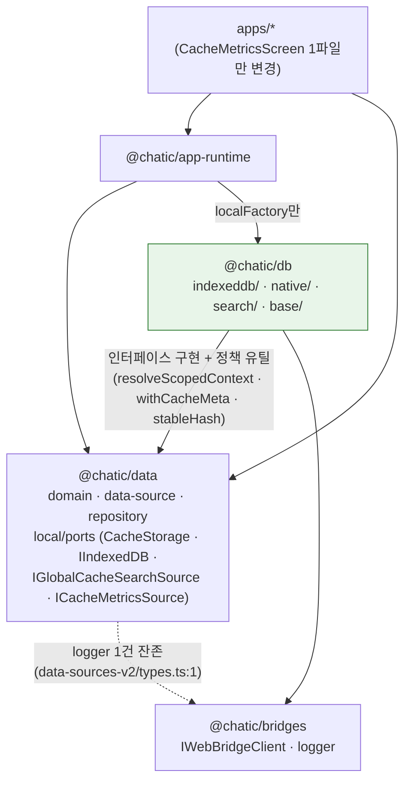
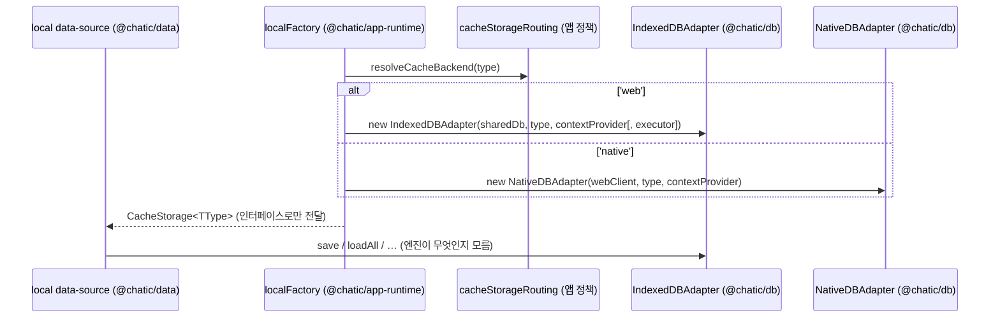

# @chatic/db — 저장 엔진 lib

> 상태: Live · 최종 갱신: 2026-08-27 · 관련 ADR: [ADR-0070](../../../docs/adr/0070-app-runtime-session-hub.md) (결정 5)

## 목적

저장 엔진의 전부 — IndexedDB 물리 계층(`IndexedDBDatabase`), 웹 캐시 어댑터(`IndexedDBAdapter` +
`ChatQueryExecutor`), 네이티브 SQLite 브릿지 어댑터(`NativeDBAdapter`), 전역 캐시 검색 구현 2종,
네이티브 캐시 계측(`nativeCacheMetrics`) — 를 소유하는 lib. 소켓 축의
`@lemoncloud/chatic-sockets-lib`, HTTP 축의 [`@chatic/http`](../../http/docs/architecture.md)와
같은 위치다: 실제 IO는 엔진 lib이 알고, `data`는 자기가 소유한 인터페이스로만 저장을 안다.

절단선은 새로 긋는 것이 아니라 **이미 코드에 있는 것을 패키지 경계로 승격**하는 것이다. `data`의
local data-source 9클래스는 지금도 엔진 클래스를 하나도 import하지 않고 `CacheStorage`
인터페이스만 본다(실측은 §상세 구현). 엔진 구현을 만지는 곳은 `app-runtime`의
[`localFactory`](../../app-runtime/src/data/factories/localFactory.ts) 하나이고, 유일한 예외가
apps/web 디버그 오버레이의 계측 직접 import 1건이다 — 이번에 포트 뒤로 넣는다.

ADR-0070 5단계 중 **2단계**의 저장 축 산출물이다. 2단계의 나머지 절반(`HttpGatewayBundle` ·
`http-data-sources` · `httpFactory`)은 [@chatic/http 문서](../../http/docs/architecture.md)의
후속 확장 소관이며 이 문서의 범위가 아니다.

## 설계 원칙

- **어댑터 인터페이스는 소비자(`data`)가, 엔진 클래스는 이 lib이 소유한다**(ADR-0070 결정 5
  규율 1). `CacheStorage`·`IIndexedDB`·`IGlobalCacheSearchSource`와 신설 `ICacheMetricsSource`는
  `data/local/ports`에 남고, 이 lib은 그 구현일 뿐이다. RN이 다른 엔진을 꽂아도 `data`는 무변경.
- **엔진 클래스는 팩토리 밖으로 나가지 않는다**(규율 2). 리포 전체에서 엔진 클래스 인스턴스를
  만드는 곳은 `localFactory` 하나이고, 이관 후에도 그대로다. 앱·`data`·repository는
  `@chatic/db`를 import하지 않는다.
- **의존은 하향 단방향: `db → data` + `db → bridges`.** 단 ADR 다이어그램의 "타입 전용" 표기와
  달리 실측은 **타입 + 순수 정책 유틸의 런타임 import**다(§상세 구현의 utils 분할 참조) —
  스코프·TTL 정책 함수는 도메인 정책이라 `data`에 남고, 엔진이 그것을 호출한다. 순환은 없다:
  `data`는 `@chatic/db`를 모른다(CI 게이트, §검증 방법).
- **이관은 물리 이동이지 리팩토링이 아니다.** 클래스 내부 코드는 한 줄도 바꾸지 않는 것이
  기본이고, 유일한 신설 코드는 `ICacheMetricsSource` 포트와 그 구현·배선이다. 동작 불변의
  증거는 함께 이동하는 기존 테스트 7파일(총 1,481줄, §검증 방법)이다.
- **재수출 shim을 두지 않는다.** `@chatic/data` 배럴에서 엔진 심볼은 그냥 사라진다. 소비자가
  전수 2곳(`localFactory`, `CacheMetricsScreen`)뿐이라 shim의 비용이 이득보다 크고, shim을 두면
  모듈 상태(공유 DB 커넥션·계측 누적치)가 두 패키지에 이중 인스턴스로 살아나는 위험이 생긴다.

## 범위

**포함 (2단계 저장 축)**

- `libs/db` 신설: `indexeddb/`(IndexedDBDatabase · ChatQueryExecutor · IndexedDBAdapter) ·
  `native/`(NativeDBAdapter · nativeCacheMetrics) · `search/`(검색 구현 2종) ·
  `base/`(BaseDbAdapter) + 기존 테스트 7파일 이관
- `data/local/ports` 신설: 현 `storages`·`databases`·`search`의 인터페이스·타입·정책 유틸 잔류분
  재배치 + **`ICacheMetricsSource` 신설**
- `localFactory`의 엔진 import를 `@chatic/db`로 전환 (조립 로직 무변경)
- apps/web `CacheMetricsScreen.tsx`의 엔진 직접 import 1건을 포트 뒤로
- lib 스캐폴딩(`libs/logger` 형태 준용) + [tsconfig.base.json](../../../tsconfig.base.json)
  `@chatic/db` path 등록

**제외**

- **HTTP·소켓 축** — 각각 [@chatic/http 문서](../../http/docs/architecture.md)와 기존
  `socketFactory` 구조의 소관. 2단계의 `HttpGatewayBundle`·`http-data-sources`·`httpFactory`도
  http 문서의 후속 확장으로 다룬다.
- **세션** — ADR-0070 결정 1·2·7, 3단계 소관.
- **캐시 라우팅 정책** — `resolveCacheBackend`/`isNativeApp`
  ([cacheStorageRouting.ts:45](../../app-runtime/src/data/cacheStorageRouting.ts))은 어느 엔진을
  고를지의 **앱 정책**이므로 `app-runtime`에 남는다. 엔진 lib이 자기 선택 조건을 알면 안 된다.
- **local data-source 9클래스와 그 캐시 의미론** — 무변경. import 경로만 `../storages` →
  `../ports`로 바뀐다.
- **RN용 대체 엔진 구현** — 이 절단이 만드는 가능성이지 이번 산출물이 아니다.
- **`data`에 남는 `@chatic/bridges` logger 의존 1건의 해소** — 아래 실측 참조. 이 결정의 범위
  밖으로 명시한다.

## 시나리오

현재 코드가 실제로 수행하는 네 경로가 그대로 lib의 유스케이스다. 넷 다 이관 후 동작 불변이다.

1. **웹 IndexedDB 경로** — repository → `ChatLocalDataSourceV2`(주입된 `CacheStorage`만 호출) →
   `IndexedDBAdapter` → 공유 `IndexedDBDatabase`(단일 커넥션, `ChaticWebCacheDB` v3,
   `IndexedDBDatabase.ts:4-8`). chat
   타입만 `ChatQueryExecutor`가 커서 역순 페이징 + 미전송 레인지(`UNSENT_CHAT_NO`,
   `IndexedDBDatabase.ts:20`) 2단 조회를
   수행한다. 공유 커넥션은 `localFactory`의 유일한 모듈 상태이며
   ([localFactory.ts:38-44](../../app-runtime/src/data/factories/localFactory.ts)) 팩토리에 남는다
   — 엔진 lib으로 옮기면 "인스턴스 결합은 전부 팩토리"라는 결정 5의 문장이 깨진다.
2. **네이티브 브릿지 경로** — 같은 data-source가 이번엔 `NativeDBAdapter`를 주입받는다. 모든
   연산은 단일 지점 `send()`를 지나 `bridge.request(message)`로 SQLite에 도달하고, 소요 시간이
   `recordNativeCacheOperation`에 자동 계측된다
   (`NativeDBAdapter.ts:112`). 읽기는
   같은 페이로드의 in-flight Promise를 공유한다(`sendRead`,
   `NativeDBAdapter.ts:127`). 어느
   타입이 어느 어댑터를 받는지는 `resolveCacheBackend`가 결정하고 팩토리가 물질화한다
   ([localFactory.ts:70-72](../../app-runtime/src/data/factories/localFactory.ts)).
3. **전역 캐시 검색** — `useGlobalCacheSearch`(app-runtime)가
   `getGlobalCacheSearchSource()`로 환경별 구현을 받아 `IGlobalCacheSearchSource` 계약만 호출한다
   ([useGlobalCacheSearch.ts:4](../../app-runtime/src/runtime/useGlobalCacheSearch.ts),
   [localFactory.ts:77-78](../../app-runtime/src/data/factories/localFactory.ts)). 웹은 cid를
   열어둔 인덱스 범위 스캔(`IndexedDbGlobalSearchSource.ts:37`),
   네이티브는 브릿지 검색 메시지(`NativeGlobalSearchSource.ts:47`)다.
   두 구현의 의미 동일성은 공유 contract 테스트가 지킨다
   (`globalCacheSearch.contract.test.ts`, 393줄).
4. **캐시 메트릭 (이번에 형태가 바뀌는 유일한 경로)** — apps/web 디버그 오버레이가 1초 폴링으로
   누적 통계를 읽고 리셋한다. 지금은 엔진 모듈 함수를 직접 import한다
   ([CacheMetricsScreen.tsx:4](../../../apps/web/src/app/features/debug/overlay/screens/CacheMetricsScreen.tsx)
   — `getNativeCacheMetrics`/`resetNativeCacheMetrics`를 `@chatic/data`에서). 이관 후에는
   `data/local/ports`의 `ICacheMetricsSource`(read·reset)를 `@chatic/db/native`가 구현하고
   `localFactory`가 결합하며, 화면은 `app-runtime`에서 포트 인스턴스를 받아 `read()`/`reset()`만
   호출한다. 계측 기록 쪽(`recordNativeCacheOperation`,
   `nativeCacheMetrics.ts:59`)은
   `NativeDBAdapter`와 같은 모듈 안의 내부 호출이라 포트가 필요 없다.

## 다이어그램

2단계 완료 시점의 의존 그래프. 실선은 런타임 import, 점선은 구현/타입 관계다.



결합 지점은 하나다 — `localFactory`가 엔진 클래스를 `new` 해서 `CacheStorage` /
`IGlobalCacheSearchSource` / `ICacheMetricsSource` 타입으로 내보낸다:



## 상세 구현

### 실측 — ADR 주장의 재검증

이 문서의 출발점인 결정 5의 실측 주장을 현재 트리에서 다시 쟀다. 어긋난 것은 어긋난 대로 적는다.

- **"local data-source가 엔진을 모른다" — 참.** data-sources-v2 11파일(구현 9 + types + index)의
  import 전수에서 엔진 클래스는 0건이다. 단 **"storages에서 가져가는 것은 `CacheStorage`와
  `stableHash`뿐"은 실측과 다르다** — `SyncMetaLocalDataSourceV2`가 `resolveTtlMs`를 하나 더
  가져간다([SyncMetaLocalDataSourceV2.ts:4](../../data/src/data/local/data-sources-v2/SyncMetaLocalDataSourceV2.ts)).
  세 심볼 모두 인터페이스·유틸이라 절단 자체는 성립하지만, TTL 정책 함수가 data-source 소비자를
  가진다는 사실이 utils 분할(아래)의 방향을 결정한다.
- **"엔진 소비자는 `localFactory` 하나" — 소스 기준 참, 파일 기준은 4다.** 엔진 심볼의 리포 전수
  grep(주석·`dist/` 제외) 결과: `localFactory.ts` + `localFactory.test.ts`(app-runtime),
  `CacheMetricsScreen.tsx` + `CacheMetricsScreen.test.tsx`(apps/web). ADR이 말한 "앱의 엔진 심볼
  import 1건"은 화면 파일 기준으로 정확하다.
- **"`data`의 bridges 의존이 엔진과 함께 빠져나간다" — 부분만 참.** `@chatic/bridges` import는
  `libs/data/src` 전체에서 5건(테스트 제외)이고 그중 4건이 엔진 파일이다
  (`NativeDBAdapter.ts:1-2` · `nativeCacheMetrics.ts:1` · `NativeGlobalSearchSource.ts:9`).
  그러나 **[data-sources-v2/types.ts:1](../../data/src/data/local/data-sources-v2/types.ts)의
  `logger` 런타임 import 1건은 남는다**(옵저버 실패 로깅 3곳 — 같은 파일 429·443·452행). 따라서
  ADR의 "`data`가 런타임 의존 0의 플랫폼 비종속 순수 데이터 모듈이 된다"는 이 단계에서는
  달성되지 않는다 — bridges 의존이 5건 → 1건으로 줄 뿐이다. 잔존 1건의 해소(logger 주입 또는
  `@chatic/logger` 직결)는 별도 결정으로 남긴다.
- **"db → data는 타입 전용" — 실측은 타입 + 런타임 유틸.** 이관 대상 엔진 클래스들이 `data`에
  남는 코드에서 가져다 쓰는 것: `BaseDbAdapter`가 `resolveScopedContext`
  (`utils.ts:81`), `IndexedDBAdapter`가
  `createTtlMeta`·`withCacheMeta`(`utils.ts:54`,
  `utils.ts:93`), `NativeDBAdapter`가
  `withCacheMeta`와 `stableHash`(`stableHash.ts:9`).
  전부 순수 함수지만 런타임 import다. 정책(타입별 TTL·스코프)은 도메인 소유라 `data`에 남기는
  것이 맞고, 그 대가로 화살표의 순도가 "타입 전용"에서 내려온다 — ADR은 X(타입 전용)라고 하나
  실측 설계는 Y(타입 + 순수 정책 유틸)다.
- **ADR 폴더 스케치는 이상화다.** `libs/data/src/local/ports/`가 아니라 실제 루트는
  `libs/data/src/data/local/`이다(중간 `data/` 한 층 더). 이 문서의 목표 구조는 실제 루트 기준으로
  쓴다.
- **2단계 "앱 변경 없음(팩토리만)"도 정확히는 아니다.** 위 실측대로 apps/web 1파일(+테스트)이
  함께 움직인다. ADR 결정 5 본문이 이미 이 1건을 인정하고 포트화를 지시하므로, 단계 표의 표기가
  본문과 어긋나는 것이다.

### 목표 폴더 구조

```
libs/db/src/                                ← 신설: 저장 엔진 (data의 인터페이스를 구현)
├── index.ts                                  엔진 클래스 + NativeCacheMetricsSource만 export
├── base/
│   └── BaseDbAdapter.ts                      두 어댑터의 공유 메커니즘 (storages/types.ts에서 분리)
├── indexeddb/
│   ├── IndexedDBDatabase.ts                  IIndexedDB 구현 + 인덱스 상수 + UNSENT_CHAT_NO
│   ├── ChatQueryExecutor.ts                  IndexedDbQueryExecutor<'chat'> 구현
│   └── IndexedDBAdapter.ts                   CacheStorage 구현 (+ isQuotaExceededError 동반 이동)
├── native/
│   ├── NativeDBAdapter.ts                    CacheStorage 구현 — 브릿지 왕복 + 계측
│   └── nativeCacheMetrics.ts                 계측 모듈 상태 + NativeCacheMetricsSource (ICacheMetricsSource 구현)
└── search/
    ├── IndexedDbGlobalSearchSource.ts        IGlobalCacheSearchSource 구현 (웹)
    └── NativeGlobalSearchSource.ts           IGlobalCacheSearchSource 구현 (네이티브)

libs/data/src/data/local/                   ← 유지: 인터페이스·정책·data-source
├── ports/                                    신설 폴더 — 아래 대응표의 잔류분 재배치
│   ├── cacheStorage.ts                       CacheStorage · CacheSchema · CacheStorageItem ·
│   │                                         CacheStorageFactory · LocalCacheStorages · createCacheStorages
│   ├── indexeddb.ts                          IIndexedDB · IndexedDbRow · CursorQueryOptions · IndexedDbQueryExecutor
│   ├── search.ts                             IGlobalCacheSearchSource + 쿼리/결과 타입 + globalCacheRefKey
│   ├── metrics.ts                            ICacheMetricsSource · CacheMetricsSnapshot (신설)
│   ├── policy.ts                             resolveTtlMs · createTtlMeta · withCacheMeta ·
│   │                                         resolveBaseScope · resolveScopedContext · AdapterScope
│   └── index.ts
├── stableHash.ts                             그대로 (data-source 유틸 — 한 층 위로만 이동)
└── data-sources-v2/                          무변경 — import 경로만 ../storages → ../ports
```

### 이관 전/후 대응표

이관은 이 표대로 실행 완료됐다 — 왼쪽 열의 파일들은 더 이상 존재하지 않으며, 어디로 갔는지의
기록으로 남긴다.

| 이관 전 (`libs/data/src/data/local/`, 삭제됨)                                        | 심볼                                                                                                              | 이관 후                                                                                                  |
| ------------------------------------------------------------------------------------ | ----------------------------------------------------------------------------------------------------------------- | -------------------------------------------------------------------------------------------------------- |
| `databases/IndexedDBDatabase.ts:25`                                                  | `IndexedDBDatabase` · `TYPE_CID_UID_INDEX` · `CHAT_PAGINATION_INDEX` · `UNSENT_CHAT_NO`                           | → `db/indexeddb/` (상수 소비자도 전부 엔진 쪽 — data 잔류 코드의 참조 0건 실측)                          |
| `databases/ChatQueryExecutor.ts:9`                                                   | `ChatQueryExecutor`                                                                                               | → `db/indexeddb/`                                                                                        |
| `databases/types.ts:37`                                                              | `IIndexedDB` · `IndexedDbRow` · `CursorQueryOptions` · `IndexedDbQueryExecutor`                                   | 남는다 → `ports/indexeddb.ts`                                                                            |
| `storages/types.ts:72`                                                               | `CacheStorage` · `CacheStorageItem` · `CacheSchema`                                                               | 남는다 → `ports/cacheStorage.ts`                                                                         |
| `storages/types.ts:10`                                                               | `BaseDbAdapter`                                                                                                   | → `db/base/` — 같은 파일에 계약과 동거하던 구현 편의 클래스. 규율 3("Base는 계약이 아니다")대로 엔진 쪽  |
| `storages/index.ts:11-41`                                                            | `CacheStorageFactory` · `LocalCacheStorages` · `createCacheStorages`                                              | 남는다 → `ports/cacheStorage.ts` (조립 계약 — `localFactory`·data-source index가 소비)                   |
| `storages/IndexedDBAdapter.ts:32`                                                    | `IndexedDBAdapter` · `IndexedDBAdapterOptions`                                                                    | → `db/indexeddb/`                                                                                        |
| `storages/NativeDBAdapter.ts:80`                                                     | `NativeDBAdapter`                                                                                                 | → `db/native/`                                                                                           |
| `storages/nativeCacheMetrics.ts:59`                                                  | `recordNativeCacheOperation` · `getNativeCacheMetrics`(:99) · `resetNativeCacheMetrics`(:105)                     | → `db/native/` + `NativeCacheMetricsSource` 신설                                                         |
| `storages/utils.ts:51-93`                                                            | `resolveTtlMs` · `createTtlMeta` · `withCacheMeta` · `resolveBaseScope` · `resolveScopedContext` · `AdapterScope` | 남는다 → `ports/policy.ts` (도메인 정책 — `SyncMetaLocalDataSourceV2`가 소비자, db가 런타임 import)      |
| `storages/utils.ts:47`                                                               | `isQuotaExceededError`                                                                                            | → `db/indexeddb/` — 소비자가 `IndexedDBAdapter` 하나뿐이고 `DOMException` 판정이라 웹 엔진 종속          |
| `storages/stableHash.ts:9`                                                           | `stableHash`                                                                                                      | 남는다 → `local/stableHash.ts` (data-source 3파일이 소비, `NativeDBAdapter`는 `@chatic/data`에서 import) |
| `search/types.ts:67`                                                                 | `IGlobalCacheSearchSource` + 쿼리/결과 타입 5종 + `globalCacheRefKey`                                             | 남는다 → `ports/search.ts`                                                                               |
| `search/IndexedDbGlobalSearchSource.ts:37` · `search/NativeGlobalSearchSource.ts:47` | 검색 구현 2종                                                                                                     | → `db/search/`                                                                                           |

배럴 변화: [libs/data/src/index.ts](../../data/src/index.ts)의
`./data/local/{storages,databases,search}` 3줄(3-5행)이 `./data/local/ports` + `./data/local/stableHash`로
바뀐다. **엔진 클래스가 `@chatic/data` 공개 표면에서 사라지는 breaking change**지만, 위 실측대로
배럴 밖 소비자는 4파일(팩토리 2 + 화면 2, 테스트 포함)이고 전부 이 단계 안에서 함께 고친다.

### `IIndexedDB`의 위치 — ADR 준수, 단 긴장을 기록한다

ADR은 `IIndexedDB`를 `data/local/ports` 잔류로 지정한다. 실측으로는 긴장이 있다: **`IIndexedDB`를
소비하는 코드는 전부 이관되는 엔진 4클래스다**(`IndexedDBAdapter`·`IndexedDBDatabase`·
`ChatQueryExecutor`·`IndexedDbGlobalSearchSource` — `data` 잔류 코드의 참조 0건). 규율 1("계약은
소비자 쪽 모듈이 소유")을 문자 그대로 적용하면 이 인터페이스는 `@chatic/db` 내부 계약이다.

그래도 ADR대로 `data`에 남긴다. 근거: `IndexedDbRow`가 `data` 소유 `CacheSchema`의 확장이라
(`databases/types.ts:9`) 타입의 뿌리가 `data`에
있고, 저수준 저장 계약까지 `data`가 들고 있어야 "웹 저장 계층 전체를 다른 구현으로 갈아끼워도
`data` 무변경"이 타입 수준에서 성립한다. 이 배치 덕에 `db`의 해당 파일들은 `@chatic/data`를
`import type`으로만 소비한다 — §설계 원칙의 "타입 + 정책 유틸" 중 타입 쪽 절반이다. 구현 중
`db` 내부로 옮기는 편이 낫다고 판명되면 그것은 이 문서의 수정 대상이지 조용한 드리프트가 아니다.

### `ICacheMetricsSource` — 신설 포트와 화면 전환

```ts
// libs/data/src/data/local/ports/metrics.ts (신설)
export interface CacheMetricsOperationStat {
    count: number;
    avgMs: number;
    maxMs: number;
}

export interface CacheMetricsSnapshot {
    totalOps: number;
    operations: Record<string, CacheMetricsOperationStat>; // key: `${operation}:${type}`
}

/** 네이티브 캐시 계측의 읽기·리셋 표면. 기록(record)은 엔진 내부라 포트에 없다. */
export interface ICacheMetricsSource {
    read(): CacheMetricsSnapshot;
    reset(): void;
}
```

스냅샷 타입은 `getNativeCacheMetrics` 반환 형태([nativeCacheMetrics.ts](../src/native/nativeCacheMetrics.ts))를
이름만 붙여 고정한 것이다 — 필드 추가·변경 없음. 구현은 모듈 상태의 얇은 facade다:

```ts
// libs/db/src/native/nativeCacheMetrics.ts (이관 + 추가)
export class NativeCacheMetricsSource implements ICacheMetricsSource {
    read(): CacheMetricsSnapshot {
        return getNativeCacheMetrics();
    }
    reset(): void {
        resetNativeCacheMetrics();
    }
}
```

계측 누적치는 모듈 싱글턴이므로 인스턴스를 몇 개 만들어도 같은 통계를 본다 — `reset()`의 전역
효과도 현 `resetNativeCacheMetrics`와 동일하다. 배선은 `localFactory`에 함수 하나를 더한다
(`getGlobalCacheSearchSource`와 같은 형태):

```ts
// app-runtime/src/data/factories/localFactory.ts (추가)
export const getCacheMetricsSource = (): ICacheMetricsSource => new NativeCacheMetricsSource();
```

`app-runtime` 배럴([index.ts](../../app-runtime/src/index.ts) — 명시 named export 규칙)에
`getCacheMetricsSource`를 추가하고,
[CacheMetricsScreen.tsx](../../../apps/web/src/app/features/debug/overlay/screens/CacheMetricsScreen.tsx)는
`@chatic/data`의 엔진 함수 import(4행) 대신 `@chatic/app-runtime`의 포트 인스턴스를 받아
31행 `getNativeCacheMetrics()` → `source.read()`, 48행 `resetNativeCacheMetrics()` →
`source.reset()`, 64행의 복사용 재호출 → `source.read()`로 바꾼다. 화면의 폴링·정렬·표시는
무변경이다. 타입은 `@chatic/data`의 `CacheMetricsSnapshot`을 쓴다 — 앱이 보는 것은 여전히
`data`(타입) + `app-runtime`(인스턴스) 둘뿐이다.

### localFactory — 유일한 결합 지점의 이관 후 모습

[localFactory.ts:1-17](../../app-runtime/src/data/factories/localFactory.ts)의 import가 둘로
갈라지는 것이 변경의 전부다 — 인터페이스·조립 계약은 `@chatic/data`에서, 엔진 클래스는
`@chatic/db`에서:

```ts
import type {
    CacheStorage,
    CacheStorageFactory,
    DataContextProvider,
    ICacheMetricsSource,
    IGlobalCacheSearchSource,
    LocalDataSourcesV2,
} from '@chatic/data';
import { createCacheStorages, createLocalDataSourcesV2 as createDataLocalDataSources } from '@chatic/data';
import {
    ChatQueryExecutor,
    IndexedDBAdapter,
    IndexedDBDatabase,
    IndexedDbGlobalSearchSource,
    NativeCacheMetricsSource,
    NativeDBAdapter,
    NativeGlobalSearchSource,
} from '@chatic/db';
import { webClient } from '@chatic/bridges';
```

공유 커넥션 싱글턴(38-44행)·chat executor 조립(52-56행)·백엔드 라우팅 물질화(70-72행)·검색 소스
선택(77-78행)·라우팅 fingerprint(97-105행)는 전부 무변경. 이로써 `@chatic/db`의 리포 내 소비자는
이관 후에도 `localFactory`(+그 테스트) 하나다.

### 스캐폴딩

[libs/logger](../../logger/project.json) 형태를 준용하되, tsconfig 참조는 의존 실측대로 잡는다.

- `libs/db/project.json` — name `@chatic/db`, projectType library, targets `{}` (logger와 동일)
- `libs/db/package.json` — name `@chatic/db`, private, main/types `./src/index.ts` + `exports`
  맵([libs/data/package.json](../../data/package.json) 형태) + jest test target
- `libs/db/tsconfig.json` / `tsconfig.lib.json` / `tsconfig.spec.json` — lib의 `references`:
  `../data`, `../bridges`, `../app-messages` (엔진 파일들의 import 실측 전수). `outDir`는 data와
  같은 `dist` 방식이 아닌 logger의 `../../dist/out-tsc` 방식 중 **data 방식(`dist`)을 따른다** —
  이 lib은 `app-runtime`의 tsconfig 참조 체인에 들어가므로 data와 같은 규약이 안전하다 (미검증:
  실제 빌드로 확인 필요)
- `libs/db/jest.config.js` — [libs/data/jest.config.js](../../data/jest.config.js) 복사로 충분:
  jsdom + `moduleNameMapper '^@chatic/(.*)$' → '<rootDir>/../$1/src/index.ts'`가 `@chatic/data`
  역참조를 소스로 해석해 준다. `fake-indexeddb`는 루트 devDependency(6.2.5)라 그대로 쓴다
- [tsconfig.base.json](../../../tsconfig.base.json) paths에
  `"@chatic/db": ["libs/db/src/index.ts"]` 등록
- `libs/app-runtime/tsconfig.lib.json`의 `references`에 `../db` 추가 (현재 app-messages ·
  bridges · data · web-core 4개)

## 검증 방법

전부 실행 완료(2026-08-27). 이관 전후로 테스트 총량이 보존됐다 — `libs/data`가 43 suites·401
tests에서 36 suites·298 tests로 줄고, `libs/db`가 정확히 그 차이(7 suites·103 tests)로
생겼다. 나머지는 문서 작성 시점 계획대로다.

- **`libs/db` 유닛 테스트 — 7 suites·103 tests green.** 엔진과 함께 이동한 7파일
  (`IndexedDBAdapter` · `NativeDBAdapter` · `nativeCacheMetrics` · `ChatQueryExecutor` ·
  `IndexedDbGlobalSearchSource` · `NativeGlobalSearchSource` · `globalCacheSearch.contract`)이
  내용 변경 없이 import만 재배선됐다. `NativeDBAdapter.test.ts`는 `jest.mock('./utils', ...)`가
  `jest.mock('@chatic/data', ...)`로 바뀐 것이 유일한 실질 변경(`withCacheMeta`가 이제
  `@chatic/data`에서 온다).
- **`libs/data` 유닛 테스트 — 36 suites·298 tests green.** `CacheStorage.test.ts`는
  `ports/cacheStorage.test.ts`로 이동. data-sources-v2 11파일의 `../storages` import는
  `../ports`(타입) / `../stableHash`(값)로 기계적으로 갈렸다.
- **`libs/app-runtime` 유닛 테스트 — 28 suites·250 tests green.** `localFactory.test.ts`는
  **무변경으로 통과** — 어댑터를 생성자 이름 문자열로 판별하고 `@chatic/data`/`@chatic/db`를
  직접 import하지 않는 설계 덕에 모듈 경계 변경에 영향받지 않았다(문서가 예상한 대로).
  `public-surface.test.ts`(배럴 심볼 고정 가드)는 새 심볼 `getCacheMetricsSource` 추가를
  실제로 잡아냈다 — 의도된 실패이자 검증이 작동한다는 증거라 목록에 추가해서 통과시켰다.
- **apps/web `CacheMetricsScreen.test.tsx` — 3 tests green.** `@chatic/data` 목이
  `@chatic/app-runtime`의 `getCacheMetricsSource` 목(`{read, reset}`)으로 재배선됐다.
- **타입체크는 `tsc -b libs/app-runtime/tsconfig.lib.json`** 하나로 db→data→http→web-core→
  app-runtime 전체가 project reference로 빌드된다(`libs/db/tsconfig.lib.json`을
  `app-runtime`·`data`(엔진 소비 방향은 반대지만 dev 편의상)의 `references`에 등록).
  `tsc --noEmit`은 no-op이라는 기존 함정 그대로.
- **stale dist 함정은 실제로 발생하지 않았다** — `rm -rf dist/out-tsc libs/*/dist`를 매
  이관 단계 전에 먼저 실행하는 습관으로 예방. 문서가 우려한 CI 캐시 이슈는 로컬 검증 범위 밖.
- **경계 게이트 — 전부 grep으로 확인**: ① `libs/data/src`에 엔진 클래스(`IndexedDBAdapter` 등)
  import 0건(주석 언급 제외) — 유일한 "매치"는 `ports/metrics.ts`의 주석. ② 엔진 소비자는
  `localFactory.ts`(+테스트)와 `CacheMetricsScreen.tsx`(+테스트) 뿐. ③ `data`의
  `@chatic/bridges` 런타임 의존은 여전히 1건(`data-sources-v2/types.ts`) — 실측이 문서 예측과
  정확히 일치했다.

```bash
rm -rf dist/out-tsc libs/*/dist
npx tsc -b libs/app-runtime/tsconfig.lib.json
for lib in db data app-runtime http web-core; do (cd libs/$lib && npx jest); done
(cd apps/web && npx jest --testPathPatterns="CacheMetricsScreen")
```
