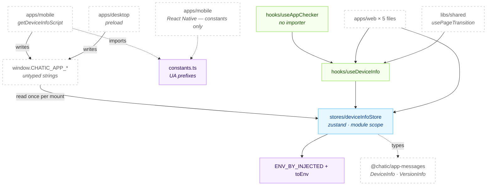
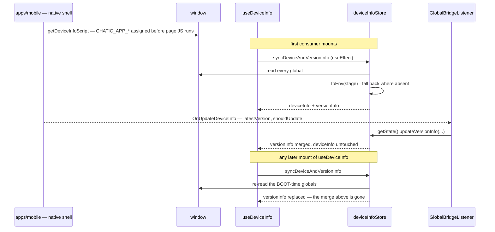

# @chatic/device-utils

**The one reader of the `window.CHATIC_APP_*` globals a shell injects into the page.** It normalises
that untyped bag into the `DeviceInfo` and `VersionInfo` shapes `@chatic/app-messages` declares,
publishes both from a single zustand store, and puts two React hooks over it. It also holds the two
User-Agent prefixes a native shell stamps on its WebView.

Seven files and 172 lines, and the size is the point. This is a contract surface, not a feature:
three shells written in three languages inject the same globals with different spellings, and this is
the one place where those spellings are reconciled into a typed value.

## Purpose

Consumers see the `@chatic/device-utils` barrel and nothing else. Imports that reach past it into an
internal path number **zero**, so the directory layout below is free to move.

```bash
grep -rn "@chatic/device-utils/" --include='*.ts' --include='*.tsx' apps libs | grep -v node_modules
```

The consumer list is short and worth knowing, because one entry on it is not a browser.

```bash
grep -rln "@chatic/device-utils" --include='*.ts' --include='*.tsx' apps libs | grep -v node_modules
```

Five source files in `apps/web` — `bridge/GlobalBridgeListener.tsx`, `features/feedback`'s
`FeedbackPage`, `features/mypage`'s `SettingsPage`, and `features/debug`'s `usePushRegistration` and
`DeviceInfoScreen` — plus `libs/shared`'s `usePageTransition`, and `apps/mobile`, which is React
Native and imports `constants.ts` alone.

**Why this is a library rather than a folder in `apps/web`.** Its two ends live in different
projects. `apps/mobile` writes the User-Agent prefix that identifies the shell; `apps/web` reads the
globals that shell injects; `libs/shared` sits between them and names `@chatic/device-utils` in its
own **Out** list as the owner of device and platform facts, which is the boundary that keeps platform
sniffing out of the catch-all barrel. A folder inside `apps/web` could be imported by none of those.

This lib **does not decide whether the app is running inside a shell.** That question is answered by
`isNative()` in `@chatic/bridges`, which tests for the presence of a message handler rather than for
a name, and every `isOnMobileApp` in `apps/web` comes from there. It also **owns no preference and no
setting** — the theme, the language and every other stored choice belong to `@chatic/config`; what is
here is only what the shell asserted at page load.

## Design principles

1. **The globals are read, never written.** The shell owns every `CHATIC_APP_*` key. Nothing in this
   lib assigns one, and a consumer that wants to change a device fact is describing a bridge message,
   not a store write.
2. **Narrow the injected string; never assert it.** `toEnv` maps through `ENV_BY_INJECTED` and falls
   back to `'local'`, the least privileged stage. The `as Env` this replaced let `'DEV'` and `'dev'`
   through into `DeviceInfo.stage` unchanged, so two shells disagreed about the name of the same
   stage while the compiler said nothing.
3. **Every spelling a shipped shell has ever injected stays in the table.** The web deploys before
   the app does, so there is always a window in which a new web bundle reads an old shell's globals.
   Deleting the uppercase `LOCAL` / `DEV` / `PROD` rows would relabel every installed app as `'local'`
   until it updated.
4. **An absent global degrades to the plain-web default; it never throws.** `platform` falls back to
   `'web'`, version strings to `''`, and `__APP_VERSION__` to `'0.0.0'` when the bundler defined no
   such constant. A browser with no shell is a supported configuration, not an error case.
5. **`syncDeviceAndVersionInfo` overwrites, `updateVersionInfo` merges.** The first re-reads the
   boot-time globals and replaces both records wholesale; the second changes two fields of
   `versionInfo` and no-ops when neither moved. Ordering them the wrong way round silently discards a
   live update — see [Scenario 3](#3-the-shell-announces-a-newer-version-while-the-app-is-open).
6. **One store for the whole page.** `useDeviceInfoStore` is created at module scope, so every
   consumer shares one record and a non-React caller can reach it with `getState()`. There is no
   provider to mount and no place to put a second instance.
7. **A hook here derives; it does not gate a feature.** `useAppChecker` returns booleans and nothing
   else. It currently has no importer anywhere in the repo, and principle-wise that is the right
   default to keep: platform gating has one owner and it is `isNative()`.

## Scope

**In** — reading the shell-injected globals, the stage vocabulary table, the `DeviceInfo` /
`VersionInfo` records and the store that holds them, the two hooks over that store, and the
User-Agent prefix constants.

**Out** — the `DeviceInfo`, `VersionInfo`, `Env`, `Platform` and `PageLanguage` type declarations
themselves (`@chatic/app-messages`), sending or receiving bridge messages and the `isNative()` test
(`@chatic/bridges`), injecting the globals (`apps/mobile`'s `getDeviceInfoScript`, `apps/desktop`'s
preload), settings and their persistence (`@chatic/config`), the update banner and the version poll
against `/version.json` (`libs/shared`'s `useVersionCheck`), and push token registration
(`apps/web`'s `useDeviceTokenRegistration`).

## Structure



**The arrow from the store back to the globals does not exist.** Injection is one-way: the shell
writes before the page evaluates, this lib reads, and every correction after that arrives as a bridge
message which a consumer turns into an explicit `updateVersionInfo` call. `constants.ts` is on the
other side of the same boundary — it is imported only by the shell that writes the User-Agent, and
nothing on the web reads it back.

### Boot, and the one update that follows



The last three lines are the trap the diagram exists for. `syncDeviceAndVersionInfo` is not
idempotent with respect to `updateVersionInfo`, because it sources `latestVersion` and `shouldUpdate`
from globals that were frozen at page load.

### Directories

```text
libs/device-utils/src/
├── index.ts          public barrel — three lines of `export *`
├── constants.ts      two lines; the iOS and Android User-Agent prefixes
├── hooks/            useDeviceInfo · useAppChecker + index
└── stores/           deviceInfoStore + index
```

Three things the filenames do not tell you.

- **`stores/deviceInfoStore.ts` carries the ambient declarations.** The `declare global` block that
  types every `CHATIC_APP_*` key this lib reads, the `ENV_BY_INJECTED` table, `toEnv`, and
  `declare const __APP_VERSION__` are all in that one file. There is no `types.ts`, no `env.ts` and
  no `globals.d.ts` to open.
- **`DeviceInfoStore` is exported, the record types are not.** `DeviceInfo` and `VersionInfo` come
  from `@chatic/app-messages` and are re-exported by nothing here, so a consumer that needs to name
  one imports it from there.
- **`hooks/useAppChecker.ts` is derivation only.** Four values off `deviceInfo`, no store access of
  its own, and — measured across `apps` and `libs` — no importer.

## Usage

Import from the barrel. Nothing here needs a provider.

```ts
import { useDeviceInfo, useDeviceInfoStore } from '@chatic/device-utils';

// In a component: the effect inside the hook performs the read on mount.
const { deviceInfo, versionInfo } = useDeviceInfo();
if (deviceInfo?.platform === 'ios') {
    /* … */
}

// Outside React, or from a message handler: reach the store imperatively.
useDeviceInfoStore.getState().updateVersionInfo(latestVersion, shouldUpdate);
```

```ts
// The shell side. apps/mobile is the only importer of this module.
import { USER_AGENT_PREFIX_ANDROID, USER_AGENT_PREFIX_IOS } from '@chatic/device-utils';
```

### Wiring

Nothing in this lib is initialised by an app entry point. The store fills itself on the first mount
of `useDeviceInfo`, and everything upstream of that happens before the bundle evaluates.

```text
apps/mobile — AppWebView
  ├─ buildDeviceInfoParams()                    collects the native facts, stage via toEnvStage()
  ├─ getDeviceInfoScript(params)                injectedJavaScriptBeforeContentLoaded
  │     ↳ assigns window.CHATIC_APP_*           JSON.stringify'd, one key per line
  └─ applicationNameForUserAgent                carries APP_USER_AGENT_PREFIX

apps/desktop — preload/index.ts
  └─ injects the same key names into the main world; values arrive as --chatic-* argv

apps/web
  └─ GlobalBridgeListener                       useOnUpdateDeviceInfo → updateVersionInfo
```

## Scenarios

### 1. A web build boots inside the mobile shell

`getDeviceInfoScript` has already assigned the globals by the time React renders. The first
`useDeviceInfo` to mount runs `syncDeviceAndVersionInfo`, which reads all of them, maps `stage`
through `ENV_BY_INJECTED`, and sets both records at once. `appVersion` resolves to
`CHATIC_APP_CURRENT_VERSION` — the native build's version — and `webVersion` to the bundler's
`__APP_VERSION__`, so the two are distinguishable in a feedback report or a debug screen.

### 2. The same build in a plain browser

No global is defined. `platform` becomes `'web'`, `application` and both version strings become `''`,
`stage` becomes `'local'` because `toEnv(undefined)` finds no row, and `appVersion` falls through to
`webVersion`. Nothing throws and nothing is absent — `deviceInfo` is a complete record describing a
browser. This is why consumers test `deviceInfo?.platform`, not `deviceInfo === null`, once the first
mount has run.

### 3. The shell announces a newer version while the app is open

The native side posts `OnUpdateDeviceInfo`; `GlobalBridgeListener` calls
`useDeviceInfoStore.getState().updateVersionInfo(latestVersion, shouldUpdate)`, which merges those
two fields and returns the existing state untouched when neither changed, so no subscriber re-renders
for a no-op. **The merge survives only until the next `syncDeviceAndVersionInfo`**, and that runs on
every mount of `useDeviceInfo` anywhere in the tree — so navigating to Settings restores the
boot-time `latestVersion`. `apps/web`'s `useAppUpdateStatus` sidesteps this deliberately: its comment
records that the boot-time `CHATIC_APP_SHOULD_UPDATE` injection is not one of its sources. Treat
`versionInfo` here as the shell's opening statement, not as a live channel.

### 4. Desktop, where `platform` is not a `Platform`

`apps/desktop`'s preload injects `CHATIC_APP_PLATFORM: 'desktop'`, and `'desktop'` is not a member of
`@chatic/app-messages`' `Platform` union (`ios | android | windows | macos | web`). The store's
`as Platform` cast lets it through, so `deviceInfo.platform` reads `'desktop'` at run time while the
compiler believes otherwise. Both `isIOS` and `isAOS` are false, and `isOnMobileApp` is false too,
since the injected application name is `'chatic-desktop'`. Desktop also injects no
`CHATIC_APP_UNIQUE_DEVICE_ID` and no `CHATIC_APP_FIREBASE_INSTALLATION_ID`, so both fields stay
`undefined` there while mobile fills them.

### 5. `deviceToken` is read and never written

`syncDeviceAndVersionInfo` reads `window.CHATIC_APP_DEVICE_TOKEN` into `DeviceInfo.deviceToken`. No
shell injects that key — this lib is the only file in the repo that names it — so the field is always
`undefined`. The real push token is fetched over the bridge by `apps/web`'s
`useDeviceTokenRegistration`, which never goes through this store.

```bash
grep -rn "CHATIC_APP_DEVICE_TOKEN" --include='*.ts' --include='*.tsx' apps libs | grep -v node_modules
```

### 6. The User-Agent prefix, imported only by its writer

`apps/mobile` picks `USER_AGENT_PREFIX_IOS` or `USER_AGENT_PREFIX_ANDROID` by platform and appends it
to the WebView's User-Agent. Nothing on the web side parses the User-Agent looking for it; platform
detection there reads the injected globals instead. The constants live in a shared lib so that the
string a shell stamps and any future reader of it cannot drift apart — today only one of those two
exists.

## How to verify

```bash
npx tsc -b libs/device-utils/tsconfig.json --force   # the whole check
npx nx typecheck @chatic/device-utils                # what CI runs
```

**There is no second command.** This lib has no jest config, no `tsconfig.spec.json` and no test file,
so nx infers no `test` target for it — `typecheck`, `build`, `build-deps`, `watch-deps` and `lint` is
the complete list, and `npx nx show project @chatic/device-utils --json` is what proves it. Do not
add a `--config libs/device-utils/jest.config.js` invocation; there is nothing at that path.

- Type checking must be `tsc -b`. Inside this lib, `tsc --noEmit` checks zero files and succeeds, so
  passing it proves nothing.
- `tsconfig.lib.json` references `../app-messages/tsconfig.lib.json`, and that reference is the only
  reason the imported types resolve. A new cross-lib import needs the matching reference added and
  `npx nx sync` run, or the build fails later with TS6307 in whoever consumes this.
- A stale `dist`/`out-tsc` produces phantom errors after a file moves. `rm -rf dist/out-tsc` and look
  again.
- Downstream: a changed barrel identifier reaches `apps/web`, `libs/shared` and `apps/mobile` —
  and through `libs/shared` it reaches `apps/desktop-web` and `apps/admin-v2` as well.
  `.github/workflows/verify.yml` excludes `@chatic/mobile` and `desktop-web` from its typecheck step,
  so those two are the ones to run by hand.
- **The `apps/web` suites will not catch a changed hook signature.** All three test files that touch
  this lib — `FeedbackPage.test.tsx`, `usePushRegistration.test.ts` and
  `DeviceInfoScreen.operations.test.tsx` — `jest.mock('@chatic/device-utils')` wholesale with a hand
  written stub. Only the type check sees the real module.
