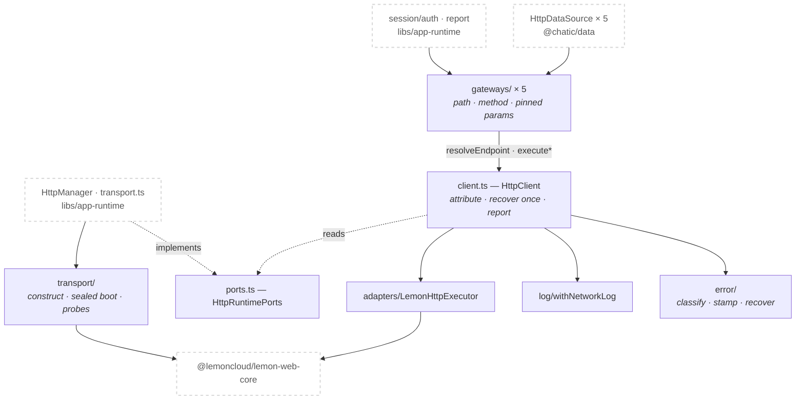
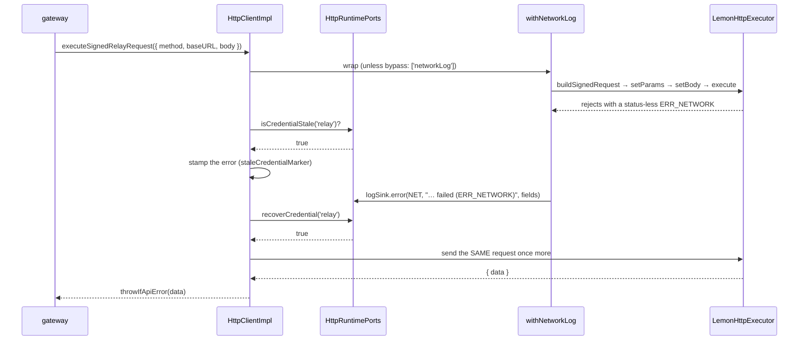

# @chatic/http

**Everything about making an HTTP request, and nothing about what the request is for.** It owns the
two request executors and the policy wrapped around them — failure classification, credential
attribution, recover-and-retry-once, structured network logging and the `bypass` opt-out — plus the
sealed `lemon-web-core` transport they run on and the per-domain wire vocabulary in `gateways/`.

The other side of this boundary is [`libs/data`](../data/docs/remote/http.md), which describes the
same gateways from the caller's side: which methods each domain `Pick<>`s and what it does with the
response.

## Purpose

This lib is a leaf. It imports **nothing** from `@chatic/*` and reads **no** environment, so it can
be built and tested without a session, a config, a logger or a browser. Everything it cannot know
for itself arrives through `HttpRuntimePorts`.

```bash
grep -rn "from '@chatic/" --include='*.ts' libs/http/src    # must print nothing
grep -rn "import.meta" --include='*.ts' libs/http/src       # must print nothing
```

Consumers see the `@chatic/http` barrel and nothing else. `tsconfig.base.json` maps
`@chatic/http` alone — there is no `@chatic/http/*` entry, so a deep import does not resolve.

What this lib does **not** own: endpoints, credentials, sessions and the log sink implementation
(`libs/app-runtime`, injected as ports); domain mapping and caching (`@chatic/data`); the lemon HMAC
signature ([`@chatic/auth-sign`](../auth-sign/README.md)); the socket transport
(`@lemoncloud/chatic-sockets-lib`).

## Design principles

1. **Zero `@chatic/*` runtime dependencies.** Endpoint resolution, credential staleness, credential
   recovery, the log sink and the logout reaction are all `HttpRuntimePorts` members.
   `@lemoncloud/lemon-web-core` is the one framework dependency, and it is used as a request builder
   only.
2. **No env read, but construction is allowed.** The contract forbids reading `import.meta`, not
   building the SDK. So `createLemonWebTransport` lives here and takes four plain values
   (`LemonTransportConfig`); the values and the singleton live in
   `app-runtime/src/http/transport.ts`. Two instances would split the lemon token store, so this lib
   holds no module state and hands back a factory.
3. **The refresh-free surface is enforced by absence, not by comments.** `SealedWebTransport` omits
   `init()`, `isAuthenticated()` and `getTokenStorage()` — the three lemon APIs that fire its own
   HTTP token refresh or hand a caller the means to. Refresh ownership belongs to the socket
   `AuthController`, whose writeback re-mints these credentials. `gateways/refreshAbsence.spec.ts`
   makes the matching check on path strings: no gateway source file may contain a `/refresh` route.
4. **Destination and signing are independent.** `HttpRoute` picks the signing material, `baseURL`
   picks the host. There is no `'cloud'` route — a request to a cloud backend is relay-signed (or
   unsigned) and carries its own `baseURL`. The one request that ever signed with a delegated cloud
   credential was the cloud HTTP refresh; ADR-0070 deleted it, and the SigV4 executor and its
   credential ports went with it.
5. **Side effects go behind a port.** The lib decides `shouldLogout` and reports it through
   `onAuthFailure`. It never alerts, redirects, logs out or writes to a store.
6. **Fields reach the sink raw.** `redactSensitive`/`truncate` live in `@chatic/logger`, which this
   lib may not import, so `withNetworkLog` passes unmodified values and the sink applies them. This
   is a deliberate departure from ADR-0070's folder sketch, taken to keep the dependency rule above.
7. **Contracts are interfaces, implementations are classes with constructor injection.**
   `HttpClientImpl` never escapes `createHttpClient`; consumers hold `HttpClient`.

## Scope

**In** — the request path (`client.ts`), the lemon adapter, error classification and credential
attribution/recovery, the structured network log and the `bypass` contract, the sealed transport's
construction and boot, and the wire vocabulary for 5 domains.

**Out** — `HttpRuntimePorts` implementations (`libs/app-runtime/src/http/`), view→domain mapping and
cache writes (`@chatic/data`), `calcSignature` (`@chatic/auth-sign`), and the socket axis entirely.

## Structure



**Nothing in this lib reads credential material.** Signing happens inside the lemon builder; the
closest the lib gets is asking a port the yes/no question "was this route's credential already past
its expiry?". That is why `HttpRuntimePorts` has no `getCredential` and no `getIdentityToken`, and
why an unsigned request can never be attributed to a lapsed credential.

`policy/retry.ts` is not on the arrows above. `withRetry` and `withTimeout` are exported and
**nothing in the repo calls either** — `apps/web` and `apps/mobile` each carry their own unrelated
`withTimeout`. The retry the request path actually performs is the recover-once in `client.ts`.

```bash
grep -rn "withRetry\|withTimeout" --include='*.ts' --include='*.tsx' apps libs | grep -v node_modules
```

### A signed request whose credential has lapsed



If the replay fails too, `run` stops there — a second failure after a successful re-mint means the
credential was not the problem. Only then does `reportAuthFailure` run, and only if
`classifyError` says `shouldLogout`.

### The sealed surface

Two interfaces are defined by what they leave out.

| Interface             | Has                                                                                                                         | Deliberately absent                                            |
| --------------------- | --------------------------------------------------------------------------------------------------------------------------- | -------------------------------------------------------------- |
| `LemonRequestBuilder` | `setBody` · `setParams` · `execute`                                                                                         | anything that cancels, aborts or times out a request in flight |
| `SealedWebTransport`  | `logout` · `setUseXLemonLanguage` · `buildRequest` · `buildSignedRequest` · `buildCredentialsByToken` · `getTokenSignature` | `init` · `isAuthenticated` · `getTokenStorage`                 |

**There is no request cancellation anywhere in this lib.** No `AbortSignal` reaches the builder, and
`withTimeout` (unused, see above) rejects the caller's promise while the request keeps running. A
caller that must discard a late response guards it with a generation check of its own; it cannot
call the request off.

### Directories

```text
libs/http/src/
├── index.ts                     public barrel — 12 `export *` lines, no named re-exports
├── client.ts                    HttpClient, HttpRequestOptions, createHttpClient, throwIfApiError
├── ports.ts                     HttpRoute + HttpRuntimePorts — the whole injection surface
├── adapters/lemonWebCore.ts     the 3-method lemon builder surface + LemonHttpExecutor
├── transport/lemonTransport.ts  SDK construction, the sealed boot, read-only session probes
├── gateways/                    5 domain gateways + types.ts + index.ts
├── error/                       classify · credentialStale · attribution · recovery (4 files)
├── log/networkLog.ts            withNetworkLog + the HttpLogSink contract
├── policy/                      bypass.ts · retry.ts
└── utils/browserNetwork.ts      isBrowserOffline — the only place this lib reads `navigator`
```

20 production files, 14 spec files. Names you cannot guess from a filename:

- **`HttpClientImpl` has no file of its own.** It is private to `client.ts`, and `createHttpClient`
  is the only thing that constructs it.
- **`HttpLogSink`, `NetworkLogFields` and `HttpMethod` live in `log/networkLog.ts`**, not in
  `ports.ts`, even though `logSink` is a port member.
- **`HttpGatewayExecutor` (`gateways/types.ts`) is an alias for `HttpClient`.** There is no separate
  executor type for gateways to be built against, and no route-dispatching `request()`.
- **`staleCredentialMarker` (`error/credentialStale.ts`) is a process-wide singleton.** It is
  stateless — the stamp lives on the error object under a non-enumerable key — so any client
  instance's stamp is readable by `classifyError`.
- `LemonTransportConfig`, `SealedWebTransport` and `SealedWebTransportBundle` all live in
  `transport/lemonTransport.ts`.

## Usage

Consumers do not call `HttpClient` directly. **The entry point is a gateway**, which owns the path,
the method and any parameter the caller is not allowed to choose.

```ts
import { createCloudHttpGateway } from '@chatic/http';

const clouds = createCloudHttpGateway(httpClient);

// GET {relay}/clouds/0/list?view=mine — `view` is pinned by the gateway, not the caller
const { list } = await clouds.list({ page: 1 });
```

Building the client itself is a one-liner, and `app-runtime` is its only intended caller.

```ts
import { createHttpClient, type HttpRuntimePorts } from '@chatic/http';

const ports: HttpRuntimePorts = {
    resolveEndpoint: route => ENDPOINT_RESOLVERS[route](),
    // Every member below is optional. Omitting them costs a feature, never a request:
    // no attribution, no recovery, no logging, no logout report.
    isCredentialStale: route => credentials.isStale(route),
    recoverCredential: route => credentials.recover(route),
    logSink,
    onAuthFailure,
};

const client = createHttpClient(lemonSurface, ports);
```

### Wiring

This lib assembles nothing of its own. `libs/app-runtime/src/http/` is the composition root.

```text
transport.ts   createLemonWebTransport(config)  → the ONE sealed lemon instance (lazy singleton)
factory.ts     createHttpManager(webTransport, new SessionCredentialAdapter(credentialFreshness))
                 └─ HttpManager.ts  binds resolveEndpoint / logSink / onAuthFailure
                      └─ createHttpClient(lemonSurface, ports)   ← this lib
gateways.ts    create*HttpGateway(getHttpManager())  → one instance per domain, cached
```

`SessionCredentialAdapter` exists because the two sides key differently: the port asks by
`HttpRoute`, session freshness answers by credential owner, and relay is the only signed route — so
the adapter folds every route onto relay. `@chatic/data`'s `httpFactory` consumes the same gateway
instances through `Pick<>`s.

## Scenarios

### 1. An unsigned relay call

`oauthGateway.login` → `executeRelayRequest` → `buildRequest`. No credential is involved, so a
failure is never attributed to one no matter what `isCredentialStale` says. Login, registration,
alias lookup and invite login are the whole unsigned set.

### 2. A signed request that lands on somebody else's host

`oauthGateway.exchangeToken({ baseURL, body })` posts to `{baseURL}/oauth/exchange-token` — the
target cloud's backend, which is not the session's own host and is not yet selected. It is signed
with the **relay** credential through `executeSignedRelayRequest`. `inviteInfo` and `loginInvite`
work the same way. This is principle 4 in one call: the host came from the caller, the signature
came from the route.

### 3. A 200 body that carries `error`

`throwIfApiError` turns `{ error: 'NOT_FOUND' }` in a successful response into a thrown `Error`, and
`withNetworkLog` escalates that entry from `debug` to `warn`. Two endpoints opt out with
`allowRecordError`, because for them `error` is a column rather than a verdict:

- `POST /clouds/{id}/release` — a cloud keeps its last provisioning trace in its own `error` field,
  and the response **is** that record.
- `POST /hello/report-bulk` — the body reports per-entry drops (`{ total, dropped, list }`).
  Promoting it would make the uploader resend a batch the collector already accepted.

### 4. A lapsed credential, attributed and recovered

The failure this exists to catch does not look like an auth failure. API Gateway rejects a stale
SigV4 signature at its IAM layer, and that 403 carries no `access-control-allow-origin` header — so
the browser withholds the response and the app sees a status-less `ERR_NETWORK`. No status-based
rule can tell it from an outage.

Route, signedness and credential state are known only at the moment of the call, so
`CredentialFailureAttributor` records the verdict on the error itself and everything downstream
reads it back: `classifyError` turns the stamp into `refreshRoute`, `PortCredentialRecoverer` acts
on it, and `client.run` replays the request once. Three things disqualify a failure from the stamp —
an unsigned request, a credential the port says is still good, and `navigator.onLine === false`
(offline kills every request the same way, and chasing a refresh the app cannot complete is worse
than reporting an outage).

Replaying a POST is safe here **only** because the rejection happened before any handler ran. That
is why the retry is gated on the stale-credential verdict rather than on the HTTP method.

### 5. A refusal the app has to act on

`onAuthFailure` fires only after the recovery branch has been decided, and only when
`classifyError` returns `shouldLogout: true` — an `INVALID_TOKEN`, an expired signature, or a 403
that survived whatever recovery was available. A lapsed AWS credential classifies as
`shouldLogout: false` on purpose: an hour-old tab is not a dead session. Network failures and 5xx
never reach the port at all.

The order matters and is part of the contract. While the store still reports the credential as
stale, even a 403 classifies as expiry (the stamp is checked ahead of every status rule), so the
same 403 only becomes a refusal on the attempt that follows a successful re-mint.

### 6. The one request that must not be logged

`reportGateway.uploadLogBatch` carries `bypass: ['networkLog']`. Logging it would close a loop: an
upload failure becomes an error entry, that entry joins the queue this call drains, and the next
flush carries the record of its own last failure — growing the queue on exactly the runs that cannot
empty it. It used to be a comment telling callers to assemble a different request; now callers do
not assemble requests at all, so there is nothing left to get wrong. It is the only `bypass` user in
the repo, and `networkLog` is the only rule the type allows.

## How to verify

```bash
npx tsc -b libs/http/tsconfig.json --force   # lib + specs, via the two project references
npx jest --config libs/http/jest.config.js   # 14 suites, 95 cases
```

- Type checking must be `tsc -b`. Inside a lib, `tsc --noEmit` checks zero files and succeeds, so
  passing it proves nothing.
- **The spec project is a separate program on purpose.** `tsconfig.lib.json` excludes `*.spec.ts`,
  and jest does not type check at all — the base sets `isolatedModules`, so ts-jest transpiles. A
  mock that no longer matches its interface surfaces as `… is not a function` at runtime unless the
  spec project is checked. `tsconfig.spec.json` emits to its own `dist/out-tsc/http-spec` so the two
  programs never write the same `.d.ts` path, and it must not set `module: "commonjs"` — the base's
  `moduleResolution: bundler` rejects it with TS5095.
- A stale `dist`/`out-tsc` produces phantom errors after a file moves or is deleted. `tsc -b` does
  not clean orphaned `.d.ts` files; `rm -rf dist/out-tsc` and look again.
- Jest runs under `jsdom`, so `navigator` exists. `isBrowserOffline` is written to read a missing
  global as "cannot tell" rather than as offline, because an offline verdict _suppresses_ credential
  attribution — a wrong one would silently disable it in every non-browser runtime.
- Downstream: a changed barrel identifier reaches `@chatic/data` and `@chatic/app-runtime` directly
  (14 import sites), and through them `apps/web`, `apps/desktop-web`, `apps/admin-v2`,
  `apps/testbed`, `libs/db` and `@chatic/mobile`. `.github/workflows/verify.yml` type checks all of
  those except `apps/desktop-web` and `@chatic/mobile` — those two are the ones to run by hand.

```bash
npx nx run-many -t typecheck --exclude=desktop-web,block-kit-builder,@chatic/landing,@chatic/mobile,chatic-deferred-link-cleanup
```
