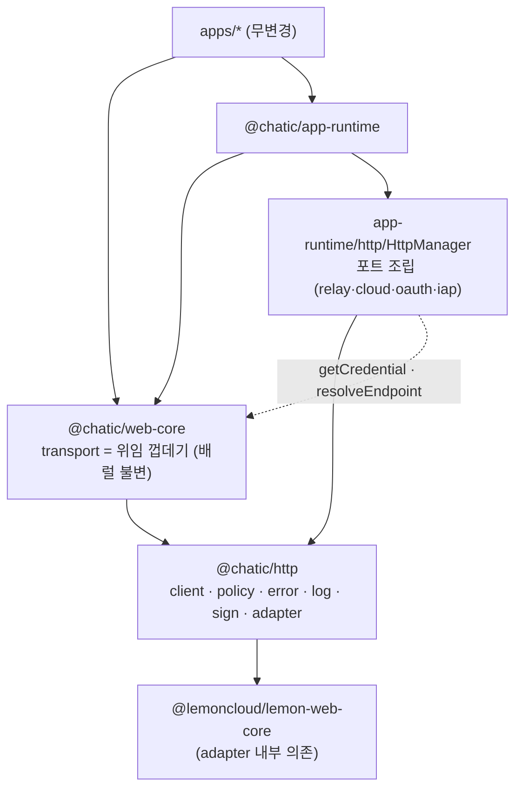
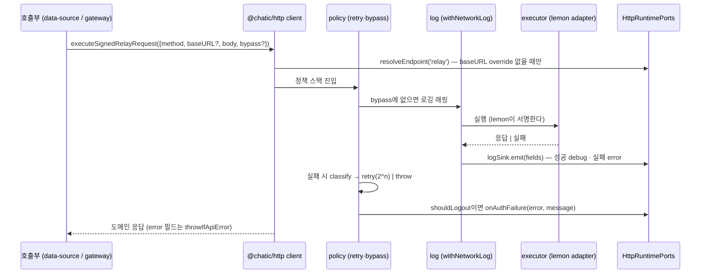

# @chatic/http — HTTP 통신 lib + HttpManager

> 상태: Live · 최종 갱신: 2026-09-07(드리프트 정정) · 관련 ADR: [ADR-0070](../../../docs/adr/0070-app-runtime-session-hub.md) (결정 3·4)

## 목적

HTTP 통신의 전부 — 요청 실행기, 전송 규칙(리트라이·에러 분류·네트워크 로깅·bypass) — 를 소유하는
플랫폼 비종속 lib.

> **2026-09-02: SigV4 서명은 이 lib에서 빠졌다.** 그 실행기로 나가던 요청은 클라우드 HTTP
> refresh 하나뿐이었고 ADR-0070이 그것을 삭제했다. 남은 서명 요청은 전부 relay(lemon adapter)이며,
> 클라우드 backend로 가는 요청(`exchange-token`·초대 조회)도 목적지만 클라우드일 뿐 relay 서명이거나
> 비서명이다. **목적지(`baseURL`)와 서명 방식(`route`)은 독립이다** — 그래서 `HttpRoute`에 `'cloud'`가
> 없다. 소켓 축의 `@lemoncloud/chatic-sockets-lib`와 같은
> 위치다: 통신하는 방법은 lib이 알고, 환경·크레덴셜·엔드포인트는 전부 주입받는다.

지금 이 규칙들은 `libs/web-core/src/transport/` 다섯 파일에 세션 스토어·env와 뒤섞여 있고,
`logBatch`의 로깅 예외 같은 의도적 우회는 주석으로만 지켜진다. 이 lib이 규칙의 주인이 되면
예외는 주석에서 계약(`bypass`)으로 올라온다.

`app-runtime`의 `HttpManager`가 이 lib을 조립한다 — `SocketManager`가 소켓 슬롯을 조립하는
것과 대칭이다. ADR-0070 5단계 중 **1단계**의 산출물이며, 앱은 아무것도 바뀌지 않는다.

## 설계 원칙

- **`@chatic/*` 런타임 의존 0.** env·세션 스토어·logger를 모른다. 필요한 것은 전부
  `HttpRuntimePorts`로 주입받는다. `@lemoncloud/lemon-web-core`는 예외적으로 내부 adapter
  의존으로 허용된다 — 단 HTTP request builder로만 쓰고, refresh를 유발할 수 있는 API
  (`init()`·`isAuthenticated()`)는 절대 호출하지 않는다(ADR-0070 결정 2 불변조건 3).
- **부수효과는 포트 뒤로.** 현재 `handleAuthError`가 하는 `alert` + `window.location` 리다이렉트
  같은 플랫폼 부수효과는 lib 안에 살 수 없다 — lib은 분류 결과(`shouldLogout`)까지만 알고,
  반응은 주입된 콜백이 한다.
- **`import.meta` 금지.** env는 조립 지점(`HttpManager`)이 읽어 값으로 넘긴다. ts-jest
  (`module: commonjs`) 테스트 가능성이 이 규칙의 검증 게이트다.
- **route가 endpoint를 전부 결정하지 않는다.** 요청은 `route`(서명 재료 선택)와 별개로 명시
  `baseURL` override를 가질 수 있다 — cloud 토큰 발급(`exchange-token`)은 아직 선택되지 않은
  대상 클라우드의 backend로 나가기 때문이다(ADR-0070 결정 3).
- **계약은 인터페이스, 구현은 클래스 + 생성자 주입**(ADR-0070 결정 0). 구현 클래스는 조립
  지점 밖으로 나가지 않는다.

## 범위

**포함 (1단계)**

- `libs/http` 신설: 실행기(`client`) · lemon adapter · SigV4 서명 · 리트라이/타임아웃 ·
  에러 분류 · 네트워크 로깅 · `bypass` 계약
- `libs/web-core/src/transport/`의 규칙 코드를 lib으로 **이관**하고, web-core는 배럴 심볼을
  유지한 채 lib에 위임하는 껍데기가 된다 (앱 무변경)
- `libs/app-runtime/src/http/HttpManager.ts` 신설 — 포트 조립

**제외 (후속 단계)**

- `gateways/`(oauth·users·clouds·subscriptions 경로·메서드 소유) — 2단계에서
  `HttpGatewayBundle`·`http-data-sources`·`httpFactory`와 함께
  ([HTTP 데이터 경로](../../data/docs/http-data-path.md) 문서 소관)
- `calcSignature`(lemon HMAC, awsSigning.ts:25)
  — 3단계 `@chatic/auth-sign` 신설 시 이관([auth-sign architecture](../../auth-sign/docs/architecture.md)).
  refresh 서명 재료라 refresh 소유권 재배선과 함께 움직여야 한다
- `transport/authRuntime.ts`(OAuth 코드 교환) — 3단계 세션 이관 소속
  ([세션 허브 architecture](../../app-runtime/docs/session/architecture.md))
- ~~`webTransport.ts`의 lemon 인스턴스 생성·sealed init·env 읽기~~ — **2026-09-01에 절반
  들어왔다.** 생성과 봉인 부팅은 `transport/lemonTransport.ts`가 갖고(아래), env 읽기는 여전히
  제외다. 계약이 금지한 것은 env를 읽는 것이지 인스턴스를 만드는 것이 아니었다 — 값은
  `LemonTransportConfig`로 주입받는다
- ~~`logBatch`·`reportIssue`의 실제 이관~~ — **2026-09-02에 들어왔다.** 와이어 어휘는
  [`gateways/report.ts`](../src/gateways/report.ts)(`ReportHttpGateway`)이고, 두 호출은
  `data`의 `report` repository를 거친다([HTTP 데이터 경로](../../data/docs/http-data-path.md)).
  1단계가 만든 `bypass: ['networkLog']` 계약의 첫 실사용자가 이것이다.
  (`reportError`는 이관 대상이 아니라 2026-09에 폐지됐다)

## 시나리오

lib이 실제로 수행하는 요청 형태다. **1단계 서술을 현행으로 갱신했다** — 아래 심볼과 경로는
`libs/http/src/gateways/**`의 것이고, 이관 전 `web-core`의 `api/auth.ts`·`transport/request.ts`
좌표는 더 이상 존재하지 않는다(§web-core 위임 껍데기는 그 기록).

1. **relay 비서명 요청** — `oauthGateway.login`(`POST {relay}/oauth/login-user`,
   [gateways/oauth.ts:96](../src/gateways/oauth.ts)). `executeRelayRequest`로 실행, 크레덴셜
   없음. `withNetworkLog`로 감싸고 200 본문의 `error` 필드는 `throwIfApiError`로 승격한다.
2. **relay 서명 요청** — `executeSignedRelayRequest`. lemon adapter의 `buildSignedRequest`가
   lemon 자체 저장소의 signing material로 서명한다.

    > 1단계가 이 자리에 적어 둔 `generateToken`(`POST /auth/0/generate-token`)은 **이관되지
    > 않았다** — 리포 전체 소비가 0이어서다([http-data-path.md](../../data/docs/http-data-path.md)
    > §실측이 삭제 후보로 올려 뒀고, `apps/admin-v2`의 주석 한 줄만 그 엔드포인트를 언급한다).
    > 서명 실행기의 현행 소비자는 3번이다.

3. **클라우드 backend로 가는 서명 요청** — `oauthGateway.exchangeToken`
   (`POST {baseURL}/oauth/exchange-token`, [gateways/oauth.ts:104](../src/gateways/oauth.ts)).
   호출부가 요청 단위 `baseURL`을 넘긴다 — endpoint 포트의 override 케이스.

    > **`'cloud'` route가 아니다.** 서명은 relay 실행기(`executeSignedRelayRequest`)가 하고
    > 목적지만 클라우드 backend다. `HttpRoute`는 `'relay' | 'oauth' | 'iap'` 셋이며
    > ([ports.ts:16](../src/ports.ts)), SigV4 실행기는 클라우드 HTTP refresh와 함께 사라졌다
    > (§경로 표).

4. **bypass 요청** — 로그 업로드(`POST /hello/report-bulk`,
   [gateways/report.ts](../src/gateways/report.ts))는 `withNetworkLog`를 건너뛴다.
   업로드 실패를 로깅하면 그 로그가 다음 flush를 밀어 무한 루프가 되기 때문이다. 예전에는
   "executeSignedRelayRequest 대신 webTransport를 직접 부른다"는 주석 관례였고, 이제는 게이트웨이가
   싣는 요청 옵션 `bypass: ['networkLog']`가 계약이다 — 호출부(app-runtime `report/logBatch.ts`)는
   전송을 조립하지 않으므로 관례를 지킬 여지 자체가 없다. 같은 요청에 `allowRecordError`도 함께
   붙는다: 200 본문의 `dropped`는 서버가 개별 엔트리에 내린 판정이지 실패한 호출이 아니라서,
   `throwIfApiError`로 승격되면 업로더가 이미 수락된 배치를 재전송한다.

리트라이 관점의 시나리오: 실패 시 `classifyError`가 유형을 판정하고
(error.ts:24) — 403은 로그아웃, 서명 불일치는
재시도 중단(로그아웃 없이 소켓 writeback 회복 대기), 네트워크·5xx는 `2^n`초 백오프 재시도,
그 외 4xx는 즉시 실패.

## 다이어그램

1단계 완료 시점의 의존 그래프. 앱과 web-core 배럴은 무변경이고, 규칙의 실체만 lib으로 내려간다.



요청 한 건의 흐름 (relay 서명 요청 기준):



## 상세 구현

### libs/http 폴더 구조

```
libs/http/src/
├── index.ts
├── client.ts                 HttpClientImpl — 서명 여부→executor 선택 + 정책 스택 (createHttpClient가 유일한 조립부)
├── ports.ts                  HttpRuntimePorts · HttpRoute · HttpLogSink (lib이 소유하는 계약)
├── adapters/
│   └── lemonWebCore.ts       lemon builder 표면(Pick)을 받아 relay 요청을 실행하는 adapter 클래스
├── transport/
│   └── lemonTransport.ts     lemon 인스턴스 생성(WebCoreFactory) + 봉인 부팅 + read-only 세션 프로브
├── policy/
│   ├── retry.ts              withRetry(2^n 백오프) · withTimeout — utils.ts 이관
│   └── bypass.ts             bypass 계약 ('networkLog' | 추후 확장)
├── error/
│   ├── classify.ts           classifyError · ErrorType · extractErrorMessage — error.ts 이관 (순수)
│   ├── credentialStale.ts    IStaleCredentialMarker — 실패에 "이 라우트 자격증명이 만료였다"를 찍는 스탬프
│   ├── attribution.ts        IFailureAttributor — 서명 실패를 만료 탓으로 볼지 판정 (포트·마커 주입)
│   └── recovery.ts           ICredentialRecoverer + PortCredentialRecoverer · NoCredentialRecovery
├── gateways/                 도메인별 HTTP 액션 (`data` 의 데이터소스만 잡는다)
│   ├── types.ts · index.ts
│   ├── oauth.ts · users.ts · clouds.ts · subscriptions.ts · report.ts
│   └── refreshAbsence.spec.ts   이 lib에도 refresh 경로가 없음을 지키는 부재 검사
├── log/
│   └── networkLog.ts         withNetworkLog · NetworkLogFields — networkLog.ts 이관 (sink 주입)
└── utils/
    └── browserNetwork.ts     isBrowserOffline — 이 lib이 navigator를 읽는 유일한 곳
```

### 포트 계약 (`ports.ts`)

ADR-0070 결정 3의 스케치를 기반으로 하되, 실제 코드가 강제하는 두 가지를 추가한다.

```ts
// 현행 (`src/ports.ts` 실측)
export type HttpRoute = 'relay' | 'oauth' | 'iap';

export interface HttpRuntimePorts {
    resolveEndpoint(route: HttpRoute): string;
    /** 이 라우트의 서명 자격증명이 이미 만료됐는지 — 서명 실패를 회선 장애와 가르는 근거. */
    isCredentialStale?(route: HttpRoute): boolean;
    /** 자격증명을 재발급하고 재시도 가능 여부를 답한다. 요청당 최대 1회. */
    recoverCredential?(route: HttpRoute): Promise<boolean>;
    /** 성공/실패 구조화 로그의 목적지. 없으면 로깅하지 않는다 (bypass의 전역판). */
    logSink?: HttpLogSink;
    /** classify가 shouldLogout을 낸 인증 실패의 반응 — throw하면 재시도 루프를 끊는다. */
    onAuthFailure?(error: unknown, message: string): void;
}
```

> **초안과 달라진 세 가지 (실측 2026-09-07).** ① `'cloud'` 라우트가 없다 — 클라우드 자격증명으로
> 서명하던 유일한 요청(클라우드 HTTP refresh)을 ADR-0070이 지우면서 SigV4 실행기와 그 자격증명
> 포트가 함께 사라졌다. 클라우드 backend는 여전히 목적지지만 `baseURL` 로 싣고 **relay 서명**을
> 탄다. ② 그래서 `getCredential` · `getIdentityToken` 포트도 없다 — 서명은 lemon adapter 안에서
> 끝난다. ③ `recoverCredential` 이 추가됐다(자격증명 만료 트랙).

- **`onAuthFailure` 추가**: 현재 `handleAuthError`(error.ts:167)가
  `alert(...)` + `window.location.href = '/auth/logout'`을 직접 수행한다. 플랫폼 비종속 lib에
  둘 수 없으므로 포트로 승격한다. web-core 위임층이 기존 동작을 그대로 구현해 넘긴다 —
  동작 변화 없음.
- **redact·truncate는 lib이 아니라 sink가 한다**: ADR-0070 결정 3의 폴더 스케치는 `log/`에
  "redact · truncate"를 두지만, 그 구현은 `@chatic/logger`
  (networkLog.ts:2) 소유라 lib이 import하면
  "`@chatic/*` 런타임 의존 0"과 모순된다. 해소: `withNetworkLog`는 원시 필드를 sink에 넘기고,
  redact/truncate는 sink 구현(HttpManager가 조립, `@chatic/logger` 사용)이 적용한다.
  **ADR 스케치에서 의도적으로 벗어나는 지점이며, ADR의 상위 원칙(의존 0)을 지키기 위해서다.**
- 서명 함수 포트(`sign`)는 없다. lemon HMAC은 `@chatic/auth-sign`(3단계에 신설)이 소유하고,
  SigV4는 그것을 쓰던 요청과 함께 사라졌으므로 이 lib이 주입받을 서명이 없다.

### 실행기 (`client.ts` · `adapters/lemonWebCore.ts`)

이관 전 `request.ts` 의 실행 경로가 둘로 갈라져 있던 것을 계승했고, 그 뒤 하나가 없어졌다:

| 경로                | 이관 전                                            | 현행                                                               |
| ------------------- | -------------------------------------------------- | ------------------------------------------------------------------ |
| relay (비서명/서명) | `webTransport.buildRequest` / `buildSignedRequest` | `LemonHttpExecutor` — 주입된 lemon builder 표면을 구동하는 adapter |
| ~~cloud~~           | 인라인 builder + `signAwsRequest`                  | **없음** — SigV4 실행기는 클라우드 HTTP refresh와 함께 사라졌다    |

**실행기는 둘인데 경로가 둘이어서가 아니다** — 같은 `LemonHttpExecutor` 를 서명/비서명 두 벌로
인스턴스화한 것이다(`client.ts` 의 `lemonUnsigned` · `lemonSigned`).

lemon 인스턴스(`WebCoreFactory.create`, webTransport.ts:151)는
**web-core에 남는다** — 생성에 `import.meta` env와 storage 선택이 필요하고, 그 격리는
`@chatic/web-config` 신설(후속)의 몫이다. lib은 자기가 쓸 최소 표면만 선언한다 — 단, 이 문서가
원래 스케치한 `Pick<WebTransport, ...>`가 아니라 **독립 인터페이스**로:

```ts
// libs/http/src/adapters/lemonWebCore.ts
export interface LemonRequestSurface {
    buildRequest(config: { method: string; baseURL: string }): LemonRequestBuilder;
    buildSignedRequest(config: { method: string; baseURL: string }): LemonRequestBuilder;
}
```

**구현 중 스케치에서 벗어난 지점**: `Pick<WebTransport, ...>`은 `WebTransport` 타입을
web-core에서 import해야 하는데, web-core가 이미 `@chatic/http`를 의존하는 상태에서 그 반대
방향 타입 import를 추가하면 순환이 생긴다. 구조적 타이핑으로 충분하므로(lemon의 `webTransport`
객체가 이 인터페이스를 그대로 만족) 독립 선언으로 대체했다 — 효과는 동일하다:
`init`/`isAuthenticated`/`getTokenStorage`가 이 타입에 **없는 것 자체가** ADR-0070 결정 2
불변조건 3(자동 refresh 유발 API 호출 금지)의 타입 레벨 강제다.

요청 옵션은 기존 `ApiRequestOptions`를 계승하고 `route`·`bypass`가 추가된다.
`allowRecordError`(200 본문의 `error` 필드가 도메인 데이터인 경우,
request.ts:24)의 의미론은 그대로 유지한다 —
`withNetworkLog`의 warn 억제(networkLog.ts:97)까지.

### lemon 인스턴스와 봉인 부팅 (`transport/lemonTransport.ts`)

인스턴스는 한 개여야 한다 — lemon 토큰 저장소가 인스턴스 안에 있어서, 둘이면 세션 상태가
쪼개진다. 그래서 소유권이 문제였고, 한동안 `@chatic/web-config`(env leaf)가 쥐고 있었다. 이 lib이
`@chatic/*`에 의존하지 않으니 생성자 입력 네 개(project·oAuthEndpoint·region·storage)를 스스로
읽을 수 없고, 그러면 누군가는 싱글턴을 쥐어야 하는데 그 "누군가"가 될 수 있는 leaf가 web-config
뿐이었기 때문이다.

**의존 0 계약이 금지하는 것은 env를 읽는 것이지 인스턴스를 만드는 것이 아니다.** 그래서 지금은
이렇게 나뉜다:

| 무엇                             | 어디                                     |
| -------------------------------- | ---------------------------------------- |
| 생성 · 봉인 부팅 · 프로브 (정책) | `@chatic/http` `createLemonWebTransport` |
| env 네 값 · 싱글턴 보유 (조립)   | `app-runtime/src/http/transport.ts`      |
| env 원본 (`import.meta` 격리)    | `@chatic/web-config`                     |

반환 타입 `SealedWebTransport`에는 **`init`·`isAuthenticated`·`getTokenStorage`가 없다.** 셋 다
lemon 자체 HTTP refresh를 부르거나 부를 수단을 넘겨주는 API이고, 결정 2 불변조건 3이 금지하는
바로 그 호출이다. 이전에는 web-config가 내보내던 인터페이스가 `init`/`isAuthenticated`를 그대로
선언하고 주석이 "부르지 마라"를 지키고 있었다 — 이제 타입이 막는다.

봉인 부팅(`startInit`)은 lemon `init()`에서 refresh만 뺀 것이다: 설정 키를 심고(`initLemonConfig`),
저장된 번들이 있으면 메모리 자격증명만 재구성한다(`buildCredentialsByStorage`). 만료 여부는 보지
않는다 — refresh 소유자는 소켓 `AuthController`이고, 그 writeback이 자격증명을 다시 만든다.
부분/손상 저장소는 부팅 실패가 아니라 "자격증명 없이 부팅"이다.

`sealLemonTransport`(SDK 생성과 분리된 순수 함수)가 이 정책의 유닛 테스트 지점이다 —
단일 비행, 실패 시 재시도, 부분 저장소 관용, 프로브가 refresh를 부르지 않음.

### 이관 시 동작 불변 항목

이관은 리팩토링이지 동작 변경이 아니다. 아래는 바뀌면 안 되는 실측 동작이다:

- `withRetry` 기본 `maxRetries = 4`, 백오프 `2^attempt × 1000ms`
  (utils.ts:23). 이관 당시 api 호출부는 `MAX_RETRIES = 2`
  (error.ts:20)를 명시적으로 넘겼다 — **그 호출부는 web-core와 함께 사라졌고, 남아 있던 상수는
  참조 0이라 2026-09 스윕에서 삭제했다.**
- 에러 분류의 순서와 특수 케이스: `INVALID_TOKEN` 문자열 → 서명 타임아웃 → 403 로그아웃 →
  **서명 불일치는 재시도 중단하되 로그아웃 안 함**(2026-08 세션 감사 §5-6의 리트라이 폭주
  수정, error.ts:58-70) → 네트워크 → 5xx → 4xx.
- `withNetworkLog`의 성공 응답 본문 미기록(업로드 부피), 실패 시 status를 메시지에 포함
  (ADR-0047 브레드크럼 가독성, networkLog.ts:104-127).
- SigV4 서명에서 `host`·`x-amz-content-sha256` 헤더 제외, `SessionToken` 조건부 부착
  (awsSigning.ts:147-163).
- **성공 응답의 `responseData` 키 자체가 없어야 한다** (값이 `undefined`인 것과는 다르다) —
  구현 중 실제로 깨뜨렸던 항목. sink의 redact 단계가 `{...fields, responseData: redact(...)}`처럼
  전체를 스프레드하면, 원본에 없던 키가 `undefined` 값으로 새로 생겨
  `expect(fields).not.toHaveProperty('responseData')`가 실패한다 — `'key' in fields` 가드로
  존재하는 키만 골라 갱신해야 한다. web-core 기존 spec(`networkLog.spec.ts`)이 이 회귀를
  그대로 잡아냈다 — `httpLogSink.ts`와 `HttpManager.ts` 양쪽에 같은 가드가 있다.

### web-core 위임 껍데기 (역사 — `@chatic/web-core` 는 삭제됐다)

> **이 절 전체가 1단계 이관 기록이다.** `@chatic/web-core` 패키지는 ADR-0070 5단계에서 삭제됐고,
> 그 안에 있던 스토어·유스케이스·훅은 `@chatic/app-runtime` 으로 들어갔다. 포트 조립은 이제
> `app-runtime/src/http/factory.ts` 하나다. 아래 표는 "무엇을 어디로 위임했는가"의 기록으로만
> 읽을 것 — 지금 그 파일들은 존재하지 않는다.

`transport/index.ts`의 배럴 5줄(`webTransport`·`request`·`awsSigning`·`authRuntime`·`networkLog`)은
불변이다. 각 파일의 처리:

| 파일            | 처리                                                                                                                                                                        |
| --------------- | --------------------------------------------------------------------------------------------------------------------------------------------------------------------------- |
| `utils.ts`      | `withRetry`를 lib의 hook 기반 `withRetry`에 위임 — `onAuthFailure`→`handleAuthError`, `onFatal`/`onExhausted`/`onRetry`→logger 바인딩. `withTimeout`은 그대로 재수출        |
| `error.ts`      | 분류는 `@chatic/http`(`classifyError`·`ErrorType`·`MAX_RETRIES`·`extractErrorMessage`·`toError`) 재수출 · `handleAuthError`(alert/리다이렉트)는 web-core에 남아 포트 구현체 |
| `networkLog.ts` | `NETWORK_LOG_TAG`·타입 재수출 + `withNetworkLog`를 `httpLogSink`(아래)에 bind                                                                                               |
| `awsSigning.ts` | `signAwsRequest`는 재수출 · `calcSignature`는 **web-core에 그대로** (3단계 이관)                                                                                            |
| `request.ts`    | 세 executor(`executeRelayRequest`/`executeSignedRelayRequest`/`executeCloudRequest`)를 lib `createHttpClient` 위에 재구성 — 시그니처·동작 불변                              |

**신설 내부 모듈 `httpLogSink.ts`** (barrel에는 없음 — `transport/index.ts`가 재수출하는 5개
파일이 아니다): `networkLog.ts`의 `withNetworkLog`와 `request.ts`의 자체 client가 같은
`HttpLogSink` 인스턴스(`@chatic/bridges` logger + `@chatic/logger` redact 바인딩)를 공유하기
위한 내부 배선. `export *`로 새지 않으므로 배럴 불변 대상이 아니다 — 실측: 이관 전후 5파일의
export 심볼 집합을 diff해 확인(바이트 단위 동일).

> **해소됨 (5단계).** 아래 두 문단은 `web-core`가 자기 몫의 `HttpRuntimePorts`를 따로 조립하던
> 시절의 기록이다. `@chatic/web-core`는 삭제됐고 조립은 `app-runtime/http/factory.ts` 하나다.

규칙 소비자가 전부 web-core 내부라는 것은 실측이다: `withRetry`·`classifyError`·`handleAuthError`·
`signAwsRequest`의 리포 전체 소비처가 web-core 안에만 있다(apps/web `utils/errors.ts`의
`withRetry`는 동명의 무관한 로컬 함수). 따라서 위임 전환의 파급 범위는 web-core 한 패키지다.

### HttpManager (`app-runtime/src/http/HttpManager.ts`)

`SocketManager`와 대칭인 조립 지점. **자기 자신은 세션을 모른다** — cloud 자격증명을 포트로
받고, 그 포트를 세션 스토어에 묶는 것은 합성 루트 `app-runtime/src/http/factory.ts` 하나다.

```ts
// libs/app-runtime/src/http/HttpManager.ts
export const createHttpManager = (
    lemonSurface: LemonRequestSurface,
    // Optional so a test can build a manager without a session behind it; omitting it only costs the
    // failure ATTRIBUTION, never the request itself.
    credentials?: CredentialStalenessPort
): HttpClient => {
    const ports: HttpRuntimePorts = {
        resolveEndpoint: route => ENDPOINT_RESOLVERS[route](),
        isCredentialStale: credentials ? route => credentials.isStale(route) : undefined,
        recoverCredential: credentials ? route => credentials.recover(route) : undefined,
        logSink: createNetworkLogSink(), // redactSensitive·truncate 적용 후 @chatic/bridges logger로
        onAuthFailure, // handleAuthError를 import하지 않고 인라인 재구현(아래 이유)
    };

    return createHttpClient(lemonSurface, ports);
};
```

> **이 샘플은 갱신된 것이다.** ADR-0070 시점 스케치는 `cloud: CloudCredentialPort` 를 받아
> `route === 'cloud'` 로 분기했다. 클라우드 자격증명으로 서명하던 유일한 요청이 사라지면서 그
> 포트도 `'cloud'` route도 없어졌고, 남은 것은 **신선도 판정과 회복** 두 짝
> (`CredentialStalenessPort`)이다 — 진단만 배선하고 처치를 안 배선하면 쓸모가 없으므로 한
> 인터페이스에 묶여 있다.

자격증명이 포트인 이유는 순환이다. `HttpManager`가 세션 스토어를 직접 읽던 동안
`session/auth`도 HTTP 클라이언트를 필요로 해서 `session` · `data` · `http`가 서로를 가리켰고,
그래서 `http/index.ts`가 존재할 수 없었다. 지금 세션을 아는 http 파일은 `factory.ts` 하나다 —
`session/store/configure.ts`가 그 폴더의 import 금지에서 유일하게 면제된 것과 같은 규칙이다.

두 지점이 원래 스케치와 다르다:

1. **포트 구현은 `credentialFreshness`를 주입받는다** (`factory.ts` →
   `new SessionCredentialAdapter(credentialFreshness)`). 어댑터가 존재하는 이유는 키가 다르기
   때문이다 — 포트는 route로 묻고(`relay`/`cloud`/`oauth`/`iap`) 신선도는 `CredentialOwner`로
   답하는데, 서명되는 route는 relay 하나뿐이어서 어댑터가 전부 relay로 접는다. 읽기는 매 호출마다
   세션을 지난다(생성 시점에 캡처하지 않는다) — 자격증명 회전이 바로 다음 요청에 반영돼야 한다.

    > 1단계 스케치에 있던 `toAwsCredentialLike`·`CloudCredentialPort`는 위 샘플 아래 주석대로
    > 함께 없어졌다.

2. **`onAuthFailure`는 `handleAuthError`를 import하지 않고 인라인 재구현.** `handleAuthError`는
   지금 `web-core`에 있고, 세션이 `app-runtime`으로 이관되는 3단계에서 이 포트 뒤로 재홈될
   예정이다 — 지금 import했다가 곧 옮겨질 함수에 의존을 거는 대신, 같은 반응(logger.error →
   `alert` → `location.href` 리다이렉트 → throw)을 인라인으로 재구현했다. 소비자가 아직 없는
   1단계 한정 임시 조치다.

1단계의 `HttpManager`는 **조립과 테스트가 목적**이다 — 실소비자(`httpFactory` →
http-data-source)는 2단계에서 붙는다. relay 경로 executor에는 web-core의 `webTransport`
인스턴스를 `LemonRequestSurface`로 좁혀(구조적 타이핑) 주입한다.

## 검증 방법

아래 4개 lib이 project reference로 연결돼 있어(`tsconfig.lib.json`의 `references`), 하나를 빌드하면
의존 그래프 전체가 함께 검증된다.

**실측 (2026-09-07)** — 1단계 당시 값에서 갱신했다. `libs/web-core` 행은 사라졌다(패키지 삭제).

| 대상               | 결과                     |
| ------------------ | ------------------------ |
| `libs/http` jest   | **13스위트 / 84케이스**  |
| `libs/app-runtime` | **62스위트 / 517케이스** |
| `tsc -b`           | 0건                      |

`libs/http` 스펙이 지키는 것: `error/classify.spec.ts`(분류) · `log/networkLog.spec.ts`(sink 목 —
redact는 sink 책임이라 raw 값으로 검증) · `client.spec.ts`(실행기 라우팅) ·
`client.credentialAttribution.spec.ts` · `client.credentialRetry.spec.ts`(자격증명 만료 귀속과
요청당 1회 회복) · `policy/retry.spec.ts`(`onAuthFailure` throw가 루프를 즉시 탈출하는지) ·
`gateways/refreshAbsence.spec.ts`(이 lib에도 refresh 경로가 없음) · 게이트웨이별 스펙 5개 ·
`transport/lemonTransport.spec.ts`.

> 1단계 문서가 들고 있던 `client.cloud.spec.ts` · `sign/awsSigV4.spec.ts` 는 없다 — SigV4 실행기와
> 함께 사라졌다.

**타입체크는 `tsc -b`** — libs에서 `tsc --noEmit`은 0건 검사 no-op이다(리포 기존 함정).
`tsc -b libs/app-runtime/tsconfig.lib.json` 하나로 http→app-runtime 전체가 project reference로
빌드된다. **실제로 걸린 함정**: `app-runtime` `tsconfig.lib.json`의 `references`에
`../http/tsconfig.lib.json`을 추가하지 않으면 `TS6059/TS6307`(rootDir 위반)로 http의 소스 파일이
느슨하게 끌려들어온다 — path mapping만으론 부족하고 project reference 등록이 필수다.
`dist/out-tsc` 잔재가 있으면 무관한 파일에서 유령 에러가 나므로 `rm -rf` 후 재실행. 반대로 참조
lib 을 **빌드하지 않으면** 새 export 가 "has no exported member" 로 뜬다 — `composite` 프로젝트는
path mapping 이 `src` 를 가리켜도 산출물(`dist/out-tsc/libs/<lib>/…`)을 읽기 때문이다. 파일을 지운
뒤에는 그 고아 `.d.ts` 도 직접 지울 것 — `tsc -b` 는 그것을 정리하지 않는다.

**의존 0은 코드 리뷰로 확인, 자동 게이트는 미구현**: `libs/http/src`에 `@chatic/*` import가 없고
`import.meta`도 없음을 수동 확인했다. ESLint `no-restricted-imports` 규칙 자체는 아직 추가하지
않았다 — 후속 항목.

```bash
rm -rf dist/out-tsc libs/*/dist
npx tsc -b libs/app-runtime/tsconfig.lib.json
for lib in http app-runtime data; do (cd libs/$lib && npx jest); done
```
