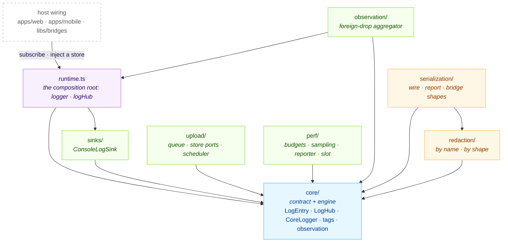
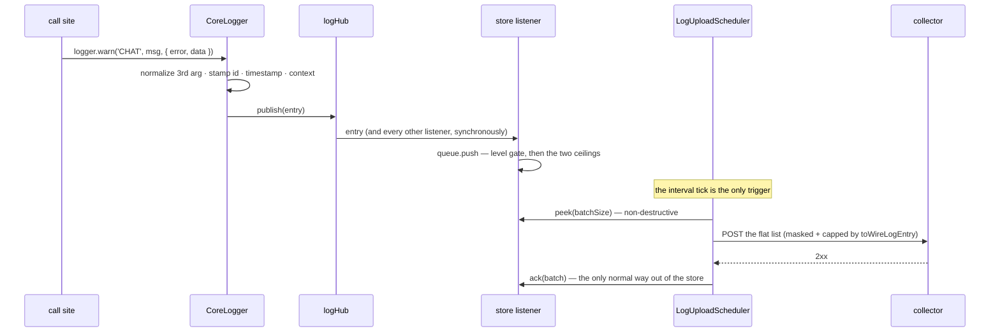

# @chatic/logger

**The platform-neutral logging core.** Every log line in every runtime — web JS, React Native TS,
Kotlin and Swift — becomes one `LogEntry`, is published to one hub, and is read by whoever
subscribed. The package owns the entry contract, the engine that stamps and broadcasts it, the
masking applied on the way out, the queue of entries the server has not accepted yet, the schedule
that empties it, and the performance budget that rides the same pipe.

This document covers the **overview and structure** only. The per-layer detail is canonical under
[`docs/`](#documents).

## Purpose

Consumers see the `@chatic/logger` barrel and nothing else. Imports that reach past it into internal
paths number **zero**, which is what lets the inside be rearranged with no blast radius.

```bash
grep -rn "@chatic/logger/" --include='*.ts' --include='*.tsx' apps libs | grep -v node_modules
```

`@chatic/bridges` re-exports this whole barrel, so `apps/web` and `apps/mobile` reach the logger
through that package rather than declaring a second dependency. An import of `logger` from
`@chatic/bridges` and one from `@chatic/logger` are the same object.

This lib **does not own where an entry ends up.** It has no transport, no persistence and no
platform sink. Signing and POSTing a batch belongs to the report repository in `libs/data`; keeping
the queue on disk belongs to `apps/web` (localStorage) and `apps/mobile` (MMKV); mirroring entries
into Crashlytics belongs to `apps/mobile`. This package decides what an entry _is_, who may see it,
and what leaves it.

It is also not the trigger catalogue. Which situations deserve a log line, at which level and under
which tag, is decided outside the repo, in the knowledge vault
(`projects/@lemoncloud-io/dou-app/log-collection/triggers.md`). `KNOWN_LOG_TAGS` mirrors that table
so a call site can be checked against it — see [docs/entries/](./docs/entries/README.md#tags).

## Design principles

1. **The core imports nothing.** `package.json` declares `dependencies: {}` and no file imports a workspace package or a third-party one. `createLogId` re-implements UUID v4 by hand rather than pull `uuid` in. Platform behaviour arrives as a listener or as an implementation of a port.
2. **Occurrence time and occurrence context are stamped at dispatch, never at send.** A queue drained days later would otherwise label every entry with the session, cloud, user and version current at _upload_ time. Ten context fields ride on the entry itself so they survive the bridge and any copy.
3. **An entry that crossed a runtime boundary is not restamped.** `ingestLogEntry` publishes as-is. The single exception is `id`, backfilled only when absent, because an entry without one can be uploaded but never acknowledged.
4. **The hub is the only way to see an entry.** There is no ring buffer and no console fallback. A listener sees what is published after it subscribes and nothing else, which makes wiring order part of the contract.
5. **Reading the store never empties it.** `peek` hands back the same entries until `ack` releases them. A destructive read loses exactly the entries of a process that died mid-send.
6. **The uploader is not a subscriber.** It holds a `LogStoreReader` and runs on its own interval. Nothing about a dispatched entry — not its level, not the queue's size — can bring a send forward.
7. **Batching happens at the server boundary and nowhere else.** Dispatch, hub delivery, the web→app bridge hop and `push` are all one entry at a time. The only boundary worth paying to batch is the one that leaves the process.
8. **The store is capped on two axes, and drops the cheapest level first.** A count alone says nothing about size; bytes alone cost a serialization per push. `debug` leads the drop order, which is what lets it be stored at all.
9. **The logging path never logs itself.** A listener runs inside `publish`, so calling `logger` there re-enters immediately; the upload path calling `logger` closes a failure loop. Both use `console`.
10. **Stateful collaborators are classes, ports are interfaces, stateless policy is a function.** Every class takes its dependencies as constructor arguments, so any of them can be built standalone in a test.
11. **Dependencies point inward, to `core/`.** Nothing outside `runtime.ts` and `perf/runtime.ts` reaches for a process-wide instance, which is what keeps the module graph acyclic.
12. **`debug` lives exactly where someone is watching.** One host flag decides whether the console runs, whether the bridge carries `debug`, and whether the store keeps it — so the three cannot disagree about what "this build is being watched" means.

## Scope

**In** — the `LogEntry` / `LogContext` / `Logger` contract, the tag catalogue mirror, the hub and the
logging engine, the console sink, masking by field name and by value shape, the serialization
surfaces (report string, bridge structure, server wire), the unsent queue with its ports and
scheduler, the structured-observation discriminator and the foreign-drop aggregator, and the
performance budget with its reporter, sampling and slot.

**Out** — the HTTP call that uploads a batch (`libs/data`'s report repository), queue persistence
and host wiring (`apps/web`, `apps/mobile`), the web→native relay and the `AppLogInfo` codec
(`libs/bridges`), the bridge message types (`libs/app-messages`), Crashlytics and the native logger
modules (`apps/mobile`), the admin console that reads the stored logs (`apps/admin-v2`), and the
trigger catalogue itself (knowledge vault).

## Structure



Every arrow points inward, to `core/`. `observation/` is the one module that reaches back to
`runtime.ts`, because an aggregator's whole job is to emit a log line of its own; nothing else in the
package touches a singleton. There is no arrow from `perf/` to `upload/` and none from `upload/` to
`sinks/` — a metric is an ordinary entry once it is published, and the uploader never subscribes.

### One entry, end to end



### Directories

```text
libs/logger/src/
├── index.ts          public barrel (8 lines of export *)
├── runtime.ts        the composition root: logger · logHub · ingestLogEntry
├── core/             8 files — the contract (LogEntry · LogContext · Logger · LogTag ·
│                     ObservationKind) and the engine (LogHub · CoreLogger · logId · logContext)
├── sinks/            2 files — the LogSink contract and ConsoleLogSink
├── redaction/        4 files — what counts as a secret, by name and by value shape
├── serialization/    6 files — the three output shapes and the shared truncation rule
├── upload/           6 files — the queue, the LogStore ports, the scheduler and its policy
├── observation/      2 files — the foreign-drop aggregator
└── perf/             9 files — budgets, run sampling, reporter, sink and process slot
```

39 source files, 21 spec files, 2,594 lines of non-test code.

Four names are not where their filename suggests. `LogSink` lives in `sinks/ConsoleLogSink.ts` —
there is no `LogSink.ts` to open. `LogStoreReader`, `LogStoreWriter` and `toLogListener` all live in
`upload/LogStore.ts`. `PerfMetricReporter` (the interface) and `NOOP_PERF_METRIC_REPORTER` live in
`perf/PerfMetricReporter.ts` beside the implementation class, which is called
`BudgetedPerfMetricReporter`. `ObservationKind` and `ObservationData` live in `core/observation.ts`,
which holds no code at all — it is a type file.

## Usage

Logging is four calls, and only the first appears in ordinary code.

```ts
import { logger } from '@chatic/bridges'; // or '@chatic/logger' — the same object

// Every level takes the same third argument.
logger.info('CHAT', 'room opened', { channelId });
logger.warn('SYNC', 'channel delta failed', { error, data: { since } });
logger.error('SOCKET', 'request rejected', err); // error also accepts a bare exception
```

```ts
// Boot, before anything logs.
setLogContextProvider(() => ({ runId, uid, cid, sid, route, appVersion, webVersion, os, model }));

// A destination. Anything that wants to see entries subscribes.
const unsubscribe = logHub.subscribe(createConsoleListener({ timestamps: true }));

// An entry stamped in another runtime, republished without being restamped.
ingestLogEntry({ ...fromBridge, source: 'native' });
```

Three rules hold.

1. **The tag comes from the catalogue.** `LogTag` accepts any string on purpose — a native shell older than the web bundle must be able to send a tag this build has never heard of — but the 41 catalogue tags are literals, so a typo is visible in the editor. See [docs/entries/](./docs/entries/README.md#tags).
2. **The third argument means the same thing at every level.** `{ error, data }` is unwrapped into the entry's own fields wherever it appears. Writing it at `info` used to bury the payload at `data.data`; it no longer can.
3. **A listener must not call `logger`.** It runs synchronously inside `publish`. The full listener contract is in [docs/pipeline/](./docs/pipeline/README.md#what-a-listener-must-satisfy).

### Wiring

This lib assembles nothing beyond its own two singletons. Who subscribes, where the queue is
persisted and which store the uploader reads are all decided by the hosts.

```text
apps/web  runtime/logging/
  ├─ logContext.ts        setLogContextProvider(...)        ← first, before anything logs
  ├─ consoleListener.ts   logHub.subscribe(console sink)    ← web-standalone
  ├─ logUploader.ts       logHub.subscribe(queue.push)      ← the store listener
  │                       createLogUploadScheduler({ store, send, isEnabled, onSettled })
  │                       localStorage persistence, tab-scoped, with orphan adoption
  └─ logQueueView.ts      the read-only view the debug monitor and the loss observer share

libs/bridges  setupBridgeLogger()  logHub.subscribe(nativeForwarder)   ← hybrid only, one SendLog per entry

apps/mobile  services/provider.ts  logHub.subscribe(×3): Crashlytics · MMKV store · console
             webview/hooks/useLogHandler.ts   SendLog → ingestLogEntry
```

In a hybrid run the web relays each entry to the app and the app's MMKV store becomes the uploader's
source; in a standalone tab the web's own queue is both. Which one the uploader reads is a
`LogStoreReader` injected at boot — the scheduler cannot tell the difference, and that is the point.

## Scenarios

### 1. A line logged in a standalone browser tab

`logger.warn('SYNC', …)` reaches `CoreLogger.dispatch`, which normalizes the third argument, reads
the context provider, and stamps `id` and `timestamp`. `logHub.publish` hands the same object to
every listener in turn: the console sink prints it, the store listener pushes it into
`LogUploadQueue`. Sixty seconds later the scheduler peeks a batch of 50, `toWireLogBatch` masks and
caps it, and a 2xx answer releases exactly those entries. Nothing else empties the queue.

### 2. The same line inside the app's WebView

Identical up to `publish`. There the native forwarder listener turns the entry into one `SendLog`
message; the app republishes it with `ingestLogEntry`, and from that moment it is indistinguishable
from an entry born in native code. The web keeps its own copy until the app answers a read — the
boot window arrives before the app has proved it can serve a store, and that window is the part of a
session that explains the rest of it.

### 3. An entry born in Kotlin or Swift

`NativeLogger.log` mirrors to Logcat/NSLog and emits an event that the RN bridge turns into
`ingestLogEntry({ source: 'native' })`. The timestamp and context are whatever the emitter recorded;
this package does not touch them. `source` is a label for readers, never a branch.

### 4. The queue reaches its ceiling

`push` enforces 500 entries and 512KB together. Over either, entries are marked doomed by level in
`debug → info → warn → error` order, oldest first inside a level, until both axes fit again. The
queue counts what it evicted for the life of the run and never resets that total — it cannot log the
loss itself (principles 9 and 6), so a third party reads the counter later and writes one line.

### 5. The server keeps refusing

A 5xx or a transport failure backs off 5s → 30s → 2m, resending the same entries with their original
ids so the server upserts rather than duplicates. After five attempts the batch is released and
dropped. That cap is what guarantees the client terminates: a server that answers 5xx to something
it will never accept cannot keep a client resending forever, and termination does not depend on it
choosing 4xx.

### 6. Two values that should match do not

A producer compares them itself and, only when they disagree, writes one `warn` with
`data.observation` naming the family. The stored logs cannot be filtered by value — the admin list
narrows on `level`, `runId` and date, and the payload arrives inside a length-capped string — so the
verdict has to be taken on the client and the split has to be one key with a closed set of values.
See [docs/observations/](./docs/observations/README.md).

## Documents

| Folder                                              | What it covers                                                                                                            |
| --------------------------------------------------- | ------------------------------------------------------------------------------------------------------------------------- |
| [docs/entries/](./docs/entries/README.md)           | The entry contract. `LogEntry`, the ten context fields, the four levels, the 41-tag catalogue, the third argument         |
| [docs/pipeline/](./docs/pipeline/README.md)         | Dispatch, the hub, and the listeners. What a listener must satisfy, wiring order, the three listeners per host            |
| [docs/upload/](./docs/upload/README.md)             | The queue and the schedule. The two ceilings and the drop order, the store ports, backoff and give-up, **naming history** |
| [docs/redaction/](./docs/redaction/README.md)       | Masking and serialization. The two masking axes, the three output shapes, where an unmasked value can still escape        |
| [docs/observations/](./docs/observations/README.md) | Structured entries. The `data.observation` discriminator, the ten families, and the rules a producer follows              |
| [docs/perf/](./docs/perf/README.md)                 | The performance budget. Five scenarios and their targets, run sampling, the reporter and its seams                        |

## How to verify

```bash
npx tsc -b libs/logger/tsconfig.lib.json     # the lib
npx tsc -b libs/logger/tsconfig.spec.json    # the 21 spec files
npx jest --config libs/logger/jest.config.js
```

- Type checking must be `tsc -b`. Inside `libs/logger`, `tsc --noEmit` checks zero files and succeeds.
- **The two type checks are separate on purpose.** `tsconfig.lib.json` excludes `*.spec.ts`, and jest does not type check at all — the base sets `isolatedModules`, so ts-jest transpiles and a fixture that has drifted from the type it imitates surfaces as `… is not a function` at runtime. `npx tsc -b libs/logger/tsconfig.json` runs both, because `tsconfig.json` references both projects.
- `tsconfig.spec.json` must not set `module: "commonjs"`. The base sets `moduleResolution: bundler`, which rejects it with TS5095 — the config then cannot compile at all, which is how these tests went years without a check.
- Every directory has specs except the barrels: 3 in `core`, 5 in `perf`, 4 in `redaction`, 3 in `serialization`, 3 in `upload`, 1 each in `sinks` and `observation`, plus `runtime.spec.ts`. The commands above are what answers whether they pass, not this sentence.
- Downstream: a changed barrel identifier reaches `libs/bridges`, `libs/data`, `libs/http` and `libs/app-runtime` directly, and through `libs/bridges`' re-export it reaches `apps/web`, `apps/desktop-web` and `apps/mobile` as well (`apps/desktop` aliases the package in its electron-vite config). `.github/workflows/verify.yml` type checks every one of those except `desktop-web` and `@chatic/mobile`, so those two are the ones to run by hand.
- A stale `dist`/`out-tsc` produces phantom errors after a directory moves. `rm -rf` and look again. The lib and spec projects emit to different directories (`dist/out-tsc` and `dist/out-tsc/logger-spec`) so they cannot overwrite each other's declarations.
