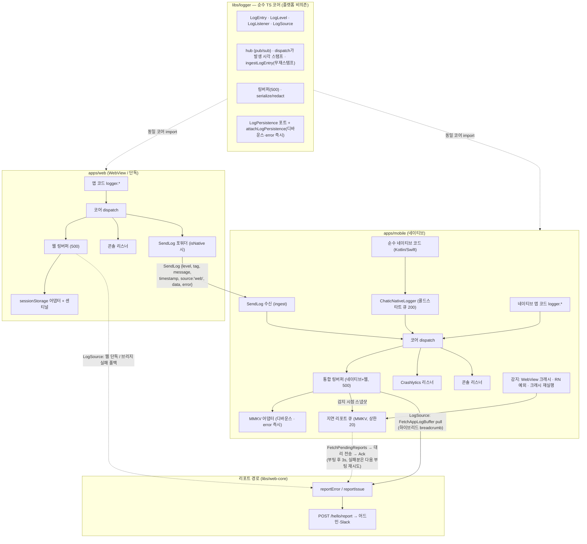
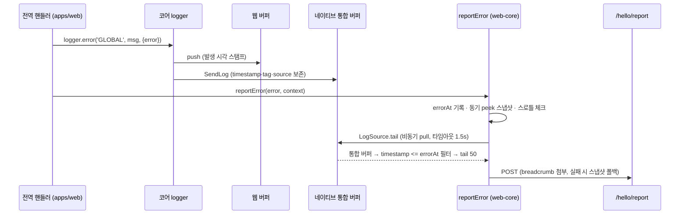
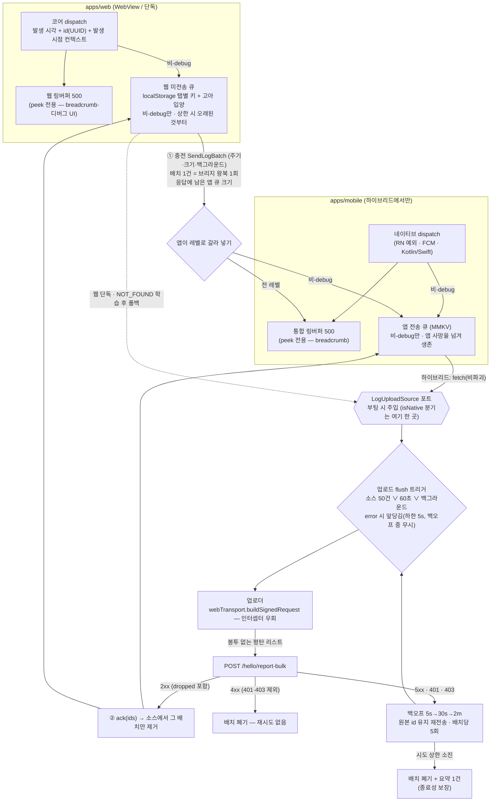
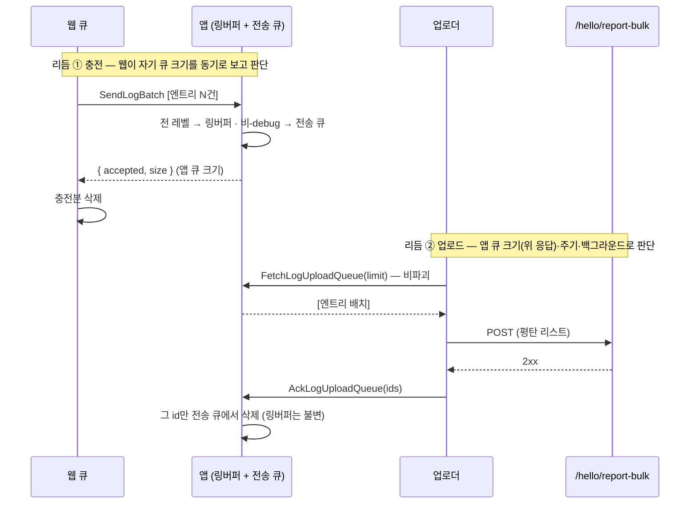

# 통합 로깅 아키텍처 (Unified Logging)

> 상태: Approved · 최종 갱신: 2026-08-21
> · 관련 ADR: [ADR-0063](../../../docs/adr/0063-log-upload-source-port-and-native-charge-queue.md) (업로드 소스 포트 · 앱 전송 큐 · 배치 충전) · [ADR-0047](../../../docs/adr/0047-unified-logging-core-and-report-traceability.md) (통합 로깅 코어. 배경: [ADR-0029](../../../docs/adr/0029-error-report-categorization-and-enrichment.md), [ADR-0017](../../../docs/adr/0017-issue-report-floating-widget.md))
> · **배치 업로드의 클라이언트 구조 결정은 ADR-0063이 정본이다.** 실행 계획·서버 계약 회신은 리포 밖 knowledge vault
> `projects/@lemoncloud-io/dou-app/log-collection` (`plans.md` · `client-upload-spec.md`)에 있다 — 2026-08-21 기준 그 레인은
> vault 브랜치 `feat/2026-08-13-dou-log-collection-lane`에 있고 아직 머지되지 않았다.
>
> **⚠️ 이 문서는 지금 개정 중이다(Proposed).** `시나리오 S8–S10`·`다이어그램`의 배치 업로드 부분·`상세 구현 > 배치 업로드`는
> ADR-0063이 정한 목표 구조를 서술하며, **아직 코드가 그렇게 되어 있지 않다.** 현행 코드와의 차이는 문서 끝 `구현 체크리스트`가 담는다.

## 목적

`apps/web`과 `apps/mobile`에서 발생하는 모든 로그(웹 JS · RN/TS · 순수 네이티브)를 **하나의 로깅 계약(`LogEntry`)** 으로 수렴시키고, 하이브리드에서는 네이티브 통합 버퍼에, 웹 단독에서는 웹 버퍼에 손실 없이 모아, 에러/이슈 리포트(`/hello/report`)의 breadcrumb으로 어드민에서 추적 가능하게 한다.

여기에 더해 **리포트 발생 여부와 무관하게 기기에 쌓인 로그를 배치로 상시 업로드한다**(2026-08-18 개정). 리포트 첨부 모델은 에러가 나야만 로그가 서버에 닿고, breadcrumb을 `peek`로 뜨는 탓에 연속 에러에서 같은 구간이 반복 저장된다 — `poll`로 바꾸면 앞선 리포트가 로그를 소비해 뒤따르는 리포트의 인과가 끊긴다. 전송을 리포트에서 떼어내면 두 문제가 함께 사라진다.

해결한 문제: 로깅 타입 3중화(코어 `LogEntry` / 모바일 `LogTag`+위치인자 / wire `AppLogInfo`)로 브리지 경계마다 정보가 손실되고(tag 치환, timestamp 재스탬프, error 시 data 유실), 크래시·리소스 실패·네이티브 예외는 감지망 밖이며, `[mobile] script-error` 같은 opaque 리포트가 어드민에서 추적 불가능했다.

## 설계 원칙

1. **코어는 순수 TS.** `libs/logger`는 DOM·React Native·MMKV·Firebase 등 어떤 플랫폼도 import하지 않는다. 플랫폼 동작은 전부 `LogListener` 또는 포트(`LogPersistence`)의 어댑터로 코어 바깥에 배선한다.
2. **발생 시각은 dispatch가 스탬프한다.** 경계(브리지, 큐, 지연 전송)를 건너온 엔트리는 `ingestLogEntry`로 재스탬프 없이 적재한다. 지연 전송되는 리포트도 감지 시각(`occurredAt`)을 싣는다.
3. **경계를 건널 때 정보를 보존한다.** 출처는 tag 치환이 아니라 `source: 'web' | 'native'` 필드로 구분하고(로컬 런타임 발생분은 필드 없음), 원본 tag·timestamp·data·error를 그대로 나른다.
4. **breadcrumb 조회는 항상 `peek`.** `poll`(소비)은 배출형 소비자(예: 후속 주기 업로드) 전용이다.
5. **병합 버퍼의 소유자는 가장 바깥 셸.** 하이브리드는 네이티브 버퍼, 웹 단독은 웹 버퍼가 진실의 원천이다 (`LogSource` 라우팅).
6. **캡처는 죽지 않는 쪽에서.** 크래시류는 사후 감지(웹: 센티널, 네이티브: Crashlytics 재실행 감지)로 잡고, signal handler를 DIY하지 않는다.
7. **서명 전송은 웹 세션 단일 경로.** `/hello/report` 토큰은 웹 세션만 보유하므로 네이티브 감지분은 지연 큐에 쌓고 웹이 대리 전송한다.
8. **로그 전달 경로 자신은 `logger`로 로깅하지 않는다.** 하이브리드에서 `createNativeForwarder`가 엔트리마다 `NativeBridgeAdapter.postMessage`를 호출하므로, 그 **송신 경로** 안에서 `logger`를 부르면 로그 → forwarder → 전송 실패 → 로그로 무한 재귀한다(링버퍼가 500칸을 채울 때까지 폭주하는 것을 테스트로 재현했다). 송신 경로는 `console`만 쓴다 — 전송이 깨진 상황에선 브리지 너머로 보낼 방법이 없으니 잃는 것도 없다. **수신 경로**(`handleNativeMessage`, `AppBridgeHost.handleMessage`, `JsonProtocol.decode`)는 이 제약이 없으므로 `logger`를 써서 breadcrumb에 남긴다. 계약은 [NativeBridgeAdapter.spec.ts](../../bridges/src/web/adapters/NativeBridgeAdapter.spec.ts)가 고정한다.
9. **발생 시점 컨텍스트는 엔트리가 들고 다닌다.** `runId`·`sid`·`uid`·`cid`·`appVersion`·`webVersion`·`route`는 저장 시점에 이미 달라져 있을 수 있으므로 dispatch가 그 순간의 값을 엔트리에 박는다. 전송 시점 스탬프는 금지 — 오프라인 큐가 며칠 뒤 배출되면 사이트·사용자·클라우드·버전 라벨이 통째로 오염된다. 2번 원칙(발생 시각)의 확장이며, 같은 이유로 `ingestLogEntry`는 컨텍스트도 재스탬프하지 않는다.
10. **미전송 큐는 링버퍼와 다른 물건이다.** 링버퍼(500)는 "최근 무슨 일이 있었나"를 보는 창이라 탭과 함께 죽어도 되고 `peek`가 기본이다. 미전송 큐는 "아직 서버에 못 보낸 것"이라 **지속성이 존재 이유**고 성공 응답 전에는 아무것도 지우지 않는다(at-least-once). 저장소·키·수명이 전부 다르다. **이 분리는 웹과 앱 양쪽에 각각 있어야 한다** — 한쪽에만 두고 다른 쪽의 링버퍼를 배출형으로 쓰면 4번 원칙이 그 자리에서 깨진다(ADR-0063이 고친 결함이 정확히 이것이었다).
11. **업로더는 자기 자신을 로깅하지 않는다.** 8번(전송 경로에서 logger 금지)의 HTTP판이다. 업로드 요청이 네트워크 인터셉터를 타면 `업로드 실패 → error 엔트리 → flush 앞당김 → 재시도 → 또 실패`의 피드백 루프가 성립한다.
12. **업로더는 자기가 어디서 가져오는지 모른다.** 배출 소스는 `LogUploadSource` 포트로 명세하고, 하이브리드/웹 단독 분기는 부팅 시 **주입 한 곳**에만 존재한다 — 5번 원칙(가장 바깥 셸이 소유)을 breadcrumb에서 업로드로 확장한 것이다. 소스가 무엇이든 배출은 **비파괴 `fetch` → 전송 → `ack`** 2단계다. 파괴적 단발 읽기는 전송이 끝나기 전에 사본을 지워, 그 사이 프로세스가 죽으면 엔트리가 어디에도 남지 않는다.

## 범위

**포함**: (배치 업로드 개정분) 엔트리 `id` + 발생 시점 컨텍스트 · 미전송 영속 큐 · 업로더(3중 flush·백오프·응답 처리) · debug 배치 단위 판정 · 네이티브 버퍼 `poll` 합류 · 원격 스위치. (기존) 코어 계약 단일화(모바일 `LogService`를 코어 위임으로 대체) · `SendLog` 페이로드 보존 · `LogPersistence` 포트(모바일 MMKV, 웹 sessionStorage) · `LogSource` breadcrumb 라우팅 · 감지 확장(리소스/CSP/페이지 크래시/WebView 크래시/RN 전역 예외/네이티브 크래시 사후) · 순수 네이티브 로그 합류(`ChaticNativeLogger` 이미터) · 지연 리포트 큐+웹 대리 전송 · 추적성(P1 정직화, P2 주입 스크립트 가드, 요청 URL·메서드 노출, 신규 카테고리 6종) · 레거시 `__console__` 제거.

**제외**: [triggers.md] 카탈로그 전면 적용(후속 트랙 — 이 개정은 운반 장치만 만든다) · 자동 error 리포트 제거(전환 조건 충족 후 별도 트랙) · 로그 보존·삭제 정책(서버 미정) · 동적 원격 로그 제어(스위치를 읽는 자리까지만) · P3 소스맵 심볼리케이션(이 트랙 밖에서 별도로 해결됐다 — [error-reporting.md의 "minified 스택 읽기"](../../web-core/docs/error-reporting.md#minified-스택-읽기)) · fingerprint 개선 · breadcrumb redact 정책 변경 · OS 전체 로그 스트림 · `apps/desktop` 일체.

## 시나리오

**S1 — 웹 단독에서 에러 발생.** uncaught 예외 → [app.tsx](../../../apps/web/src/app/app.tsx)의 전역 핸들러가 ① `logger.error('GLOBAL', …)`로 버퍼 적재(발생 시각 스탬프) ② `reportError`가 `errorAt` 기록 + 동기 스냅샷 후 스로틀 통과 시 breadcrumb 첨부해 POST. sessionStorage 어댑터가 1초 디바운스(error 레벨은 즉시, 최소 간격 100ms)로 버퍼를 영속화.

**S2 — 하이브리드(WebView)에서 에러 발생.** S1의 ①은 동일하고, 웹 로그는 이미 `SendLog`(timestamp·원본 tag·`source:'web'`)로 네이티브 통합 버퍼에 합류해 있다. `reportError`는 `LogSource`(=`nativeMergedLogSource`)로 통합 버퍼를 pull → `timestamp <= errorAt` 필터 → tail 50 첨부. 브리지 실패·1.5초 타임아웃 시 에러 시점 웹 스냅샷으로 폴백.

**S3 — WebView 프로세스 크래시.** [AppWebView](../../../apps/mobile/src/app/webview/AppWebView.tsx)가 iOS `onContentProcessDidTerminate` / Android `onRenderProcessGone`에서 그 순간의 통합 버퍼 스냅샷 + 감지 시각 + `webview-crash`를 지연 리포트 큐(MMKV)에 저장 후 리로드 → 재부팅된 웹이 세션 준비 후 pull해 대리 전송.

**S4 — 순수 네이티브 크래시.** 프로세스 사망, Crashlytics가 스택 캡처. 다음 실행에서 `didCrashOnPreviousExecution()` 확인 → MMKV에 살아남은 직전 세션 버퍼를 breadcrumb으로 `native-crash` 큐잉 → S3과 동일 대리 전송. 스택은 Crashlytics 콘솔에서 대조한다(이원 체계) — **대조 축은 `run_id`다.** 부팅 시 `crashlytics().setAttribute('run_id', NATIVE_RUN_ID)`로 세션에 찍어두므로, 어드민 리포트의 runId로 Crashlytics를 검색하거나 반대로 Crashlytics 크래시의 runId로 그 실행의 업로드 로그 전체를 좁힐 수 있다. **Crashlytics는 업로드 경로 밖의 두 번째 sink라 마스킹을 스스로 해야 한다** — `dispatch`는 원본 `data`를 버퍼에 넣고 마스킹은 `safeStringify` 안에서만 일어나므로, `entry.data`를 직접 읽는 쪽은 무조건 `safeStringify`/`redactSensitive`를 태운다.

**S5 — 순수 네이티브 코드 로그.** Kotlin/Swift 코드가 `NativeLogger.log(level, tag, message, throwable?)` 호출 → Logcat/NSLog 미러 + `ChaticNativeLog` 이벤트(JS 준비 전이면 네이티브 큐 200건 보관, JS의 `ready()` 신호에 일괄 flush) → `ingestLogEntry`(`source:'native'`) → 통합 버퍼 합류. Android 푸시 서비스(`ChaticFirebaseMessagingService`)가 첫 채택 콜사이트다.

**S6 — 사용자 이슈 리포트.** 클릭 시점이 기준이므로 필터 없이 `collectBreadcrumbs` tail 50 첨부([buildReportContext](../../../apps/web/src/app/features/feedback/lib/buildReportContext.ts)). 스로틀 없음.

**S8 — 평시 배치 업로드, 웹 단독.** 앱 코드가 `logger.*`를 부르면 dispatch가 발생 시각·`id`(UUID)·발생 시점 컨텍스트를 박아 링버퍼와 **웹 미전송 큐** 양쪽에 넣는다(`debug`는 링버퍼에만 — 큐 입구에서 걸러진다). 업로더의 소스는 웹 큐 자신이다. ① 큐 50건 ② 60초 경과 ③ 백그라운드 진입/`pagehide` 중 먼저 오는 것에 flush하고, `POST /hello/report-bulk`가 2xx면 그 배치에 실린 엔트리만 `ack`으로 제거한다.

**S8h — 평시 배치 업로드, 하이브리드.** 두 리듬이 독립적으로 돈다.

1. **충전**: 웹 큐가 일정량 쌓이거나 주기가 되면(또는 백그라운드 진입) 웹이 **배치 하나**를 `SendLogBatch`로 앱에 넘긴다. 로그 건당 브리지 왕복이던 것이 주기당 1회가 된다. 앱은 받은 페이로드를 **레벨로 갈라 넣는다** — 전 레벨은 통합 링버퍼(breadcrumb), 비-`debug`만 **앱 전송 큐**(MMKV). 응답에 남은 앱 큐 크기를 실어 보내므로 웹은 업로드 리듬의 크기 트리거를 그것으로 판단한다. 충전이 성공하면 웹 큐에서 그 엔트리를 지운다.
2. **업로드**: 업로더의 소스는 **앱 전송 큐**다. `FetchLogUploadQueue`(비파괴)로 배치를 받아 서버에 보내고, 2xx면 `AckLogUploadQueue(ids)`로 앱에서 지운다. 전송 실패 시 엔트리는 앱 MMKV에 그대로 남아 다음 주기·다음 부팅에 재시도된다.

네이티브 발원 로그(S5·RN 전역 예외·FCM)는 dispatch 시점에 링버퍼와 앱 전송 큐 양쪽에 들어가므로, 한 배치에서 웹 로그와 자연히 병합된다. 중복 충전(응답 유실 후 재시도)은 큐의 `id` 디둡이 막고, 서버도 `id` 업서트라 이중 안전망이다.

**S8f — 구버전 앱·브리지 실패 폴백.** `SendLogBatch`/`FetchLogUploadQueue`는 신규 메시지라 구버전 앱은 `NOT_FOUND`로 거절한다. 웹은 그 코드를 **한 번 배우고**(`NativeDBAdapter`의 learn-once 관용구) 그 세션 내내 웹 큐 직송(=S8)으로 내려간다. 핸드셰이크의 `supportedWebMessages`를 기다리지 않는 이유는 그것이 비동기로 도착해 첫 flush와 레이스가 나기 때문이고, 같은 판단을 [NativeDBAdapter.ts:43-73](../../data/src/data/local/storages/NativeDBAdapter.ts)이 이미 했다. **웹은 앱 경로가 막혀도 자기 로그를 계속 보낸다** — 앱에 종속되지 않는 것이 이 폴백의 목적이다.

**S9 — error가 낀 배치.** error 엔트리가 dispatch되면 다음 flush를 앞당긴다(즉시 단건 전송은 하지 않는다 — 최소 간격 5초, 백오프 재시도 중에는 앞당김 무시). 하이브리드에서는 충전도 함께 앞당겨진다 — 앱 큐에 닿지 않은 엔트리는 업로더가 볼 수 없기 때문이다. `debug`는 큐에 없으므로 동봉되지 않는다(링버퍼·breadcrumb에는 언제나 남는다).

**S10 — 오프라인·크래시 구간 회수.** 업로드가 실패하면 5s → 30s → 2m 백오프로 재시도하되 **배치당 시도 상한 5회**를 둔다 — 소진하면 그 배치를 폐기하고 요약 1건만 남긴다(엔트리를 큐로 되돌리지 않는다). 되돌리면 같은 엔트리가 영원히 재시도 대상이 되어 무한 재전송이 그대로다. **이 상한 덕분에 인증 실패가 4xx로 오든 5xx로 오든 배치는 반드시 종료된다** — 클라이언트의 종료성이 서버의 상태 코드 선택에 의존하지 않는다. 4xx는 원칙적으로 즉시 폐기하지만 **401·403은 재시도한다** — 그건 배치에 대한 판정이 아니라 "지금 세션이 없다"는 지나가는 상태이고, 큐가 로그아웃을 넘겨 살아남는 이상 무세션 구간에서 버리면 다음 세션이 부칠 수 있었던 엔트리를 잃는다. 무한 재시도는 위의 시도 상한이 막는다. 그 전까지는 성공 응답 없이 큐에서 아무것도 지우지 않는다. 재전송은 원본 `id`를 그대로 쓰므로 서버가 문서 id 업서트로 덮어써 중복이 생기지 않는다. 큐가 상한에 닿으면 **오래된 것부터** 버린다(`debug`는 애초에 큐에 들어오지 않는다).

저장소는 소스에 따라 다르다. **웹 큐**는 localStorage에 탭별 키로 남아 탭이 닫히거나 WebView가 죽어도 살아남고, 다음 부팅에서 하트비트가 끊긴 **고아 큐를 입양**해 합쳐 배출한다. **앱 큐**는 MMKV라 앱이 죽어도 남으며 탭 개념이 없어 입양도 필요 없다 — 하이브리드에서 웹 로그가 앱 큐로 옮겨지고 나면 그 엔트리는 WebView 프로세스 사망을 넘겨 살아남는다(현행 대비 개선). 두 큐 모두 **로그아웃을 넘겨 유지하고, opt-out에서는 비운다** — 엔트리가 dispatch 시점의 `uid`/`cid`를 스스로 들고 있어(9번 원칙) 다음 사람이 로그인해도 계정이 섞이지 않지만, "수집하지 말라"는 의사에는 적재분이 남아 나가면 어긋난다.

**S7 — 웹 페이지 크래시 사후 리포트.** 부팅 시 alive 센티널이 남아 있으면(직전 세션이 pagehide 없이 종료) 직전 세션의 영속 버퍼를 breadcrumb으로 `page-crash` 리포트. 직전 세션 로그는 새 세션 버퍼로 복원하지 않는다 — 크래시 리포트의 몫이다.

## 다이어그램

reportError의 시퀀스(S2 기준):

배치 업로드 파이프라인 (S8–S10). 저장소가 **넷**이고 그중 링버퍼 둘은 배출 경로에서 완전히 빠져 있다는 것이 요점이다 — 4번·10번 원칙:

충전과 업로드가 왜 별개 리듬인지 (S8h):

**왜 웹 엔트리가 브리지를 두 번 타는가** — 충전으로 올라갔다가 fetch로 내려온다. 둘 다 배치라 주기당 2회이며, 로그 건당 1회였던 현행보다 싸다. 그 대가로 하이브리드의 배출 소스가 하나로 줄어 디둡·순서·용량을 한 곳에서 관리하고, 웹 로그가 MMKV 내구성을 얻는다.

## 상세 구현

### 코어 (`libs/logger/src`)

| 파일                                    | 역할                                                                                                                                           |
| --------------------------------------- | ---------------------------------------------------------------------------------------------------------------------------------------------- |
| [types.ts](../src/types.ts)             | `LogEntry`(+`source?: LogOrigin`), `LogLevel`, `LogListener`, breadcrumb용 `LogSource { tail(count) }`                                         |
| [logger.ts](../src/logger.ts)           | dispatch(발생 시각 스탬프) · `ingestLogEntry`(경계 통과분 무재스탬프 적재) · `logBuffer.load`(복원분을 부팅 로그 앞에 프리펜드) · 용량 500     |
| [persistence.ts](../src/persistence.ts) | `LogPersistence { load/save }` 포트 + `attachLogPersistence`(디바운스 1s, error 즉시 flush·최소 간격 100ms, `restore` 옵션, teardown 시 flush) |
| [serialize.ts](../src/serialize.ts)     | `SerializedLog`(+`source` 패스스루), 예산 40k/2k                                                                                               |

### 환경 배선 (`libs/bridges/src/logger`)

| 파일                                                              | 역할                                                                                                                                                                                                                                                                                                                                                            |
| ----------------------------------------------------------------- | --------------------------------------------------------------------------------------------------------------------------------------------------------------------------------------------------------------------------------------------------------------------------------------------------------------------------------------------------------------- |
| [logSource.ts](../../bridges/src/logger/logSource.ts)             | **breadcrumb 라우팅의 집.** `webBufferLogSource`(기본) · `setReportLogSource`(하이브리드 교체) · `collectBreadcrumbs`(headroom 20 + errorAt 필터 + 1.5s 타임아웃 + 폴백). web-core가 아닌 bridges에 있는 이유: web-core 배럴은 `import.meta`를 쓰는 transport를 끌고 와 CJS 테스트 환경을 깨고, 환경 배선이라는 성격도 bridges(`setupBridgeLogger`의 집)에 맞다 |
| [nativeForwarder.ts](../../bridges/src/logger/nativeForwarder.ts) | `SendLog`에 `timestamp`·`source:'web'` 포함 (additive — 구버전 앱은 무시)                                                                                                                                                                                                                                                                                       |

### wire 타입 (`libs/app-messages`)

[model/common.ts](../../app-messages/src/types/model/common.ts): `SendLogPayload.timestamp/source`, `AppLogInfo.source`, `PendingReportInfo {id, category, message?, stack?, detectedAt, logs?, extra?}` + `FetchPendingReports`/`AckPendingReports` 메시지 (web-message·app-message·response 맵 등록).

### 모바일 (`apps/mobile`)

| 파일                                                                                                                                                                                                                   | 역할                                                                                                                                                                                                                                                                                                                                                                                                                                  |
| ---------------------------------------------------------------------------------------------------------------------------------------------------------------------------------------------------------------------- | ------------------------------------------------------------------------------------------------------------------------------------------------------------------------------------------------------------------------------------------------------------------------------------------------------------------------------------------------------------------------------------------------------------------------------------- |
| [services/log/LogService.ts](../../../apps/mobile/src/app/services/log/LogService.ts)                                                                                                                                  | 코어 위임 클래스 (provider 배선·DI 타입 유지용). `LogTag` union은 [types.ts](../../../apps/mobile/src/app/services/log/types.ts)의 열린 `string` + `LOG_TAGS` 상수로 대체                                                                                                                                                                                                                                                             |
| [services/log/buffer/LogBufferService.ts](../../../apps/mobile/src/app/services/log/buffer/LogBufferService.ts)                                                                                                        | 코어 버퍼 파사드 + MMKV 영속화 배선. peek/poll은 브리지 안전 형태로 평탄화. 자체 큐·링버퍼는 삭제됨                                                                                                                                                                                                                                                                                                                                   |
| [services/log/persistence.ts](../../../apps/mobile/src/app/services/log/persistence.ts)                                                                                                                                | `MmkvLogPersistence` (동기, 구버전 레코드 정규화). 배럴 미노출 — react-native-mmkv 부수효과가 jsdom 테스트를 깨서 provider가 직접 import                                                                                                                                                                                                                                                                                              |
| [services/log/nativeLoggerBridge.ts](../../../apps/mobile/src/app/services/log/nativeLoggerBridge.ts)                                                                                                                  | `ChaticNativeLog` 이벤트 구독 → `ingestLogEntry(source:'native')`, 구독 후 `ready()`로 네이티브 큐 flush                                                                                                                                                                                                                                                                                                                              |
| [services/report/](../../../apps/mobile/src/app/services/report/)                                                                                                                                                      | `PendingReportQueueService`(MMKV, 상한 20) · `nativeErrorDetection`(ErrorUtils 전역 핸들러+Hermes/promise 거부 추적, `didCrashOnPreviousExecution` 재실행 체크 — logBufferService.init 이후 실행)                                                                                                                                                                                                                                     |
| [webview/hooks/useLogHandler.ts](../../../apps/mobile/src/app/webview/hooks/useLogHandler.ts)                                                                                                                          | SendLog 수신 → `ingestLogEntry` (원본 tag·timestamp·source 보존, 구버전 웹은 수신 시각·WEBVIEW·web 폴백)                                                                                                                                                                                                                                                                                                                              |
| [webview/hooks/usePendingReportHandler.ts](../../../apps/mobile/src/app/webview/hooks/usePendingReportHandler.ts)                                                                                                      | `FetchPendingReports`/`AckPendingReports` 브리지 핸들러                                                                                                                                                                                                                                                                                                                                                                               |
| [webview/AppWebView.tsx](../../../apps/mobile/src/app/webview/AppWebView.tsx)                                                                                                                                          | WebView 크래시 캡처(iOS/Android) → 큐잉 + 리로드                                                                                                                                                                                                                                                                                                                                                                                      |
| [webview/utils/injectionScripts.ts](../../../apps/mobile/src/app/webview/utils/injectionScripts.ts)                                                                                                                    | 주입 스크립트 전체 try/catch 가드 (P2) — 런타임 실패를 `SendLog`(tag INJECTION)로 자기 보고. `__console__` 오버라이드는 제거됨                                                                                                                                                                                                                                                                                                        |
| android [NativeLoggerModule.kt](../../../apps/mobile/android/app/src/main/java/io/chatic/dou/module/NativeLoggerModule.kt) / ios [NativeLoggerModule.swift](../../../apps/mobile/ios/Bridges/NativeLoggerModule.swift) | `NativeLogger.log` 정적 API + 콜드스타트 큐(200) + `ChaticNativeLog` 이미터. Android는 `MainApplication`에 패키지 등록. **iOS 파일이 `Bridges/`에 있는 이유**: 이 디렉터리가 앱 타깃의 `fileSystemSynchronizedGroups`라 새 파일이 자동 컴파일된다. `Chatic/`은 동기화 그룹이 아니어서 pbxproj에 명시 등록해야 하고, 빠뜨리면 모듈이 조용히 빌드에서 누락된다. 채택: Android 푸시 서비스(전체), iOS는 인프라만(현재 NSLog 사용처 없음) |

### 배치 업로드

계층 분리는 기존 원칙 1을 그대로 따른다: **판단 로직은 순수 TS 코어에, 플랫폼 접촉은 어댑터에.**

**로그 레벨은 업로드 정책이기도 하다.** `debug`는 **큐 입구에서 걸러져 서버에 닿지 않는다** — 웹 큐·앱 큐 양쪽 모두. 대신 링버퍼에는 언제나 남아 breadcrumb·디버그 UI에서 보인다. 그래서 부팅·생명주기 서술(초기화 시작/완료, WebView 적재, 딥링크 구독, 버전 체크 인터벌 시작, 네이티브 브리지 부재)은 전부 `debug`다. `info` 이상은 "에러가 없어도 서버에서 보고 싶은가"를 통과한 것만 쓴다. 특히 매 호출마다 찍히는 자리(브리지 post, 요청 인터셉터)는 한 세션에서 수백 건이 되므로 `warn`을 쓰지 않는다.

> **개정 이력 주의** — 초기 설계는 "error가 낀 배치에만 debug를 동봉"하는 배치 단위 판정이었다. 그 판정은 위치 기반 스캔이 debug 더미에 막혀 배치가 영구히 굶는 결함이 있어 폐기됐고(커밋 `189f12b7` 전후), 지금은 `debug`가 큐에 아예 들어오지 않는다. 링버퍼 보존은 그대로다.

**충전에는 `debug`도 실어 보낸다.** 앱 링버퍼가 하이브리드 breadcrumb의 진실의 원천(5번 원칙)이므로, HTTP 요청 흐름 같은 `debug` 문맥이 그쪽에도 있어야 크래시 조사가 된다. 배치라서 비용이 낮고, 링버퍼가 더는 배출형으로 비워지지 않으므로(4번 원칙 회복) 안전하다. 갈라 넣는 책임은 **받는 쪽(앱)** 에 둔다 — 보내는 쪽이 두 번 나눠 보내면 브리지 왕복이 두 배가 된다.

| 파일                                                                     | 역할                                                                                                                                                                                                                                                                                                                                                                                                                                          |
| ------------------------------------------------------------------------ | --------------------------------------------------------------------------------------------------------------------------------------------------------------------------------------------------------------------------------------------------------------------------------------------------------------------------------------------------------------------------------------------------------------------------------------------- |
| `libs/logger/src/types.ts` (개정)                                        | `LogEntry`에 `id?`와 발생 시점 컨텍스트(`runId`·`sid`·`uid`·`cid`·`appVersion`·`webVersion`·`route`·`os`·`osVersion`·`model`) 추가 — 전부 선택. `LogContext`·`LogContextProvider` 신설                                                                                                                                                                                                                                                        |
| `libs/logger/src/logger.ts` (개정)                                       | `dispatch`가 `id`와 컨텍스트를 스탬프. **발급 시점은 dispatch다** — flush 시점에 매기면 재전송 사이 값이 흔들려 dedup 키가 무너진다. `ingestLogEntry`는 둘 다 **보존**(재스탬프 금지). 단 `id`가 **없을 때만** 채운다 — 구버전 앱이 id 없이 넘긴 엔트리도 이 런타임에 들어온 순간부터 안정적인 dedup 키를 갖게 하려는 것이고, timestamp·컨텍스트는 어떤 경우에도 덮지 않는다. `setLogContextProvider` 추가, 미등록·예외 시 컨텍스트 없이 동작 |
| `libs/logger/src/id.ts` (신설)                                           | UUID 발급. **의존성 없이 자급 구현한다** — 이 패키지는 `dependencies: {}`이고 외부 패키지를 하나도 import하지 않는 것이 원칙 1의 실물이라, 워크스페이스에 `uuid`가 있어도 끌어오지 않는다. `crypto.randomUUID` → `crypto.getRandomValues` → `Math.random` 순으로 방어적으로 내려간다 (RN Hermes·구형 WebView는 앞의 둘을 보장하지 않는다)                                                                                                     |
| `libs/logger/src/uploadQueue.ts` (신설)                                  | 미전송 큐의 **순수** 부분 — 적재·배치 구성·ack·드랍 정책. 상한 초과 시 **debug 우선, 그다음 오래된 것부터**. 영속화는 기존 `LogPersistence`와 같은 모양의 포트로 위임                                                                                                                                                                                                                                                                         |
| `libs/logger/src/uploadScheduler.ts` (신설)                              | flush 트리거(보낼 엔트리 N ∨ T초 ∨ 외부 강제)·error 앞당김 하한·지수 백오프·**배치당 시도 상한 5회**(소진 시 배치 폐기 — 상태 코드와 무관한 종료성 보장). 큐를 건드린 뒤 `onSettled`로 소유자에게 알려 영속화를 맡긴다 — 배치 제거가 이 안에서 일어나므로 훅이 없으면 디스크 사본이 어긋난다. 시계와 전송 함수를 **주입**받아 순수하게 유지 — 타이머 테스트가 가능해진다                                                                      |
| `libs/logger/src/wire.ts` (신설)                                         | 코어 `LogEntry` → 서버 wire 매핑. `data`/`error`를 `safeStringify` + 길이 제한으로 문자열화하고 허용 필드만 추린다. 서버 타입은 전 필드가 선택이라 **계약 준수 책임이 전적으로 클라이언트에 있다**                                                                                                                                                                                                                                            |
| `libs/web-core/src/api/logBatch.ts` (신설)                               | `POST /hello/report-bulk` 전송. **`webTransport.buildSignedRequest(...).execute()`를 직접 쓴다** — `executeSignedRelayRequest`를 쓰면 `withNetworkLog`가 걸려 피드백 루프가 생긴다([request.ts:102,125,148](../../web-core/src/transport/request.ts)에만 인터셉터가 걸려 있고, [common.ts:194](../../web-core/src/api/common.ts)의 `reportError`가 이미 같은 우회 관용구를 쓴다). 자기 실패는 `console`로만                                   |
| `apps/web/src/app/runtime/logContext.ts` (신설)                          | 컨텍스트 프로바이더 구성 — `getGlobalSessionContext()`(uid·cid·sid) · `getRouteTrail()` 말단(route) · `__APP_VERSION__`(webVersion) · `window.CHATIC_APP_*`(appVersion·os·model) · runId                                                                                                                                                                                                                                                      |
| [logUploadStore.ts](../../../apps/web/src/app/runtime/logUploadStore.ts) | 미전송 큐의 **localStorage 탭별 키** 어댑터 + alive 하트비트 + 부팅 시 **고아 큐 입양**(큐가 없는 유령 하트비트도 함께 청소). 탭 id는 sessionStorage에 둔다 — 로드마다 새로 만들면 새로고침마다 키 한 쌍이 새고 직전 로드의 큐가 고아가 된다. 링버퍼용 `@chatic/web.log.queue`(sessionStorage)와 다른 키·다른 저장소다                                                                                                                        |
| `apps/web/src/app/runtime/logUploader.ts` (신설)                         | 배선 — 큐 + 스케줄러 + `logBatch` 전송 + 하이브리드 `pollAppLogBuffer` 합류 + `pagehide`/`visibilitychange` 강제 flush + 원격 스위치                                                                                                                                                                                                                                                                                                          |
| `apps/web/src/main.tsx` (개정)                                           | 부팅 순서에 컨텍스트 프로바이더 등록(**첫 로그보다 앞**)과 업로더 시작 추가                                                                                                                                                                                                                                                                                                                                                                   |
| `apps/mobile/.../injectionScripts.ts` (개정)                             | `window.CHATIC_APP_RUN_ID` 주입 — 네이티브가 앱 시작 시 발급. 웹은 값이 없으면 자체 발급으로 폴백하므로 구버전 앱에서도 깨지지 않는다                                                                                                                                                                                                                                                                                                         |
| `libs/app-messages/.../common.ts` (개정)                                 | `SendLogPayload`에 `id`·컨텍스트 필드 추가 (additive — 구버전 앱은 모르는 필드를 무시)                                                                                                                                                                                                                                                                                                                                                        |
| `libs/bridges/.../nativeForwarder.ts` (개정)                             | 늘어난 필드를 `SendLog`에 실어 보냄                                                                                                                                                                                                                                                                                                                                                                                                           |
| `libs/web-core/src/transport/networkLog.ts` (개정)                       | **성공** 요청의 `responseData` 첨부를 뗀다([networkLog.ts:85](../../web-core/src/transport/networkLog.ts)) — 부피 대비 진단 가치가 낮다. 실패 응답은 그대로 싣는다                                                                                                                                                                                                                                                                            |

#### ADR-0063 개정분 — 소스 포트 · 앱 전송 큐 · 배치 충전

| 파일                                                                                               | 역할                                                                                                                                                                                                                                                                                                                                                                                                                                              |
| -------------------------------------------------------------------------------------------------- | ------------------------------------------------------------------------------------------------------------------------------------------------------------------------------------------------------------------------------------------------------------------------------------------------------------------------------------------------------------------------------------------------------------------------------------------------- |
| `libs/logger/src/uploadSource.ts` (신설)                                                           | `LogUploadSource { fetch(limit): Promise<LogEntry[]>; ack(ids): Promise<void> }` 포트 + 로컬 큐를 감싸는 기본 구현. 순수 TS — 브리지를 모른다(1번 원칙)                                                                                                                                                                                                                                                                                           |
| [uploadScheduler.ts](../src/uploadScheduler.ts) (개정)                                             | 큐 직접 호출을 **소스 포트 기반 async**으로 전환. 현재 동기 호출 3자리가 대상 — `nextBatch` `:179`, `remove` `:149`·`:196`, `sendableSize` `:228`. 크기 트리거는 소스가 보고한 값을 쓴다(하이브리드에서 앱 큐 크기를 동기로 알 방법이 없다)                                                                                                                                                                                                       |
| [uploadQueue.ts](../src/uploadQueue.ts) (개정)                                                     | 앱 큐도 이 부품을 재사용한다 — 무변경 재사용이 목표. `pushAll`의 `id` 디둡(`:107`)이 중복 충전 방어를 겸한다                                                                                                                                                                                                                                                                                                                                      |
| `libs/app-messages/.../common.ts` (개정)                                                           | 신규 쌍 2개의 페이로드 — `SendLogBatchPayload { logs: AppLogInfo[] }` / `OnSendLogBatchPayload { accepted, size }`, `FetchLogUploadQueuePayload { limit }` / `OnFetchLogUploadQueuePayload { logs, size }`, `AckLogUploadQueuePayload { ids }` / `OnAckLogUploadQueuePayload { size }`. `{logs,size}`·`{ids}→{size}` 모양은 기존 로그 버퍼·Ack 관용구를 그대로 쓴다                                                                               |
| `libs/app-messages/.../web-message.ts` · `app-message.ts` · `web-message-response.ts` (개정)       | 요청 맵 · 응답 페이로드 맵 · **요청→응답 이름 맵**. 마지막 것이 런타임 계약이라 빠뜨리면 응답이 영원히 resolve되지 않는다(`WebBridgeClient`가 `expectedResponseType`으로 읽는다)                                                                                                                                                                                                                                                                  |
| [nativeForwarder.ts](../../bridges/src/logger/nativeForwarder.ts) (개정)                           | 건당 `SendLog` 릴레이 폐지 → 충전 경로로 대체. **지금 들어 있는 `debug` 게이트를 이때 해제한다**(ADR-0063 "선행 조치")                                                                                                                                                                                                                                                                                                                            |
| [toAppLogInfo.ts](../../bridges/src/logger/toAppLogInfo.ts) (신설)                                 | `LogEntry` → `AppLogInfo` 매핑을 건당 릴레이와 배치 충전이 공유한다. 사본이 둘이면 갈라지고, 그 차이는 브레드크럼 렌더링 차이로 나타난다. `toWireLogEntry`가 아닌 `safeSerializable` 계열인 것이 핵심 — 충전분은 링버퍼에도 들어가므로 구조를 보존한다                                                                                                                                                                                            |
| [nativeUploadSource.ts](../../../apps/web/src/app/bridge/nativeUploadSource.ts) (신설)             | `LogUploadSource`의 브리지 구현 (**`libs/bridges`가 아니라 `apps/web`** — 형제 `nativeLogSource.ts`와 같은 자리) — `FetchLogUploadQueue`/`AckLogUploadQueue` 왕복. `NOT_FOUND` **learn-once** 플래그로 구버전 앱을 한 번만 판별하고 이후 폴백 고정. 관용구 출처는 [NativeDBAdapter.ts](../../data/src/data/local/storages/NativeDBAdapter.ts) `:43-73` — 핸드셰이크(`supportedWebMessages`)를 쓰지 않는 이유가 그 주석에 있다(비동기 도착 레이스) |
| `apps/mobile/src/app/services/log/uploadQueue/` (신설)                                             | 앱 전송 큐 서비스 — `createLogUploadQueue` + MMKV 어댑터(키는 링버퍼의 `@chatic/log.queue`와 별개). 배럴은 구현 클래스를 재수출하지 않는다(MMKV import 부수효과로 jsdom 테스트가 깨진다 — `services/report/index.ts`와 같은 정책)                                                                                                                                                                                                                 |
| `apps/mobile/.../hooks/useLogBatchHandler.ts` (신설)                                               | `SendLogBatch` 수신 → 전 레벨 `ingestLogEntry`(링버퍼) + 비-debug만 앱 전송 큐. `FetchLogUploadQueue`/`AckLogUploadQueue` 핸들러. 형태 참조는 [usePendingReportHandler.ts](../../../apps/mobile/src/app/webview/hooks/usePendingReportHandler.ts)                                                                                                                                                                                                 |
| [useWebMessageRouter.ts](../../../apps/mobile/src/app/webview/hooks/useWebMessageRouter.ts) (개정) | 핸들러 등록. **목록이 손으로 동기화하는 두 벌**이라 주의 — 초기 `useRef` 객체(`:120-186`)와 갱신 `useEffect`(`:188-256`)가 각각 있고 순서도 다르다. `handlerMap`(`:258+`)까지 세 자리                                                                                                                                                                                                                                                             |
| [provider.ts](../../../apps/mobile/src/app/services/provider.ts) (개정)                            | 앱 전송 큐를 **부팅 임계 블록**에 배선 — 첫 dispatch보다 앞이어야 한다. `logBufferService.init()`(`:139`) 이후, `PendingReportQueueService`(`:153`) 근처                                                                                                                                                                                                                                                                                          |
| [logUploader.ts](../../../apps/web/src/app/runtime/logUploader.ts) (개정)                          | `beforeFlush: drainNative` 우회 제거 → 소스 주입으로 전환. 충전 리듬(웹 큐 → 앱)을 새로 배선. `pollAppLogBuffer` 호출(`:104`) 폐기                                                                                                                                                                                                                                                                                                                |
| [useLogBufferHandler.ts](../../../apps/mobile/src/app/webview/hooks/useLogBufferHandler.ts) (개정) | `PollAppLogBuffer`를 **디버그 화면 전용으로 격하**한다 — 업로드 경로가 더는 쓰지 않으므로 4번 원칙을 깨는 소비자가 사라진다. `LogBufferScreen`이 쓰므로 메시지 자체는 남긴다                                                                                                                                                                                                                                                                      |

### 웹 (`apps/web`) · 리포트 경로 (`libs/web-core`)

| 파일                                                                                         | 역할                                                                                                                                                                                                          |
| -------------------------------------------------------------------------------------------- | ------------------------------------------------------------------------------------------------------------------------------------------------------------------------------------------------------------- |
| [main.tsx](../../../apps/web/src/main.tsx)                                                   | 부팅 배선: `attachWebLogPersistence` → `schedulePageCrashReport` → 하이브리드면 `setReportLogSource(nativeMergedLogSource)` → `schedulePendingReportFlush`                                                    |
| [runtime/webLogPersistence.ts](../../../apps/web/src/app/runtime/webLogPersistence.ts)       | sessionStorage 어댑터(탭 격리) + alive 센티널(pagehide로 해제) + 직전 세션 판정                                                                                                                               |
| [runtime/pageCrashReporter.ts](../../../apps/web/src/app/runtime/pageCrashReporter.ts)       | `page-crash` 사후 리포트 (load+3s 지연 — 게스트 부팅 세션 준비 대기, 마지막 영속 엔트리 시각을 `occurredAt`으로)                                                                                              |
| [runtime/pendingReportFlusher.ts](../../../apps/web/src/app/runtime/pendingReportFlusher.ts) | 지연 큐 pull → 대리 전송 → 성공분만 Ack (실패분은 다음 부팅 재시도). 허용 카테고리 외는 unknown 강등                                                                                                          |
| [bridge/nativeLogSource.ts](../../../apps/web/src/app/bridge/nativeLogSource.ts)             | `FetchAppLogBuffer` 기반 `LogSource` + `AppLogInfo→LogEntry` 정규화                                                                                                                                           |
| [app.tsx](../../../apps/web/src/app/app.tsx)                                                 | 전역 감지: `logger.error` 선행 + capture-phase 리소스 로드 실패 + `securitypolicyviolation`                                                                                                                   |
| [web-core api/common.ts](../../web-core/src/api/common.ts)                                   | `collectBreadcrumbs` 사용, `logsOverride`/`occurredAt`/`categoryOverride` 지원, P1 정직화(합성 stack 미첨부+`stackSynthetic`), script-error는 위치·요청 실패는 메서드+URL을 message에 노출, `http.url/method` |
| [web-core api/reportCategory.ts](../../web-core/src/api/reportCategory.ts)                   | `categoryOverride` 최우선 + 신규 6종(`resource-error` `csp-violation` `page-crash` `webview-crash` `native-error` `native-crash`)                                                                             |

디버그 화면(`LogBufferScreen`)의 `webLogSource`는 poll/clear까지 필요한 별도 표면이라 기존 형태를 유지한다 — 리포트 경로의 `LogSource`와는 목적이 다르다.

## 검증 방법

- **유닛** (전부 통과 상태):
    - `libs/logger`: [persistence.spec.ts](../src/persistence.spec.ts) (디바운스·error 즉시 flush·restore·teardown), logger/ringBuffer/serialize 기존 spec
    - `libs/bridges`: [logSource.spec.ts](../../bridges/src/logger/logSource.spec.ts) (errorAt 필터·타임아웃·폴백), [setupBridgeLogger.spec.ts](../../bridges/src/logger/setupBridgeLogger.spec.ts) (timestamp·source 전송)
    - `libs/web-core`: [common.spec.ts](../../web-core/src/api/common.spec.ts) (P1·요청 컨텍스트·override), [reportCategory.spec.ts](../../web-core/src/api/reportCategory.spec.ts)
    - `apps/mobile`: `services/log/log.test.ts`(코어 위임·파사드), `persistence.test.ts`, `nativeLoggerBridge.test.ts`, `services/report/*.test.ts`(큐·감지), `webview/hooks/useLogHandler.test.ts`(보존·폴백)
    - `apps/web`: `runtime/webLogPersistence.test.ts`(센티널·크래시 판정), `runtime/pendingReportFlusher.test.ts`(대리 전송·Ack), `feedback/lib/buildReportContext.test.ts`
- **수동 (웹 단독)**: 게스트 부팅으로 로그인 없이 검증. 디버그 오버레이 `LogBufferScreen`에서 버퍼 확인, 강제 에러 후 payload 확인, 리로드로 sessionStorage 복원·`page-crash` 확인.
- **수동 (하이브리드)**: 통합 버퍼에 웹 로그의 원본 tag·시각·`source:web` 표시 확인, 리포트 breadcrumb에 네이티브+웹 혼합 확인, (에뮬레이터) WebView 강제 종료 후 재부팅 시 `webview-crash` 대리 전송 확인. **네이티브 코드(Kotlin/Swift)는 이 트랙에서 컴파일 검증을 하지 않았다 — 첫 앱 빌드에서 확인 필요.**
- **호환성**: timestamp 없는 SendLog(구버전 웹) → 수신 시각 폴백 (useLogHandler.test 커버). 구버전 앱 + 신버전 웹의 `FetchPendingReports` 미지원 → flusher가 실패를 warn 로그로 삼키고 종료.

**배치 업로드 개정분의 검증** (기준선: `libs/logger` 7 suites/54 tests, `libs/bridges` 7/57 — 2026-08-18 커밋 `006b02eb`):

- `libs/logger`: `id` 유일성 · `ingestLogEntry`의 id·timestamp·컨텍스트 보존 · 프로바이더 미등록/예외 내성 · 큐 상한에서 debug 우선 드랍 · 배치 구성 시 error 유무에 따른 debug 포함/제외 · **제외된 debug가 큐에 남는지**(사라지면 조용한 유실) · flush 트리거 3종 · **N 카운트가 비-debug 기준인지** · error 앞당김 하한 5초와 백오프 중 무시 · 백오프 5s→30s→2m · 5xx 재전송 시 원본 id 유지 · **시도 상한 소진 시 배치가 폐기되고 재시도가 멈추는지**(무한 재전송 방지의 핵심) · 요약 로그가 1건뿐인지
- `libs/web-core`: `logBatch`가 `withNetworkLog`를 **타지 않는지**(회귀하면 피드백 루프가 돌아온다 — 테스트로 고정) · 성공 NET 엔트리에 응답 본문이 없고 실패 엔트리에는 있는지
- `apps/web`: localStorage 탭별 키 왕복 · 고아 큐 입양 · 저장 실패가 로깅을 죽이지 않는지 · 세션 전환 전후 엔트리가 각각 옛/새 컨텍스트를 유지하는지 · **로그아웃이 큐를 비우지 않는지** — 계정 전환은 흔한 경로이고 귀속은 엔트리에 찍힌 `uid`/`cid`로 결정되므로, 다음 세션에서 부쳐도 원래 계정 밑에 남는다
- **수동 (웹 단독)**: 게스트 부팅(`yarn web:start`, 포트 5003)으로 로그인 없이 배치가 서버에 도착하는지 · 어드민 목록에 낱건으로 보이는지 · `GET /mocks/0/list?type=log&runId=...`로 한 실행만 좁혀지는지 · 강제 재전송에도 문서가 늘지 않는지(id 업서트)
- **수동 (하이브리드)**: 네이티브 엔트리가 배치에 섞여 나가고 `source`가 보존되는지 · poll 실패 시에도 업로드가 진행되는지 · 배출분이 재부팅 후 되살아나지 않는지
- **무변경 확인**: 기존 이슈 제보(`/hello/report`)가 그대로 동작하는지

**ADR-0063 개정분의 검증** (1단계 적용 후 2026-08-21: `libs/logger` 12 suites/127 tests, `libs/bridges` 7/62, `apps/web` runtime+bridge 18/184 — 전부 통과. 웹의 184는 다른 트랙이 죽은 코드 `clearAllPendingQueues`와 그 테스트 2건을 제거한 결과다):

- `libs/logger`: 소스 포트의 `fetch`가 비파괴인지 · `ack`이 **준 id만** 지우는지 · 스케줄러가 async 소스에서도 트리거 3종을 지키는지 · 소스가 보고한 크기로 크기 트리거가 도는지 · `fetch` 실패가 다음 주기를 막지 않는지 · 앱 큐로 쓸 때 `pushAll`의 `id` 디둡이 중복 충전을 흡수하는지
- `libs/bridges`: 충전 페이로드에 `debug`가 **포함**되는지(게이트 해제 회귀 방어 — 지금 테스트는 반대를 고정하고 있으니 함께 갱신) · `NOT_FOUND`를 **한 번만** 배우고 이후 브리지를 다시 두드리지 않는지 · 학습 후 웹 큐 직송으로 내려가는지 · 타임아웃이 `NOT_FOUND`로 오해되지 않는지(학습하면 안 된다)
- `apps/mobile`: 충전 수신이 **전 레벨을 링버퍼에, 비-debug만 전송 큐에** 넣는지 · `FetchLogUploadQueue`가 링버퍼를 건드리지 않는지(4번 원칙의 회귀 방어) · `Ack` 후 MMKV가 즉시 갱신되는지 · 앱 재시작 후 미ack 엔트리가 살아 있는지 · opt-out에서 큐가 비고 로그아웃에서는 남는지
- **수동 (하이브리드)**: 브리지 메시지 수가 로그 건수에 비례하지 않는지(`BridgeTestScreen` 또는 계측으로 충전 1회/주기 확인) · flush 직후 강제 크래시에서 breadcrumb이 **남아 있는지**(이번 개정의 핵심 회귀 지점) · 전송 실패 상태로 앱 강제 종료 후 재부팅 시 엔트리가 회수되는지
- **호환성**: 구버전 앱 + 신버전 웹 → `NOT_FOUND` 학습 후 웹 직송으로 계속 전송되는지(**웹 로그가 멈추면 안 된다**) · 신버전 앱 + 구버전 웹 → 건당 `SendLog`가 그대로 동작하는지(핸들러를 제거하지 않는다)

---

## 구현 체크리스트

현행 코드와 위 목표 구조의 차이. **웹 전용 단계와 앱 배포가 필요한 단계를 분리**했다 — 웹이 앱보다 먼저 배포되므로 이 순서를 지켜야 중간 상태가 깨지지 않는다.

**0단계 — 이미 적용(선행 조치)**

- [x] `nativeForwarder`에 `debug` 릴레이 게이트 + 테스트 3건. ADR-0063 대안 (b)의 응급처치. 6단계에서 해제한다

**1단계 — 코어 포트 (웹/앱 무관, 배포 영향 없음)** ✅ 완료

- [x] `libs/logger/src/uploadSource.ts` 신설 — 포트 + `createQueueUploadSource`, 배럴 export
- [x] `uploadScheduler.ts`를 async 소스 기반으로 전환. `settle`·`release`도 async가 됐고, **`inFlight`를 사이클 전체로 확장**했다 — `fetch`가 비파괴라 겹친 flush가 같은 배치를 두 번 보내는 구멍이 새로 생기기 때문(기존 파괴적 `nextBatch`에는 없던 위험)
- [x] 크기 트리거를 `source.pendingSize?.()` 기준으로 변경 — 못 답하는 소스는 트리거를 갖지 않는다
- [x] `apps/web/logUploader.ts`를 `createQueueUploadSource(queue)`로 감쌈 — **동작 무변경**. 하이브리드 전환은 5단계
- [x] 기존 스케줄러 spec 19곳 마이그레이션 + 신규 9건(소스 계약 5 · 스케줄러 4). 종료성 보장 테스트가 여전히 `queue.size()`로 release를 검증하는지 직접 확인

**2단계 — wire 계약 (additive, 구버전 무해)** ✅ 완료

- [x] `common.ts`에 페이로드 6종 — `SendLogBatch`(`{logs}` → `{accepted, size}`) · `FetchLogUploadQueue`(`{limit?}` → `{logs, size}`) · `AckLogUploadQueue`(`{ids}` → `{size}`)
- [x] `web-message.ts` · `app-message.ts` · **`web-message-response.ts`** 3맵 등록. 마지막이 런타임 계약이라 빠뜨리면 응답이 resolve되지 않는다
- [x] 부수효과 확인: `AppBridgeHost`가 핸드셰이크의 `supportedWebMessages`를 이 맵의 키에서 뽑으므로, **신버전 앱은 핸들러 등록 전에도 지원을 광고한다.** 4단계가 핸드셰이크 대신 learn-once를 쓰는 이유가 이것이기도 하다

**3단계 — 앱 전송 큐 + 핸들러 (앱 배포 필요)** ✅ 완료

- [x] `services/log/uploadQueue/` 신설 — `LogUploadQueueService`(코어 `createLogUploadQueue` 재사용) + `types.ts` + `persistence.ts`(MMKV, 키 `@chatic/log.upload.queue`). 배럴은 서비스·타입만 재수출하고 persistence는 제외 — `buffer/`와 같은 분할
- [x] `provider.ts` 부팅 임계 블록에 배선 — 링버퍼 서비스 옆에서 생성, `logBufferService.init()` 직후 `init()`
- [x] `services/index.ts` + `useServices.ts`에도 노출 — 이게 빠지면 핸들러에서 타입 에러가 난다(실제로 났다)
- [x] `useLogBatchHandler.ts` 신설 — 충전 수신(레벨 분류) + Fetch/Ack/Clear
- [x] `useWebMessageRouter.ts` **네 자리** 등록 — 배럴 import · 훅 호출 · 손동기화 목록 **2벌**(`useRef` 초기값과 갱신 `useEffect`) · `handlerMap`. 훅 배럴(`hooks/index.ts`)도 별도
- [x] **`ClearLogUploadQueue` 쌍을 계약에 추가** — opt-out이 호출할 자리. 앱 큐를 비우려면 웹이 말해줘야 하는데 기존 3쌍엔 그 수단이 없었다(`ClearAppLogBuffer`는 링버퍼용이라 재사용 불가). 웹 쪽 배선은 5단계
- [ ] **웹 큐 비우기는 5단계로 넘긴다.** 현행 opt-out은 수집·전송만 멈추고 쌓인 큐는 localStorage에 남긴다. origin 전체 삭제 함수 `clearAllPendingQueues`는 2026-08-21에 **호출자 없는 죽은 코드로 제거됐다**(로그아웃 삭제가 `90ce5f7e`에서 철회된 뒤의 잔재) — 다시 만들어야 한다. `logUploadSwitch.ts` 주석이 이미 "the existing queue is discarded"라고 선언하므로 선언과 코드를 일치시키는 방향이다

**4단계 — 브리지 소스 구현 (웹 배포)** ✅ 완료

- [x] **위치는 `apps/web/src/app/bridge/nativeUploadSource.ts`** — 계획의 `libs/bridges`가 아니다. 타입 있는 브리지 파사드(`appBridge`)가 `apps/web`에 있고, 형제인 `nativeLogSource.ts`(브레드크럼 소스)도 거기 있다. libs로 올리면 클라이언트 주입 seam만 새로 만들 뿐 얻는 게 없다
- [x] `appBridge`에 4개 메서드 추가 — `sendLogBatch` · `fetchLogUploadQueue` · `ackLogUploadQueue` · `clearLogUploadQueue`
- [x] `NOT_FOUND` learn-once + 테스트 seam(`resetNativeUploadQueueSupport`). 모듈 스코프인 이유는 설치된 앱이 하나여서다
- [x] **타임아웃·코드 없는 에러는 학습하지 않는다** — 일시적 실패를 영구 판정으로 바꾸면 세션 내내 앱 큐가 고립된다. 회귀 테스트로 고정
- [x] `toAppLogInfo` 추출(`libs/bridges`) — 건당 `SendLog`와 배치 충전이 **같은 매핑**을 쓰게 했다. 사본이 둘이면 갈라지고, 그 차이는 "어느 앱 빌드가 받았느냐에 따라 브레드크럼이 다르게 보인다"로 나타난다. `toWireLogEntry`가 아니라 `safeSerializable` 계열인 것이 핵심 — 충전분은 링버퍼에도 들어가므로 구조를 보존해야 하고, 마스킹은 저장·전송 경계(MMKV `serializeLogs`, 서버행 `toWireLogEntry`)가 담당한다

**5단계 — 배선 전환 (웹 배포)** ✅ 완료

- [x] `beforeFlush: drainNative` 제거, `pollAppLogBuffer` 호출 폐기 (메시지 자체는 `LogBufferScreen`용으로 유지 — 파괴적 소비자가 업로드 경로에서 사라져 4번 원칙이 회복됐다)
- [x] **라우팅 소스** 주입 — `useNativeSource()`를 매 호출 재평가한다. `NOT_FOUND`는 첫 실패에서 배우므로 파이프라인이 이미 돌고 있을 때 도착할 수 있고, 부팅 시점에 굳히면 없는 큐를 계속 조회한다
- [x] **충전 리듬 신설** — 웹 큐 50건 ∨ 30초 ∨ 생명주기. 업로드 주기(60초)보다 짧아 보통 업로더가 보기 전에 앱에 닿는다. 늦어도 다음 사이클을 탄다
- [x] `flush()`는 **충전 먼저, 그다음 전송** — 앱이 못 받은 엔트리는 앱에서 꺼낼 수 없으므로, 건너뛰면 가장 중요한 순간(백그라운드·로그아웃·언로드)의 최신 로그가 남는다
- [x] **웹 큐 opt-out 삭제 + 앱 큐 폐기 요청** — 부팅·flush·충전 tick에서 확인. 링버퍼는 건드리지 않는다(기기를 나가지 않고, 크래시 리포트를 읽게 해주는 것이다)
- [x] opt-out 검사를 **첫 디스크 쓰기보다 앞으로** 옮겼다 — 그러지 않으면 이미 opt-out한 기기가 부팅 때 복원분을 잠깐이라도 디스크에 적는다. `store.load()`는 그래도 호출한다(고아 큐 키 정리가 그 부수효과다)
- [x] `logUploader.test.ts` 신설 12건 — 이 파일에는 테스트가 **없었다**. 경계만 모킹하고 큐·스케줄러·hub는 실물을 쓴다

**6단계 — 정리 (앱 배포가 나간 뒤)**

- [ ] `nativeForwarder`의 `debug` 게이트 해제 + 관련 테스트를 "충전에 debug 포함"으로 갱신
- [ ] 건당 `SendLog` 포워더 폐지 (네이티브 핸들러는 구버전 웹 호환으로 **남긴다**)
- [ ] 문서를 `Live`로 전환, 이 섹션과 아래 섹션 삭제

## 리스크와 미지수

**검증이 필요한 가정**

- **배포된 앱의 `PollAppLogBuffer` 하한** — 실측 미완(이 트랙 T0의 잔여 항목). 5단계에서 poll을 폐기하므로 영향은 줄지만, 폴백 경로가 구버전 앱에서 실제로 어떻게 동작하는지는 기기 확인이 필요하다.
- **`supportedWebMessages`를 쓰지 않는 선택** — learn-once를 택했으나, 첫 flush가 매우 이른 세션(크기 트리거 조기 발화)에서는 불필요한 왕복 1회가 발생한다. 실측 후 핸드셰이크 시드를 **추가**할 수 있다(대체가 아니라 보완).
- **MMKV 쓰기량** — 앱 큐가 단일 집결지가 되어 충전마다 배치 쓰기가 발생한다. 기존 링버퍼 영속화와 합쳐 얼마인지 미측정. 상한·직렬화 예산은 이 단계에서 정하지 않았다(ADR-0063 범위 제외).
- **opt-out 삭제는 신규 동작이다** — ADR-0063 결정 6은 현행 코드에 없는 것을 요구한다(위 3단계 참고). 되돌아본 근거: 로그아웃 삭제는 철회됐지만(`90ce5f7e`) opt-out은 성격이 다르다 — 로그아웃은 "이 계정 세션이 끝났다"이고 귀속은 엔트리가 들고 있으므로 남겨도 되지만, opt-out은 "수집하지 말라"는 의사 표시라 적재분이 남아 나가면 그 자체로 어긋난다. 다만 **삭제가 곧 유실**이므로, 이미 큐에 있는 것까지 지울지 아니면 전송만 영구 차단할지는 구현 시 한 번 더 확인한다.

**충돌 가능성**

- **`useWebMessageRouter.ts`의 이중 목록** — 초기 `useRef`(`:120-186`)와 갱신 `useEffect`(`:188-256`)가 손으로 동기화되고 순서도 다르다. 한쪽만 고치면 핸들러가 조용히 누락된다. 3단계에서 가장 실수하기 쉬운 자리.
- **스케줄러 async 전환의 파급** — `uploadScheduler.spec.ts`가 동기 큐를 가정한 테스트를 다수 갖고 있어 1단계에서 대량 수정이 예상된다. 계약 변경이므로 테스트 수정 자체는 정상이지만, **기존에 고정해둔 종료성 보장(시도 상한 5회)이 리팩터에서 흐려지지 않도록** 그 테스트는 먼저 통과 상태를 확인하고 손댄다.
- **문서 기준선 불일치** — 이 문서의 S8/S9는 개정 전까지 "error 낀 배치에만 debug 동봉"을 서술했으나 워킹 트리의 `uploadQueue.ts`(미커밋)는 이미 debug를 큐에서 배제한다. 개정으로 정렬했지만, 그 미커밋 변경이 되돌려지면 문서가 다시 어긋난다.
- **동시 세션** — 이 문서는 2026-08-21 기준 크래시 심볼화 트랙과 같은 파일을 미커밋으로 공유한다(`### 크래시 심볼화` 섹션). 커밋 시 섹션 단위로 분리해 스테이징해야 한다.

**롤백 전략**

- 1~2단계는 additive라 되돌릴 일이 없다(포트를 아무도 안 쓰면 무해).
- 5단계가 실제 전환점이다. 되돌리려면 `logUploader.ts`의 소스 주입을 로컬 큐 고정으로 바꾸면 `drainNative` 없이 웹 단독 동작으로 즉시 복귀한다 — 앱 큐에 남은 엔트리는 다음 앱 배포까지 유실되지만, 웹 로그 전송은 멈추지 않는다.
- 6단계 전까지는 건당 `SendLog` 경로가 살아 있으므로, 충전이 실패하는 상황에서도 breadcrumb 합류는 유지된다.
