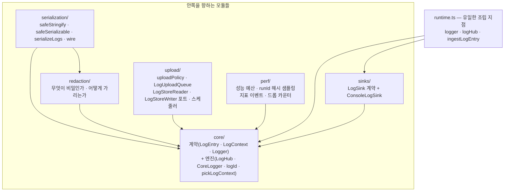
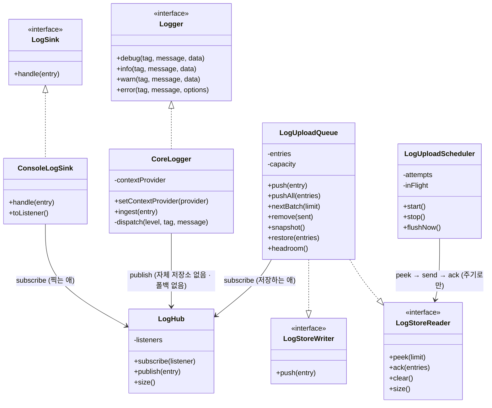
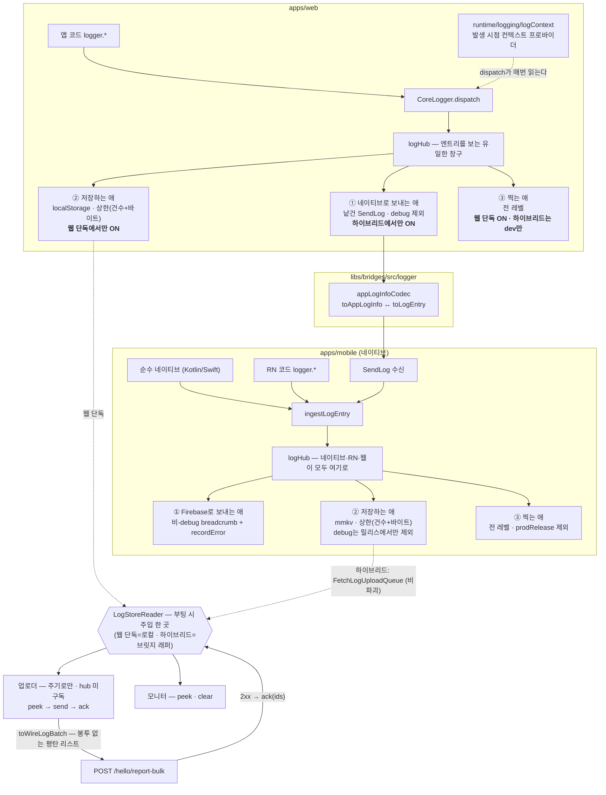
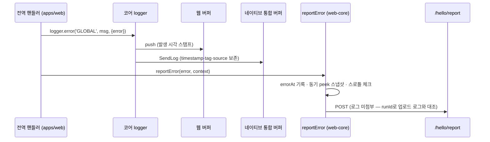
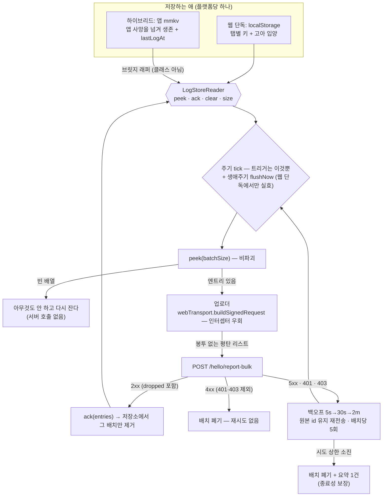
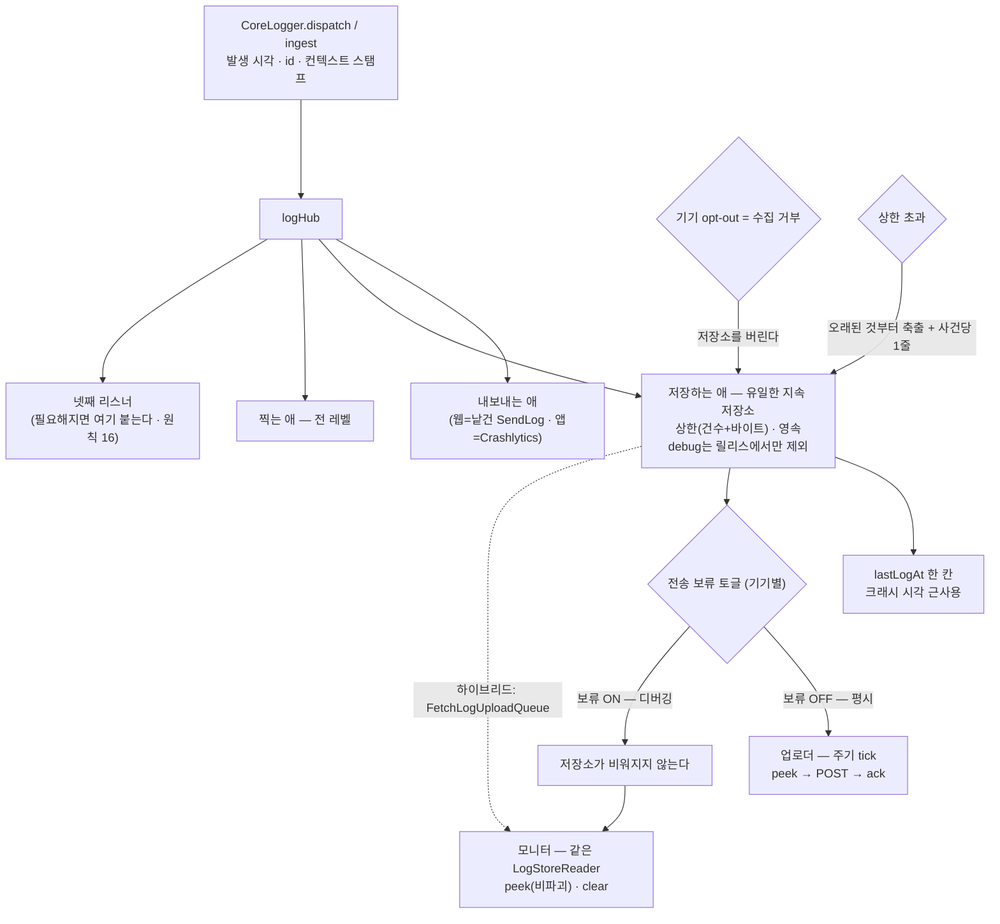

# 통합 로깅 아키텍처 (Unified Logging)

> 상태: **Live** · 최종 갱신: 2026-08-24
>
> 이 문서는 **구현된 코드를 서술한다.** 저장소는 **미전송 큐 하나**이고, 그것을 채우는 것은 리스너, 읽는 것은
> 업로더와 모니터다. 업로더는 엔트리를 보지 않고 주기로만 돈다.
>
> · 관련 ADR: [ADR-0066](../../../docs/adr/0066-log-pipeline-collector-listener-split.md) (**최신** — 수집기/리스너 분리 · 낱건 sender · 주기 전용 업로더 · `LogStore` 포트) · [ADR-0063](../../../docs/adr/0063-log-upload-source-port-and-native-charge-queue.md) (업로드 소스 포트 · 앱 전송 큐 · 배치 충전 — **배치 충전은 0066이 폐기**) · [ADR-0047](../../../docs/adr/0047-unified-logging-core-and-report-traceability.md) (통합 로깅 코어. 배경: [ADR-0029](../../../docs/adr/0029-error-report-categorization-and-enrichment.md), [ADR-0017](../../../docs/adr/0017-issue-report-floating-widget.md))
> · **클라이언트 구조 결정의 정본은 ADR-0066이다** (0063은 소스 포트·앱 저장소·Fetch/Ack 2단계만 유효하고, 배치 충전은 폐기됐다). 실행 계획·서버 계약 회신은 리포 밖 knowledge vault
> `projects/@lemoncloud-io/dou-app/log-collection` (`plans.md` · `client-upload-spec.md`)에 있다.
>
> **개정 이력** — 이 문서가 지나온 축소들. 왜 지금 저장소가 하나이고 리스너가 셋인지는 이 순서를 알아야 읽힌다.
>
> | 시점                  | 무엇이 사라졌나                                                                                                                            | 근거                                                                                                                                                              |
> | --------------------- | ------------------------------------------------------------------------------------------------------------------------------------------ | ----------------------------------------------------------------------------------------------------------------------------------------------------------------- |
> | 2026-08-18 (ADR-0063) | 리포트 첨부 모델이 **유일한 전송 수단**이던 상태                                                                                           | 에러가 나야만 로그가 서버에 닿았다. 배치 업로더가 상시 올린다                                                                                                     |
> | 2026-08-21            | **breadcrumb 첨부** (`LogSource`·`collectBreadcrumbs`·`setReportLogSource`·`logsOverride`)                                                 | 같은 로그를 두 벌 저장하고, 그 사본만 공유 Slack 채널로도 나갔다. 리포트와 로그는 `runId`(+`uid`)로 맞춘다                                                        |
> | 2026-08-24            | **링버퍼(500)와 그 영속화** (`LogBuffer`·`RingBuffer`·`LogPersistence` 포트·`LogBufferService`·MMKV `@chatic/log.queue`·웹 sessionStorage) | 링버퍼의 존재 이유는 breadcrumb 저장소였다. 첨부가 폐지되자 소비자가 0이 됐고, 전송 보류 토글이 큐를 붙잡아 주므로 진단 저장소를 따로 둘 이유도 사라졌다(원칙 10) |
>
> 마지막 축소에는 **선행 수정**이 필요했다: 네이티브 출처 엔트리(RN 예외 · FCM · Kotlin/Swift · RN 코드의 `logger.*`)가
> `ingestLogEntry` → 링버퍼 + Crashlytics까지만 가고 **앱 전송 큐에 들어가지 않아 서버에 도달하는 경로가 아예 없었다.**
> 링버퍼가 그 로그들의 유일한 거처였으므로, 배선 없이 지우면 디버그 뷰에서도 서버에서도 사라진다. 큐가 hub를 구독하게 만드는 것이
> 그 수정이었고(1단계), 그것만으로도 독립적으로 필요한 버그 수정이었다.

> **성능 지표도 이 파이프를 탄다.** 부팅·전환·웹바이탈 측정치가 `info`/`PERF` 엔트리로 같은 큐에 실려 나간다 —
> 이 파이프의 네 번째 소비자이자, 백프레셔 드롭 순서(원칙 18)의 영향을 정면으로 받는 유일한 소비자다.
> [성능 예산과 지표 이벤트](./perf-metrics.md) 참고.

## 목적

`apps/web`과 `apps/mobile`에서 발생하는 모든 로그(웹 JS · RN/TS · 순수 네이티브)를 **하나의 로깅 계약(`LogEntry`)** 으로 수렴시키고, 하이브리드에서는 네이티브 통합 버퍼에, 웹 단독에서는 웹 버퍼에 손실 없이 모아, 어드민에서 추적 가능하게 한다.

여기에 더해 **리포트 발생 여부와 무관하게 기기에 쌓인 로그를 배치로 상시 업로드한다**(2026-08-18 개정). 리포트 첨부 모델은 에러가 나야만 로그가 서버에 닿고, breadcrumb을 `peek`로 뜨는 탓에 연속 에러에서 같은 구간이 반복 저장된다 — `poll`로 바꾸면 앞선 리포트가 로그를 소비해 뒤따르는 리포트의 인과가 끊긴다. 전송을 리포트에서 떼어내면 두 문제가 함께 사라진다.

해결한 문제: 로깅 타입 3중화(코어 `LogEntry` / 모바일 `LogTag`+위치인자 / wire `AppLogInfo`)로 브리지 경계마다 정보가 손실되고(tag 치환, timestamp 재스탬프, error 시 data 유실), 크래시·리소스 실패·네이티브 예외는 감지망 밖이며, `[mobile] script-error` 같은 opaque 리포트가 어드민에서 추적 불가능했다.

## 설계 원칙

1. **코어는 순수 TS.** `libs/logger`는 DOM·React Native·MMKV·Firebase 등 어떤 플랫폼도 import하지 않는다. 플랫폼 동작은 전부 `LogListener` 또는 포트(`LogStoreReader`·`LogStoreWriter`·큐 영속화)의 어댑터로 코어 바깥에 배선한다.
2. **발생 시각은 dispatch가 스탬프한다.** 경계(브리지, 큐, 지연 전송)를 건너온 엔트리는 `ingestLogEntry`로 재스탬프 없이 적재한다. 지연 전송되는 리포트도 감지 시각(`occurredAt`)을 싣는다.
3. **경계를 건널 때 정보를 보존한다.** 출처는 tag 치환이 아니라 `source: 'web' | 'native'` 필드로 구분하고(로컬 런타임 발생분은 필드 없음), 원본 tag·timestamp·data·error를 그대로 나른다.
4. **읽기는 저장소를 비우지 않는다.** 디버그 뷰든 업로더든 조회는 비파괴다(`peek`·`FetchLogUploadQueue`). 엔트리가 저장소에서 빠지는 경로는 넷뿐이고, 그중 **정상 경로는 `ack` 하나**다 — ① 서버가 받았다는 `ack`(주 경로) ② 모니터의 명시적 폐기 ③ 상한 초과 축출(원칙 18) ④ opt-out의 폐기. 파괴적 단발 읽기는 전송이 끝나기 전에 사본을 지워, 그 사이 프로세스가 죽으면 엔트리가 어디에도 남지 않는다 — 하필 앱이 죽는 순간의 로그가 가장 필요한데 그것이 유실된다. 이 원칙을 깨던 유일한 소비자가 `PollAppLogBuffer`였고, 링버퍼와 함께 사라졌다.
5. **병합 버퍼의 소유자는 가장 바깥 셸.** 하이브리드는 네이티브 버퍼, 웹 단독은 웹 버퍼가 진실의 원천이다 (`LogSource` 라우팅).
6. **캡처는 죽지 않는 쪽에서.** 크래시류는 사후 감지(웹: 센티널, 네이티브: Crashlytics 재실행 감지)로 잡고, signal handler를 DIY하지 않는다.
7. **서명 전송은 웹 세션 단일 경로.** `/hello/report` 토큰은 웹 세션만 보유하므로 네이티브 감지분은 지연 큐에 쌓고 웹이 대리 전송한다.
8. **로그 전달 경로 자신은 `logger`로 로깅하지 않는다.** ⟨이 원칙의 절반은 **구조가 대신 지킨다** — 업로더가 hub를 구독하지 않으므로(원칙 16) 업로드 경로에서 난 로그는 업로드를 다시 부를 수단이 없다. 지켜야 할 것으로 남는 쪽은 **리스너 안**이다: 리스너는 `publish` 안에서 도므로 거기서 `logger`를 부르면 즉시 재진입이다.⟩ 하이브리드에서 `createNativeForwarder`가 엔트리마다 `NativeBridgeAdapter.postMessage`를 호출하므로, 그 **송신 경로** 안에서 `logger`를 부르면 로그 → forwarder → 전송 실패 → 로그로 무한 재귀한다(폭주를 테스트로 재현했고, 지금은 hub 구독자가 엔트리를 세어 그 성질을 고정한다). 송신 경로는 `console`만 쓴다 — 전송이 깨진 상황에선 브리지 너머로 보낼 방법이 없으니 잃는 것도 없다. **수신 경로**(`handleNativeMessage`, `AppBridgeHost.handleMessage`, `JsonProtocol.decode`)는 이 제약이 없으므로 `logger`를 써서 남긴다. 계약은 [NativeBridgeAdapter.spec.ts](../../bridges/src/web/adapters/NativeBridgeAdapter.spec.ts)가 고정한다.
9. **발생 시점 컨텍스트는 엔트리가 들고 다닌다.** `runId`·`sid`·`uid`·`cid`·`appVersion`·`webVersion`·`route`는 저장 시점에 이미 달라져 있을 수 있으므로 dispatch가 그 순간의 값을 엔트리에 박는다. 전송 시점 스탬프는 금지 — 오프라인 큐가 며칠 뒤 배출되면 사이트·사용자·클라우드·버전 라벨이 통째로 오염된다. 2번 원칙(발생 시각)의 확장이며, 같은 이유로 `ingestLogEntry`는 컨텍스트도 재스탬프하지 않는다.
10. **수명이 하나면 저장소도 하나다.** 링버퍼(진단)와 미전송 큐(전송)를 나눠 둔 이유는 수명이 달랐기 때문이다 — 하나는 탭과 함께 죽어도 되고, 하나는 지속이 존재 이유였다. 그런데 전송을 **끌 수 있게** 만들면 큐가 비워지지 않으므로 두 수명이 하나로 합쳐진다. 그래서 진단 저장소를 따로 두지 않고 **큐 하나를 두 독자(디버그 뷰 · 업로더)가 읽는다.** 링버퍼는 폐지됐다. 그 대가는 명확히 하나다 — 링버퍼는 코어가 `ingest`에서 직접 적재해 "구독 여부와 무관하게 남는다"가 구성상 보장이었고, 큐는 hub 구독으로 채워지므로 그 보장이 **배선 순서라는 관례**로 내려앉는다(원칙 15).
11. **업로더는 자기 자신을 로깅하지 않는다.** 8번(전송 경로에서 logger 금지)의 HTTP판이다. 업로드 요청이 네트워크 인터셉터를 타면 `업로드 실패 → error 엔트리 → flush 앞당김 → 재시도 → 또 실패`의 피드백 루프가 성립한다.
12. **업로더는 자기가 어디서 가져오는지 모른다.** 배출 소스는 `LogStoreReader` 포트로 명세하고(0066 이전 이름은 `LogUploadSource`), 하이브리드/웹 단독 분기는 부팅 시 **주입 한 곳**에만 존재한다 — 5번 원칙(가장 바깥 셸이 소유)을 breadcrumb에서 업로드로 확장한 것이다. 소스가 무엇이든 배출은 **비파괴 `fetch` → 전송 → `ack`** 2단계다. 파괴적 단발 읽기는 전송이 끝나기 전에 사본을 지워, 그 사이 프로세스가 죽으면 엔트리가 어디에도 남지 않는다.
13. **`debug`의 수명은 "누가 보고 있는가"가 정한다.** 릴리스(`prodRelease`) 빌드에서 `debug`는 어디에도 남지 않는다 — 콘솔이 없고, 저장소도 브릿지도 받지 않는다. 읽을 수 있는 주체가 0이므로 보관은 자리만 차지하고, 브릿지에 태우면 최대 유입원(`withNetworkLog`의 요청당 1건)을 가장 비싼 경로로 보내는 셈이다. **그 외의 빌드에서는 `debug`가 1급 시민이다** — 콘솔이 찍고, 브릿지를 건너고, 저장소가 보관하며, 따라서 디버그 모니터에도 보인다. 보는 사람이 있는 곳에서 가장 바쁜 레벨을 빼면 진단 창이 딱 그만큼 빈다.

    이것을 가능하게 하는 것이 **축출 순서**다. `debug`가 `DROP_PRIORITY`의 맨 앞이라 상한에 닿으면 가장 먼저 버려진다 — 그 순서가 없으면 요청 로그 한 번의 폭주가 창의 존재 이유인 `warn`/`error`를 밀어내고, 그것이 예전에 `debug`를 아예 안 받아서 피하던 실패다. Crashlytics는 세션당 약 64KB에 oldest-first 축출이라 예산 경쟁이 더 빡빡하므로 **거기서는 여전히 `debug`를 받지 않는다**.

    판단 기준은 호스트마다 하나뿐이다 — 웹은 `import.meta.env.DEV`, 앱은 `__DEV__` — 그리고 **콘솔·릴레이·저장이 모두 그 하나를 쓴다.** "이 빌드는 누가 보고 있다"는 개념이 셋으로 갈라지면 반드시 어긋난다.

14. **전송 보류와 수집 거부는 다른 레버다.** 보류(디버그 토글)는 "쌓아두되 보내지 마라"이고 큐를 **유지**한다. 수집 거부(기기 opt-out)는 "이 기기에서 수집하지 마라"이고 큐를 **버린다** — 개인정보 통제라서 쌓아두면 무의미해진다. 둘을 한 스위치로 합치면 그 중 하나가 반드시 틀린 동작을 한다.
15. **로깅 파이프라인은 무엇이든 로그를 내기 전에 배선한다.** 큐는 hub 구독으로 채워지므로 구독보다 먼저 나온 엔트리는 어디에도 남지 않는다. `main.tsx`에서 `startLogUploader`가 컨텍스트 등록 직후에 오는 이유이고, 부팅 경로에 로그를 추가할 때 확인해야 하는 것이다. 코어가 `ingest`에서 직접 먹던 시절에는 구성상 보장됐지만, 지금은 **배선 순서가 그 보장**이다.
16. **hub를 구독하는 것은 리스너뿐이고, 리스너는 늘어난다.** 지금은 플랫폼마다 셋이다 — 내보내는 애 · 저장하는 애 · 찍는 애. 이건 상한이 아니라 오늘의 명단이며, 새 소비자가 생기면 **기존 셋을 고치는 게 아니라 넷째를 구독시킨다.** 대신 고정되는 것은 두 경계다: **업로더도 모니터도 구독자가 아니다**(둘 다 저장소를 읽는다), 그리고 **로그를 보는 방법은 구독뿐이다**(링버퍼가 사라진 뒤 "나중에 조회"는 없다). 새 리스너가 만족해야 할 계약은 `상세 구현`에 있다.
17. **배치는 서버 경계에서만 일어난다.** 파이프라인 전체가 낱건으로 움직이고 묶는 것은 업로더 하나다 — dispatch도, hub→리스너도, 웹→앱 브릿지도, 저장소 `push`도 전부 낱건이다. 묶을 값이 있는 경계는 **프로세스 밖으로 나가는 곳** 하나뿐이라는 것이 이유다. 브릿지는 in-process IPC라 묶어서 아끼는 것보다 리스너가 배치기를 품는 대가가 크다.
18. **저장소는 상한을 갖는다 — 웹도 앱도.** 넘으면 오래된 것부터 버리고, 버린 사실은 건별이 아니라 **사건당 한 줄**로 남긴다(저장소의 문제가 저장소를 채우면 안 된다). 이유는 양쪽이 다르다 — 앱은 정상 배출구가 `ack` 하나뿐이라 오프라인이 길어지면 무한히 자라고, 웹은 **localStorage를 오리진 전체가 공유**하므로 로그가 예산을 먹으면 로그와 무관한 기능이 먼저 깨진다. 상한은 건수와 바이트 **둘 다** 걸어야 한다: 건수만 걸면 큰 `data` 몇 개가 예산을 넘기고, 바이트만 걸면 `push`마다 직렬화 비용이 든다.

## 범위

**포함**: (0066 개정분) 수집기/리스너 분리(플랫폼당 셋) · 웹→앱 낱건 sender · 주기 전용 업로더 · `LogStore` 읽기/쓰기 포트 분리 · 저장소 상한(건수+바이트) · 콘솔 구현 통일 · 배치 충전 hop 철거. (배치 업로드 개정분) 엔트리 `id` + 발생 시점 컨텍스트 · 미전송 영속 큐(**유일한 로그 저장소**) · 업로더(3중 flush·백오프·응답 처리) · 전송 보류 토글 · 원격 스위치. (기존) 코어 계약 단일화(모바일 `LogService`를 코어 위임으로 대체) · `SendLog` 페이로드 보존 · 큐 영속화(모바일 MMKV · 웹 localStorage — 링버퍼용 `LogPersistence` 포트는 2026-08-24에 제거) · 감지 확장(리소스/CSP/페이지 크래시/WebView 크래시/RN 전역 예외/네이티브 크래시 사후) · 순수 네이티브 로그 합류(`ChaticNativeLogger` 이미터) · 지연 리포트 큐+웹 대리 전송 · 추적성(P1 정직화, P2 주입 스크립트 가드, 요청 URL·메서드 노출, 신규 카테고리 6종) · 레거시 `__console__` 제거.

**제외**: (0066) 앱이 서버로 직접 전송(인증 클라이언트 부재 — ADR-0066 대안 참조) · 구버전 앱 폴백 · 앱→웹 flush 지시 메시지 · 낱건 sender의 스로틀(실측 후 판단 — `열린 항목` A). (기존) [triggers.md] 카탈로그 전면 적용(후속 트랙 — 이 개정은 운반 장치만 만든다) · 자동 error 리포트 제거(전환 조건 충족 후 별도 트랙) · 로그 보존·삭제 정책(서버 미정) · 동적 원격 로그 제어(스위치를 읽는 자리까지만) · P3 소스맵 심볼리케이션(이 트랙 밖에서 별도로 해결됐다 — [error-reporting.md의 "minified 스택 읽기"](../../web-core/docs/error-reporting.md#minified-스택-읽기)) · fingerprint 개선 · breadcrumb redact 정책 변경 · OS 전체 로그 스트림 · `apps/desktop` 일체.

## 시나리오

**S1 — 웹 단독에서 에러 발생.** uncaught 예외 → [app.tsx](../../../apps/web/src/app/app.tsx)의 전역 핸들러가 ① `logger.error('GLOBAL', …)`로 버퍼 적재(발생 시각 스탬프) ② `reportError`가 `errorAt`을 기록해 POST(로그는 첨부하지 않는다 — 같은 엔트리를 업로더가 낱건으로 올린다).

**S2 — 하이브리드(WebView)에서 에러 발생.** S1의 ①은 동일하고, 웹 로그는 이미 `SendLog`(timestamp·원본 tag·`source:'web'`)로 네이티브 통합 버퍼에 합류해 있다. `reportError`는 `LogSource`(=`nativeMergedLogSource`)로 통합 버퍼를 pull → `timestamp <= errorAt` 필터 → tail 50 첨부. 브리지 실패·1.5초 타임아웃 시 에러 시점 웹 스냅샷으로 폴백.

**S3 — WebView 프로세스 크래시.** [AppWebView](../../../apps/mobile/src/app/webview/AppWebView.tsx)가 iOS `onContentProcessDidTerminate` / Android `onRenderProcessGone`에서 그 순간의 통합 버퍼 스냅샷 + 감지 시각 + `webview-crash`를 지연 리포트 큐(MMKV)에 저장 후 리로드 → 재부팅된 웹이 세션 준비 후 pull해 대리 전송.

**S4 — 순수 네이티브 크래시.** 프로세스 사망, Crashlytics가 스택 캡처. 다음 실행에서 `didCrashOnPreviousExecution()` 확인 → `native-crash` 큐잉(로그는 싣지 않고, MMKV에 살아남은 직전 세션 버퍼의 마지막 엔트리 시각만 크래시 시각으로 쓴다) → S3과 동일 대리 전송. 스택은 Crashlytics 콘솔에서 대조한다(이원 체계) — **대조 축은 `run_id`다.** 부팅 시 `crashlytics().setAttribute('run_id', NATIVE_RUN_ID)`로 세션에 찍어두므로, 어드민 리포트의 runId로 Crashlytics를 검색하거나 반대로 Crashlytics 크래시의 runId로 그 실행의 업로드 로그 전체를 좁힐 수 있다. **Crashlytics는 업로드 경로 밖의 두 번째 sink라 마스킹을 스스로 해야 한다** — `dispatch`는 원본 `data`를 버퍼에 넣고 마스킹은 `safeStringify` 안에서만 일어나므로, `entry.data`를 직접 읽는 쪽은 무조건 `safeStringify`/`redactSensitive`를 태운다.

**S5 — 순수 네이티브 코드 로그.** Kotlin/Swift 코드가 `NativeLogger.log(level, tag, message, throwable?)` 호출 → Logcat/NSLog 미러 + `ChaticNativeLog` 이벤트(JS 준비 전이면 네이티브 큐 200건 보관, JS의 `ready()` 신호에 일괄 flush) → `ingestLogEntry`(`source:'native'`) → 통합 버퍼 합류. Android 푸시 서비스(`ChaticFirebaseMessagingService`)가 첫 채택 콜사이트다.

**S6 — 사용자 이슈 리포트.** 로그는 첨부하지 않고 디바이스·버전·라우트 트레일 스냅샷만 붙인다([buildReportContext](../../../apps/web/src/app/features/feedback/lib/buildReportContext.ts)). 제보 당시 로그는 같은 `runId`로 업로드돼 있다. 스로틀 없음.

**S8 — 평시 배치 업로드, 웹 단독.** 앱 코드가 `logger.*`를 부르면 dispatch가 발생 시각·`id`(UUID)·발생 시점 컨텍스트를 박아 hub에 발행하고, hub를 구독한 **웹 미전송 큐**가 적재한다(`debug`는 릴리스 빌드에서만 입구에서 걸러진다 — 원칙 13). 업로더의 소스는 웹 큐 자신이다. ① 큐 50건 ② 60초 경과 ③ 백그라운드 진입/`pagehide` 중 먼저 오는 것에 flush하고, `POST /hello/report-bulk`가 2xx면 그 배치에 실린 엔트리만 `ack`으로 제거한다.

**S8h — 평시 배치 업로드, 하이브리드.** 리듬은 **하나뿐**이다 — 업로더의 주기.

1. **relay(낱건)**: 웹에서 엔트리가 dispatch될 때마다 네이티브 sender 리스너가 그것 하나를 `SendLog`로 앱에 넘긴다. 버퍼도 타이머도 없다 — 리스너 본문이 `postMessage` 한 줄이다. `debug`는 앱이 찍을 수 있을 때만 보낸다(원칙 13). 앱이 저장소를 서빙한다고 확인된 뒤로 **웹은 아무것도 적재하지 않는다** — 저장 리스너가 멈추고 콘솔 리스너는 처음부터 꺼져 있어, 켜져 있는 것은 sender 하나뿐이다. 확인 전 부팅 창의 예외는 S8f에 있다.
2. **앱의 수집**: 앱은 받은 엔트리를 `ingestLogEntry`로 hub에 발행한다. 그때부터 웹 엔트리는 네이티브 발원 엔트리와 **구별되지 않는다** — 리스너 셋(콘솔·Crashlytics·mmkv 저장)이 각자 자기 정책대로 받는다. `charge()`도 `source === 'web'` 필터도 없다: 그 둘은 "한 메시지가 hub 발행과 큐 적재를 동시에 한다"는 겹침을 처리하려던 장치였고, 이제 겹침 자체가 없다.
3. **업로드**: 업로더는 웹에서 돌고 소스는 앱의 mmkv 저장소다. 주기마다 `FetchLogUploadQueue`(비파괴)로 배치를 받아 서버에 보내고, 2xx면 `AckLogUploadQueue(ids)`로 앱에서 지운다. 전송 실패 시 엔트리는 MMKV에 그대로 남아 다음 주기·다음 부팅에 재시도된다.

**빈 주기에는 서버를 부르지 않는다.** `peek`이 빈 배열을 주면 `send`를 건너뛰고 타이머만 다시 건다. 다만 **`peek` 왕복 자체는 주기당 1회 그대로 낸다** — 캐시된 크기로 "지난번 0이었으니 건너뛰자"고 판단하면 안 된다. 앱 저장소에는 웹이 모르는 사이 네이티브 발원 로그(RN 예외·FCM·Kotlin/Swift)가 들어오기 때문이다.

**S8f — 구버전 앱 폴백은 두지 않는다.** 하이브리드인데 설치된 앱이 `SendLog`를 모르면 그 세션의 웹 로그는 포기한다. "웹이 먼저 배포되므로 NOT_FOUND 학습 폴백이 필수"라는 원칙에 대한 **의도적 예외**이며, 근거는 `SendLog`가 새 메시지가 아니라 2026-07-08부터 있던 경로라는 것이다 — 웹 번들 밖의 주입 스크립트([injectionScripts.ts:193](../../../apps/mobile/src/app/webview/utils/injectionScripts.ts:193))도 그것을 직접 쓴다. **다만 이 판단은 실측 전제이며**(`리스크와 미지수` 참조), 틀리면 조용히 사라지는 종류다.

**S8n — 네이티브 출처 엔트리의 유입.** RN 예외·FCM·Kotlin/Swift `ChaticNativeLogger`·RN 코드의 `logger.*`는 `ingestLogEntry`로 들어와 hub에 발행되고, 저장하는 애가 적재한다. **웹에서 relay된 엔트리와 완전히 같은 경로**다 — 같은 hub, 같은 리스너 셋, 같은 상한. `source` 필드는 출처 표시로만 남고 분기에는 쓰이지 않는다.

**S11 — 디버그 메뉴에서 로그 모니터링.** 디버그 메뉴의 **전송 보류** 토글을 켜면 스케줄러의 `isEnabled()`가 false를 돌려주고, 업로더는 _"keep accumulating, just do not send"_ 경로를 탄다 — 큐가 비워지지 않는다. 그 상태로 재현하면 엔트리가 큐에 남고, 모니터링 화면이 그 큐를 **비파괴로** 읽는다 — **업로더와 같은 `LogStoreReader`를 주입받는다**(하이브리드는 `FetchLogUploadQueue` 브릿지 왕복, 웹 단독은 로컬 `peek`). 모니터는 hub 구독자가 아니므로(원칙 16) 저장소에 없는 것은 보지 못한다 — 다만 릴리스가 아닌 빌드에서는 `debug`도 저장소에 있으므로 모니터에 보인다(원칙 13). 앱에는 별도로 네이티브 모니터 화면([MonitoringScreen](../../../apps/mobile/src/app/features/debug/screens/MonitoringScreen.tsx))이 같은 저장소를 직접 읽는다. 토글을 끄면 다음 flush가 쌓인 것을 보내고 큐는 정상적으로 비워진다 — 즉 모니터링이 의미 있는 구간은 보류 중이며, 이는 버그가 아니라 이 설계의 워크플로다. 기기 opt-out과 혼동하지 않는다(원칙 14): opt-out은 큐를 버린다.

**S9 — error가 낀 배치.** **아무 일도 일어나지 않는다.** error 엔트리도 다른 엔트리와 똑같이 저장소에 쌓이고 다음 주기에 나간다 — 즉시 전송도, flush 앞당김도 없다. 업로더가 엔트리를 관찰하지 않기 때문이고(원칙 16), 그것이 "구독자는 리스너뿐"이 배선 없이 성립하는 대가다.

즉시성이 필요한 곳은 이미 즉시다 — **Crashlytics는 리스너라서** error를 그 자리에서 breadcrumb에 남기고 `recordError`까지 한다. 서버 도달이 최대 1주기 늦는 것이 남는 대가이고, 프로세스가 그 사이 죽어도 엔트리는 영속 저장소에 남아 다음 실행 첫 주기에 나간다.

**S10 — 오프라인·크래시 구간 회수.** 업로드가 실패하면 5s → 30s → 2m 백오프로 재시도하되 **배치당 시도 상한 5회**를 둔다 — 소진하면 그 배치를 폐기하고 요약 1건만 남긴다(엔트리를 큐로 되돌리지 않는다). 되돌리면 같은 엔트리가 영원히 재시도 대상이 되어 무한 재전송이 그대로다. **이 상한 덕분에 인증 실패가 4xx로 오든 5xx로 오든 배치는 반드시 종료된다** — 클라이언트의 종료성이 서버의 상태 코드 선택에 의존하지 않는다. 4xx는 원칙적으로 즉시 폐기하지만 **401·403은 재시도한다** — 그건 배치에 대한 판정이 아니라 "지금 세션이 없다"는 지나가는 상태이고, 큐가 로그아웃을 넘겨 살아남는 이상 무세션 구간에서 버리면 다음 세션이 부칠 수 있었던 엔트리를 잃는다. 무한 재시도는 위의 시도 상한이 막는다. 그 전까지는 성공 응답 없이 큐에서 아무것도 지우지 않는다. 재전송은 원본 `id`를 그대로 쓰므로 서버가 문서 id 업서트로 덮어써 중복이 생기지 않는다. 큐가 상한에 닿으면 **싼 레벨부터, 같은 레벨 안에서는 오래된 것부터** 버린다 — `debug`가 맨 앞이라 가장 먼저 나간다(원칙 13).

저장소는 소스에 따라 다르다. **웹 큐**는 localStorage에 탭별 키로 남아 탭이 닫히거나 WebView가 죽어도 살아남고, 다음 부팅에서 하트비트가 끊긴 **고아 큐를 입양**해 합쳐 배출한다. **앱 큐**는 MMKV라 앱이 죽어도 남으며 탭 개념이 없어 입양도 필요 없다 — 하이브리드에서 웹 로그가 앱 큐로 옮겨지고 나면 그 엔트리는 WebView 프로세스 사망을 넘겨 살아남는다(현행 대비 개선). 두 큐 모두 **로그아웃을 넘겨 유지하고, opt-out에서는 비운다** — 엔트리가 dispatch 시점의 `uid`/`cid`를 스스로 들고 있어(9번 원칙) 다음 사람이 로그인해도 계정이 섞이지 않지만, "수집하지 말라"는 의사에는 적재분이 남아 나가면 어긋난다.

**S7 — 웹 페이지 크래시 사후 리포트.** 부팅 시 alive 센티널이 남아 있으면(직전 세션이 pagehide 없이 종료) `page-crash` 리포트를 보낸다. 로그는 싣지 않는다 — 죽은 세션의 엔트리는 같은 `runId`를 달고 이미 업로드됐고, 서버 쪽 사본이 더 완전하다. 죽은 시각도 버퍼와 함께 사라져 리포트는 전송 시각으로 찍힌다.

## 다이어그램

### ① `libs/logger` 모듈 지도

의존은 **전부 안쪽(`core/`)을 향한다.** 예외가 없다 — 유일한 예외였던 `attachLogPersistence`(싱글턴을 배선하려고 `runtime.ts`를 되돌아봤다)가 링버퍼와 함께 사라졌다.
그래서 클래스들은 싱글턴을 모른 채 단독 인스턴스화가 되고, 조립은 한 곳에서만 일어난다.

`perf/`도 ②의 규칙을 그대로 따른다 — 포트는 인터페이스(`PerfMetricSink` · `PerfBudgetCatalog` · `PerfMetricReporter`), 상태는 `BudgetedPerfMetricReporter` 클래스, 조립은 팩터리 하나(`createPerfMetricReporter`)와 자기 모듈의 홀더 하나. `LogSink`/`ConsoleLogSink`와 `runtime.ts`/`CoreLogger`가 쓰는 모양 그대로다. 계측 지점은 사이트 전환·웹바이탈 콜백처럼 관계없는 코드에 묻혀 있어 인스턴스를 넘겨받을 수 없으므로, 그 홀더를 거치는 자유 함수로 부른다. 자세한 것은 [성능 예산과 지표 이벤트](./perf-metrics.md).

### ② 엔진의 객체 그래프

상태를 가진 협력자는 클래스이고 의존을 생성자로 받는다. 플랫폼 레이어가 구현하는 **포트**는 인터페이스로 남는다 —
`apps/web`의 브리지 reader는 객체 리터럴이라 클래스로는 표현할 수 없다(그래서 클래스로 승격하지 않는다). 상태 없는 정책(마스킹·직렬화)은 함수로 남는다.

### ③ 두 앱에 걸친 배선

각 hub의 구독자는 **셋씩**이고, 업로더와 모니터는 그 바깥에서 저장소를 읽는다(원칙 16).
웹의 셋 중 어느 것이 켜지는지는 플랫폼이 정한다 — 하이브리드에서는 sender만, 웹 단독에서는 나머지 둘만.

reportError의 시퀀스(S2 기준):

업로드 파이프라인 (S8–S10). 요점은 **저장소가 업로더가 도는 쪽 기준으로 하나**이고,
읽기가 어디서도 저장소를 비우지 않는다는 것이다 — 4번·10번·17번 원칙:

하이브리드에서 웹 엔트리가 브릿지를 두 번 타는 것은 그대로다 — 낱건으로 올라갔다가 주기당 1회 배치로 내려온다.
0063의 배치 충전 대비 **올라가는 쪽이 건당으로 돌아간 것**이 이 개정의 비용이고,
얻는 것은 리스너 셋의 대칭성과 `LogChargePump`·`standDownNativeRelay`의 소멸이다(ADR-0066).

### ④ 하나의 저장소, 두 독자

보류 토글이 저장소의 배출을 멈추면 같은 저장소가 모니터링 뷰가 된다. `debug`는 저장소에 들어가지 않고 콘솔 쪽에 남는다.

## 상세 구현

### 코어 (`libs/logger/src`)

패키지는 **관심사별 모듈 디렉터리**로 나뉘고, 각 디렉터리는 자체 배럴(`index.ts`)을 갖는다. 상태를 가진 협력자는 **클래스**이고
생성자로 의존성을 받는다 — 그래서 어느 것이든 단독 인스턴스화가 되고, 프로세스 전역 인스턴스는 `runtime.ts` 한 곳에서만 조립된다.
플랫폼 레이어가 구현하는 **포트**(`LogStoreReader`·`LogStoreWriter`·큐 영속화)는 인터페이스로 남고, 상태 없는 정책(마스킹·직렬화)은 함수로 남는다.
발생 시점 컨텍스트 열 개(`runId`…`model`)는 wire 타입 · wire 매퍼 · `AppLogInfo` · 브릿지 코덱 양방향, 다섯 자리에 손으로 나열돼 있었다.
필드를 하나 더해도 **아무것도 깨지지 않고** 빠뜨린 hop에서 조용히 사라지는 구조였다. 지금은 `LOG_CONTEXT_FIELDS` 하나에서 나오고
(`WireLogEntry`는 `LogContext`를 확장한다), `AppLogInfo`는 leaf 패키지라 타입을 공유할 수 없으므로 코덱 파일에서 컴파일 타임으로
합의를 확인한다. 왕복 spec은 그 목록을 순회하므로 필드를 더하면 픽스처가 자동으로 따라온다.

`safeSerializable`은 원래 `libs/bridges/src/logger/utils/`에 있었고, 모바일은 그와 별개로 마스킹 없는 사본(`services/log/utils.ts`의
`serializeError`·`serializeLogValue`)을 갖고 있었다 — 같은 일에 답이 셋. 플랫폼 의존이 전혀 없는 코드였으므로 이 모듈로 올려 셋을 하나로 합쳤다.
그래서 **"경계를 건너는 값은 그 경계에서 마스킹된다"** 가 하류(`serializeLogs`·`toWireLogEntry`)가 아니라 경계 자신의 보장이 된다.

기존 `createXxx` 팩토리는 얇은 래퍼로 유지한다 — 배럴 시그니처를 그대로 두어 `apps/web`·`apps/mobile`·`libs/bridges`의 호출부가 손대지 않아도 되게 했다.

| 모듈                                     | 파일                                                                                                                                                                                                                              | 역할                                                                                                                                                                                                                                                                                                                                                                                                                    |
| ---------------------------------------- | --------------------------------------------------------------------------------------------------------------------------------------------------------------------------------------------------------------------------------- | ----------------------------------------------------------------------------------------------------------------------------------------------------------------------------------------------------------------------------------------------------------------------------------------------------------------------------------------------------------------------------------------------------------------------- |
| [`core/`](../src/core)                   | [types.ts](../src/core/types.ts)                                                                                                                                                                                                  | `LogEntry`(+`source?: LogOrigin`) · `LogLevel` · `LogContext` · `LogListener` · `Logger` — 패키지의 계약                                                                                                                                                                                                                                                                                                                |
|                                          | [LogHub.ts](../src/core/LogHub.ts)                                                                                                                                                                                                | `class LogHub` — 구독/발행. 리스너 하나가 던져도 나머지를 막지 않는다                                                                                                                                                                                                                                                                                                                                                   |
|                                          | [CoreLogger.ts](../src/core/CoreLogger.ts)                                                                                                                                                                                        | `class CoreLogger implements Logger` — dispatch(발생 시각·`id`·컨텍스트 스탬프) · `ingest`(경계 통과분 무재스탬프 발행). hub·폴백 싱크를 주입받는다. **자체 저장소 없음** — 발행만 한다                                                                                                                                                                                                                                 |
|                                          | [logContext.ts](../src/core/logContext.ts)                                                                                                                                                                                        | `LOG_CONTEXT_FIELDS`·`pickLogContext` — 발생 시점 컨텍스트 튜플을 **데이터로** 노출한다. `Record<keyof LogContext, true>` 덕에 목록이 인터페이스와 어긋나면 컴파일이 깨진다                                                                                                                                                                                                                                             |
|                                          | [logId.ts](../src/core/logId.ts)                                                                                                                                                                                                  | 의존성 없는 UUID v4 발급 (`createLogId`)                                                                                                                                                                                                                                                                                                                                                                                |
| [`sinks/`](../src/sinks)                 | [ConsoleLogSink.ts](../src/sinks/ConsoleLogSink.ts)                                                                                                                                                                               | `LogSink` 계약 + 콘솔 미러. `createConsoleListener()`로 hub에 구독시킨다. **웹·모바일이 공유하는 "찍는 애"의 유일한 구현** — 모바일 자체 `ConsoleLogger`는 폐지                                                                                                                                                                                                                                                         |
| [`redaction/`](../src/redaction)         | [sensitiveKeys.ts](../src/redaction/sensitiveKeys.ts) · [redact.ts](../src/redaction/redact.ts)                                                                                                                                   | "무엇이 비밀인가"(`SENSITIVE_KEYS`·`REDACTED`·`isSensitiveKey`)와 "어떻게 가리는가"(`redactSensitive`·`redactMaybeJson`·`truncate`)의 분리                                                                                                                                                                                                                                                                              |
| [`serialization/`](../src/serialization) | [safeStringify.ts](../src/serialization/safeStringify.ts) · [safeSerializable.ts](../src/serialization/safeSerializable.ts) · [serializeLogs.ts](../src/serialization/serializeLogs.ts) · [wire.ts](../src/serialization/wire.ts) | 로그 값을 안전하게 만드는 두 형태 — **문자열로 평탄화**(저장·전송용)와 **구조 유지**(브레드크럼·디버그 UI용, axios 에러는 필드별로 들어냄). 마스킹 범위는 다르다 — 앞은 전 키를 순회하고, 뒤는 자기가 분해하는 axios 요청/응답 상세만 가린 뒤 나머지는 저장·전송 경계(`serializeLogs`·`toWireLogEntry`)에 맡긴다. 그 위에 `SerializedLog`(예산 40k/2k)와 서버 wire 매핑. 필드 절단 규칙은 `truncateText`로 한 벌만 둔다 |
| [`upload/`](../src/upload)               | [uploadPolicy.ts](../src/upload/uploadPolicy.ts) · [LogUploadQueue.ts](../src/upload/LogUploadQueue.ts) · `LogStore.ts`(포트 3종 + `toLogListener`) · [LogUploadScheduler.ts](../src/upload/LogUploadScheduler.ts)                | 타이밍·포기 정책 상수 · 저장소(`class LogUploadQueue` — 상한 건수+바이트) · 읽기/쓰기 포트 · 주기 flush·백오프·시도 상한을 집행하는 `class LogUploadScheduler`                                                                                                                                                                                                                                                          |
| —                                        | [runtime.ts](../src/runtime.ts)                                                                                                                                                                                                   | **유일한 조립 지점**: `logger`·`logHub`·`ingestLogEntry`·`setLogContextProvider`. **콘솔 fallback은 없다** — 구독자가 0이면 아무 데도 찍히지 않는 것이 맞다(원칙 16). 나머지 모듈은 싱글턴을 모른다                                                                                                                                                                                                                     |

### 환경 배선 (`libs/bridges/src/logger`)

| 파일                                                                  | 역할                                                                                                                                                                                                                           |
| --------------------------------------------------------------------- | ------------------------------------------------------------------------------------------------------------------------------------------------------------------------------------------------------------------------------ |
| [nativeForwarder.ts](../../bridges/src/logger/nativeForwarder.ts)     | **"네이티브로 보내는 애"의 본체.** 엔트리 하나를 `SendLog` 하나로 넘긴다 — 버퍼도 타이머도 없다. `timestamp`·`source:'web'`·`id`·컨텍스트를 실어 보내고 `debug`는 게이트로 막는다(원칙 13). 하이브리드의 **유일한** 웹→앱 경로 |
| [setupBridgeLogger.ts](../../bridges/src/logger/setupBridgeLogger.ts) | 네이티브 sender를 hub에 구독시키고 teardown을 돌려준다. **`standDownNativeRelay()`는 없다** — 경로가 하나뿐이라 전환할 것이 없다. **콘솔 리스너를 붙이지 않는다** — 그 소유권은 `apps/web`에 있다                              |
| [appLogInfoCodec.ts](../../bridges/src/logger/appLogInfoCodec.ts)     | `LogEntry` ↔ `AppLogInfo` 양방향 매핑. `toWireLogEntry`가 아니라 `safeSerializable` 계열인 것이 핵심 — 넘어간 엔트리는 앱 콘솔에도 가므로 구조를 보존한다                                                                     |

### wire 타입 (`libs/app-messages`)

[model/common.ts](../../app-messages/src/types/model/common.ts): `SendLogPayload.timestamp/source`, `AppLogInfo.source`, `PendingReportInfo {id, category, message?, stack?, detectedAt, logs?, extra?}` + `FetchPendingReports`/`AckPendingReports` 메시지 (web-message·app-message·response 맵 등록).

### 모바일 (`apps/mobile`)

| 파일                                                                                                                                                                                                                   | 역할                                                                                                                                                                                                                                                                                                                                                                                                                                  |
| ---------------------------------------------------------------------------------------------------------------------------------------------------------------------------------------------------------------------- | ------------------------------------------------------------------------------------------------------------------------------------------------------------------------------------------------------------------------------------------------------------------------------------------------------------------------------------------------------------------------------------------------------------------------------------- | --- |
| [services/log/LogService.ts](../../../apps/mobile/src/app/services/log/LogService.ts)                                                                                                                                  | 코어 위임 클래스 (provider 배선·DI 타입 유지용). `LogTag` union은 [types.ts](../../../apps/mobile/src/app/services/log/types.ts)의 열린 `string` + `LOG_TAGS` 상수로 대체                                                                                                                                                                                                                                                             |
| [services/log/native/nativeLoggerBridge.ts](../../../apps/mobile/src/app/services/log/native/nativeLoggerBridge.ts)                                                                                                    | `ChaticNativeLog` 이벤트 구독 → `ingestLogEntry(source:'native')`, 구독 후 `ready()`로 네이티브 큐 flush                                                                                                                                                                                                                                                                                                                              |
| [services/firebase/crashlytics/](../../../apps/mobile/src/app/services/firebase/crashlytics/)                                                                                                                          | **"Firebase로 보내는 애"** — hub 구독. 비-`debug`를 breadcrumb에, `error`는 `recordError`까지. 업로드 경로 밖이라 `redactSensitive`를 스스로 부른다. 부팅 시 `run_id` 속성을 찍어 크래시와 업로드 로그를 잇는다                                                                                                                                                                                                                       |
| `services/log/uploadQueue/`                                                                                                                                                                                            | **"저장하는 애"** — hub 구독, `LogStore` 구현, @mmkv 어댑터. 로깅하지 않는 인스턴스를 받는다                                                                                                                                                                                                                                                                                                                                          |
| `@chatic/logger`의 `ConsoleLogSink`                                                                                                                                                                                    | **"찍는 애"** — hub 구독, 전 레벨. 모바일 자체 `ConsoleLogger`는 폐지되고 이것으로 통일                                                                                                                                                                                                                                                                                                                                               |
| [services/report/](../../../apps/mobile/src/app/services/report/)                                                                                                                                                      | `PendingReportQueueService`(MMKV, 상한 20) · `nativeErrorDetection`(ErrorUtils 전역 핸들러+Hermes/promise 거부 추적, `didCrashOnPreviousExecution` 재실행 체크 — `logUploadQueueService.init` 이후 실행, 크래시 시각은 그 서비스의 `getPreviousRunLastLogAt()`)                                                                                                                                                                       |
| [webview/hooks/useLogHandler.ts](../../../apps/mobile/src/app/webview/hooks/useLogHandler.ts)                                                                                                                          | **하이브리드의 웹 로그 진입점.** `SendLog` 수신 → `ingestLogEntry` 한 줄 (원본 tag·timestamp·source 보존, 구버전 웹은 수신 시각·WEBVIEW·web 폴백). 저장소에 직접 넣지 않는다 — 그 뒤는 hub와 리스너 셋의 몫                                                                                                                                                                                                                           |     |
| [webview/hooks/usePendingReportHandler.ts](../../../apps/mobile/src/app/webview/hooks/usePendingReportHandler.ts)                                                                                                      | `FetchPendingReports`/`AckPendingReports` 브리지 핸들러                                                                                                                                                                                                                                                                                                                                                                               |
| [webview/AppWebView.tsx](../../../apps/mobile/src/app/webview/AppWebView.tsx)                                                                                                                                          | WebView 크래시 캡처(iOS/Android) → 큐잉 + 리로드                                                                                                                                                                                                                                                                                                                                                                                      |
| [webview/utils/injectionScripts.ts](../../../apps/mobile/src/app/webview/utils/injectionScripts.ts)                                                                                                                    | 주입 스크립트 전체 try/catch 가드 (P2) — 런타임 실패를 `SendLog`(tag INJECTION)로 자기 보고. `__console__` 오버라이드는 제거됨                                                                                                                                                                                                                                                                                                        |
| android [NativeLoggerModule.kt](../../../apps/mobile/android/app/src/main/java/io/chatic/dou/module/NativeLoggerModule.kt) / ios [NativeLoggerModule.swift](../../../apps/mobile/ios/Bridges/NativeLoggerModule.swift) | `NativeLogger.log` 정적 API + 콜드스타트 큐(200) + `ChaticNativeLog` 이미터. Android는 `MainApplication`에 패키지 등록. **iOS 파일이 `Bridges/`에 있는 이유**: 이 디렉터리가 앱 타깃의 `fileSystemSynchronizedGroups`라 새 파일이 자동 컴파일된다. `Chatic/`은 동기화 그룹이 아니어서 pbxproj에 명시 등록해야 하고, 빠뜨리면 모듈이 조용히 빌드에서 누락된다. 채택: Android 푸시 서비스(전체), iOS는 인프라만(현재 NSLog 사용처 없음) |

### 크래시 심볼화

RN 크래시는 한 종류가 아니고, **갈래마다 필요한 심볼과 그 심볼을 받는 곳이 다르다.** 하나만 켜두고 끝났다고 보는 것이 흔한 사고다.

| 갈래                  | 스택 모양                                     | 필요한 심볼                      | 어디서                          | 상태                                                                                                                                                                                         |
| --------------------- | --------------------------------------------- | -------------------------------- | ------------------------------- | -------------------------------------------------------------------------------------------------------------------------------------------------------------------------------------------- |
| ① Hermes(JS)          | `hermes::vm::…`가 감싸거나 번들 오프셋        | Metro 맵 + hermesc 맵의 **합성** | 우리 리포트 경로 (`yarn trace`) | Android `hermesFlags`, iOS `SOURCEMAP_FILE`로 생성 → fastlane이 `.sourcemaps/`에 커밋 SHA와 함께 보관                                                                                        |
| ② 네이티브 `.so`/C++  | 심볼 없는 주소 또는 순수 C++ 심볼             | 디버그 심볼                      | Crashlytics                     | `firebase-crashlytics-ndk` + `nativeSymbolUploadEnabled` + `debugSymbolLevel FULL`                                                                                                           |
| ③ Android Java/Kotlin | `com.facebook.react.bridge…`·앱 패키지 프레임 | R8 매핑                          | Crashlytics                     | **해당 없음** — `enableProguardInReleaseBuilds = false`라 난독화를 안 하므로 원본 이름이 그대로 나온다. minify를 켜는 순간 필수가 되며, Crashlytics gradle 플러그인이 매핑을 자동 업로드한다 |
| iOS dSYM (②의 iOS 쪽) | —                                             | dSYM (빌드 UUID 매칭)            | Crashlytics                     | 빌드 시 run script + **스토어 재생성분**을 fastlane `download_dsyms`로 되받아 재업로드                                                                                                       |

**①은 Crashlytics로 갈 수 없다** — Firebase에는 JS 소스맵 개념이 자체가 없다(Sentry·Bugsnag과 다른 점). 그래서 ①은 우리 리포트 경로에서만 해석되며, 이 앱은 하이브리드 껍데기라 제품 JS 대부분이 WebView에서 돌아 [trace-report.js](../../../scripts/trace-report.js)의 `PROJECT_BY_APP`이 `mobile → web`으로 이미 매핑돼 있다. 남는 사각지대는 **RN 셸 자체의 JS**(브리지·딥링크·푸시·서비스 계층)뿐이고, 그쪽이 위 표의 보관본을 쓴다.

**`newArchEnabled=true`라 ②가 특히 중요하다** — Fabric/TurboModule C++ 레이어와 JSI 경계를 넘어온 C++ 예외는 JS 스택이 아니라 네이티브 크래시로 떨어진다.

**보관에는 웹과 모바일 사이에 물려받지 못한 안전장치가 하나 있다.** 웹 번들은 이름이 콘텐츠 해시라 `index-<hash>.js.map`이 존재하면 그게 곧 그 빌드의 맵이다 — 이름이 맞으면 빌드가 맞고, 캐시가 다른 빌드의 맵을 내줄 수 없다. Hermes 번들은 `index.android.bundle`·`main.jsbundle`로 **모든 빌드가 같은 이름**이라 그 성질이 없다. 그래서 파일명에 커밋 SHA를 붙여 `.sourcemaps/`에 두고 `yarn trace --map <file>`로 **사람이 골라 쓴다** — 고르는 걸 틀리면 실패하는 게 아니라 그럴듯하지만 틀린 줄이 나온다는 뜻이므로, SHA 대조가 필수다.

그리고 모바일은 CI 빌드가 아니라 로컬 fastlane 배포라, 그 맵은 **배포한 사람 머신에만** 남는다(웹은 `sourcemaps-<project>-<sha>` 아티팩트, 보존 90일). CI 급 보존이 필요해지면 모바일 CI 잡이 선행 조건이다.

### 업로드 파이프라인

계층 분리는 기존 원칙 1을 그대로 따른다: **판단 로직은 순수 TS 코어에, 플랫폼 접촉은 어댑터에.**

**로그 레벨은 업로드 정책이기도 하다.** `debug`는 **큐 입구에서 걸러져 서버에 닿지 않는다** — 웹 큐·앱 큐 양쪽 모두. Crashlytics breadcrumb도 같은 정책이라, `debug`가 남는 곳은 콘솔뿐이다(원칙 13). 그래서 부팅·생명주기 서술(초기화 시작/완료, WebView 적재, 딥링크 구독, 버전 체크 인터벌 시작, 네이티브 브리지 부재)은 전부 `debug`다. `info` 이상은 "에러가 없어도 서버에서 보고 싶은가"를 통과한 것만 쓴다. 특히 매 호출마다 찍히는 자리(브리지 post, 요청 인터셉터)는 한 세션에서 수백 건이 되므로 `warn`을 쓰지 않는다.

> **개정 이력 주의** — 초기 설계는 "error가 낀 배치에만 debug를 동봉"하는 배치 단위 판정이었다. 그 판정은 위치 기반 스캔이 debug 더미에 막혀 배치가 영구히 굶는 결함이 있어 폐기됐고(커밋 `189f12b7` 전후), 지금은 `debug`가 큐에 아예 들어오지 않는다.

**웹→앱 relay는 `debug`를 앱이 찍을 수 있을 때만 보낸다.** 판단 근거는 앱이 주입하는 `window.CHATIC_APP_CONSOLE_ENABLED`이고, 그 값은 `provider.ts`가 콘솔을 구독할 때 쓰는 **바로 그 플래그**다 — `stage`(서버 환경) 문자열이 아니다. 릴리스 빌드도 어떤 stage든 가리킬 수 있고, 여기서 중요한 것은 "저쪽에서 찍히기는 하는가" 하나뿐이다. 주입은 WebView 로드 시점이라 첫 엔트리보다 앞서고, 핸드셰이크도 왕복도 레이스도 없다. 구버전 앱은 이 전역을 주입하지 않으며 그것은 false로 읽혀 기존 동작이 그대로 유지된다.

릴리스에서 `debug`가 브릿지를 건너지 않는 것은 그대로다 — 앱의 영속 sink 둘이 어차피 버리므로 최대 유입원(`withNetworkLog`의 요청당 1건)을 태울 이유가 없다(원칙 13). 그래서 `attachConsoleListener({ isDev })`의 하이브리드 dev 예외는 **웹뷰 인스펙터로 웹을 보는 경우**를 위해 남는다 — 앱 터미널과는 다른 화면이다.

| 파일                                                                             | 역할                                                                                                                                                                                                                                                                                                                                                                                                                                          |
| -------------------------------------------------------------------------------- | --------------------------------------------------------------------------------------------------------------------------------------------------------------------------------------------------------------------------------------------------------------------------------------------------------------------------------------------------------------------------------------------------------------------------------------------- |
| `libs/logger/src/core/types.ts` (개정)                                           | `LogEntry`에 `id?`와 발생 시점 컨텍스트(`runId`·`sid`·`uid`·`cid`·`appVersion`·`webVersion`·`route`·`os`·`osVersion`·`model`) 추가 — 전부 선택. `LogContext`·`LogContextProvider` 신설                                                                                                                                                                                                                                                        |
| `libs/logger/src/core/CoreLogger.ts` (개정)                                      | `dispatch`가 `id`와 컨텍스트를 스탬프. **발급 시점은 dispatch다** — flush 시점에 매기면 재전송 사이 값이 흔들려 dedup 키가 무너진다. `ingestLogEntry`는 둘 다 **보존**(재스탬프 금지). 단 `id`가 **없을 때만** 채운다 — 구버전 앱이 id 없이 넘긴 엔트리도 이 런타임에 들어온 순간부터 안정적인 dedup 키를 갖게 하려는 것이고, timestamp·컨텍스트는 어떤 경우에도 덮지 않는다. `setLogContextProvider` 추가, 미등록·예외 시 컨텍스트 없이 동작 |
| `libs/logger/src/core/logId.ts` (신설)                                           | UUID 발급. **의존성 없이 자급 구현한다** — 이 패키지는 `dependencies: {}`이고 외부 패키지를 하나도 import하지 않는 것이 원칙 1의 실물이라, 워크스페이스에 `uuid`가 있어도 끌어오지 않는다. `crypto.randomUUID` → `crypto.getRandomValues` → `Math.random` 순으로 방어적으로 내려간다 (RN Hermes·구형 WebView는 앞의 둘을 보장하지 않는다)                                                                                                     |
| `libs/logger/src/upload/LogUploadQueue.ts` (신설)                                | 미전송 큐의 **순수** 부분 — 적재·배치 구성·ack·드랍 정책. 상한 초과 시 **debug 우선, 그다음 오래된 것부터**. 영속화는 소유자(웹 `logUploadStore` · 앱 `MmkvLogUploadQueuePersistence`)에게 위임                                                                                                                                                                                                                                               |
| `libs/logger/src/upload/LogUploadScheduler.ts` (신설)                            | flush 트리거(보낼 엔트리 N ∨ T초 ∨ 외부 강제)·error 앞당김 하한·지수 백오프·**배치당 시도 상한 5회**(소진 시 배치 폐기 — 상태 코드와 무관한 종료성 보장). 큐를 건드린 뒤 `onSettled`로 소유자에게 알려 영속화를 맡긴다 — 배치 제거가 이 안에서 일어나므로 훅이 없으면 디스크 사본이 어긋난다. 시계와 전송 함수를 **주입**받아 순수하게 유지 — 타이머 테스트가 가능해진다                                                                      |
| `libs/logger/src/serialization/wire.ts` (신설)                                   | 코어 `LogEntry` → 서버 wire 매핑. `data`/`error`를 `safeStringify` + 길이 제한으로 문자열화하고 허용 필드만 추린다. 서버 타입은 전 필드가 선택이라 **계약 준수 책임이 전적으로 클라이언트에 있다**                                                                                                                                                                                                                                            |
| `libs/web-core/src/api/logBatch.ts` (신설)                                       | `POST /hello/report-bulk` 전송. **`webTransport.buildSignedRequest(...).execute()`를 직접 쓴다** — `executeSignedRelayRequest`를 쓰면 `withNetworkLog`가 걸려 피드백 루프가 생긴다([request.ts:102,125,148](../../web-core/src/transport/request.ts)에만 인터셉터가 걸려 있고, [common.ts:194](../../web-core/src/api/common.ts)의 `reportError`가 이미 같은 우회 관용구를 쓴다). 자기 실패는 `console`로만                                   |
| `apps/web/src/app/runtime/logContext.ts` (신설)                                  | 컨텍스트 프로바이더 구성 — `getGlobalSessionContext()`(uid·cid·sid) · `getRouteTrail()` 말단(route) · `__APP_VERSION__`(webVersion) · `window.CHATIC_APP_*`(appVersion·os·model) · runId                                                                                                                                                                                                                                                      |
| [logUploadStore.ts](../../../apps/web/src/app/runtime/logging/logUploadStore.ts) | 미전송 큐의 **localStorage 탭별 키** 어댑터 + alive 하트비트 + 부팅 시 **고아 큐 입양**(큐가 없는 유령 하트비트도 함께 청소). 탭 id는 sessionStorage에 둔다 — 로드마다 새로 만들면 새로고침마다 키 한 쌍이 새고 직전 로드의 큐가 고아가 된다                                                                                                                                                                                                  |
| `apps/web/src/app/runtime/logUploader.ts` (신설)                                 | 배선 — 큐 + 스케줄러 + `logBatch` 전송 + 하이브리드 소스 주입 + `pagehide`/`visibilitychange` 강제 flush + 원격 스위치 + 전송 보류                                                                                                                                                                                                                                                                                                            |
| `apps/web/src/main.tsx` (개정)                                                   | 부팅 순서에 컨텍스트 프로바이더 등록(**첫 로그보다 앞**)과 업로더 시작 추가                                                                                                                                                                                                                                                                                                                                                                   |
| `apps/mobile/.../injectionScripts.ts` (개정)                                     | `window.CHATIC_APP_RUN_ID` 주입 — 네이티브가 앱 시작 시 발급. 웹은 값이 없으면 자체 발급으로 폴백하므로 구버전 앱에서도 깨지지 않는다                                                                                                                                                                                                                                                                                                         |
| `libs/app-messages/.../common.ts` (개정)                                         | `SendLogPayload`에 `id`·컨텍스트 필드 추가 (additive — 구버전 앱은 모르는 필드를 무시)                                                                                                                                                                                                                                                                                                                                                        |
| `libs/bridges/.../nativeForwarder.ts` (개정)                                     | 늘어난 필드를 `SendLog`에 실어 보냄                                                                                                                                                                                                                                                                                                                                                                                                           |
| `libs/web-core/src/transport/networkLog.ts` (개정)                               | **성공** 요청의 `responseData` 첨부를 뗀다([networkLog.ts:85](../../web-core/src/transport/networkLog.ts)) — 부피 대비 진단 가치가 낮다. 실패 응답은 그대로 싣는다                                                                                                                                                                                                                                                                            |

#### 하이브리드 경로의 최종 구성

| 파일                                                                                        | 역할                                                                                                                                                                                                                                                                                                                                                                                                                        |
| ------------------------------------------------------------------------------------------- | --------------------------------------------------------------------------------------------------------------------------------------------------------------------------------------------------------------------------------------------------------------------------------------------------------------------------------------------------------------------------------------------------------------------------- |
| `libs/logger/src/upload/LogStore.ts`                                                        | 포트 3종. `LogStoreReader { peek(limit): Promise<LogEntry[]>; ack(entries): Promise<void>; clear(): Promise<void>; size(): number }` · `LogStoreWriter { push(entry): void }` · `LogStore extends 둘` + `toLogListener(writer)`. **`peek`/`ack`/`clear`가 `Promise`인 이유는 브릿지 구현이 존재하기 때문**이고, `push`/`size`가 동기인 이유는 각각 리스너 경로라 await할 수 없고(원칙 16) 표시용 근사치면 충분하기 때문이다 |
| [upload/LogUploadScheduler.ts](../src/upload/LogUploadScheduler.ts)                         | **주기로만 돈다.** `notify()`와 크기·`error` 트리거는 없다. 깨어나 `peek` → 비면 다시 자고, 있으면 전송 → `ack`. `flushNow()`는 생애주기 신호용이며 **웹 단독에서만 실효가 있다**                                                                                                                                                                                                                                           |
| [upload/LogUploadQueue.ts](../src/upload/LogUploadQueue.ts)                                 | 웹·앱이 함께 쓰는 저장소 본체. `LogStore`를 만족한다. 상한은 **건수+바이트 두 축**이고 초과 시 오래된 것부터 축출, 축출 사실은 사건당 한 줄(원칙 18). `pushAll`의 `id` 디둡은 유지 — 재전송 안전망                                                                                                                                                                                                                          |
| [nativeUploadSource.ts](../../../apps/web/src/app/runtime/logging/nativeUploadSource.ts)    | 하이브리드에서 앱 저장소를 읽는 **객체 리터럴**. `FetchLogUploadQueue`/`AckLogUploadQueue`/`ClearLogUploadQueue` 왕복을 포트 모양으로 감싼다. **클래스로 승격하지 않는다** — 아무것도 담지 않으므로 `...Store`라는 이름이 붙으면 거짓말이 된다. `size()`는 마지막 왕복 응답의 `size`를 캐시해 답한다                                                                                                                        |
| [logUploader.ts](../../../apps/web/src/app/runtime/logging/logUploader.ts)                  | **리스너 셋을 배선하고 업로더를 띄운다.** 단일 구독 콜백은 해체됐고, 업로더는 hub를 구독하지 않는다. 어느 reader를 주입할지는 부팅에서 한 번 정한다 — `useNativeSource()` 런타임 분기는 없다                                                                                                                                                                                                                                |
| [useLogHandler.ts](../../../apps/mobile/src/app/webview/hooks/useLogHandler.ts)             | `SendLog` 수신 → `ingestLogEntry` **한 줄**. 그 뒤는 hub와 리스너 셋의 몫이다. 큐에 직접 넣지 않으므로 `charge()`도 `source === 'web'` 필터도 필요 없다                                                                                                                                                                                                                                                                     |
| `apps/mobile/src/app/services/log/uploadQueue/`                                             | 앱의 "저장하는 애". `LogStore` 구현 + @mmkv 모듈 어댑터(`@chatic/log.upload.queue` + 크래시 시각용 `@chatic/log.last-at`). **로깅하지 않는 mmkv 인스턴스**를 받는다 — 저장 실패가 로그를 낳으면 재진입한다. 배럴은 구현 클래스를 재수출하지 않는다(MMKV import 부수효과로 jsdom 테스트가 깨진다)                                                                                                                            |
| [provider.ts](../../../apps/mobile/src/app/services/provider.ts)                            | 리스너 셋(Firebase·저장·콘솔)을 **부팅 임계 블록**에서 hub에 구독시킨다 — 첫 dispatch보다 앞이어야 한다(원칙 15). 리스너가 셋이므로 지켜야 할 순서 지점도 셋이다                                                                                                                                                                                                                                                            |
| `libs/app-messages/.../common.ts`                                                           | `SendLogPayload`(+`id`·컨텍스트) · `FetchLogUploadQueuePayload {limit}` / `OnFetchLogUploadQueuePayload {logs, size}` · `AckLogUploadQueuePayload {ids}` / `OnAckLogUploadQueuePayload {size}` · `ClearLogUploadQueue`. **`SendLogBatch`/`OnSendLogBatch`는 폐기**                                                                                                                                                          |
| [useLogBufferHandler.ts](../../../apps/mobile/src/app/webview/hooks/useLogBufferHandler.ts) | 링버퍼 폐지 후 **빈 응답 tombstone** — 4쌍 모두 `{logs: [], size: 0}`. 구버전 웹 호환으로 남기되 큐로 폴백하지 **않는다**: `PollAppLogBuffer`는 계약상 파괴적이라 미ack 엔트리를 배출시킨다                                                                                                                                                                                                                                 |

#### 폐지 목록

`LogChargePump` · `SendLogBatch`/`OnSendLogBatch` + 그 수신 핸들러 · `standDownNativeRelay()` · `LogUploadScheduler.notify()`와 크기/`error` 즉시 트리거 · `LogUploadQueueService.charge()` · `source === 'web'` 필터 · `CoreLogger`의 콘솔 fallback · 모바일 자체 `ConsoleLogger` · `logUploader`의 `useNativeSource()` 분기 · `LogUploadSource`·`QueueLogUploadSource`(→ `LogStoreReader`·`QueueLogStore`로 흡수) · `DEFAULT_ERROR_ADVANCE_MS` · `LogUploadScheduler`의 `beforeFlush`와 주입 클록

**유지**: `nativeForwarder`의 `debug` 게이트(원칙 13) · 하이브리드 dev의 웹 콘솔 예외(`attachConsoleListener`) · `useLogHandler`(하이브리드의 상시 경로)

#### 새 리스너가 만족해야 하는 계약

원칙 16이 "리스너는 늘어난다"고 하는 대신, 붙는 쪽에 요구하는 것들이다. 전부 기존 코드가 대가를 치르고 배운 것이다.

- **`logger`를 부르지 않는다** — 리스너는 `LogHub.publish` 안에서 동기로 돈다. 안에서 로그를 찍으면 즉시 재진입이다. 실패는 `console`로만.
- **엔트리를 변형하지 않는다** — [LogHub.publish](../src/core/LogHub.ts)는 **같은 객체 참조**를 모든 리스너에 넘긴다. 한 리스너가 손대면 뒤 리스너가 오염된 것을 본다.
- **자기 실패를 스스로 삼킨다** — hub의 `try/catch`는 _다른 리스너를 지키는_ 장치다. 던지면 조용히 먹혀 리스너 자신은 아무것도 알 수 없다.
- **빨라야 한다** — `publish`는 동기 `forEach`다. 느리면 **로그를 찍은 쪽 코드가 느려진다.**
- **레벨 정책은 자기가 정한다** — hub는 전 레벨을 흘려보낸다. 콘솔은 `debug`를 받고, 저장·Crashlytics는 버리며, sender는 받는 쪽에 소비자가 있을 때만 보낸다.
- **업로드 경로 밖의 sink는 스스로 마스킹한다** — redaction은 wire 직렬화 안에서 일어나므로 `entry.data`를 직접 읽으면 **마스킹되지 않은 원본**이다. Crashlytics 리스너가 `redactSensitive`를 자기 손으로 부르는 이유다.
- **관심 있는 엔트리보다 먼저 구독한다** — 버퍼가 없으므로 구독 전 엔트리는 영영 못 본다(원칙 15).

**mmkv 재진입 제약.** [MmkvStorage:27](../../../apps/mobile/src/app/database/mmkv/MmkvStorage.ts:27)은 생성자로 `ILogService`를 받아 저장 실패를 `logService.error`로 로깅한다. 저장하는 애가 그대로 쓰면 `저장 실패 → 로그 발행 → hub → 저장 리스너 → 저장 실패` 루프가 돈다. @mmkv 모듈은 재사용하되 **로그 경로에는 로깅하지 않는 인스턴스**를 준다. 원칙 8의 저장 경로 판본이다.

### 웹 (`apps/web`) · 리포트 경로 (`libs/web-core`)

| 파일                                                                                         | 역할                                                                                                                                                                             |
| -------------------------------------------------------------------------------------------- | -------------------------------------------------------------------------------------------------------------------------------------------------------------------------------- |
| [main.tsx](../../../apps/web/src/main.tsx)                                                   | 부팅 배선: `attachWebCrashSentinel` → `schedulePageCrashReport` → `schedulePendingReportFlush` → `startLogUploader`                                                              |
| [runtime/webCrashSentinel.ts](../../../apps/web/src/app/runtime/webCrashSentinel.ts)         | alive 센티널(pagehide로 해제) + 직전 세션 크래시 판정. 링버퍼 미러링용 sessionStorage 어댑터는 제거됐고, 옛 키는 부팅 시 1회 청소한다                                            |
| [runtime/pageCrashReporter.ts](../../../apps/web/src/app/runtime/pageCrashReporter.ts)       | `page-crash` 사후 리포트 (load+3s 지연 — 게스트 부팅 세션 준비 대기, 마지막 영속 엔트리 시각을 `occurredAt`으로)                                                                 |
| [runtime/pendingReportFlusher.ts](../../../apps/web/src/app/runtime/pendingReportFlusher.ts) | 지연 큐 pull → 대리 전송 → 성공분만 Ack (실패분은 다음 부팅 재시도). 허용 카테고리 외는 unknown 강등                                                                             |
| [app.tsx](../../../apps/web/src/app/app.tsx)                                                 | 전역 감지: `logger.error` 선행 + capture-phase 리소스 로드 실패 + `securitypolicyviolation`                                                                                      |
| [web-core api/common.ts](../../web-core/src/api/common.ts)                                   | 로그 미첨부, `occurredAt`/`categoryOverride` 지원, P1 정직화(합성 stack 미첨부+`stackSynthetic`), script-error는 위치·요청 실패는 메서드+URL을 message에 노출, `http.url/method` |
| [web-core api/reportCategory.ts](../../web-core/src/api/reportCategory.ts)                   | `categoryOverride` 최우선 + 신규 6종(`resource-error` `csp-violation` `page-crash` `webview-crash` `native-error` `native-crash`)                                                |

디버그 화면(`LogBufferScreen`)은 **업로더와 같은 `LogStoreReader`를 주입받아** 저장소를 읽는다 — 하이브리드는 `FetchLogUploadQueue`(비파괴), 웹 단독은 로컬 `peek`. 모니터는 hub 구독자가 아니므로(원칙 16) 저장소에 없는 것은 보지 못한다. 앱에는 별도로 [MonitoringScreen](../../../apps/mobile/src/app/features/debug/screens/MonitoringScreen.tsx)이 같은 저장소를 직접 읽으며, 전송 보류 레버(`logUploadHold`)도 거기 있다.

## 검증 방법

- **유닛** (전부 통과 상태):
    - `libs/logger`: `runtime.spec.ts`(hub 발행·컨텍스트 스탬프·`ingest` 보존 — **구독 전 엔트리는 배달되지 않는다**는 원칙 15의 대가까지 고정), `upload/*`·`serializeLogs` spec
    - `libs/bridges`: [logSource.spec.ts](../../bridges/src/logger/logSource.spec.ts) (errorAt 필터·타임아웃·폴백), [setupBridgeLogger.spec.ts](../../bridges/src/logger/setupBridgeLogger.spec.ts) (timestamp·source 전송)
    - `libs/web-core`: [common.spec.ts](../../web-core/src/api/common.spec.ts) (P1·요청 컨텍스트·override), [reportCategory.spec.ts](../../web-core/src/api/reportCategory.spec.ts)
    - `apps/mobile`: `services/log/log.test.ts`(코어 위임·파사드), `persistence.test.ts`, `nativeLoggerBridge.test.ts`, `services/report/*.test.ts`(큐·감지), `webview/hooks/useLogHandler.test.ts`(보존·폴백)
    - `apps/web`: `runtime/webCrashSentinel.test.ts`(센티널·크래시 판정·옛 키 청소), `runtime/pendingReportFlusher.test.ts`(대리 전송·Ack), `feedback/lib/buildReportContext.test.ts`
- **수동 (웹 단독)**: 게스트 부팅으로 로그인 없이 검증. 디버그 오버레이 `LogBufferScreen`에서 **전송 보류를 켜고** 큐를 확인, 강제 에러 후 payload 확인, 리로드로 localStorage 큐 복원·`page-crash` 확인.
- **수동 (하이브리드)**: 통합 버퍼에 웹 로그의 원본 tag·시각·`source:web` 표시 확인, 업로드된 로그에 네이티브+웹 혼합 확인, (에뮬레이터) WebView 강제 종료 후 재부팅 시 `webview-crash` 대리 전송 확인. **네이티브 코드(Kotlin/Swift)는 이 트랙에서 컴파일 검증을 하지 않았다 — 첫 앱 빌드에서 확인 필요.**
- **호환성**: timestamp 없는 SendLog(구버전 웹) → 수신 시각 폴백 (useLogHandler.test 커버). 구버전 앱 + 신버전 웹의 `FetchPendingReports` 미지원 → flusher가 실패를 warn 로그로 삼키고 종료.

**배치 업로드 개정분의 검증** (기준선: `libs/logger` 7 suites/54 tests, `libs/bridges` 7/57 — 2026-08-18 커밋 `006b02eb`):

- `libs/logger`: `id` 유일성 · `ingestLogEntry`의 id·timestamp·컨텍스트 보존 · 프로바이더 미등록/예외 내성 · 큐 상한에서 debug 우선 드랍 · 배치 구성 시 error 유무에 따른 debug 포함/제외 · **제외된 debug가 큐에 남는지**(사라지면 조용한 유실) · flush 트리거 3종 · **N 카운트가 비-debug 기준인지** · error 앞당김 하한 5초와 백오프 중 무시 · 백오프 5s→30s→2m · 5xx 재전송 시 원본 id 유지 · **시도 상한 소진 시 배치가 폐기되고 재시도가 멈추는지**(무한 재전송 방지의 핵심) · 요약 로그가 1건뿐인지
- `libs/web-core`: `logBatch`가 `withNetworkLog`를 **타지 않는지**(회귀하면 피드백 루프가 돌아온다 — 테스트로 고정) · 성공 NET 엔트리에 응답 본문이 없고 실패 엔트리에는 있는지
- `apps/web`: localStorage 탭별 키 왕복 · 고아 큐 입양 · 저장 실패가 로깅을 죽이지 않는지 · 세션 전환 전후 엔트리가 각각 옛/새 컨텍스트를 유지하는지 · **로그아웃이 큐를 비우지 않는지** — 계정 전환은 흔한 경로이고 귀속은 엔트리에 찍힌 `uid`/`cid`로 결정되므로, 다음 세션에서 부쳐도 원래 계정 밑에 남는다
- **수동 (웹 단독)**: 게스트 부팅(`yarn web:start`, 포트 5003)으로 로그인 없이 배치가 서버에 도착하는지 · 어드민 목록에 낱건으로 보이는지 · `GET /mocks/0/list?type=log&runId=...`로 한 실행만 좁혀지는지 · 강제 재전송에도 문서가 늘지 않는지(id 업서트)
- **수동 (하이브리드)**: 네이티브 엔트리가 배치에 섞여 나가고 `source`가 보존되는지 · poll 실패 시에도 업로드가 진행되는지 · 배출분이 재부팅 후 되살아나지 않는지
- **무변경 확인**: 기존 이슈 제보(`/hello/report`)가 그대로 동작하는지

**배출 경로의 검증 항목** (2026-08-24 기준선: `libs/logger` 11 suites/119 tests, `libs/bridges` 6/60, `apps/mobile` 48/388, `apps/web` 233/2169 — 전부 통과):

- `libs/logger`: 소스 포트의 `fetch`가 비파괴인지 · `ack`이 **준 id만** 지우는지 · 스케줄러가 async 소스에서도 트리거 3종을 지키는지 · 소스가 보고한 크기로 크기 트리거가 도는지 · `fetch` 실패가 다음 주기를 막지 않는지 · 앱 큐로 쓸 때 `pushAll`의 `id` 디둡이 중복 충전을 흡수하는지
- `libs/bridges`: 충전 페이로드에 `debug`가 **포함**되는지(앱 콘솔 미러용 — 영속 sink는 어차피 버린다) · 건당 릴레이는 `debug`를 **제외**하는지 · 송신 경로가 `logger`를 부르지 않는지(원칙 8 — hub 구독자로 엔트리를 세어 고정) · `NOT_FOUND`를 **한 번만** 배우고 이후 브리지를 다시 두드리지 않는지 · 학습 후 웹 큐 직송으로 내려가는지 · 타임아웃이 `NOT_FOUND`로 오해되지 않는지(학습하면 안 된다)
- `apps/mobile`: `FetchLogUploadQueue`가 비파괴인지(4번 원칙의 회귀 방어) · `Ack` 후 MMKV가 즉시 갱신되는지 · 앱 재시작 후 미ack 엔트리가 살아 있는지 · opt-out에서 큐가 비고 로그아웃에서는 남는지 · Crashlytics 구독자가 `debug`를 버리고 그 위 레벨은 breadcrumb에 남기는지 · `lastLogAt`이 `ack`에 지워지지 않고 직전 실행 값을 유지하는지
- **수동 (하이브리드)**: 브리지 메시지 수가 로그 건수에 비례하지 않는지(`BridgeTestScreen` 또는 계측으로 충전 1회/주기 확인) · 전송 보류를 켠 상태에서 큐가 유지되고 모니터링 화면이 그것을 읽는지 · 전송 실패 상태로 앱 강제 종료 후 재부팅 시 엔트리가 회수되는지
- **호환성**: 구버전 앱 + 신버전 웹 → `NOT_FOUND` 학습 후 웹 직송으로 계속 전송되는지(**웹 로그가 멈추면 안 된다**) · 신버전 앱 + 구버전 웹 → 건당 `SendLog`가 그대로 동작하는지(핸들러를 제거하지 않는다)

**ADR-0066 개정분의 검증** (2026-08-24 기준선: `libs/logger` 121 · `libs/bridges` 59 · `apps/web` 2160 · `apps/mobile` 382 — 전부 통과)

- `libs/logger`: `acceptDebug`가 꺼지면 `debug`가 저장소에 안 들어가고 켜지면 들어가는지 · **상한에서 `debug`가 가장 먼저 축출되는지**(이 순서가 보관을 가능하게 한다) · `restore`가 같은 정책을 따르는지 · hub 구독자가 **정확히 등록한 수만큼**인지(업로더가 붙지 않는 것을 고정) · 리스너가 던져도 다른 리스너가 계속 받는지 · **리스너가 `entry`를 변형하면 뒤 리스너가 오염된 것을 보는지**(현재 성질을 명시적으로 고정 — 계약의 근거) · `notify` 제거 후 주기·`flushNow` 외에는 전송이 일어나지 않는지 · `peek`이 빈 배열이면 `send`를 부르지 않는지 · 상한이 건수·바이트 **양쪽**으로 걸리는지 · 축출 시 사건당 한 줄만 나는지 · `CoreLogger`에 구독자가 0이어도 콘솔이 켜지지 않는지
- `libs/bridges`: 낱건 sender가 `debug`를 제외하는지 · sender가 상태를 갖지 않는지(같은 엔트리를 두 번 보내지 않고 버퍼링하지 않는지) · 송신 경로가 `logger`를 부르지 않는지(원칙 8 — 기존 고정 유지)
- `apps/web`: 하이브리드에서 **저장 리스너와 콘솔 리스너가 붙지 않는지**(런타임 조건이라 타입이 못 막는다 — 테스트가 유일한 방어선) · 웹 단독에서 sender가 붙지 않는지 · 업로더가 주입된 reader만 쓰고 `isNative()`를 묻지 않는지
- `apps/mobile`: relay 수신이 hub로만 가고 큐에 직행하지 않는지 · `source === 'web'` 분기가 없어졌는지 · 저장하는 애가 **로깅하지 않는** mmkv 인스턴스를 쓰는지(재진입 회귀 방어) · Crashlytics·콘솔·저장이 각자 독립 구독인지
- **수동 (하이브리드) — 아직 하지 않았다**: 앱 콘솔에 웹·네이티브 로그가 한 타임라인으로 섞이는지 · dev에서 웹 `debug`가 웹뷰 인스펙터에 보이는지 · 유휴 상태에서 서버 요청이 나가지 않는지(빈 주기) · 브릿지 메시지 수가 로그 건수에 비례하는지 **실측**(`열린 항목` A)

---

## 열린 항목

> 링버퍼 폐지(1~6단계)와 ADR-0066의 재편은 **완료**됐고 본문이 그 결과를 서술한다.
> 0066 이전의 `열린 항목` 7단계(충전 hop 버스트 제어)는 **폐기**됐다 — 고칠 대상이던 `LogChargePump`가 통째로 사라졌기 때문이다.
> 그 항목이 지목한 결함 셋 중 둘(in-flight 락 부재 · 실패 backoff 부재)은 hop과 함께 소멸했고, 셋째만 아래 A로 남았다.

**A. 낱건 sender의 유량 제어 — 넣었다.** [nativeForwarder.ts](../../bridges/src/logger/nativeForwarder.ts)가 **같은 줄의 반복을 접는다**: 1초 창 안에서 동일한 `level|tag|message`가 5건을 넘으면 그 이후는 세기만 하고, 창이 지난 뒤 첫 발생에 `(+N identical suppressed)`를 붙여 함께 보고한다.

실측을 기다리지 않은 이유는 **평시에 아무 일도 하지 않기 때문**이다. 브릿지를 건너는 것은 `info` 이상뿐이고(원칙 13), 그것들은 전부 이벤트성이다 — 최대 유입원인 `withNetworkLog`의 요청당 로그는 `debug`라 애초에 안 건너가고, `libs/socket`의 로그는 연결 생애주기와 에러 경로일 뿐 메시지 디스패치 경로에는 없다. 띄엄띄엄 나는 같은 줄은 접히지 않는다.

막는 것은 하나다 — **네트워크가 멎었을 때의 error storm.** 타임아웃마다 같은 `NET … failed`가 나고, 각각이 UI 스레드에서 `postMessage`를 쓰고, 그 경합이 캐시를 느리게 만들어 경고를 더 낳는다. `useLogHandler`가 기록한 과거 사고와 같은 모양의 되먹임이다.

대가는 정직하게 적어 둔다: **접힌 엔트리는 지연이 아니라 유실이다.** 정상 앱과 붙은 하이브리드에서는 웹도 적재하지 않으므로 그 사본은 어디에도 남지 않는다. 임계를 넘은 n번째 동일 줄이 갖는 정보가 사실상 그 개수뿐이라는 판단이고, 개수는 살아남는다. 부수적으로, 폭주가 뚝 끊기면 마지막 집계 한 줄이 못 나간다 — 타이머를 리스너 안에 두지 않기 위한 값이다(원칙 17).

**임계값(1초/5건)은 실측한 값이 아니다.** 접히는 일이 실제로 생기는지, 생긴다면 그 창이 맞는지는 필드에서 확인할 항목으로 남는다.

**B. 업로드 주기와 저장소 상한.** 독립 변수가 아니다 — 주기가 길수록 상한이 커야 하고, 상한이 낮으면 폭주 구간의 앞부분(원인에 가장 가까운 로그)을 잃는다. 현재 값은 주기 60초 · 건수 500 · 바이트 512KB이고, 셋 다 실측으로 정한 값이 아니다.

**C. `SendLog` 지원 하한 앱 버전.** 서버 전송은 S8f의 폴백이 덮으므로 이제 급하지 않다. 남은 것은 `SendLog`조차 없는 앱이 실사용 중일 경우인데, 그러면 그 기기에서 앱 콘솔과 Crashlytics 브레드크럼이 웹 로그를 못 본다(서버에는 웹이 직접 보낸다).

**D. 앱 콘솔 리스너의 게이트.** 현재 `__DEV__`인데 원칙 13이 말하는 것은 "`prodRelease`가 아닌 빌드"다. 스테이징 릴리스에서 `__DEV__`는 false이므로 둘은 다르다 — 어느 쪽이 의도인지 확정한다.

**E. `LogStoreReader.size()`의 첫 호출.** 브릿지 구현은 마지막 왕복이 보고한 값을 캐시하므로 첫 `peek` 전에는 0이다. 모니터 첫 진입이 빈 화면으로 보일 수 있다.

**F. 네이티브 코드(Kotlin/Swift) 컴파일 미검증.** 이 트랙은 JS/TS만 건드렸지만, 앱 빌드에서 확인이 필요하다는 사실은 그대로다.
