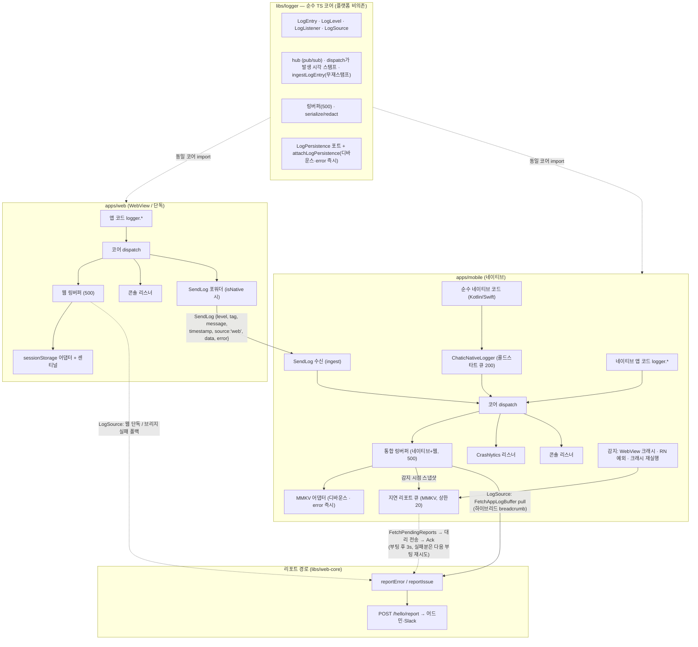
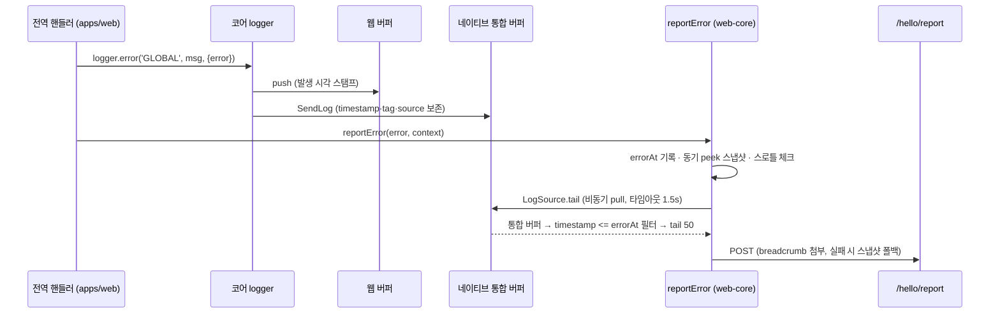

# 통합 로깅 아키텍처 (Unified Logging)

> 상태: Live · 최종 갱신: 2026-08-10 · 관련 ADR: [ADR-0047](../../../docs/adr/0047-unified-logging-core-and-report-traceability.md) (배경: [ADR-0029](../../../docs/adr/0029-error-report-categorization-and-enrichment.md), [ADR-0017](../../../docs/adr/0017-issue-report-floating-widget.md))

## 목적

`apps/web`과 `apps/mobile`에서 발생하는 모든 로그(웹 JS · RN/TS · 순수 네이티브)를 **하나의 로깅 계약(`LogEntry`)** 으로 수렴시키고, 하이브리드에서는 네이티브 통합 버퍼에, 웹 단독에서는 웹 버퍼에 손실 없이 모아, 에러/이슈 리포트(`/hello/report`)의 breadcrumb으로 어드민에서 추적 가능하게 한다.

해결한 문제: 로깅 타입 3중화(코어 `LogEntry` / 모바일 `LogTag`+위치인자 / wire `AppLogInfo`)로 브리지 경계마다 정보가 손실되고(tag 치환, timestamp 재스탬프, error 시 data 유실), 크래시·리소스 실패·네이티브 예외는 감지망 밖이며, `[mobile] script-error` 같은 opaque 리포트가 어드민에서 추적 불가능했다.

## 설계 원칙

1. **코어는 순수 TS.** `libs/logger`는 DOM·React Native·MMKV·Firebase 등 어떤 플랫폼도 import하지 않는다. 플랫폼 동작은 전부 `LogListener` 또는 포트(`LogPersistence`)의 어댑터로 코어 바깥에 배선한다.
2. **발생 시각은 dispatch가 스탬프한다.** 경계(브리지, 큐, 지연 전송)를 건너온 엔트리는 `ingestLogEntry`로 재스탬프 없이 적재한다. 지연 전송되는 리포트도 감지 시각(`occurredAt`)을 싣는다.
3. **경계를 건널 때 정보를 보존한다.** 출처는 tag 치환이 아니라 `source: 'web' | 'native'` 필드로 구분하고(로컬 런타임 발생분은 필드 없음), 원본 tag·timestamp·data·error를 그대로 나른다.
4. **breadcrumb 조회는 항상 `peek`.** `poll`(소비)은 배출형 소비자(예: 후속 주기 업로드) 전용이다.
5. **병합 버퍼의 소유자는 가장 바깥 셸.** 하이브리드는 네이티브 버퍼, 웹 단독은 웹 버퍼가 진실의 원천이다 (`LogSource` 라우팅).
6. **캡처는 죽지 않는 쪽에서.** 크래시류는 사후 감지(웹: 센티널, 네이티브: Crashlytics 재실행 감지)로 잡고, signal handler를 DIY하지 않는다.
7. **서명 전송은 웹 세션 단일 경로.** `/hello/report` 토큰은 웹 세션만 보유하므로 네이티브 감지분은 지연 큐에 쌓고 웹이 대리 전송한다.
8. **로그 전달 경로 자신은 `logger`로 로깅하지 않는다.** 하이브리드에서 `createNativeForwarder`가 엔트리마다 `NativeBridgeAdapter.postMessage`를 호출하므로, 그 **송신 경로** 안에서 `logger`를 부르면 로그 → forwarder → 전송 실패 → 로그로 무한 재귀한다(링버퍼가 500칸을 채울 때까지 폭주하는 것을 테스트로 재현했다). 송신 경로는 `console`만 쓴다 — 전송이 깨진 상황에선 브리지 너머로 보낼 방법이 없으니 잃는 것도 없다. **수신 경로**(`handleNativeMessage`, `AppBridgeHost.handleMessage`, `JsonProtocol.decode`)는 이 제약이 없으므로 `logger`를 써서 breadcrumb에 남긴다. 계약은 [NativeBridgeAdapter.spec.ts](../../bridges/src/web/adapters/NativeBridgeAdapter.spec.ts)가 고정한다.

## 범위

**포함**: 코어 계약 단일화(모바일 `LogService`를 코어 위임으로 대체) · `SendLog` 페이로드 보존 · `LogPersistence` 포트(모바일 MMKV, 웹 sessionStorage) · `LogSource` breadcrumb 라우팅 · 감지 확장(리소스/CSP/페이지 크래시/WebView 크래시/RN 전역 예외/네이티브 크래시 사후) · 순수 네이티브 로그 합류(`ChaticNativeLogger` 이미터) · 지연 리포트 큐+웹 대리 전송 · 추적성(P1 정직화, P2 주입 스크립트 가드, 요청 URL·메서드 노출, 신규 카테고리 6종) · 레거시 `__console__` 제거.

**제외**: 주기적 로그 업로드 파이프라인 · P3 소스맵 심볼리케이션(이 트랙 밖에서 별도로 해결됐다 — [error-reporting.md의 "minified 스택 읽기"](../../web-core/docs/error-reporting.md#minified-스택-읽기)) · fingerprint 개선 · breadcrumb redact 정책 변경 · OS 전체 로그 스트림 · `apps/desktop` 일체.

## 시나리오

**S1 — 웹 단독에서 에러 발생.** uncaught 예외 → [app.tsx](../../../apps/web/src/app/app.tsx)의 전역 핸들러가 ① `logger.error('GLOBAL', …)`로 버퍼 적재(발생 시각 스탬프) ② `reportError`가 `errorAt` 기록 + 동기 스냅샷 후 스로틀 통과 시 breadcrumb 첨부해 POST. sessionStorage 어댑터가 1초 디바운스(error 레벨은 즉시, 최소 간격 100ms)로 버퍼를 영속화.

**S2 — 하이브리드(WebView)에서 에러 발생.** S1의 ①은 동일하고, 웹 로그는 이미 `SendLog`(timestamp·원본 tag·`source:'web'`)로 네이티브 통합 버퍼에 합류해 있다. `reportError`는 `LogSource`(=`nativeMergedLogSource`)로 통합 버퍼를 pull → `timestamp <= errorAt` 필터 → tail 50 첨부. 브리지 실패·1.5초 타임아웃 시 에러 시점 웹 스냅샷으로 폴백.

**S3 — WebView 프로세스 크래시.** [AppWebView](../../../apps/mobile/src/app/webview/AppWebView.tsx)가 iOS `onContentProcessDidTerminate` / Android `onRenderProcessGone`에서 그 순간의 통합 버퍼 스냅샷 + 감지 시각 + `webview-crash`를 지연 리포트 큐(MMKV)에 저장 후 리로드 → 재부팅된 웹이 세션 준비 후 pull해 대리 전송.

**S4 — 순수 네이티브 크래시.** 프로세스 사망, Crashlytics가 스택 캡처. 다음 실행에서 `didCrashOnPreviousExecution()` 확인 → MMKV에 살아남은 직전 세션 버퍼를 breadcrumb으로 `native-crash` 큐잉 → S3과 동일 대리 전송. 스택은 Crashlytics 콘솔에서 시각·디바이스로 대조(이원 체계).

**S5 — 순수 네이티브 코드 로그.** Kotlin/Swift 코드가 `NativeLogger.log(level, tag, message, throwable?)` 호출 → Logcat/NSLog 미러 + `ChaticNativeLog` 이벤트(JS 준비 전이면 네이티브 큐 200건 보관, JS의 `ready()` 신호에 일괄 flush) → `ingestLogEntry`(`source:'native'`) → 통합 버퍼 합류. Android 푸시 서비스(`ChaticFirebaseMessagingService`)가 첫 채택 콜사이트다.

**S6 — 사용자 이슈 리포트.** 클릭 시점이 기준이므로 필터 없이 `collectBreadcrumbs` tail 50 첨부([buildReportContext](../../../apps/web/src/app/features/feedback/lib/buildReportContext.ts)). 스로틀 없음.

**S7 — 웹 페이지 크래시 사후 리포트.** 부팅 시 alive 센티널이 남아 있으면(직전 세션이 pagehide 없이 종료) 직전 세션의 영속 버퍼를 breadcrumb으로 `page-crash` 리포트. 직전 세션 로그는 새 세션 버퍼로 복원하지 않는다 — 크래시 리포트의 몫이다.

## 다이어그램

reportError의 시퀀스(S2 기준):

## 상세 구현

### 코어 (`libs/logger/src`)

| 파일                                    | 역할                                                                                                                                           |
| --------------------------------------- | ---------------------------------------------------------------------------------------------------------------------------------------------- |
| [types.ts](../src/types.ts)             | `LogEntry`(+`source?: LogOrigin`), `LogLevel`, `LogListener`, breadcrumb용 `LogSource { tail(count) }`                                         |
| [logger.ts](../src/logger.ts)           | dispatch(발생 시각 스탬프) · `ingestLogEntry`(경계 통과분 무재스탬프 적재) · `logBuffer.load`(복원분을 부팅 로그 앞에 프리펜드) · 용량 500     |
| [persistence.ts](../src/persistence.ts) | `LogPersistence { load/save }` 포트 + `attachLogPersistence`(디바운스 1s, error 즉시 flush·최소 간격 100ms, `restore` 옵션, teardown 시 flush) |
| [serialize.ts](../src/serialize.ts)     | `SerializedLog`(+`source` 패스스루), 예산 40k/2k                                                                                               |

### 환경 배선 (`libs/bridges/src/logger`)

| 파일                                                              | 역할                                                                                                                                                                                                                                                                                                                                                            |
| ----------------------------------------------------------------- | --------------------------------------------------------------------------------------------------------------------------------------------------------------------------------------------------------------------------------------------------------------------------------------------------------------------------------------------------------------- |
| [logSource.ts](../../bridges/src/logger/logSource.ts)             | **breadcrumb 라우팅의 집.** `webBufferLogSource`(기본) · `setReportLogSource`(하이브리드 교체) · `collectBreadcrumbs`(headroom 20 + errorAt 필터 + 1.5s 타임아웃 + 폴백). web-core가 아닌 bridges에 있는 이유: web-core 배럴은 `import.meta`를 쓰는 transport를 끌고 와 CJS 테스트 환경을 깨고, 환경 배선이라는 성격도 bridges(`setupBridgeLogger`의 집)에 맞다 |
| [nativeForwarder.ts](../../bridges/src/logger/nativeForwarder.ts) | `SendLog`에 `timestamp`·`source:'web'` 포함 (additive — 구버전 앱은 무시)                                                                                                                                                                                                                                                                                       |

### wire 타입 (`libs/app-messages`)

[model/common.ts](../../app-messages/src/types/model/common.ts): `SendLogPayload.timestamp/source`, `AppLogInfo.source`, `PendingReportInfo {id, category, message?, stack?, detectedAt, logs?, extra?}` + `FetchPendingReports`/`AckPendingReports` 메시지 (web-message·app-message·response 맵 등록).

### 모바일 (`apps/mobile`)

| 파일                                                                                                                                                                                                                   | 역할                                                                                                                                                                                                                                                                                                                                                                                                                                  |
| ---------------------------------------------------------------------------------------------------------------------------------------------------------------------------------------------------------------------- | ------------------------------------------------------------------------------------------------------------------------------------------------------------------------------------------------------------------------------------------------------------------------------------------------------------------------------------------------------------------------------------------------------------------------------------- |
| [services/log/LogService.ts](../../../apps/mobile/src/app/services/log/LogService.ts)                                                                                                                                  | 코어 위임 클래스 (provider 배선·DI 타입 유지용). `LogTag` union은 [types.ts](../../../apps/mobile/src/app/services/log/types.ts)의 열린 `string` + `LOG_TAGS` 상수로 대체                                                                                                                                                                                                                                                             |
| [services/log/buffer/LogBufferService.ts](../../../apps/mobile/src/app/services/log/buffer/LogBufferService.ts)                                                                                                        | 코어 버퍼 파사드 + MMKV 영속화 배선. peek/poll은 브리지 안전 형태로 평탄화. 자체 큐·링버퍼는 삭제됨                                                                                                                                                                                                                                                                                                                                   |
| [services/log/persistence.ts](../../../apps/mobile/src/app/services/log/persistence.ts)                                                                                                                                | `MmkvLogPersistence` (동기, 구버전 레코드 정규화). 배럴 미노출 — react-native-mmkv 부수효과가 jsdom 테스트를 깨서 provider가 직접 import                                                                                                                                                                                                                                                                                              |
| [services/log/nativeLoggerBridge.ts](../../../apps/mobile/src/app/services/log/nativeLoggerBridge.ts)                                                                                                                  | `ChaticNativeLog` 이벤트 구독 → `ingestLogEntry(source:'native')`, 구독 후 `ready()`로 네이티브 큐 flush                                                                                                                                                                                                                                                                                                                              |
| [services/report/](../../../apps/mobile/src/app/services/report/)                                                                                                                                                      | `PendingReportQueueService`(MMKV, 상한 20) · `nativeErrorDetection`(ErrorUtils 전역 핸들러+Hermes/promise 거부 추적, `didCrashOnPreviousExecution` 재실행 체크 — logBufferService.init 이후 실행)                                                                                                                                                                                                                                     |
| [webview/hooks/useLogHandler.ts](../../../apps/mobile/src/app/webview/hooks/useLogHandler.ts)                                                                                                                          | SendLog 수신 → `ingestLogEntry` (원본 tag·timestamp·source 보존, 구버전 웹은 수신 시각·WEBVIEW·web 폴백)                                                                                                                                                                                                                                                                                                                              |
| [webview/hooks/usePendingReportHandler.ts](../../../apps/mobile/src/app/webview/hooks/usePendingReportHandler.ts)                                                                                                      | `FetchPendingReports`/`AckPendingReports` 브리지 핸들러                                                                                                                                                                                                                                                                                                                                                                               |
| [webview/AppWebView.tsx](../../../apps/mobile/src/app/webview/AppWebView.tsx)                                                                                                                                          | WebView 크래시 캡처(iOS/Android) → 큐잉 + 리로드                                                                                                                                                                                                                                                                                                                                                                                      |
| [webview/utils/injectionScripts.ts](../../../apps/mobile/src/app/webview/utils/injectionScripts.ts)                                                                                                                    | 주입 스크립트 전체 try/catch 가드 (P2) — 런타임 실패를 `SendLog`(tag INJECTION)로 자기 보고. `__console__` 오버라이드는 제거됨                                                                                                                                                                                                                                                                                                        |
| android [NativeLoggerModule.kt](../../../apps/mobile/android/app/src/main/java/io/chatic/dou/module/NativeLoggerModule.kt) / ios [NativeLoggerModule.swift](../../../apps/mobile/ios/Bridges/NativeLoggerModule.swift) | `NativeLogger.log` 정적 API + 콜드스타트 큐(200) + `ChaticNativeLog` 이미터. Android는 `MainApplication`에 패키지 등록. **iOS 파일이 `Bridges/`에 있는 이유**: 이 디렉터리가 앱 타깃의 `fileSystemSynchronizedGroups`라 새 파일이 자동 컴파일된다. `Chatic/`은 동기화 그룹이 아니어서 pbxproj에 명시 등록해야 하고, 빠뜨리면 모듈이 조용히 빌드에서 누락된다. 채택: Android 푸시 서비스(전체), iOS는 인프라만(현재 NSLog 사용처 없음) |

### 웹 (`apps/web`) · 리포트 경로 (`libs/web-core`)

| 파일                                                                                         | 역할                                                                                                                                                                                                          |
| -------------------------------------------------------------------------------------------- | ------------------------------------------------------------------------------------------------------------------------------------------------------------------------------------------------------------- |
| [main.tsx](../../../apps/web/src/main.tsx)                                                   | 부팅 배선: `attachWebLogPersistence` → `schedulePageCrashReport` → 하이브리드면 `setReportLogSource(nativeMergedLogSource)` → `schedulePendingReportFlush`                                                    |
| [runtime/webLogPersistence.ts](../../../apps/web/src/app/runtime/webLogPersistence.ts)       | sessionStorage 어댑터(탭 격리) + alive 센티널(pagehide로 해제) + 직전 세션 판정                                                                                                                               |
| [runtime/pageCrashReporter.ts](../../../apps/web/src/app/runtime/pageCrashReporter.ts)       | `page-crash` 사후 리포트 (load+3s 지연 — 게스트 부팅 세션 준비 대기, 마지막 영속 엔트리 시각을 `occurredAt`으로)                                                                                              |
| [runtime/pendingReportFlusher.ts](../../../apps/web/src/app/runtime/pendingReportFlusher.ts) | 지연 큐 pull → 대리 전송 → 성공분만 Ack (실패분은 다음 부팅 재시도). 허용 카테고리 외는 unknown 강등                                                                                                          |
| [bridge/nativeLogSource.ts](../../../apps/web/src/app/bridge/nativeLogSource.ts)             | `FetchAppLogBuffer` 기반 `LogSource` + `AppLogInfo→LogEntry` 정규화                                                                                                                                           |
| [app.tsx](../../../apps/web/src/app/app.tsx)                                                 | 전역 감지: `logger.error` 선행 + capture-phase 리소스 로드 실패 + `securitypolicyviolation`                                                                                                                   |
| [web-core api/common.ts](../../web-core/src/api/common.ts)                                   | `collectBreadcrumbs` 사용, `logsOverride`/`occurredAt`/`categoryOverride` 지원, P1 정직화(합성 stack 미첨부+`stackSynthetic`), script-error는 위치·요청 실패는 메서드+URL을 message에 노출, `http.url/method` |
| [web-core api/reportCategory.ts](../../web-core/src/api/reportCategory.ts)                   | `categoryOverride` 최우선 + 신규 6종(`resource-error` `csp-violation` `page-crash` `webview-crash` `native-error` `native-crash`)                                                                             |

디버그 화면(`LogBufferScreen`)의 `webLogSource`는 poll/clear까지 필요한 별도 표면이라 기존 형태를 유지한다 — 리포트 경로의 `LogSource`와는 목적이 다르다.

## 검증 방법

- **유닛** (전부 통과 상태):
    - `libs/logger`: [persistence.spec.ts](../src/persistence.spec.ts) (디바운스·error 즉시 flush·restore·teardown), logger/ringBuffer/serialize 기존 spec
    - `libs/bridges`: [logSource.spec.ts](../../bridges/src/logger/logSource.spec.ts) (errorAt 필터·타임아웃·폴백), [setupBridgeLogger.spec.ts](../../bridges/src/logger/setupBridgeLogger.spec.ts) (timestamp·source 전송)
    - `libs/web-core`: [common.spec.ts](../../web-core/src/api/common.spec.ts) (P1·요청 컨텍스트·override), [reportCategory.spec.ts](../../web-core/src/api/reportCategory.spec.ts)
    - `apps/mobile`: `services/log/log.test.ts`(코어 위임·파사드), `persistence.test.ts`, `nativeLoggerBridge.test.ts`, `services/report/*.test.ts`(큐·감지), `webview/hooks/useLogHandler.test.ts`(보존·폴백)
    - `apps/web`: `runtime/webLogPersistence.test.ts`(센티널·크래시 판정), `runtime/pendingReportFlusher.test.ts`(대리 전송·Ack), `feedback/lib/buildReportContext.test.ts`
- **수동 (웹 단독)**: 게스트 부팅으로 로그인 없이 검증. 디버그 오버레이 `LogBufferScreen`에서 버퍼 확인, 강제 에러 후 payload 확인, 리로드로 sessionStorage 복원·`page-crash` 확인.
- **수동 (하이브리드)**: 통합 버퍼에 웹 로그의 원본 tag·시각·`source:web` 표시 확인, 리포트 breadcrumb에 네이티브+웹 혼합 확인, (에뮬레이터) WebView 강제 종료 후 재부팅 시 `webview-crash` 대리 전송 확인. **네이티브 코드(Kotlin/Swift)는 이 트랙에서 컴파일 검증을 하지 않았다 — 첫 앱 빌드에서 확인 필요.**
- **호환성**: timestamp 없는 SendLog(구버전 웹) → 수신 시각 폴백 (useLogHandler.test 커버). 구버전 앱 + 신버전 웹의 `FetchPendingReports` 미지원 → flusher가 실패를 warn 로그로 삼키고 종료.
