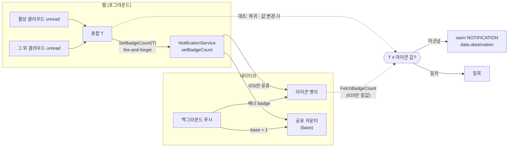
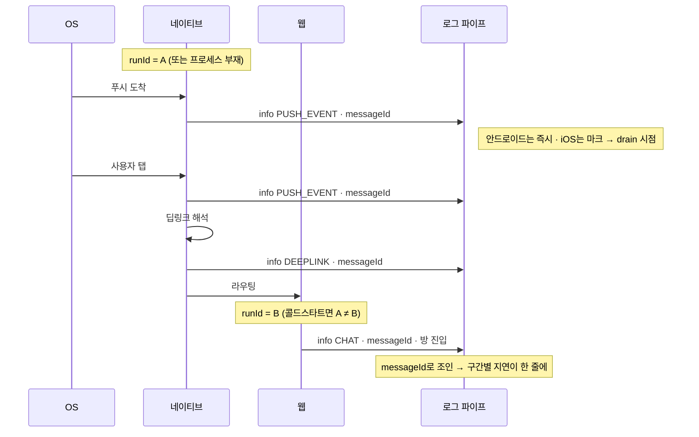

# 정합성 검증 트리거 (Divergence Checks)

> 상태: **Live** · 최종 갱신: 2026-09-07 · 관련 ADR: [ADR-0075](../../../docs/adr/0075-divergence-triggers-and-push-payment-log-coverage.md)
>
> 함께 읽을 것: [통합 로깅 아키텍처](./architecture.md) (이 트리거가 올라타는 파이프) · [성능 지표](./perf-metrics.md) (같은 파이프에 얹힌 형제 트리거 클래스 — 이 문서와 같은 관계다) · [뱃지](../../../apps/mobile/docs/badge.md) · [푸시](../../../apps/mobile/docs/push.md) (대조 대상이 사는 곳) · [ADR-0048](../../../docs/adr/0048-unread-count-derivation-contract.md) (안 읽음 파생 계약 — 재계산의 기준식)
>
> **트리거 카탈로그의 정본은 이 문서가 아니다.** "무엇을 어떤 레벨·태그로 남기는가"는 knowledge vault `projects/@lemoncloud-io/dou-app/log-collection/triggers.md`가 정본이다. 이 문서는 그 계약이 코드에서 어떻게 서 있는지를 서술한다.

## 목적

**두 값이 어긋난 것을 로그로 증명한다.**

필드에서 오래 살아남는 이슈들은 실패하지 않는다. 앱 아이콘 뱃지와 인앱 안 읽음이 다르고, 방을
나갔는데 카운트가 남고, 나간 멤버가 설정 화면에 남고, 개명한 클라우드가 한 화면에서만 옛 이름이다.
어느 것도 예외를 던지지 않으므로 실패 지향 트리거로는 잡히지 않는다.

이 문서가 다루는 트리거는 그래서 **비교**를 한다. 일치해야 하는 두 소스를 클라이언트가 직접 읽어
맞춰 보고, 어긋날 때만 한 줄 남긴다. 판정을 클라이언트가 하는 이유는 조회 쪽 제약에 있다 — 어드민
로그 목록이 서버사이드로 좁힐 수 있는 의미 축은 `level` 하나뿐이므로([reportLogApi.ts:87](../../../apps/admin-v2/src/app/features/report-logs/api/reportLogApi.ts:87)),
"값을 다 올려두고 나중에 비교한다"는 성립하지 않는다.

## 설계 원칙

1. **판정은 클라이언트가, 조회는 `level`이 한다.** 불일치는 `warn`이다. 서버가 값으로 필터할 수
   없으므로 사람이 찾을 수 있는 형태로 남는 것이 첫 조건이다.

2. **일치는 침묵한다.** 값이 맞으면 아무것도 기록하지 않는다. 정상 상태의 엔트리 비용이 0이어야
   대조를 여러 곳에 둘 수 있다.

3. **읽을 수 없는 값은 대조하지 않는다.** 없는 값을 0으로 받아 비교하면 그 플랫폼 전 기기가 상시
   불일치가 되고, 진짜 불일치가 그 잡음에 묻힌다. 안드로이드 뱃지가 정확히 이 사례다(§상세 구현).

4. **대조는 화면·훅 층에서만 돈다.** 리스너 안이나 전송 경로에서는 절대 대조하지 않는다. 리스너는
   수집기가 엔트리를 나눠 줄 때 그 자리에서 동기로 돌기 때문에 거기서 `logger`를 부르면 즉시
   재진입이고, 전송 경로의 `logger → 전송 → 실패 → logger`는 실제로 재현돼 테스트로 고정된
   재귀다(카탈로그 금지 규칙 3·4).

5. **값은 `data`에, 문장은 `message`에.** 양변과 차이가 각각 키를 가져야 분석이 정규식이
   아니라 `JSON.parse`가 된다([성능 지표](./perf-metrics.md) 원칙 2와 같은 이유). `message`는
   사람이 breadcrumb 한 줄로 알아볼 수 있게 쓴다.

6. **태그는 도메인 태그를 쓴다.** `DIVERGE` 같은 새 태그를 만들지 않는다 — 만들면 "뱃지 관련 로그
   전부"가 두 태그로 갈라진다. 구분은 `data.observation` 판별자가 한다 — 이 문서의 대조뿐 아니라
   [조용한 실패·유실](./silent-loss-triggers.md)의 집계·스트릭까지 **모든 구조화 엔트리가 같은 키**를
   쓴다(`ObservationKind`, `libs/logger/src/core/observation.ts`).

7. **파괴적 조회는 그 자리에서 로깅한다.** 읽으면 사라지는 소스(푸시마크 drain)는 읽은 순간이
   유일한 기록 기회다. 그 자리를 놓치면 증거가 영구 소실된다.

8. **대조 시점은 포그라운드 복귀와 값 변경 시다.** 렌더마다·폴링 주기마다 대조하지 않는다. 동기화
   폴링이 타겟당 2초이고 홈에서 수십 개가 동시에 도는 구조라, 렌더 단위 대조는 미전송 큐의
   건수·바이트 예산을 소진시킨다. 축출은 오래된 것부터라 **사고 원인 쪽이 먼저 버려진다.**

## 범위

**포함**

- 대조쌍 4개: 뱃지(iOS) · 안 읽음 · 멤버 · 표시 이름
- 푸시 수신 계열의 카탈로그 갭: 웹 수신 로그의 상시화·태그·본문 제거, 백그라운드 수신의 레벨 승격,
  푸시마크 drain 승격
- 푸시 상관 키(`messageId`)를 수신·탭·라우팅·방 진입 네 지점에 심기
- 결제 갭: 네이티브 IAP 서비스 층의 초기화·구매 실패·finish 실패
- 채널 나가기·멤버 동기화 트리거, 소켓 재연결·포기 구독

**제외**

- **불일치의 자동 보정.** 진단 전용이다 — 자동으로 메우면 어디서 갈라졌는지 모르는 채로 증상만
  사라진다(ADR-0075 §2).
- **안드로이드 뱃지의 실제 동작 수정.** 조사 중 드러난 별개 결함이고 별 작업으로 분리했다(§리스크 R1).
- **캐시 값 vs 서버 값 대조** · **미전송 큐 유실률** · **신규 `PERF` 지표** · **서버 측 구현**.
- **연락처 이름 누락(#15)**.

## 시나리오

각 시나리오의 마지막 줄이 이 트리거가 만들어 내는 **증거**다.

### S1 — 뱃지가 지워지지 않는다 (#1, iOS)

1. 사용자가 백그라운드에서 푸시 2건을 받는다. NSE가 App Group 카운터를 2로 올리고 배너의 badge를 2로 쓴다.
2. 앱을 열고 방에 들어가 다 읽는다. 웹이 활성 클라우드 0 + 그 외 클라우드 0 = 총합 0을 파생해 `SetBadgeCount(0)`을 밀어 넣는다.
3. 아이콘에는 여전히 2가 보인다.
4. **포그라운드 복귀 시점의 대조**가 돈다 — 아이콘을 덮어쓰기 **전에** 읽어, 기기가 아직 보여주고
   있어야 할 값(마지막으로 밀어넣은 `0`)과 실제 값(`2`)을 맞춘다.
5. → `warn` / `NOTIFICATION` / `data = { observation: 'badge-divergence', web: 0, native: 2, delta: -2, breakdown: { active: 0, others: 0 } }`

`delta`의 부호가 어느 쪽이 앞서 있는지를 말해 준다. 웹이 크면 파생이 과다 집계하는 쪽, 네이티브가
크면 절대값 쓰기가 도달하지 못한 쪽이다. 안드로이드에서는 앱이 배포되기 전까지 우변을 읽을 수 없어
이 시나리오가 침묵한다(§상세 구현).

### S2 — 방을 나왔는데 카운트가 남는다 (#11)

1. 방에서 대화를 주고받는다. [useReadMarker](../../../apps/web/src/app/features/channels/hooks/useReadMarker.ts)가 마지막으로 마크한 `chatNo`를 알고 있다.
2. 목록으로 돌아간다. 목록은 join 캐시의 커서로 [countUnread](../../../apps/web/src/app/utils/countUnread.ts)를 계산한다.
3. 카운트가 남아 있다.
4. **목록 마운트 시 1회 대조**가 돈다 — 방이 마크한 커서 vs join 캐시의 커서, 그리고 그려진 카운트.
   마크 이후 머리가 전진했다면(새 메시지 도착) 대조하지 않는다 — 그건 카운트가 남는 게 정상이다.
5. → `warn` / `CHAT` / `data = { observation: 'unread-divergence', channelId, markedChatNo, cursorChatNo, headChatNo, drawn, cursorLanded, hasReadMetaNo }`

이 한 줄이 두 원인을 갈라 준다. `markedChatNo > cursorChatNo`면 **읽음이 캐시에 앉지 않은 것**이고,
커서가 같은데 `drawn > 0`이면 **`chatNo − metaNo` 환산 쪽**이다 — 후자는 `readMetaNo` 없는 낡은
join 행에서 카운트가 높게 나오는 ADR-0048의 알려진 폴백과 같은 얼굴이므로, `readMetaNo`의 유무를
함께 싣는다.

### S3 — 나간 멤버가 설정 화면에 남는다 (#2)

1. 멤버가 방을 나가 join 레코드가 사라진다.
2. `channel.memberIds`는 아직 그를 담고 있다.
3. [useChannelMembers](../../../apps/web/src/app/features/channels/hooks/useChannelMembers.ts)가 `memberIds ∪ joins ∪ users`를 **합집합**으로 세우므로([:116](../../../apps/web/src/app/features/channels/hooks/useChannelMembers.ts:116)) 그가 계속 렌더된다.
4. **화면을 떠날 때 대조**가 돈다 — `memberIds − joinUserIds`의 차집합이 곧 유령 멤버다. 떠나는
   시점을 고른 이유는 join 캐시가 흘러 들어와서다: 수화 도중에는 멤버 전원이 로스터에만 있어 보인다.
5. → `warn` / `CHANNEL` / `data = { observation: 'member-divergence', channelId, rosterOnly: n, joinOnly: m, joinCount }`

**사용자 id는 싣지 않는다** — 건수와 방향만으로 "로스터가 앞서 있다 / join이 앞서 있다"가 판별된다.

### S4 — 개명했는데 MY는 옛 이름이다 (#14)

1. 클라우드 이름을 바꾼다. 로컬 이름 캐시가 즉시 새 이름을 갖는다.
2. 홈 헤더는 로컬 캐시를 카탈로그보다 **우선**하므로([HomePage.tsx:95](../../../apps/web/src/app/features/home/pages/HomePage.tsx:95)) 새 이름을 보여 준다.
3. MY의 화면들은 릴레이 카탈로그만 읽으므로 옛 이름을 보여 준다.
4. **카탈로그 응답이 도착할 때 대조**가 돈다 — 로컬 캐시의 이름 vs 카탈로그의 이름.
5. → `warn` / `CLOUD` / `data = { observation: 'cloud-name-divergence', cid, cachedLen, catalogLen }`

**이름 원문을 싣지 않는다.** 사용자가 정한 문자열이므로 길이와 일치 여부만 남긴다 — 진단에 필요한
것은 "어긋났다"와 "얼마나 오래 어긋난 채인가"이고, 그 둘은 원문 없이 성립한다.

### S5 — 콜드스타트 푸시 탭 후 방이 늦게 뜬다 (#10)

1. 앱이 죽은 상태에서 푸시가 온다. 네이티브가 수신을 기록한다 — `messageId` 포함.
2. 사용자가 탭한다. 딥링크가 경로를 해석해 웹으로 라우팅한다 — 같은 `messageId`.
3. 웹이 방에 진입해 메시지를 싣는다 — 같은 `messageId`.
4. `runId`는 1과 3 사이에서 갈리지만, `messageId`로 조인하면 네 지점의 타임스탬프가 한 줄에 선다.
5. → 어드민에서 그 `messageId`로 필터하면 **어느 구간이 길었는지**가 그대로 보인다. 진입 로그가
   아예 없으면 라우팅이 drop된 것이고, 진입은 있는데 메시지가 없으면 로딩 쪽이다.

### S6 — 백그라운드 수신이 흔적을 남긴다 (#1 · #7의 절반)

1. 앱이 백그라운드다. 안드로이드는 앱 프로세스의 메시징 서비스가, iOS는 NSE가 푸시를 처리한다.
2. 안드로이드는 그 자리에서 `info`로 남긴다 — 네이티브 로거에 닿는다.
3. iOS의 NSE는 **네이티브 로거에 닿지 못한다**(별 프로세스). 대신 이미 하고 있는 대로 App Group에
   마크를 남긴다.
4. 다음 포그라운드에서 웹이 `FetchPushMarks`로 그 마크를 **읽고 지운다**([CloudPushMarkRunner.tsx:81](../../../apps/web/src/app/features/home/CloudPushMarkRunner.tsx:81)).
5. → 그 drain 자리에서 `info` / `PUSH_EVENT` 한 줄. 건수와 각 마크의 `cid`만 싣는다 — 레코드에는
   `channelName`도 들어 있으므로 그대로 싣지 않는다. 이 자리를 놓치면 iOS 백그라운드 수신은 어디에도
   남지 않는다. 건수는 하한이다(§리스크 R6).

### S7 — 결제가 실패한다 (#13)

1. iOS에서 구글 계정으로 로그인한 사용자가 구독을 시도한다.
2. 웹이 스토어를 열기 전에 거절한다 — 이미 있는 `warn` / `IAP` / `{ reason: 'social-link-missing' }`.
3. 또는 스토어까지 갔다가 네이티브 서비스 층에서 실패한다 — 이 경로가 **지금 비어 있다**.
4. → 서비스 층의 초기화·구매·finish 실패 로그가 3번 경로의 스토어 실패 원인을 보존한다. 2번이
   원인이라면 그 `warn`이 이미 답이었으므로, 이 트랙이 새로 심은 것은 3번뿐이다.

## 다이어그램

### 뱃지 — 쓰는 주체 셋과 대조 지점



안드로이드에서 `D → E` 간선이 성립하지 않는 것이 §상세 구현의 핵심 제약이고, 그래서 `FetchBadgeCount`
쪽 점선도 iOS에만 열린다.

### 푸시 상관 체인 — `messageId`로 조인되는 네 지점



## 상세 구현

### 대조 지점

네 대조는 모두 [`divergenceReporter`](../../../apps/web/src/app/runtime/logging/divergenceReporter.ts)를
거친다. 판정("어긋났는가")과 침묵("맞으면 아무것도 남기지 않는다")이 그 안에 있으므로, 호출부는 양변을
읽어 넘기는 일만 한다 — 같은 규칙이 네 군데에 복사되면 그중 하나는 반드시 달라진다.

| 대조쌍    | 좌변                                                                                                                       | 우변                                                                                            | 대조 시점                            | level · tag           |
| --------- | -------------------------------------------------------------------------------------------------------------------------- | ----------------------------------------------------------------------------------------------- | ------------------------------------ | --------------------- |
| 뱃지      | [UnreadBadgeRunner.tsx](../../../apps/web/src/app/features/home/UnreadBadgeRunner.tsx) — 마지막으로 밀어넣은 값            | [`nativeBadgeReader`](../../../apps/web/src/app/runtime/logging/nativeBadgeReader.ts)           | 앱 런 첫 push 직전 · 포그라운드 복귀 | warn · `NOTIFICATION` |
| 안 읽음   | [ChannelList.tsx](../../../apps/web/src/app/features/home/components/ChannelList.tsx) — 목록이 그린 카운트                 | [`readMarkRegistry`](../../../apps/web/src/app/runtime/logging/readMarkRegistry.ts)의 마크 커서 | 목록 마운트당 1회                    | warn · `CHAT`         |
| 멤버      | [ChannelSettingsPage.tsx](../../../apps/web/src/app/features/channels/pages/ChannelSettingsPage.tsx) — `channel.memberIds` | 같은 화면의 join 레코드                                                                         | 화면을 떠날 때 1회                   | warn · `CHANNEL`      |
| 표시 이름 | [HomePage.tsx](../../../apps/web/src/app/features/home/pages/HomePage.tsx) — 로컬 이름 캐시                                | 릴레이 카탈로그 응답                                                                            | 카탈로그 응답 도착 시                | warn · `CLOUD`        |

시점 선택에는 각각 이유가 있고, 그 이유가 곧 오탐을 막는 장치다.

- **뱃지는 "마지막으로 밀어넣은 값"과 비교한다.** 현재 총합과 비교하면 정상적인 읽음이 전부 불일치가
  된다 — 쓰기는 fire-and-forget이고 아이콘은 설계상 뒤처지므로, 방금 읽어 0이 된 총합과 아직 2인
  아이콘은 어긋난 게 아니다. 앱 런의 첫 대조에는 이전 값이 없으므로 곧 쓸 총합이 그 자리를 대신한다 —
  콜드 스타트에서 그 총합은 진실이고 아이콘에는 백그라운드 핸들러가 남긴 값이 있다.
- **안 읽음은 목록 마운트당 1회다.** 채널·join 스트림이 상시 밀려들어 렌더마다 대조하면 그저 바쁜 방에
  기기 로그 예산을 쓴다. 그리고 마크 이후 머리가 전진했으면(새 메시지 도착) 대조하지 않는다 — 그건
  카운트가 남는 게 정상인 경우다.
- **멤버는 화면을 떠날 때다.** join 캐시가 흘러 들어오므로 수화 도중 스냅샷은 멤버 전원을 "로스터에만
  있음"으로 세어 버린다. 사용자가 화면을 떠날 때는 양쪽이 안정돼 있다.
- **표시 이름은 카탈로그가 답한 뒤다.** 응답 전에는 어긋날 상대가 아직 없다.

**"모름"을 0으로 읽지 않는 것이 이 네 지점의 공통 규율이다**(원칙 3). 구체적으로 세 곳에서 건너뛴다 —
기기 뱃지를 읽을 수 없을 때(`null`), 채널 로스터가 아직 안 왔을 때(`memberIds`가 `undefined`인 것은
"빈 방"이 아니다), join을 아직 못 읽었을 때(0건은 빈 방과 구분되지 않는다).

### 기기 뱃지를 읽는 두 창구

[`nativeBadgeReader`](../../../apps/web/src/app/runtime/logging/nativeBadgeReader.ts)가 플랫폼별로 갈라
읽고, 어느 쪽도 답할 수 없으면 `null`을 낸다.

| 플랫폼  | 창구                    | 왜                                                                                                                                           |
| ------- | ----------------------- | -------------------------------------------------------------------------------------------------------------------------------------------- |
| iOS     | `FetchBadgeCount`       | notifee가 실제 `applicationIconBadgeNumber`를 읽는다 — 참값이다                                                                              |
| Android | `FetchBadgeBase` (신설) | notifee의 badge API는 iOS 전용이라 **항상 0**을 답한다. 진짜 값은 네이티브 공유 카운터에만 있고, 그것을 읽는 `BadgeSync.getBase`를 새로 뒀다 |
| 그 외   | 없음 → `null`           | 브라우저에는 아이콘 뱃지가 없다                                                                                                              |

**새 메시지 타입으로 낸 이유는 웹이 앱보다 먼저 배포되기 때문이다.** 기존 메시지의 의미를 바꾸면
구버전 셸이 답하는 0을 참값과 구분할 수 없다. 새 타입은 구버전 셸에서 `NOT_FOUND`로 돌아오고, 리더는 그
답 하나로 "이 셸은 모른다"를 세션 내내 학습한다 — 타임아웃이나 전송 실패는 학습하지 않는다(일시적 실패
한 번이 세션 전체를 침묵시키면 안 된다). [`nativeUploadSource`](./architecture.md)가 같은 이유로 같은
모양을 쓴다.

### 엔트리 형태

```
logger.warn('<도메인 태그>', '<사람이 읽을 한 줄>', {
    observation: '<종류>',
    ...양변, ...차이,
} satisfies ObservationData);
```

`observation`은 [`ObservationKind`](../src/core/observation.ts)의 값이고, 이 문서의 대조 네 종은
`badge-divergence` · `unread-divergence` · `member-divergence` · `cloud-name-divergence`다. 대조쌍이
늘면 그 union에 붙는다 — `satisfies`가 붙어 있어 오타는 컴파일에서 걸린다.

**판별자가 하나인 이유**: 예전에는 생산자마다 자기 봉투를 만들었고(`divergence.kind`,
`foreignDrop.source`) 그중 하나는 이름이 충돌했다 — 커서 폐기 엔트리의 `kind`는 "어느 커서"를,
대조의 `kind`는 "어느 비교"를 뜻했다. 스크립트가 셋을 다 알아야 했고 그러고도 엉뚱한 필드를 읽을 수
있었다. 지금은 평평한 한 자리다.

`error`가 아닌 레벨이므로 시그니처는 `(tag, message, data)`이고, `{ error, data }`를 그대로 넘기면
`data.data`로 이중 중첩된다(카탈로그 §호출 시그니처 규약).

`message`는 **방향**만 말한다 — `device ahead` / `web ahead`, `cursor behind mark` / `cursor landed but
count remains`, `roster ahead` / `joins ahead`. 숫자는 `data`에 있다.

싣지 않는 것: 사용자 id, 클라우드·채널 이름 원문, 메시지 본문, 푸시 제목·본문. 건수·길이·일치 여부로
대체한다.

### 푸시 하나를 끝까지 따라가기

`messageId`가 네 지점을 잇는다. 앱이 죽어 있었으면 수신과 진입이 서로 다른 앱 런에 걸리므로 `runId`
조인만으로는 체인이 끊긴다.

| 지점                              | 어디서                                                                                                                                   | 남기는 것                                                                                                    |
| --------------------------------- | ---------------------------------------------------------------------------------------------------------------------------------------- | ------------------------------------------------------------------------------------------------------------ |
| 수신 (안드로이드 배경·포그라운드) | [ChaticFirebaseMessagingService.kt](../../../apps/mobile/android/app/src/main/java/io/chatic/dou/push/ChaticFirebaseMessagingService.kt) | `info` — 배너 표시 여부와 **뱃지 증가값**. 이전에는 `debug`라 릴리스 빌드에서 통째로 사라졌다                |
| 수신 (iOS 배경)                   | [CloudPushMarkRunner.tsx](../../../apps/web/src/app/features/home/CloudPushMarkRunner.tsx)의 drain                                       | `info` — 건수와 `cid`. 확장 프로세스는 로거에 닿지 못하므로 **읽고 지우는 그 자리**가 유일한 기회다          |
| 수신 → 웹 릴레이                  | [useFcmHandler.ts](../../../apps/mobile/src/app/webview/hooks/useFcmHandler.ts)                                                          | `info` — ids만. OS→RN→웹 세 홉 중 어디서 사라졌는지를 가른다                                                 |
| 수신 (웹) + 배너 판정             | [useInAppPushMessage.tsx](../../../apps/web/src/app/hooks/useInAppPushMessage.tsx)                                                       | `info` — 한 줄에 수신과 판정을 함께: `banner shown` 또는 `suppressed (silent\|own-message\|viewing-channel)` |
| 탭                                | [useDeepLinkNavigation.ts](../../../apps/mobile/src/app/webview/hooks/useDeepLinkNavigation.ts) · 인앱 배너 클릭                         | `info` — 콜드스타트 여부, 경로 해석 성공 여부                                                                |
| 방 진입 · 대화 표시               | [ChannelRoomPage.tsx](../../../apps/web/src/app/features/channels/pages/ChannelRoomPage.tsx)                                             | `info` 2건 — 라우팅 소요와 메시지가 실제로 뜬 시점                                                           |

진입 쪽은 [`pushEntryRegistry`](../../../apps/web/src/app/runtime/logging/pushEntryRegistry.ts)가 탭에서
방으로 한 슬롯을 넘긴다. **푸시로 온 진입만** 남는다 — 방은 상시 열리므로 전건 로깅은 볼륨이 감당되지
않고, 30초 TTL이 있어 다른 곳으로 가버린 탭이 나중에 열리는 무관한 방에 지연 수치를 붙이지 못한다.

수신 엔트리에 배너 판정을 **함께** 실은 것은 의도다. 두 줄로 나누면 같은 사건이 두 엔트리가 되고, "왜
배너가 안 떴나"는 수신 줄과 판정 줄을 짝지어야 답이 된다.

### 결제 · 그 밖의 갭

| 무엇                                  | 어디서                                                                                                       | 남기는 것                                                                                                                    |
| ------------------------------------- | ------------------------------------------------------------------------------------------------------------ | ---------------------------------------------------------------------------------------------------------------------------- |
| 스토어 연결 · 구매 거절 · finish 실패 | [SubscriptionIapService.ts](../../../apps/mobile/src/app/services/subscriptionIap/SubscriptionIapService.ts) | `error` / `IAP`. 카탈로그가 핸들러가 아니라 **서비스 계층**을 지정한 이유는 스토어 실패의 원인이 이 층에만 보이기 때문이다   |
| 채널 생성·수정·나가기·삭제·초대 실패  | [useChannelMutations.ts](../../../apps/web/src/app/features/channels/hooks/useChannelMutations.ts)           | `error` / `CHANNEL`. 공용 러너에 한 번 달아 새 액션이 로그를 빠뜨릴 수 없게 했다                                             |
| 강퇴는 됐는데 로컬 join 마크가 실패   | 같은 파일                                                                                                    | `error` / `CHANNEL` — 러너의 일반 엔트리와 구분해 따로 남긴다. 서버는 지웠는데 목록만 안 지워지는, 바로 그 리포트의 모양이다 |
| 읽음 커서 뮤테이션 실패               | [useJoinMutations.ts](../../../apps/web/src/app/features/channels/hooks/useJoinMutations.ts)                 | `error` / `CHAT`                                                                                                             |
| 소켓 재연결 시도 실패 · 포기          | [SocketManager.ts](../../../libs/app-runtime/src/socket/SocketManager.ts)                                    | `warn` / `error` / `SOCKET`. 포기는 종단이라 이 줄이 없으면 "조용한 슬롯"과 "영구히 죽은 슬롯"이 같아 보인다                 |

**소켓 구독은 런타임 존재 확인 후에 붙인다.** `onConnectFailed`/`onGiveUp`은 SDK가 지금 만드는 컨트롤러
구현에는 있지만 SDK가 공개한 인터페이스(`start`/`stop`/`restart`)에는 **없다**. 런타임 사실이지 타입
계약이 아니므로, 없으면 조용히 건너뛴다 — 진단 전용 신호라 부재의 대가가 작다. 정공법은 SDK에
인터페이스 확장을 요청하는 것이고, 그 요청 전까지 이 구독은 있으면 얻고 없으면 잃는 상태다.

### 지나가며 걷어낸 규칙 위반

로그를 심으려고 파일을 열어 보니 이미 실려 있던 것들이다. 전부 카탈로그 금지 규칙(자격증명·본문 미첨부)
위반이고, `debug`도 비-릴리스 빌드에서는 서버까지 가므로 예외가 아니다.

| 무엇                                       | 어디                                      |
| ------------------------------------------ | ----------------------------------------- |
| FCM/APNs 토큰 원문                         | `useFcmHandler` — 존재 여부만 남기도록    |
| 안드로이드 릴레이 로그에 푸시 제목·본문    | `useFcmHandler` — ids만                   |
| 번역된 푸시 제목·본문                      | `ChaticFirebaseMessagingService` — 길이만 |
| 푸시 클라우드 힌트 payload(채널 이름 포함) | 같은 파일의 파싱 실패 로그 — 예외만       |
| 스토어 `offerToken` 값                     | `SubscriptionIapService` — 존재 여부만    |

## 검증 방법

**유닛** — 대조 로직은 순수 비교이므로 테스트가 싸다.

| 무엇                                               | 어디                                                                          |
| -------------------------------------------------- | ----------------------------------------------------------------------------- |
| 대조 4종의 판정·침묵·건너뛰기                      | `apps/web/src/app/runtime/logging/divergenceReporter.test.ts`                 |
| 기기 뱃지 두 창구와 `NOT_FOUND` 학습               | `apps/web/src/app/runtime/logging/nativeBadgeReader.test.ts`                  |
| 마크 커서 기록·상한·축출 순서                      | `apps/web/src/app/runtime/logging/readMarkRegistry.test.ts`                   |
| 탭→진입 인수인계와 TTL                             | `apps/web/src/app/runtime/logging/pushEntryRegistry.test.ts`                  |
| 뱃지 대조 시점(마운트·복귀, total 변경 시엔 안 함) | `apps/web/src/app/features/home/UnreadBadgeRunner.test.tsx`                   |
| 스토어 실패 3종과 토큰 미첨부                      | `apps/mobile/src/app/services/subscriptionIap/SubscriptionIapService.test.ts` |
| 소켓 재연결·포기 구독과 부재 시 무해함             | `libs/app-runtime/src/socket/SocketManager.test.ts`                           |
| 디버그 훅이 더 이상 로그를 남기지 않음(중복 방지)  | `apps/web/src/app/features/debug/hooks/useReceivedPushLog.test.ts`            |

**모든 대조 테스트는 "일치하면 `warn`이 불리지 않는다"를 함께 검증한다.** 원칙 2가 깨지면 정상 기기가
매번 엔트리를 만들고, 그건 대조를 여러 곳에 둔 결정 자체를 되돌려야 하는 문제가 된다.

**함정** — `@chatic/bridges` 목이 부분적이다. 대부분 `{ logger: { error: jest.fn() } }`만 갖고 있어서
기존 파일에 `logger.warn`/`info`를 새로 넣으면 그 파일을 쓰는 스위트가 `TypeError`로 죽는다. 이번에도
`ChannelSettingsPage` 스위트가 그렇게 깨져 목을 넓혔다. 로그를 추가하기 전에 해당 모듈의 목을 먼저 본다.

**수동** — Kotlin/Swift는 저장소에 유닛 하네스가 없어 기기 검증으로 대체하고, **네이티브 변경은 앱이
배포된 뒤에만 유효하다**(웹 레인은 먼저 나간다).

- `scripts/send-test-push.js`로 백그라운드 푸시 → 승격된 수신·뱃지 로그가 **릴리스 빌드에서** 남는지.
- iOS: 백그라운드 푸시 2건 → 앱 열기 → drain 엔트리의 건수가 2인지(상한·필드 부재로 하한임을 감안).
- 안드로이드: 앱 배포 후 `FetchBadgeBase`가 답하는지, 그전에는 대조가 조용히 건너뛰는지.
- 어드민에서 `level=warn`으로 필터해 대조 엔트리가 실제로 걸리는지, 푸시 하나를 `messageId`로 훑어
  네 지점이 한 줄에 서는지.
