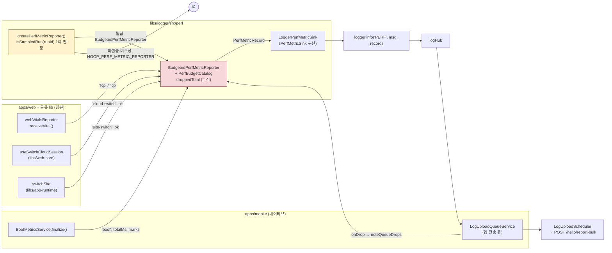
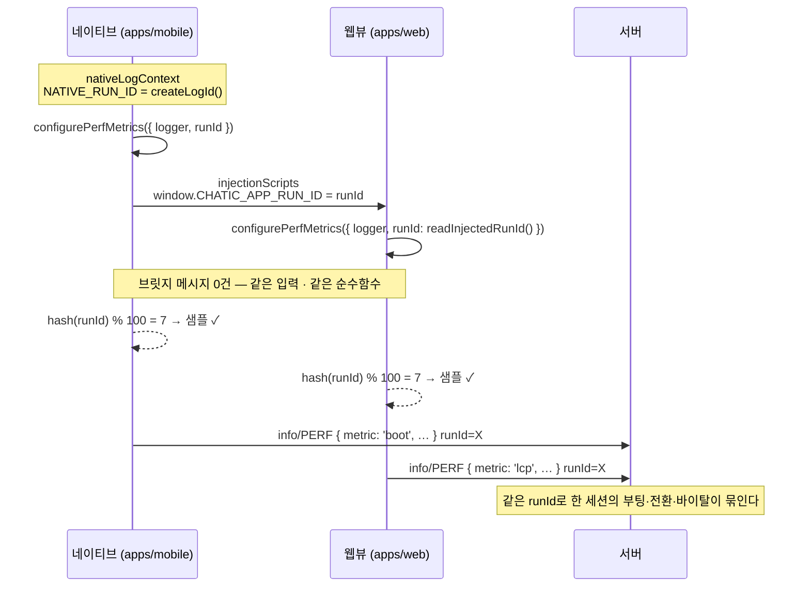
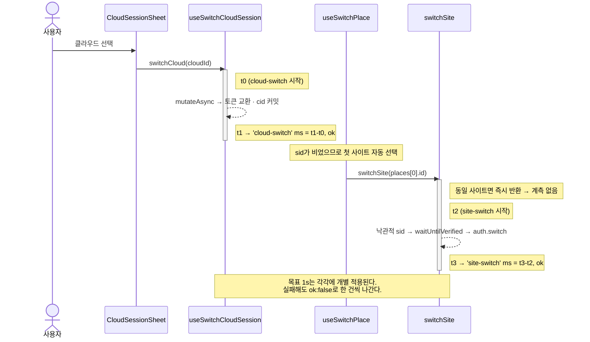

# 성능 예산과 지표 이벤트 (Performance Budget & Metric Events)

> 상태: **Live** · 최종 갱신: 2026-08-27 · 관련 ADR: [ADR-0071](../../../docs/adr/0071-performance-budget-and-metric-events-over-the-log-pipeline.md)
>
> 함께 읽을 것: [통합 로깅 아키텍처](./architecture.md) (이 지표가 올라타는 파이프) · [부팅 지표](../../../apps/mobile/docs/boot-metrics.md) (`totalMs`의 정의와 실측 베이스라인) · [ADR-0065](../../../docs/adr/0065-hybrid-performance-trace-profiler.md) (인앱 트레이스 프로파일러 — **병행 레인**, 계측 초크포인트만 공유하고 코드는 겹치지 않는다)

## 목적

메인 시나리오 5개에 **숫자로 된 목표치**를 두고, 그 달성 여부를 **실사용자 데이터**로 감시한다.

지금까지 성능은 수작업 측정으로만 확인됐다 — [ADR-0027](../../../docs/adr/0027-native-webview-early-mount-boot-optimization.md)의 부팅 최적화도, [ADR-0057](../../../docs/adr/0057-home-last-chat-preview-single-query.md)/[ADR-0058](../../../docs/adr/0058-navigation-churn-grace-and-seeding.md)의 홈 쿼리 폭주 수정도 개발자 기기에서 한 번 재보고 끝났다. 그래서 "고쳤다"는 알지만 "실제 사용자에게 나아졌다"는 모른다. 버전별 회귀도 릴리스가 나간 뒤 누가 체감으로 신고해야 발견된다.

이 문서가 서술하는 것은 그 공백을 메우는 **최소 구성**이다: 목표치의 끝점을 못박고, 소수 세션의 실측값을 구조화된 로그 이벤트로 기존 파이프에 실어 보낸다. 목표 미달을 자동으로 알리거나 릴리스를 막는 게이트는 **범위 밖**이다.

## 설계 원칙

1. **지표는 새 파이프를 파지 않는다.** `level: 'info'`, `tag: 'PERF'`의 로그 엔트리로 기존 업로드 파이프([통합 로깅](./architecture.md))에 올라탄다. `BootMetricsService`가 이미 쓰던 관용구를 잇는 것이라 백엔드 협의·신규 스키마·신규 엔드포인트가 0이다. 지표가 자기 전송 경로를 갖게 되는 날은 표본이 커져 오프라인 집계가 한계에 닿는 날이지, 오늘이 아니다.

2. **숫자는 문장이 아니라 `data`에 있다.** `total 1099ms` 같은 자유 텍스트에 숫자를 섞지 않는다. 지표 종류·값·목표·판정·구간 마크가 각각 키를 가져, 분석이 정규식이 아니라 `JSON.parse`가 되게 한다. 사람이 읽을 문장은 `message`에 따로 둔다 — 두 독자(사람, 스크립트)를 한 문자열이 겸하려 들면 반드시 한쪽이 진다.

3. **분석 축을 새로 만들지 않는다.** `runId`·`appVersion`·`webVersion`·`os`·`osVersion`·`model`·`route`는 [`LogContext`](../src/core/types.ts)가 이미 모든 엔트리에 실어준다. 지표는 자기 식별자를 덧붙이지 않으므로 버전별 회귀 비교와 기기별 편향 분석이 추가 비용 0으로 성립하고, [ADR-0050](../../../docs/adr/0050-redact-report-breadcrumbs.md)의 redact 경계도 넓어지지 않는다.

4. **샘플 단위는 세션(`runId`)이고, 판정은 순수함수다.** `hash(runId) % 100 < N`. 네이티브와 웹이 **조율 없이 같은 답에 도달**하므로 샘플 결정을 나르는 브릿지 메시지가 필요 없고, 따라서 "웹이 앱보다 먼저 배포된다" 제약도 발생하지 않는다. 이벤트 단위 샘플링은 쓰지 않는다 — 세션 내 상관("부팅이 느렸던 세션은 전환도 느렸나")이 끊기고, 두 런타임이 각자 주사위를 굴려 같은 세션에서 서로 다른 결정을 낸다.

5. **기본값은 off이고, 켜는 것은 호스트다.** 공유 lib(`libs/logger`·`libs/web-core`·`libs/app-runtime`)에 계측이 얹히므로 기본값이 off가 아니면 `apps/desktop-web`·`apps/testbed`·브라우저 단독 접속으로 자동으로 번진다. `configurePerfMetrics()`를 부르지 않은 호스트에는 **리포터 자체가 없어서** 모든 `reportPerfMetric` 호출이 즉시 반환한다 — 조건문으로 막는 게 아니라 켜는 주체가 없어서 안 도는 것이다.

6. **계측은 콜사이트가 아니라 초크포인트에 붙인다.** 같은 지표를 여는 문이 둘 이상이면 하나는 반드시 빠뜨린다. 대신 초크포인트를 고를 때는 **그 함수에 사용자 입력 외의 호출자가 있는지**를 본다 — 있으면 한 칸 위로 올라간다(§상세 구현의 전환 두 건이 그 사례다).

7. **유실은 무작위여야 한다.** 개별 로그는 몇 줄 사라져도 진단이 되지만, 지표는 **선택적으로** 사라지면 분포 자체가 거짓말이 된다. `info`는 백프레셔에서 `debug` 다음으로 버려지고([LogUploadQueue.ts:62](../src/upload/LogUploadQueue.ts:62)) 로그를 많이 뱉는 기기가 대체로 느리므로, 방치하면 p95를 만드는 표본이 먼저 사라져 분포가 낙관적으로 왜곡된다. 드롭 우선순위 자체는 바꾸지 않는다 — 지표를 살리자고 `warn`/`error`를 밀어내는 건 더 나쁜 거래다. 대신 ① 세션 샘플링으로 큐 예산 잠식을 줄이고 ② **유실률을 지표에 실어 관측 가능하게** 만든다.

8. **지표 경로는 로깅 경로의 제약을 그대로 상속한다.** 드롭 카운터는 `queue.push` 안에서, 즉 hub publish 안에서 증가한다 — [통합 로깅 원칙 8](./architecture.md)("리스너 안에서 `logger` 금지")이 그대로 적용되므로 카운터는 **순수한 정수 증가**뿐이다. 이 성질은 테스트가 고정한다.

9. **실패한 측정도 표본이다.** 전환 두 건은 성공·실패 모두 보고하고 `ok`로 구분한다. 실패만 빼면 느려서 실패한 전환이 분포에서 통째로 사라져 7번과 같은 방향으로 낙관적으로 왜곡된다.

## 범위

**포함**

- 목표치 5개(부팅 · 클라우드 전환 · 사이트 전환 · FCP · LCP)의 끝점·판정 통계 정의
- `runId` 해시 기반 세션 샘플링
- 지표를 `info`/`PERF` 로그 이벤트로 기존 업로드 파이프에 태우기
- 큐 백프레셔 드롭 카운트를 지표에 동승

**제외**

- **INP 전송.** 수집·오버레이 표시는 유지하고 전송만 뺀다. INP는 페이지 수명 동안 계속 갱신되는데 웹뷰 SPA는 수명이 앱 세션 전체라 확정 시점이 없다 — 갱신마다 보내면 한 세션이 중복 엔트리를 다수 만든다.
- **서버 측 집계·대시보드·알림·릴리스 게이트.** 값이 `data` 문자열(2000자 캡, [wire.ts:24](../src/serialization/wire.ts:24)) 안에 있으므로 서버는 숫자 축으로 쿼리할 수 없다. `tag=PERF`로 필터해 원본을 내려받아 **오프라인에서** p75/p95를 낸다.
- **`apps/desktop` · `apps/desktop-web` · `apps/testbed` · 브라우저 단독 접속.** 명시적으로 off (원칙 5).
- **한 `runId`에 같은 지표가 두 번 이상 올 수 있다.** 콘텐츠 프로세스 리로드는 웹을 다시 부팅시키지만 `NATIVE_RUN_ID`는 프로세스당 하나라 그대로다 — 같은 세션에서 `fcp`/`lcp`/`boot`가 각각 두 벌 도착한다. 샘플 일치는 유지되므로 문제는 없지만, 집계 스크립트는 `runId`+`metric`을 단일값으로 가정하면 안 된다. `bootType`이 부팅 쪽에서는 그 구분을 준다.
- **체감 부팅(라우터 언블록) 종점 계측.** 후속 과제 — 아래 성능 예산의 경고 참고.
- **인앱 트레이스 프로파일러.** ADR-0065의 병행 레인.

## 성능 예산

| 지표               | 시작                                                      | 끝                                     | 목표           | 판정 통계              |
| ------------------ | --------------------------------------------------------- | -------------------------------------- | -------------- | ---------------------- |
| **`boot`**         | 네이티브 baseline (`DependencyProvider` 생성 ≈ JS 엔트리) | `WebAppReady` 수신 = `totalMs`         | **1500ms**     | p95                    |
| **`cloud-switch`** | 클라우드 선택 입력                                        | `switchCloudSession` 뮤테이션 settle   | **1000ms**     | p95                    |
| **`site-switch`**  | 사이트 선택 입력                                          | `switchSite`(SDK `auth.switch`) settle | **1000ms**     | p95                    |
| **`fcp`**          | `timeOrigin`                                              | `web-vitals` `onFCP`                   | **1800ms**     | p75                    |
| **`lcp`**          | `timeOrigin`                                              | `web-vitals` `onLCP`                   | **2500ms**     | p75                    |
| INP                | —                                                         | —                                      | (200ms 참고치) | 전송 제외, 로컬 관측만 |

- **판정 통계가 다른 이유.** FCP/LCP의 임계값은 원래 p75 기준으로 정의된 값이라 그 정의를 그대로 따른다. 메인 시나리오 3개는 꼬리 구간까지 책임지도록 더 엄격하게 p95로 잡는다.
- **⚠️ `totalMs`는 체감 부팅이 아니다.** React 렌더 전 시점이며, 체감(라우터 언블록)은 v0.19.2 실측에서 평균 1255ms · 최대 2115ms로 더 나쁘다([boot-metrics.md](../../../apps/mobile/docs/boot-metrics.md)). **이 목표를 "사용자가 1.5초 안에 화면을 본다"로 읽으면 안 된다.** `totalMs`를 쓰는 이유는 이미 계측돼 있어 오늘부터 감시가 되고, 정의가 안정적이라 버전 간 비교가 성립하기 때문이다.
- **`boot`은 콜드와 리로드를 섞지 않는다.** WebView 콘텐츠 프로세스가 죽어 강제 리로드되는 세션도 `BootMetricsService`가 하나의 부팅 세션으로 기록하지만, 그쪽 베이스라인은 provider 생성이 아니라 **리로드 트리거**라 다른 것을 재는 숫자다. 게다가 리로드는 메모리 압박이 큰 기기에서 편중돼 일어나 — 꼬리를 만드는 바로 그 모집단이다. 그래서 이벤트가 `bootType: 'cold' | 'reload'`를 싣고, **1.5s 예산의 p95는 `cold`만 걸러서 낸다.** 리로드는 버리지 않고 따로 본다(회귀가 리로드 빈도로 나타날 수 있다).
- **클라우드 전환과 사이트 전환은 분리해서 잰다.** 목표 1s는 각 구간에 개별 적용된다. 클라우드 전환은 사이트 전환을 유발하므로([useSwitchPlace.ts:32](../../../apps/web/src/app/features/home/hooks/useSwitchPlace.ts:32)) 두 구간은 이어진다 — 합(= 클라우드 진입 체감)은 이번 목표치의 대상이 아니다.

예산 표의 런타임 정본은 [`budgets.ts`](../src/perf/budgets.ts)다. `Record<PerfMetricName, number>` 타입이라 지표를 추가하면서 예산을 빠뜨리면 컴파일이 안 된다 — 이 표와 코드가 어긋날 수 없는 이유다.

## 시나리오

### ① 샘플에 뽑힌 콜드 부팅

1. 앱이 뜨면서 `nativeLogContext`가 `NATIVE_RUN_ID`를 발급하고, provider가 `attachNativeLogContext()` 직후 `configurePerfMetrics({ logger, runId: NATIVE_RUN_ID })`를 부른다. **이때 샘플 판정이 끝난다** — `runId`는 프로세스 내내 고정이므로 지표마다 다시 물을 이유가 없고, 뽑히지 않았으면 리포터가 아예 생기지 않는다.
2. `AppWebView`가 같은 `runId`를 `window.CHATIC_APP_RUN_ID`로 웹에 주입한다. `main.tsx`가 `readInjectedRunId()`로 그 값을 읽어 웹 쪽 `configurePerfMetrics`를 부른다 — 주입이 없으면 `undefined`가 넘어가고, 그게 곧 off다.
3. 두 런타임이 같은 `runId`에 같은 순수함수를 적용했으므로 **같은 답**이 나온다. 여기서는 뽑혔다고 하자.
4. 웹이 `WebAppReady`를 보내고 `BootMetricsService`가 레코드를 확정한다. 기존 진단 라인(`Boot record persisted (cold, total 1099ms)`)은 그대로 나가고, 그 옆에 지표 이벤트가 하나 더 붙는다:
   `info` / `PERF` / `"boot 1099ms"` / `data: { metric: 'boot', ms: 1099, budgetMs: 1500, overBudget: false, marks: { 'provider-ready': 41, …, 'web-app-ready': 1099 } }`
5. FCP·LCP가 확정되면 웹이 같은 형태로 두 건을 더 낸다. INP·CLS·TTFB는 오버레이 스토어에만 들어가고 서버로 나가지 않는다.
6. 사용자가 클라우드를 고르면 `cloud-switch` 1건, 이어 자동 선택되는 사이트에서 `site-switch` 1건.
7. 전부 hub → 앱 전송 큐 → 60초 주기 업로더 → `POST /hello/report-bulk`. **세션 전체의 지표는 한 자릿수 건**이다.

### ② 뽑히지 않은 세션

1번에서 리포터가 만들어지지 않으므로 `reportPerfMetric`은 **한 건도 만들지 않는다**. `BootMetricsService`의 기존 진단 라인은 샘플링과 무관하게 그대로 나간다 — 그건 이미 배포된 로그이고, 이 트랙이 건드리는 대상이 아니다.

### ③ 큐가 붐빈 기기

1. 로그를 많이 뱉는 기기에서 앱 전송 큐가 상한(500건 / 512KB)에 닿는다.
2. `LogUploadQueue`가 `debug` → `info` 순으로 축출하며 `onDrop`을 부른다. 앱 큐가 그 콜백에서 `noteQueueDrops(n)`으로 **리포터의 누적 총계**만 올린다(로그 금지 — 원칙 8).
3. 다음 지표 이벤트가 `dropped: 137`을 달고 나간다. 분포를 해석할 때 "이 표본이 얼마나 걸러진 것인가"를 알 수 있다.
4. 카운터는 **누적**이라 소진되지 않는다. 델타를 실어 보내면 그 이벤트 자체가 드롭됐을 때 델타가 영영 사라지지만, 누적이면 살아남은 마지막 이벤트 하나가 총량을 알려준다.

### ④ 데스크톱 웹 · 테스트베드 · 브라우저

`configurePerfMetrics`를 부르는 곳이 없으므로 `useSwitchCloudSession`·`switchSite`·`receiveVital`이 부르는 `reportPerfMetric`은 전부 즉시 반환한다. 지표 엔트리가 0건이다.

## 다이어그램

### ① 계측 지점과 데이터 흐름



### ② 샘플 결정이 조율 없이 일치하는 이유



### ③ 클라우드 전환이 사이트 전환을 부르는 구간



## 상세 구현

### 공유 코어 — `libs/logger/src/perf/`

지표가 곧 `LogEntry`이므로 의존이 `@chatic/logger` 하나로 닫힌다. 두 앱 모두 이미 이 패키지를 쓴다(웹은 [`@chatic/bridges`가 재수출](../../bridges/src/logger/index.ts)). ADR-0065가 만들 `libs/perf` 이름을 비워두므로 그 레인과 충돌하지 않는다.

| 파일                                                                     | 역할                                                                                                                                   |
| ------------------------------------------------------------------------ | -------------------------------------------------------------------------------------------------------------------------------------- |
| [`types.ts`](../src/perf/types.ts)                                       | 데이터 계약 — `PerfMetricName`(5종 닫힌 유니온) · `PerfBudget` · `PerfMetricOptions` · **`PerfMetricRecord`**(싱크가 받는 중립 레코드) |
| [`budgets.ts`](../src/perf/budgets.ts)                                   | `PERF_BUDGETS`(값+통계를 한 레코드에) · `PerfBudgetCatalog` 인터페이스 · `StaticPerfBudgetCatalog`                                     |
| [`sampling.ts`](../src/perf/sampling.ts)                                 | `PERF_SAMPLE_PERCENT = 10` · `hashRunId()`(FNV-1a 32bit) · `isSampledRun()` — **순수함수**                                             |
| [`perfNow.ts`](../src/perf/perfNow.ts)                                   | `performance.now()`가 있으면 그것, 없으면 `Date.now()`                                                                                 |
| [`PerfMetricSink.ts`](../src/perf/PerfMetricSink.ts)                     | `PerfMetricSink` 인터페이스 + `LoggerPerfMetricSink`(→ `info`/`PERF`)                                                                  |
| [`PerfMetricReporter.ts`](../src/perf/PerfMetricReporter.ts)             | `PerfMetricReporter` 인터페이스 + `BudgetedPerfMetricReporter` + `NOOP_PERF_METRIC_REPORTER`                                           |
| [`createPerfMetricReporter.ts`](../src/perf/createPerfMetricReporter.ts) | 팩터리 — 샘플 판정이 일어나는 **유일한** 곳                                                                                            |
| [`runtime.ts`](../src/perf/runtime.ts)                                   | 프로세스 슬롯 + `configurePerfMetrics` / `reportPerfMetric` / `noteQueueDrops` / `resetPerfMetrics`                                    |

구조는 `LogSink`/`ConsoleLogSink`와 `runtime.ts`/`CoreLogger`가 이미 쓰는 모양을 그대로 따른다 — **인터페이스 + 구현 클래스 + 조립 팩터리 + 프로세스 슬롯 하나.**

**인터페이스는 실제로 갈릴 축에만 뒀다.** 추상화가 값을 못 하는 곳에 붙이면 껍데기만 늘어나므로, 근거가 문서에 있는 둘만 인터페이스다:

- **`PerfMetricSink` — 목적지.** ADR-0071이 이미 후속을 지목했다: 지금 로그 파이프를 타는 이유는 백엔드 작업이 0이기 때문이고, 표본이 오프라인 집계를 넘어서면 전용 엔드포인트로 옮긴다. 그 이전은 **이 인터페이스의 두 번째 구현 하나**이고 리포터·예산·계측 지점 전부 그대로다.
- **`PerfBudgetCatalog` — 목표치.** 카나리에서 조이거나 테스트가 둥근 수를 쓰려 할 때 리포터를 건드리지 않는다. 기본값은 정적이며, 그게 사람이 편집할 때만 바뀌는 값의 정직한 모양이다.

**`PerfMetricReporter`는 인터페이스이고 구현이 둘이다** — `BudgetedPerfMetricReporter`와 `NOOP_PERF_METRIC_REPORTER`. 뽑히지 않은 런은 "플래그가 꺼진 리포터"가 아니라 **아무것도 안 하는 리포터**다(널 오브젝트). 덕분에 샘플 판정이 팩터리 **한 곳**에만 존재하고, 그 아래 코드에는 `if (sampled)`도 `?.`도 없다.

**`Logger`는 싱글턴에서 import하지 않고 인자로 받는다** — 이 패키지의 합성 루트는 하나뿐이고 나머지는 싱글턴에 손을 뻗지 않는다는 규칙 때문이다. 계측 지점(사이트 전환·웹바이탈 콜백·부팅 확정)은 관계없는 코드에 묻혀 있어 인스턴스를 넘겨받을 수 없으므로 `runtime.ts`의 자유 함수로 부르고, 클래스 자체는 단독으로 만들 수 있어 테스트가 프로세스 상태를 건드리지 않는다.

**드롭 총계가 리포터 안에 있는 이유.** 예전엔 별도 모듈의 전역이었는데, 그러면 `report()`의 출력이 **생성자에 없는 상태**에 의존한다 — 리포터만 읽어서는 지표에 `dropped`가 왜 붙는지 알 수 없었다. 필드로 들이면 의존이 드러나고, 전역이 하나 줄고, 테스트가 인스턴스마다 독립된다. 대가는 배선 순서다 — 리포터보다 먼저 일어난 드롭은 세지 않으므로, 호스트는 큐보다 **먼저** `configurePerfMetrics`를 불러야 한다(§호스트 배선).

싱크가 받는 레코드:

```ts
interface PerfMetricRecord {
    metric: PerfMetricName;
    ms: number; // 정수로 반올림
    budgetMs: number;
    overBudget: boolean; // 이 한 건이 예산을 넘었나 (판정 자체는 p95/p75)
    ok?: boolean; // 전환 지표에서만. 실패한 전환은 false
    marks?: Record<string, number>; // 부팅 구간 마크. 도달하지 못한 마일스톤은 키째 빠진다
    bootType?: 'cold' | 'reload'; // 부팅 지표에서만. 예산 판정은 cold만 대상으로 한다
    dropped?: number; // 이 런의 누적 큐 드롭 수 (0이면 키 자체가 없음)
}
```

- **`overBudget`은 `ms`/`budgetMs`에서 파생되지만 일부러 싣는다.** 서버가 숫자 축으로 쿼리할 수 없다는 것이 이 설계의 대가인데(원칙 1), `data` 문자열에 `"overBudget":true`가 들어 있으면 **부분 문자열 검색 하나로** 예산 초과 표본을 골라낼 수 있다. 서버에서 쓸 수 있는 유일한 값싼 필터라 중복을 감수한다.
- **`overBudget`은 최종 판정이 아니다.** 진짜 판정은 p95/p75이고 그건 오프라인 집계의 몫이다. 이 키는 "이 한 건이 넘었다"만 말한다.
- `NaN`·음수·`Infinity`는 표본이 아니라 계측 실패이므로 아예 보고하지 않는다.

### 계측 지점 (초크포인트 4곳)

| 지표           | 초크포인트                                                                                                  | 고른 이유                                                                                                                                                                                                                                                                  |
| -------------- | ----------------------------------------------------------------------------------------------------------- | -------------------------------------------------------------------------------------------------------------------------------------------------------------------------------------------------------------------------------------------------------------------------- |
| `boot`         | [`BootMetricsService.reportBootMetric()`](../../../apps/mobile/src/app/services/perf/BootMetricsService.ts) | `finalize()`가 이미 `totalMs`를 확정하고 진단 라인을 낸다. 그 라인은 **건드리지 않고** 옆에 지표 이벤트를 추가한다 — 배포된 로그의 형태를 바꾸지 않으면서 emitter는 균일하게 유지한다. `WebAppReady`에 닿지 못한 세션은 저장은 되지만 `totalMs`가 없어 표본이 되지 않는다. |
| `fcp` / `lcp`  | [`receiveVital()`](../../../apps/web/src/app/utils/webVitalsReporter.ts)                                    | `web-vitals`가 전 지표를 여기로 모은다. `webVitals.ts`에서 분리한 이유는 그쪽이 `import.meta.env`를 읽어 ts-jest의 CommonJS 변환에서 로드가 안 되기 때문이다(`buildEnv.ts`와 같은 사정) — 검증할 값어치가 있는 로직을 테스트 가능한 쪽으로 옮겼다.                         |
| `cloud-switch` | [`useSwitchCloudSession`](../../web-core/src/hooks/session/actions/useSwitchCloudSession.ts) (뮤테이션 훅)  | 서비스 함수 `switchCloudSession`은 **실패 복구 경로에서도 호출된다**([services.ts:532](../../web-core/src/session/services.ts:532)) — 거기 붙이면 드물지만 느린 복구 재교환이 사용자 전환으로 집계돼 꼬리를 끈다. 뮤테이션 훅은 사용자 시작 전환만 통과한다(원칙 6).       |
| `site-switch`  | [`switchSite()`](../../app-runtime/src/socket/auth/switchSite.ts) (서비스 함수)                             | 반대 방향의 이유다. 훅에 붙이면 **동일 사이트 조기 반환**이 0ms 표본을 만들어 p95를 깎는다. 조기 반환 **아래**에서 재면 no-op이 자연히 빠지고, 이 함수가 곧 뮤테이션의 `mutationFn`이라 끝점 정의도 그대로다.                                                              |

`useSwitchCloudSession`을 고치면서 `useCallback` 의존을 매 렌더 새 참조인 `mutation` 객체에서 `mutateAsync`로 바꿨다 — 형제 훅([useSiteSwitch.ts](../../app-runtime/src/session/useSiteSwitch.ts))이 이미 같은 수정을 하고 이유를 주석으로 남겨 뒀다. 콜백 참조 안정성은 테스트가 고정한다.

### 호스트 배선 (`configurePerfMetrics` 호출부)

- **`apps/mobile`** — [`provider.ts`](../../../apps/mobile/src/app/services/provider.ts)의 `attachNativeLogContext()` 바로 뒤. 컨텍스트가 붙는 자리와 같은 이유로 그 자리다: 무엇이든 지표를 내기 전에 켜져 있어야 한다.
- **`apps/web`** — [`main.tsx`](../../../apps/web/src/main.tsx)의 `attachLogContext()` 뒤, **`startLogUploader(...)` 앞**. 업로더보다 앞인 것이 중요하다 — 리포터가 드롭 총계를 들고 있는데, 업로더의 큐는 영속된 배치를 복원하는 순간 상한을 넘겨 축출할 수 있다. 뒤에 두면 그 첫 축출이 세어지지 않는다. 이 호출은 로그를 한 줄도 만들지 않으므로 "무엇이든 로그를 내기 전에 파이프를 배선한다"(원칙 15)를 깨지 않는다. `readInjectedRunId()`([logContext.ts](../../../apps/web/src/app/runtime/logging/logContext.ts))가 넘기는 값이 게이트다 — 이 함수는 `resolveRunId()`와 달리 **주입이 없으면 `undefined`를 준다.** 웹이 자체 발급한 runId로는 네이티브와 샘플 결정이 갈리고, 애초에 주입이 없다는 건 앱 웹뷰가 아니라는 뜻이다.
- **`apps/desktop` · `apps/desktop-web` · `apps/testbed`** — 호출부를 만들지 않는다. 그것이 off 배선의 전부다.

### 드롭 카운터 배선

- **앱 큐** — [`LogUploadQueueService`](../../../apps/mobile/src/app/services/log/uploadQueue/LogUploadQueueService.ts)가 `createLogUploadQueue`에 `onDrop`을 넘기지 않고 있던 것을 `onDrop: dropped => noteQueueDrops(dropped.length)`로 배선했다. 하이브리드에서 실제 드롭이 일어나는 곳은 여기다.
- **웹 큐** — [`logUploader.ts`](../../../apps/web/src/app/runtime/logging/logUploader.ts)의 기존 `onDrop`(console 한 줄)에 카운터 증가를 더했다. 하이브리드에서는 `standDownLocalStore` 이후 웹 큐가 물러나므로 이 경로는 웹 단독 실행과 **부팅 창**에서만 의미가 있지만, 배선해 두지 않으면 그 두 구간이 눈먼 구간이 된다.

두 콜백 모두 `queue.push` → hub publish 안에서 돈다. 카운터 증가 외에 아무것도 하지 않는다(원칙 8).

**`dropped`는 유실의 상한이지 정확한 유실 수가 아니다.** 하이브리드 부팅 창에서 웹 큐가 넘치면 그 엔트리는 이미 네이티브 큐에도 릴레이돼 있으므로 실제로는 아무것도 안 잃었는데 카운트된다. 과대 계상은 안전한 방향이고(데이터를 덜 믿게 될 뿐이다), 웹 단독 실행과 저장소를 못 여는 구버전 앱에서는 같은 숫자가 진짜 유실이다. 웹 쪽 카운트를 "앱이 저장소를 못 여는 경우"로 좁히려면 `onDrop`이 `useAppStore`를 읽어야 하는데, 그 콜백은 `queue.restore(...)`에서 **그 상수가 선언되기 전에** 불릴 수 있어 TDZ에 걸린다 — 정확도를 위해 부팅 창에 크래시 위험을 들이는 거래는 하지 않는다.

## 검증 방법

### 유닛 테스트

| 파일                                                                                                                                       | 고정하는 성질                                                                                                                                                                                                                                                                                    |
| ------------------------------------------------------------------------------------------------------------------------------------------ | ------------------------------------------------------------------------------------------------------------------------------------------------------------------------------------------------------------------------------------------------------------------------------------------------ |
| [`sampling.spec.ts`](../src/perf/sampling.spec.ts)                                                                                         | 결정성 · 32비트 범위 · 비율 경계(0%/100%) · 비율 단조성 · 1만 표본에서 지정 비율 근처 · 빈 `runId` 탈락                                                                                                                                                                                          |
| [`PerfMetricReporter.spec.ts`](../src/perf/PerfMetricReporter.spec.ts)                                                                     | 레코드 형태 · `overBudget` 경계(예산과 같으면 초과 아님) · `ok`/`bootType`/`marks`는 준 것만 실림 · 도달 못 한 마일스톤은 키째 빠짐 · NaN·음수·Infinity 무시 · 드롭 누적·인스턴스별 격리 · 카탈로그 교체가 판정에 반영 · **직렬화 길이가 2000자 캡에서 멀다** · no-op은 얼어 있고 아무것도 안 함 |
| [`PerfMetricSink.spec.ts`](../src/perf/PerfMetricSink.spec.ts)                                                                             | `info`/`PERF` 한 건 · **숫자는 문장이 아니라 `data`에** · `warn`/`error`는 절대 안 씀 · 태그 교체                                                                                                                                                                                                |
| [`createPerfMetricReporter.spec.ts`](../src/perf/createPerfMetricReporter.spec.ts)                                                         | `runId` 없음/미샘플 → no-op **동일 인스턴스** · 샘플 → 실제 리포터 · 같은 `runId`는 항상 같은 쪽 · 카탈로그 주입                                                                                                                                                                                 |
| [`runtime.spec.ts`](../src/perf/runtime.spec.ts)                                                                                           | 미구성 호스트 0건 · 기본 싱크로 `info`/`PERF` · **싱크 교체가 logger를 우회** · 재구성 시 이전 드롭 미승계 · **구성 전 드롭은 세지 않음** · reset                                                                                                                                                |
| [`BootMetricsService.test.ts`](../../../apps/mobile/src/app/services/perf/BootMetricsService.test.ts)                                      | 진단 라인이 그대로 남는다 · 샘플 시 `marks`+`bootType`과 함께 1건 추가 · **리로드 세션은 `bootType: 'reload'`** · 미샘플 0건 · `totalMs` 없는 세션은 표본 아님 · 예산 초과 표시                                                                                                                  |
| [`LogUploadQueueService.dropCount.test.ts`](../../../apps/mobile/src/app/services/log/uploadQueue/LogUploadQueueService.dropCount.test.ts) | 상한 초과분이 다음 지표의 `dropped`로 정확히 실림 · 드롭 없으면 키 없음 · 읽어도 안 줄어듦 · **드롭 경로가 로그를 한 줄도 안 냄**                                                                                                                                                                |
| [`switchSite.test.ts`](../../app-runtime/src/socket/auth/switchSite.test.ts)                                                               | 동일 사이트 no-op 0건 · 사용자 없음 0건 · 성공 `ok:true` 1건 · 실패 `ok:false` 1건 · 미구성 호스트 0건                                                                                                                                                                                           |
| [`useSwitchCloudSession.test.ts`](../../web-core/src/hooks/session/actions/useSwitchCloudSession.test.ts)                                  | 성공/실패 각 1건 · 미구성 호스트 0건 · 콜백 참조 안정성                                                                                                                                                                                                                                          |
| [`webVitalsReporter.test.ts`](../../../apps/web/src/app/utils/webVitalsReporter.test.ts)                                                   | 전 지표가 오버레이 스토어에 들어감 · **FCP·LCP만** 서버로 · INP·CLS·TTFB 전송 0건 · 미구성 호스트 0건                                                                                                                                                                                            |

> **드롭 테스트가 자기 파일을 갖는 이유**: `logHub`가 모듈 싱글턴이라, 다른 테스트가 teardown하지 않고 남긴 서비스와 파일을 공유하면 같은 엔트리를 여러 큐가 각각 버리며 중복으로 세어 숫자가 어긋난다. jest가 파일마다 모듈 레지스트리를 새로 주므로, 파일을 나누는 것이 "몇 건 이상"이 아니라 **정확한 수**를 단언할 수 있게 하는 조건이다.

```bash
npx nx run-many -t test -p @chatic/logger,@chatic/web-core,web,@chatic/mobile,testbed --parallel=1
```

`--parallel=1`이 붙은 이유는 성능이 아니다. 여러 `tsc --build`가 공유 `dist/out-tsc`에 동시에 쓰면 다운스트림이 아직 안 나온 `.d.ts`를 읽어 **TS6305 유령 에러**가 뜬다(nx도 이 태스크들을 flaky로 표시한다). 직렬로 돌리면 사라진다.

`@chatic/app-runtime`은 nx `test` 타깃이 등록돼 있지 않아 직접 돌린다:

```bash
cd libs/app-runtime && npx jest
```

### 타입체크

`libs/*`에서 `tsc --noEmit`은 0건을 검사하고 성공한다. 실제 검사는 프로젝트 참조 빌드다. 앱도 `--noEmit -p`가 아니라 `-b`를 써야 한다 — 전자는 참조 lib을 빌드하지 않아 TS6305 유령 에러로 뒤덮인다.

```bash
npx tsc -b libs/logger/tsconfig.lib.json libs/web-core/tsconfig.lib.json libs/app-runtime/tsconfig.lib.json apps/web/tsconfig.app.json
```

### 수동 확인

1. 앱 디버그 오버레이의 로그 모니터에서 `PERF` 태그 필터 — 부팅 직후 `boot`, 화면 뜬 뒤 `fcp`/`lcp`, 클라우드/사이트 전환 시 각 1건.
2. `data`가 `JSON.parse` 가능한지, `runId`가 네이티브 라인과 웹 라인에서 **같은지**.
3. 샘플 밖 세션에서 `PERF` 지표 이벤트가 0건인지 (기존 `Boot record persisted` 라인은 남아야 함).
4. 브라우저에서 `apps/web`을 직접 열어 지표 이벤트가 0건인지 (주입 없음 → off).
5. 서버 수집 확인: `tag=PERF`로 필터해 원본 이벤트를 내려받고, `metric`별로 묶어 p95(시나리오)·p75(FCP/LCP)를 낸다. `PERF_BUDGETS`의 `stat`이 어느 통계를 쓰는지 말해준다.

## 열린 항목

- **표본 수를 보고 `PERF_SAMPLE_PERCENT` 조정.** 상수가 [`sampling.ts`](../src/perf/sampling.ts) 한 곳에만 있어 조정 비용이 낮다. `model`별 표본 수가 꼬리를 만들 만큼 모이는지가 판단 기준이다.
- **`runId` 주입이 없는 구버전 앱에서는 웹 지표가 off다** (네이티브 부팅 지표는 정상). 의도된 동작이지만, 앱 배포가 퍼지는 만큼 웹 지표 표본이 늘어난다는 것을 초기 해석 시 감안해야 한다. `metric: 'boot'`만 있고 `fcp`가 없는 세션 비율로 관측할 수 있다.
- **한 `runId`에 같은 지표가 두 번 이상 올 수 있다.** 콘텐츠 프로세스 리로드는 웹을 다시 부팅시키지만 `NATIVE_RUN_ID`는 프로세스당 하나라 그대로다 — 같은 세션에서 `fcp`/`lcp`/`boot`가 각각 두 벌 도착한다. 샘플 일치는 유지되므로 문제는 없지만, 집계 스크립트는 `runId`+`metric`을 단일값으로 가정하면 안 된다. `bootType`이 부팅 쪽에서는 그 구분을 준다.
- **체감 부팅(라우터 언블록) 종점 계측.** 붙기 전까지 `boot` 목표는 체감보다 관대하며, 그 간극은 이 문서로만 막혀 있다.
- **전용 지표 스키마로의 이전.** 표본이 커져 원본 다운로드 + 오프라인 집계가 한계에 닿는 시점이 옮길 시점이다(ADR-0071 대안 1).
