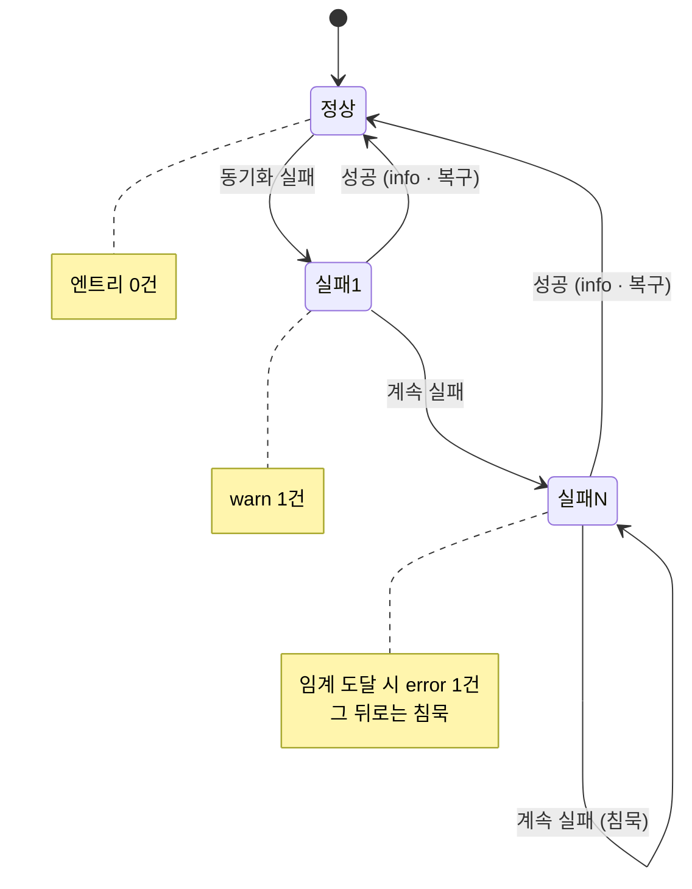
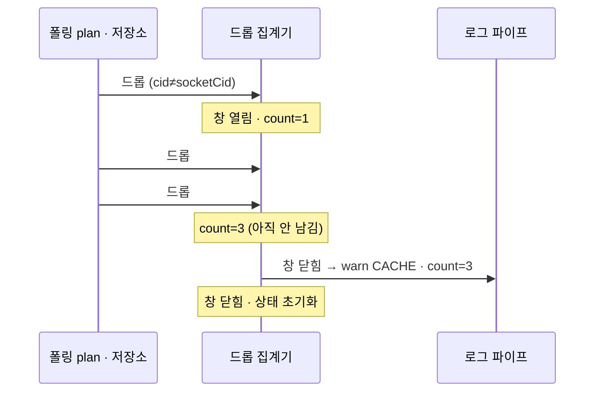

# 조용한 실패·유실 트리거 (Silent Loss)

> 상태: **Live** · 최종 갱신: 2026-09-11 · 관련 ADR: [ADR-0075](../../../docs/adr/0075-divergence-triggers-and-push-payment-log-coverage.md) (범위 확장 — 새 결정이 아니라 같은 결정의 남은 절반)
>
> 함께 읽을 것: [통합 로깅 아키텍처](./architecture.md) (이 트리거가 올라타는 파이프) · [정합성 검증 트리거](./divergence-checks.md) (형제 트리거 클래스 — 그쪽이 "값이 어긋났다"를 잡고, 이 문서가 **왜 어긋났나**를 잡는다) · [성능 지표](./perf-metrics.md)
>
> 트리거 카탈로그의 정본은 vault `projects/@lemoncloud-io/dou-app/log-collection/triggers.md`다.

## 목적

**삼켜진 실패와 세어 나간 데이터를 보이게 한다.**

[정합성 검증](./divergence-checks.md)은 두 값이 어긋난 것을 잡는다. 그 대조가 걸리면 다음 질문은 곧
"왜 어긋났나"이고, 그 답이 있어야 할 자리 세 군데가 비어 있었다 — 전부 실패를 조용히 삼키거나 데이터를
조용히 버리는 지점이다.

1. **배경 동기화가 실패를 전부 삼켰다.** [useBackgroundSync.ts](../../../apps/web/src/app/runtime/useBackgroundSync.ts)에는
   `logger` 호출이 **0건**이었고 삼키는 `catch`가 **7개** 있었다. 주석이 스스로 말한다 —
   `"best-effort: watermark not advanced → retried with the same since next tick"`. 1회 실패는 무해하지만
   **반복되면 워터마크가 영구히 전진하지 않고** 목록·카운트가 정체된다. 카탈로그의 `SYNC` 행은 전부
   미구현이었고, `SYNC` 태그는 리포 전체에서 **한 번도 쓰이지 않았다**.

2. **클라우드 전환 중 캐시 쓰기가 조용히 버려졌다.** `isForeignContext`가 참이면 캐시 쓰기를 건너뛰고
   조기 return한다 — [ChannelRepositoryV2](../../../libs/data/src/data/repositories-v2/ChannelRepositoryV2.ts) 3곳,
   [PlaceRepositoryV2](../../../libs/data/src/data/repositories-v2/PlaceRepositoryV2.ts) 1곳, 그리고
   [plans.ts](../../../libs/app-runtime/src/socket/sync/plans.ts)의 프레임 드롭 6곳. **10곳 전부 로그가 없었다.**
   의도된 드롭이지만, 전환 중 무엇이 몇 건 누락됐는지가 남지 않으면 그 뒤의 낡은 화면·틀린 카운트가
   설명되지 않는다.

3. **저장 계층이 버린 것을 말하지 않았다.** 쿼터에 닿으면 축출하고 다시 쓰는데 그 사실이 남지
   않았고, 채널 상한 축출은 몇 행을 지웠는지 세지 않았고, `id` 없는 항목은
   [`saveAll`](../../db/src/indexeddb/IndexedDBAdapter.ts)에서 조용히 탈락했다. DB 열기 실패·스키마
   업그레이드·타 탭 강제 close도 마찬가지다. 그리고 **동기화 커서는 두 경우에 조용히 0으로 되돌아간다** —
   저장소 라우팅이 바뀌었을 때와 TTL이 지났을 때. 둘 다 의도된 전체 재동기화이지만, 남지 않으면 그
   순간의 요청 폭증과 그 뒤의 빈 목록이 설명되지 않는다.

4. **미전송 큐가 자기 유실을 보고하지 않았다.** [LogUploadQueue.ts](../src/upload/LogUploadQueue.ts)의
   `droppedCount()`는 **정의만 있고 호출부가 0건**이었다. 트리거를 늘린 지금 이게 메타 리스크다 —
   "`warn`이 안 보인다"가 **정상인지 축출됐는지** 구분되지 않으면 위 두 항목의 결론도 신뢰할 수 없다.
   [성능 지표](./perf-metrics.md) 원칙 8이 이미 후속 과제로 적어둔 것이다.

## 설계 원칙

1. **1회 실패와 지속 실패는 다른 사건이다.** 배경 동기화는 60초 주기라 매 실패를 남기면 하루 1440건이
   되고, 그중 진단에 쓸모 있는 것은 "이 기기는 N분째 못 나아가고 있다"는 사실 하나다. 그래서 **첫
   실패는 `warn` 1건, 임계 도달은 `error` 1건, 복구는 `info` 1건**이고 그 사이는 침묵한다.

2. **폴링 빈도로 도는 드롭은 집계한다.** 프레임 드롭은 타깃당 2초 폴에 실려 수십 개가 동시에 돈다.
   개별 로깅은 카탈로그 금지 규칙 2가 막고 있고, 대안은 **N초 윈도우 1건**이다.

3. **정상은 침묵한다.** 성공한 동기화, 드롭 없는 창, 자라지 않은 유실 카운터는 아무것도 남기지 않는다.
   [정합성 검증](./divergence-checks.md) 원칙 2와 같고, 이유도 같다 — 정상 상태 비용이 0이어야 이런
   관측을 상시 경로에 둘 수 있다.

4. **유실 관측은 큐 밖의 제3자가 한다.** 큐 자신도, 업로더도 자기 유실을 로그로 남기지 않는다 —
   `logger → 전송 → 실패 → logger`는 실제로 재현돼 테스트로 고정된 재귀다(카탈로그 금지 규칙 3·4).
   업로더가 이미 읽기 전용 뷰를 등록하는 자리가 있으므로, 관측자는 그 뷰를 통해 묻는다.

5. **집계·스트릭 상태는 로그가 아니라 카운터다.** 상태를 들고 있는 것과 남기는 것을 분리한다. 그러면
   임계·윈도우 값을 바꿔도 호출부가 그대로고, 무엇보다 **테스트가 순수 함수 테스트가 된다.**

6. **부분 결과는 실패가 아니라 모양이다.** 요청이 성공했는데 결과의 일부가 비어 있는 경우 —
   이름 없는 연락처, 축출된 행 — 는 던질 예외가 없으므로 실패로 잡히지 않는다. 남길 것은 에러가
   아니라 **모양**이다: 전체 건수와 쓸 수 있는 건수. 개별 항목은 남기지 않는다(내용이고, 볼륨이다).

7. **태그는 카탈로그를 따른다.** 동기화와 커서는 `SYNC`, 캐시·저장소는 `CACHE`, 로그 인프라 자신은
   `LOG_BUFFER`, 연락처는 `DEVICE`. 새 태그를 만들지 않는다 — 카탈로그 태그는
   [`KNOWN_LOG_TAGS`](../src/core/tags.ts)로 코드에서 확인된다(계약은 여전히 열려 있다).

8. **구조화 엔트리의 판별자는 하나다.** 이 문서의 집계·스트릭·유실·모양 엔트리와
   [정합성 검증](./divergence-checks.md)의 대조 엔트리가 모두 `data.observation`을 쓴다
   ([`ObservationKind`](../src/core/observation.ts)). 생산자마다 봉투를 만들면 스크립트가 그 전부를
   알아야 하고, 실제로 `kind`가 두 가지 뜻으로 충돌한 적이 있다.

## 범위

**포함**

- **소켓 요청 실패 전체** — 서버가 답한 거절은 건별, 타임아웃은 `warn`, 연결 부재(`503`·`499`)는
  슬롯별 스트릭. 요청 파사드 한 곳에서 판정한다
- **sync target의 영구 정지** — 정지가 곧 로컬 삭제이므로 **삭제를 실행하기 전에** 남긴다
- 배경 동기화 5개 경로(place 스냅샷 · 내 프로필 · 채널 델타 · 프로필 델타 · 보낸 초대)와 self 채널
  로드의 실패 스트릭 관측
- `isForeignContext` 드롭 10곳의 윈도우 집계
- 미전송 큐 유실 카운터의 주기적 관측
- [SyncManager](../../../libs/app-runtime/src/socket/sync/SyncManager.ts)의 sync target 관련 실패 4건
  태그 교정(`SOCKET` → `SYNC`)
- 웹 저장소(IndexedDB)의 쿼터 복구·채널 상한 축출·`id` 없는 항목 탈락·DB 열기 실패·스키마
  업그레이드·타 탭 close/versionchange 재오픈
- 동기화 커서가 조용히 폐기되는 두 경로(라우팅 지문 불일치 · TTL 만료)
- 네이티브 셸이 담을 수 없는 캐시 도메인이 웹 저장소로 폴백하는 사실
- 연락처 조회의 **부분 결과**(이름 없는 레코드 비율)와 권한 거부 레벨 교정

**제외**

- **catch-up(갭 복구)·chat prime.** 카탈로그 `SYNC` 행에 있지만 그 코드는 SDK 스케줄러 안이라
  앱에서 관측점이 없다. SDK가 신호를 노출해야 성립하므로 커버리지 공백으로 남긴다.
  (**개별 폴 실패도 여기 속한다** — 2026-09-11 실측: 스케줄러의 `handleRunFailure`가 분류·집계·정지를
  모두 자기 안에서 처리하고 아무 신호도 내지 않는다. 다만 **정지는 관측 가능하다** — plan의
  `onStopped`가 우리 코드로 돌아오므로, 그 지점은 포함 범위다.)
  (**커서 만료는 여기 있었던 항목이 아니다** — 2026-09-07 정정: SDK가 아니라
  [`SyncMetaLocalDataSourceV2`](../../data/src/data/local/data-sources-v2/SyncMetaLocalDataSourceV2.ts)에
  있어 관측 가능하고, 지금은 포함 범위다.)
- **행 단위 JSON 파싱 손상.** 웹 저장소는 객체를 그대로 담아 행 파싱 단계가 없고, 네이티브 쪽 파싱
  실패는 이미 `STORAGE`로 남고 있다 — 카탈로그의 이 행은 지금 구조에 대응하는 지점이 없다.
- **미등록 `CacheType` → 빈 결과.** ADR-0053의 라우팅 게이트가 그 상태 자체를 없앴다(담을 수 없는
  도메인은 웹 저장소로 간다). 남길 값이 있는 것은 **그 폴백 사실**이고, 그것은 포함 범위다.
- **유실률을 성능 지표에 싣기.** 층을 깨고 값도 비어 있어 이미 기각됐다([성능 지표](./perf-metrics.md) 원칙 8).
- **실패한 동기화의 자동 복구.** 관측 전용 — 재시도 정책은 지금 그대로 둔다.

## 시나리오

### S0 — 서버가 거절했는데 아무 일도 없다

1. 소켓 요청이 서버의 `*:error` 프레임을 받는다. SDK는 pending 프라미스를 reject하고 **끝낸다** —
   `onError`는 부르지 않는다(`PendingRequestStore.settle`).
2. 거절이 요청 파사드를 지나 호출자에게 간다. 파사드는 호출자 이름을 덧붙여 다시 던지기만 했다.
3. → 호출자가 react-query를 지나면 쿼리 캐시가 `GLOBAL`의 `[query] …`로 주웠다. 소켓 실패로 읽히지
   않고 HTTP 실패와 구분되지 않는다. **그 밖의 경로**(sync 폴 · 명령형 리포지토리 호출 ·
   fire-and-forget 쓰기)는 **아무 엔트리도 남지 않았다.**
4. 이제 파사드가 남긴다 → `error` / `SOCKET` 1건에 status·요청 타입·슬롯이 실린다.
5. → 어드민에서 `level=error`로 열면 "무슨 기능이 안 된다"는 신고에 **서버가 무엇을 거절했는지**가
   답으로 나온다.

### S0-b — 방이 통째로 사라진다

1. `join` sync 폴이 `404`를 두 번 연속 받는다.
2. 스케줄러가 `gone`으로 분류하고(`defaultClassify`) `goneStreak >= 2`에서 `stop`을 택한다.
3. plan의 `onStopped`가 우리 `onRemove`를 부른다 → join 행이 지워지고, **내 join이면 그 방의 캐시
   메시지 전체가 지워진다**(ADR-0067의 퍼지 경로).
4. 여기까지 엔트리는 **0건**이었다. 서버 오류로 두 번 404가 온 것과 정말 탈퇴된 것이 코드에서
   구분되지 않으므로, 밖에서도 구분할 수 없었다.
5. 이제 삭제 **전에** → `error` / `SYNC` 1건에 `kind`(`gone`/`transient`)·연속 실패 수·타깃이 실린다.

### S1 — 목록이 정체된다 (#10 · #11)

1. 채널 델타 동기화가 실패한다. 워터마크가 전진하지 않고, 다음 틱이 같은 `since`로 재시도한다.
2. → 첫 실패에서 `warn` / `SYNC` 1건. 여기까지는 흔한 일이고, 다음 틱에 성공하면 끝이다.
3. 실패가 계속된다. 3연속(≈3분)에서 → `error` / `SYNC` 1건: **이 기기는 이 경로에서 나아가지 못하고
   있다.** 이후 같은 스트릭에서는 침묵한다 — 같은 사실을 매 분 반복하지 않는다.
4. 언젠가 성공한다 → `info` / `SYNC` 1건에 몇 연속 실패 뒤 복구됐는지가 실린다.
5. → 어드민에서 `level=error`로 그 사용자의 런을 열면 "목록이 안 갱신된다"는 신고에 **몇 분째, 어느
   경로가** 멈춰 있었는지가 답으로 나온다. 지금은 이 신고에 대응할 수 있는 엔트리가 0건이다.

### S2 — 클라우드를 바꿨더니 화면이 낡았다 (#14 · #1)

1. 사용자가 클라우드를 전환한다. 캐시 `cid`는 즉시 목표로 넘어가지만, 나가는 클라우드의 소켓이 아직
   붙어 있어 프레임을 계속 보낸다.
2. 그 프레임과 그 시점의 저장소 쓰기가 **의도적으로 버려진다** — 목표 파티션을 오염시키지 않기 위한
   올바른 동작이다.
3. → 5초 윈도우가 닫힐 때 `warn` / `CACHE` 1건: 버린 건수와 `cid` 대 `socketCid`. 창 안의 수십 건이
   한 줄이 된다.
4. → 전환 직후의 낡은 화면·틀린 카운트가 "그 순간 N건을 버렸다"와 짝지어진다. 정합성 검증이 잡은
   불일치의 **원인 쪽 증거**가 여기서 나온다.

### S3 — 증거가 있었는지조차 모른다

1. 기기가 로그를 많이 뱉는다(느린 기기, 오류 폭주). 큐가 상한에 닿고 축출이 돈다.
2. 축출 순서는 `debug` → `info` → 오래된 것 순이라, **사고 원인 쪽이 먼저 버려질 수 있다.**
3. → 안전한 시점에 관측자가 유실 카운터를 읽는다. 지난 관측보다 자랐으면 `warn` / `LOG_BUFFER` 1건에
   **증가분**이 실린다. 안 자랐으면 아무것도 남기지 않는다.
4. → "이 사용자에게 `warn`이 없다"를 읽을 때 그것이 정상인지 유실인지 구분된다. 이게 없으면 위 두
   시나리오의 부재를 근거로 쓸 수 없다.

### S4 — 대화가 사라졌다 (쿼터·상한 축출)

1. 기기 저장소가 꽉 찬다. 채팅 쓰기가 `QuotaExceededError`로 실패한다.
2. 상한이 설정돼 있으면 축출 후 **한 번 다시 쓴다**. 성공하면 사용자는 아무것도 못 느끼지만, 오래된
   대화 일부가 사라졌다.
3. → 축출 후 재시도는 `warn` / `CACHE` 1건에 **재시도 결과**까지. 상한이 없어 복구가 불가하면
   `error` / `CACHE`.
4. → 채널 상한 축출이 실제로 행을 지울 때 `info` / `CACHE` 1건에 채널과 **삭제 건수**. "위로
   스크롤하니 옛 대화가 없다"는 신고가 이 줄과 짝지어진다. 지금은 삭제가 흔적 없이 일어난다.

### S5 — 갑자기 전부 다시 받아온다 (커서 폐기)

1. 앱 업데이트로 어떤 도메인의 저장소 라우팅이 바뀌거나, 커서가 TTL을 넘긴다.
2. `getSyncedAt`이 **조용히 0을 답한다.** 다음 동기화가 `since=0`으로 전체를 다시 받아온다 — 의도된
   동작이고, 한 번은 필요한 일이다.
3. → 폐기 사유(라우팅 불일치 / 만료)와 도메인을 `warn` / `SYNC` 1건으로.
4. → 서버 쪽 요청 폭증과 클라이언트 쪽 "왜 갑자기 느려졌나"가 같은 줄로 설명된다. 반복해서 폐기되는
   패턴(라우팅 지문이 부팅마다 달라지는 버그)도 이 줄이 없으면 보이지 않는다.

### S6 — 연락처에 이름이 없다 (#15)

1. 초대하려고 연락처 목록을 연다. 조회는 **성공한다.**
2. 그런데 일부 레코드에 이름이 없다 — 표시 이름·이름·성이 모두 비어 있는 항목은 화면에서 빈 줄로
   보인다.
3. 예외가 없으므로 실패 트리거로는 걸리지 않는다. → 조회 성공 시 `info` / `DEVICE` 1건에 **모양**만:
   전체 건수와 이름 있는 건수. 이름 없는 항목이 있으면 `warn`으로 올린다.
4. → "이름이 안 뜬다"는 신고가 **몇 건 중 몇 건인지**로 바뀐다. 전건이 비어 있으면 권한·계정 쪽,
   일부만이면 그 기기의 연락처 데이터 쪽이다. 개별 연락처는 남기지 않는다 — 내용이다.

## 다이어그램

### 실패 스트릭 — 세 사건만 남는다

### 드롭 집계 — 창이 닫힐 때 한 줄

## 상세 구현

### 1. 배경 동기화 실패 스트릭

`apps/web/src/app/runtime/logging/syncStreakReporter.ts` — 경로별 연속 실패 수를 들고, 세 전이에서만
남긴다.

| 전이             | level · tag    | 남기는 것                        |
| ---------------- | -------------- | -------------------------------- |
| 첫 실패 (0 → 1)  | warn · `SYNC`  | 경로 이름, 에러                  |
| 임계 도달 (== 3) | error · `SYNC` | 경로 이름, 연속 실패 수, 에러    |
| 임계 초과 (> 3)  | —              | 침묵                             |
| 복구 (N → 0)     | info · `SYNC`  | 경로 이름, 몇 연속 실패 뒤였는지 |
| 연속 성공        | —              | 침묵                             |

임계 3은 **약 3분 미전진**이다(폴 주기 60초). 1분은 흔한 일시 실패와 구분되지 않고, 10분은 사용자가
이미 신고를 마친 시각이다.

경로는 6개다 — `place-refresh` · `my-profile` · `channel-delta` · `profile-delta` · `sent-invites` ·
`self-channel`. **경로별로 따로 센다**: 하나가 죽고 나머지가 사는 상태가 실제로 있고, 합쳐 세면 그
구분이 사라진다.

호출부는 [useBackgroundSync.ts](../../../apps/web/src/app/runtime/useBackgroundSync.ts)의 삼키는 `catch`
7개다. 각 `catch`가 리포터에 실패를 알리고, 성공 경로가 복구를 알린다. **재시도 정책은 바꾸지 않는다** —
`catch`는 여전히 삼키고, 다음 틱이 같은 `since`로 재시도한다.

`hasPendingSentInvite`의 캐시 읽기 실패는 스트릭에 넣지 않는다. 그것은 "패킷을 보낼 가치가 있나"를
묻는 최적화이고, 실패의 대가는 한 번 늦은 갱신이지 정체가 아니다.

### 2. 외래 컨텍스트 드롭 집계

`libs/logger/src/observation/foreignDropAggregator.ts` — `libs/logger`에 두는 이유는 소비자가 두
lib(`@chatic/data`와 `@chatic/app-runtime`)이고, 둘 다 이미 `@chatic/bridges`를 통해 로깅 코어를
재수출로 보고 있어 **새 의존이 생기지 않기** 때문이다.

- 창 길이 **5초**. 전환의 낙관적 윈도우는 짧으므로 창이 길면 원인과 엔트리가 멀어지고, 짧으면 한
  전환이 여러 줄이 된다.
- 창 안의 드롭을 `(source, cid, socketCid)`로 묶어 센다. `source`는 드롭 지점의 이름 —
  `channel-refresh` · `channel-sync` · `channel-self` · `place-refresh` · `sync-frame`.
- 엔트리는 다른 구조화 엔트리와 같은 판별자를 쓴다 — `data.observation = 'foreign-drop'`
  ([`ObservationKind`](../src/core/observation.ts)).
- 창이 닫히면 묶음당 `warn` / `CACHE` 1건. 드롭이 없으면 타이머 자체가 돌지 않는다.
- 첫 드롭이 창을 열고, 창이 닫힐 때 상태를 비운다. **타이머는 드롭이 있을 때만 존재한다** — 상시
  인터벌은 유휴 기기에 비용을 남긴다.

호출부 10곳: 저장소 4곳(`ChannelRepositoryV2` 3, `PlaceRepositoryV2` 1)과 [plans.ts](../../../libs/app-runtime/src/socket/sync/plans.ts)의
`dropForeignFrame` 6곳. plans 쪽은 `dropForeignFrame` **한 함수 안에서** 알리므로 6곳을 각각 고치지
않는다 — 초크포인트가 이미 하나다.

### 3. 미전송 큐 유실 관측

큐는 이미 자기 유실을 세고 있다(`droppedCount()`). 필요한 것은 **읽을 사람**이고, 그 사람은 큐도
업로더도 아니어야 한다(원칙 4).

업로더가 등록하는 읽기 전용 뷰([logQueueView.ts](../../../apps/web/src/app/runtime/logging/logQueueView.ts))가
그 자리다 — "monitor must not be able to bring a queue into existence"라는 그 파일의 설계 의도가 이
관측자에게도 그대로 맞는다. `LogQueueView`에 `droppedCount()`를 더하고, 관측자는 뷰를 통해 묻는다.

- 관측 시점: **포그라운드 복귀**와 **주기(5분)**. 복귀는 배경에서 벌어진 유실이 드러나는 지점이고,
  주기는 앱을 계속 열어 둔 세션을 위한 것이다.
- 지난 관측값보다 **자랐을 때만** `warn` / `LOG_BUFFER` 1건, 증가분과 누적을 함께. 안 자랐으면 침묵.
- 이 엔트리 자체도 큐에 들어가고 축출 대상이다. 그건 문제가 아니라 정직한 값이다 — 이 줄이 유실됐다면
  그것도 유실 상황이라는 뜻이다.

### 4. SyncManager 태그 교정

[SyncManager.ts](../../../libs/app-runtime/src/socket/sync/SyncManager.ts)의 sync target
start/stop/detach 관련 4건은 `SOCKET`으로 나가고 있었다. 카탈로그가 sync target 관련을 `SYNC`로 지정하므로 이제
`SYNC`로 나간다 — 메시지·레벨·데이터는 그대로다. 소켓 커넥션 자체의 사건과 sync 타깃의 사건이 한
태그에 섞여 있으면 `tag` 필터가 열린 뒤에도 둘을 못 가른다.

### 5. 웹 저장소 — 쿼터·축출·탈락·수명주기

[IndexedDBAdapter](../../db/src/indexeddb/IndexedDBAdapter.ts)와
[IndexedDBDatabase](../../db/src/indexeddb/IndexedDBDatabase.ts)의 조용한 지점들. 전부 `CACHE` 태그다.

| 지점                                  | level | 남기는 것                                                        |
| ------------------------------------- | ----- | ---------------------------------------------------------------- |
| 쿼터 초과 → 축출 후 재시도            | warn  | 재시도 결과까지 한 줄에 — 재시도가 또 실패했는지가 절반의 정보다 |
| 쿼터 초과인데 복구 수단이 없음        | error | 상한이 설정되지 않은 클라이언트는 안전망 자체가 없다             |
| 채널 상한 축출 실행                   | info  | 채널과 **삭제 건수**                                             |
| `saveAll`에서 `id` 없는 항목 탈락     | warn  | 전체 대비 탈락 건수. 조용한 데이터 유실이다                      |
| DB 열기 실패                          | error | 캐시가 아예 없는 세션이 된다                                     |
| 스키마 업그레이드·인덱스 마이그레이션 | info  | 이전/이후 버전                                                   |
| 타 탭 버전 변경 → close + 재오픈      | warn  | 멀티탭 경합의 단서                                               |
| `onclose`(강제 종료) → 재오픈         | warn  | 위와 다른 사유이므로 따로                                        |

삭제 건수를 남기려면 `clearByRange`가 지운 개수를 알려줘야 한다. 지금은 내부에서 세고 `void`를
돌려주므로 **반환형을 개수로 바꾼다** — 호출부에 영향이 없는 확장이고, 세는 곳이 이미 있으니 새로
세지 않는다.

**축출은 채널을 아는 쪽에서 남긴다.** `clearByRange`는 인덱스 범위만 알고 어느 채널인지 모른다.
`evictChannelOverflow`가 채널과 건수를 함께 갖고 있으므로 거기서 남긴다 — 저수준 함수가 도메인 라벨을
알게 만드는 대신.

### 6. 동기화 커서 폐기

[SyncMetaLocalDataSourceV2](../../data/src/data/local/data-sources-v2/SyncMetaLocalDataSourceV2.ts)의
`getSyncedAt`은 세 경우에 0을 답한다. **행이 없는 경우는 남기지 않는다** — 첫 동기화이고, 정상이다.
나머지 둘은 `warn` / `SYNC`로 사유를 구분해 남긴다.

| 사유              | 무엇을 뜻하나                                                                                                                                   |
| ----------------- | ----------------------------------------------------------------------------------------------------------------------------------------------- |
| `routing-changed` | 저장소 라우팅이 바뀌어 커서가 다른 저장소를 가리키게 됐다. 앱 업데이트 직후 1회가 정상이고, 부팅마다 반복되면 라우팅 지문이 불안정하다는 뜻이다 |
| `expired`         | TTL 경과. 오래 안 쓴 도메인에서 정상이지만, 잦으면 TTL이 사용 패턴에 안 맞는다                                                                  |

둘 다 **전체 재동기화를 유발**하므로 서버 부하와 클라이언트 지연이 뒤따른다 — 그게 이 줄이 존재하는
이유다. `kind`(도메인 식별자)를 함께 싣는다.

### 7. 네이티브 캐시 도메인의 웹 폴백

[resolveCacheBackend](../../app-runtime/src/data/cacheStorageRouting.ts)가 네이티브 셸에서
`isNativeCacheTypeUsable`이 거짓이라 웹 저장소를 고르는 경우 — 셸이 그 도메인을 담을 수 없다는 뜻이고,
그 결과는 **콜드 캐시**다. `info` / `CACHE` 1건에 도메인 목록을 담는다.

**부팅당 1회, 도메인별이 아니라 묶음으로.** 라우팅은 저장소를 만들 때 도메인마다 판정되지만 엔트리가
도메인 수만큼 나오면 부팅 로그가 그것으로 덮인다. 이미 판정 결과를 모으는 자리(`routed` 지문)가
있으므로 그것이 완성되는 지점에서 한 줄 남긴다.

**브라우저 단독 접속은 남기지 않는다.** 거기서는 전부 웹 저장소가 정상이고 폴백이 아니다 — 네이티브
셸에서 일어난 폴백만 사건이다.

### 8. 부분 결과와 남은 태그

| 무엇                                   | level · tag            | 비고                                                                                                               |
| -------------------------------------- | ---------------------- | ------------------------------------------------------------------------------------------------------------------ |
| 연락처 조회 성공 시 이름 있는 비율     | info / warn · `DEVICE` | 이름 없는 항목이 0이면 `info`, 있으면 `warn`. **건수만** — 이름·번호는 내용이다                                    |
| 연락처 권한 거부                       | warn · `DEVICE`        | 지금은 `error`다. 사용자의 선택이지 실패가 아니므로 카탈로그대로 `warn`으로 내린다                                 |
| 이메일 코드 발송·재발송·검증·확정 실패 | error · `ACCOUNT`      | **단계 식별자 포함**(4단계가 한 훅을 공유하므로 단계가 없으면 어느 다리가 끊겼는지 알 수 없다). 주소는 싣지 않는다 |
| 파일 다운로드·읽기·삭제 실패           | error · `FILE`         | `exists`·`readChunk`는 제외 — 전자는 탐침이고 후자는 청크마다 도는 뜨거운 경로다                                   |

### 9. 소켓 요청 실패

[socketFailureReporter](../../app-runtime/src/socket/socketFailureReporter.ts)가
[SocketManager](../../app-runtime/src/socket/SocketManager.ts)의 요청/전송 파사드 네 갈래
(active·scoped × request·send)에서 불린다. **파사드가 유일한 초크포인트다** — 앱의 모든 소켓 요청이
여기를 지나므로 새 호출부가 기록을 잊을 수 없다.

| 분류          | 판정              | level · tag      | 비고                                                      |
| ------------- | ----------------- | ---------------- | --------------------------------------------------------- |
| `server`      | 그 외 모든 status | error · `SOCKET` | status를 **message 맨 앞에**, 요청 타입·슬롯과 함께       |
| `timeout`     | `408`             | warn · `SOCKET`  | 거절이 아니라 무응답 — 다른 사건이다                      |
| `unavailable` | `503` · `499`     | — (스트릭)       | 첫 실패 `warn` → 5연속 `error` → 복구 `info`, 사이는 침묵 |

**`503`과 `499`를 묶는 이유.** `503`은 전송 시도마다, `499`는 소켓이 닫힐 때 in-flight·큐 **전체**에
한꺼번에 터진다. 소켓이 없는 동안에는 등록된 sync 타겟 수만큼 매 폴 주기마다 실패하므로, 건별 로깅은
카탈로그가 프레임 단위 로깅을 금지하는 바로 그 이유에 걸린다. "왜 끊겼나"는 연결 단위 트리거
(`reconnect attempt failed`·`reconnect gave up`)가 훨씬 잘 답하고, 이 스트릭의 몫은 **그동안 요청이
버려지고 있다**는 사실 한 번이다.

**서버가 답한 실패는 스트릭을 끊는다.** `403`이 돌아왔다는 것은 소켓이 살아 있다는 증거다 — 이걸
"아직 죽어 있다"로 세면 스트릭이 영원히 살아남아 복구 엔트리도, 다음 첫 실패 `warn`도 나오지 않는다.

**요청 인자와 응답 본문은 싣지 않는다.** status와 요청 타입이 진단이고, 인자는 개인정보가 있는 쪽이다.

status는 [getSocketErrorCode](../../app-runtime/src/socket/utils/socketErrorCode.ts)가 선행 prefix에서
읽는다 — `annotateSocketError`가 **덧붙이기만** 하는 이유가 이것이다.

### 10. sync target 영구 정지

[plans.ts](../../app-runtime/src/socket/sync/plans.ts)의 `reportStop`이 5개 plan의 `onStopped`를
감싼다. `onStopped`는 생성자 옵션이 아니라 라이브러리 plan 클래스가 스스로 붙이는 메서드이므로,
옵션으로 넘기는 대신 데코레이트한다 — 한 자리에서 전부 감싸는 것이 새 plan이 이걸 빼먹지 않게 하는
방법이기도 하다.

**삭제보다 먼저 기록한다.** 원본 `onStopped`가 곧 삭제다(`onRemove` → `cacheDelete`, 내 `join`이면
`cacheClearByChannelId`까지). 삭제가 던지거나 그 사이에 앱이 죽어도 무엇을 하려 했는지는 이미 나가
있어야 한다.

**`kind`와 `goneStreak`이 엔트리의 핵이다.** `gone`은 서버가 `403`·`404`를 줬다는 뜻이고 `transient`는
스케줄러가 다른 이유로 포기했다는 뜻이다 — 다른 버그다.

## 검증 방법

**유닛** — 세 조각 모두 상태 기계라 순수 테스트가 가능하다.

| 무엇                                                    | 어디                                                                         |
| ------------------------------------------------------- | ---------------------------------------------------------------------------- |
| 스트릭 세 전이와 임계 초과 침묵, 경로별 독립            | `apps/web/src/app/runtime/logging/syncStreakReporter.test.ts`                |
| 소켓 실패 3분류·슬롯별 스트릭·서버 응답이 스트릭을 끊음 | `libs/app-runtime/src/socket/socketFailureReporter.test.ts`                  |
| 파사드가 실패를 남기는 배선                             | `libs/app-runtime/src/socket/SocketManager.test.ts` (기존 스위트 확장)       |
| 선행 status 읽기(덧붙은 호출자 이름 포함)               | `libs/app-runtime/src/socket/utils/socketErrorCode.test.ts`                  |
| 5개 plan의 정지 기록과 **삭제보다 먼저** 라는 순서      | `libs/app-runtime/src/socket/sync/plans.test.ts` (기존 스위트 확장)          |
| 창 집계, 묶음 분리, 드롭 없으면 침묵                    | `libs/logger/src/observation/foreignDropAggregator.spec.ts`                  |
| 유실 증가분만 남기기, 뷰 부재 시 무해                   | `apps/web/src/app/runtime/logging/queueLossObserver.test.ts`                 |
| 배경 동기화 각 경로가 실패·복구를 알리는지              | `apps/web/src/app/runtime/useBackgroundSync.test.ts` (기존 스위트 확장)      |
| 쿼터 복구·축출 건수·`id` 탈락                           | `libs/db/src/indexeddb/IndexedDBAdapter.test.ts` (기존 스위트 확장)          |
| DB 열기·업그레이드·재오픈                               | `libs/db/src/indexeddb/IndexedDBDatabase.test.ts`                            |
| 커서 폐기 두 사유와 "행 없음은 침묵"                    | `libs/data/src/data/local/data-sources-v2/SyncMetaLocalDataSourceV2.test.ts` |
| 웹 폴백이 네이티브에서만·부팅당 1회                     | `libs/app-runtime/src/data/factories/localFactory.test.ts`                   |
| 연락처 모양과 권한 거부 레벨                            | `apps/mobile/src/app/services/device/DeviceService.test.ts`                  |

**함정** — `@chatic/bridges` 목이 부분적이다. `useBackgroundSync.test.ts`가 `logger.warn`/`info`를
갖고 있는지 먼저 확인한다. 이 트랙에서 세 번 깨진 함정이라, 새 스위트는 모듈 목 대신 **실물 logger에
`jest.spyOn`** 을 건다 — 같은 모듈을 간접 소비하는 쪽의 나머지 export를 잃을 위험이 없다.

**수동** — 네트워크를 끊고 3분 이상 두면 `error`/`SYNC`가 한 번만 나오는지(매 틱이 아니라), 복구 시
`info`가 한 번 나오는지. 클라우드 전환을 반복하며 `warn`/`CACHE`가 전환당 한 줄로 묶이는지.
