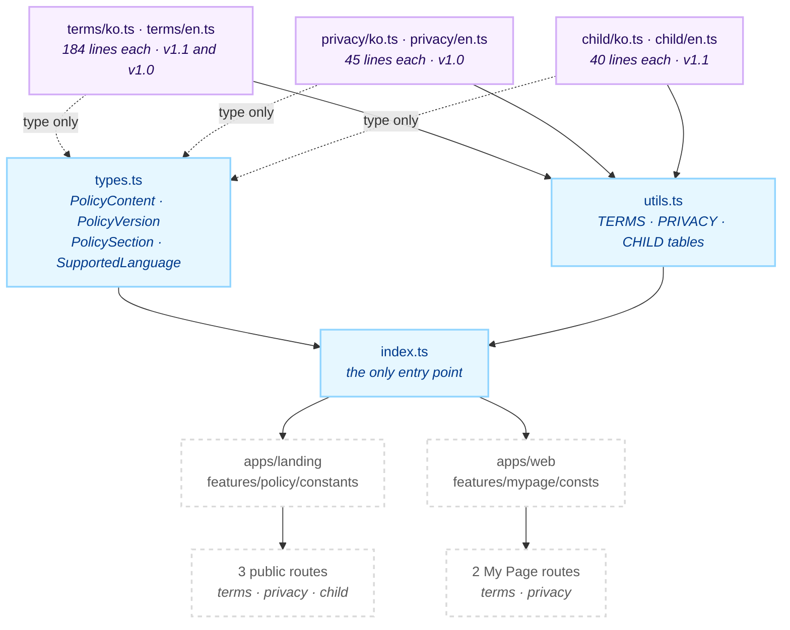
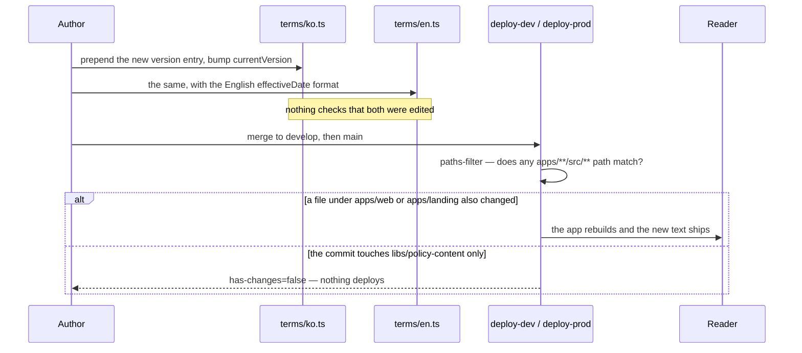

# @chatic/policy-content

**The product's legal text, as data.** Three documents — terms of service, privacy policy and child
safety policy — each written twice, in Korean and in English, each carrying its own version history.
It exports four types and three `Record<SupportedLanguage, PolicyContent>` tables, and nothing else.

538 of its 582 lines are the documents themselves. The remaining 44 are three interfaces, one union
and six imports. There is no component here, no i18n lookup, no fetch and no dependency — which is
the whole design: a lawyer's edit must not be able to break a build.

Because the content is static, the question this document exists to answer is not "how do I call it"
but **how a policy change reaches a reader**. That is [Scenarios 1 and 2](#1-publishing-a-new-version),
and it is less automatic than it looks.

## Purpose

Consumers see the `@chatic/policy-content` barrel and nothing else. Imports that reach past it into an
internal path number **zero**.

```bash
grep -rn "@chatic/policy-content/" --include='*.ts' --include='*.tsx' apps libs | grep -v node_modules
```

Two apps consume it, and each re-exports the barrel through a two-line local barrel of its own rather
than importing it in pages directly — `apps/landing/src/app/features/policy/constants/index.ts` and
`apps/web/src/app/features/mypage/consts/index.ts`.

```bash
grep -rn "@chatic/policy-content" --include='*.ts' --include='*.tsx' apps libs | grep -v node_modules
```

- **`apps/landing`** — the public site. Three routes, `/policy/terms`, `/policy/privacy` and
  `/policy/child`, linked from the footer. It takes all three tables and lets the reader select an
  older version.
- **`apps/web`** — inside the product, under My Page. Two routes, terms and privacy. It imports
  `TERMS_CONTENTS` and `PRIVACY_CONTENTS` and deliberately not `CHILD_CONTENTS`.

**Why this is a library.** Those two apps build separately, deploy separately, and both have to show
the same legal text — the landing route is the public URL an app store listing points at, and the My
Page route is what a signed-in user reads. If the text lived in either app, the other would hold a
copy, and two copies of a policy that disagree is a worse outcome than a policy that is out of date.
One document, two renderers, is the entire justification, and it is enough.

This lib **owns no record of consent.** Nothing in the repo stores which version of a policy a user
accepted, and nothing compares a stored version against `currentVersion`. A version bump therefore
changes what is displayed and produces no prompt, no banner and no re-acceptance flow.

```bash
grep -rn "agreedVersion\|policyVersion\|termsAgree" --include='*.ts' --include='*.tsx' apps libs | grep -v node_modules
```

It also does not own presentation. How a `\n` becomes a line break, and whether `subsections` is drawn
at all, is each consumer's decision — and the two consumers have made different ones
([Scenario 3](#3-the-same-string-rendered-two-ways)).

## Design principles

1. **Data only, and no dependency at all.** Every import in this module is relative, `package.json`
   declares no dependency and `tsconfig.lib.json` carries no `references`, so nothing outside this
   folder has to resolve for it to compile. The moment it imports something, editing a paragraph of
   legal text acquires a build dependency, and the people who edit that text are not the people who
   can debug one.
2. **`ko` and `en` are parallel documents, not translations of a key.** Each locale file declares its
   own `title`, `subtitle`, `currentVersion`, version list and section bodies. Nothing derives one from
   the other and nothing checks that they correspond.
3. **`effectiveDate` is a display string, not a date.** Korean writes `'2026-04-02'`; English writes
   `'April 2, 2026'`. Nothing parses, sorts or compares it — both consumers print it verbatim — so the
   locale's format is chosen when the entry is written, and getting it wrong is invisible to the
   compiler.
4. **`currentVersion` must name an entry in `versions`.** Both consumers resolve it with
   `versions.find(v => v.version === …)`, and neither has a fallback worth having. Nothing enforces the
   match.
5. **History is append-only — where it has been kept at all.** `terms` holds `v1.1` and `v1.0` side by
   side. `child` is at `v1.1` with a single entry, so its `v1.0` was replaced in place rather than
   appended. Follow `terms`: a reader who accepted an earlier version should still be able to read it.
6. **`\n` is the only markup.** Section bodies are plain strings. Bullets are literal `•` characters,
   nesting is literal spaces, and there is no Markdown, no HTML and no rich text. A body that needs
   structure gets a new `PolicySection`, not a tag.
7. **Two languages, and everything that is not Korean is English.** `SupportedLanguage` is
   `'ko' | 'en'` — two of the seven values `@chatic/app-messages`' `PageLanguage` allows — and both
   consumers narrow with the same expression, `i18n.language === 'ko' ? 'ko' : 'en'`. Adding a
   language means adding a file per document, not a fallback.

## Scope

**In** — the text of the three policies in two languages, their version histories and effective
dates, the `PolicyContent` / `PolicyVersion` / `PolicySection` shapes, the `SupportedLanguage` union,
and the three lookup tables keyed by language.

**Out** — rendering, layout and the version selector (`apps/landing`'s `features/policy` components,
`apps/web`'s `features/mypage` pages), choosing the language (each app's i18n), page headings and
labels such as "Effective date" (each app's locale files, under `policy.*` and `mypage.policy.*`),
consent capture and anything server-side, and the `PageLanguage` union itself
(`@chatic/app-messages`).

## Structure



**No arrow points back.** Nothing in this module reads a consumer, a setting or a language — the
language is chosen by the caller and used as a key. That is why the six content files can be edited by
someone who has never opened the rest of the repo.

### How a policy update reaches a reader



The `else` branch is the one to remember, and [Scenario 2](#2-where-the-update-actually-goes) spells
it out.

### Directories

```text
libs/policy-content/src/
├── index.ts       public barrel — one `export type` line, one `export` line
├── types.ts       PolicySection · PolicyVersion · PolicyContent · SupportedLanguage
├── utils.ts       the three Record<SupportedLanguage, PolicyContent> tables
├── terms/         ko.ts · en.ts — 18 sections at v1.1, 15 at v1.0
├── privacy/       ko.ts · en.ts — 6 sections at v1.0
└── child/         ko.ts · en.ts — 5 sections at v1.1
```

Four things the filenames do not tell you.

- **`utils.ts` holds no utility.** It is six imports and three object literals. Nothing in it is a
  function, and there is no `index` module of helpers hiding behind the name.
- **Each content file exports one long constant, and none of those names crosses the barrel.**
  `TERMS_OF_SERVICE_CONTENT`, `PRIVACY_POLICY_CONTENT`, `CHILD_POLICY_CONTENT`, and the same three
  with an `_EN` suffix. Consumers see only `TERMS_CONTENTS`, `PRIVACY_CONTENTS` and `CHILD_CONTENTS`.
- **`PolicySection.subsections` is declared, rendered by one consumer, and populated by no file.** It
  is optional and recursive in the type, but `apps/landing`'s `PolicySection` component draws exactly
  one level of it and `apps/web`'s pages ignore it entirely. Nothing in this lib sets it.
- **The child policy has no home inside the product.** `CHILD_CONTENTS` is imported by `apps/landing`
  only. It exists to satisfy the app stores' child-safety (CSAE) requirement, which wants a publicly
  reachable URL, and `/policy/child` is that URL.

## Usage

Import from the barrel, pick a language, then resolve the version.

```ts
import { type SupportedLanguage, TERMS_CONTENTS } from '@chatic/policy-content';

const lang: SupportedLanguage = i18n.language === 'ko' ? 'ko' : 'en';
const content = TERMS_CONTENTS[lang];

// `currentVersion` is a string; the entry it names is what you render.
const current = content.versions.find(v => v.version === content.currentVersion);
current?.sections.map(section => render(section.title, section.content));
```

### Wiring

None. There is nothing to initialise, register or inject — the tables are module constants evaluated
when the bundle loads, and both apps reach them through a local re-export:

```text
apps/landing
  └─ features/policy/constants/index.ts     re-exports all three tables + the four types
       └─ pages/{Terms,Privacy,Child}Page   each owns its own selectedVersion state

apps/web
  └─ features/mypage/consts/index.ts        re-exports TERMS_CONTENTS + PRIVACY_CONTENTS only
       └─ pages/{Terms,Privacy}Page         renders currentVersion, no selector
```

## Scenarios

### 1. Publishing a new version

Six steps, and the compiler checks only the last one.

1. Add a new object at the **head** of `versions` in `<policy>/ko.ts`, with the next `version` string
   and an `effectiveDate` in ISO form.
2. Bump `currentVersion` at the top of the same file to match it.
3. Do both again in `<policy>/en.ts`, with the same `version` string and the English date form
   (`'April 2, 2026'`).
4. Leave the previous entry in place. `terms` keeps `v1.0` next to `v1.1`; that is the pattern.
5. Say nothing to the user. There is no consent record and no notification path — if the change
   requires informing people, that work happens outside this repo.
6. `npx tsc -b libs/policy-content/tsconfig.json --force`, which will confirm the shape and tell you
   nothing about steps 1 to 5.

The failure this sequence invites is doing steps 1 and 2 and forgetting step 3. Korean readers then
see the new policy and English readers see the old one, with no error anywhere.

### 2. Where the update actually goes

`deploy-dev.yml` (on `develop`) and `deploy-prod.yml` (on `main`) both decide what to build with
`dorny/paths-filter`, and every filter is a list of `apps/<app>/**` paths. **`libs/block-kit/**`is
the only`libs/`entry in either workflow.** A commit that touches`libs/policy-content/src/\*\*`and
nothing else therefore matches no filter,`has-changes`comes back`false`, and neither `web`nor`landing`is rebuilt — the new text sits on the branch until some unrelated change to`apps/web/src`or`apps/landing/src` carries it out.

```bash
grep -n "libs/" .github/workflows/deploy-prod.yml
```

Two ways round it, both deliberate acts: land the policy change together with a change inside the
consuming app, or run the `force-deploy` workflow, whose `workflow_dispatch` inputs include
`deploy_web_dev` / `deploy_web_prod` and `deploy_landing_dev` / `deploy_landing_prod`. **Verify the
published page after a policy change.** A green CI run here does not mean anyone can read it.

### 3. The same string rendered two ways

A section body is one string with `\n` in it, and the two consumers disagree about what that means.
`apps/landing`'s `PolicySection` puts the whole body in a single `<p>` with `whitespace-pre-line`, so
newlines become line breaks and runs of spaces collapse. `apps/web`'s `TermsPage` and `PrivacyPage`
call `section.content.split('\n').map(…)` and emit one `<p>` per line, so a blank line becomes an
empty paragraph. The indented sub-bullets in the privacy text — `  - 수집 및 이용 목적: …` — lose their
indentation in both, for different reasons. Write bodies that read correctly as a flat sequence of
lines, and check both renderings when the shape of a body changes.

### 4. Reading an older version

`apps/landing` holds `selectedVersion` in page state, seeds it from `content.currentVersion`, and
renders a `VersionSelector` over `content.versions` — so a reader can open `v1.0` of the terms.
`apps/web` has no selector: it resolves `currentVersion` once and renders that. Adding an entry to
`versions` therefore changes the landing page's dropdown and changes nothing at all inside the app.

### 5. `currentVersion` names an entry that is not there

Two different failures, neither of them an exception. `apps/landing` renders
`t('policy.versionNotFound')` in place of the whole document. `apps/web` resolves `undefined`, and
because both pages use optional chaining (`currentVersion?.sections.map(…)`) it renders the page
header, the effective-date line with an empty date, and no body — a blank policy page that looks
deliberate. Step 2 of [Scenario 1](#1-publishing-a-new-version) is the one that prevents this.

### 6. The three documents are not in step, and that is fine

`terms` is at `v1.1` (effective 2026-04-02), `child` is at `v1.1` (2026-03-18), and `privacy` is
still at `v1.0` (2025-03-05) with a single version entry. Each document has its own history; there is
no product-wide policy version and nothing expects the three to agree. Do not bump one to match
another.

## How to verify

```bash
npx tsc -b libs/policy-content/tsconfig.json --force   # the whole check
npx nx typecheck @chatic/policy-content                # what CI runs
```

**There is no second command.** This lib has no jest config, no `tsconfig.spec.json` and no test file,
so nx infers no `test` target — `typecheck`, `build`, `build-deps`, `watch-deps` and `lint` is the
complete list, and `npx nx show project @chatic/policy-content --json` is what proves it.
`tsconfig.lib.json` excludes `src/**/*.spec.ts` and `src/**/*.test.ts`, which is scaffolding: no such
file exists.

- Type checking must be `tsc -b`. Inside this lib, `tsc --noEmit` checks zero files and succeeds, so
  passing it proves nothing.
- **The type check sees the shape and never the content.** It cannot tell you that `ko` and `en`
  disagree about a version string, that `currentVersion` names a missing entry, that one locale was
  edited and the other was not, or that an English `effectiveDate` was written in ISO form. Read the
  two files side by side:

    ```bash
    grep -n "currentVersion:\|version: '\|effectiveDate:" libs/policy-content/src/*/ko.ts libs/policy-content/src/*/en.ts
    ```

- A stale `dist`/`out-tsc` produces phantom errors after a file moves. `rm -rf dist/out-tsc` and look
  again.
- Downstream: a changed barrel identifier reaches `apps/landing` and `apps/web`.
  `.github/workflows/verify.yml` excludes `@chatic/landing` from both its typecheck and its test step,
  so that one is the one to run by hand; `web` is on the gate for typecheck.
- Neither consumer has a test that touches these tables, so the only way to see a rendering change is
  to open the pages — `/policy/terms` on the landing site, My Page → Terms in `apps/web`.
