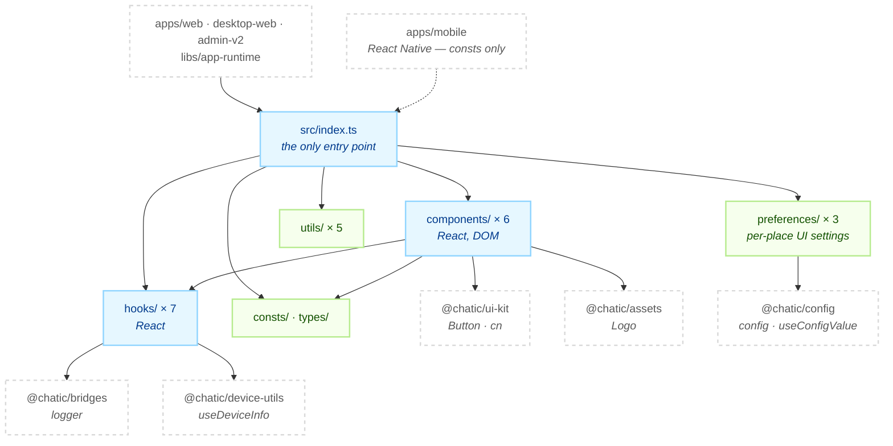
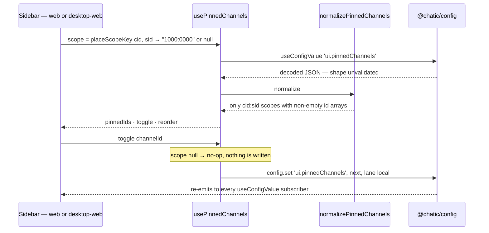

# @chatic/shared

**One barrel of React-side parts that more than one front end reaches for.** It holds six
presentational components, seven hook modules, the per-place sidebar preferences, five small helpers
and two constant tables, and exports all of it from a single entry point that five projects import.

It is a catch-all rather than a layer, and that has a measurable cost. [Scope](#scope) states what the
membership rule is and where the contents fail it, so the question "does this belong in shared?" has
an answer other than "it is shared by two apps".

## Purpose

Consumers see the `@chatic/shared` barrel and nothing else. Imports that reach past it into an
internal path number **zero**, so the directory layout below is free to move.

```bash
grep -rn "@chatic/shared/" --include='*.ts' --include='*.tsx' apps libs | grep -v node_modules
```

The consumer list is worth knowing because it is not all browsers — `apps/web`, `apps/desktop-web`,
`apps/admin-v2`, `libs/app-runtime` and `apps/mobile`, which is React Native.

```bash
grep -rln "@chatic/shared" --include='*.ts' --include='*.tsx' apps libs | grep -v node_modules
```

This lib **owns no domain data and makes no network call.** It reads no server model except four
fields of `MembershipView`, and it stores nothing of its own: the two preference keys it shapes are
persisted by `@chatic/config`, and every other cached value belongs to `@chatic/data`. It is also not
the design system — `Button`, `Dialog` and the `cn` helper all come from `@chatic/ui-kit`, and the
components here compose `Button` and `cn` rather than declaring a primitive of their own.

## Design principles

1. **One barrel, no deep paths.** Everything is re-exported through `src/index.ts`. A consumer that
   needs `@chatic/shared/utils/...` is telling you the export belongs somewhere else.
2. **No network, no cache, no domain model.** Nothing here fetches, maps or stores a server entity.
   The moment a helper needs a repository it belongs to the feature that owns the repository.
3. **`preferences/` validates the product shape; `@chatic/config` validates only JSON.** The registry
   in `libs/config/src/registry/ui.ts` declares `ui.pinnedChannels` and `ui.channelOrder` as
   `type: 'json'`, and that check ends at "this parses". That a value must be a map of `cid:sid` keys
   to non-empty id arrays is knowledge this lib holds, applied to the already-decoded value.
4. **A per-place key is `<cid>:<sid>`, and a half-formed one is never written.** A site id is unique
   only inside its cloud, so a bare place id would let one cloud inherit another's pins.
   `placeScopeKey` returns `null` when either half is unknown and every writer no-ops on `null`.
5. **Stored input degrades; it never throws.** `normalizePinnedChannels` and `normalizeChannelOrder`
   drop what they do not recognise, so a corrupt or hand-edited record costs the user their pins, not
   the sidebar.
6. **Never touch `import.meta`.** It is a _parse_ error under the CommonJS transform ts-jest uses, and
   one occurrence anywhere in the tree makes the whole barrel unimportable from every jest suite that
   reaches it — including suites in other projects. Build-time values come through `@chatic/config`
   (ADR-0079), and even that is no escape hatch for a module-load constant, because `config.init()`
   runs in each app's entry point, after this module has already evaluated. `useVersionCheck`'s
   polling interval is the worked example: its env branch was deleted rather than moved.
7. **A component added here brings no translations with it.** `VersionUpdateBanner` calls
   `useTranslation()` against `version.*` keys that live in the consuming app's locale files. The three
   error screens break this rule — they render the hardcoded Korean `ERROR_MESSAGES` table in
   `consts/`. That split is an inconsistency, not a design; follow the i18n side of it.
8. **An export with no reader is a defect, not inventory.** Nothing in the repo type checks against
   an unused export, so the only thing that catches one is the sweep in
   [Scope](#the-membership-rule-and-where-it-fails). Run it before you add, and run it when you remove
   a consumer — a barrel is where deleted call sites leave their residue.

## Scope

**In** — presentational components with no feature knowledge, generic React hooks, the two per-place
sidebar preferences and their scope key, the swappable session-storage adapter, and small pure
helpers over the DOM and over dates, query keys and images.

**Out** — design-system primitives, `Toaster` included (`@chatic/ui-kit`), logging
(`@chatic/bridges`, `logger`), images and logos (`@chatic/assets`), device and platform facts
(`@chatic/device-utils`), setting keys, lanes and persistence (`@chatic/config`), domain data
(`@chatic/data`), the HTTP client and its error classification, `throwIfApiError` included
(`@chatic/http`), and the transport types the SDK already declares — `ListResult` from
`@lemoncloud/chatic-backend-api`, `Params` from `@lemoncloud/lemon-web-core`.

Those four are named rather than left implied because each is the kind of thing that reads as harmless
on the way in: a `sonner` wrapper, a four-line copy of the HTTP client's error promoter, two interfaces
the SDK already declares. A duplicate in a barrel five projects import is not harmless. It is a second
answer to a settled question, and call sites split between the two answers without anyone deciding to.

### The membership rule, and where it fails

That "In" list is a description of what is here, not a rule that decides what should be. The honest
version is: **a thing lands in `@chatic/shared` when a second app needs it and no existing module
obviously owns it.** A module with that rule accumulates faster than it sheds, because nothing in the
build objects to an export that nobody imports. Three measurements, each reproducible:

- **`types/` has no reader at all.** Its four declarations — `PaginationType`, `TokenGenerateRequest`,
  `TokenGenerateResponse` and `TokenGeneratorFormState` — are named by no file outside this lib and by
  no file inside it. `consts/` carries two more of the same kind, `StorePlatform` and
  `ErrorMessageType`. Types cost nothing at run time, which is exactly why nothing ever forces the
  question.

    ```bash
    # per symbol: is it named in any file that imports @chatic/shared?
    grep -rl "@chatic/shared" --include='*.ts' --include='*.tsx' apps libs \
      | grep -v node_modules | grep -v '^libs/shared/' | xargs grep -lw '<symbol>'
    ```

    A zero from that sweep is a question, not a verdict — many exports here are reached only from
    inside the lib, `ERROR_MESSAGES` and the `preferences/` writers among them. Check `libs/shared/src`
    too before concluding anything is unused.

- **Reach across the barrel is lopsided.** `useNavigateWithTransition` is named in 74 of the 138
  consumer files. Nine exports are named in exactly one, and nine more in two. A module whose contents
  range that far apart in demand is not one concern, and the single-consumer end is where the next
  thing to move out comes from — one consumer means one owner, and that owner is a feature.
- **The barrel is DOM-bound, and a React Native app imports it anyway.** `apps/mobile` takes exactly
  two constants from here, `STORE_URLS` and `getStoreUrl`. Its `package.json` nonetheless lists
  `react-router-dom`, `sonner` and `next-themes` as dependencies while its own source imports none of
  them, and it does not import `@chatic/ui-kit` at all. Only `react-router-dom` is still reachable
  through this barrel, by way of `NotFoundPage` and `RouterErrorFallback`; the other two entries answer
  to nothing. Its two test files `jest.mock('@chatic/shared')` wholesale for the same reason.

None of that is a reason to leave. It is the reason to ask, before adding: does `@chatic/ui-kit`,
`@chatic/config`, `@chatic/device-utils` or the feature itself own this? `@chatic/shared` is the
answer when all four say no, and `consts/` — the only directory `apps/mobile` can safely reach — is
the part with the clearest claim to the name.

## Structure



**The six directories are not layers.** Five of them import nothing from each other; only
`components/` reaches sideways, into `hooks/` and `consts/`. Nothing reaches `types/` at all. There is
no order to respect and no dependency to invert — which is exactly why the barrel is the only thing
holding the module together, and why [Scope](#scope) has to do the work a layer map would otherwise
do.

### Writing a per-place preference

The one path with real mechanism. Both `apps/web` and `apps/desktop-web` drive it, against the same
config key with the same scope and the same shape.



Reads normalize on the way out and writes normalize on the way in, so a record that a hand edit or an
older build left malformed is repaired by the next write rather than propagated.

### Directories

```text
libs/shared/src/
├── index.ts          public barrel — six lines of `export *`
├── components/       6 components + index; all React, all DOM
├── consts/           STORE_URLS, and ERROR_MESSAGES inline in index.ts
├── hooks/            7 hook modules + index
├── preferences/      pinnedChannels · channelOrder · placeScope + index
├── types/            index.ts and nothing else — four declarations, no reader
└── utils/            5 single-purpose helpers + index
```

Four things the filenames do not tell you.

- **`consts/index.ts` is not just re-exports.** The `ERROR_MESSAGES` table — six error kinds, each with
  a title, a description and two button labels — is declared inline there. There is no
  `errorMessages.ts` to open.
- **`hooks/useGlobalLoader.tsx` holds the zustand store, not a component.** It is `.tsx` and contains
  no JSX. The overlay that reads the store is `components/GlobalLoader.tsx`.
- **`@chatic/lib/utils`, imported by `VersionUpdateBanner`, is `libs/ui-kit/src/utils`.** The alias does
  not name ui-kit; `tsconfig.base.json`'s `paths` is where that is settled.
- **`usePageTransition.ts` exports `useNavigateWithTransition`,** a thin wrapper that feeds
  `@lemoncloud/react-page-transition` a platform from `@chatic/device-utils`. It is by far the
  most-imported symbol in the lib, and the file also holds the private `usePageTransitionConfig` that
  builds that platform.

## Usage

Import from the barrel. Nothing here needs construction or registration.

```ts
import { formatDate, placeScopeKey, resizeImageToBase64, storage, usePinnedChannels } from '@chatic/shared';

// Per-place preferences: derive the scope first, and let a null scope stay null.
const scope = placeScopeKey(cloudId, placeId);
const { pinnedIds, toggle, reorder } = usePinnedChannels(scope);

// Session-scoped storage, through whichever adapter the entry point installed.
storage.set('relay.lastCloud', cloudId);
```

### Wiring

Two of the exports are process-wide and are set up by each app's entry point, in this order.

```text
apps/<app>/src/main.tsx
  ├─ config.init(webConfigPorts)                            @chatic/config — before anything reads a setting
  ├─ setStorageAdapter(isNative() ? localStorage : sessionStorage)
  │     ↳ backs `storage`, used by app-runtime's session, relay and push records
  └─ runtime.boot.initAppRuntime()                          reads the session, so it comes last
```

`setStorageAdapter` is an explicit call, not an import side effect. Without it, `storage` falls back to
`sessionStorage` when the global exists and to a no-op adapter when it does not — which is why
`apps/admin-v2` skips the call deliberately: it never runs inside a native or desktop shell, so
`isNative()` is always false and the default is already right.

The components are mounted by the host, not by this lib:

```text
apps/web
  ├─ app.tsx     <ErrorBoundary FallbackComponent={ErrorFallback}> · <Suspense fallback={<LoadingFallback/>}>
  ├─ routes/     errorElement: <RouterErrorFallback onError={…}>
  └─ runtime/    <GlobalLoader/> · useVersionCheck() → <VersionUpdateBanner/>
```

## Scenarios

### 1. Pinning a channel, and seeing it in the other app

The sidebar calls `toggle(channelId)` from `usePinnedChannels(scope)`. `setChannelPinned` reads the
current map, adds or removes the id inside that one scope, drops the scope entirely if nothing is left
pinned, and writes the whole map back through `config.set(..., { lane: 'local' })`. Other scopes are
preserved untouched. `apps/desktop-web` reads the same `ui.pinnedChannels` key through the same
normalizer instead of keeping its own copy, so the two front ends cannot disagree about the shape.

### 2. Reordering the sidebar

Two different rules, on purpose. `setPinnedChannelOrder` rewrites only the _slots_ that listed pins
occupy: an id not in the incoming list keeps its position, so a channel briefly missing during a rejoin
or a sync lag cannot lose its pin to someone else's drag, and an id that is not already pinned is
dropped rather than silently pinned. `setChannelOrder` (the non-favorite section) simply stores the new
full order, de-duplicated. Reading is `applyChannelOrder`: stored ids that are still present first, in
stored order, then everything new appended in the list's own order. `moveChannel` moves one id and
prunes ids that are gone in the same write.

### 3. A new build is published while the app is open

`useVersionCheck` polls `/version.json` with `cache: 'no-store'` and compares it part-by-part against
the `__APP_VERSION__` the build defines, falling back to `'0.0.0'` when that global is absent. Two
guards keep the poll honest: a 10-second floor between checks and an in-flight ref, so a manual
`checkNow()` landing next to the interval does not double-fetch. On a newer version the host renders
`VersionUpdateBanner`; `dismissUpdate()` hides it for the session without stopping the polling. The
default interval is five minutes for everyone, including local development — see principle 6 for why
there is no env branch.

### 4. A render throws, or a route 404s

`ErrorFallback` is a `react-error-boundary` fallback: it classifies the error by substring — both
English and Korean, so `'연결'` reads as a network failure the same as `'network'` — picks an icon and a
message from `ERROR_MESSAGES`, and focuses its own container so a screen reader lands on the error
rather than on whatever came before. `RouterErrorFallback` is the router's `errorElement` and classifies
`isRouteErrorResponse` by status instead; a 404 renders `NotFoundPage` and, deliberately, does **not**
call `onError` — only real failures are reported upward.

### 5. Uploading a picture

Two functions, and picking the wrong one loses data. `resizeImageToBase64` center-crops to a square
JPEG for avatars and thumbnails, where the square is the point. `scaleImageToDataUrl` keeps the whole
frame and never upscales, for images that are read rather than recognised — a screenshot attached to a
feedback report. Its `maxEdge: 1024` / `quality: 0.6` defaults are a payload budget: the report carries
its images inline as base64, at roughly four bytes per three, so the encoded size is what caps how many
fit.

### 6. React Native reaching into the barrel

`apps/mobile` imports `STORE_URLS` and `getStoreUrl` for its store-update prompt. Everything else in
the barrel assumes a DOM, so both of its suites `jest.mock('@chatic/shared')` with a literal copy of the
constants rather than loading the real module. Treat `consts/` as the only part of this lib that is
platform-neutral: a new import added to a file that `consts/` can reach becomes a React Native
dependency, whether or not the code is ever run there.

## How to verify

```bash
npx tsc -b libs/shared/tsconfig.lib.json     # the lib
npx tsc -b libs/shared/tsconfig.spec.json    # the six test files
npx jest --config libs/shared/jest.config.js
```

`npx tsc -b libs/shared/tsconfig.json --force` runs both projects, and is what nx's `typecheck` target
does — it builds `./tsconfig.json` with no argument, and that config references the spec project.

- Type checking must be `tsc -b`. Inside `libs/shared`, `tsc --noEmit` checks zero files and succeeds,
  so passing it proves nothing.
- **The two projects are separate on purpose.** `tsconfig.lib.json` excludes `*.test.ts`, and jest does
  not type check at all — the base sets `isolatedModules`, so ts-jest transpiles. Without the second
  command a broken fixture surfaces only as `… is not a function` at run time.
- **Six suites is not six covered modules.** Three cover `preferences/`, one `membershipOverride`, one
  the loader store — and `hooks/websocket-worker-queue.test.ts` declares the queue it tests inside the
  test file, so it exercises nothing in this lib. No component has a test.
- `tsconfig.spec.json` must not set `module: "commonjs"`. The base sets `moduleResolution: bundler`,
  which rejects it with TS5095, and the config then cannot compile at all.
- Its `references` must mirror `tsconfig.lib.json`'s, or the siblings arrive as unlisted files (TS6307).
  **`assets` is at the repo root**, so that entry is `../../assets/tsconfig.lib.json`; shortening it to
  `../assets/` fails with TS5083.
- Its `outDir` is `dist/out-tsc/shared-spec`, deliberately not the lib project's `dist/out-tsc`. Both
  projects compile the same `src/**` files, so one shared outDir would have two programs emitting the
  same `.d.ts` paths.
- A stale `dist`/`out-tsc` produces phantom errors after a directory moves. Force-delete both —
  `rm -rf libs/shared/out-tsc dist/out-tsc` — and look again.
- Downstream: a changed barrel identifier reaches `apps/web`, `apps/desktop-web`, `apps/admin-v2`,
  `apps/mobile` and `libs/app-runtime`. `.github/workflows/verify.yml` type checks `web`, `admin-v2`
  and `@chatic/app-runtime`; `desktop-web` and `@chatic/mobile` are on its exclusion list, so those two
  are the ones to run by hand. Its test step excludes `web` alone of this lib's consumers.
- **`desktop-web` fails its type check either way.** Its baseline is 21 errors, none of them in a file
  that imports this barrel, and the workflow records the same number. Diff the error list against that
  baseline rather than reading a red run as your own — and remember that `@chatic/mobile` reports a
  `TS6053` for `@nx/react-native/typings/svg.d.ts` when it runs from a git worktree, because the
  script's literal `node_modules` path does not resolve upward the way Node does.
