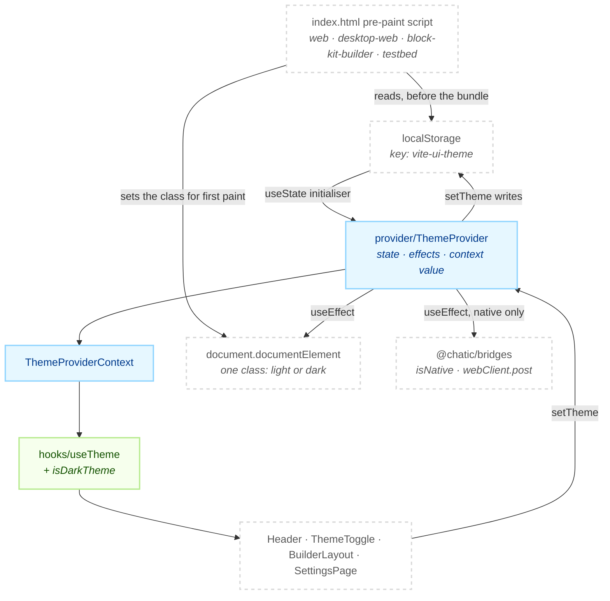
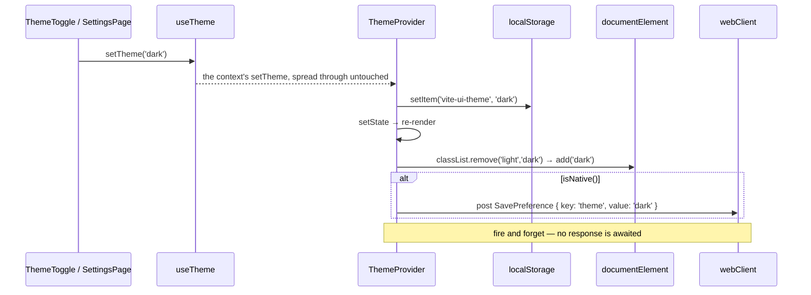

# @chatic/theme

**A light/dark preference, and the `light` or `dark` class it puts on `<html>`.** Two source files —
a React context provider that stores the choice and applies it, and the hook that reads it back — plus
two barrels. 94 lines in total.

The interesting part is not the React. It is that the preference is **shared across apps on one
machine** through a single `localStorage` key, and that four `index.html` files resolve that key
before this bundle exists. This module is the runtime half of a contract whose other half is
hand-written in HTML.

## Purpose

Consumers see the `@chatic/theme` barrel and nothing else. Imports that reach past it into an
internal path number **zero**.

```bash
grep -rn "@chatic/theme/" --include='*.ts' --include='*.tsx' apps libs | grep -v node_modules
```

Three apps mount it — `apps/landing`, `apps/block-kit-builder` and `apps/desktop-web` — across six
files. A fourth, `apps/web`, deliberately does not: it has its own `runtime/ThemeApplier.tsx` and
`app/hooks/useTheme.ts`, API-compatible so consumers only swap the import. `apps/admin-v2` has no
theme switching at all. The grep below includes `apps/web`'s files, which name this module only in
comments explaining why they replaced it.

```bash
grep -rln "@chatic/theme" --include='*.ts' --include='*.tsx' apps libs | grep -v node_modules
```

**Why this is a library.** Not the seventy lines of React — those would be cheap to copy, and
`apps/web` did exactly that. It is the key. `vite-ui-theme` is not private to any app: the pre-paint
scripts in `apps/web`, `apps/desktop-web`, `apps/block-kit-builder` and `apps/testbed` all read it
directly, `apps/web`'s `setTheme` writes it as an explicit mirror alongside its own `@chatic/config`
storage, and `legacyPreferenceMigration.ts` reads it back. One shared machine keeps one preference
because every writer agrees on that string, and this lib is where the writing half of that agreement
lives.

```bash
grep -rn "vite-ui-theme" --include='*.ts' --include='*.tsx' --include='*.html' apps libs | grep -v node_modules
```

This lib **owns no colour.** The palette is CSS — the `light` / `dark` class is the only thing it
emits, and what that class means belongs to each app's stylesheet and to `@chatic/ui-kit`. It also
does not own **first paint** (each app's `index.html`), the `theme-color` meta tag (`apps/web`'s
`ThemeApplier`, `apps/desktop-web`'s pre-paint script), or any persistence beyond `localStorage` —
settings with lanes and shell hydration are `@chatic/config`'s.

## Design principles

1. **The provider owns the class on `<html>`, exclusively.** It removes both `light` and `dark` and
   adds exactly one, every time `theme` changes. A second writer of those classes in a consuming app
   is a race, not a feature.
2. **`theme` is the stored preference; `isDarkTheme` is the resolved answer.** `'system'` is a value
   that can be stored and displayed, and is never a class name. A consumer rendering a binary — an
   icon, a `Toaster` mode — reads `isDarkTheme`; a consumer rendering the choice itself reads `theme`.
3. **The storage key is a cross-app constant that happens to be a prop.** `storageKey` defaults to
   `'vite-ui-theme'` and every consumer takes the default. Passing something else does not give you a
   private preference — it desynchronises you from your own `index.html`, which still reads the
   default key before React runs.
4. **Native sync is one-way and unconfirmed.** The provider does `webClient.post`, not `request`, so
   nothing waits for the shell and nothing retries. An app build whose bridge allowlist does not
   include `SavePreference` drops the message silently. Treat the native copy as a convenience for the
   shell, never as the source of truth.
5. **The DOM effect and the bridge effect are separate, and only the second is gated.** `isNative()`
   guards the `SavePreference` post; the class write runs everywhere. Keep it that way — the class is
   what the page looks like and it must not depend on which shell is hosting it.
6. **`useTheme` must be called under a provider, and nothing enforces it.** See
   [Scenario 6](#6-a-component-rendered-outside-the-provider). The guard in the hook cannot fire.

## Scope

**In** — the `Theme` union (`'dark' | 'light' | 'system'`), the context and its provider, reading and
writing the shared `localStorage` key, applying the resolved class to `<html>`, mirroring the choice
to a native shell, and the `useTheme` hook with its `isDarkTheme` derivation.

**Out** — colour tokens and every rule keyed on `.dark` (each app's stylesheet, `@chatic/ui-kit`), the
pre-paint script (each app's `index.html`), the `theme-color` meta tag, native preference storage and
the bridge transport (`@chatic/bridges`), lane-aware settings and shell hydration
(`@chatic/config`, ADR-0079), and `apps/web`'s theme entirely.

## Structure



**Nothing reads the class back.** The provider is the only writer and `<html>` is write-only from this
module's side, which is why the pre-paint script can set the class first without the two fighting:
they agree by both deriving from the same stored string, not by observing each other.

### A theme change, from click to shell



`setTheme` writes storage **before** state, so a crash between the two leaves the preference stored
and the screen stale — recoverable on reload. The reverse order would lose the choice entirely.

### Directories

```text
libs/theme/src/
├── index.ts          public barrel — two lines of `export *`
├── hooks/            useTheme + index
└── provider/         ThemeProvider.tsx + index
```

Three things the filenames do not tell you.

- **`provider/ThemeProvider.tsx` holds the types too.** The exported `Theme` union, the private
  `ThemeProviderProps` and `ThemeProviderState`, the `initialState` and the exported
  `ThemeProviderContext` are all declared there. There is no `types.ts` and no `context.ts` to open.
- **`useTheme` re-exports the whole context.** It returns `{ ...context, theme, isDarkTheme }`, so
  `setTheme` arrives at consumers exactly as the provider built it; the hook adds one derived boolean
  and changes nothing else.
- **`isDarkTheme` calls `window.matchMedia` during render, not in an effect.** It is sampled, not
  subscribed — see [Scenario 3](#3-system-and-why-an-os-toggle-does-nothing-on-its-own).

## Usage

Mount the provider once, at the root, above anything that renders a colour.

```tsx
import { ThemeProvider } from '@chatic/theme';

root.render(
    <ThemeProvider defaultTheme="light">
        <App />
    </ThemeProvider>
);
```

```ts
import { type Theme, useTheme } from '@chatic/theme';

const { theme, setTheme, isDarkTheme } = useTheme();
// `theme` for rendering the choice ('light' | 'dark' | 'system'),
// `isDarkTheme` for rendering a consequence of it.
```

### Wiring

`defaultTheme` is what applies when the shared key holds nothing, so it has to match what the app's
pre-paint script assumes about an empty key. The three consumers, and what each passes:

```text
apps/landing            main.tsx      <ThemeProvider defaultTheme="light">
  └─ no pre-paint script — the class appears only after React mounts

apps/block-kit-builder  main.tsx      <ThemeProvider defaultTheme="system">
  └─ index.html: no stored value → follow prefers-color-scheme   (agrees with "system")

apps/desktop-web        app.tsx       <ThemeProvider>              → defaults to "light"
  └─ index.html: no stored value → light, and sets theme-color    (agrees with "light")
```

## Scenarios

### 1. First paint, before React exists

The pre-paint script in `index.html` reads `vite-ui-theme` and toggles the class synchronously in
`<head>`, so the page never flashes the wrong surface. The provider then mounts, initialises its state
from the same key, and writes the same class — a no-op in the normal case. `apps/landing` has no such
script, so it is the one consumer that can flash: its class is applied by the provider's effect, after
the first paint.

### 2. Choosing a theme in desktop-web settings

`SettingsPage` renders `THEME_OPTIONS: Theme[] = ['light', 'dark', 'system']` and calls
`setTheme(option)`. `apps/block-kit-builder`'s `ThemeToggle` deliberately offers two states instead of
three — `setTheme(isDarkTheme ? 'light' : 'dark')` — on the grounds that someone reaching for the
button has already decided. Both write the same key, so a machine that runs both tools keeps one
answer.

### 3. `'system'`, and why an OS toggle does nothing on its own

With `theme === 'system'` the provider resolves `prefers-color-scheme` inside its effect, and
`useTheme` resolves it again during render. Neither subscribes to the media query. Changing the OS
appearance while the page is open therefore changes nothing until something else causes a re-render —
and even then only `isDarkTheme` moves, because the provider's effect is keyed on `[theme]`, which did
not change. `apps/web`'s replacement fixed this with `useSyncExternalStore` over a `matchMedia`
listener; this module has not.

### 4. Running inside the native shell

`isNative()` is true when the page has a `ReactNativeWebView`, `ChaticMessageHandler` or WebKit
message handler. The second effect then posts `SavePreference { key: 'theme', value: theme }`. That
effect has **no "the user chose this" guard**: it runs on mount as well as on change, so simply
opening the app inside a shell writes the current — possibly defaulted — theme into native storage.
`apps/web` takes the opposite approach for the same message, using `savePreferenceConfirmed` with a
retry, because its `ui.theme` is a `persist: 'shell'` config key whose write actually has to land.

### 5. Why `apps/web` left

Its `ThemeApplier` keeps the class effect and adds the `theme-color` meta update the pre-paint script
cannot keep current, and its `useTheme` moves the stored value into `@chatic/config`'s `ui.theme` on
the `shell` lane so a native-hydrated value is not shadowed. It still writes `vite-ui-theme`, as a
separate and explicitly labelled mirror, precisely so this module's three apps keep seeing the same
preference. Read that fork as the specification for what a fuller version of this lib would do, not
as a repudiation of it.

### 6. A component rendered outside the provider

`useTheme` opens with a check that reads as a guard:

```ts
if (context === undefined) {
    throw new Error('useTheme must be used within a ThemeProvider');
}
```

**It cannot fire.** `createContext<ThemeProviderState>(initialState)` supplies a real default, so
`useContext` returns that object rather than `undefined` when no provider is above. The component
silently gets `theme: 'system'`, a `setTheme` that returns `null`, and an `isDarkTheme` computed from
the OS — it renders, it just never responds to a click. Nothing in the repo hits this today because
all three apps mount the provider at their root; if you move a component above the provider, the
symptom is a dead toggle, not an error.

## How to verify

```bash
npx tsc -b libs/theme/tsconfig.json --force   # the whole check
npx nx typecheck @chatic/theme                # what CI runs
```

**There is no second command.** This lib has no jest config, no `tsconfig.spec.json` and no test file,
so nx infers no `test` target — `typecheck`, `build`, `build-deps`, `watch-deps` and `lint` is the
complete list, and `npx nx show project @chatic/theme --json` is what proves it. Do not invent a
`--config libs/theme/jest.config.js`; there is nothing at that path.

- Type checking must be `tsc -b`. Inside this lib, `tsc --noEmit` checks zero files and succeeds, so
  passing it proves nothing.
- `tsconfig.lib.json` is the one that sets `jsx: "react-jsx"` and includes `src/**/*.tsx`. A `.tsx`
  file added outside `src/` is silently not compiled. It also references
  `../bridges/tsconfig.lib.json`; a new cross-lib import needs its own reference and `npx nx sync`.
- A stale `dist`/`out-tsc` produces phantom errors after a file moves. `rm -rf dist/out-tsc` and look
  again.
- **Every consumer of this lib sits outside the CI type-check gate.**
  `.github/workflows/verify.yml` excludes `@chatic/landing`, `block-kit-builder` and `desktop-web`
  from its `typecheck` step, and those are exactly the three apps that mount `ThemeProvider`. A
  changed export signature here goes green in CI and breaks nothing it can see — run the three by
  hand.
- `desktop-web` fails its type check either way: its recorded baseline is 21 errors. Diff against that
  number rather than reading a red run as your own.
- The behaviour this lib is most likely to break is not type checked at all: the agreement between
  `defaultTheme`, the stored key and each app's pre-paint script. Change any of the three and load the
  other two apps with an empty `localStorage`.
