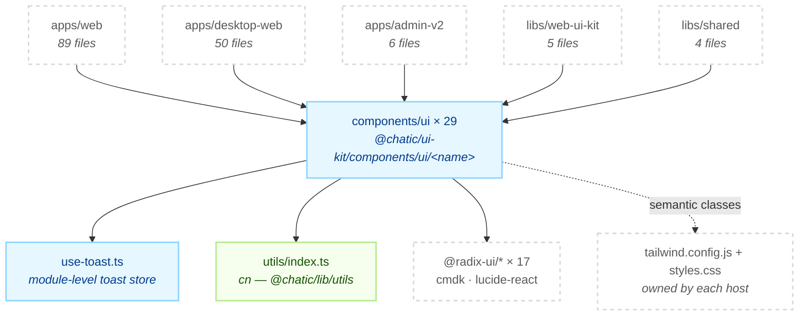

# @chatic/ui-kit

**The repo's generic component library: 29 shadcn/ui primitives and the `cn` class merger.** Every
file under `src/components/ui/` is the output of `npx shadcn@latest add <name>`, styled from the
semantic Tailwind tokens the host app declares. Five projects render them — two web apps, an admin
console, the shared error and fallback screens, and the DoU mobile design system in
`libs/web-ui-kit`, which builds on top of them.

It is not the DoU design system. That is [`libs/web-ui-kit`](../web-ui-kit/README.md), and the line
between the two is [the first thing to get right](#the-boundary-with-libsweb-ui-kit).

## Purpose

This lib decides **behaviour** — focus trap, portal, dismiss, ARIA wiring, keyboard nav — and leaves
**appearance** to whoever renders it. It owns no state, no data and no copy: string literals are
English defaults (`Close`, `Previous`, `More pages`) that a caller overrides, and open/selected state
belongs to the host.

Unlike every other lib here, **consumers do not import a barrel.** `src/index.ts` is one line
(`export * from './utils'`), so the barrel carries `cn` and nothing else; a component is reached at
its own path, `@chatic/ui-kit/components/ui/<name>`. That is the contract `components.json` encodes,
and it is what lets the generator overwrite one file without touching the rest.

```bash
grep -rn "@chatic/ui-kit" --include='*.ts' --include='*.tsx' apps libs | grep -v node_modules
```

Five projects import components: `apps/web`, `apps/desktop-web`, `apps/admin-v2`, `libs/web-ui-kit`
and `libs/shared`. Two more — `apps/block-kit-builder` and `libs/block-kit` — reach this module for
`cn` alone, through the `@chatic/lib/utils` path alias, which resolves to `src/utils/index.ts` here
and is easy to miss when counting consumers.

```bash
grep -rln "@chatic/lib/utils" --include='*.ts' --include='*.tsx' apps libs | grep -v node_modules
```

This lib does **not** own the tokens its classes resolve against. `bg-surface`, `text-main-accent`
and the rest are declared in each host's `tailwind.config.js` and `styles.css` — see
[Tokens the host must declare](#tokens-the-host-must-declare). It ships no Tailwind config, no CSS,
no provider and no tests.

## The boundary with `libs/web-ui-kit`

**A component belongs here when more than one app could name it without saying "DoU", and in
`libs/web-ui-kit` when it only makes sense inside a DoU mobile screen.** `Sheet` is a sheet anywhere;
`BottomSheet` — drag handle, safe-area inset, keyboard-aware footer — is that app's sheet. The full
comparison of the two kits is canonical in
[`libs/web-ui-kit`](../web-ui-kit/README.md#the-boundary-with-libsui-kit); this section states only
what the rule costs on this side.

The dependency runs **one way: `web-ui-kit` imports `ui-kit`, and `ui-kit` imports no other
`@chatic` module at all.** That is what keeps `desktop-web` and `admin-v2` free of mobile-web
components, and the grep is the check:

```bash
grep -rn "@chatic/" libs/ui-kit/src | grep -v "@chatic/ui-kit\|@chatic/lib/utils"
```

The rule's real consequence is that **a primitive here has five independent renderers, so it cannot
be restyled to suit one of them.** A phone-shaped dialog and an admin table live in the same
`dialog.tsx`. Anything visual that only one app wants goes in that app's `className`, or in
`web-ui-kit` — not into this file. The exceptions that did land here are listed under
[Regenerating a component](#regenerating-a-component), and they are all overlays, because an element
portalled to `document.body` is the one thing a call site cannot correct.

## Design principles

1. **Regenerable by default.** A file under `components/ui/` is the generator's output and stays
   that way unless there is a reason it cannot. 21 of the 30 modules have not been touched since
   `shadcn add` wrote them.
2. **A local edit carries the reason in a comment.** The three overlay files that read `--app-width`
   each explain, in place, why a `fixed` element portalled to `document.body` has to re-declare the
   host's width cap. An unexplained edit is indistinguishable from upstream drift the next time
   somebody regenerates.
3. **Behaviour here, appearance in the host.** Components take Radix/cmdk behaviour and semantic
   Tailwind classes. They never hard-code a hex, and they never read app state.
4. **No barrel over `components/ui/`.** Deep paths are the public API. Adding an `index.ts` that
   re-exports all 29 would make every consumer pull cmdk, all seventeen Radix packages and
   `lucide-react` to render a `Button`.
5. **One `cn`, and it is not just `clsx`.** `src/utils/index.ts` extends `tailwind-merge` with the
   repo's own `font-size` scale. Without that registration `twMerge` reads `text-callout` as a text
   _colour_ and drops it whenever a span also carries `text-foreground`, collapsing the type scale to
   the 16px browser default. Import `cn` from `@chatic/lib/utils`; never call `twMerge` directly.
6. **English only.** A Korean literal in a primitive is a bug — this lib is rendered by an admin
   console that does not load the app's i18n catalogue.

## Scope

**In** — shadcn/ui primitives (Radix, cmdk and lucide wrappers), the toast store they share, and
`cn`.

**Out** — the DoU mobile design system, its token sheet and its icons (`libs/web-ui-kit`); the
Tailwind config and CSS custom properties that give these classes values (each host app); screens,
routing, data and translation (the apps); the block renderer (`libs/block-kit`).

## Structure



The arrow that is missing is the point: **nothing in this lib imports another `@chatic` module.**
`cn` looks like an exception because it arrives as `@chatic/lib/utils`, but that alias resolves back
into this same directory.

Those five counts are files reaching a `components/ui/` path — 154 in all. Nine more files, all in
`apps/web`, import the barrel itself and get only `cn` from it.

### Directories

```text
libs/ui-kit/src/
├── index.ts            public barrel — one line, and it exports `cn` only
├── utils/index.ts      `cn`: clsx + a tailwind-merge extended with the repo's font-size scale
└── components/ui/      29 primitives, one file each, plus use-toast.ts
```

Three files hold something the name does not give away:

- `use-toast.ts` is not a component. It is the toast store — a reducer, a module-level listener list
  and `TOAST_LIMIT = 1` — and it is the single most imported module here, at 79 files.
- `toaster.tsx` is the mount point, rendered once per app in `AppRuntime` / `DesktopRuntime`. It is
  fully rewritten against `toast.tsx` and shares only its name with the generator's version.
- `utils/index.ts` is where the `font-size` class group is registered with `tailwind-merge`, which
  is the reason `cn` is a wrapper rather than a re-export.

There is no `package.json`, no `tailwind.config.js`, no jest config and no stories. `project.json`
declares an empty `targets` map and Nx infers `build`, `lint` and `typecheck` from the tsconfigs.
`src/components/ui/.tabs.tsx.swp` is a committed vim swap file, not a source file.

### The catalogue

All 30 modules, with the number of files outside this lib that import each path. Replace the name to
re-measure any row:

```bash
grep -rln "@chatic/ui-kit/components/ui/button'" --include='*.ts' --include='*.tsx' apps libs \
    | grep -v node_modules | grep -v '^libs/ui-kit/'
```

| Module          | Importers | Where                                             | Local edits                        |
| --------------- | --------: | ------------------------------------------------- | ---------------------------------- |
| `use-toast`     |        79 | web 68 · desktop-web 11                           | `TOAST_REMOVE_DELAY` cut to 1s     |
| `button`        |        27 | desktop-web 15 · web 5 · shared 4 · admin-v2 3    | —                                  |
| `dialog`        |        24 | web 13 · desktop-web 10 · admin-v2 1              | variants · `hideClose` · width cap |
| `dropdown-menu` |        15 | web 7 · desktop-web 5 · web-ui-kit 3              | —                                  |
| `avatar`        |        13 | desktop-web 13                                    | —                                  |
| `alert-dialog`  |         9 | web 4 · desktop-web 3 · admin-v2 1 · web-ui-kit 1 | width cap                          |
| `input`         |         9 | desktop-web 6 · admin-v2 2 · web 1                | restyled to DoU tokens             |
| `tooltip`       |         7 | desktop-web 6 · web 1                             | —                                  |
| `label`         |         5 | desktop-web 3 · admin-v2 2                        | —                                  |
| `sheet`         |         5 | web 4 · web-ui-kit 1                              | `hideClose` · width cap on bottom  |
| `popover`       |         4 | desktop-web 4                                     | —                                  |
| `switch`        |         3 | desktop-web 2 · admin-v2 1                        | —                                  |
| `table`         |         3 | admin-v2 3                                        | —                                  |
| `badge`         |         2 | admin-v2 2                                        | —                                  |
| `toaster`       |         2 | web 1 · desktop-web 1                             | rewritten                          |
| `card`          |         1 | web 1                                             | —                                  |
| `context-menu`  |         1 | desktop-web 1                                     | icon sizing on items               |
| `skeleton`      |         1 | admin-v2 1                                        | —                                  |
| `textarea`      |         1 | admin-v2 1                                        | —                                  |
| `toast`         |         0 | rendered by `toaster`                             | restyled · viewport moved to top   |
| `command`       |         0 | —                                                 | `sr-only` name for the dialog      |
| `accordion`     |         0 | —                                                 | —                                  |
| `alert`         |         0 | —                                                 | —                                  |
| `breadcrumb`    |         0 | —                                                 | —                                  |
| `checkbox`      |         0 | —                                                 | —                                  |
| `pagination`    |         0 | —                                                 | —                                  |
| `scroll-area`   |         0 | —                                                 | —                                  |
| `select`        |         0 | —                                                 | —                                  |
| `separator`     |         0 | —                                                 | —                                  |
| `tabs`          |         0 | —                                                 | —                                  |

**Ten primitives are imported by nothing at all** — `accordion`, `alert`, `breadcrumb`, `checkbox`,
`command`, `pagination`, `scroll-area`, `select`, `separator`, `tabs`. That is not dead code in the
usual sense: they are the generator's catalogue, and deleting one saves nothing that re-adding it
would not cost back. It does mean a change to any of them is unverifiable by rendering, because
nothing renders it. `toast` is the eleventh with no direct importer, but `toaster` renders it.

Three modules have callers inside this lib as well, so their blast radius is one hop wider than the
table row: `alert-dialog` and `pagination` take `buttonVariants` from `button`, `command` builds
`CommandDialog` out of `dialog`, and `toaster` and `use-toast` both sit on `toast`.

The toast is the lopsided one. 79 files call `useToast()`; exactly two mount the `<Toaster />` that
renders what they queue.

## Regenerating a component

The procedure is one command, run from the repo root:

```shell
npx shadcn@latest add <component>
```

`components.json` points the generator's `ui` alias at `@chatic/ui-kit/components/ui`, so the file
lands here and imports `cn` through the repo's own alias. The style is `new-york`, base colour
`stone`, icon library `lucide`.

**Nine of the 30 modules carry edits made after the generator wrote them, and re-running the command
on one of those overwrites the edit.** The list is not a claim to be trusted — it is a query:

```bash
for f in libs/ui-kit/src/components/ui/*.tsx libs/ui-kit/src/components/ui/*.ts; do
    first=$(git log --format=%H -- "$f" | tail -1)
    git diff --quiet "$first" HEAD -- "$f" || echo "$f"
done
```

| File               | What a regenerate would destroy                                                                                                                                                                  |
| ------------------ | ------------------------------------------------------------------------------------------------------------------------------------------------------------------------------------------------ |
| `dialog.tsx`       | `dialogVariants` (`default` · `fullscreen` · `bare` · `slide-up`), `hideClose`, `overlayClassName`, the `--app-width` cap, `default`'s own `--dialog-width`, and the safe-area padding           |
| `toast.tsx`        | The whole surface: `bg-toast` tokens, left accent border, viewport pinned to the top under `pt-safe-top`, custom enter/exit animations                                                           |
| `sheet.tsx`        | `hideClose`, and `mx-auto max-w-[var(--app-width,100%)]` on the `bottom` side                                                                                                                    |
| `toaster.tsx`      | Status icons, `duration={1500}`, `swipeDirection="up"`, and the two-column body layout                                                                                                           |
| `alert-dialog.tsx` | The same `--dialog-width` rule as `DialogContent`'s `default` variant                                                                                                                            |
| `input.tsx`        | The entire class list — `bg-surface`, `border-input-border`, `text-placeholder`, `focus-visible:border-focus-border`, and a flat `text-[16px]` where the generator writes `text-base md:text-sm` |
| `use-toast.ts`     | `TOAST_REMOVE_DELAY = 1000`; upstream ships `1000000`, which keeps dismissed toasts in the store for 16 minutes                                                                                  |
| `command.tsx`      | The `sr-only` `DialogTitle` / `DialogDescription` giving the dialog the accessible name Radix requires                                                                                           |
| `context-menu.tsx` | `gap-2` and `[&>svg]:size-4` on items, so icons match `dropdown-menu`                                                                                                                            |

An untouched file is not the same thing as a file identical to today's registry — upstream moves.
`tabs.tsx` here is `h-10 rounded-md` where the registry now writes `h-9 rounded-lg`, and
`skeleton.tsx` is `bg-muted` where it now writes `bg-primary/10`. Treat the output of
`shadcn add` as a diff to read, never as a no-op.

## Usage

```tsx
import { Button } from '@chatic/ui-kit/components/ui/button';
import { Dialog, DialogContent, DialogTitle } from '@chatic/ui-kit/components/ui/dialog';
import { useToast } from '@chatic/ui-kit/components/ui/use-toast';

import { cn } from '@chatic/lib/utils';

const { toast } = useToast();

<Dialog open={open} onOpenChange={setOpen}>
    <DialogContent variant="slide-up" hideClose className={cn('p-0', dense && 'gap-0')}>
        <DialogTitle className="sr-only">{t('invite.title')}</DialogTitle>
        <Button onClick={() => toast({ title: t('invite.sent') })}>{t('common.send')}</Button>
    </DialogContent>
</Dialog>;
```

`variant` and `hideClose` on `DialogContent`, and `hideClose` on `SheetContent`, are local additions
— they do not exist upstream and will not be found in the shadcn docs.

### Wiring

Nothing is assembled here. A host supplies three things, in this order:

```text
1. tailwind.config.js   content globs that reach libs/ui-kit, and the `colors` map
                        (createGlobPatternsForDependencies does the globs)
2. src/styles.css       the CSS custom properties those colours read, plus --app-width
3. <Toaster />          mounted once, near the app root — only if the app raises toasts
```

### Tokens the host must declare

Two primitives resolve tokens that are not part of shadcn's default palette, so a host that renders
them and has not declared the tokens gets a transparent, unstyled element and no error:

| Primitive         | Requires                                                 |
| ----------------- | -------------------------------------------------------- |
| `Input`           | `surface`, `input-border`, `placeholder`, `focus-border` |
| `Toast`/`Toaster` | `toast` (with `foreground` and `muted`), `main-accent`   |

`apps/web`, `apps/desktop-web` and `apps/block-kit-builder` declare all of them. `apps/admin-v2`
declares the four `Input` needs and not the toast pair — which is consistent today, because it does
not mount `Toaster`, and is the thing to fix first if it ever does.

```bash
grep -rn "surface:\|input-border\|main-accent\|toast:" apps/*/tailwind.config.js
```

`--app-width` is the other host-owned value, and it is a CSS variable rather than a Tailwind token on
purpose: `dialog.tsx`, `alert-dialog.tsx` and `sheet.tsx` are `fixed` and portalled to
`document.body`, so they escape the column the app shell centres its screens in and have to
re-declare the cap themselves — and they cannot read a token that only one app's config defines.
Every use falls back, `var(--app-width,100%)`, so a host that declares nothing keeps the original
full-bleed behaviour. The value is that host's own upper bound, not a phone width: a host may set
it wide enough that a surface following it fills a large device.

That is why the notice dialog — `dialog` and `alert-dialog`'s `default` variant — does not follow
it. A confirm card stretched to a phone-class column stops being a card, so the variant declares
`--dialog-width: min(311px, calc(100% - 48px), var(--app-width))` and sizes itself from that. The
third term is what keeps this library honest: it reads `--app-width` with **no fallback**, so in a
host that declares none the declaration is invalid, `--dialog-width` never resolves, and
`max-width` falls back to the original `32rem`. A host opts in by declaring an app width; it cannot
be opted in by accident.

The rule survives only while call sites carry no width class of their own — `cn` tailwind-merges in
the caller's favour, so one leftover `max-w-[…]` opts that dialog out and nothing fails loudly.

## Scenarios

### 1. Adding a primitive

Run `npx shadcn@latest add <name>` from the repo root, then read the file it wrote: the generator
targets the current registry, so a new file may not match the conventions of its neighbours. Nothing
else needs touching — there is no barrel to update and no test to add.

### 2. A component looks wrong in one app

Fix it at the call site with `className`, or move the component to `libs/web-ui-kit` if it is
DoU-shaped. Editing the primitive changes it for `apps/web`, `apps/desktop-web`, `apps/admin-v2`,
`libs/shared` and `libs/web-ui-kit` at once, and the four you did not test have no test suite here
to catch it.

### 3. A styled wrapper fights the layout

`cn` tailwind-merges, but Radix's `Slot` concatenates. A wrapper that injects classes through
`asChild` — `AlertDialogCancel` injects `buttonVariants()` and `mt-2` — cannot be overridden from
the outside. Drop to `@radix-ui/react-<name>` for that one node in the _consumer_, and leave a
comment saying why; `libs/web-ui-kit`'s `AlertDialog.tsx` is the worked example. Do not fix it by
editing the primitive.

### 4. Raising a toast

Call `useToast()` from anywhere; the store is module-level, so no provider is needed. `TOAST_LIMIT`
is 1 — a second toast replaces the first rather than stacking. `duration` comes from the
`ToastProvider` in `toaster.tsx` (1500ms), not from the call. An app that never mounts `<Toaster />`
swallows every toast silently.

### 5. Deciding between the two kits

If the component's name contains a DoU concept — a cloud, a place, a plan tier — it is not a
primitive. If a second app would want it under the same name, it is. When the answer is genuinely
"both", build the primitive here and the DoU-shaped composition in `libs/web-ui-kit`; that is what
`Sheet` and `BottomSheet` are.

## How to verify

```bash
npx tsc -b libs/ui-kit/tsconfig.json --force
npx nx lint @chatic/ui-kit
```

**The type check is the whole check.** There is no jest config and no spec file in this module, so
Nx infers no `test` target — `nx show project @chatic/ui-kit` lists `build`, `build-deps`, `lint`,
`typecheck` and `watch-deps`, and nothing else. Correctness of a visual change is established by
rendering it in a consumer, not here.

- Type checking must be `tsc -b`. Inside the lib, `tsc --noEmit` checks zero files and succeeds, so
  passing it proves nothing. `tsconfig.json` references `tsconfig.lib.json` only; there is no
  `tsconfig.spec.json` because there are no specs.
- A stale `dist`/`out-tsc` produces phantom errors after a file moves. `rm -rf` and look again.
- Downstream, a changed identifier reaches `apps/web`, `apps/desktop-web`, `apps/admin-v2`,
  `libs/web-ui-kit` and `libs/shared`. `.github/workflows/verify.yml` excludes **`desktop-web`** from
  its typecheck step — 50 files, the second-largest consumer — so run that one by hand.

```bash
npx nx typecheck web
npx nx typecheck desktop-web     # not covered by CI
npx nx typecheck admin-v2
npx nx typecheck @chatic/web-ui-kit
npx nx typecheck @chatic/shared
```
