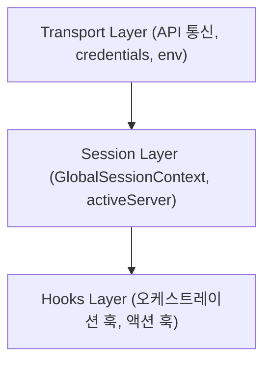

# @chatic/web-core

이 패키지는 Chatic 웹 클라이언트 어플리케이션들의 핵심 비즈니스 로직, 세션 관리(로그인/로그아웃, 토큰 갱신, 세션 전환), 저수준 통신 계층(`webTransport`), 그리고 공통 React Hooks를 소유하는 Core 패키지입니다.

---

## 핵심 도메인 구조

`web-core`는 크게 3가지 계층으로 이루어져 있으며, 각 영역은 독립된 역할과 경계를 가집니다.



### 1) Session Layer (세션 계층)

- **Source of Truth**: 사용자 신원(`identityCore`), 중계 서버 세션(`relayCore`), 클라우드 서버 세션(`cloudCore`) 상태를 모아서 하나의 단일 전역 상태(`GlobalSessionContext`)로 소유합니다.
- **activeServer**: 현재 활성화되어 활발히 사용되고 있는 활성 서버 스코프(중계 혹은 특정 클라우드) 정보를 계산하여 외부(예: `@chatic/app-runtime`)에 노출합니다.

### 2) Transport Layer (통신 계층)

- Chatic API를 호출하기 위한 저수준 클라이언트(`webTransport`) 설정을 가집니다.
- 환경 정보, 기기 설정, 스토리지 어댑터 등을 주입받아 API Request Builder 및 토큰 주입 흐름을 관장합니다.
- 외부에 노출하는 환경 상수(`ENV`/`PROJECT`/`WS_ENDPOINT`/`OAUTH_ENDPOINT`/`SOCIAL_OAUTH_ENDPOINT`/`DOU_ENDPOINT`/`startWebCoreInit`/`LANGUAGE_KEY`)는 transport 클라이언트와 구분해 `src/config`로 묶어 재노출합니다. 값 해석 규칙은 [통신 런타임 초기화 모델](docs/transport/runtime-model.md)을 따릅니다.

### 3) Hooks Layer (인증 및 라이프사이클 오케스트레이션)

- 세션의 생명주기를 자동으로 제어하는 백그라운드 오케스트레이션 훅과 액션 훅들을 소유합니다.
- 예: 중계 서버 로그인 상시 유지, 디바이스 ID 관리, 사이트/클라우드 전환 액션 등. (소켓 토큰의 주기 리프레시는 SDK `AuthController`가 소유하며 web-core 훅이 아닙니다.)

---

## 핵심 Hooks 사용 방법

### 1. 웹코어 런타임 초기화 (`useInitWebCore`)

어플리케이션이 시작될 때 스토리지 어댑터와 자격 증명을 사용하여 통신 런타임을 선행 구축합니다.

```typescript
import { useInitWebCore } from '@chatic/web-core';

const MyInitializer = () => {
  const isReady = useInitWebCore();

  if (!isReady) {
    return <LoadingSpinner />; // 초기화 완료 전 대기
  }
  return <AppContent />;
};
```

### 2. 전역 세션 관측 및 서버 스코프 획득 (`useGlobalSession`)

로그인 유저 정보 및 현재 활성화된 서버 정보(`activeServer`)를 실시간으로 구독합니다.

```typescript
import { useGlobalSession } from '@chatic/web-core';

const ServerBadge = () => {
  const { identity, activeServer } = useGlobalSession();

  // 프로필(이름/사진/역할)은 session이 아니라 app 레이어(useProfileFacts)에서 파생합니다.
  return (
    <div>
      <p>userId: {identity.userId}</p>
      <p>현재 연결 서버: {activeServer.kind} (Site ID: {activeServer.siteId})</p>
    </div>
  );
};
```

### 3. 세션 조작 및 비즈니스 액션

로그인, 로그아웃, 클라우드/사이트 전환은 `hooks/session/actions`의 개별 액션 훅으로 실행합니다.

```typescript
import { useLogoutCloudSession, useSessionLogout, useSwitchCloudSession } from '@chatic/web-core';

const SessionControls = () => {
  const { logoutCloudSession } = useLogoutCloudSession(); // cloud만 종료(relay 유지)
  const logout = useSessionLogout();                      // relay 전체 로그아웃(콜백)
  const { switchCloud } = useSwitchCloudSession();

  return <button onClick={() => logoutCloudSession()}>클라우드 세션 종료</button>;
};
```

### 4. 백그라운드 세션 오케스트레이션

- `useRelaySessionKeepAlive(enabled)`: relay 세션이 부재하면 백그라운드 게스트 로그인으로 복구합니다.
- `useInitWebCore()`: 웹코어 초기화 단일 드라이버(1회).
- `useDynamicDeviceId()`: 브라우저/디바이스 식별키 해석·유지.

---

## 문서 가이드 (Documentation Guide)

각 영역의 구체적인 아키텍처 규칙과 상태 모델은 `docs/` 디렉토리에 정의되어 있습니다.

- **[세션 계층과 Source of Truth](docs/session/context-model.md)**: 세션 데이터 모델 스키마와 activeServer 계산 규칙
- **[세션 시나리오 명세](docs/session/session-scenarios.md)**: 클라우드/사이트 전환, 토큰 갱신, 로그아웃 동작 흐름
- **[공개 세션 API](docs/session/public-api.md)**: 세션 핵심 메서드 명세
- **[통신 런타임 초기화 모델](docs/transport/runtime-model.md)**: webTransport 설정 및 init 가이드
- **[백그라운드 오케스트레이션 훅 정책](docs/hooks/orchestration.md)**: KeepAlive·디바이스 등록 등 lifecycle 훅 구동 스펙
- **[공개 훅 목록](docs/hooks/public-surface.md)**: 노출되는 훅과 시나리오 매핑 정리
