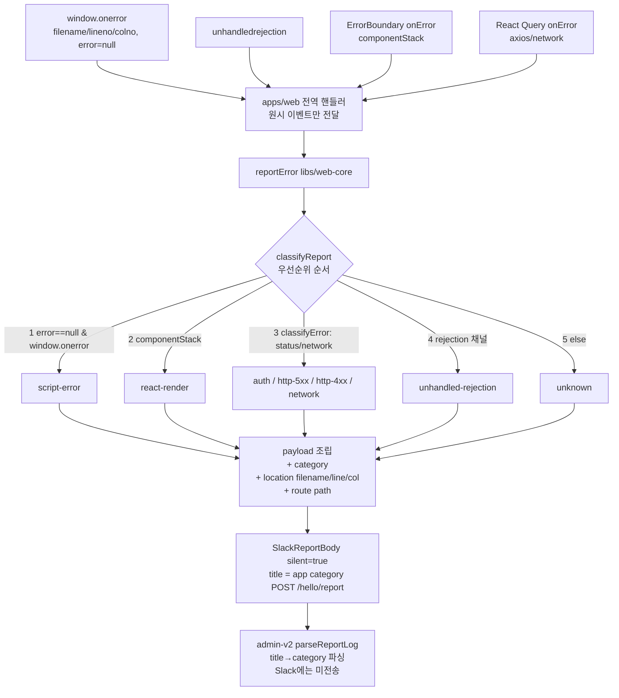

# 에러 리포트 (Error Reporting)

> 상태: Live · 최종 갱신: 2026-08-21 · 관련 ADR: [ADR-0029](../../../docs/adr/0029-error-report-categorization-and-enrichment.md) · [ADR-0047](../../../docs/adr/0047-unified-logging-core-and-report-traceability.md)
>
> ADR-0047로 감지 커버리지·카테고리가 확장됐다.
> **2026-08-21: 리포트의 breadcrumb 첨부는 폐지됐다** — `reportError`·`reportIssue` 어느 쪽도 로그를 싣지 않는다.
> 로그는 배치 업로더가 엔트리 낱건으로 `/hello/report-bulk`에 올리고, 리포트와는 `runId`/`uid`로 맞춘다.
> 통합 로깅 전체 그림은 [libs/logger/docs/architecture.md](../../logger/docs/architecture.md) 참고.

## 목적

프런트(web / 모바일 WebView / admin-v2 자신)에서 발생한 런타임 에러와 사용자 이슈 제보를 서버(`/hello/report`)로 보내 admin-v2 리포트 목록으로 트리아지하기 위한 텔레메트리 경로다. 이 문서는 그중 **자동 에러 리포트**(`reportError`)를 다룬다. **`reportError`는 항상 `silent: true`로 보내 Slack에는 안 올라가고 admin-v2에만 쌓인다** — 사람이 직접 제출하는 이슈 제보(`reportIssue`, ADR-0017)와 달리 자동 리포트는 실시간 알림감이 아니라는 판단. 스로틀을 뗀 뒤로는 에러 스톰이 그대로 Slack 알림 폭주로 튀는 걸 막는 안전장치이기도 하다.

해결하려는 것: 현재 모든 자동 리포트가 `[mobile] error` 한 제목으로 뭉뚱그려져 열어보기 전엔 성격을 알 수 없고, `"Script error."`는 원본이 지워진 채 도착하며, 스로틀이 서로 다른 에러를 한 버킷으로 붕괴시켜 신호를 잃는다.

## 설계 원칙

- **분류는 출처/종류 기준으로 한다.** HTTP status 중심의 `classifyError`와 별개로, "에러가 어디서 어떻게 발생했는가"(script / rejection / react-render / network / http / unknown)를 1차 축으로 삼는다. 트리아지의 첫 질문이 "무슨 종류냐"이기 때문이다.
- **category는 타이틀과 payload 양쪽에 둔다.** 타이틀은 사람이 목록에서 즉시 읽는 용도, payload 필드는 admin이 필터/집계하는 용도 — 둘의 소비자가 다르다.
- **opaque 에러도 버리지 않는다.** message/stack이 지워져도 브라우저가 주는 `filename/lineno/colno`와 직전 맥락(로그 tail·라우트)을 최대한 실어 "무슨 일 직후 어디서" 터졌는지 남긴다.
- **리포트 조립은 web-core 한 곳에 유지한다.** 전역 핸들러(apps/web)는 원시 이벤트만 넘기고, 분류·맥락 수집·페이로드 조립은 `libs/web-core`가 소유한다.
- **맥락에 담기는 로그는 재사용하되 중복 구현하지 않는다.** 이슈 제보가 쓰는 직렬화·수집 로직을 공유 위치로 끌어올려 `reportError`도 같은 것을 쓴다.

## 범위

**포함**

- 출처 기준 category 6종 도출 및 태깅.
- 타이틀 포맷 확장(`[app] error` → `[app] <category>`) + payload `category` 필드.
- `ErrorEvent`의 `filename/lineno/colno` 캡처.
- ~~`reportError`에 breadcrumb(링버퍼 로그 tail + 현재 라우트) 첨부.~~ (2026-08-21 폐지 — 로그는 배치 업로드가 낱건으로 나른다. 라우트는 `payload.path`로 남는다.)
- 스로틀 키를 category+message 조합으로 개선.
- admin-v2 `parseTitle`의 새 타이틀 포맷 대응(하위 호환 유지).

**제외**

- `"Script error."`의 실제 근본 원인 검증(네이티브 WebView 주입 스크립트 확인, `<script crossorigin>`+CORS, 소스맵 업로드/배포) → 별도 스파이크.
- 노이즈 감소(일시적 network 에러 silent/드롭/샘플링).
- 콘솔/로컬 `logger` 문구 개선.

## 시나리오

**S1. 크로스오리진 스크립트 예외 (opaque)**

1. WebView에서 `window.onerror`가 `message="Script error."`, `error=null`, `filename/lineno/colno`를 채워 발화.
2. 전역 핸들러가 `event.error ?? new Error(event.message)`와 함께 `{ filename, lineno, colno, source: 'window.onerror' }`를 `reportError`에 넘김.
3. `reportError`가 `error==null`(원시 이벤트에서 전달된 플래그) → category `script-error`로 분류.
4. payload에 `location: {filename, lineno, colno}`, `category: 'script-error'`, `path`(현재 라우트) 첨부. **합성 stack은 싣지 않고 `stackSynthetic: true`로 그 사실만 남긴다** — ADR-0047 P1. 위치는 `location`에만 두고 `message`에는 넣지 않는다: admin이 message로 그룹을 묶는데(`groupReportLogs`) 좌표가 발생마다·배포마다 달라 같은 버그가 매번 새 그룹이 되기 때문이다. admin 상세의 `Location` 섹션이 이 필드를 보여준다.
5. 타이틀 `[mobile] script-error`로 전송. 스로틀 키 = `script-error|Script error.` (filename까지 포함하면 원인별 분리).

**S2. 네트워크 에러**

1. axios가 `ERR_NETWORK` / `Network Error`를 던짐 → React Query `onError`(`source: 'query'`) → `reportError`.
2. `classifyError`가 NETWORK 판정 → category `network`. (rejection 채널로 들어와도 네트워크 성격이 우선이라 `network`로 분류된다.)
3. 타이틀 `[mobile] network`, payload에 `http.code`, `network.online` 첨부. **실패 요청의 URL·메서드가 `http.url`/`http.method`와 `message` 뒤에 노출된다** (`Network Error → POST /hello/chats`) — 어드민 목록에서 어떤 API가 죽었는지 즉시 식별 (ADR-0047).

**S3. React 렌더 에러**

1. `ErrorBoundary onError` → `reportError(error, { componentStack })`.
2. `componentStack` 존재 → category `react-render`.
3. 타이틀 `[mobile] react-render`.

**S4. HTTP 4xx/5xx/auth**

1. HTTP status가 있는 에러 → `classifyError`로 `auth`(403/토큰) / `http-5xx` / `http-4xx` 분류.
2. 타이틀 `[web] http-5xx` 등.

**S5. admin-v2 소비**

1. 리포트 목록이 새 타이틀 `[mobile] script-error`를 파싱 → app=`mobile`, category=`script-error`, type=`error`.
2. 과거 `[mobile] error` 레코드는 기존 매칭으로 그대로 error 타입 유지.

## 다이어그램



## 상세 구현

**핵심 파일과 역할**

- [`apps/web/src/app/app.tsx`](../../../apps/web/src/app/app.tsx) — 전역 캡처 6경로. 분류 판단은 하지 않고 원시 컨텍스트만 넘기며, **모든 경로가 `reportError` 전에 `logger.error('GLOBAL', …)`를 먼저 호출**해 에러 자체가 버퍼의 일급 엔트리가 된다 (ADR-0047):
    - `window.onerror` → `{ source: 'window.onerror', errorWasNull: event.error == null, filename, lineno, colno }`.
    - `unhandledrejection` → `{ source: 'unhandledrejection' }`.
    - capture-phase `error` (리소스 로드 실패) → `{ source: 'resource-error', categoryOverride: 'resource-error' }`.
    - `securitypolicyviolation` → `{ source: 'csp-violation', categoryOverride: 'csp-violation', filename, lineno }`.
    - React Query `QueryCache`/`MutationCache onError` → `{ source: 'query' }` / `{ source: 'mutation' }`.
    - `ErrorBoundary onError` → `{ source: 'error-boundary', componentStack }`.
- 부팅 경로(apps/web `main.tsx`) — `page-crash` 사후 리포트([pageCrashReporter](../../../apps/web/src/app/runtime/pageCrashReporter.ts))와 네이티브 지연 리포트 대리 전송([pendingReportFlusher](../../../apps/web/src/app/runtime/pendingReportFlusher.ts), `webview-crash`/`native-error`/`native-crash`)이 `categoryOverride`+`occurredAt`으로 같은 `reportError`를 탄다.
- [`apps/admin-v2/.../globalErrorCapture.ts`](../../../apps/admin-v2/src/app/globalErrorCapture.ts) + [`app.tsx`](../../../apps/admin-v2/src/app/app.tsx) — **admin-v2 자신의 전역 캡처 4경로** (`window.onerror` · `unhandledrejection` · `QueryCache`/`MutationCache onError`) + socket-lab `ErrorBoundary`. 2026-08-11 이전엔 admin-v2에 캡처가 **하나도 없어서**, 리포트를 읽는 도구 자신의 에러만 아무 데도 안 남았다 — 리포트 뷰어가 깨진 경우까지 포함해서. 웹의 6경로보다 좁은 건 의도적이다: `resource-error`/`csp-violation`은 모바일 WebView의 opaque `Script error.` 추적용이라 내부 데스크톱 도구엔 해당이 없다.
- [`libs/web-core/src/api/reportCategory.ts`](../src/api/reportCategory.ts) — `classifyReport(error, ctx): ErrorCategory` (신규). 아래 우선순위로 category 도출, HTTP·network는 `classifyError` 재활용.
- [`libs/web-core/src/api/common.ts`](../src/api/common.ts) — `reportError(error, context?: ErrorReportContext)`:
    - 진입 즉시 `classifyReport` 호출 → category. `errorAt`(=`occurredAt` ?? now) 기록.
    - **스로틀 없음** — 동일 (category+message)도 매번 그대로 보낸다(아래 "스로틀 제거" 참고).
    - 타이틀의 `app`은 `resolveAppType()`이 정한다: `isNative()`면 `mobile`, 아니면 `WEB_PROJECT`(=`VITE_PROJECT`)에 `admin`이 들어있는지로 `admin`/`web`을 가른다. **호출부가 자기 정체를 선언하지 않아도 갈리는 게 요점** — admin은 이미 `CHATIC_ADMIN`으로 배포되고 있어서 별도 설정이 필요 없고, 이 구분이 없으면 admin 자신의 에러가 `[web]`으로 저장돼 프런트 리포트 사이에 섞인다.
    - **로그는 싣지 않는다(2026-08-21).** 엔트리는 배치 업로더가 낱건으로 서버에 올리고 리포트와는 `runId`/`uid`로 맞춘다 — 첨부하면 같은 로그가 두 벌 저장되고, `reportIssue` 쪽은 그 사본만 공유 Slack 채널로도 나간다. 남는 라우트 단서는 `payload.path` 하나다. `LogSource`·`collectBreadcrumbs`·`logsOverride`는 함께 제거됐다.
    - `payload.location`: context의 `filename/lineno/colno` (하나라도 있으면). `errorWasNull`이면 합성 stack 미첨부 + `stackSynthetic: true`.
    - `payload.causes`: [`collectCauses`](../src/api/errorCause.ts)가 편 `error.cause` 체인(바깥→안). **감싼 에러의 `stack`은 감싼 자리를 가리키므로, 무엇이 깨졌는지는 여기에만 남는다** — React가 렌더 실패를 `new Error(msg, { cause })`로 감싸는 게 대표 사례라(`Minified React error #520`의 진짜 원인이 cause에 매달려 온다), 이게 없으면 리포트가 재던진 코드만 지목한다. 깊이 5 · stack당 4천자 · 총 1만2천자 상한이고 순환 체인도 끊는다. 합성 stack이어도 cause는 싣는다 — 합성된 건 바깥 껍데기뿐이다.
    - 요청 실패면 [`describeHttp`](../src/api/httpContext.ts)가 `payload.http`에 **실패한 요청의 전모**를 담는다: `url`(baseURL 합친 절대경로)·`method`·`params`·`requestBody`·`status`·`statusText`·`code`·`responseData`. "Network Error" 한 줄로는 손댈 곳을 알 수 없고, 클라 버그인지 서버 버그인지는 **보낸 것과 돌아온 것을 나란히 봐야** 갈린다. body·params는 `redactSensitive` + `truncate`를 거친다 — 요청 body엔 비밀번호가, 응답엔 개인정보가 흔히 들어있어 그대로 저장하면 안 된다. axios가 body를 문자열로 들고 있어 JSON이면 파싱해서 담는데, 그래야 사람이 읽을 수 있고 **무엇보다 redact가 키를 볼 수 있다**. admin 상세는 이걸 `HTTP · Request` / `HTTP · Response` 두 섹션으로 갈라 보여준다.
    - **`http.reason`은 서버가 말한 실패 사유**다. axios는 본문에 뭐가 있든 `Request failed with status code 500`으로 던지므로, 이걸 뽑지 않으면 진짜 이유가 `responseData` 안에만 남고 admin 목록에서는 원인이 제각각인 500이 **한 줄로 뭉친다**. 본문 형태 4가지(문자열 · `{error}` · `{message}` · `{error:{message}}`)를 본다.
    - message 뒤에 붙는 것은 **`: <사유>`와 `→ METHOD url` 둘뿐**이다. 사유도 URL도 원인마다 고정된 값이라 그룹을 의미 있게 갈라주지만, 좌표처럼 발생마다 바뀌는 값은 붙이지 않는다(200자 상한). 200 + `{error}` 경로는 `throwIfApiError`가 이미 그 문구를 `error.message`로 던져놨으므로 중복으로 붙이지 않는다.
    - `payload.timestamp = errorAt` (지연 리포트는 감지 시각).
    - 타이틀 `` `[${app}] ${category}` ``.
- [`libs/web-core/src/transport/error.ts`](../src/transport/error.ts) — `classifyError`/`isNetworkError`. `classifyReport`가 재활용(변경 없음).
- [`libs/web-core/src/api/types/common.ts`](../src/api/types/common.ts) — `ErrorCategory` union, `ErrorReportContext` 인터페이스 추가. `ErrorReportPayload`에 `category`/`location?`/`path?` 추가 (`logs?`는 2026-08-21 제거).
- [`libs/logger/src/serialize.ts`](../../logger/src/serialize.ts) — `serializeLogs`/`safeStringify`/`SerializedLog`·char budget 상수. **이슈 제보 전용이던 이 로직을 `apps/web`에서 `libs/logger`로 이동**했다. 리포트가 로그를 싣지 않게 된 뒤로 남은 소비자는 기기 영속화(모바일 MMKV)와 wire 직렬화다.
- [`apps/admin-v2/.../report-logs/lib/parseReportLog.ts`](../../../apps/admin-v2/src/app/features/report-logs/lib/parseReportLog.ts) — `parseTitle`이 `[app] <category>`에서 category 추출(알려진 category Set 대조). 없으면 payload `category` 필드로 폴백. `[app] error`·`[app] issue:` 매칭 유지. `ReportLogRow.category?` 추가.

**category 분류 우선순위** ([`reportCategory.ts`](../src/api/reportCategory.ts), 위→아래 먼저 매칭):

0. `categoryOverride` 존재 → 그대로 (감지 시점에 종류가 확정된 리포트: `resource-error` / `csp-violation` / `page-crash` / `webview-crash` / `native-error` / `native-crash`, ADR-0047)
1. `errorWasNull && source==='window.onerror'` → `script-error`
2. `componentStack` 존재 → `react-render`
3. `classifyError` 결과 → `auth`(403/토큰) / `http-5xx` / `http-4xx` / `network`
4. `source==='unhandledrejection'` (성격 불명일 때만) → `unhandled-rejection`
5. else → `unknown`

> 설계 노트: `unhandled-rejection`은 3번(에러의 HTTP/network 성격) **뒤**의 폴백이다. rejection으로 들어온 axios/네트워크 에러도 성격대로 `network`/`http-*`로 분류되게 하려는 의도 — 배달 채널보다 에러의 본질이 트리아지에 더 유용하기 때문.

## 검증 방법

- `libs/web-core/src/api/reportCategory.spec.ts` — `classifyReport` 8케이스(script-error / react-render / 403·500·404 / ERR_NETWORK / rejection+network / rejection+불명 / 완전 불명). rejection이 network 성격을 가릴 수 없음을 명시 검증.
- `libs/logger/src/serialize.spec.ts` — 이동된 `serializeLogs`의 char budget·circular·Error 펼침·시간순 유지 회귀.
- `apps/admin-v2/.../parseReportLog.spec.ts` — 새 타이틀 `[mobile] script-error` category 추출, 과거 `[mobile] error` 하위 호환(category undefined), payload `category` 폴백.
- 실행: `nx run @chatic/logger:test` (40 pass) · `nx run web-core:test` (71 pass) · `nx run admin-v2:test` (58 pass). 타입체크는 변경 파일 클린(무관한 self-chat/PlaceProfile WIP 에러는 별개).
- 라이브 리포트 발화는 공유 엔드포인트(`/hello/report`)로 실 POST가 나가는 외부 부작용이라 유닛 테스트로 대체.

## minified 스택 읽기

리포트의 스택은 텍스트로 저장돼 admin에서 읽을 때는 devtools가 없다 — 전 프레임이 `index-<hash>.js:2:845134` 꼴이다. 되짚는 경로는 둘이고, 목적이 다르다. 아래는 왜 이 구조인지를 남기는 곳이고, **단계별 사용법·문제 해결은 [docs/guides/trace-report.md](../../../docs/guides/trace-report.md)** 에 있다.

### 1) IDE로 가져오기 (기본)

admin-v2 리포트 상세의 Stack 섹션 **"IDE로 추적"** → 리포 루트에서 `yarn trace`. 스택 전체가 `apps/web/src/app/hooks/useMyProfile.ts:42:7` 꼴로 풀려 나오고, 이 경로는 VS Code·JetBrains 터미널이 링크로 잡아 클릭하면 그 줄로 점프한다.

Stack 섹션이 보여주고 복사하는 것은 `stack` 단독이 아니라 **`cause` 체인까지 이어붙인 한 덩어리**다([`composeStackText`](../../../apps/admin-v2/src/app/features/report-logs/lib/traceBlob.ts), `Caused by:` 포맷). 한 번의 해석으로 cause 프레임까지 같이 풀리는데, 감싼 에러의 stack은 감싼 자리를 가리키므로 **정작 읽을 값이 있는 프레임은 대개 cause 쪽**이다.

```bash
yarn trace                      # 클립보드에서 읽는다
pbpaste | yarn trace            # stdin 도 된다
yarn trace --map <file.js.map>  # 맵을 이미 갖고 있으면 조회를 건너뛴다
yarn trace --project admin-v2   # app→project 추정을 덮어쓴다
```

복사 버튼이 붙이는 헤더(`# chatic-report app=... webVersion=... at=...`)가 [`scripts/trace-report.js`](../../../scripts/trace-report.js)에 두 가지를 알려준다: **어느 CI 프로젝트가 그 번들을 만들었는지**(`app`; 모바일은 web 빌드를 얹은 WebView라 둘 다 `web`), 그리고 **에러가 언제 났는지**(`at`; 그 이후에 배포된 아티팩트는 후보에서 뺀다). 받아온 맵은 `.sourcemaps/`(gitignore)에 번들명으로 캐시된다 — 번들명이 콘텐츠 해시라 이름이 맞으면 빌드가 맞고, 캐시가 다른 빌드의 맵을 내줄 수 없다.

풀린 경로 중 **체크아웃에 없는 파일**이 있으면 따로 알린다. 해석이 틀린 게 아니라 리포트가 나온 빌드와 로컬 커밋이 다르다는 뜻이고, 그대로 클릭하면 아무것도 열리지 않는다.

### 2) admin 화면에서 바로 보기

브라우저를 떠나지 않고 훑고 싶을 때는 Stack 섹션의 **"소스맵 선택"**으로 `.map` 파일을 직접 고른다([`ReportDetailDrawer`](../../../apps/admin-v2/src/app/features/report-logs/components/ReportDetailDrawer.tsx)). 파일은 브라우저에서만 읽히고 업로드되지 않는다. 디코더는 CLI와 같은 것을 [`lib/resolveStack.ts`](../../../apps/admin-v2/src/app/features/report-logs/lib/resolveStack.ts)로 포팅한 것이다(약 120줄·5MB 맵 60ms라 라이브러리나 워커를 둘 이유가 없다).

### 맵은 어디서 오나

**배포에는 실리지 않는다.** 공개 경로에 올리면 `sourcesContent`로 소스 전체가 그대로 노출되므로 배포 스크립트가 `*.map`을 sync에서 제외한다. 대신 dev·PROD 배포마다 CI가 `sourcemaps-<project>-<sha>` 아티팩트로 보관한다(`deploy-dev.yml` / `deploy-prod.yml`, 30일). PROD도 맵을 만든다 — `sourcemap: 'hidden'`이라 번들에 `sourceMappingURL` 주석이 남지 않으므로, 서비스되지 않는 파일을 devtools가 404로 찾아가는 일도 없다. (`desktop-web`은 아직 PROD에서 맵을 만들지 않는다.)

**어느 아티팩트인지는 번들 해시로 맞춘다.** 스택 프레임이 `index-<hash>.js`를 말하므로 `index-<hash>.js.map`이 들어 있는 아티팩트가 정답이고, 이 일치가 곧 검증이다. 다른 빌드의 맵을 쓰면 열 좌표가 어긋나 **조용히 엉뚱한 줄로 풀린다** — 그래서 `yarn trace`는 이름이 맞는 맵만 캐시에서 집고, admin은 이름이 다르면 경고한다. 한 스택이 번들 여러 개를 걸치면 맵은 **자기 번들의 프레임에만** 적용된다(줄/열 조회는 아무 맵으로나 성공하므로, 안 그러면 남의 번들 프레임이 엉뚱한 파일로 풀린다).

스택이 없는 리포트(opaque `script-error`)는 `location.filename`이 번들 URL을, `payload.webVersion`이 릴리스를 말해준다.

## 남은 후속 (별도 트래킹)

- **`"Script error." 근본 원인 스파이크**: `event.error==null`의 실제 원인(네이티브 WebView 주입 스크립트 vs 서드파티), `<script crossorigin>`+CORS. — ADR-0047로 원인군 감지 장치는 갖춰짐: 주입 스크립트 try/catch 가드(P2, tag INJECTION), `csp-violation`/`resource-error` 캡처. 남은 것은 실데이터 상관관계 관찰.
- ~~**admin에서의 소스맵 해석**~~ → **해결됨.** 위 "minified 스택 읽기" 두 경로 참고. 남은 것은 **맵을 사람이 들고 오지 않아도 되게 하는 것** — 비공개 스토어에 올려두고 빌드 키로 조회하면 `gh` 없이도 되고 admin이 스스로 맵을 가져올 수 있다. 인프라·백엔드 의존이라 별도 트랙.
- **민감정보**: ~~ADR-0017 v1 정책대로 redact 미적용~~ → **적용됨([ADR-0050](../../../docs/adr/0050-redact-report-breadcrumbs.md)).** `safeStringify`가 `SENSITIVE_KEYS`에 걸리는 키의 값을 `[REDACTED]`로 가린다(중첩·배열 원소 포함). `serializeLogs`의 소비자가 리포트·영속화 전부라 한 곳에서 전 구간에 걸린다. 남은 구멍은 **문자열 안에 박힌 비밀** — 키가 없으면 판단할 수 없어 통과한다. `message`에 토큰을 직접 넣는 호출부가 있으면 그건 호출부에서 고쳐야 한다.
- ~~**스로틀 키**~~ → **2026-08-11, 스로틀 자체를 제거함.** 60초 내 동일 (category+message) 중복을 드롭하던 로직이 반복 빈도 자체를 지웠다 — 짧은 시간에 몰리는 에러가 admin엔 "1건"으로만 보여 실제 심각도를 과소평가하게 만들었다. 이제 매번 그대로 admin에 쌓인다. **뒤이은 트레이드오프(같은 날 해결)**: 스로틀이 없으니 에러 스톰이 나면 그 횟수만큼 `/hello/report` 호출도 그대로 반복된다 — 그게 Slack 알림 폭주로 튀지 않도록 `reportError`를 항상 `silent: true`로 고정했다(`save: true`는 유지 — admin 리포트 목록은 그대로 다 쌓인다). 남은 비용은 `/hello/report` 호출 자체의 빈도(백엔드 부하)뿐이고, 이건 여전히 관찰 대상이다.
- **타이틀 하위 호환**: Slack 라우팅/기존 대시보드가 `[app] error` 문자열에 의존하는지 미확인. 문제 시 `[app] error:<category>`로 `error` 접두 유지하는 절충안으로 전환(타이틀 템플릿 한 줄).
