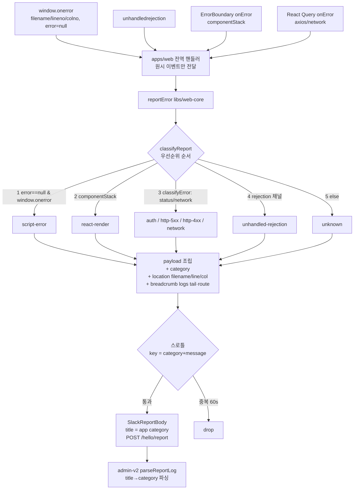

# 에러 리포트 (Error Reporting)

> 상태: Live · 최종 갱신: 2026-07-24 · 관련 ADR: [ADR-0029](../../../docs/adr/0029-error-report-categorization-and-enrichment.md)

## 목적

프런트(web / 모바일 WebView)에서 발생한 런타임 에러와 사용자 이슈 제보를 서버(`/hello/report`)로 보내 Slack 알림 + admin-v2 리포트 목록으로 트리아지하기 위한 텔레메트리 경로다. 이 문서는 그중 **자동 에러 리포트**(`reportError`)를 다룬다. 사용자 대면 이슈 제보(`reportIssue`)는 ADR-0017 참고.

해결하려는 것: 현재 모든 자동 리포트가 `[mobile] error` 한 제목으로 뭉뚱그려져 열어보기 전엔 성격을 알 수 없고, `"Script error."`는 원본이 지워진 채 도착하며, 스로틀이 서로 다른 에러를 한 버킷으로 붕괴시켜 신호를 잃는다.

## 설계 원칙

- **분류는 출처/종류 기준으로 한다.** HTTP status 중심의 `classifyError`와 별개로, "에러가 어디서 어떻게 발생했는가"(script / rejection / react-render / network / http / unknown)를 1차 축으로 삼는다. 트리아지의 첫 질문이 "무슨 종류냐"이기 때문이다.
- **category는 타이틀과 payload 양쪽에 둔다.** 타이틀은 사람이 목록에서 즉시 읽는 용도, payload 필드는 admin이 필터/집계하는 용도 — 둘의 소비자가 다르다.
- **opaque 에러도 버리지 않는다.** message/stack이 지워져도 브라우저가 주는 `filename/lineno/colno`와 직전 맥락(로그 tail·라우트)을 최대한 실어 "무슨 일 직후 어디서" 터졌는지 남긴다.
- **리포트 조립은 web-core 한 곳에 유지한다.** 전역 핸들러(apps/web)는 원시 이벤트만 넘기고, 분류·맥락 수집·페이로드 조립은 `libs/web-core`가 소유한다.
- **맥락에 담기는 로그는 재사용하되 중복 구현하지 않는다.** 이슈 제보가 쓰는 직렬화·수집 로직을 공유 위치로 끌어올려 `reportError`도 같은 것을 쓴다.

## 범위

**포함**

- 출처 기준 category 6종 도출 및 태깅.
- 타이틀 포맷 확장(`[app] error` → `[app] <category>`) + payload `category` 필드.
- `ErrorEvent`의 `filename/lineno/colno` 캡처.
- `reportError`에 breadcrumb(링버퍼 로그 tail + 현재 라우트) 첨부.
- 스로틀 키를 category+message 조합으로 개선.
- admin-v2 `parseTitle`의 새 타이틀 포맷 대응(하위 호환 유지).

**제외**

- `"Script error."`의 실제 근본 원인 검증(네이티브 WebView 주입 스크립트 확인, `<script crossorigin>`+CORS, 소스맵 업로드/배포) → 별도 스파이크.
- 노이즈 감소(일시적 network 에러 silent/드롭/샘플링).
- 콘솔/로컬 `logger` 문구 개선.

## 시나리오

**S1. 크로스오리진 스크립트 예외 (opaque)**

1. WebView에서 `window.onerror`가 `message="Script error."`, `error=null`, `filename/lineno/colno`를 채워 발화.
2. 전역 핸들러가 `event.error ?? new Error(event.message)`와 함께 `{ filename, lineno, colno, source: 'window.onerror' }`를 `reportError`에 넘김.
3. `reportError`가 `error==null`(원시 이벤트에서 전달된 플래그) → category `script-error`로 분류.
4. payload에 `location: {filename, lineno, colno}`, `category: 'script-error'`, breadcrumb(로그 tail + route) 첨부.
5. 타이틀 `[mobile] script-error`로 전송. 스로틀 키 = `script-error|Script error.` (filename까지 포함하면 원인별 분리).

**S2. 네트워크 에러**

1. axios가 `ERR_NETWORK` / `Network Error`를 던짐 → React Query `onError`(`source: 'query'`) → `reportError`.
2. `classifyError`가 NETWORK 판정 → category `network`. (rejection 채널로 들어와도 네트워크 성격이 우선이라 `network`로 분류된다.)
3. 타이틀 `[mobile] network`, payload에 `http.code`, `network.online`, breadcrumb 첨부.

**S3. React 렌더 에러**

1. `ErrorBoundary onError` → `reportError(error, { componentStack })`.
2. `componentStack` 존재 → category `react-render`.
3. 타이틀 `[mobile] react-render`.

**S4. HTTP 4xx/5xx/auth**

1. HTTP status가 있는 에러 → `classifyError`로 `auth`(403/토큰) / `http-5xx` / `http-4xx` 분류.
2. 타이틀 `[web] http-5xx` 등.

**S5. admin-v2 소비**

1. 리포트 목록이 새 타이틀 `[mobile] script-error`를 파싱 → app=`mobile`, category=`script-error`, type=`error`.
2. 과거 `[mobile] error` 레코드는 기존 매칭으로 그대로 error 타입 유지.

## 다이어그램

## 상세 구현

**핵심 파일과 역할**

- [`apps/web/src/app/app.tsx`](../../../apps/web/src/app/app.tsx) — 전역 캡처 4경로. 분류 판단은 하지 않고 원시 컨텍스트만 넘긴다:
    - `window.onerror` → `{ source: 'window.onerror', errorWasNull: event.error == null, filename, lineno, colno }`.
    - `unhandledrejection` → `{ source: 'unhandledrejection' }`.
    - React Query `QueryCache`/`MutationCache onError` → `{ source: 'query' }` / `{ source: 'mutation' }`.
    - `ErrorBoundary onError` → `{ source: 'error-boundary', componentStack }`.
- [`libs/web-core/src/api/reportCategory.ts`](../src/api/reportCategory.ts) — `classifyReport(error, ctx): ErrorCategory` (신규). 아래 우선순위로 category 도출, HTTP·network는 `classifyError` 재활용.
- [`libs/web-core/src/api/common.ts`](../src/api/common.ts) — `reportError(error, context?: ErrorReportContext)`:
    - 진입 즉시 `classifyReport` 호출 → category.
    - 스로틀 키 `` `${category}|${error.message}` ``.
    - breadcrumb: `logBuffer.peek().slice(-RECENT_LOG_COUNT)`(50개) → `serializeLogs` → `payload.logs`, `payload.path = window.location.pathname`.
    - `payload.location`: context의 `filename/lineno/colno` (하나라도 있으면).
    - 타이틀 `` `[${app}] ${category}` ``.
- [`libs/web-core/src/transport/error.ts`](../src/transport/error.ts) — `classifyError`/`isNetworkError`. `classifyReport`가 재활용(변경 없음).
- [`libs/web-core/src/api/types/common.ts`](../src/api/types/common.ts) — `ErrorCategory` union, `ErrorReportContext` 인터페이스 추가. `ErrorReportPayload`에 `category`/`location?`/`logs?: SerializedLog[]`/`path?` 추가.
- [`libs/logger/src/serialize.ts`](../../logger/src/serialize.ts) — `serializeLogs`/`safeStringify`/`SerializedLog`·char budget 상수. **이슈 제보 전용이던 이 로직을 `apps/web`에서 `libs/logger`로 이동**해 `reportError`와 이슈 제보([`buildReportContext.ts`](../../../apps/web/src/app/features/issue-report/lib/buildReportContext.ts))가 `@chatic/bridges`를 통해 공유한다.
- [`apps/admin-v2/.../report-logs/lib/parseReportLog.ts`](../../../apps/admin-v2/src/app/features/report-logs/lib/parseReportLog.ts) — `parseTitle`이 `[app] <category>`에서 category 추출(알려진 category Set 대조). 없으면 payload `category` 필드로 폴백. `[app] error`·`[app] issue:` 매칭 유지. `ReportLogRow.category?` 추가.

**category 분류 우선순위** ([`reportCategory.ts`](../src/api/reportCategory.ts), 위→아래 먼저 매칭):

1. `errorWasNull && source==='window.onerror'` → `script-error`
2. `componentStack` 존재 → `react-render`
3. `classifyError` 결과 → `auth`(403/토큰) / `http-5xx` / `http-4xx` / `network`
4. `source==='unhandledrejection'` (성격 불명일 때만) → `unhandled-rejection`
5. else → `unknown`

> 설계 노트: `unhandled-rejection`은 3번(에러의 HTTP/network 성격) **뒤**의 폴백이다. rejection으로 들어온 axios/네트워크 에러도 성격대로 `network`/`http-*`로 분류되게 하려는 의도 — 배달 채널보다 에러의 본질이 트리아지에 더 유용하기 때문.

## 검증 방법

- `libs/web-core/src/api/reportCategory.spec.ts` — `classifyReport` 8케이스(script-error / react-render / 403·500·404 / ERR_NETWORK / rejection+network / rejection+불명 / 완전 불명). rejection이 network 성격을 가릴 수 없음을 명시 검증.
- `libs/logger/src/serialize.spec.ts` — 이동된 `serializeLogs`의 char budget·circular·Error 펼침·시간순 유지 회귀.
- `apps/admin-v2/.../parseReportLog.spec.ts` — 새 타이틀 `[mobile] script-error` category 추출, 과거 `[mobile] error` 하위 호환(category undefined), payload `category` 폴백.
- 실행: `nx run @chatic/logger:test` (40 pass) · `nx run web-core:test` (71 pass) · `nx run admin-v2:test` (58 pass). 타입체크는 변경 파일 클린(무관한 self-chat/PlaceProfile WIP 에러는 별개).
- 라이브 리포트 발화는 공유 엔드포인트(`/hello/report`)로 실 POST가 나가는 외부 부작용이라 유닛 테스트로 대체.

## 남은 후속 (별도 트래킹)

- **`"Script error." 근본 원인 스파이크**: `event.error==null`의 실제 원인(네이티브 WebView 주입 스크립트 vs 서드파티), `<script crossorigin>`+CORS.
- **minified 스택 해석(소스맵)**: 리포트 스택이 `index-<hash>.js:2:1101063`처럼 압축 좌표로 와서 못 읽는 문제는 소스맵으로 원본 위치를 되짚어야 한다. CDN CORS(인프라)와 PROD 비공개 맵 서빙(백엔드) 의존이 있어 인프라 준비 후 별도로 다룬다(현재 미착수).
- **민감정보**: breadcrumb 로그 tail은 ADR-0017 v1 정책대로 redact 미적용. tail 상한(50)·char budget(40k)로 크기는 제한. redact 적용은 이슈 제보와 함께 재검토.
- **스로틀 키**: 현재 `category|message`. `script-error`는 message가 다 같아 원인별 분리가 약하다 — `filename:lineno`까지 넣는 것은 배포마다 좌표가 바뀌는 과분리 위험이 있어 관찰 후 조정.
- **타이틀 하위 호환**: Slack 라우팅/기존 대시보드가 `[app] error` 문자열에 의존하는지 미확인. 문제 시 `[app] error:<category>`로 `error` 접두 유지하는 절충안으로 전환(타이틀 템플릿 한 줄).
