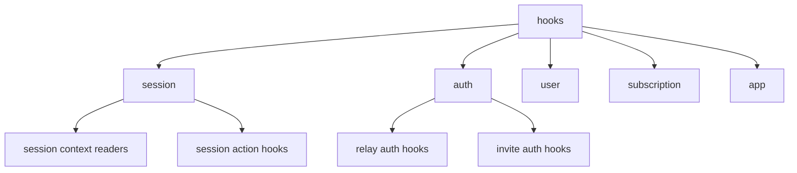

# Hooks Layer

## 목적

`hooks`는 `web-core` 외부 소비자가 세션과 도메인 기능을 읽고 요청하는 유일한 React 진입점입니다.

이 문서의 기본 원칙은 다음과 같습니다.

- 외부에서 읽을 수 있는 것은 `hook`과 `sessionContext`뿐입니다
- 외부에서 `...Core`, `transport`, 내부 store, service를 직접 읽으면 안 됩니다
- hook은 도메인별 폴더로 분류하고, 각 폴더 하위에 기능 단위 hook을 둡니다

## 현재 문제

현재 구조는 아래 문제가 있습니다.

- `hooks` 루트에 도메인과 기능이 섞여 있습니다
- `hooks/index.ts`가 과도하게 넓은 surface를 re-export 합니다
- 일부 hook은 session service를 감싸는 thin adapter가 아니라 내부 구현 결합이 강합니다
- `session/index.ts`가 hook까지 다시 export 하고 있어 공개 경계가 흐립니다

## 설계 원칙

### 1. 외부 읽기 진입점은 hook + sessionContext만 허용

허용:

- `useGlobalSession()`
- `useSessionAuth()`
- `useSessionIdentity()`
- `useSessionSelection()`
- 각 도메인 hook
- `getGlobalSessionContext()` 및 하위 session context getter

비허용:

- `cloudCore`, `relayCore`, `identityCore` 직접 접근
- `transport` 직접 접근
- `session/services` 직접 접근
- 내부 store나 signal 직접 접근

### 2. Hook은 도메인별 폴더 아래에 둔다

권장 구조:

```text
hooks/
  session/
    index.ts
    useGlobalSession.ts
    useSessionAuth.ts
    useSessionIdentity.ts
    useSessionSelection.ts
    useInitRelaySession.ts
    useRefreshRelaySession.ts
    useSwitchCloudSession.ts
    useRefreshCloudSession.ts
  auth/
    index.ts
    useLoginRelayGuestByDevice.ts
    useLoginRelaySocial.ts
    useLoginWithInviteCode.ts
    useLogoutRelaySession.ts
  user/
    index.ts
    useClouds.ts
    useUsers.ts
    useUpdateCloud.ts
  subscription/
    index.ts
    ...
  app/
    index.ts
    useServiceUnavailable.ts
```

원칙:

- 폴더는 도메인
- 파일은 기능 단위 hook
- `index.ts`는 해당 도메인에서 공개할 hook만 export

### 3. Hook은 읽기와 요청 연결만 담당

hook의 책임:

- React state/subscribe 연결
- session service 호출용 adapter
- query/mutation 구성
- UI 친화적인 조합 반환

hook의 비책임:

- 세션 상태 직접 변경
- `...Core` 직접 변경
- transport 직접 호출
- 도메인 규칙 계산

## 권장 공개 Surface

### session domain

유지 권장:

- `useGlobalSession()`
- `useSessionAuth()`
- `useSessionIdentity()`
- `useSessionSelection()`
- `useSessionLogout()`
- `useCloudSession()`
- `useAutoSelectCloud()`

정리 필요:

- `hooks/session.ts`에 여러 역할이 한 파일에 섞여 있음
- `useRestoreInvitedCloudSession`, `useRefreshCloudSiteSession`, `useCloudSessionCatalog`는 session 도메인 폴더 하위 기능 파일로 쪼개는 것이 좋음

### auth domain

유지 권장:

- relay/cloud 인증 관련 mutation hook

정리 필요:

- `useRegisterDevice`, `useLogin`, `useIssueToken` 등 이름이 service naming과 다름
- session service naming과 맞춰 hook naming도 재정렬 필요

권장 방향:

- `useLoginRelayGuestByDevice`
- `useLoginRelaySocial`
- `useLoginWithInviteCode`
- `useLogoutRelaySession`

### user domain

유지 권장:

- user/cloud 조회 및 수정 관련 query/mutation hook

### subscription domain

유지 권장:

- subscription 관련 query/mutation hook

### app domain

검토 대상:

- `useServiceUnavailable`
- `useInitWebCore`
- `useTokenRefresh`

이 셋은 session/auth 도메인과 app bootstrap 도메인이 섞여 있으므로, `app` 또는 `session` 하위로 재배치 기준을 정해야 합니다.

## 제거 또는 축소 후보

### 1. 루트 level hook 파일 남용

현재 루트에 있는 파일:

- `useCloudSession.ts`
- `useDelegatorId.ts`
- `useDynamicProfile.ts`
- `useInitWebCore.ts`
- `useProfile.ts`
- `useServiceUnavailable.ts`
- `useSwitchCloudSession.ts`
- `useTokenRefresh.ts`
- `useUpdateProfile.ts`

판단:

- 대부분 도메인 폴더 하위로 이동하는 것이 맞습니다
- 루트에는 `index.ts` 외 개별 hook 파일을 남기지 않는 방향이 더 좋습니다

### 2. session/index.ts에서 hook 재-export

현재 `session/index.ts`는 `../hooks/session`까지 export 합니다.

이건 제거하는 것이 맞습니다.

이유:

- session context와 hook 공개 경계가 뒤섞입니다
- 외부에서 `session` import만으로 hook까지 들어오면 계층 경계가 무너집니다

### 3. 내부 setter 노출

아래 계열은 외부 공개 surface에서 줄여야 합니다.

- `setSessionAuthenticated`
- `setSessionIdentityState`
- `setSessionProfile`
- `clearSessionProfile`

이 값들은 hook이나 외부 feature가 직접 다루는 것이 아니라 service 내부에서만 사용되는 방향이 맞습니다.

## 권장 도메인 분류안



## 검토 포인트

- `useTokenRefresh`를 session domain으로 둘지 app bootstrap domain으로 둘지
- `useInitWebCore`를 `initializeRelaySession` naming과 맞춰 재설계할지
- `useDynamicProfile`가 profile merge 제거 이후에도 필요한지
- `useDelegatorId`처럼 지나치게 얇은 selector hook을 유지할지, `useSessionIdentity()`로 통합할지
